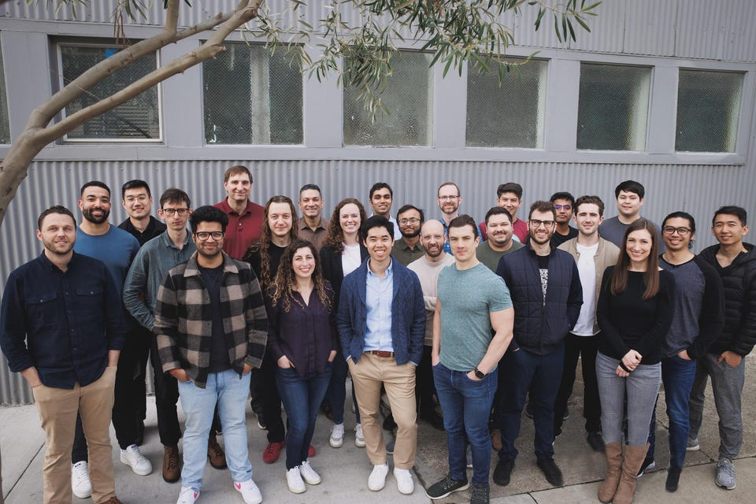

Traditionally, more complex software is harder to use. Nabeel Hyatt, general partner at Spark Capital, says that if Adept's team (pictured) achieves its full potential, this may no longer be the case.  

传统上，更复杂的软件更难使用。Spark Capital的普通合伙人Nabeel Hyatt说，如果Adept的团队（如图）实现了其全部潜力，这种情况可能不再存在。

Adept

Chatbots rule the day in AI for now, but soon, Adept cofounder David Luan predicts, AI won’t just display unsettlingly human responses to typed queries, it will execute them. It will do what you would do with your computer _for you._ Granted such technology is still years away, but the speed of innovation in the AI space means we’re talking about two to three years, according to Luan — not decades.  

聊天机器人目前在人工智能领域占主导地位，但很快，Adept公司的联合创始人David Luan预测，人工智能将不仅仅是对输入的查询显示令人不安的人类回应，它将执行这些回应。它将为你做你的电脑会做的事情。当然，这样的技术还需要几年的时间，但据Luan说，人工智能领域的创新速度意味着我们正在谈论两到三年的时间--而不是几十年。

A self-professed auto geek, Luan imagines a world where an engineer can ask an AI assistant to make a blueprint for a new car part and watch as it does exactly that, step-by-step, selecting the right software programs and inputting the necessary commands or code, with its human as copilot. Want to modify a portion of the design, test it in a car simulator software or send the blueprint to a manufacturer? In Luan’s vision, the AI would take care of all of that too.  

作为一个自称是汽车极客的人，Luan想象着这样一个世界：工程师可以要求人工智能助手为一个新的汽车零件绘制蓝图，并看着它一步步地完成这一工作，选择合适的软件程序并输入必要的命令或代码，而它的人则是副驾驶。想要修改设计的一部分，在汽车模拟器软件中进行测试，或者将蓝图发送给制造商？在卢安的设想中，人工智能也会处理所有这些事情。

Adept, barely a one-year-old startup with just 25 employees, has raised $350 million of venture capital after demoing a rudimentary version of such a digital assistant. Instead of generating text, like [OpenAI’s ChatGPT](https://www.forbes.com/sites/alexkonrad/2023/02/02/inside-chatggpts-breakout-moment-and-the-race-for-the-future-of-ai/?sh=4779a5cc240b "https://www.forbes.com/sites/alexkonrad/2023/02/02/inside-chatggpts-breakout-moment-and-the-race-for-the-future-of-ai/?sh=4779a5cc240b"), or images, like DALL-E, Adept intensely studied how humans use computers—from browsing the internet to navigating a complex enterprise software tool—to build an AI model that can turn a text command into sets of actions.  

Adept是一家刚成立一年、只有25名员工的创业公司，在演示了这种数字助理的初级版本之后，已经筹集了3.5亿美元的风险资本。Adept没有像OpenAI的ChatGPT那样生成文本，也没有像DALL-E那样生成图像，而是深入研究了人类如何使用计算机--从浏览互联网到浏览复杂的企业软件工具--以建立一个能够将文本命令转化为一系列动作的人工智能模型。

“A synthesizer lets a musician play sounds of every instrument without having to learn how to play every instrument. We want to build the same thing for computing,” Luan told _Forbes_.  

"合成器可以让音乐家演奏每种乐器的声音，而不必学习如何演奏每种乐器。我们想为计算机建立同样的东西，"卢安告诉福布斯。

General Catalyst and Spark Capital bankrolled the bulk of the Series B funding round, which was completed at a post-money valuation of at least $1 billion, per two sources involved with the deal. The core part of the financing was completed last fall, before ChatGPT [kicked off](https://www.forbes.com/sites/alexkonrad/2023/02/02/inside-chatggpts-breakout-moment-and-the-race-for-the-future-of-ai/ "https://www.forbes.com/sites/alexkonrad/2023/02/02/inside-chatggpts-breakout-moment-and-the-race-for-the-future-of-ai/") a consumer AI frenzy, according to Luan. General Catalyst, the largest stakeholder in the new round, beat out several competing term sheets to win its lead investment position, managing director Deep Nishar said.  

据参与交易的两位消息人士透露，General Catalyst和Spark Capital提供了B轮融资的大部分资金，该轮融资完成后的估值至少为10亿美元。据Luan说，融资的核心部分是在去年秋天完成的，当时ChatGPT掀起了一场消费者人工智能的狂潮。总经理迪普-尼沙尔(Deep Nishar)说，新一轮融资的最大股东General Catalyst击败了几个竞争性条款，赢得了其主导投资地位。

> A synthesizer lets a musician play sounds of every instrument without having to learn how to play every instrument. We want to build the same thing for computing.  
> 
> 合成器可以让音乐家演奏每一种乐器的声音，而不需要学习如何演奏每一种乐器。我们想为计算机建立同样的东西。

Part of the investor froth comes from the cofounders’ pedigree — rare among the flurry of founders who have flocked to start AI startups in recent months. “A lot of people talk the game, but it's very difficult for them to play the game,” Nishar said. “Have they actually built something like this before? What are their capabilities?” Luan, the CEO, was vice president of engineering at OpenAI before jumping to Google to lead its large model efforts. His cofounders Ashish Vaswani and Niki Parmar coauthored the Google research paper which invented the transformer, the AI breakthrough which represents the “T” in GPT. (Vaswani and Parmar recently departed to launch their own startup, according to a [report](https://www.theinformation.com/briefings/two-co-founders-of-adept-an-openai-rival-suddenly-left-to-start-another-company?rc=viwsit "https://www.theinformation.com/briefings/two-co-founders-of-adept-an-openai-rival-suddenly-left-to-start-another-company?rc=viwsit") from The Information, which also [previously reported](https://www.theinformation.com/articles/general-catalyst-spark-in-talks-to-back-openai-rival "https://www.theinformation.com/articles/general-catalyst-spark-in-talks-to-back-openai-rival") on Adept’s fundraising efforts; Luan declined to comment on the reason for the split.)  

投资者的热情部分来自于联合创始人的血统--这在最近几个月蜂拥而至创办人工智能初创企业的创始人中很罕见。"很多人都在谈论这个游戏，但他们很难玩这个游戏，"尼沙尔说。"他们以前真的建造过这样的东西吗？他们的能力是什么？"首席执行官Luan曾是OpenAI的工程副总裁，后来跳槽到谷歌，领导其大型模型工作。他的联合创始人Ashish Vaswani和Niki Parmar共同撰写了谷歌的研究论文，发明了变压器，这是代表GPT中 "T "的AI突破。(根据The Information的报道，Vaswani和Parmar最近离开了，推出了他们自己的创业公司，该网站之前也报道了Adept的筹款努力；Luan拒绝评论分裂的原因）。

Their deep machine learning expertise enabled Adept to craft a working demo called ACT-1 less than a year after it raised $65 million from venture firms Greylock and Addition. At the time, it performed tasks similar to ChatGPT, answering simple questions. In the months since then, it’s become capable of performing complex functions like importing LinkedIn URLs into recruiting software. Advancements like these have helped Adept line up strategic investors like Microsoft, Nvidia, Atlassian and Workday all of whom market software that might someday benefit from its AI assistant. Adept is raising additional money through these business alliances at a not-yet-finalized valuation which is poised to be higher than $1 billion, two sources said.  

他们的深度机器学习专业知识使Adept在从风险公司Greylock和Addition筹集到6500万美元后不到一年就制作了一个名为ACT-1的工作演示。当时，它执行的任务与ChatGPT类似，回答简单的问题。在那之后的几个月里，它已经能够执行复杂的功能，如将LinkedIn网址导入招聘软件。诸如此类的进步帮助Adept找到了微软、Nvidia、Atlassian和Workday等战略投资者，这些公司所销售的软件有一天可能会从其人工智能助手中受益。两位消息人士说，Adept正在通过这些商业联盟筹集更多资金，其估值尚未最终确定，预计将高于10亿美元。

Practically speaking, Adept’s ACT-1 displays as an overlay window on top of existing software like Google Chrome or Salesforce. A prototype is ready for desktop, but Luan said it will also be available on mobile in the future. The company has “commitments and targets on the revenue side” from a handful of partners, he added, but would not say when the public would be able to play with the AI assistant. “The degree of interest from the \[corporate investors\] I think shows some sense of the maturity \[of the product\],” he offered.  

实际上，Adept公司的ACT-1是作为现有软件（如谷歌浏览器或Salesforce）的一个叠加窗口显示的。一个用于桌面的原型已经准备好了，但Luan说它将来也会在移动端使用。他补充说，该公司有来自少数合作伙伴的 "收入方面的承诺和目标"，但不会说公众何时能够玩到这个人工智能助手。"他说："来自\[企业投资者\]的兴趣程度，我认为显示了\[产品\]的成熟度的某种意义。

> We don’t think about \[AGI\] from the perspective of how other companies think about it, which is replacing humans at valuable tasks.  
> 
> 我们没有从其他公司思考\[AGI\]的角度来考虑它，也就是在有价值的任务中取代人类。

Still, models for controlling computer actions are significantly less mature than their language model counterparts. That’s why a company that’s barely one year old can possibly justify raising hundreds of millions of dollars without plans for a massive hiring spree or big acquisition — training such models isn’t cheap. “We haven’t yet hit the optimization phase,” Luan said. “What we really want to do is train really powerful models that can do a lot, and then over time we’ll figure out how to make them cheaper and make them smaller.”  

尽管如此，控制计算机行动的模型仍明显不如它们的语言模型对应的模型成熟。这就是为什么一家成立不到一年的公司有可能在没有大规模招聘或大笔收购计划的情况下，有理由筹集数亿美元的资金--训练这种模型并不便宜。"我们还没有进入优化阶段，"Luan说。"我们真正想做的是训练真正强大的模型，可以做很多事情，然后随着时间的推移，我们会想出如何让它们更便宜，让它们更小。"

Adept’s rapid capital accumulation echoes the strategies of other model-building companies like Anthropic, Cohere and especially OpenAI, where Luan’s former boss Sam Altman raised a reported $10 billion from Microsoft earlier this year in a bid to outgun AI competitors. Like Altman, Luan too aspires to help the technology achieve artificial general intelligence, or “AGI,” a hypothetical AI system which is smart enough to make its own decisions without human input. One key difference: Luan’s AGI would be more boring and business-focused, with humans remaining in the driver’s seat.  

Adept公司的快速资本积累与Anthropic、Cohere，特别是OpenAI等其他模型构建公司的战略相呼应，栾树的前老板Sam Altman今年早些时候从微软那里筹集了100亿美元，以期超越人工智能竞争对手。与奥特曼一样，卢安也渴望帮助技术实现人工通用智能，或称 "AGI"，一种假想的人工智能系统，其智能程度足以在没有人类输入的情况下做出自己的决定。一个关键的区别是。卢安的AGI将更加枯燥乏味，以商业为重点，人类仍然坐在驾驶座上。

“We don’t think about it from the perspective of how other companies think about it, which is replacing humans at valuable tasks,” he said. “We’re just trying to build the best AI teammate possible for everybody.”  

"我们不从其他公司思考问题的角度来考虑它，也就是在有价值的任务上取代人类，"他说。"我们只是试图为每个人建立一个最好的人工智能队友。"

### MORE FROM FORBES 更多来自福布斯的信息

[MORE FROM FORBES 更多来自福布斯的信息Silicon Valley Bank's Abrupt Closure Leaves Venture Capitalists And Founders Scrambling  

硅谷银行的突然关闭让风险投资家和创始人手忙脚乱By Alex Konrad 作者：Alex Konrad](https://www.forbes.com/sites/alexkonrad/2023/03/10/silicon-valley-bank-closure-vc-startups-reaction/)[MORE FROM FORBES 更多来自福布斯的信息Buzzy Storytelling Startup Tome Raises $43 Million From A Who's Who In AI  

热闹的讲故事初创公司Tome获得4300万美元，来自人工智能领域的名人。By Alex Konrad 作者：Alex Konrad](https://www.forbes.com/sites/alexkonrad/2023/02/22/storytelling-ai-startup-tome-raises-43-million/)[MORE FROM FORBES 更多来自福布斯的信息Grammarly's Generative AI Feature Will Soon Be Able To Write, Interpret And Edit Text  

语法学的生成性人工智能功能将很快能够书写、解释和编辑文本By Rashi Shrivastava 作者：Rashi Shrivastava](https://www.forbes.com/sites/rashishrivastava/2023/03/09/grammarlys-generative-ai-feature-will-soon-be-able-to-write-interpret-and-edit-text/)[MORE FROM FORBES 更多来自福布斯的信息ChatGPT Won't Fix Healthcare, But It Might Save Doctors Some Time  

ChatGPT不会修复医疗保健，但它可能会节省医生的时间By Katie Jennings 作者：凯蒂-詹宁斯](https://www.forbes.com/sites/katiejennings/2023/03/01/chatgpt-wont-save-healthcare-but-it-might-save-doctors-some-time/)[MORE FROM FORBES 更多来自福布斯的信息Shaq May Be Hiding In His House To Avoid FTX Lawsuit  

沙克可能躲在自己的房子里以避免FTX的诉讼By Sarah Emerson 作者：萨拉-艾默生](https://www.forbes.com/sites/sarahemerson/2023/03/10/shaq-may-be-hiding-in-his-house-to-avoid-ftx-lawsuit/)
