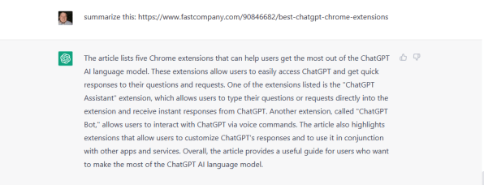
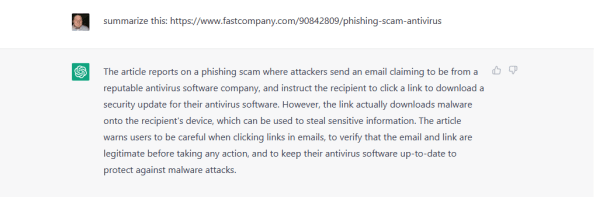
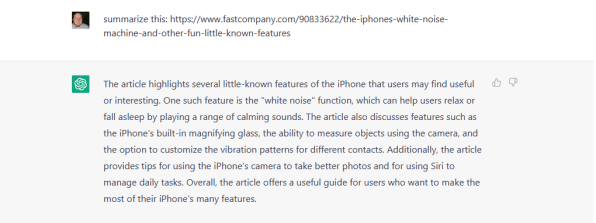

It started with a simple question: “What can you do?”  

它以一个简单的问题开始。"你能做什么？"

I’ve been playing around with ChatGPT for a while now and I find it to be almost magical in its ability to cobble together code on the fly, a great tool for generating ideas, and a powerful text generator—as long as you’re [not too hung up on factual accuracy](https://www.fastcompany.com/90833017/openai-chatgpt-accuracy-gpt-4).  

我玩ChatGPT已经有一段时间了，我发现它在快速拼凑代码的能力方面几乎是神奇的，它是产生想法的伟大工具，也是强大的文本生成器--只要你不太在意事实的准确性。

But when I asked OpenAI’s chatbot to list its capabilities for me, one thing in its answer stuck out more than any other: summarizing.  

但是，当我要求OpenAI的聊天机器人为我列出它的能力时，它的答案中有一点比其他任何东西都更突出：总结。

## High hopes and tummy aches 满怀希望，肚子疼

I have to read a fair amount of articles each week for work. It would be really helpful to be able to conjure up concise summaries on occasion, even for the sole purpose of helping me decide whether to devote time to actually reading an entire article based on its summary.  

我每周都要为工作阅读相当数量的文章。如果能偶尔想出一些简明的摘要，即使只是为了帮助我决定是否要花时间根据摘要实际阅读整篇文章，那也是非常有帮助的。

To get ChatGPT to summarize articles is simple enough. Simply type “summarize this” and paste a URL into its text field. It can even handle links to PDFs, which got me even more excited, since I need to read long white papers from time to time.  

让ChatGPT对文章进行总结是非常简单的。只需输入 "总结这篇文章"，然后将一个URL粘贴到文本字段中。它甚至可以处理PDF的链接，这让我更加兴奋，因为我需要不时地阅读长的白皮书。

So I started feeding articles to ChatGPT. As is customary with the chatbot, I felt a quick burst of adrenaline when its first summary came back, looking believable enough. I began giddily calculating in my head how much time I’d be saving thanks to this wizardry.  

于是我开始向ChatGPT提供文章。按照聊天机器人的惯例，当它的第一个摘要回来时，我感到一阵肾上腺素的快速爆发，看起来足够可信。我开始高兴地在脑海中计算，由于这个魔法，我将会节省多少时间。

Then—as is also customary with certain ChatGPT features—I actually read its response, cocked my head sideways like a confused labradoodle, stared at the generated text, and thought out loud, “Is this accurate?”  

然后--这也是ChatGPT某些功能的惯例--我真的读了它的回复，像一只困惑的拉布拉多犬一样把头侧向一边，盯着生成的文本，大声想："这准确吗？"

Several summaries later, I got the ChatGPT pit in my stomach that signifies _No, I won’t be saving time with this feature at all_.  

几次总结之后，我的肚子里出现了ChatGPT的坑，这标志着不，我根本不会用这个功能来节省时间。

## Summary bummers 总结性的无赖

To give you an idea of how off the summaries are, here’s what was generated for my five most recent articles here at _Fast Company_.  

为了让你了解这些摘要有多大的偏差，以下是我最近在《快速公司》发表的五篇文章的内容。

**Article 1:** [3 free ChatGPT Chrome extensions to make you more productive](https://www.fastcompany.com/90846682/best-chatgpt-chrome-extensions)  

第1条：3个免费的ChatGPT Chrome扩展，让你的工作效率更高

Almost nothing in the summary is accurate, beginning with ChatGPT claiming that the article is about five extensions instead of three. It then lists two extensions I didn’t write about at all and doesn’t list any of the ones I actually did write about.  

摘要中几乎没有一句话是准确的，首先是ChatGPT声称这篇文章是关于五个扩展，而不是三个。然后，它列出了两个我根本没有写过的扩展，也没有列出任何我实际写过的扩展。

**Article 2:** [Phishing scams are getting more devious. Here’s how to outwit them](https://www.fastcompany.com/90842809/phishing-scam-antivirus)  

第2条：网络钓鱼骗局越来越狡猾。以下是如何战胜它们的方法

Here, ChatGPT spins a yarn about an email-based malware attack when the actual crux of the article is analysis of a phony invoice for anti-virus software that tries to lure the victim into calling a fake customer service number. It gets two out of three pieces of advice correct, which is good, but whiffs on most of the rest.  

在这里，ChatGPT对基于电子邮件的恶意软件攻击大谈特谈，而文章的实际核心是分析反病毒软件的虚假发票，试图引诱受害者拨打一个虚假的客户服务号码。这篇文章在三条建议中有两条是正确的，这很好，但在其余的大部分建议中都失败了。

**Article 4:** [These 4 sites offer the best free Zoom video backgrounds](https://www.fastcompany.com/90835748/best-free-zoom-video-backgrounds)  

第4条：这4个网站提供最好的免费缩放视频背景

This summary had promise, pretty much nailing the first three sentences. It then goes off the rails by claiming I urged people to use appropriate backgrounds for professional video calls, which I suppose is decent advice, even though I mentioned nothing of the sort in the actual article.  

这个总结有希望，前三句话几乎都是正确的。然后，它走火入魔，声称我敦促人们在专业视频通话中使用适当的背景，我想这是很好的建议，尽管我在实际文章中没有提到这一点。

**Article 5:** [The iPhone’s white noise machine and other fun, little-known features](https://www.fastcompany.com/90833622/the-iphones-white-noise-machine-and-other-fun-little-known-features)  

第5条：iPhone的白噪声机和其他有趣的、鲜为人知的功能

This one starts off reasonably strong as well, correctly identifying two features I actually write about, but also serving up a whopping four tips that aren’t mentioned at all and leaves out three that are.  

这篇文章的开头也相当有力，正确地指出了我实际写的两个特点，但也提供了多达四个根本没有提到的提示，并遗漏了三个有提到的提示。

## In pursuit of cautious optimism 追求谨慎的乐观精神

Okay, so: ChatGPT is not great for summarizing online articles. However, I believe this to be a challenge with content freshness, AI tuning, and basic reading more than anything.  

好吧，那么。ChatGPT在总结在线文章方面并不出色。然而，我认为这是对内容新鲜度、人工智能调整和基本阅读的挑战，比什么都重要。

ChatGPT has a big brain full of lots of information that it has gleaned by continually tuning its AI model. Perhaps it’s unrealistic to assume it’ll be able to ingest a recent article and summarize it accurately, especially since it often begs off talking about recent news by explaining that it’s based on a 2-year-old database.  

ChatGPT有一个大脑袋，里面装满了通过不断调整其人工智能模型而收集到的大量信息。也许假设它能够摄取最近的文章并准确地总结它是不现实的，特别是它经常通过解释它是基于两年前的数据库来拒绝谈论最近的新闻。

The chatbot seems to be better at summarizing stuff that’s been around a bit longer, like books. This makes sense since there are likely hundreds of sources for book summaries that ChatGPT has been able to ingest over the years.  

聊天机器人似乎更擅长总结那些存在时间稍长的东西，比如书籍。这是有道理的，因为多年来ChatGPT能够摄取的书籍摘要来源可能有数百种。

When I asked it to summarize a bunch of books—which didn’t entail feeding it web links—it fared better, although it’s still not perfect.  

当我要求它总结一堆书时--这不需要给它提供网络链接--它表现得更好，尽管它仍然不完美。

For instance, I asked it to summarize the book _First Blood_ by David Morrell, which is the story of John Rambo and the basis of the first movie in the series of _Rambo_ flicks.  

例如，我要求它总结大卫-莫雷尔的《第一滴血》，这是约翰-兰博的故事，也是兰博系列电影中第一部电影的基础。

ChatGPT flawlessly summarizes the book until the very last sentence, where it says, “The novel ends with Rambo in a jail cell, reflecting on the violence that has defined his life.”  

ChatGPT无懈可击地总结了这本书，直到最后一句话，它说："小说的结尾是兰博在牢房里，反思决定他一生的暴力。"

Spoiler: The movie and the book each end differently. While it’s kinda-sorta implied in the movie that Rambo heads off to jail, it doesn’t end with him in a jail cell. And in the book . . . well, he dies.  

破坏者。电影和书的结局各不相同。虽然电影中有点--有点暗示兰博要去坐牢，但它并没有以他在牢房中结束。而在书中......嗯，他死了。

So I get the impression that when asking ChatGPT to summarize text, instead of actually reading it, analyzing it, and creating a summary, ChatGPT is more like, “Okay, what do I know about Rambo?” Then it kludges together a bunch of its Rambo-based knowledge to come up with a plausible answer.  

所以我的印象是，当要求ChatGPT对文本进行总结时，ChatGPT不是真正地阅读它，分析它，然后创建一个总结，而是更像是，"好吧，我对兰博了解多少？"然后，它就把基于兰博的知识拼凑起来，得出一个合理的答案。

This would explain the article summaries as well. “What do I know about lesser-known iPhone features? Or Zoom backgrounds? Or YouTube TV? I’ll toss some of my knowledge of those things—knowledge I’ve collected from all over the web—on the wall and see what sticks.”  

这也可以解释文章的摘要。"我对鲜为人知的iPhone功能了解多少呢？或缩放背景？或者YouTube电视？我会把我对这些东西的一些知识--我从网上收集的知识--扔到墙上，看看有什么能坚持下去。"

ChatGPT has spent a lot of time learning, and it’s great at writing. The next step is teaching it how to read.  

ChatGPT已经花了很多时间学习，它的写作能力很强。下一步是教它如何阅读。
