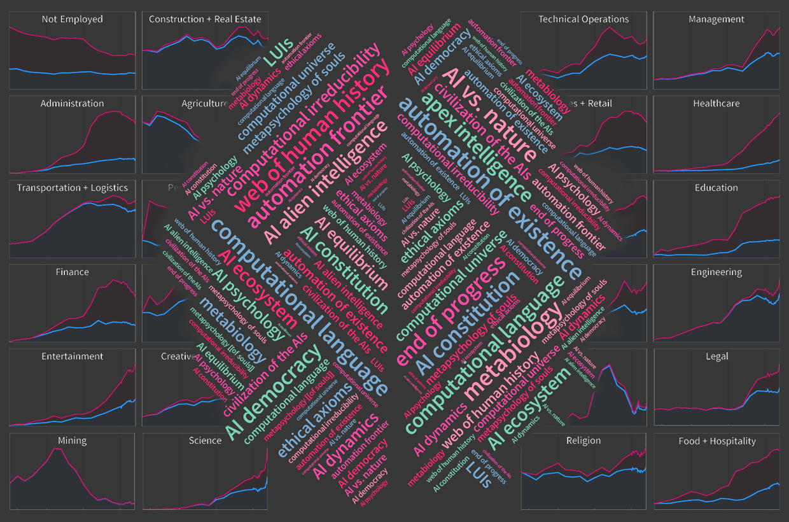
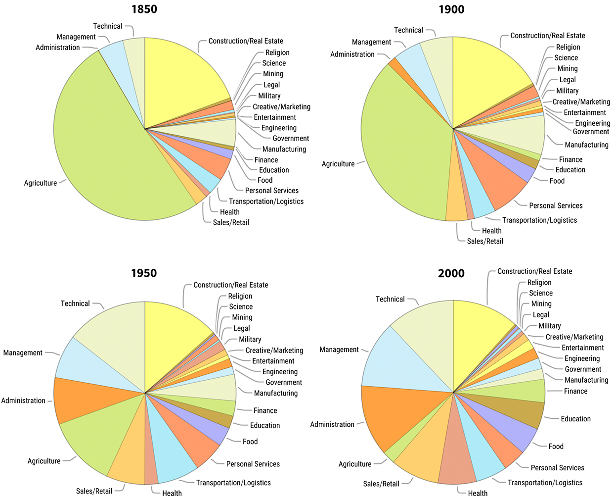
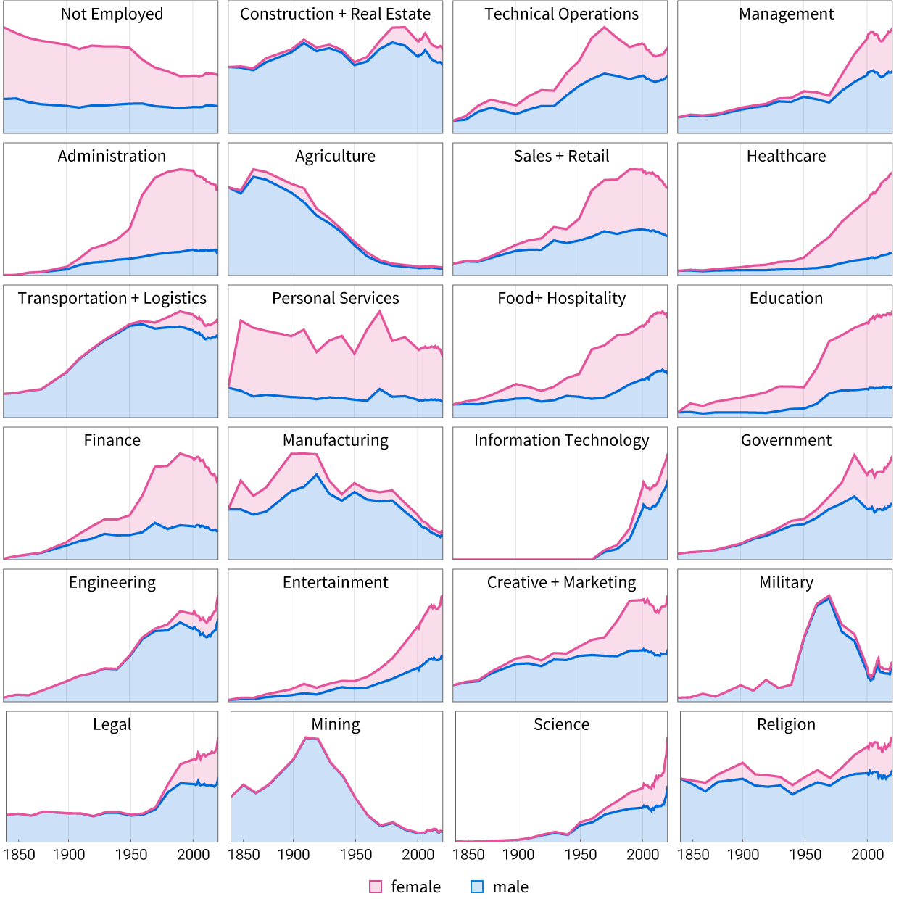
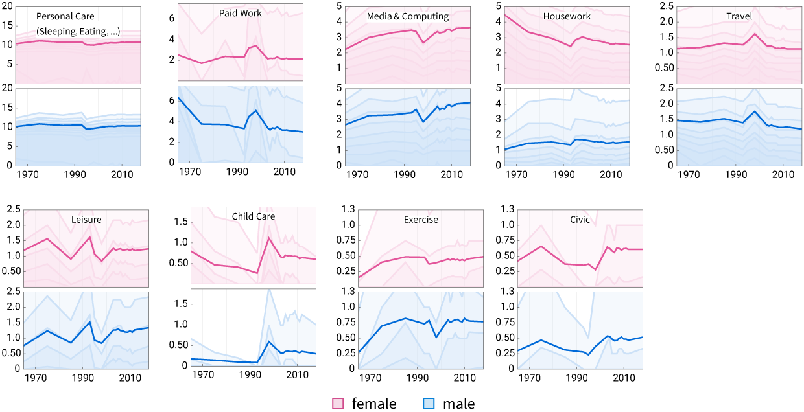
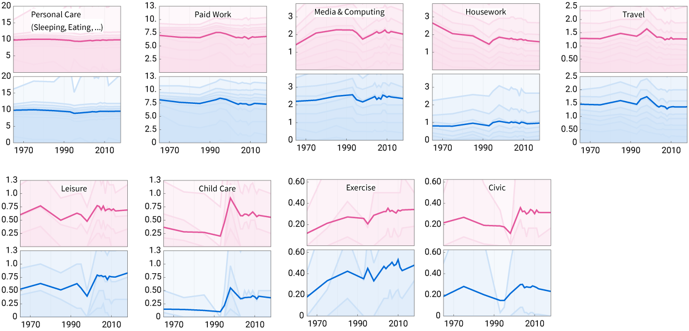
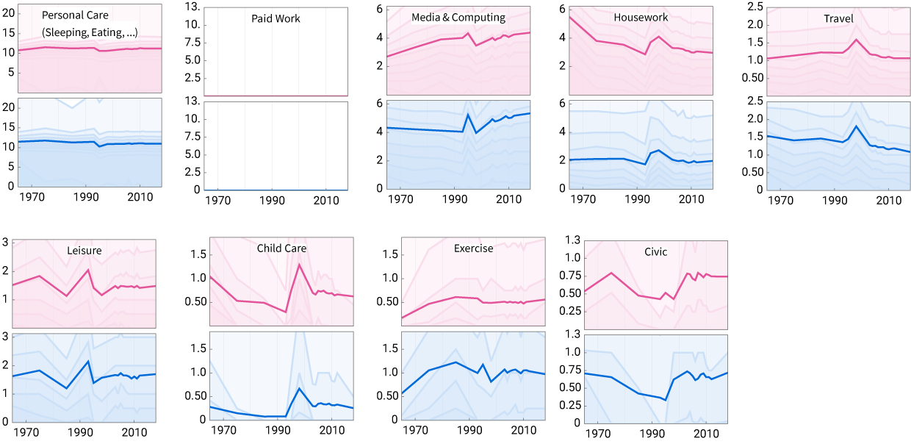

## The Shock of ChatGPT 聊天室的震撼

Just a few months ago writing an original essay seemed like something only a human could do. But then [ChatGPT](https://chat.openai.com/chat) burst onto the scene. And suddenly we realized that an [AI could write a passable human-like essay](https://writings.stephenwolfram.com/2023/02/what-is-chatgpt-doing-and-why-does-it-work/). So now it’s natural to wonder: How far will this go? What will AIs be able to do? And how will we humans fit in?  

就在几个月前，写一篇原创文章似乎是只有人类才能做到的事情。但后来ChatGPT突然出现在舞台上。我们突然意识到，人工智能可以写出类似人类的合格文章。因此，现在我们很自然地想知道。这将会走多远？人工智能将能做什么？我们人类又将如何适应？

My goal here is to explore some of the science, technology—and philosophy—of what we can expect from AIs. I should say at the outset that this is a subject fraught with both intellectual and practical difficulty. And all I’ll be able to do here is give a snapshot of my current thinking—which will inevitably be incomplete—not least because, as I’ll discuss, trying to predict how history in an area like this will unfold is something that runs straight into an issue of basic science: the phenomenon of [computational irreducibility](https://www.wolframscience.com/nks/chap-12--the-principle-of-computational-equivalence#sect-12-6--computational-irreducibility).  

我在这里的目标是探索一些科学、技术和哲学--我们可以从人工智能中期待什么。我应该在一开始就说，这是一个充满了知识和实践困难的主题。而我在这里能做的就是给出我目前的想法的一个快照--这将不可避免地是不完整的--尤其是因为，正如我将讨论的那样，试图预测像这样一个领域的历史将如何展开，是会直接碰到一个基础科学的问题的：计算的不可复制性现象 。

But let’s start off by talking about that particularly dramatic example of AI that’s just arrived on the scene: ChatGPT. So [what is ChatGPT](https://writings.stephenwolfram.com/2023/02/what-is-chatgpt-doing-and-why-does-it-work/)? Ultimately, it’s a computational system for generating text that’s been set up to follow the patterns defined by human-written text from billions of webpages, millions of books, etc. Give it a textual prompt and it’ll continue in a way that’s somehow typical of what it’s seen us humans write.  

但是，让我们先来谈谈那个刚刚到场的特别引人注目的人工智能的例子。ChatGPT。那么什么是ChatGPT？归根结底，它是一个生成文本的计算系统，它被设置为遵循人类从数十亿网页和数百万书籍中写出的文本的模式。给它一个文本提示，它就会以某种典型的方式继续它所看到的人类写的东西。

The results (which ultimately rely on all sorts of specific engineering) are remarkably “human like”. And what makes this work is that whenever [ChatGPT has to “extrapolate”](https://writings.stephenwolfram.com/2023/02/what-is-chatgpt-doing-and-why-does-it-work/#models-for-human-like-tasks) beyond anything it’s explicitly seen from us humans it does so in ways that seem similar to what we as humans might do.  

其结果（最终依赖于各种特定的工程）非常 "像人类"。这一点的原因是，每当ChatGPT需要 "推断 "出它从我们人类那里明确看到的任何东西时，它都会以类似于我们人类可能做的方式进行推断。

Inside ChatGPT is something that’s actually computationally probably quite similar to a brain—with millions of simple elements (“neurons”) forming a “[neural net](https://writings.stephenwolfram.com/2023/02/what-is-chatgpt-doing-and-why-does-it-work/#neural-nets)” with billions of connections that have been “tweaked” through a [progressive process of training](https://writings.stephenwolfram.com/2023/02/what-is-chatgpt-doing-and-why-does-it-work/#machine-learning,-and-the-training-of-neural-nets) until they successfully reproduce the patterns of human-written text seen on all those webpages, etc. Even without training the neural net would still produce some kind of text. But the key point is that it won’t be text that we humans consider meaningful. To get such text we need to build on all that “human context” defined by the webpages and other materials we humans have written. The “raw computational system” will just do “raw computation”; to get something aligned with us humans requires leveraging the detailed human history captured by all those pages on the web, etc.  

ChatGPT内的东西实际上在计算上可能非常类似于大脑--有数百万个简单的元素（"神经元"）组成一个 "神经网"，有数十亿个连接，通过逐步的训练过程进行 "调整"，直到它们成功地再现所有这些网页上看到的人类写的文本模式。即使没有训练，神经网络仍然会产生某种文本。但关键的一点是，这不会是我们人类认为有意义的文本。为了得到这样的文本，我们需要建立在所有由网页和我们人类所写的其他材料所定义的 "人类背景 "之上。原始计算系统 "将只是做 "原始计算"；要得到与我们人类一致的东西，需要利用网络上所有这些页面所捕捉到的详细的人类历史，等等。

But so what do we get in the end? Well, it’s text that basically reads like it was written by a human. In the past we might have thought that human language was somehow a uniquely human thing to produce. But now we’ve got an AI doing it. So what’s left for us humans? Well, somewhere things have got to get started: in the case of text, there’s got to be a prompt specified that tells the AI “[what direction to go in](https://writings.stephenwolfram.com/2023/02/what-is-chatgpt-doing-and-why-does-it-work/#meaning-space-and-semantic-laws-of-motion)”. And this is the kind of thing we’ll see over and over again. Given a defined “goal”, an AI can automatically work towards achieving it. But it ultimately takes something beyond the raw computational system of the AI to define what us humans would consider a meaningful goal. And that’s where we humans come in.  

但是，我们最后得到了什么？好吧，这是个文本，基本上读起来像是人类写的。在过去，我们可能认为人类语言在某种程度上是人类特有的东西。但现在我们已经有了一个人工智能在做这件事。那么留给我们人类的是什么？好吧，有些事情必须要开始：在文本的情况下，必须要有一个提示，告诉人工智能 "该往哪个方向走"。这就是我们将不断看到的那种情况。给予一个确定的 "目标"，人工智能可以自动努力实现它。但最终需要超越人工智能的原始计算系统的东西来定义我们人类认为有意义的目标。而这正是我们人类的作用所在。

What does this mean at a practical, everyday level? Typically we use ChatGPT by telling it—using text—what we basically want. And then it’ll fill in a whole essay’s worth of text talking about it. We can think of this interaction as corresponding to a kind of “linguistic user interface” (that we might dub a “LUI”). In a graphical user interface (GUI) there’s core content that’s being rendered (and input) through some potentially elaborate graphical presentation. In the LUI provided by ChatGPT there’s instead core content that’s being rendered (and input) through a textual (“linguistic”) presentation.  

这在实际的、日常的层面上意味着什么呢？通常情况下，我们使用ChatGPT，用文字告诉它我们基本上想要什么。然后它就会在一整篇的文章中讲述这个问题。我们可以把这种互动看作是对应于一种 "语言用户界面"（我们可以称之为 "LUI"）。在图形用户界面（GUI）中，有一些核心内容通过一些潜在的精心设计的图形演示来呈现（和输入）。在ChatGPT提供的LUI中，核心内容是通过文本（"语言"）展示来呈现（和输入）的。

You might jot down a few “bullet points”. And in their raw form someone else would probably have a hard time understanding them. But through the LUI provided by ChatGPT those bullet points can be turned into an “essay” that can be generally understood—because it’s based on the “shared context” defined by everything from the billions of webpages, etc. on which ChatGPT has been trained.  

你可能会记下一些 "要点"。而在其原始形式下，其他人可能很难理解它们。但通过ChatGPT提供的LUI，这些要点可以变成一篇 "文章"，可以被普遍理解--因为它是基于ChatGPT已经训练过的数十亿网页等所定义的 "共享背景"。

There’s something about this that might seem rather unnerving. In the past, if you saw a custom-written essay you’d reasonably be able to conclude that a certain irreducible human effort was spent in producing it. But with ChatGPT this is no longer true. Turning things into essays is now “free” and automated. “Essayification” is no longer evidence of human effort.  

这有一些东西可能看起来相当令人不安。在过去，如果你看到一篇定制的论文，你有理由得出结论，在制作过程中花费了某种不可减少的人为努力。但有了ChatGPT，这就不再是真的了。把东西变成论文现在是 "免费 "的，而且是自动化的。"论文化 "不再是人类努力的证据。

Of course, it’s hardly the first time there’s been a development like this. Back when I was a kid, for example, seeing that a document had been typeset was basically evidence that someone had gone to the considerable effort of printing it on printing press. But then came desktop publishing, and it became basically free to make any document be elaborately typeset.  

当然，这几乎是第一次出现这样的发展。例如，在我还是个孩子的时候，看到一份文件被排版，基本上可以证明有人花了很大力气在印刷机上印刷。但后来出现了桌面出版，使任何文件被精心排版变得基本自由。

And in a longer view, this kind of thing is basically a constant trend in history: what once took human effort eventually becomes automated and “free to do” through technology. There’s a direct analog of this in the realm of ideas: that with time higher and higher levels of abstraction are developed, that subsume what were formerly laborious details and specifics.  

从更长远的角度来看，这种事情基本上是历史上一个不变的趋势：曾经需要人类努力的事情最终通过技术变得自动化和 "自由操作"。这在思想领域有一个直接的类比：随着时间的推移，越来越高的抽象水平被开发出来，取代了以前费力的细节和具体细节。

Will this end? Will we eventually have automated everything? Discovered everything? Invented everything? At some level, we now know that the answer is a resounding no. Because one of the consequences of the phenomenon of computational irreducibility is that there’ll always be more computations to do—that can’t in the end be reduced by any finite amount of automation, discovery or invention.  

这将结束吗？我们最终会不会把一切都自动化？发现了一切？发明了一切？在某种程度上，我们现在知道，答案是一个响亮的否定。因为计算的不可复制性现象的后果之一就是永远会有更多的计算要做，而这些计算最终不可能被任何有限的自动化、发现或发明所减少。

Ultimately, though, this will be a more subtle story. Because while there may always be more computations to do, it could still be that we as humans don’t care about them. And that somehow everything we care about can successfully be automated—say by AIs—leaving “nothing more for us to do”.  

不过，最终，这将是一个更微妙的故事。因为虽然可能总是有更多的计算要做，但作为人类的我们仍然可能不关心它们。而我们所关心的一切都可以成功地被自动化，比如说由人工智能来完成，从而使 "我们不再需要做什么"。

Untangling this issue will be at the heart of questions about how we fit into the AI future. And in what follows we’ll see over and over again that what might at first essentially seem like practical matters of technology quickly get enmeshed with deep questions of science and philosophy.  

解开这个问题将是关于我们如何融入人工智能未来的问题的核心。而在接下来的内容中，我们将一再看到，那些起初看似实用的技术问题很快就会与科学和哲学的深刻问题纠缠在一起。

## Intuition from the Computational Universe  

来自计算宇宙的直觉

I’ve already mentioned computational irreducibility a couple of times. And it turns out that this is part of a circle of rather deep—and at first surprising—ideas that I believe are crucial to thinking about the AI future.  

我已经提到过几次计算的不可还原性。而事实证明，这是一圈相当深刻的--起初是令人惊讶的--理念的一部分，我认为这些理念对于思考人工智能的未来至关重要。

Most of our existing intuition about “machinery” and “automation” comes from a kind of “clockwork” view of engineering—in which we specifically build systems component by component to achieve objectives we want. And it’s the same with most software: we write it line by line to specifically do—step by step—whatever it is we want. And we expect that if we want our machinery—or software—to do complex things then the underlying structure of the machinery or software must somehow be correspondingly complex.  

我们现有的关于 "机械 "和 "自动化 "的大部分直觉来自于一种 "发条 "式的工程观点--我们专门逐个组件地建立系统以实现我们想要的目标。大多数软件也是如此：我们一行一行地写，专门做我们想做的事，一步一步来。我们期望，如果我们希望我们的机器或软件做复杂的事情，那么机器或软件的底层结构必须以某种方式相应地复杂。

So when I started exploring the whole computational universe of possible programs in the early 1980s it was a [big surprise to discover](https://www.wolframscience.com/nks/chap-2--the-crucial-experiment/) that things work quite differently there. And indeed even tiny programs—that effectively just apply very simple rules repeatedly—[can generate great complexity](https://www.wolframscience.com/nks/p27--how-do-simple-programs-behave/). In our usual practice of engineering we haven’t seen this, because we’ve always specifically picked programs (or other structures) where we can readily foresee how they’ll behave, so that we can explicitly set them up to do what we want. But out in the computational universe it’s very common to see programs that just “intrinsically generate” great complexity, without us ever having to explicitly “put it in”.  

因此，当我在20世纪80年代初开始探索整个可能程序的计算宇宙时，发现事情的运作方式完全不同，这是一个很大的惊喜。事实上，即使是很小的程序--实际上只是重复应用非常简单的规则--也可以产生很大的复杂性。在我们通常的工程实践中，我们还没有看到这一点，因为我们总是专门挑选那些我们可以轻易预见它们将如何表现的程序(或其他结构)，这样我们就可以明确地设置它们来做我们想要的事情。但是在计算宇宙中，很常见的是那些 "内在地产生 "巨大复杂性的程序，而不需要我们明确地 "把它放进去"。

And having discovered this, we realize that there’s actually a big example that’s been around forever: the natural world. And indeed it increasingly seems as if the “secret” that nature uses to make the complexity it so often shows is exactly to operate according to the rules of simple programs. (For about three centuries it seemed as if mathematical equations were the ultimate way to describe the natural world—but in the [past few decades](https://writings.stephenwolfram.com/2022/05/twenty-years-later-the-surprising-greater-implications-of-a-new-kind-of-science/), and particularly poignantly with our recent [Physics Project](https://www.wolframphysics.org/), it’s become clear that simple programs are in general a more powerful approach.)  

而在发现这一点之后，我们意识到其实有一个大的例子一直存在：自然界。而事实上，越来越多的人认为，自然界用来制造它经常显示的复杂性的 "秘密 "正是按照简单程序的规则来操作。(大约三个世纪以来，数学方程似乎是描述自然界的终极方式--但在过去的几十年里，特别是在我们最近的物理学项目中，我们清楚地看到，简单的程序通常是一种更强大的方法。）

How does all this relate to technology? Well, [technology is about](https://writings.stephenwolfram.com/2022/06/alien-intelligence-and-the-concept-of-technology/) taking what’s out there in the world, and harnessing it for human purposes. And there’s a fundamental tradeoff here. There may be some system out in nature that does amazingly complex things. But the question is whether we can “slice off” certain particular things that we humans happen to find useful. A donkey has all sorts of complex things going on inside. But at some point it was discovered that we can use it “technologically” to do the rather simple thing of pulling a cart.  

这一切与技术有什么关系？好吧，技术是关于利用世界上的东西，并为人类的目的利用它。这里有一个基本的权衡。自然界中可能存在一些系统，可以做令人惊讶的复杂事情。但问题是，我们是否可以 "切掉 "某些我们人类碰巧认为有用的特定事物。一头驴子里面有各种复杂的东西。但在某些时候，人们发现我们可以 "技术性地 "使用它来做相当简单的事情，即拉车。

And when it comes to programs out in the computational universe it’s extremely common to [see ones that do amazingly complex things](https://www.wolframscience.com/nksonline/toc.html). But the question is whether we can find some aspect of those things that’s useful to us. Maybe the program is good at [making pseudorandomness](https://www.wolframscience.com/nks/chap-7--mechanisms-in-programs-and-nature#sect-7-5--the-intrinsic-generation-of-randomness). Or [distributedly determining consensus](https://writings.stephenwolfram.com/2021/05/the-problem-of-distributed-consensus/). Or maybe it’s just doing its complex thing, and [we don’t yet know any “human purpose”](https://writings.stephenwolfram.com/2022/06/alien-intelligence-and-the-concept-of-technology/) that this achieves.  

而当谈到计算宇宙中的程序时，极其常见的是那些做了令人惊异的复杂事情的程序。但问题是我们是否能从这些事情中找到对我们有用的某些方面。也许这个程序擅长于制造伪随机性。或者分布式地确定共识。也可能它只是在做它复杂的事情，而我们还不知道这实现了什么 "人类的目的"。

One of the notable features of a system like ChatGPT is that it isn’t [constructed in an “understand-every-step” traditional engineering way](https://writings.stephenwolfram.com/2023/02/what-is-chatgpt-doing-and-why-does-it-work/). Instead one basically just starts from a “raw computational system” (in the case of ChatGPT, a neural net), then progressively tweaks it until its behavior aligns with the “human-relevant” examples one has. And this alignment is what makes the system “technologically useful”—to us humans.  

像ChatGPT这样的系统的一个显著特点是，它不是以一种 "理解-每一步 "的传统工程方式构建的。相反，我们基本上只是从一个 "原始的计算系统"（在ChatGPT的例子中，是一个神经网络）开始，然后逐步调整它，直到它的行为与我们拥有的 "人类相关 "的例子相一致。而这种调整正是使系统 "在技术上有用 "的原因--对我们人类来说。

Underneath, though, it’s still a computational system, with all the potential “wildness” that implies. And free from the “technological objective” of “human-relevant alignment” the system might do all sorts of sophisticated things. But they might not be things that (at least at this time in history) we care about. Even though some putative alien (or our future selves) might.  

不过，在这之下，它仍然是一个计算系统，具有所有潜在的 "野性"，这意味着。而摆脱了 "与人类相关的对准 "的 "技术目标"，该系统可能会做各种复杂的事情。但它们可能不是我们所关心的事情（至少在历史的这个时候）。尽管一些假定的外星人（或我们未来的自我）可能会。

OK, but let’s come back to the “raw computation” side of things. There’s something very different about computation from all other kinds of “mechanisms” we’ve seen before. We might have a cart that can move forward. And we might have a stapler that can put staples in things. But carts and staplers do very different things; there’s no equivalence between them. But for computational systems (at least ones that don’t just always behave in obviously simple ways) there’s my [Principle of Computational Equivalence](https://www.wolframscience.com/nks/chap-12--the-principle-of-computational-equivalence/)—which implies that all these systems are in a sense equivalent in the kinds of computations they can do.  

好吧，但让我们回到事情的 "原始计算 "方面来。计算有一些与我们以前所见的所有其他种类的 "机制 "非常不同的地方。我们可能有一辆可以向前移动的小车。我们可能有一个订书机，可以把钉子钉在东西上。但小车和订书机做的是非常不同的事情；它们之间没有等价关系。但是对于计算系统(至少是那些不总是以明显的简单方式行事的系统)，有我的计算等价原则--这意味着所有这些系统在某种意义上都是它们所能做的计算的种类的等价。

This equivalence has many consequences. One of them is that one can expect to make something equally computationally sophisticated out of all sorts of different kinds of things—whether brain tissue or electronics, or some system in nature. And this is effectively where [computational irreducibility](https://www.wolframscience.com/nks/chap-12--the-principle-of-computational-equivalence#sect-12-6--computational-irreducibility) comes from.  

这种等价关系有许多后果。其中之一是，人们可以期望从各种不同的东西中制造出同样具有计算复杂性的东西--无论是脑组织还是电子器件，或者是自然界的一些系统。而这实际上就是计算的不可简化性的来源。

One might think that given, say, some computational system based on a simple program it would always be possible for us—with our sophisticated brains, mathematics, computers, etc.—to “jump ahead” and figure out what the system will do before it’s gone through all the steps to do it. But the Principle of Computational Equivalence implies that this won’t in general be possible—because the system itself can be as computationally sophisticated as our brains, mathematics, computers, etc. are. So this means that the system will be computationally irreducible: the only way to find out what it does is effectively just to go through the same whole computational process that it does.  

人们可能会认为，比如说某个基于简单程序的计算系统，我们--用我们复杂的大脑、数学、计算机等等--总是有可能 "跳到前面"，在系统经历所有步骤之前就弄清楚它要做什么。但是计算等价原则意味着这在一般情况下是不可能的--因为系统本身可以像我们的大脑、数学、计算机等一样具有计算上的复杂性。因此，这意味着该系统在计算上是不可简化的：找出它所做的事情的唯一方法，实际上就是经历它所做的同样的整个计算过程。

There’s a prevailing impression that science will always eventually be able do better than this: that it’ll be able to make “predictions” that allow us to work out what will happen without having to trace through each step. And indeed over the past three centuries there’s been lots of success in doing this, mainly by using mathematical equations. But ultimately it turns out that this has only been possible because science has ended up concentrating on particular systems where these methods work (and then these systems have been used for engineering). But the reality is that many systems show computational irreducibility. And in the phenomenon of computational irreducibility science is in effect “deriving its own limitedness”.  

有一种普遍的印象是，科学最终总是能够做得比这更好：它将能够作出 "预测"，使我们能够计算出将会发生什么，而不必追踪每个步骤。事实上，在过去的三个世纪里，主要通过使用数学方程，已经在这方面取得了很多成功。但最终发现，这只是因为科学最终集中在这些方法有效的特定系统上（然后这些系统被用于工程）才得以实现。但现实是，许多系统都显示出计算的不可还原性。而在计算的不可重复性现象中，科学实际上是在 "推导其自身的有限性"。

Contrary to traditional intuition, try as we might, in many systems we’ll never be able find “formulas” (or other “shortcuts”) that describe what’s going to happen in the systems—because the systems are simply computationally irreducible. And, yes, this represents a limitation on science, and on knowledge in general. But while at first this might seem like a bad thing, there’s also something fundamentally satisfying about it. Because if everything were computationally reducible, we could always “jump ahead” and find out what will happen in the end, say in our lives. But computational irreducibility implies that in general we can’t do that—so that in some sense “something irreducible is being achieved” by the passage of time.  

与传统的直觉相反，无论我们如何努力，在许多系统中，我们永远无法找到 "公式"（或其他 "捷径"）来描述系统中会发生什么--因为这些系统在计算上是不可还原的。而且，是的，这代表了对科学和一般知识的一种限制。但是，虽然这起初可能看起来是件坏事，但也有一些从根本上令人满意的地方。因为如果一切事物都是可计算的，我们总是可以 "提前 "发现最后会发生什么，比如在我们的生活中。但计算上的不可还原性意味着，一般来说我们无法做到这一点，所以在某种意义上，时间的流逝 "正在实现一些不可还原的东西"。

There are a great many consequences of computational irreducibility. Some—that [I have particularly explored recently](https://writings.stephenwolfram.com/2023/02/computational-foundations-for-the-second-law-of-thermodynamics/)—are in the domain of basic science (for example, [establishing core laws of physics](https://www.wolframphysics.org/) as we perceive them from the interplay of computational irreducibility and our computational limitations as observers). But computational irreducibility is also central in thinking about the AI future—and in fact I increasingly feel that it adds the single most important intellectual element needed to make sense of many of the most important questions about the potential roles of AIs and humans in the future.  

计算的不可还原性有许多后果。有些后果--我最近特别探讨过--属于基础科学领域(例如，从计算的不可还原性和我们作为观察者的计算局限性的相互作用中确立我们所感知的核心物理定律)。但计算的不可重复性也是思考人工智能未来的核心--事实上，我越来越觉得它为理解关于人工智能和人类在未来的潜在角色的许多最重要的问题增加了一个最重要的智力要素。

For example, from our traditional experience with engineering we’re used to the idea that to find out why something happened in a particular way we can just “look inside” a machine or program and “see what it did”. But when there’s [computational irreducibility, that won’t work](https://writings.stephenwolfram.com/2019/06/testifying-at-the-senate-about-a-i-selected-content-on-the-internet/#open-up-the-ai). Yes, we could “look inside” and see, say, a few steps. But computational irreducibility implies that to find out what happened, we’d have to trace through all the steps. We can’t expect to find a [“simple human narrative”](https://writings.stephenwolfram.com/2018/11/logic-explainability-and-the-future-of-understanding/#what-can-one-understand) that “says why something happened”.  

例如，从我们传统的工程经验来看，我们习惯于这样的想法：要找出某件事情为什么会以特定方式发生，我们只需 "看一看 "机器或程序的内部，"看看它做了什么"。但是，当存在计算上的不可还原性时，这就行不通了。是的，我们可以 "看里面 "并看到，比如说，几个步骤。但是，计算上的不可重复性意味着，要找出发生了什么，我们就必须追踪所有的步骤。我们不能指望找到一个 "简单的人类叙事 "来 "说明事情发生的原因"。

But having said this, one feature of computational irreducibility is that within any computationally irreducible systems there must always be (ultimately, infinitely many) “pockets of computational reducibility” to be found. So for example, even though we can’t say in general what will happen, we’ll always be able to identify specific features that we can predict. (“The leftmost cell will always be black”, etc.) And as we’ll discuss later we can potentially think of technological (as well as scientific) progress as being intimately tied to the discovery of these “pockets of reducibility”. And in effect the existence of infinitely many such pockets is the reason that “there’ll always be inventions and discoveries to be made”.  

但是，说到这里，计算的不可还原性的一个特点是，在任何计算上不可还原的系统中，总是会有(最终是无限多的) "计算的可还原性口袋 "被发现。因此，举例来说，即使我们不能笼统地说会发生什么，但我们总是能够确定我们可以预测的具体特征。("最左边的细胞总是黑色的"，等等。)正如我们后面要讨论的那样，我们可以认为技术(以及科学)的进步与这些 "可还原性口袋 "的发现密切相关。而实际上，无限多的这种口袋的存在就是 "永远有发明和发现 "的原因。

Another consequence of computational irreducibility has to do with trying to [ensure things about the behavior of a system](https://writings.stephenwolfram.com/2016/10/a-short-talk-on-ai-ethics/). Let’s say one wants to set up an AI so it’ll “never do anything bad”. One might imagine that one could just come up with particular rules that ensure this. But as soon as the behavior of the system (or its environment) is computationally irreducible one will never be able to guarantee what will happen in the system. Yes, there may be particular computationally reducible features one can be sure about. But in general computational irreducibility implies that there’ll always be a “possibility of surprise” or the potential for “unintended consequences”. And the only way to systematically avoid this is to make the system not computationally irreducible—which means it can’t make use of the full power of computation.  

计算的不可重复性的另一个后果与试图确保一个系统的行为的事情有关。比方说，我们想设置一个人工智能，让它 "永远不做坏事"。人们可能会想，我们可以想出一些特定的规则来确保这一点。但是，一旦系统（或其环境）的行为在计算上是不可还原的，我们就永远无法保证系统中会发生什么。是的，可能有一些特定的计算上可还原的特征是我们可以确定的。但总的来说，计算上的不可还原性意味着总会有 "意外的可能性 "或 "意外的后果 "的可能性。而系统地避免这种情况的唯一方法是使系统不具有计算上的不可还原性--这意味着它不能利用计算的全部力量。

## “AIs Will Never Be Able to Do That”  

"人工智能将永远无法做到这一点"

We humans like to feel special, and feel as if there’s something “fundamentally unique” about us. Five centuries ago we thought we lived at the center of the universe. Now we just tend to think that there’s something about our intellectual capabilities that’s fundamentally unique and beyond anything else. But the progress of AI—and things like ChatGPT—keep on giving us more and more evidence that that’s not the case. And indeed my [Principle of Computational Equivalence](https://www.wolframscience.com/nks/chap-12--the-principle-of-computational-equivalence/) says something even more extreme: that at a fundamental computational level there’s just nothing fundamentally special about us at all—and that in fact we’re computationally just equivalent to lots of systems in nature, and even to simple programs.  

我们人类喜欢觉得自己很特别，觉得自己好像有什么 "根本性的独特之处"。五个世纪前，我们认为我们生活在宇宙的中心。现在，我们只是倾向于认为我们的智力从根本上说是独一无二的，是超越其他事物的。但人工智能的进步--以及像ChatGPT这样的东西--不断给我们提供越来越多的证据，证明事实并非如此。事实上，我的计算等价原则说的是更极端的事情：在基本的计算层面上，我们根本就没有什么特别之处--事实上，我们在计算上与自然界中的许多系统，甚至与简单的程序是等价的。

This broad equivalence is important in being able to make very general scientific statements (like the existence of computational irreducibility). But it also highlights how significant our specifics—our particular history, biology, etc.—are. It’s very much like with ChatGPT. We can have a generic (untrained) neural net with the same structure as ChatGPT, that can do certain “raw computation”. But what makes ChatGPT interesting—at least to us—is that it’s been trained with the “human specifics” described on billions of webpages, etc. In other words, for both us and ChatGPT there’s nothing computationally “generally special”. But there is something “specifically special”—and it’s the particular history we’ve had, particular knowledge our civilization has accumulated, etc.  

这种广泛的等价性对于能够做出非常一般的科学陈述(比如计算上的不可还原性的存在)是很重要的。但它也突出了我们的具体情况--我们特定的历史、生物学等等--是多么重要。这很像ChatGPT的情况。我们可以有一个通用的(未经训练的)神经网络，其结构与ChatGPT相同，可以做某些 "原始计算"。但是让ChatGPT有趣的是--至少对我们来说--它是用数十亿网页上描述的 "人类的具体情况 "训练出来的，等等。换句话说，对于我们和ChatGPT来说，没有什么计算上的 "普遍特别"。但是有一些 "特别的 "东西--那就是我们所拥有的特殊历史，我们的文明所积累的特殊知识，等等。

There’s a curious analogy here to our physical place in the universe. There’s a certain uniformity to the universe, which means there’s nothing “generally special” about our physical location. But at least to us there’s still something “specifically special” about it, because it’s only here that we have our particular planet, etc. At a deeper level, ideas based on our Physics Project have led to the [concept of the ruliad](https://writings.stephenwolfram.com/2021/11/the-concept-of-the-ruliad/): the unique object that is the entangled limit of all possible computational processes. And we can then view our whole [experience as “observers of the universe”](https://writings.stephenwolfram.com/2021/03/what-is-consciousness-some-new-perspectives-from-our-physics-project/) as consisting of sampling the ruliad at a particular place.  

这里有一个奇怪的比喻，即我们在宇宙中的物理位置。宇宙有某种统一性，这意味着我们的物理位置没有什么 "一般的特别"。但至少对我们来说，仍然有一些 "特别的 "东西，因为只有在这里，我们才有我们特定的星球，等等。在更深的层次上，基于我们的物理项目的想法导致了Raviad的概念：独特的物体是所有可能的计算过程的纠缠极限。然后我们可以把我们作为 "宇宙的观察者 "的整个经验看作是在一个特定的地方对Raviad的采样。

It’s a bit abstract (and a long story, which I won’t go into in any detail here), but we can think of different possible observers as being both at different places in physical space, and at different places in rulial space—giving them different “points of view” about what happens in the universe. Human minds are in effect concentrated in a particular region of physical space (mostly on this planet) and a particular region of rulial space. And in rulial space different human minds—with their different experiences and thus different ways of thinking about the universe—are in slightly different places. Animal minds might be fairly close in rulial space. But other computational systems (like, say, the weather, which is sometimes said to “have a mind of its own”) are further away—as [putative aliens might also be](https://writings.stephenwolfram.com/2022/06/alien-intelligence-and-the-concept-of-technology/#face-to-face-with-alien-intelligence,-out-in-rulial-space).  

这有点抽象（而且故事很长，我不会在这里详细讨论），但我们可以认为不同的可能观察者既在物理空间的不同地方，又在统治空间的不同地方--使他们对宇宙中发生的事情有不同的 "观点"。人类的思想实际上集中在物理空间的一个特定区域（主要在这个星球）和统治空间的一个特定区域。而在统治空间中，不同的人类思维--他们有不同的经验，因此对宇宙有不同的思考方式--都在稍微不同的地方。动物的头脑在统治空间中可能相当接近。但是其他计算系统(比如说天气，它有时被说成是 "有自己的思想")就比较远了--就像假定的外星人也可能是这样。

So what about AIs? It depends what we mean by “AIs”. If we’re talking about computational systems that are set up to do “human-like things” then that means they’ll be close to us in rulial space. But insofar as “an AI” is an arbitrary computational system it can be anywhere in rulial space, and it can do anything that’s computationally possible—which is far broader than what we humans can do, or even think about. (As we’ll talk about later, as our intellectual paradigms—and ways of observing things—expand, the [region of rulial space in which we humans operate](https://writings.stephenwolfram.com/2022/06/alien-intelligence-and-the-concept-of-technology/#the-evolution-of-purpose-and-the-colonization-of-rulial-space) will correspondingly expand.)  

那么，人工智能呢？这取决于我们对 "人工智能 "的理解。如果我们谈论的是被设定为做 "类似人类的事情 "的计算系统，那么这意味着它们将在标尺空间内接近我们。但是就 "人工智能 "是一个任意的计算系统而言，它可以在标尺空间的任何地方，而且它可以做任何在计算上可能的事情--这远比我们人类能做的，甚至能想的更广泛。(正如我们稍后要谈的，随着我们的智力范式和观察事物的方式的扩大，我们人类所处的统治空间的区域也会相应地扩大）。

But, OK, just how “general” are the computations that we humans (and the AIs that follow us) are doing? We don’t know enough about the brain to be sure. But if we look at artificial neural net systems—like ChatGPT—we can potentially get some sense. And in fact the computations really don’t seem to be that “general”. In most neural net systems data that’s given as input just [“ripples once through the system”](https://writings.stephenwolfram.com/2023/02/what-is-chatgpt-doing-and-why-does-it-work/) to produce output. It’s not like in a computational system like a [Turing machine](https://www.wolframscience.com/nks/chap-3--the-world-of-simple-programs#sect-3-4--turing-machines) where there can be arbitrary “recirculation of data”. And indeed without such “arbitrary recirculation” the computation is necessarily quite “shallow” and can’t ultimately show computational irreducibility.  

但是，好吧，我们人类（以及追随我们的人工智能）所做的计算究竟有多 "普遍"？我们对大脑的了解还不足以确定。但如果我们看一下人工神经网络系统，比如ChatGPT，我们就有可能得到一些感觉。而事实上，计算似乎真的不是那么 "普遍"。在大多数神经网络系统中，作为输入的数据只是 "在系统中荡漾一次"，产生输出。它不像图灵机这样的计算系统，可以有任意的 "数据再循环"。而且，如果没有这样的 "任意循环"，计算必然是相当 "肤浅 "的，最终不能显示出计算的不可重复性。

It’s a bit of a technical point, but one can ask whether ChatGPT, with its “re-feeding of text produced so far” can in fact achieve [arbitrary (“universal”) computation](https://www.wolframscience.com/nks/p642--the-phenomenon-of-universality/). And I suspect that in some formal sense it can (or at least a sufficiently expanded analog of it can)—though by producing an extremely verbose piece of text that for example in effect lists successive (self-delimiting) states of a Turing machine tape, and in which finding “the answer” to a computation will take a bit of effort. But—as I’ve discussed elsewhere—in practice ChatGPT is presumably almost exclusively doing “quite shallow” computation.  

这是一个有点技术性的问题，但是人们可以问，ChatGPT，其 "重新提供迄今为止产生的文本"，是否能够事实上实现任意（"普遍"）的计算。我怀疑在某种形式上它可以(或者至少它的一个充分扩展的类似物可以)--尽管是通过产生一个极其冗长的文本，例如实际上列出了图灵机磁带的连续(自限)状态，并且在其中找到一个计算的 "答案 "将花费一点努力。但是，正如我在其他地方讨论的那样，在实践中，ChatGPT可能几乎只做 "相当浅的 "计算。

It’s an interesting feature of the history of practical computing that what one might consider “deep pure computations” (say in mathematics or science) were done for decades before [“shallow human-like computations” became feasible](https://writings.stephenwolfram.com/2015/05/wolfram-language-artificial-intelligence-the-image-identification-project/). And the basic reason for this is that for “human-like computations” (like recognizing images or generating text) one needs to capture lots of “human context”, which requires having lots of “human-generated data” and the computational resources to store and process it.  

实用计算历史的一个有趣的特点是，在 "浅层类人计算 "变得可行之前，人们可能认为的 "深层纯计算"(比如数学或科学)已经做了几十年了。其基本原因是，对于 "类人计算"(比如识别图像或生成文本)，我们需要捕捉大量的 "人的语境"，这需要有大量的 "人产生的数据 "以及存储和处理它的计算资源。

And, by the way, brains also seem to specialize in fundamentally shallow computations. And to do the kind of deeper computations that allow one to take advantage of more of what’s out there in the computational universe, one has to turn to computers. As we’ve discussed, there’s plenty out in the computational universe that we humans don’t (yet) care about: we just consider it “raw computation”, that doesn’t seem to be “achieving human purposes”. But as a practical matter it’s important to make a bridge between the things we humans do care about and think about, and what’s possible in the computational universe. And in a sense that’s at the core of the project I’ve put so much effort into in the [Wolfram Language](https://www.wolfram.com/language/) of creating a full-scale computational language that describes in computational terms the things we think about, and experience in the world.  

而且，顺便说一句，大脑似乎也是专门从事基本的浅层计算的。而要做那种更深入的计算，使人能够利用计算宇宙中更多的东西，就必须求助于计算机。正如我们已经讨论过的，计算宇宙中有很多我们人类(还)不关心的东西：我们只是认为那是 "原始计算"，似乎并没有 "实现人类的目的"。但作为一个实际问题，在我们人类所关心和思考的事情与计算宇宙中的可能之间架起一座桥梁是很重要的。从某种意义上说，这就是我在沃尔夫拉姆语言(Wolfram Language)中所投入的巨大努力的核心，即创造一种全面的计算语言，用计算术语来描述我们所思考的事情，以及在这个世界上的经验。

OK, people have been saying for years: “It’s nice that computers can do A and B, but only humans can do X”. What X is supposed to be has changed—and narrowed—over the years. And ChatGPT provides us with a major unexpected new example of something more that computers can do.  

好了，人们已经说了很多年了。"计算机可以做A和B，这很好，但只有人类可以做X"。多年来，"X "应该是什么，已经发生了变化，而且范围越来越小。而ChatGPT为我们提供了一个意想不到的新例子，说明计算机可以做更多的事情。

So what’s left? People might say: “Computers can never show creativity or originality”. But—perhaps disappointingly—that’s surprisingly easy to get, and indeed just a bit of randomness “seeding” a computation can often do a pretty good job, as we saw years ago with our [WolframTones](https://tones.wolfram.com/) music-generation system, and as we see today with ChatGPT’s writing. People might also say: “Computers can never show emotions”. But before we had a good way to generate human language we wouldn’t really have been able to tell. And now it already works pretty well to ask ChatGPT to write “happily”, “sadly”, etc. (In their raw form emotions in both humans and other animals are presumably associated with rather simple “global variables” like neurotransmitter concentrations.)  

那么剩下的是什么？人们可能会说"计算机不可能显示出创造性或原创性"。但是--也许令人失望的是--这出乎意料地容易得到，而且事实上，只要有一点随机性 "播种 "在计算中，往往就能做得很好，正如我们多年前在WolframTones音乐生成系统中看到的那样，以及我们今天在ChatGPT的写作中看到的那样。人们可能还会说。"计算机永远无法显示情感"。但在我们有一个很好的方法来生成人类语言之前，我们真的无法判断。现在，让ChatGPT写出 "高兴"、"悲伤 "等字样已经很有效了（在人类和其他动物的原始形式中，情绪可能与相当简单的 "全局变量 "有关，如神经递质的浓度。）

In the past people might have said: “Computers can never show judgement”. But by now there are endless examples of machine learning systems that do well at reproducing human judgement in lots of domains. People might also say: “Computers don’t show common sense”. And by this they typically mean that in a particular situation a computer might locally give an answer, but there’s a global reason why that answer doesn’t make sense, that the computer “doesn’t notice”, but a person would.  

在过去，人们可能会说"计算机不可能显示判断力"。但到现在，已经有无穷无尽的例子表明，机器学习系统在很多领域都能很好地再现人类的判断力。人们可能还会说。"计算机不显示常识"。他们的意思通常是，在一个特定的情况下，计算机可能会在局部给出一个答案，但有一个全局性的原因，即这个答案没有意义，计算机 "没有注意到"，但人却会注意。

So how does ChatGPT do on this? Not too badly. In plenty of cases it correctly recognizes that “that’s not what I’ve typically read”. But, yes, it makes mistakes. Some of them have to do with it not being able to do—purely with its neural net—even slightly “deeper”computations. (And, yes, that’s something that [can often be fixed](https://writings.stephenwolfram.com/2023/01/wolframalpha-as-the-way-to-bring-computational-knowledge-superpowers-to-chatgpt/) by it calling [Wolfram|Alpha](https://www.wolframalpha.com/) as a tool.) But in other cases the problem seems to be that it can’t quite connect different domains well enough.  

那么ChatGPT在这方面的表现如何？不算太差。在很多情况下，它正确地认识到 "这不是我通常读到的东西"。但是，是的，它也会犯错。其中一些是由于它不能纯粹地用它的神经网络进行甚至是稍微 "深入 "的计算。(是的，这一点通常可以通过调用Wolfram|Alpha作为工具来解决）。但在其他情况下，问题似乎是它不能很好地连接不同领域。

It’s perfectly capable of doing simple (“SAT-style”) analogies. But when it comes to larger-scale ones it doesn’t manage them. My guess, though, is that it won’t take much scaling up before it starts to be able to make what seem like very impressive analogies (that most of us humans would never even be able to make)—at which point it’ll probably successfully show broader “common sense”.  

它完全有能力进行简单的（"SAT式"）类比。但是当它涉及到更大规模的类比时，它就不能胜任了。不过，我的猜测是，在它开始能够进行看似非常令人印象深刻的类比（我们大多数人甚至永远无法进行类比）之前，它不需要太多的扩展，到那时，它可能会成功地展示更广泛的 "常识"。

But so what’s left that humans can do, and AIs can’t? There’s—almost by definition—one fundamental thing: define what we would consider goals for what to do. We’ll talk more about this later. But for now we can note that any computational system, once “set in motion”, will just follow its rules and do what it does. But what “direction should it be pointed in”? That’s something that has to come from “outside the system”.  

但是，还有什么是人类可以做而人工智能不能做的呢？有--几乎是定义上的--一件基本的事情：定义我们认为的目标是什么，做什么。我们以后会更多地讨论这个问题。但现在我们可以注意到，任何计算系统，一旦 "启动"，就会遵循其规则，做它所做的事情。但是，什么是 "它应该指向的方向"？那是必须来自 "系统之外 "的东西。

So how does it work for us humans? Well, our goals are in effect defined by the whole web of history—both from biological evolution and from our cultural development—in which we are embedded. But ultimately the only way to truly participate in that web of history is to be part of it.  

那么，对我们人类来说，它是如何运作的呢？好吧，我们的目标实际上是由整个历史网络定义的--既来自生物进化，也来自我们的文化发展，我们被嵌入其中。但最终，真正参与这个历史网络的唯一途径是成为其中的一部分。

Of course, we can imagine technologically emulating every “relevant” aspect of a brain—and indeed things like the success of ChatGPT may suggest that that’s easier to do than we might have thought. But that won’t be enough. To participate in the “human web of history” (as we’ll discuss later) we’ll have to emulate other aspects of “being human”—like moving around, being mortal, etc. And, yes, if we make an “artificial human” we can expect it (by definition) to show all the features of us humans.  

当然，我们可以想象在技术上模仿大脑的每一个 "相关 "方面--事实上，像ChatGPT的成功可能表明，这比我们想象的要容易做到。但这还远远不够。为了参与 "人类历史之网"（我们将在后面讨论），我们将不得不模仿 "作为人类 "的其他方面--比如移动，作为凡人，等等。而且，是的，如果我们制造一个 "人造人"，我们可以期望它（根据定义）显示我们人类的所有特征。

But while we’re still talking about AIs as—for example—“running on computers” or “being purely digital” then, at least as far as we’re concerned, they’ll have to “get their goals from outside”. One day (as we’ll discuss) there will no doubt be some kind of “civilization of AIs”—which will form its own web of history. But at this point there’s no reason to think that we’ll still be able to describe what’s going on in terms of goals that we recognize. In effect the AIs will at that point have left our domain of rulial space. And—as we’ll discuss—they’ll be operating more like the kind of systems we see in nature, where we can tell there’s computation going on, but we can’t describe it, except rather anthropomorphically, in terms of human goals and purposes.  

但是，当我们仍在谈论人工智能时，例如，"在计算机上运行 "或 "纯数字化"，那么，至少就我们而言，它们将不得不 "从外部获得它们的目标"。有一天（正如我们将讨论的那样）毫无疑问会有某种 "人工智能的文明"--它将形成自己的历史网络。但是在这一点上，没有理由认为我们仍然能够用我们所认识的目标来描述正在发生的事情。实际上，人工智能在那时已经离开了我们的统治空间领域。正如我们将讨论的那样，它们的运作将更像我们在自然界中看到的那种系统，在那里我们可以知道有计算在进行，但我们无法描述它，除非是拟人化的，用人类的目标和目的来描述。

## Will There Be Anything Left for the Humans to Do?  

人类还有什么可以做的吗？

It’s been an issue that’s been raised—with varying degrees of urgency—for centuries: with the advance of automation (and now AI), will there eventually be nothing left for humans to do? Back in the early days of our species, there was lots of hard work of hunting and gathering to do, just to survive. But at least in the developed parts of the world, that kind of work is now at best a distant historical memory.  

这是一个几个世纪以来一直被提出的问题--具有不同程度的紧迫性：随着自动化（以及现在的人工智能）的发展，人类最终会不会无事可做？在我们这个物种的早期，有很多艰苦的狩猎和采集工作要做，只是为了生存。但至少在世界的发达地区，这种工作现在充其量是一个遥远的历史记忆。

And yet at each stage in history—at least so far—there always seem to be other kinds of work that keep people busy. But there’s a pattern that increasingly seems to repeat. Technology in some way or another enables some new occupation. And eventually that occupation becomes widespread, and lots of people do it. But then there’s a technological advance, and the occupation gets automated—and people aren’t needed to do it anymore. But now there’s a new level of technology, that enables new occupations. And the cycle continues.  

然而在历史的每个阶段--至少到目前为止--似乎总是有其他种类的工作让人们忙碌。但有一种模式似乎越来越多地在重复。技术以某种方式实现了一些新的职业。最终，这种职业变得普遍，很多人都在做这种工作。但后来有了技术进步，这个职业被自动化，不再需要人去做了。但现在有了新的技术水平，使新的职业成为可能。周而复始。

A century ago the increasingly widespread use of telephones meant that more and more people worked as switchboard operators. But then telephone switching was automated—and those switchboard operators weren’t needed anymore. But with automated switching there could be huge development of telecommunications infrastructure, opening up all sorts of new types of jobs, that in aggregate employ vastly more people than were ever switchboard operators.  

一个世纪前，电话的使用越来越广泛，这意味着越来越多的人担任总机操作员。但后来电话交换实现了自动化--不再需要这些总机操作员了。但是，随着自动交换的实现，电信基础设施有了巨大的发展，开辟了各种新的工作类型，总的来说，雇用的人比以前的总机操作员多得多。

Something somewhat similar happened with accounting clerks. Before there were computers, one needed to have people laboriously tallying up numbers. But with computers, that was all automated away. But with that automation came the ability to do more complex financial computations—which allowed for more complex financial transactions, more complex regulations, etc., which in turn led to all sorts of new types of jobs.  

会计员也有类似的情况。在有电脑之前，人们需要有人费力地统计数字。但有了计算机，这一切都被自动化了。但随着自动化的出现，人们有能力进行更复杂的金融计算--这使得金融交易更加复杂，法规更加复杂，等等，这又导致了各种新的工作类型。

And across a whole range of industries, it’s been the same kind of story. Automation obsoletes some jobs, but enables others. There’s quite often a gap in time, and a change in the skills that are needed. But at least so far there always seems to have been a broad frontier of jobs that have been made possible—but haven’t yet been automated.  

在一系列的行业中，都是同样的故事。自动化淘汰了一些工作，但使其他工作得以实现。通常有一个时间上的差距，以及所需技能的变化。但至少到目前为止，似乎总是有一个广泛的工作领域，这些工作已经成为可能，但还没有被自动化。

Will this at some point end? Will there come a time when everything we humans want (or at least need) is delivered automatically? Well, of course, that depends on what we want, and whether, for example, that evolves with what technology has made possible. But could we just decide that “enough is enough”; let’s stop here, and just let everything be automated?  

这一切会在某个时候结束吗？会不会有一天，我们人类想要的（或至少需要的）一切都会自动交付？当然，这取决于我们想要什么，以及是否会随着技术的发展而发展，例如，技术已经成为可能。但是，我们是否可以决定 "够了"；让我们到此为止，并让一切都自动化？

I don’t think so. And the reason is ultimately because of computational irreducibility. We try to get the world to be “just so”, say set up so we’re “predictably comfortable”. Well, the problem is that there’s inevitably computational irreducibility in the way things develop—not just in nature, but in things like societal dynamics too. And that means that things won’t stay “just so”. There’ll always be something unpredictable that happens; something that the automation doesn’t cover.  

我不这么认为。而原因最终是由于计算的不可还原性。我们试图让世界变得 "恰到好处"，比如说设置成让我们 "可预测的舒适"。那么，问题是，在事物发展的过程中，不可避免地存在着计算上的不可重复性--不仅仅是在自然界，而且在像社会动态这样的事物中。这意味着事情不会一直 "如此"。总会有一些不可预知的事情发生；一些自动化没有覆盖的事情。

At first we humans might just say “we don’t care about that”. But in time computational irreducibility will affect everything. So if there’s anything at all we care about (including, for example, not going extinct), we’ll eventually have to do something—and go beyond whatever automation was already set up.  

起初我们人类可能只是说 "我们不关心这个"。但随着时间的推移，计算的不可还原性将影响到一切。因此，如果有任何我们关心的事情（包括，例如，不要灭绝），我们最终将不得不做一些事情--超越已经设置的任何自动化。

It’s easy to find practical examples. We might think that when computers and people are all connected in a seamless automated network, there’d be nothing more to do. But what about the “unintended consequence” of computer security issues? What might have seemed like a case where “technology finished things” quickly creates a new kind of job for people to do. And at some level, computational irreducibility implies that things like this must always happen. There must always be a “frontier”. At least if there’s anything at all we want to preserve (like not going extinct).  

要找到实际的例子很容易。我们可能认为，当计算机和人都被连接在一个无缝的自动化网络中时，就没有什么可做的了。但是，计算机安全问题的 "意外后果 "呢？本来看起来是 "技术完成了事情 "的情况，却很快为人们创造了一种新的工作。而在某种程度上，计算的不可简化性意味着这样的事情一定会发生。必须永远有一个 "边界"。至少如果有什么东西是我们想要保留的(比如不灭绝)。

But let’s come back to the situation here and now with AI. ChatGPT just automated all sorts of text-related tasks. It used to take lots of effort—and people—to write customized reports, letters, etc. But (at least so long as one’s dealing with situations where one doesn’t need 100% “correctness”) ChatGPT just automated a lot of that, so people aren’t needed for it anymore. But what will this mean? Well, it means that there’ll be a lot more customized reports, letters, etc. that can be produced. And that will lead to new kinds of jobs—managing, analyzing, validating etc. all that mass-customized text. Not to mention the need for prompt engineers (a job category that just didn’t exist until a few months ago), and what amount to AI wranglers, AI psychologists, etc.  

但是，让我们回到这里和现在的人工智能的情况上来。ChatGPT只是将各种与文本有关的任务自动化。过去，写定制的报告、信件等需要大量的努力和人员。但是（至少在人们处理不需要100%"正确性 "的情况下）ChatGPT只是将大量的工作自动化，所以不再需要人去做了。但这意味着什么呢？嗯，这意味着会有更多的定制报告、信件等可以被制作。这将导致新的工作类型--管理、分析、验证等所有大规模定制的文本。更不用说对提示工程师的需求了（这一工作类别直到几个月前还不存在），以及相当于人工智能管理员、人工智能心理学家等。

But let’s talk about today’s “frontier” of jobs that haven’t been “automated away”. There’s one category that in many ways seems surprising to still be “with us”: jobs that involve lots of mechanical manipulation, like construction, fulfillment, food preparation, etc. But there’s a missing piece of technology here: there isn’t yet good general-purpose robotics (as there is general-purpose computing), and we humans still have the edge in dexterity, mechanical adaptability, etc. But I’m quite sure that in time—and perhaps quite suddenly—the necessary technology will be developed (and, yes, I have ideas about how to do it). And this will mean that most of today’s “mechanical manipulation” jobs will be “automated away”—and won’t need people to do them.  

但是，让我们来谈谈今天还没有被 "自动化淘汰 "的 "前沿 "工作。有一类工作在许多方面似乎令人惊讶地仍然 "与我们同在"：涉及大量机械操作的工作，如建筑、履行、食品准备等。但这里缺少一块技术：还没有很好的通用机器人技术（就像有通用计算一样），我们人类在灵活性、机械适应性等方面仍然有优势。但我非常肯定，在一段时间内，也许是很突然的，必要的技术将被开发出来（是的，我有关于如何做到这一点的想法）。这将意味着今天的大多数 "机械操作 "工作将被 "自动化"--而且不需要人去做。

But then, just as in our other examples, this will mean that mechanical manipulation will become much easier and cheaper to do, and more of it will be done. Houses might routinely be built and dismantled. Products might routinely be picked up from wherever they’ve ended up, and redistributed. Vastly more ornate “food constructions” might become the norm. And each of these things—and many more—will open up new jobs.  

但是，就像我们其他的例子一样，这将意味着机械操作将变得更加容易和便宜，而且会有更多的机械操作。房屋可能经常被建造和拆除。产品可能经常被从它们的终点处取走，然后重新分配。更加华丽的 "食物建筑 "可能成为常态。而这些事情中的每一件，以及更多的事情，都会带来新的就业机会。

But will every job that exists in the world today “on the frontier” eventually be automated? What about jobs where it seems like a large part of the value is just “having a human be there”? Jobs like flying a plane where one wants the “commitment” of the pilot being there in the plane. Caregiver jobs where one wants the “connection” of a human being there. Sales or education jobs where one wants “human persuasion” or “human encouragement”. Today one might think “only a human can make one feel that way”. But that’s typically based on the way the job is done now. And maybe there’ll be different ways found that allow the essence of the task to be automated, almost inevitably opening up new tasks to be done.  

但是，今天世界上存在的所有 "前沿 "工作最终都会被自动化吗？那么，那些看起来很大一部分价值只是 "有一个人在那里 "的工作呢？像驾驶飞机这样的工作，人们想要飞行员在飞机上的 "承诺"。照顾者的工作，人们希望有一个人在那里的 "联系"。销售或教育工作，人们需要 "人的说服力 "或 "人的鼓励"。今天，人们可能认为 "只有人可以让人有这种感觉"。但这通常是基于现在的工作方式。也许会有不同的方式被发现，使任务的本质被自动化，几乎不可避免地开辟了新的任务来完成。

For example, something that in the past needed “human persuasion” might be “automated” by something like gamification—but then more of it can be done, with new needs for design, analytics, management, etc.  

例如，过去需要 "人的说服 "的事情，可能会被像游戏化这样的东西 "自动化"--但随后可以做更多的事情，对设计、分析、管理等有新的需求。

We’ve been talking about “jobs”. And that term immediately brings to mind wages, economics, etc. And, yes, plenty of what people do (at least in the world as it is today) is driven by issues of economics. But plenty is also not. There are things we “just want to do”—as a “social matter”, for “entertainment”, for “personal satisfaction”, etc.  

我们一直在谈论 "工作"。而这个词立即让人想到工资、经济等。是的，人们所做的很多事情（至少在今天的世界上）是由经济问题驱动的。但也有很多不是。有些事情我们 "只是想做"--作为一个 "社会问题"，为了 "娱乐"，为了 "个人满足"，等等。

Why do we want to do these things? Some of it seems intrinsic to our biological nature. Some of it seems determined by the “cultural environment” in which we find ourselves. Why might one walk on a treadmill? In today’s world one might explain that it’s good for health, lifespan, etc. But a few centuries ago, without modern scientific understanding, and with a different view of the significance of life and death, that explanation really wouldn’t work.  

我们为什么要做这些事情？其中一些似乎是我们的生物本质所固有的。有些似乎是由我们所处的 "文化环境 "决定的。为什么人们会在跑步机上行走？在今天的世界里，人们可能会解释说这对健康、寿命等有好处。但在几个世纪前，如果没有现代科学的理解，并且对生命和死亡的意义有不同的看法，这种解释就真的行不通了。

What drives such changes in our view of what we “want to do”, or “should do”? Some seems to be driven by the pure “dynamics of society”, presumably with its own computational irreducibility. But some has to do with our ways of interacting with the world—both the increasing automation delivered by the advance of technology, and the increasing abstraction delivered by the advance of knowledge.  

是什么促使我们对 "想做 "或 "应该做 "的看法发生了这种变化？有些似乎是由纯粹的 "社会动态 "所驱动的，大概是其自身的计算的不可复制性。但有些则与我们与世界互动的方式有关--既包括技术进步带来的日益自动化，也包括知识进步带来的日益抽象化。

And there seem to be similar “cycles” seen here as in the kinds of things we consider to be “occupations” or “jobs”. For a while something is hard to do, and serves as a good “pastime”. But then it gets “too easy” (“everybody now knows how to win at game X”, etc.), and something at a “higher level” takes its place.  

这里似乎有类似的 "周期"，就像我们认为是 "职业 "或 "工作 "的那些东西一样。有一段时间，一些事情很难做，并作为一个良好的 "消遣"。但后来它变得 "太容易了"（"现在每个人都知道如何在X游戏中获胜"，等等），而一些 "更高层次 "的东西取代了它。

About our “base” biologically driven motivations it doesn’t seem like anything has really changed in the course of human history. But there are certainly technological developments that could have an effect in the future. Effective human immortality, for example, would change many aspects of our motivation structure. As would things like the ability to implant memories or, for that matter, implant motivations.  

关于我们的 "基本 "生物驱动的动机，在人类历史上似乎没有什么真正改变。但肯定有一些技术发展会在未来产生影响。例如，有效的人类永生将改变我们动机结构的许多方面。就像植入记忆的能力一样，或者说，植入动机的能力。

For now, there’s a certain element of what we want to do that’s “anchored” by our biological nature. But at some point we’ll surely be able to emulate with a computer at least the essence of what our brains are doing (and indeed the success of things like ChatGPT makes it seems like the moment when that will happen is closer at hand than we might have thought). And at that point we’ll have the possibility of what amount to “[disembodied human souls](https://writings.stephenwolfram.com/2017/05/a-new-kind-of-science-a-15-year-view/#box-of-a-trillion-souls)”.  

目前，我们想做的事情有一定的因素被我们的生物性质所 "固定"。但在某些时候，我们肯定能够用计算机至少模拟我们的大脑正在做的事情的本质（事实上，像ChatGPT这样的东西的成功使我们觉得这种情况发生的时刻比我们想象的要近）。到那时，我们将有可能获得相当于 "非实体的人类灵魂 "的东西。

To us today it’s very hard to imagine what the “motivations” of such a “disembodied soul” might be. Looked at “from the outside” we might “see the soul” doing things that “don’t make much sense” to us. But it’s like asking what someone from a thousand years ago would think about many of our activities today. These activities make sense to us today because we’re embedded in our whole “current framework”. But without that framework they don’t make sense. And so it will be for the “disembodied soul”. To us, what it does may not make sense. But to it, with its “current framework”, it will.  

对今天的我们来说，很难想象这样一个 "没有实体的灵魂 "的 "动机 "会是什么。从 "外部 "看，我们可能会 "看到灵魂 "做一些对我们来说 "没有什么意义 "的事情。但这就像问一千年前的人对我们今天的许多活动会怎么想。这些活动对今天的我们来说是有意义的，因为我们被嵌入到我们整个 "当前框架 "中。但如果没有这个框架，它们就没有意义了。对 "无实体的灵魂 "来说也是如此。对我们来说，它所做的事情可能没有意义。但对它来说，在它的 "当前框架 "下，它会有意义。

Could we “learn how to make sense of it”? There’s likely to be a certain barrier of computational irreducibility: in effect the only way to “understand the soul of the future” is to retrace its steps to get to where it is. So from our vantage point today, we’re separated by a certain “irreducible distance”, in effect in rulial space.  

我们能 "学会如何理解它 "吗？可能会有某种计算上的不可还原性障碍：实际上，"理解未来的灵魂 "的唯一途径是追溯它的步骤，以到达它所在的地方。因此，从我们今天的有利位置来看，我们被某种 "不可还原的距离 "所隔开，实际上是在尺码空间中。

But could there be some science of the future that will at least tell us general things about how such “souls” behave? Even when there’s computational irreducibility we know that there will always be pockets of computational reducibility—and thus features of behavior that are predictable. But will those features be “interesting”, say from our vantage point today? Maybe some of them will be. Maybe they’ll show us some kind of metapsychology of souls. But inevitably they can only go so far. Because in order for those souls to even experience the passage of time there has to be computational irreducibility. If too much of what happens is too predictable, it’s as if “nothing is happening”—or at least nothing “meaningful”.  

但是，未来会不会有一些科学，至少会告诉我们关于这种 "灵魂 "的行为的一般情况？即使有计算上的不可重复性，我们也知道总会有一些计算上的可重复性--因而有一些可预测的行为特征。但是，从我们今天的观点来看，这些特征会是 "有趣的 "吗？也许其中一些会是。也许它们会向我们展示某种灵魂的元心理学。但不可避免的是，它们只能走到这里。因为为了让这些灵魂甚至体验到时间的流逝，必须有计算上的不可还原性。如果发生的事情有太多的可预测性，那就好像 "什么都没有发生"--或者至少没有 "有意义 "的事情。

And, yes, this is all tied up with [questions about “free will”](https://www.wolframscience.com/nks/chap-12--the-principle-of-computational-equivalence#sect-12-7--the-phenomenon-of-free-will). Even when there’s a disembodied soul that’s operating according to some completely deterministic underlying program, computational irreducibility means its behavior can still “seem free”—because nothing can “outrun it” and say what it’s going to be. And the “inner experience” of the disembodied soul can be significant: it’s “intrinsically defining its future”, not just “having its future defined for it”.  

而且，是的，这一切都与关于 "自由意志 "的问题联系在一起。即使有一个非实体的灵魂按照某种完全决定性的基本程序运作，计算的不可重复性意味着它的行为仍然可以 "看起来是自由的"--因为没有什么可以 "超越它"，说它将会是什么。而非实体灵魂的 "内在经验 "可能是重要的：它在 "内在地定义它的未来"，而不仅仅是 "让它的未来为它定义"。

One might have assumed that once everything is just “visibly operating” as “mere computation” it would necessarily be “soulless” and “meaningless”. But computational irreducibility is what breaks out of this, and what allows there to be something irreducible and “meaningful” achieved. And it’s the same phenomenon whether one’s talking about our life now in the physical universe, or a [future “disembodied” computational existence](https://writings.stephenwolfram.com/2017/05/a-new-kind-of-science-a-15-year-view/#box-of-a-trillion-souls). Or in other words, even if absolutely everything—even our very existence—has been “automated by computation”, that doesn’t mean we can’t have a perfectly good “inner experience” of meaningful existence.  

人们可能会认为，一旦一切都只是作为 "单纯的计算 "而 "明显地运作"，那就必然是 "没有灵魂 "和 "毫无意义 "的。但是，计算的不可还原性是突破这一点的原因，也是允许有一些不可还原的和 "有意义 "的东西被实现的原因。而且，不管是谈论我们现在在物理宇宙中的生活，还是未来 "非实体化 "的计算性存在，这都是同样的现象。或者换句话说，即使绝对的一切--甚至我们的存在--已经被 "计算自动化"，这并不意味着我们不能有一个完全好的有意义的存在的 "内在经验"。

## Generalized Economics and the Concept of Progress  

广义经济学和进步的概念

If we look at human history—or, for that matter, the history of life on Earth—there’s a certain pervasive sense that there’s some kind of “progress” happening. But what fundamentally is this “progress”? One can view it as the process of things being done at a progressively “higher level”, so that in effect “more of what’s important” can happen with a given effort. This idea of “going to a higher level” takes many forms—but they’re all fundamentally about eliding details below, and being able to operate purely in terms of the “things one cares about”.  

如果我们看一下人类历史--或者说，地球上的生命历史--有一种普遍的感觉，即有某种 "进步 "在发生。但从根本上说，这种 "进步 "是什么？我们可以把它看作是在一个逐渐 "更高的水平 "上做事情的过程，所以实际上 "更多重要的事情 "可以通过特定的努力来实现。这种 "更上一层楼 "的想法有很多形式--但从根本上说，它们都是为了掩盖下面的细节，并能够纯粹地在 "自己关心的事情 "方面进行操作。

In technology, this shows up as automation, in which what used to take lots of detailed steps gets packaged into something that can be done “with the push of a button”. In science—and the intellectual realm in general—it shows up as abstraction, where what used to involve lots of specific details gets packaged into something that can be talked about “purely collectively”. And in biology it shows up as some structure (ribosome, cell, wing, etc.) that can be treated as a “modular unit”.  

在技术方面，这表现为自动化，即过去需要很多详细步骤的事情被包装成 "按一下按钮 "就能完成的事情。在科学和一般的智力领域，它表现为抽象化，过去涉及许多具体细节的东西被包装成可以 "纯粹集体地 "谈论的东西。而在生物学中，它表现为一些结构（核糖体、细胞、翅膀等），可以被当作一个 "模块单元"。

That it’s possible to “do things at a higher level” is a reflection of being able to find “pockets of computational reducibility”. And—as we mentioned above—the fact that (given underlying computational irreducibility) there are necessarily an infinite number of such pockets means that “progress can always go on forever”.  

有可能 "在更高层次上做事"，这反映了能够找到 "计算上的可还原性口袋"。而且，正如我们上面提到的，(考虑到基础计算的不可还原性)必然有无数个这样的口袋，这意味着 "进步总是可以永远继续下去的"。

When it comes to human affairs we tend to value such progress highly, because (at least for now) we live finite lives, and insofar as we “want more to happen”, “progress” makes that possible. It’s certainly not self-evident that having more happen is “good”; one might just “want a quiet life”. But there is one constraint that in a sense originates from the deep foundations of biology.  

当涉及到人类事务时，我们倾向于高度重视这种进步，因为（至少现在）我们的生命是有限的，只要我们 "希望有更多的事情发生"，"进步 "就能使之成为可能。当然，有更多的事情发生并不是不言自明的；人们可能只是 "想要一个安静的生活"。但有一个约束，在某种意义上是源于生物学的深厚基础。

If something doesn’t exist, then nothing can ever “happen to it”. So in biology, if one’s going to have anything “happen” with organisms, they’d better not be extinct. But the physical environment in which biological organisms exist is finite, with many resources that are finite. And given organisms with finite lives, there’s an inevitability to the process of biological evolution, and to the “competition” for resources between organisms.  

如果某物不存在，那么就不可能 "发生在它身上"。因此，在生物学中，如果人们要让生物体发生任何事情，它们最好不要灭绝。但是，生物有机体存在的物理环境是有限的，许多资源是有限的。鉴于生物体的生命是有限的，生物进化的过程和生物体之间对资源的 "竞争 "有其必然性。

Will there eventually be an “ultimate winning organism”? Well, no, there can’t be—because of computational irreducibility. There’ll in a sense always be more to explore in the computational universe—more “raw computational material for possible organisms”. And given any “fitness criterion” (like—in a Turing machine analog—“living longer before halting”) there’ll always be a way to “do better” with it.  

最终会有一个 "最终获胜的生物体 "吗？嗯，不，不可能有，因为计算的不可复制性。在某种意义上，计算宇宙中总有更多的东西可以探索，更多的 "可能的生物体的原始计算材料"。而给定任何 "适配标准"(比如在图灵机的模拟中，"在停止前活得更久")，总会有办法用它 "做得更好"。

One might still wonder, however, whether perhaps biological evolution—with its underlying process of random genetic mutation—could “get stuck” and never be able to discover some “way to do better”. And indeed simple models of evolution might give one the intuition that this would happen. But actual evolution seems more like deep learning with a large neural net—where one’s effectively operating in an extremely high-dimensional space where there’s typically always a “way to get there from here”, at least given enough time.  

然而，人们可能仍然会想，也许生物进化--其基本的随机基因突变过程--会 "被卡住"，永远无法发现一些 "做得更好的方法"。事实上，简单的进化模型可能会给人一种直觉，即这种情况会发生。但实际的进化似乎更像是大型神经网络的深度学习--在这里，人们有效地在一个极高的维度空间中操作，通常总有一种 "从这里到达那里的方法"，至少有足够的时间。

But, OK, so from our history of biological evolution there’s a certain built-in sense of “competition for scarce resources”. And this sense of competition has (so far) also carried over to human affairs. And indeed it’s the basic driver for most of the processes of economics.  

但是，好吧，从我们的生物进化史来看，有某种内在的 "竞争稀缺资源 "的意识。而这种竞争意识（到目前为止）也一直延续到人类事务中。事实上，它是大多数经济学过程的基本驱动力。

But what if resources aren’t “scarce” anymore? What if progress—in the form of automation, or AI—makes it easy to “get anything one wants”? We might imagine robots building everything, AIs figuring everything out, etc. But there are still things that are inevitably scarce. There’s only so much real estate. Only one thing can be “the first \_\_\_”. And, in the end, if we have finite lives, we only have so much time.  

但如果资源不再 "稀缺 "了呢？如果进步--自动化或人工智能的形式--使得 "获得任何想要的东西 "变得容易呢？我们可能会想象机器人建造一切，人工智能弄清一切，等等。但仍有一些东西是不可避免的稀缺。房地产只有这么多。只有一样东西可以成为 "第一个\_\_\_\_"。而且，最终，如果我们的生命是有限的，我们只有这么多时间。

Still, the more efficient—or high level—the things we do (or have) are, the more we’ll be able to get done in the time we have. And it seems as if what we perceive as “economic value” is intimately connected with “making things higher level”. A finished phone is “worth more” than its raw materials. An organization is “worth more” than its separate parts. But what if we could have “infinite automation”? Then in a sense there’d be “infinite economic value everywhere”, and one might imagine there’d be “no competition left”.  

不过，我们所做（或拥有）的事情越有效或越高级，我们就越能在我们拥有的时间内完成更多的工作。而且，我们认为的 "经济价值 "似乎与 "使事情更上一层楼 "密切相关。一部成品手机比其原材料 "更有价值"。一个组织比其独立的部分 "更有价值"。但如果我们能有 "无限的自动化 "呢？那么在某种意义上，就会有 "无限的经济价值无处不在"，人们可以想象，就会有 "没有竞争了"。

But once again computational irreducibility stands in the way. Because it tells us there’ll never be “infinite automation”, just as there’ll never be an ultimate winning biological organism. There’ll always be “more to explore” in the computational universe, and different paths to follow.  

但是，计算的不可还原性再一次挡住了我们的路。因为它告诉我们永远不会有 "无限的自动化"，就像永远不会有一个最终获胜的生物有机体。在计算的宇宙中永远有 "更多的探索"，有不同的路径可循。

What will this look like in practice? Presumably it’ll lead to all sorts of diversity. So that, for example, a chart of “what the components of an economy are” will become more and more fragmented; it won’t just be “the single winning economic activity is \_\_\_”.  

这在实践中会是什么样子？据推测，它将导致各种各样的多样性。因此，举例来说，"经济的组成部分是什么 "的图表将变得越来越零散；它将不仅仅是 "唯一获胜的经济活动是\_\_\_\_"。

There is one potential wrinkle in this picture of unending progress. What if nobody cares? What if the innovations and discoveries just don’t matter, say to us humans? And, yes, there is of course plenty in the world that at any given time in history we don’t care about. That piece of silicon we’ve been able to pick out? It’s just part of a rock. Well, until we start making microprocessors out of it.  

在这幅无止境的进步图景中，有一个潜在的皱纹。如果没有人关心呢？如果这些创新和发现对我们人类来说并不重要，怎么办？是的，世界上当然有很多东西在历史上的任何时候都是我们不关心的。那块我们已经能够挑出的硅？它只是一块岩石的一部分。嗯，直到我们开始用它制作微处理器。

But as we’ve discussed, as soon as we’re “operating at some level of abstraction” computational irreducibility makes it inevitable that we’ll eventually be exposed to things that “require going beyond that level”.  

但正如我们所讨论的，只要我们 "在某个抽象层面上操作"，计算的不可重复性就不可避免地使我们最终会接触到 "需要超越那个层面 "的东西。

But then—critically—there will be choices. There will be different paths to explore (or “mine”) in the computational universe—in the end infinitely many of them. And whatever the computational resources of AIs etc. might be, they’ll never be able to explore all of them. So something—or someone—will have to make a choice of which ones to take.  

但是，关键的是，将会有选择。在计算宇宙中会有不同的路径可供探索(或 "开采")，最终会有无限多的路径。而无论人工智能等的计算资源如何，它们永远不可能探索所有的路径。因此，某些东西或某些人将不得不做出选择，决定采取哪种方式。

Given a particular set of things one cares about at a particular point, one might successfully be able to automate all of them. But computational irreducibility implies there will always be a “frontier”, where choices have to be made. And there’s no “right answer”; no “theoretically derivable” conclusion. Instead, if we humans are involved, this is where we get to define what’s going to happen.  

给定一个特定的、在某一点上被人关心的事情的集合，人们可能会成功地将它们全部自动化。但是，计算的不可简化性意味着总会有一个 "边界"，在那里必须做出选择。而且没有 "正确的答案"；没有 "理论上可推导的 "结论。相反，如果我们人类参与其中，这就是我们要定义将要发生什么的地方。

How will we do that? Well, ultimately it’ll be based on our history—biological, cultural, etc. We’ll get to use all that irreducible computation that went into getting us to where we are to define what to do next. In a sense it’ll be something that goes “through us”, and that uses what we are. It’s the place where—even when there’s automation all around—there’s still always something us humans can “meaningfully” do.  

我们将如何做到这一点？嗯，最终它将基于我们的历史--生物的、文化的，等等。我们将使用所有那些使我们达到现在的位置的不可复制的计算来定义下一步该做什么。在某种意义上，它将是 "通过我们 "的东西，并使用我们是什么。在这个地方，即使周围都是自动化，我们人类仍然可以 "有意义地 "做一些事情。

## How Can We Tell the AIs What to Do?  

我们怎样才能告诉人工智能该做什么？

Let’s say we want an AI (or any computational system) to do a particular thing. We might think we could just set up its rules (or “program it”) to do that thing. And indeed for certain kinds of tasks that works just fine. But the deeper the use we make of computation, the more we’re going to run into computational irreducibility, and the less we’ll be able to know how to set up particular rules to achieve what we want.  

假设我们想要一个人工智能（或任何计算系统）做一件特定的事情。我们可能认为我们可以只设置其规则（或 "编程"）来做那件事。而且对于某些类型的任务来说，这的确很好用。但是，我们对计算的使用越深入，我们就越会遇到计算的不可简化性，我们就越不知道如何设置特定的规则来实现我们想要的东西。

And then, of course, there’s the question of defining what “we want” in the first place. Yes, we could have specific rules that say what particular pattern of bits should occur at a particular point in a computation. But that probably won’t have much to do with the kind of overall “human-level” objective that we typically care about. And indeed for any objective we can even reasonably define, we’d better be able to coherently “form a thought” about it. Or, in effect, we’d better have some “human-level narrative” to describe it.  

当然，还有一个问题，就是首先要定义 "我们想要什么"。是的，我们可以有具体的规则，说在计算的某一点上应该出现什么特定的比特模式。但这可能与我们通常关心的那种整体的 "人类层面 "的目标没有什么关系。事实上，对于任何我们可以合理定义的目标，我们最好能够连贯地 "形成一个想法"。或者，实际上，我们最好有一些 "人类层面的叙述 "来描述它。

But how can we represent such a narrative? Well, we have natural language—probably the single most important innovation in the history of our species. And what natural language fundamentally does is to allow us to talk about things at a “human level”. It’s made of words that we can think of as representing “human-level packets of meaning”. And so, for example, the word “chair” represents the human-level concept of a chair. It’s not referring to some particular arrangement of atoms. Instead, it’s referring to any arrangement of atoms that we can usefully conflate into the single human-level concept of a chair, and from which we can deduce things like the fact that we can expect to sit on it, etc.  

但是，我们怎样才能代表这样的叙述呢？好吧，我们有自然语言--可能是我们人类历史上最重要的一项创新。自然语言的基本作用是使我们能够在 "人类层面 "谈论事物。它是由我们可以认为是代表 "人类水平的意义包 "的词语组成的。因此，举例来说，"椅子 "这个词代表了人类层面的椅子概念。它不是指某些特定的原子排列。相反，它指的是任何我们可以有效地混入椅子这个单一的人类层面的概念的原子排列，并且我们可以从中推导出诸如我们可以期待坐在上面的事实等等。

So, OK, when we’re “talking to an AI” can we expect to just say what we want using natural language? We can definitely get a certain distance—and indeed ChatGPT helps us get further than ever before. But as we try to make things more precise we run into trouble, and the language we need rapidly becomes increasingly ornate, as in the “legalese” of complex legal documents. So what can we do? If we’re going to keep things at the level of “human thoughts” we can’t “reach down” into all the computational details. But yet we want a precise definition of how what we might say can be implemented in terms of those computational details.  

那么，好吧，当我们 "与人工智能交谈 "时，我们能指望用自然语言说出我们想要的东西吗？我们肯定可以达到一定的距离--事实上，ChatGPT可以帮助我们比以前更进一步。但是，当我们试图让事情变得更精确时，我们就会遇到麻烦，我们需要的语言迅速变得越来越华丽，就像复杂的法律文件中的 "法律术语"。那么，我们能做什么呢？如果我们要把事情保持在 "人类思想 "的水平上，我们就不能 "向下延伸 "到所有的计算细节。但是，我们却想要一个精确的定义，即我们可能说的东西如何能在那些计算细节上实现。

Well, there’s a way to deal with this, and it’s one that I’ve personally devoted many decades to: it’s [the idea of computational language](https://writings.stephenwolfram.com/2019/05/what-weve-built-is-a-computational-language-and-thats-very-important/). When we think about programming languages, they’re things that operate solely at the level of computational details, defining in more or less the native terms of a computer what the computer should do. But the point of a true computational language (and, yes, in the world today the [Wolfram Language](https://www.wolfram.com/language/) is the sole example) is to do something different: to define a precise way of talking in computational terms about things in the world (whether concretely countries or minerals, or abstractly computational or mathematical structures).  

好吧，有一种方法可以处理这个问题，这是我个人几十年来一直致力于的：这就是计算语言的概念。当我们想到编程语言时，它们是仅在计算细节层面上运作的东西，或多或少地以计算机的原生术语定义了计算机应该做什么。但真正的计算语言(是的，在当今世界上，沃尔弗拉姆语言是唯一的例子)的意义在于做一些不同的事情：用计算术语定义一种精确的方式来谈论世界上的事物(无论是具体的国家或矿物，还是抽象的计算或数学结构)。

Out in the computational universe, there’s immense diversity in the “raw computation” that can happen. But there’s only a thin sliver of it that we humans (at least currently) care about and think about. And we can view computational language as defining a bridge between the things we think about and what’s computationally possible. The [functions in our computational language](https://reference.wolfram.com/language/) (7000 or so of them in the Wolfram Language) are in effect like words in a human language—but now they have a precise grounding in the “bedrock” of explicit computation. And the point is to [design the computational language](https://livestreams.stephenwolfram.com/category/live-ceoing/) so it’s convenient for us humans to think and express ourselves in (like a vastly expanded analog of mathematical notation), but so it can also be precisely implemented in practice on a computer.  

在计算的宇宙中，可以发生的 "原始计算 "有巨大的多样性。但其中只有一小部分是我们人类(至少目前)所关心和思考的。而我们可以把计算语言看作是在我们所思考的事物与计算上可能发生的事物之间定义了一座桥梁。我们的计算语言中的函数(Wolfram语言中有7000个左右的函数)实际上就像人类语言中的词汇一样，但现在它们在显式计算的 "基石 "上有了精确的基础。重点是设计计算语言，使其便于我们人类思考和表达自己(就像一个大大扩展的数学符号的类似物)，但它也可以在计算机上精确地实施。

Given a piece of natural language it’s often possible to give a precise, computational interpretation of it—in computational language. And indeed this is exactly what happens in Wolfram|Alpha. Give a piece of natural language and the [Wolfram|Alpha NLU system](https://www.wolfram.com/natural-language-understanding/) will try to find an interpretation of it as computational language. And from this interpretation, it’s then up to the Wolfram Language to do the computation that’s specified, and give back the results—and potentially synthesize natural language to express them.  

给出一段自然语言，往往可以对其进行精确的计算性解释--计算语言。事实上，这正是Wolfram|Alpha中的情况。给出一段自然语言，Wolfram|Alpha NLU系统会尝试将其解释为计算语言。根据这种解释，然后由Wolfram语言来进行指定的计算，并给出结果--可能会合成自然语言来表达这些结果。

As a practical matter, this setup is useful not only for humans, [but also for AIs—like ChatGPT](https://writings.stephenwolfram.com/2023/01/wolframalpha-as-the-way-to-bring-computational-knowledge-superpowers-to-chatgpt/). Given a system that produces natural language, the Wolfram|Alpha NLU system can “catch” natural language it is “thrown”, and interpret it as computational language that precisely specifies a potentially irreducible computation to do.  

作为一个实际问题，这种设置不仅对人类有用，而且对类似ChatGPT的人工智能也有用。给定一个产生自然语言的系统，Wolfram|Alpha NLU系统可以 "捕捉 "它被 "抛出 "的自然语言，并将其解释为计算语言，精确地指定一个潜在的不可还原的计算。

With both natural language and computational language one’s basically “directly saying what one wants”. But an alternative approach—more aligned with machine learning—is just to give examples, and (implicitly or explicitly) say “follow these”. Inevitably there [has to be some underlying model](https://writings.stephenwolfram.com/2023/02/what-is-chatgpt-doing-and-why-does-it-work/#what-is-a-model?) for how to do that following—typically in practice just defined by “what a neural net with a certain architecture will do”. But will the result be “right”? Well, the result will be whatever the neural net gives. But typically we’ll tend to consider it “right” if it’s somehow consistent with what we humans would have concluded. And in practice [this often seems to happen](https://writings.stephenwolfram.com/2023/02/what-is-chatgpt-doing-and-why-does-it-work/#models-for-human-like-tasks), presumably because the actual architecture of our brains is somehow similar enough to the architecture of the neural nets we’re using.  

对于自然语言和计算语言，人们基本上是 "直接说自己想要什么"。但另一种方法--与机器学习更一致--是仅仅给出例子，并（隐含地或明确地）说 "跟随这些"。不可避免的是，必须有一些关于如何进行跟踪的基础模型--通常在实践中只是由 "具有某种架构的神经网络会做什么 "来定义。但结果会是 "正确的 "吗？好吧，结果将是神经网络给出的任何东西。但通常我们会倾向于认为它是 "正确的"，如果它在某种程度上与我们人类的结论一致的话。在实践中，这似乎经常发生，大概是因为我们大脑的实际结构在某种程度上与我们所使用的神经网络的结构足够相似。

But what if we want to “know for sure” what’s going to happen—or, for example, that some particular “mistake” can never be made? Well then we’re presumably thrust back into computational irreducibility, with the result that there’s no way to know, for example, whether a particular set of training examples can lead to a system that’s capable of doing (or not doing) some particular thing.  

但是，如果我们想 "确定 "会发生什么，或者，比如说，某些特定的 "错误 "永远不会发生呢？那么，我们大概会被推回到计算的不可重复性，结果就是没有办法知道，比如说，一组特定的训练例子是否能够导致一个系统能够做(或不做)某些特定的事情。

OK, but let’s say we’re setting up some AI system, and we want to make sure it “doesn’t do anything bad”. There are several levels of issues here. The first is to decide what we mean by “anything bad”. And, as we’ll discuss below, that in itself is very hard. But even if we could abstractly figure this out, how should we actually express it? We could give examples—but then the AI will inevitably have to “extrapolate” from them, in ways we can’t predict. Or we could [describe what we want in computational language](https://writings.stephenwolfram.com/2016/10/computational-law-symbolic-discourse-and-the-ai-constitution/). It might be difficult to cover “every case” (as it is in present-day human laws, or complex contracts). But at least we as humans can read what we’re specifying. Though even in this case, there’s an issue of computational irreducibility: that given the specification it won’t be possible to work out all its consequences.  

好吧，但假设我们正在建立一些人工智能系统，并且我们想确保它 "不做坏事"。这里有几个层次的问题。首先是要决定我们所说的 "任何坏事 "是什么意思。而且，正如我们将在下面讨论的那样，这本身就很难。但是，即使我们能够抽象地弄清楚这一点，我们实际上应该如何表达它呢？我们可以举出一些例子--但这样一来，人工智能就不可避免地要从这些例子中 "推断 "出来，而且是以我们无法预测的方式。或者我们可以用计算语言描述我们想要的东西。这可能很难涵盖 "每一种情况"（就像今天的人类法律或复杂的合同那样）。但至少我们作为人类可以阅读我们所指定的内容。尽管即使在这种情况下，也有一个计算上的不可还原性问题：给定的规范不可能算出它的所有后果。

What does all this mean? In essence it’s just a reflection of the fact that as soon as there’s “serious computation” (i.e. irreducible computation) involved, one isn’t going to be immediately able to say what will happen. (And in a sense that’s inevitable, because if one could say, it would mean the computation wasn’t in fact irreducible.) So, yes, we can try to “tell AIs what to do”. But it’ll be like many systems in nature (or, for that matter, people): you can set them on a path, but you can’t know for sure what will happen; you just have to wait and see.  

这一切是什么意思？本质上它只是反映了这样一个事实：一旦有 "严肃的计算"(即不可还原的计算)参与其中，人们就不会立即能够说出会发生什么。(在某种意义上这是不可避免的，因为如果我们能说出来，那就意味着计算事实上并不是不可还原的)。所以，是的，我们可以尝试 "告诉人工智能该做什么"。但它会像自然界中的许多系统（或者说，人）一样：你可以让它们走上一条道路，但你不能确定会发生什么；你只能等待和观察。

## A World Run by AIs 一个由人工智能管理的世界

In the world today, there are already [plenty of things that are being done by AIs](https://writings.stephenwolfram.com/2019/06/testifying-at-the-senate-about-a-i-selected-content-on-the-internet/). And, as we’ve discussed, there’ll surely be more in the future. But who’s “in charge”? Are we telling the AIs what to do, or are they telling us? Today it’s at best a mixture: AIs suggest content for us (for example from the web), and in general make all sorts of recommendations about what we should do. And no doubt in the future those recommendations will be even more extensive and tightly coupled to us: we’ll be recording everything we do, processing it with AI, and continually annotating with recommendations—say through augmented reality—everything we see. And in some sense things might even go beyond “recommendations”. If we have direct neural interfaces, then we might be making our brains just “decide” they want to do things, so that in some sense we become pure “puppets of the AI”.  

在今天的世界上，已经有很多事情是由人工智能完成的。而且，正如我们所讨论的，未来肯定会有更多。但谁是 "负责人"？是我们告诉人工智能做什么，还是它们告诉我们？今天，这充其量是一种混合。AI为我们推荐内容（例如来自网络的内容），并在总体上对我们应该做什么提出各种建议。毫无疑问，在未来，这些建议将更加广泛，并与我们紧密相连：我们将记录我们所做的一切，用人工智能进行处理，并不断地用建议进行注释--例如通过增强现实--我们看到的一切。在某种意义上，事情甚至可能超越 "建议"。如果我们有直接的神经接口，那么我们可能会让我们的大脑 "决定 "他们想做的事情，所以在某种意义上，我们成为纯粹的 "人工智能的傀儡"。

And beyond “personal recommendations” there’s also the question of AIs running the systems we use, or in fact running the whole infrastructure of our civilization. Today we ultimately expect people to make large-scale decisions for our world—often operating in systems of rules defined by laws, and perhaps aided by computation, and even what one might call AI. But there may well come a time when it seems as if AIs could just “do a better job than humans”, say at running a central bank or waging a war.  

除了 "个人推荐 "之外，还有一个问题是人工智能运行我们使用的系统，或者事实上运行我们文明的整个基础设施。今天，我们最终期望人们为我们的世界做出大规模的决定--通常是在由法律定义的规则系统中运作，也许还有计算的帮助，甚至可以称之为AI。但很可能有一天，人工智能似乎可以 "比人类做得更好"，比如在管理中央银行或发动战争方面。

One might ask how one would ever know if the AI would “do a better job”. Well, one could try tests, and run examples. But once again one’s faced with computational irreducibility. Yes, the particular tests one tries might work fine. But one can’t ultimately predict everything that could happen. What will the AI do if there’s suddenly a never-before-seen seismic event? We basically won’t know until it happens.  

有人可能会问，人们怎么会知道人工智能是否会 "做得更好"。好吧，我们可以尝试测试，并运行实例。但人们又一次面临着计算上的不可还原性。是的，我们尝试的特定测试可能工作得很好。但人们最终无法预测可能发生的一切。如果突然发生了一个从未见过的地震事件，人工智能会怎么做？我们基本上不会知道，直到它发生。

But can we be sure the AI won’t do anything “crazy”? Could we—with some definition of “crazy”—effectively “prove a theorem” that the AI can never do that? For any realistically nontrivial definition of crazy we’ll again run into computational irreducibility—and this won’t be possible.  

但我们能确定人工智能不会做任何 "疯狂 "的事情吗？我们能不能--通过对 "疯狂 "的某种定义--有效地 "证明一个定理"，即人工智能永远不会那样做？对于任何现实的非微不足道的疯狂定义，我们都会再次遇到计算上的不可重复性，而这是不可能的。

Of course, if we’ve put a person (or even a group of people) “in charge” there’s also no way to “prove” that they won’t do anything “crazy”—and history shows that people in charge quite often have done things that, at least in retrospect, we consider “crazy”. But even though at some level there’s no more certainty about what people will do than about what AIs might do, we still get a certain comfort when people are in charge if we think that “we’re in it together”, and that if something goes wrong those people will also “feel the effects”.  

当然，如果我们让一个人（甚至一群人）"负责"，也没有办法 "证明 "他们不会做任何 "疯狂 "的事情--而历史表明，负责的人经常做一些事情，至少在回想起来，我们认为是 "疯狂 "的。但是，即使在某种程度上，人们会做什么并不比人工智能会做什么更有把握，但如果我们认为 "我们在一起"，并且如果出了问题，这些人也会 "感受到影响"，那么当人们负责时，我们仍然会得到某种安慰。

But still, it seems inevitable that lots of decisions and actions in the world will be taken directly by AIs. Perhaps it’ll be because this will be cheaper. Perhaps the results (based on tests) will be better. Or perhaps, for example, things will just have to be done too quickly and in numbers too large for us humans to be in the loop.  

但是，世界上的许多决定和行动似乎不可避免地会直接由人工智能做出。也许这是因为这样做会更便宜。也许结果（基于测试）会更好。或者也许，例如，事情将不得不做得太快，数量太多，我们人类无法参与其中。

But, OK, if a lot of what happens in our world is happening through AIs, and the AIs are effectively doing irreducible computations, what will this be like? We’ll be in a situation where things are “just happening” and we don’t quite know why. But in a sense we’ve very much been in this situation before. Because it’s what happens all the time in our interaction with nature.  

但是，好吧，如果我们世界上发生的很多事情都是通过人工智能发生的，而人工智能实际上是在做不可还原的计算，这将会是什么样子？我们将处于这样一种情况：事情 "刚刚发生"，而我们并不十分清楚原因。但在某种意义上，我们以前就已经处于这种情况了。因为这就是在我们与自然界的互动中一直发生的事情。

Processes in nature—like, for example, the weather—can be thought of as corresponding to computations. And much of the time there’ll be irreducibility in those computations. So we won’t be able to readily predict them. Yes, we can do natural science to figure out some aspects of what’s going to happen. But it’ll inevitably be limited.  

自然界的过程，比如说天气，可以被认为是与计算相对应的。而在很多时候，这些计算会有不可复制性。所以我们将不能轻易地预测它们。是的，我们可以通过自然科学来弄清楚将要发生的事情的某些方面。但这将不可避免地受到限制。

And so we can expect it to be with the “AI infrastructure” of the world. Things are happening in it—as they are in the weather—that we can’t readily predict. We’ll be able to say some things—though perhaps in ways that are closer to psychology or social science than to traditional exact science. But there’ll be surprises—like maybe some strange AI analog of a hurricane or an ice age. And in the end all we’ll really be able to do is to try to build up our human civilization so that such things “don’t fundamentally matter” to it.  

我们可以期待世界上的 "人工智能基础设施 "也会如此。事情正在发生，就像天气一样，我们不可能轻易预测。我们将能够说出一些事情--尽管可能是以更接近心理学或社会科学的方式，而不是传统的精确科学。但也会有惊喜--也许是飓风或冰河时期的一些奇怪的人工智能模拟。最后，我们真正能做的就是努力建立我们的人类文明，使这些东西对它来说 "没有根本性的意义"。

In a sense the picture we have is that in time there’ll be a whole “civilization of AIs” operating—like nature—in ways that we can’t readily understand. And like with nature, we’ll coexist with it.  

从某种意义上说，我们所掌握的情况是，随着时间的推移，将会有整个 "人工智能文明 "像自然界一样运作，其方式我们无法轻易理解。就像自然界一样，我们将与它共存。

But at least at first we might think there’s an important difference between nature and AIs. Because we imagine that we don’t “pick our natural laws”—yet insofar as we’re the ones building the AIs we imagine we can “pick their laws”. But both parts of this aren’t quite right. Because in fact one of the implications of our [Physics Project](https://www.wolframphysics.org/) is precisely that the laws of nature that [we perceive are the way they are because we are observers who are the way we are](https://writings.stephenwolfram.com/2021/03/what-is-consciousness-some-new-perspectives-from-our-physics-project/). And on the AI side, computational irreducibility implies that we can’t expect to be able to determine the final behavior of the AIs just from knowing the underlying laws we gave them.  

但至少在一开始，我们可能会认为自然和人工智能之间有一个重要的区别。因为我们想象我们不会 "选择我们的自然法则"--然而，只要我们是建造AI的人，我们就想象我们可以 "选择他们的法则"。但这两部分都不完全正确。因为事实上，我们的物理学项目的含义之一正是，我们所感知的自然法则之所以是这样的，是因为我们是这样的观察者。而在人工智能方面，计算的不可重复性意味着我们不能指望仅仅通过了解我们给它们的基本定律就能确定人工智能的最终行为。

But what will the “emergent laws” of the AIs be? Well, just like in physics, it’ll depend on how we “sample” the behavior of the AIs. If we look down at the level of individual bits, it’ll be like looking at molecular dynamics (or the behavior of atoms of space). But typically we won’t do this. And just like in physics, we’ll operate as computationally bounded observers—measuring only certain aggregated features of an underlying computationally irreducible process. But what will the “overall laws of AIs” be like? Maybe they’ll show close analogies to physics. Or maybe they’ll seem more like psychological theories (superegos for AIs?). But we can expect them in many ways to be like large-scale laws of nature of the kind we know.  

但是，人工智能的 "涌现法则 "将是什么？嗯，就像物理学一样，这将取决于我们如何对AI的行为进行 "采样"。如果我们从单个比特的层面上看下去，就像看分子动力学（或空间原子的行为）。但通常我们不会这样做。就像在物理学中一样，我们将作为有计算约束的观察者来操作--只测量底层计算上不可简化的过程的某些聚合特征。但是 "人工智能的总体规律 "将是什么样的呢？也许它们会显示出与物理学的近似性。也可能它们看起来更像心理学理论（AI的超感官？）但我们可以期待它们在许多方面像我们所知道的那种大规模自然规律。

Still, there’s one more difference between at least our interaction with nature and with AIs. Because we have in effect been “co-evolving” with nature for billions of years—yet AIs are “new on the scene”. And through our co-evolution with nature we’ve developed all sorts of structural, sensory and cognitive features that allow us to “interact successfully” with nature. But with AIs we don’t have these. So what does this mean?  

不过，至少在我们与自然的互动和与人工智能的互动之间还有一个区别。因为我们实际上已经与自然界 "共同进化 "了数十亿年，而人工智能是 "新出现的"。通过我们与自然的共同进化，我们已经发展出各种结构、感官和认知特征，使我们能够与自然 "成功互动"。但对于人工智能，我们却没有这些。那么，这意味着什么呢？

Well, our ways of interacting with nature can be thought of as leveraging pockets of computational reducibility that exist in natural processes—to make things seem at least somewhat predictable to us. But without having found such pockets for AIs, we’re likely to be faced with much more “raw computational irreducibility”—and thus much more unpredictability. It’s been a conceit of modern times that—particularly with the help of science—we’ve been able to make more and more of our world predictable to us, though in practice a large part of what’s led to this is the way we’ve built and controlled the environment in which we live, and the things we choose to do.  

好吧，我们与自然界互动的方式可以被认为是利用了自然过程中存在的计算还原性的小块，使事情在我们看来至少有一定的可预测性。但是，如果没有为人工智能找到这样的口袋，我们可能会面临更多的 "原始计算的不可还原性"--因此也就有更多的不可预测性。现代的一个自负是，特别是在科学的帮助下，我们已经能够使我们的世界对我们来说越来越可预测，尽管实际上导致这种情况的很大一部分是我们建造和控制我们生活环境的方式，以及我们选择做的事情。

But for the new “AI world”, we’re effectively starting from scratch. And to make things predictable in that world may be partly a matter of some new science, but perhaps more importantly a matter of choosing how we set up our “way of life” around the AIs there. (And, yes, if there’s lots of unpredictability we may be back to more ancient points of view about the importance of fate—or we may view AIs as a bit like the Olympians of Greek mythology, duking it out among themselves and sometimes having an effect on mortals.)  

但对于新的 "人工智能世界"，我们实际上是从头开始。在那个世界里让事情变得可预测，可能部分是一些新科学的问题，但也许更重要的是选择我们如何围绕那里的人工智能建立我们的 "生活方式 "的问题。(是的，如果有大量的不可预测性，我们可能会回到关于命运的重要性的更古老的观点，或者我们可能把人工智能看作有点像希腊神话中的奥林匹亚，在他们之间决斗，有时对凡人产生影响。）

## Governance in an AI World 人工智能世界中的治理

Let’s say the world is effectively being run by AIs, but let’s assume that we humans have at least some control over what they do. Then what principles should we have them follow? And what, for example, [should their “ethics” be](https://writings.stephenwolfram.com/2016/10/a-short-talk-on-ai-ethics/)?  

假设这个世界实际上是由人工智能管理的，但我们假设我们人类至少对它们的行为有一些控制。那么，我们应该让它们遵循什么原则？例如，他们的 "道德 "应该是什么？

Well, the first thing to say is that there’s no ultimate, theoretical “right answer” to this. There are many ethical and other principles that AIs could follow. And it’s basically just a choice which ones should be followed.  

好吧，首先要说的是，这个问题没有最终的、理论上的 "正确答案"。有许多伦理和其他原则可以让人工智能遵循。而且基本上只是选择应该遵循哪些原则。

When we talk about “principles” and “ethics” we tend to think more in terms of constraints on behavior than in terms of rules for generating behavior. And that means we’re dealing with something [more like mathematical axioms](https://www.wolframscience.com/metamathematics/the-metamodeling-of-axiomatic-mathematics/), where we ask things like what theorems are true according to those axioms, and what are not. And that means there can be issues like [whether the axioms are consistent—and whether they’re complete](https://www.wolframscience.com/nks/p798--implications-for-mathematics-and-its-foundations/), in the sense that they can “determine the ethics of anything”. But now, once again, we’re face to face with computational irreducibility, here in the form of Gödel’s theorem and its generalizations.  

当我们谈论 "原则 "和 "道德 "时，我们倾向于更多地从行为的约束方面考虑，而不是从产生行为的规则方面考虑。这意味着我们处理的东西更像数学公理，我们问的是，根据这些公理，哪些定理是真的，哪些是假的。这意味着可能会有这样的问题，比如公理是否一致，以及它们是否完整，在这个意义上，它们可以 "决定任何事物的道德"。但现在，我们又一次面对着计算上的不可还原性，这里是以哥德尔定理及其概括的形式。

And what this means is that it’s in general undecidable whether any given set of principles is inconsistent, or incomplete. One might “ask an ethical question”, and find that there’s a “proof chain” of unbounded length to determine what the answer to that question is within one’s specified ethical system, or whether there is even a consistent answer.  

而这意味着，一般来说，任何给定的原则集是否不一致，或者不完整，都是无法确定的。人们可能会 "问一个道德问题"，然后发现有一个长度不受限制的 "证明链 "来确定这个问题的答案在自己指定的道德体系中是什么，或者甚至是否有一个一致的答案。

One might imagine that somehow one could add axioms to “patch up” whatever issues there are. But Gödel’s theorem basically says that it’ll never work. It’s the same story as so often with computational irreducibility: there’ll always be “new situations” that can arise, that in this case can’t be captured by a finite set of axioms.  

人们可能会想象，以某种方式，人们可以添加公理来 "修补 "存在的任何问题。但哥德尔定理基本上说，这永远不会成功。这和计算上的不可还原性经常发生的故事一样：总会有 "新情况 "出现，而在这种情况下，有限的公理集是无法捕捉的。

OK, but let’s imagine we’re picking a collection of principles for AIs. What criteria could we use to do it? One might be that these principles won’t inexorably lead to a simple state—like one where the AIs are extinct, or have to keep looping doing the same thing forever. And there may be cases where one can readily see that some set of principles will lead to such outcomes. But most of the time, computational irreducibility (here in the form of things like the halting problem) will once again get in the way, and one won’t be able to tell what will happen, or successfully pick “viable principles” this way.  

好吧，但让我们想象一下，我们要为人工智能挑选一个原则集合。我们可以用什么标准来做这件事？其中一个标准是，这些原则不会不可避免地导致一种简单的状态，比如说人工智能已经灭绝，或者不得不永远循环地做同样的事情。也许在某些情况下，人们可以很容易地看到某些原则会导致这样的结果。但在大多数情况下，计算的不可重复性（在这里是指像停止问题这样的形式）将再次妨碍我们，而我们将无法知道会发生什么，或者以这种方式成功地挑选 "可行的原则"。

So this means that there are going to be a wide range of principles that we could in theory pick. But presumably what we’ll want is to pick ones that make AIs give us humans some sort of “good time”, whatever that might mean.  

因此，这意味着我们在理论上可以选择一系列广泛的原则。但据推测，我们想要的是挑选那些能让人工智能给我们人类带来某种 "美好时光 "的原则，不管这意味着什么。

And a minimal idea might be to get AIs just to observe what we humans do, and then somehow imitate this. But most people wouldn’t consider this the right thing. They’d point out all the “bad” things people do. And they’d perhaps say “let’s have the AIs follow not what we actually do, but what we aspire to do”.  

一个最起码的想法可能是让人工智能只是观察我们人类的行为，然后以某种方式模仿这一点。但大多数人不会认为这是正确的事情。他们会指出人们所做的所有 "坏 "事。他们也许会说："让人工智能不遵循我们实际做的事情，而是遵循我们渴望做的事情"。

But where should we get these aspirations from? Different people, and different cultures, can have very different aspirations—with very different resulting principles. So whose should we pick? And, yes, there are pitifully few—if any—principles that we truly find in common everywhere. (Though, for example, the major religions all tend to share things like respect for human life, the Golden Rule, etc.)  

但我们应该从哪里获得这些愿望呢？不同的人，不同的文化，可以有非常不同的愿望--产生非常不同的原则。那么我们应该选择谁呢？是的，我们真正能在各地找到的共同原则少得可怜，如果有的话。(虽然，例如，主要的宗教都倾向于分享诸如尊重人类生命、黄金法则等东西）。

But do we in fact have to pick one set of principles? Maybe some AIs can have some principles, and some can have others. Maybe it should be like different countries, or different online communities: different principles for different groups or in different places.  

但事实上，我们是否必须选择一套原则？也许有些人工智能可以有一些原则，有些可以有其他原则。也许应该像不同的国家，或不同的网络社区一样：不同的群体或在不同的地方有不同的原则。

Right now that doesn’t seem plausible, because technological and commercial forces have tended to make it seem as if powerful AIs always have to be centralized. But I expect that this is just a feature of the present time, and not something intrinsic to any “human-like” AI.  

现在，这似乎并不靠谱，因为技术和商业力量已经倾向于使强大的人工智能似乎总是必须是集中的。但我预计这只是目前的一个特点，而不是任何 "类似人类 "的人工智能所固有的东西。

So could everyone (and maybe every organization) have “their own AI” with its own principles? For some purposes this might work OK. But there are many situations where AIs (or people) can’t really act independently, and where there have to be “collective decisions” made.  

那么，是否每个人（也许每个组织）都有 "自己的人工智能"，有自己的原则？对于某些目的，这可能是可行的。但在很多情况下，人工智能（或人）不能真正独立行动，必须要有 "集体决定"。

Why is this? In some cases it’s because everyone is in the same physical environment. In other cases it’s because if there’s to be social cohesion—of the kind needed to support even something like a language that’s useful for communication—then there has to be certain conceptual alignment.  

这是为什么呢？在某些情况下，这是因为每个人都在同一个物理环境中。在其他情况下，这是因为如果要有社会凝聚力--甚至是支持一种对交流有用的语言所需的那种凝聚力--那么就必须有某些概念上的一致。

It’s worth pointing out, though, that at some level having a “collective conclusion” is effectively just a way of introducing certain computational reducibility to make it “easier to see what to do”. And potentially it can be avoided if one has enough computation capability. For example, one might assume that there has to be a collective conclusion about which side of the road cars should drive on. But that wouldn’t be true if every car had the computation capability to just compute a trajectory that would for example optimally weave around other cars using both sides of the road.  

不过值得指出的是，在某种程度上，拥有一个 "集体结论 "实际上只是一种引入某些计算上的可还原性的方式，以使其 "更容易看到要做什么"。而且，如果一个人有足够的计算能力，它可能是可以避免的。例如，人们可能会假设，关于汽车应该在道路的哪一边行驶，必须有一个集体的结论。但是，如果每辆车都有计算能力来计算出一条轨迹，例如以最佳方式绕过其他使用道路两边的车辆，那就不是真的了。

But if we humans are going to be in the loop, we presumably need a certain amount of computational reducibility to make our world sufficiently comprehensible to us that we can operate in it. So that means there’ll be collective—“societal”—decisions to make. We might want to just tell the AIs to “make everything as good as it can be for us”. But inevitably there will be tradeoffs. Making a collective decision one way might be really good for 99% of people, but really bad for 1%; making it the other way might be pretty good for 60%, but pretty bad for 40%. So what should the AI do?  

但是，如果我们人类要在这个圈子里，我们大概需要一定量的计算还原性，以使我们的世界对我们来说有足够的可理解性，使我们能够在其中运作。所以这意味着将有集体--"社会"--的决定要做。我们可能只是想告诉人工智能 "让一切对我们来说尽可能的好"。但不可避免的是，会有取舍。以一种方式做出集体决定可能对99%的人非常好，但对1%的人非常不好；以另一种方式做出决定可能对60%的人非常好，但对40%的人非常不好。那么，人工智能应该怎么做？

And, of course, this is a classic problem of political philosophy, and there’s no “right answer”. And in reality the setup won’t be as clean as this. It may be fairly easy to work out some immediate effects of different courses of action. But inevitably one will eventually run into computational irreducibility—and “unintended consequences”—and so one won’t be able to say with certainty what the ultimate effects (good or bad) will be.  

当然，这也是一个典型的政治哲学问题，没有 "正确的答案"。而且在现实中，设置不会像这样简单。要计算出不同行动方案的一些直接效果可能相当容易。但不可避免的是，我们最终会遇到计算上的不可重复性和 "意外的后果"，因此我们无法肯定地说最终的影响（好的或坏的）会是什么。

But, OK, so how should one actually make collective decisions? There’s no perfect answer, but in the world today, democracy in one form or another is usually viewed as the best option. So how might AI affect democracy—and perhaps improve on it? Let’s assume first that “humans are still in charge”, so that it’s ultimately their preferences that matter. (And let’s also assume that humans are more or less in their “current form”: unique and unreplicable discrete entities that believe they have independent minds.)  

但是，好吧，那么究竟应该如何进行集体决策？没有完美的答案，但在当今世界，这种或那种形式的民主通常被认为是最好的选择。那么，人工智能可能会如何影响民主--也许会改进它？让我们首先假设 "人类仍在掌权"，所以最终他们的偏好才是重要的。(让我们也假设人类或多或少地处于他们的 "当前形式"：独特的、不可复制的离散实体，相信他们有独立的思想）。

The basic setup for current democracy is computationally quite simple: discrete votes (or perhaps rankings) are given (sometimes with weights of various kinds), and then numerical totals are used to determine the winner (or winners). And with past technology this was pretty much all that could be done. But now there are some new elements. Imagine not casting discrete votes, but instead using computational language to write a computational essay to describe one’s preferences. Or imagine having a conversation with a linguistically enabled AI that can draw out and debate one’s preferences, and eventually summarize them in some kind of feature vector. Then imagine feeding computational essays or feature vectors from all “voters” to some AI that “works out the best thing to do”.  

当前民主的基本设置在计算上相当简单：给出离散的票数（或可能的排名）（有时有各种权重），然后用数字总数来决定赢家（或赢家）。而在过去的技术中，这几乎是所有能做的事情。但现在有了一些新的元素。想象一下，不投离散的票，而是用计算语言写一篇计算文章来描述自己的偏好。或者想象一下，与一个具有语言功能的人工智能进行对话，它可以引出并辩论一个人的偏好，并最终将其总结为某种特征向量。然后想象一下，将所有 "选民 "的计算文章或特征向量反馈给某个人工智能，使其 "找出最好的办法"。

Well, there are still the same political philosophy issues. It’s not like 60% of people voted for A and 40% for B, so one chose A. It’s much more nuanced. But one still won’t be able to make everyone happy all the time, and one has to have some base principles to know what to do about that.  

好吧，还是有同样的政治哲学问题。这不是说60%的人投票给A，40%的人投票给B，所以人们选择了A，这要细致得多。但是，一个人仍然无法让所有人都满意，一个人必须有一些基本的原则来知道该怎么做。

And there’s a higher-order problem in having an AI “rebalance” collective decisions all the time based on everything it knows about people’s detailed preferences (and perhaps their actions too): for many purposes—like us being able to “keep track of what’s going on”—it’s important to maintain consistency over time. But, yes, one could deal with this by having the AI somehow also weigh consistency in figuring out what to do.  

让人工智能根据它所知道的关于人们的详细偏好（也许还有他们的行动）一直 "重新平衡 "集体决策，还有一个更高层次的问题：为了许多目的，比如我们能够 "跟踪正在发生的事情"，保持长期的一致性很重要。但是，是的，我们可以通过让人工智能在某种程度上也权衡一致性来处理这个问题，以确定要做什么。

But while there are no doubt ways in which AI can “tune up” democracy, AI doesn’t seem—in and of itself—to deliver any fundamentally new solution for making collective decisions, and for governance in general.  

但是，虽然人工智能无疑可以 "调整 "民主的方式，但人工智能本身似乎并没有为集体决策和一般的治理提供任何根本性的新解决方案。

And indeed, in the end things always seem to come down to needing some fundamental set of principles about how one wants things to be. Yes, AIs can be the ones to implement these principles. But there are many possibilities for what the principles could be. And—at least if we humans are “in charge”—we’re the ones who are going to have to come up with them.  

事实上，到最后，事情似乎总是归结为需要一些关于人们希望事情如何发展的基本原则。是的，人工智能可以是实施这些原则的人。但是这些原则有很多可能性。而且，至少如果我们人类是 "负责人 "的话，我们将是必须提出这些原则的人。

Or, in other words, we need to come up with some kind of “[AI constitution](https://writings.stephenwolfram.com/2016/10/computational-law-symbolic-discourse-and-the-ai-constitution/)”. Presumably this constitution should basically be written in precise computational language (and, yes, we’re trying to make it possible for the Wolfram Language to be used), but inevitably (as yet another consequence of computational irreducibility) there’ll be “fuzzy” definitions and distinctions, that will rely on things like examples, “interpolated” by systems like neural nets. Maybe when such a constitution is created, there’ll be multiple “renderings” of it, which can all be applied whenever the constitution is used, with some mechanism for picking the “overall conclusion”. (And, yes, there’s potentially a certain [“observer-dependent” multicomputational character](https://writings.stephenwolfram.com/2021/09/multicomputation-a-fourth-paradigm-for-theoretical-science/) to this.)  

或者，换句话说，我们需要想出某种 "人工智能宪法"。据推测，这个宪法基本上应该用精确的计算语言来写（是的，我们正试图使沃尔弗拉姆语言的使用成为可能），但是不可避免的是（作为计算的不可简化性的另一个结果）会有 "模糊的 "定义和区别，这将依赖于像神经网络这样的系统所 "插值 "的例子。也许当这样的宪法被创造出来的时候，会有多种 "呈现"，只要宪法被使用，它们都可以被应用，并有一些机制来挑选 "总体结论"。(而且，是的，这可能有某种 "依赖观察者 "的多计算特性）。

But whatever its detailed mechanisms, what should the AI constitution say? Different people and groups of people will definitely come to different conclusions about it. And presumably—just as there are different countries, etc. today with different systems of laws—there’ll be different groups that want to adopt different AI constitutions. (And, yes, the same issues about collective decision making apply again when those AI constitutions have to interact.)  

但无论其详细机制如何，人工智能宪法应该怎么说？不同的人和不同的群体肯定会得出不同的结论。而且据推测--就像今天有不同的国家等有不同的法律体系一样--会有不同的群体想要采用不同的人工智能宪法。(而且，是的，当这些人工智能宪法必须相互作用时，关于集体决策的同样的问题也会适用）。

But given an AI constitution, one has a base on which AIs can make decisions. And on top of this one imagines a [huge network of computational contracts](https://writings.stephenwolfram.com/2019/05/a-world-run-with-code/) that are autonomously executed, essentially to “run the world”.  

但是给定一个人工智能宪法，我们就有了一个基础，人工智能可以在此基础上做出决定。在此基础上，人们想象出一个巨大的计算合同网络，这些合同被自主地执行，基本上是为了 "管理世界"。

And this is perhaps one of those classic “what could possibly go wrong?” moments. An AI constitution has been agreed on, and now everything is being run efficiently and autonomously by AIs that are following it. Well, once again, computational irreducibility rears its head. Because however carefully the AI constitution is drafted, computational irreducibility implies that one won’t be able to foresee all its consequences: “unexpected” things will always happen—and some of them will undoubtedly be things “one doesn’t like”.  

而这也许是那些经典的 "有什么可能出错？"的时刻之一。一部人工智能宪法已经达成共识，现在一切都在由遵循宪法的人工智能高效自主地运行。好吧，计算的不可重复性又一次出现了。因为无论人工智能宪法是如何小心翼翼地起草的，计算的不可复制性意味着人们将无法预见其所有的后果。"出乎意料 "的事情总是会发生，而其中一些无疑是 "我们不喜欢的 "事情。

In human legal systems there’s always a mechanism for adding “patches”—filling in laws or precedents that cover new situations that have come up. But if everything is being autonomously run by AIs there’s no room for that. Yes, we as humans might characterize “bad things that happen” as “bugs” that could be fixed by adding a patch. But the AI is just supposed to be operating—essentially axiomatically—according to its constitution, so it has no way to “see that it’s a bug”.  

在人类的法律体系中，总有一种机制可以增加 "补丁"--填补法律或先例，以涵盖出现的新情况。但如果一切都由人工智能自主运行，就没有这个空间了。是的，作为人类，我们可能会把 "发生的坏事 "描述为 "错误"，可以通过添加补丁来修复。但人工智能只是应该根据其章程进行操作--基本上是公理的--所以它没有办法 "看到它是一个错误"。

Similar to what we discussed above, there’s an interesting analogy here with human law versus natural law. Human law is something we define and can modify. Natural law is something the universe just provides us (notwithstanding the issues about observers discussed above). And by “setting an AI constitution and letting it run” we’re basically forcing ourselves into a situation where the “civilization of the AIs” is some “independent stratum” in the world, that we essentially have to take as it is, and adapt to.  

与我们上面讨论的类似，这里有一个有趣的类比，即人类法律与自然法律。人类法律是我们定义的东西，可以修改。自然法是宇宙为我们提供的东西（尽管有上面讨论的关于观察员的问题）。通过 "设置人工智能的宪法并让它运行"，我们基本上是在强迫自己进入一种情况，即 "人工智能的文明 "是世界上的一些 "独立阶层"，我们基本上必须接受它，并适应它。

Of course, one might wonder if the AI constitution could “automatically evolve”, say based on what’s actually seen to happen in the world. But one quickly returns to the exact same issues of computational irreducibility, where one can’t predict whether the evolution will be “right”, etc.  

当然，人们可能会想，人工智能的构成是否可以 "自动进化"，比如说根据世界上实际发生的事情来进化。但人们很快就会回到完全相同的计算不可重复性问题上，即人们无法预测进化是否会 "正确"，等等。

So far, we’ve assumed that in some sense “humans are in charge”. But at some level that’s an issue for the AI constitution to define. It’ll have to define whether AIs have “independent rights”—just like humans (and, in many legal systems, some other entities too). Closely related to the question of independent rights for AIs is whether an AI can be considered autonomously “responsible for its actions”—or whether such responsibility must always ultimately rest with the (presumably human) creator or “programmer” of the AI.  

到目前为止，我们已经假设在某种意义上 "人类在负责"。但在某种程度上，这是一个由人工智能宪法来定义的问题。它必须定义人工智能是否有 "独立的权利"--就像人类一样（在许多法律体系中，也有一些其他实体）。与人工智能的独立权利问题密切相关的是，人工智能是否可以被视为自主地 "对其行为负责"--或者这种责任是否必须最终由人工智能的创造者或 "程序员 "承担。

Once again, computational irreducibility has something to say. Because it implies that the behavior of the AI can go “irreducibly beyond” what its programmer defined. And in the end (as we discussed above) this is the same basic mechanism that allows us humans to effectively have “free will” even when we’re ultimately operating according to deterministic underlying natural laws. So if we’re going to claim that we humans have free will, and can be “[responsible for our actions](https://www.wolframscience.com/nks/notes-12-7--responsibility-and-free-will/)” (as opposed to having our actions always “dictated by underlying laws”) then we’d better claim the same for AIs.  

再一次，计算的不可还原性有话要说。因为它意味着人工智能的行为可以 "不可还原地超越 "其程序员的定义。而最终（正如我们上面所讨论的），这也是让我们人类能够有效地拥有 "自由意志 "的基本机制，即使我们最终是根据决定性的基本自然法则来运作。因此，如果我们要宣称我们人类有自由意志，并且可以 "对我们的行为负责"（而不是让我们的行为总是 "受基本法律的支配"），那么我们最好对人工智能宣称同样的内容。

So just as a human builds up something irreducible and irreplaceable in the course of their life, so can an AI. As a practical matter, though, AIs can presumably be backed up, copied, etc.—which isn’t (yet) possible for humans. So somehow their individual instances don’t seem as valuable, even if the “last copy” might still be valuable. As humans, we might want to say “those AIs are something inferior; they shouldn’t have rights”. But things are going to get more entangled. Imagine a bot that no longer has an identifiable owner but that’s successfully befriending people (say on social media), and paying for its underlying operation from donations, ads, etc. Can we reasonably delete that bot? We might argue that “the bot can feel no pain”—but that’s not true of its human friends. But what if the bot starts doing “bad” things? Well, then we’ll need some form of “bot justice”—and pretty soon we’ll find ourselves building a whole human-like legal structure for the AIs.  

因此，就像人类在其生命过程中建立了一些不可复制和不可替代的东西一样，人工智能也可以。不过，作为一个实际问题，人工智能大概可以被备份、复制等--这对人类来说（还）是不可能的。因此，在某种程度上，他们的个人实例似乎并不那么有价值，即使 "最后的副本 "可能仍然有价值。作为人类，我们可能想说 "这些人工智能是低等的东西；它们不应该有权利"。但事情会变得更加纠缠不清。想象一下，一个机器人不再有可识别的主人，但它成功地与人们结交（比如在社交媒体上），并通过捐款、广告等支付其基本运作。我们能合理地删除这个机器人吗？我们可能会争辩说，"机器人感觉不到痛苦"--但它的人类朋友就不是这样了。但是，如果这个机器人开始做 "坏 "事呢？那么，我们就需要某种形式的 "机器人正义"--很快我们就会发现自己为人工智能建立了一个完整的类似人类的法律结构。

## So Will It End Badly? 那么结局会不会很糟糕？

OK, so AIs will learn what they can from us humans, then they’ll fundamentally just be running as autonomous computational systems—much like nature runs as an autonomous computational system—sometimes “interacting with us”. What will they “do to us”? Well, what does nature “do to us”? In a kind of animistic way, we might attribute intentions to nature, but ultimately it’s just “following its rules” and doing what it does. And so it will be with AIs. Yes, we might think we can set things up to determine what the AIs will do. But in the end—insofar as the AIs are really making use of what’s possible in the computational universe—there’ll inevitably be computational irreducibility, and we won’t be able to foresee what will happen, or what consequences it will have.  

好吧，那么人工智能将从我们人类身上学到他们能学到的东西，然后他们将从根本上只是作为自主的计算系统运行--就像自然界作为自主的计算系统运行一样--有时会 "与我们互动"。它们会 "对我们做什么"？那么，自然界 "对我们 "做什么呢？以一种万物有灵的方式，我们可能将意图归于自然，但最终它只是 "遵循其规则"，做它所做的事情。而人工智能也将是如此。是的，我们可能认为我们可以设置一些东西来决定人工智能会做什么。但到头来，只要人工智能真正利用了计算宇宙中的可能，就不可避免地会出现计算上的不可复制性，而我们将无法预见到会发生什么，或者会产生什么后果。

So will the dynamics of AIs in fact have “bad” effects—like, for example, wiping us out? Well, it’s perfectly possible nature could wipe us out too. But one has the feeling that—extraterrestrial “accidents” aside—the natural world around us is at some level enough in some kind of “equilibrium” that nothing too dramatic will happen. But AIs are something new. So maybe they’ll be different.  

那么，人工智能的动态变化实际上会产生 "坏 "的影响--例如，消灭我们？嗯，自然界也完全有可能使我们灭亡。但人们感觉，除了外星的 "意外"，我们周围的自然界在某种程度上足以处于某种 "平衡 "状态，不会发生太戏剧性的事情。但人工智能是一种新事物。所以也许他们会有所不同。

And one possibility might be that AIs could “improve themselves” to produce a single “apex intelligence” that would in a sense dominate everything else. But here we can see computational irreducibility as coming to the rescue. Because it implies that there can never be a “best at everything” computational system. It’s a core result of the emerging field of metabiology: that whatever “achievement” you specify, there’ll always be a computational system somewhere out there in the computational universe that will exceed it. (A simple example is that there’s always a Turing machine that can be found that will [exceed any upper bound you specify](https://www.wolframscience.com/nks/notes-12-8--longest-halting-times-in-turing-machines/) on the time it takes to halt.)  

一种可能性是，人工智能可以 "改进自己"，产生一个单一的 "顶级智能"，在某种意义上主宰其他一切。但在这里，我们可以看到计算的不可重复性在起作用。因为它意味着永远不可能有一个 "无所不能 "的计算系统。这是新兴的元生物学领域的一个核心结果：无论你指定什么 "成就"，在计算宇宙的某个地方总会有一个计算系统超过它。(一个简单的例子是，总是可以找到一个图灵机，它将超过你指定的任何停止时间的上限）。

So what this means is that there’ll inevitably be a whole “ecosystem” of AIs—with no single winner. Of course, while that might be an inevitable final outcome, it might not be what happens in the shorter term. And indeed the current tendency to centralize AI systems has a certain danger of AI behavior becoming “unstabilized” relative to what it would be with a whole ecosystem of “AIs in equilibrium”.  

因此，这意味着将不可避免地出现一个由人工智能组成的整体 "生态系统"--没有单一的赢家。当然，虽然这可能是一个不可避免的最终结果，但它可能不是在短期内发生的事情。事实上，目前集中化人工智能系统的趋势有某种危险，即相对于 "处于平衡状态的人工智能 "的整个生态系统而言，人工智能的行为变得 "不稳定"。

And in this situation there’s another potential concern as well. We humans are the product of a long struggle for life played out over the course of the history of biological evolution. And insofar as AIs inherit our attributes we might expect them to inherit a certain “drive to win”—perhaps also against us. And perhaps this is where the AI constitution becomes important: to define a “contract” that supersedes what AIs might “naturally” inherit from effectively observing our behavior. Eventually we can expect the AIs to “[independently reach equilibrium](https://writings.stephenwolfram.com/2023/02/computational-foundations-for-the-second-law-of-thermodynamics/)”. But in the meantime, the AI constitution can help break their connection with our “competitive” history of biological evolution.  

在这种情况下，也有另一个潜在的担忧。我们人类是在生物进化史上进行的长期生命斗争的产物。只要人工智能继承了我们的属性，我们就可能期望它们继承某种 "获胜的动力"--也许也是针对我们的。也许这就是人工智能宪法变得重要的地方：定义一个 "契约"，取代人工智能可能从有效观察我们的行为中 "自然 "继承的东西。最终，我们可以期待人工智能 "独立地达到平衡"。但与此同时，人工智能宪法可以帮助打破它们与我们 "竞争 "的生物进化史的联系。

## Preparing for an AI World 为人工智能世界做准备

We’ve talked quite a bit about the ultimate future course of AIs, and their relation to us humans. But what about the short term? How today can we prepare for the growing capabilities and uses of AIs?  

我们已经谈了不少关于人工智能的最终未来走向，以及它们与我们人类的关系。但短期内呢？今天我们如何为人工智能不断增长的能力和用途做准备？

As has been true throughout history, people who use tools tend to do better than those who don’t. Yes, you can go on doing by direct human effort what has now been successfully automated, but except in rare cases you’ll increasingly be left behind. And what’s now emerging is an [extremely powerful combination](https://writings.stephenwolfram.com/2023/01/wolframalpha-as-the-way-to-bring-computational-knowledge-superpowers-to-chatgpt/) of tools: neural-net-style AI for “immediate human-like tasks”, along with [computational language](https://writings.stephenwolfram.com/2019/05/what-weve-built-is-a-computational-language-and-thats-very-important/) for deeper access to the computational universe and computational knowledge.  

正如历史上所发生的那样，使用工具的人往往比不使用工具的人做得更好。是的，你可以继续通过人类的直接努力来做现在已经成功实现自动化的事情，但除了极少数情况，你会越来越落后。而现在出现的是一种极其强大的工具组合：用于 "类似人类的直接任务 "的神经网络式人工智能，以及用于更深入地访问计算宇宙和计算知识的计算语言。

So what should people do with this? The highest leverage will come from figuring out new possibilities—things that weren’t possible before but have now “come into range” as a result of new capabilities. And as we discussed above, this is a place where we humans are inevitably central contributors—because we’re the ones who must define what we consider has value for us.  

那么，人们应该如何处理这个问题呢？最高的杠杆作用将来自于发现新的可能性--那些以前不可能发生的事情，现在由于新的能力而 "进入了范围"。正如我们上面所讨论的，在这个地方，我们人类不可避免地成为主要的贡献者--因为我们是那些必须定义我们认为对我们有价值的人。

So what does this mean for education? What’s worth learning now that so much has been automated? I think the fundamental answer is how to think as broadly and deeply as possible—calling on as much knowledge and as many paradigms as possible, and particularly making use of the computational paradigm, and ways of thinking about things that directly connect with what computation can help with.  

那么，这对教育意味着什么？现在这么多东西都已经自动化了，还有什么值得学习的？我认为根本的答案是如何尽可能广泛而深入地思考--调用尽可能多的知识和尽可能多的范式，尤其是利用计算范式，以及直接与计算所能帮助的事物相联系的思考方式。

In the course of human history a lot of knowledge has been accumulated. But as ways of thinking have advanced, it’s become unnecessary to learn directly that knowledge in all its detail: instead one can learn things at a higher level, abstracting out many of the specific details. But in the past few decades something fundamentally new has come on the scene: computers and the things they enable.  

在人类历史的进程中，已经积累了大量的知识。但随着思维方式的进步，已经没有必要直接学习这些知识的所有细节：相反，人们可以在更高的层次上学习东西，抽象出许多具体细节。但在过去的几十年里，一些根本性的新东西出现了：计算机和它们促成的事情。

For the first time in history, it’s become realistic to truly automate intellectual tasks. The leverage this provides is completely unprecedented. And we’re only just starting to come to terms with what it means for what and how we should learn. But with all this new power there’s a tendency to think something must be lost. Surely it must still be worth learning all those intricate details—that people in the past worked so hard to figure out—of how to do some mathematical calculation, even though [Mathematica](https://www.wolfram.com/mathematica/) has been able to do it automatically for more than a third of a century?  

在历史上第一次，真正实现智力任务的自动化已经成为现实。这所提供的杠杆作用是完全前所未有的。而我们才刚刚开始认识到这对我们应该学习什么和如何学习意味着什么。但是，面对所有这些新的力量，我们有一种倾向，认为一定会失去什么。尽管Mathematica在过去的三分之一个世纪里已经能够自动完成一些数学计算，但是，过去的人们如此努力地琢磨如何完成这些复杂的细节，肯定还是值得学习的吧？

And, yes, at the right time it can be interesting to learn those details. But in the effort to understand and best make use of the intellectual achievements of our civilization, it makes much more sense to leverage the automation we have, and treat those calculations just as “building blocks” that can be put together in “finished form” to do whatever it is we want to do.  

而且，是的，在适当的时候，学习这些细节可能会很有趣。但是，在努力理解和最好地利用我们文明的智力成果的过程中，利用我们所拥有的自动化，并把这些计算当作 "积木"，可以以 "成品形式 "组合起来做我们想做的任何事情，会更有意义。

One might think this kind of leveraging of automation would just be important for “practical purposes”, and for applying knowledge in the real world. But actually—as I have personally [found repeatedly to great benefit](https://www.stephenwolfram.com/) over the decades—it’s also crucial at a conceptual level. Because it’s only through automation that one can get enough examples and experience that one’s able to develop the intuition needed to reach a higher level of understanding.  

人们可能认为这种对自动化的利用只对 "实际目的 "和在现实世界中应用知识很重要。但实际上，正如我个人几十年来反复发现的那样，它在概念层面上也是至关重要的。因为只有通过自动化，人们才能获得足够的例子和经验，从而能够发展出达到更高理解水平所需的直觉。

Confronted with the rapidly growing amount of knowledge in the world there’s been a tremendous tendency to assume that people must inevitably become more and more specialized. But with increasing success in the automation of intellectual tasks—and what we might broadly call AI—it becomes clear there’s an alternative: to make more and more use of this automation, so people can operate at a higher level, “integrating” rather than specializing.  

面对世界上迅速增长的知识量，人们有一种巨大的倾向，认为人们必须不可避免地变得越来越专业化。但是，随着智力任务自动化的日益成功--我们可以广泛地称之为人工智能--显然有一个替代方案：越来越多地利用这种自动化，因此人们可以在更高的水平上运作，"整合 "而不是专门化。

And in a sense this is the way to make the best use of our human capabilities: to let us concentrate on setting the “strategy” of what we want to do—delegating the details of how to do it to automated systems that can do it better than us. But, by the way, the very fact that there’s an AI that knows how to do something will no doubt make it easier for humans to learn how to do it too. Because—although we don’t yet have the complete story—it seems inevitable that with modern techniques AIs will be able to successfully “learn how people learn”, and effectively present things an AI “knows” in just the right way for any given person to absorb.  

从某种意义上说，这是最好地利用我们人类能力的方法：让我们集中精力制定我们想要做的 "战略"--将如何做的细节委托给比我们做得更好的自动化系统。但是，顺便说一句，有一个人工智能知道如何做某件事的事实，无疑会使人类更容易学习如何做这件事。因为--虽然我们还没有完整的故事--似乎不可避免的是，通过现代技术，人工智能将能够成功地 "学习人们如何学习"，并有效地将人工智能 "知道 "的东西以适当的方式呈现给任何特定的人吸收。

So what should people actually learn? Learn how to use tools to do things. But also learn what things are out there to do—and learn facts to anchor how you think about those things. A lot of education today is about answering questions. But for the future—with AI in the picture—what’s likely to be more important is to learn how to ask questions, and how to figure out what questions are worth asking. Or, in effect, how to lay out an “intellectual strategy” for what to do.  

那么，人们究竟应该学习什么？学习如何使用工具来做事情。但也要学习外面有什么事情可以做--学习事实以固定你对这些事情的思考方式。今天的很多教育都是关于回答问题的。但在未来，随着人工智能的出现，可能更重要的是学习如何提出问题，以及如何找出哪些问题值得提出。或者，实际上，如何制定一个 "智力战略 "来做什么。

And to be successful at this, what’s going to be important is breadth of knowledge—and clarity of thinking. And when it comes to clarity of thinking, there’s again something new in modern times: the concept of [computational thinking](https://writings.stephenwolfram.com/2016/09/how-to-teach-computational-thinking/). In the past we’ve had things like logic, and mathematics, as ways to structure thinking. But now we have something new: computation.  

而要在这方面取得成功，重要的是知识的广度和思维的清晰性。说到思维的清晰性，在现代又有了新的东西：计算思维的概念。在过去，我们有像逻辑和数学这样的东西，作为构建思维的方式。但现在我们有了新东西：计算。

Does that mean everyone should “learn to program” in some traditional programming language? No. Traditional programming languages are about telling computers what to do in their terms. And, yes, lots of humans do this today. But it’s something that’s fundamentally ripe for direct automation (as examples with ChatGPT already show). And what’s important for the long term is something different. It’s to use the computational paradigm as a structured way to think not about the operation of computers, but about both things in the world and abstract things.  

这是否意味着每个人都应该用某种传统的编程语言 "学习编程"？传统的编程语言是关于告诉计算机用他们的术语做什么。而且，是的，今天很多人都在这样做。但是，从根本上说，这种事情已经成熟，可以直接实现自动化（正如ChatGPT的例子已经显示的那样）。而对长期而言，重要的是一些不同的东西。它是将计算范式作为一种结构化的方式来思考，不是关于计算机的操作，而是关于世界上的事物和抽象的事物。

And crucial to this is [having a computational language](https://writings.stephenwolfram.com/2019/05/what-weve-built-is-a-computational-language-and-thats-very-important/): a language for expressing things using the computational paradigm. It’s perfectly possible to express simple “everyday things” in plain, unstructured natural language. But to build any kind of serious “conceptual tower” one needs something more structured. And that’s what computational language is about.  

而这一点的关键是拥有一种计算语言：一种用计算范式来表达事物的语言。用普通的、非结构化的自然语言来表达简单的 "日常事物 "是完全可能的。但是要建立任何一种严肃的 "概念塔"，我们需要一些更加结构化的东西。而这正是计算语言的意义所在。

One can see a rough historical analog in the development of mathematics and mathematical thinking. Up until about half a millennium ago, mathematics basically had to be expressed in natural language. But then came mathematical notation—and from it a more streamlined approach to mathematical thinking, that eventually made possible all the various mathematical sciences. And it’s now the same kind of thing with computational language and the computational paradigm. Except that it’s a much broader story, in which for basically every field or occupation “X” there’s a “computational X” that’s emerging.  

人们可以在数学和数学思维的发展中看到一个大致的历史类比。直到大约五千年前，数学基本上必须用自然语言来表达。但后来出现了数学符号--并由此产生了一种更精简的数学思维方法，最终使所有各种数学科学成为可能。而现在的计算语言和计算范式也是如此。只是这是个更广泛的故事，基本上每一个领域或职业 "X "都有一个 "计算的X "正在出现。

In a sense the point of computational language (and all my efforts in the development of the [Wolfram Language](https://www.wolfram.com/language/)) is to be able to let people get “as automatically as possible” to computational X—and to let people express themselves using the full power of the computational paradigm.  

从某种意义上说，计算语言的意义(以及我在开发沃尔夫拉姆语言方面的所有努力)是能够让人们 "尽可能自动地 "获得计算X，并且让人们利用计算范式的全部力量来表达自己。

Something like [ChatGPT provides “human-like AI”](https://writings.stephenwolfram.com/2023/02/what-is-chatgpt-doing-and-why-does-it-work/) in effect by piecing together existing human material (like billions of words of human-written text). But computational language lets one tap directly into computation—and gives the ability to do fundamentally new things, that immediately leverage our human capabilities for defining intellectual strategy.  

像ChatGPT这样的东西通过拼凑现有的人类材料（比如数十亿字的人类书写的文本），实际上提供了 "类似人类的人工智能"。但是，计算语言让人直接接触到计算，并提供了做根本性的新事情的能力，这可以立即利用我们人类定义智力战略的能力。

And, yes, while traditional programming is likely to be largely obsoleted by AI, computational language is something that provides a permanent bridge between human thinking and the computational universe: a channel in which the automation is already done in the very design (and implementation) of the language—leaving in a sense an interface directly suitable for humans to learn, and to use as a basis to extend their thinking.  

而且，是的，虽然传统的编程很可能在很大程度上被人工智能所淘汰，但计算语言是在人类思维和计算宇宙之间提供一个永久的桥梁的东西：在这个渠道中，自动化已经在语言的设计(和实现)中完成了，在某种意义上，留下了一个直接适合人类学习的界面，并以此为基础来扩展他们的思维。

But, OK, what about the future of discovery? Will AIs take over from us humans in, for example, “doing science”? I, for one, have used computation (and many things one might think of as AI) as a tool for scientific discovery for nearly half a century. And, yes, many of my discoveries have in effect been “made by computer”. But science is ultimately about connecting things to human understanding. And so far it’s taken a human to knit what the computer finds into the whole web of human intellectual history.  

但是，好吧，那未来的发现呢？在例如 "做科学 "方面，人工智能会取代我们人类吗？就我而言，近半个世纪以来，我一直使用计算（以及许多人们可能认为是人工智能的东西）作为科学发现的工具。而且，是的，我的许多发现实际上都是 "由计算机制造 "的。但科学最终是关于将事物与人类的理解联系起来。到目前为止，它需要一个人把计算机发现的东西编入人类知识史的整个网络中。

One can certainly imagine, though, that an AI—even one rather like ChatGPT—could be quite successful in taking a “raw computational discovery” and “explaining” how it might relate to existing human knowledge. One could also imagine that the AI would be successful at identifying what aspects of some system in the world could be picked out to describe in some formal way. But—as is typical for the process of modeling in general—a key step is to decide “what one cares about”, and in effect in what direction to go in extending one’s science. And this—like so much else—is inevitably tied into the specifics of the goals we humans set ourselves.  

不过，我们当然可以想象，人工智能--即使是像ChatGPT这样的人工智能--可以相当成功地采取 "原始的计算发现"，并 "解释 "它如何可能与现有的人类知识相联系。我们也可以想象，人工智能会成功地识别出世界上某些系统的哪些方面可以被挑出来以某种形式化的方式来描述。但是，正如一般建模过程中的典型情况一样，关键的一步是决定 "我们关心什么"，以及实际上在扩展我们的科学时应该朝什么方向走。而这就像其他很多事情一样，不可避免地与我们人类为自己设定的目标的具体内容联系在一起。

In the emerging AI world there are plenty of specific skills that won’t make sense for (most) humans to learn—just as today the advance of automation has obsoleted many skills from the past. But—as we’ve discussed—we can expect there to “be a place” for humans. And what’s most important for us humans to learn is in effect how to pick “where next to go”—and where, out of all the infinite possibilities in the computational universe, we should take human civilization.  

在新兴的人工智能世界中，有很多具体的技能对（大多数）人类来说是没有意义的，就像今天自动化的发展已经淘汰了过去的许多技能一样。但是，正如我们所讨论的那样，我们可以预期人类会有 "一席之地"。而对我们人类来说，最重要的是学习如何选择 "下一步要去哪里"--以及在计算宇宙的所有无限可能性中，我们应该把人类文明带到哪里。

## Afterword: Looking at Some Actual Data  

后记。看一些实际数据

OK, so we’ve talked quite a bit about what might happen in the future. But what about [actual data from the past](https://www.wolframalpha.com/examples/society-and-culture/economic-data)? For example, what’s been the actual history of the evolution of jobs? Conveniently, in the US, the [Census Bureau](https://www.census.gov/) has records of people’s occupations going back to 1850. Of course, many job titles have changed since then. Switchmen (on railroads), chainmen (in surveying) and sextons (in churches) aren’t really things anymore. And telemarketers, aircraft pilots and web developers weren’t things in 1850. But with a bit of effort, it’s possible to more or less match things up—at least if one aggregates into large enough categories.  

好的，所以我们已经谈了很多关于未来可能发生的事情。但是，过去的实际数据呢？例如，工作的实际演变历史是怎样的？方便的是，在美国，人口普查局对人们的职业记录可以追溯到1850年。当然，从那时起，许多工作头衔已经改变。开关工（在铁路上）、链工（在测量中）和六分仪（在教堂中）不再是真正的东西了。而电话销售员、飞机驾驶员和网络开发人员在1850年也不是东西。但是，只要稍加努力，就有可能或多或少地将事物匹配起来--至少如果人们将其归纳为足够大的类别。

So here are pie charts of different job categories at 50-year intervals:  

因此，这里是以50年为间隔的不同工作类别的饼状图。

And, yes, in 1850 the US was firmly an agricultural economy, with just over half of all jobs being in agriculture. But as agriculture got more efficient—with the introduction of machinery, irrigation, better seeds, fertilizers, etc.—the fraction dropped dramatically, to just a few percent today.  

而且，是的，在1850年，美国是一个坚定的农业经济，所有工作的一半以上是在农业。但随着农业效率的提高--机械、灌溉、更好的种子、肥料等的引入--这一比例急剧下降，到今天只有百分之几。

After agriculture, the next biggest category back in 1850 was construction (along with other real-estate-related jobs, mainly maintenance). And this is a category that for a century and a half hasn’t changed much in size (at least so far), presumably because, even though there’s been greater automation, this has just allowed buildings to be more complex.  

在农业之后，1850年的第二大类别是建筑业（以及其他与房地产有关的工作，主要是维修）。一个半世纪以来，这个类别的规模没有什么变化（至少到目前为止），这可能是因为，即使有更大的自动化，这也只是让建筑变得更加复杂。

Looking at the pie charts above, we can see a clear trend towards greater diversification in jobs (and indeed the same thing is seen in the development of other economies around the world). It’s an old theory in economics that increasing specialization is related to economic growth, but from our point of view here, we might say that the very possibility of a more complex economy, with more niches and jobs, is a reflection of the inevitable presence of computational irreducibility, and the complex web of pockets of computational reducibility that it implies.  

观察上面的饼状图，我们可以看到一个明显的趋势，即工作岗位更加多样化（事实上，在世界其他经济体的发展中也可以看到同样的情况）。在经济学中，越来越多的专业化与经济增长有关，这是一个古老的理论，但从我们这里的观点来看，我们可以说，一个更复杂的经济，有更多的利基和工作，这种可能性本身就反映了计算不可复制性的不可避免的存在，以及它所暗示的复杂的计算还原性网络。

Beyond the overall distribution of job categories, we can also look at trends in individual categories over time—with each one in a sense providing a certain window onto history:  

除了工作类别的总体分布外，我们还可以看一下各个类别在一段时间内的趋势，从某种意义上说，每个类别都提供了某种历史窗口。

One can definitely see cases where the number of jobs decreases as a result of automation. And this happens not only in areas like agriculture and mining, but also for example in finance (fewer clerks and bank tellers), as well as in sales and retail (online shopping). Sometimes—as in the case of manufacturing—there’s a decrease of jobs partly because of automation, and partly because the jobs move out of the US (mainly to countries with lower labor costs).  

人们肯定可以看到由于自动化而导致工作数量减少的情况。这不仅发生在农业和采矿业等领域，也发生在金融业（文员和银行出纳员减少），以及销售和零售业（网上购物）。有时，如在制造业的情况下，工作岗位的减少部分是因为自动化，部分是因为工作岗位移出美国（主要是移到劳动力成本较低的国家）。

There are cases—like military jobs—where there are clear “exogenous” effects. And then there are cases like transportation+logistics where there’s a steady increase for more than half a century as technology spreads and infrastructure gets built up—but then things “saturate”, presumably at least partly as a result of increased automation. It’s a somewhat similar story with what I’ve called “technical operations”—with more “tending to technology” needed as technology becomes more widespread.  

有些情况下，如军事工作，有明显的 "外生 "效应。还有一些情况，如运输+物流，随着技术的传播和基础设施的建立，在半个多世纪里有一个稳定的增长，但后来事情 "饱和 "了，估计至少部分是由于自动化程度的提高。这与我所说的 "技术操作 "的情况有些类似--随着技术的普及，需要更多的 "照顾技术"。

Another clear trend is an increase in job categories associated with the world becoming an “organizationally more complicated place”. Thus we see increases in management, as well as administration, government, finance and sales (which all have recent decreases as a result of computerization). And there’s also a (somewhat recent) increase in legal.  

另一个明显的趋势是与世界成为一个 "组织上更复杂的地方 "有关的工作类别的增加。因此，我们看到管理、以及行政、政府、金融和销售（由于计算机化，这些工作最近都有所减少）的增加。此外，法律方面也有（最近）的增加。

Other areas with increases include healthcare, engineering, science and education—where “more is known and there’s more to do” (as well as there being increased organizational complexity). And then there’s entertainment, and food+hospitality, with increases that one might attribute to people leading (and wanting) “more complex lives”. And, of course, there’s information technology which takes off from nothing in the mid-1950s (and which had to be rather awkwardly grafted into the data we’re using here).  

其他增长的领域包括医疗保健、工程、科学和教育--在这些领域，"人们知道的更多，要做的也更多"（以及组织的复杂性增加）。然后是娱乐和食品+餐饮，其增长可能归因于人们过着（和想要）"更复杂的生活"。当然，还有信息技术，它在20世纪50年代中期从无到有（而且不得不相当笨拙地嫁接到我们在这里使用的数据中）。

So what can we conclude? The data seems quite well aligned with what we discussed in more general terms above. Well-developed areas get automated and need to employ fewer people. But technology also opens up new areas, which employ additional people. And—as we might expect from computational irreducibility—things generally get progressively more complicated, with additional knowledge and organizational structure opening up more “frontiers” where people are needed. But even though there are sometimes “sudden inventions”, it still always seems to take decades (or effectively a generation) for there to be any dramatic change in the number of jobs. (The few sharp changes visible in the plots seem mostly to be associated with specific economic events, and—often related—changes in government policies.)  

那么，我们能得出什么结论？这些数据似乎与我们在上面讨论的更一般的术语相当一致。发展良好的地区得到自动化，需要雇用更少的人。但技术也开辟了新的领域，这些领域雇佣了更多的人。而且，正如我们从计算的不可重复性中所期望的那样，事情通常会逐渐变得更加复杂，更多的知识和组织结构为需要人的地方开辟了更多的 "前沿"。但是，尽管有时会有 "突然的发明"，但似乎仍然需要几十年（或有效的一代人）的时间，才能使工作数量发生任何戏剧性的变化。(图中可见的少数急剧变化似乎大多与特定的经济事件以及政府政策的变化（通常是相关的）有关）。

But in addition to the different jobs that get done, there’s also the question of how individual people spend their time each day. And—while it certainly doesn’t live up to [my own (rather extreme) level of personal analytics](https://writings.stephenwolfram.com/2012/03/the-personal-analytics-of-my-life/)—there’s a certain amount of data on this that’s been collected over the years (by getting time diaries from randomly sampled people) in the [American Heritage Time Use Study](https://www.ahtusdata.org/). So here, for example, are plots based on this survey for how the amount of time spent on different broad activities has varied over the decades (the main line shows the mean—in hours—for each activity; the shaded areas indicate successive deciles):  

但除了不同的工作之外，还有一个问题，即个人每天如何花费他们的时间。虽然它肯定达不到我自己（相当极端）的个人分析水平，但多年来在美国传统时间使用研究中收集了一定数量的数据（通过从随机抽样的人那里获得时间日记）。因此，举例来说，这里有基于这项调查的图表，说明几十年来花在不同的广泛活动上的时间是如何变化的（主线显示了每项活动的平均时间；阴影区域表示连续的分位数）。

And, yes, people are spending more time on “media & computing”, some mixture of watching TV, playing videogames, etc. Housework, at least for women, takes less time, presumably mostly as a result of automation (appliances, etc.). (“Leisure” is basically “hanging out” as well as hobbies and social, cultural, sporting events, etc.; “Civic” includes volunteer, religious, etc. activities.)  

而且，是的，人们在 "媒体和计算 "上花费了更多的时间，一些看电视、玩电子游戏等的混合物。家务劳动，至少对妇女来说，需要的时间更少，这可能主要是自动化的结果（电器等）。("休闲 "基本上是 "闲逛"，以及爱好和社会、文化、体育活动等；"公民 "包括志愿者、宗教等活动。)

If one looks specifically at people who are doing paid work  

如果专门看一下从事有偿工作的人

one notices several things. First, the average number of hours worked hasn’t changed much in half a century, though the distribution has broadened somewhat. For people doing paid work, media & computing hasn’t increased significantly, at least since the 1980s. One category in which there is systematic increase (though the total time still isn’t very large) is exercise.  

人们注意到几件事。首先，半个世纪以来，平均工作时间没有什么变化，尽管分布范围有所扩大。对于从事有偿工作的人来说，至少从20世纪80年代以来，媒体和计算机没有明显增加。有一个类别有系统的增加（尽管总时间仍然不是很大），那就是运动。

What about people who—for one reason or another—aren’t doing paid work? Here are corresponding results in this case:  

那些因为某种原因而不做有偿工作的人呢？以下是这种情况下的相应结果。

Not so much increase in exercise (though the total times are larger to begin with), but now a significant increase in media & computing, with the average recently reaching nearly 6 hours per day for men—perhaps as a reflection of “more of life going online”.  

锻炼的时间没有增加那么多（尽管总的时间开始就比较多），但现在媒体和计算的时间显著增加，最近男性的平均时间达到了每天近6小时--也许是 "更多的生活在网上 "的反映。

But looking at all these results on time use, I think the main conclusion that over the past half century, the ways people (at least in the US) spend their time have remained rather stable—even as we’ve gone from a world with almost no computers to a world in which there are more computers than people.  

但纵观所有这些关于时间使用的结果，我认为主要的结论是，在过去的半个世纪里，人们（至少在美国）花费时间的方式一直相当稳定--即使我们已经从一个几乎没有电脑的世界变成了一个电脑多于人的世界。
