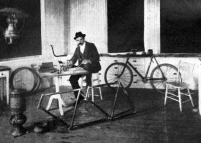
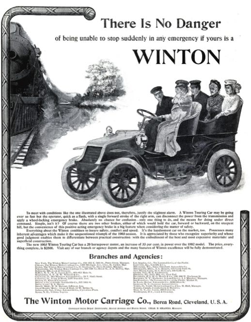
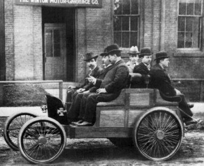

### Weekly Newsletter 每周简报

The best of _The Saturday Evening Post_ in your inbox!  

周六晚报》在您的收件箱中的最佳内容!

**This article from the February 8, 1930, issue of the _Saturday Evening Post_ was featured in the _Post_’s _Special Collector’s Edition: Automobiles in America!  

这篇文章来自1930年2月8日的《周六晚报》，被收录在该报的特别收藏版中。汽车在美国!_** 

_In 1930, Alexander Winton, by then one of the legends of the auto industry, wrote this article for the_ Post _about the wild early days when even promoting the idea of a self-propelling machine would make you the object of ridicule. Winton was a bicycle maker, and as he writes below, he soon became infatuated with the idea of a bicycle that “a rider wouldn’t have to push and keep pushing.” In 1896, he founded the Winton Motor Carriage company, and soon began turning out cars at the dizzying rate of four per year. He would sell his first car in 1897 — arguably the first automobile sold in the U.S. — for the princely sum of $1,000._  

1930年，当时的汽车业传奇人物之一亚历山大-温顿（Alexander Winton）为《邮报》写了这篇文章，讲述了早期疯狂的日子，当时即使宣传自走式机器的想法也会使你成为被嘲笑的对象。温顿是一名自行车制造商，正如他在下面写的那样，他很快就迷恋上了 "骑手不必推动和继续推动 "的自行车的想法。1896年，他成立了温顿马车公司，并很快开始以每年四辆的惊人速度生产汽车。他将在1897年出售他的第一辆汽车--可以说是在美国出售的第一辆汽车--售价为1000美元的小钱。

There has been much argument as to who made the first automobile in this country. My own conviction is that the honor belongs to Charles E. Duryea. I began serious experiments in 1893, and I am sure Duryea was conducting them prior to that year. But whether Duryea built the first automobile or whether he didn’t, the fact remains I built, and sold, the first American- made gasoline car.  

关于谁制造了这个国家的第一辆汽车，已经有很多争论。我自己的信念是，这一荣誉属于查尔斯-E-杜耶。我在1893年开始进行认真的实验，我确信杜耶在那一年之前就在进行实验。但是，不管杜耶是否制造了第一辆汽车，事实是我制造并销售了第一辆美国制造的汽油车。

The exact date of the sale was March 24, 1898, and about a week later — on April 1, 1898 — I received payment and shipped the car to its new owner, Robert Allison, a mechanical engineer of Port Carbon, Pennsylvania. I bought it back after Allison had used it a few years, and it is now in the Smithsonian Institution, in Washington.  

出售的确切日期是1898年3月24日，大约一周后--1898年4月1日--我收到了付款，并将车运给了它的新主人，宾夕法尼亚州卡本港的机械工程师罗伯特-埃里森。在艾利森使用了几年后，我又把它买了回来，现在它在华盛顿的史密森学会里。

When I first contemplated the application of gasoline for vehicles, I had a bicycle plant in Cleveland. Because bikes interested me, my mind naturally turned to something a rider wouldn’t have to push and keep pushing if he was trying to get some place. But the great obstacle to the development of the automobile was the lack of public inter- est. To advocate replacing the horse, which had served man through centuries, marked one as an imbecile. Things are very different today. But in the ’90s, even though I had a successful bicycle business, and was building my first car in the privacy of the cellar in my home, I began to be pointed out as “the fool who is fiddling with a buggy that will run without being hitched to a horse.” My banker called on me to say: “Winton, I am disappointed in you.”  

当我第一次考虑将汽油应用于车辆时，我在克利夫兰有一个自行车厂。因为我对自行车感兴趣，我的想法自然而然地转向了骑行者在试图到达某个地方时不必推着走的东西。但是，发展汽车的最大障碍是缺乏公共接口。主张取代为人类服务了几个世纪的马，标志着一个人是个低能儿。今天的情况已经非常不同。但在90年代，尽管我有一个成功的自行车生意，并且正在我家的地下室里制造我的第一辆汽车，但我开始被指为 "正在摆弄一辆不用拴在马身上就能跑的马车的傻瓜"。我的银行家打电话给我说。"温顿，我对你很失望。"

That riled me, but I held my temper as I asked, “What’s the matter with you?” He bellowed: “There’s nothing the matter with me. It’s you! You’re crazy if you think this fool contraption you’ve been wasting your time on will ever displace the horse.”  

这激怒了我，但我忍住了脾气，问道："你怎么了？"他吼了起来。"我没有什么问题。是你!如果你认为你一直在浪费你的时间的这个傻瓜装置会取代马，那你就疯了。"

From my pocket I took a clipping from the New York World of November 17, 1895, and asked him to read it. He brushed it aside. I insisted. It was an interview with Thomas A. Edison: “Talking of horseless carriage suggests to my mind that the horse is doomed. The bicycle, which, 10 years ago, was a curiosity, is now a necessity. It is found everywhere. Ten years from now you will be able to buy a horseless vehicle for what you would pay today for a wagon and a pair of horses. The money spent in the keep of the horses will be saved and the danger to life will be much reduced.”  

我从口袋里拿出1895年11月17日《纽约世界报》的剪报，请他阅读。他把它放在一边。我坚持要看。这是对托马斯-A-爱迪生的采访。"谈到无马车，在我看来，马是注定要失败的。自行车，10年前还是一种好奇心，现在已经成为一种必需品。它随处可见。十年后，你可以用今天购买一辆马车和一对马的钱买一辆无马车。花在养马上的钱将被节省下来，对生命的危险也将大大减少。"

“It is only a question of a short time when the carriages and trucks of every large city will be run by motors. The expense of keeping and feeding horses in a great city like New York is very heavy, and all this will be done away with. You must remember that every invention of this kind which is made adds to the general wealth by introducing a new system of greater economy of force. A great invention which facilitates commerce, enriches a country just as much as the discovery of vast hoards of gold.”  

"每个大城市的马车和卡车都将由马达驱动，这只是一个短时间内的问题。在纽约这样的大城市里，饲养马匹的费用是非常沉重的，而这一切都将被取消。你必须记住，这类发明的每一项都是通过引入一个新的更经济的力量系统来增加总体财富的。一项促进商业的伟大发明，就像发现大量的黄金一样，使一个国家富裕起来。"

The banker threw back the clipping and snorted, “Another inventor talking.”  

银行家把剪报扔了回去，哼了一声："又一个发明家在说话。"

## Wild Ideas 狂野的想法

In the uncertainty of what the public would want, a great many strange contraptions were put together. Joseph Barsaleaux, a blacksmith of Sandy Hill, New York, built a motor horse. In his device, the horse moved on a single wheel about two feet in diameter, with the wheel attached to the shafts just as was a live horse. Reins attached to the mouth of the horse served as a steering gear, because the machinery was inside the horse and had to be regulated some way. The contraption weighed about 550 pounds, had a cruising speed of six miles an hour, and attracted some serious attention.  

在不知道公众会需要什么的情况下，许多奇怪的装置被组装起来。纽约桑迪山的铁匠Joseph Barsaleaux制造了一匹马达马。在他的装置中，马在一个直径约两英尺的单轮上移动，轮子与轴相连，就像一匹活马。连接在马嘴上的缰绳起到了转向装置的作用，因为机器在马体内，必须以某种方式进行调节。这个装置重约550磅，巡航速度为每小时6英里，吸引了一些严重的关注。

In Washington there was a vehicle which gained its power by using compressed city gas. George Elrick of Joliet, Illinois, was busy with an engine having no wheels or gears and which manufactured its own gas as it went along. D.I. Lybe of Sidney, Iowa, was the owner of patents on a spring-motor device which stored energy running downhill and used it going uphill, while on level ground he claimed his vehicle would cover 2,000 feet at a maximum speed of 30 miles an hour. Compressed air and superheated water were to be employed by another company. At the time there was more money and in uence back of that idea than was behind all the gasoline-car manufacturers put together.  

在华盛顿，有一种车辆通过使用压缩的城市煤气获得动力。伊利诺伊州Joliet的George Elrick正忙于研制一种没有轮子或齿轮的发动机，它在行驶过程中自己制造气体。爱荷华州西德尼的D.I.Lybe拥有一个弹簧马达装置的专利，该装置在下坡时储存能量，在上坡时使用能量，而在平地上，他声称他的车辆可以以每小时30英里的最大速度行驶2000英尺。压缩空气和过热的水将由另一家公司采用。在当时，支持这一想法的资金和影响力比所有汽油车制造商加起来的还要多。

Cars with steam propulsion came in — not one or two but more than 100. Electric vehicles clogged the market, but in the end, public opinion turned to gasoline because it was clean, safe, and dependable.  

采用蒸汽推进的汽车出现了--不是一两辆而是100多辆。电动汽车堵塞了市场，但最终，公众舆论转向了汽油，因为它清洁、安全、可靠。

In spite of my banker’s displeasure, I went ahead with my model and finally had it in such shape that I thought it would run. All I needed to finish the job was a set of tires. I went to the Goodrich Company, in Akron, and told them I wanted something bigger than their biggest bicycle tire, something that would fit the wheels of a horseless carriage.  

尽管我的银行家不高兴，我还是继续做我的模型，并最终使它达到了我认为可以运行的形状。我所需要的是一套轮胎来完成这项工作。我去了阿克伦的古德里奇公司，告诉他们我想要一个比他们最大的自行车轮胎更大的轮胎，要适合无马车的车轮。

“That’s a new one on us,” cried a man to whom I had been directed.  

"这对我们来说是个新问题，"一个我被引荐给他的人喊道。

“A horseless carriage, eh? _Hmph_! Will it run?”  

"一辆无马的马车，嗯？哼!它能跑吗？"

“You bet it will.” "你肯定会的。"

“Well, I guess we can make them, although we never have.”  

"好吧，我想我们可以制造它们，虽然我们从来没有做过。"

“That’s fine.” "这很好。"

The man hesitated, rubbed his chin, and observed: “We will make them, but you will have to pay for the molds.”  

那人犹豫了一下，揉了揉下巴，然后观察了一下。"我们会制造它们，但你必须支付模具费用。"

“Do what?” "做什么？"

“Yes, sir. There won’t be enough call for tires for horseless carriages, and we can’t afford to pay for the molds. Also, you will have to pay for them in advance — and the tires too. We’ll have them on our hands if you don’t get them.”  

"是的，先生。对无马车的轮胎不会有足够的需求，而且我们也付不起模具的费用。而且，你必须提前支付它们的费用--还有轮胎的费用。如果你不去买，我们就会把它们放在我们的手上。"

I paid. 我付了钱。

They were single-tube affairs, and were pretty expensive. It wasn’t long before I got a puncture, and while I thought of patching the tire I figured out what I considered a better idea. Molasses was heavy and would stop leaks if they weren’t too large, so I began pumping it into the tube. I pumped too hard. The rubber gave way and the molasses came out too quickly to be dodged.  

它们是单管的，而且相当昂贵。没过多久，我就被刺破了，当我想到补胎时，我想出了一个我认为更好的主意。糖蜜很重，如果泄漏不是太大的话，可以止漏，所以我开始把糖蜜泵入轮胎。我抽得太用力了。橡胶让步了，糖浆很快就出来了，无法躲避。

## The First Road Trip 第一次公路旅行

_**The tinkerer:** Alexander Winton in the office of his bicycle plant in Cleveland, 1893.  

修补者。1893年，亚历山大-温顿在他位于克利夫兰的自行车工厂的办公室里。_

That first car worked pretty well, but I saw so many things wrong with it that I started another, using part of my bicycle factory for the work. I foresaw a future in automobiles and tried to interest some people in starting a manufacturing plant. Failing in that, I decided to go on a long trip, hoping attention would be attracted to the machine.  

第一辆汽车运行得很好，但我看到它有很多问题，于是我又开始了另一辆车，用我的自行车厂的一部分来做这个工作。我预见到了汽车的未来，并试图引起一些人的兴趣，开办一个制造厂。如果失败了，我决定去做一次长途旅行，希望这台机器能引起人们的注意。

In July 1897, I confided in a friend: “I am going to drive my horseless carriage from Cleveland to New York. I am inviting you to come with me.”  

1897年7月，我向一位朋友倾诉。"我打算把我的无马车从克利夫兰开到纽约。我邀请你和我一起去。"

He laughed at me. I sought another friend.  

他对我笑了。我寻求另一个朋友。

On the morning of July 28, 1897, Bert Hatcher and I left Cleveland. _The Horseless Age_, one of the few motor publications of that time, wrote about us this way: “Combining business with recreation, Alexander Winton left Cleveland with a companion in a new motor carriage on the morning of July 28, and after a leisurely journey he reached New York City Saturday, August 7. From Mr. Winton’s account, no greater test could have been given the machine as, to use his own words, ‘the roads were simply outrageous.’ Fully two weeks of rainy weather had preceded him on the journey, and in many places the mud and water were hub deep, and in some places the sand was equally as bad. He traveled fully 800 miles, and the best day’s run was 150 miles. The machine consumed on an average of six gallons of gasoline a day, which would be little more than half a cent a mile for the trip. Much interest was shown by the people on the road and especially by those in the mountains.”  

1897年7月28日上午，伯特-哈奇和我离开克利夫兰。无马时代》是当时为数不多的汽车出版物之一，其中这样写到我们。"结合业务和娱乐，亚历山大-温顿于7月28日上午与一位同伴乘坐一辆新的机动车离开克利夫兰，经过一段悠闲的旅程，他于8月7日星期六到达纽约市。根据温顿先生的描述，没有什么能给这台机器带来更大的考验，因为用他自己的话说，"道路简直太糟糕了"。在他踏上旅程之前，已经有整整两个星期的阴雨天气，许多地方的泥浆和水都很深，有些地方的沙子也同样糟糕。他走了整整800英里，最好的一天跑了150英里。这台机器平均每天消耗6加仑汽油，这相当于每英里半美分以上。路上的人们，尤其是山区的人们，对这台机器表现出了极大的兴趣"。

Hatcher and I did not return by motor. We had blisters enough. You may wonder why, on this first trip ever attempted by an automobile over a long distance, we were able to complete a day’s journey on an average of six gallons of gasoline. The fuel was more volatile in those days, and we had a low-speed motor. The present high-speed motor uses a great deal more fuel, but it is a more adaptable engine for the needs of modern travel.  

哈奇尔和我没有乘车返回。我们有足够的水泡。你可能会问，为什么在这次汽车首次尝试的长距离旅行中，我们平均用六加仑的汽油就能完成一天的行程。那时的燃料比较不稳定，而且我们有一个低速马达。现在的高速发动机使用的燃料更多，但它是一个更适应现代旅行需要的发动机。

In those days there were no gasoline stations, and the only place the fuel could be purchased was in a drug store. If, by chance, the druggist had a gallon of it, we were happy. Seldom were we able to buy in such a large quantity and usually we had to be content with a pint or a quart.  

在那些日子里，没有汽油站，唯一能买到燃料的地方是药店。如果碰巧药店有一加仑的汽油，我们就很高兴。我们很少能买到这么大的数量，通常我们不得不满足于一品脱或一夸脱。

But aside from generous newspaper space, the trip attracted no attention. I waited for months, but no financiers came to put their tall silk hats on my desk.  

但除了慷慨的报纸版面外，这次旅行没有引起任何注意。我等了好几个月，但没有金融家来把他们的高高的丝绸帽子放在我的桌上。

Finally, however, the afternoon came when an assistant told me: “Mr. Metcalf is waiting to see you.”  

然而，终于到了下午，一位助手告诉我。"梅特卡夫先生在等着见你。"

“Who is he?” "他是谁？"

“I don’t know.” "我不知道。"

I hesitated, then said; “Send him in.”  

我犹豫了一下，然后说；"让他进来"。

The man came in and introduced himself. “My name is Irving D. Metcalf. I am from Oberlin College.”  

那人走了进来，介绍自己。"我的名字是欧文-D-梅特卡夫。我来自欧柏林学院。"

“A professor?” "一个教授？"

“Yes, sir.” "是的，先生。"

“You want to see my horseless carriage?”  

"你想看看我的无马车吗？"

“Yes, I do.” "是的，我知道。"

“There it is” — and I jerked my thumb over my shoulder to indicate the machine standing in a corner of the room.  

"就在那里"--我在肩上撸起大拇指，指示站在房间一角的机器。

I turned to resume some sketching I was doing when I heard Mr. Metcalf say: “Would you mind explaining it to me? I’ve read so much about that machine that I’m convinced you have a good thing and, if you have no objections, I’d like to invest a little money with you.”  

当我听到梅特卡夫先生说时，我转身继续我正在进行的一些素描创作。"你介意向我解释一下吗？我读了很多关于那台机器的文章，我相信你有一个好东西，如果你不反对，我想和你投资一点钱。"

I wasted no time in accompanying him to the machine and explaining its workings.  

我不失时机地陪他到机器前，解释其工作原理。

“How many can you build and sell the first year?” he finally asked.  

"第一年你能造多少，卖多少？"他最后问。

“Four.” "四个。"

“Sell me some stock?“ "卖给我一些股票？"

“If you want it!” "如果你想要的话！"

“How much can you spare?” "你能拿出多少钱？"

I almost held my breath. “Five thousand dollars’ worth.”  

我几乎屏住了呼吸。"价值五千美元。"

“All right.” "好吧。"

_Winton, January 24, 1903 温顿，1903年1月24日_

Up to that time no company had been organized to build and sell a gasoline automobile.  

到那时为止，还没有一家公司被组织起来制造和销售汽油汽车。

Not in this country, at least. So Metcalf became the first outside holder of stock in such a company.  

至少在这个国家没有。因此，梅特卡夫成为这样一家公司的第一个外部股票持有人。

We did not know where our customers would come from, but we were sure they would come. We started building four machines, and when one was finished, Robert Allison, hearing that I was manufacturing automobiles, came to Cleveland.  

我们不知道我们的客户会从哪里来，但我们确信他们会来。我们开始制造四台机器，当一台机器完成后，罗伯特-艾利森听说我在制造汽车，就来到了克利夫兰。

He wanted a ride. I told him to hop in, and then proceeded to give the first of many millions of demonstrations that since have preceded the sale of automobiles. We started out about noon and did not return until after supper. During the afternoon he had me drive to a dozen places where friends of his were working, and from each he sought advice. After each stop he had a new set of questions, but apparently I answered them satisfactorily, for when we returned to the factory he asked: “How much do you want for this carriage?”  

他想搭车。我让他跳进去，然后就开始了汽车销售之前的数百万次演示中的第一次。我们在中午时分出发，直到晚饭后才回来。下午，他让我开车去他朋友工作的十几个地方，并向每个人征求意见。每到一处，他都有一套新的问题，但显然我的回答令人满意，因为当我们回到工厂时，他问。"这辆马车你要多少钱？"

“One thousand dollars.” "一千美元。"

“I’ll buy it.” "我买了。"

Within a short time we sold the other three machines, getting $1,000 apiece. Our profit on each was $400. By the end of 1898 we had built and sold 25 carriages, and this was such an amazing production that no one believed it. I had to publish a statement telling the names of the owners and when their machines had been delivered.  

在很短的时间内，我们卖掉了另外三台机器，每台得到1000美元。我们每台的利润是400美元。到1898年底，我们已经制造并销售了25辆马车，这是一个惊人的产量，没有人相信它。我不得不发表一份声明，说明业主的姓名和他们的机器何时交付。

We were beginning to show a return on the original in- vestment, to build a business, and to start a gigantic industry. Those were vastly different days in manufacturing to what we now have. We had no long lines of broaching machines, multiple drills, cylinder grinders; no endless chains moving along parts to points needed. There was little of the time-saving of modern manufacturing methods. We had to develop to meet those demands, and in starting off, our tools consisted of the standard drills and lathes, plus good mechanics. Every workman we had in those days was a good mechanic. He could not hold a job unless he was. He didn’t spend his days or his years putting on a nut here or a screw there. If we needed spark plugs, he had to jump in and make them. He had to know how to ream out a cylinder. All argument to the contrary, I believe American life has lost something in the passing of the good mechanic and the widespread adoption of the automatic machine. For one thing, men have lost much of their usefulness to themselves. But that is beside the point.  

我们开始显示原始投资的回报，建立一个企业，并开始一个巨大的产业。那时的制造业与我们现在的情况大不相同。我们没有长长的拉床生产线，没有多头钻机，没有圆筒研磨机；没有无尽的链条将零件运送到需要的地方。几乎没有现代制造方法的省时性。我们必须发展以满足这些需求，在开始时，我们的工具包括标准的钻头和车床，以及良好的机械师。在那些日子里，我们的每个工人都是一个好的机械师。除非他是这样，否则他不可能拥有一份工作。他没有把他的日子或他的岁月花在这里装一个螺母或那里装一个螺丝上。如果我们需要火花塞，他必须跳进去做。他必须知道如何铰断一个气缸。所有与此相反的争论，我相信美国的生活在优秀机械师的消失和自动机器的广泛采用中失去了一些东西。首先，人们失去了许多对自己有用的东西。但这并不重要。

## No Secrets 没有秘密

We used foundry castings for cylinder blocks and, usually, the castings came to us with holes in them. Such a thing as rejecting the castings never occurred to us; we were too glad to get them, because foundry men weren’t entirely sold on the idea of making them. We plugged the holes with cast iron and said nothing. We made our own spark plugs — first out of mica, and then out of porcelain. Steering wheels were individualized ideas, not standardized equipment. One day Henry Ford came to Cleveland with a racing car. He had a steering wheel he had made himself and which spun around a number of times before he could get the car going in the desired direction. “Ford” I told him, “you are going to kill yourself with that thing.”  

我们使用铸造厂的铸件来制造汽缸体，通常，铸件上都有孔。我们从来没有想过要拒绝这些铸件；我们很高兴得到它们，因为铸造厂的人并没有完全接受制造它们的想法。我们用铸铁塞住孔，什么也没说。我们自己做火花塞--先用云母，然后用瓷器。方向盘是个性化的想法，而不是标准化的设备。有一天，亨利-福特带着一辆赛车来到克利夫兰。他有一个自己制作的方向盘，这个方向盘在他能使汽车向理想的方向行驶之前旋转了好几次。"福特 "我告诉他，"你会用那东西杀死你自己。"

“Why?” he asked. "为什么？"他问。

“Because you can’t control your car with it.”  

"因为你不能用它来控制你的车。"

He allowed as though I might be right.  

他允许，好像我可能是对的。

“You know I’m right,” I told him, and added I would send him blueprints of the wheel and gear I was using.  

"你知道我是对的，"我告诉他，并补充说我会把我使用的轮子和齿轮的蓝图发给他。

He thanked me, but instead of sending him the blue prints, I boxed up a complete outfit and shipped it to Detroit. He found plenty of use for it. The steering wheel was one of my early patents, and it was the same wheel that came into later and general use. It is but one of more than a hundred patents I hold on different parts for automobiles.  

他感谢我，但我没有把蓝图寄给他，而是把一套完整的装备装箱，运到了底特律。他发现它有很多用途。方向盘是我早期的专利之一，也是后来被普遍使用的同一个方向盘。这只是我在汽车不同部件上拥有的一百多个专利中的一个。

I believe I am entitled to say I have never collected a cent in royalties from them, nor will I. Lawyers have tried to argue me into bringing suits for infringements, but it so happened we pioneers always worked together. We loaned ideas. We loaned tools. We loaned patents. If we worked out a good idea, we loaned that. You see, some 20 years ago there was a man named George Baldwin Selden, a lawyer and inventor living in Rochester, New York, who caused a lot of trouble and expense to the automobile industry by bringing suit against all of us for the infringement of a patent that had been granted him on May 8, 1879. His patent covered a machine containing the essential principles of an automobile.  

我相信我有权说我从未向他们收取过一分钱的版税，也不会这样做。律师们曾试图说服我对侵权行为提起诉讼，但恰好我们这些先驱者总是一起工作。我们借出了想法。我们借出了工具。我们借出了专利。如果我们想出了一个好主意，我们就把它借出去。你看，大约20年前，有一个叫乔治-鲍德温-塞尔登的人，一个住在纽约罗切斯特的律师和发明家，他给汽车行业带来了很多麻烦和费用，因为他对我们所有人提起诉讼，指控我们侵犯了他在1879年5月8日获得的一项专利。他的专利涉及一种包含汽车基本原理的机器。

He tried to interest various persons in his idea, failed for years, and then entered into an agreement with William C. Whitney, an Eastern capitalist, on November 4, 1899, under which he turned over exclusive rights to his idea. Whitney purchased control of the Electric Vehicle Company and then began a vigorous enforcement of his claims. The Winton company was the first to be attacked because it was the largest, and though we put up a vigorous defense, we lost the first court fight. We appealed the case and, while waiting to be again heard, entered into an agreement with other manufacturers to pay certain royalties to Selden and Whitney.  

他试图让不同的人对他的想法感兴趣，但多年来都没有成功，然后在1899年11月4日与东方资本家威廉-C-惠特尼签订了一项协议，根据该协议他交出了对其想法的独家权利。惠特尼购买了电动车公司的控制权，然后开始大力推行他的主张。温顿公司是第一个受到攻击的，因为它是最大的，尽管我们进行了有力的辩护，但我们在第一次法庭斗争中输了。我们对该案提出上诉，在等待再次审理期间，与其他制造商达成协议，向塞尔登和惠特尼公司支付一定的特许权使用费。

For years Selden was in the courts, until, in January 1911, in the United States Circuit Court of Appeals, the validity of the Selden patent was upheld, but the defendant — the Ford Motor Company — was held to be not liable, because it was manufacturing a motor of a type known as the Otto engine, whereas Selden’s claims described one known as the Brayton type.  

多年来，塞尔登一直在法庭上，直到1911年1月，在美国巡回上诉法院，塞尔登专利的有效性得到支持，但被告--福特汽车公司--被认为不承担责任，因为它制造的是一种被称为奥托发动机的马达，而塞尔登的权利要求描述的是一种被称为布雷顿型的马达。

All of us were following the Otto principles, so that decision relieved us of further contributions to Selden and his backers. But the unpleasantness of all those suits brought together the manufacturers for an exchange of ideas and mutual protection. I am still old-fashioned and believe it was a good thing.  

我们所有人都在遵循奥托原则，所以这一决定使我们不必再为塞尔登和他的支持者提供捐助。但是，所有这些诉讼的不愉快使制造商们聚集在一起，进行思想交流和相互保护。我还是很守旧，认为这是一件好事。

## Self-Reliance 自力更生

We made our own radiators. These cooling devices were nothing more than banks of tubes through which water could ow. During summer months, on Saturdays and after-school hours, we used to have boys come in and string square tin washers, with a jagged hole punched in the center of each, on the tubes. When the washers were all in place we would dip the tubes in solder so as to make them one part.  

我们自己制作散热器。这些冷却设备只不过是一排排管子，水可以通过这些管子。夏天的时候，在星期六和放学后的时间里，我们经常让男孩来把方形的锡垫圈串在管子上，每个垫圈的中心打一个锯齿状的孔。当垫圈全部到位后，我们会将管子浸入焊料中，使其成为一个部分。

We made our own carburetors. The first device used was a tube which went down nearly to the bottom of the gasoline tank. Air went through it, was forced into the gasoline, and when the impregnated mixture reached the top, it was suctioned off and passed through a valve between the tank and the engine, so the mixture would be made lean enough to be combustible. That contrivance didn’t work any too well, so we made a mixer which was an ordinary valve and pipe through which the gasoline could pass on its way to the motor. Out of the mixer came the present carburetor. In the one we built I had a hole punched in the bottom so the air could reach the gasoline. One day I received a frantic letter from a Brooklyn doctor who had purchased one of my cars.  

我们自己做了化油器。第一个使用的装置是一根管子，它几乎一直延伸到汽油罐的底部。空气通过它，被迫进入汽油，当浸渍的混合物到达顶部时，它被吸走并通过油箱和发动机之间的一个阀门，这样混合物就会变得足够稀薄，可以燃烧。这个装置的效果并不好，所以我们做了一个混合器，这是一个普通的阀门和管道，汽油可以通过它进入发动机。从混合器中产生了现在的化油器。在我们制造的那个化油器中，我在底部打了一个洞，这样空气就能到达汽油。有一天，我收到一封来自布鲁克林一位医生的疯狂信件，他购买了我的一辆车。

A few days later I was standing in his barn, looking at the machine, which, he said, wouldn’t run.  

几天后，我站在他的谷仓里，看着这台机器，他说，这台机器无法运行。

I examined the gas tank. It was all right. I looked over the spark plugs. Tested the batteries. Got down under the car and stared up underneath. Everything seemed all right, so I went around in front and spun the motor. It was dead. Finally I ran my fingers under the mixer.  

我检查了油箱。它是好的。我检查了火花塞。测试了电池。趴在车底，盯着车底看。一切看起来都很好，所以我绕到前面去，转动了一下马达。它是死的。最后，我把手指伸到搅拌机下面。

Then I broke in on the physician’s sarcastic twitterings with this question: “Why did you plug the hole in the bottom of the mixer?  

然后我用这个问题闯入了医生的讽刺性叽叽喳喳。"你为什么要堵住搅拌器底部的洞？

“To keep the gasoline from leaking.”  

"为了防止汽油渗漏。"

“Have you ever studied chemistry?”  

"你学过化学吗？"

“Certainly.” "当然可以。"

“I see. But you never learned that an explosion is impossible without a mixture of some sort. In this case it happens that gasoline has to be mixed with air before results can be obtained.”  

"我明白了。但你从来没有学过，没有某种混合物，就不可能发生爆炸。在这种情况下，恰好汽油必须与空气混合才能获得结果。"

It was my turn to be sarcastic. I punched another hole in the mixer, drained off the gasoline which had flooded the cylinders, put the fluid back in the tank, turned the crank, and started the motor.  

这回轮到我讽刺了。我在混合器上又打了一个洞，排掉了淹没气缸的汽油，把液体放回油箱，转动曲柄，启动了马达。

That was one thing we pioneers in automobiles had to do that presidents of companies miss today. We had to give personal service to our customers. Many times I have piled out of bed on a winter’s night to aid a stranded driver. A good many times, too, I left my telephone receiver off the hook so I could get some sleep.  

这是我们这些汽车先驱必须做的一件事，而今天的公司总裁们却错过了。我们必须为我们的客户提供个人服务。很多时候，我在冬天的夜晚从床上爬起来，帮助一个被困的司机。也有很多次，我把我的电话听筒放在钩子上，这样我就能睡上一觉。

Batteries, so dependable now, were practically useless as they then made them. The battery was nothing but a receptacle holding containers, or cups, filled with the active acid fluid. These cups were made of carbon, and after a car had traveled a couple of blocks the cups were almost sure to break, spilling their contents and rendering them useless.  

现在如此可靠的电池，在他们当时的制造中几乎毫无用处。电池只不过是一个盛放容器或杯子的容器，里面装有活性酸液。这些杯子是由碳制成的，在汽车行驶了几个街区后，杯子几乎肯定会破损，里面的东西溢出来，使其失去作用。

A man named Nungesser was building ours, and they were causing me so much trouble that I refused to put them in the cars. I went to Nungesser and said to him: “I want you to tell me the truth. For weeks you have been promising a dependable battery and you haven’t delivered. What’s wrong? Can’t you make one?”  

一个叫Nungesser的人在建造我们的，他们给我带来了很多麻烦，我拒绝把他们放在车上。我去找Nungesser，对他说。"我想让你告诉我真相。几个星期以来，你一直承诺提供可靠的电池，但你却没有兑现。怎么了？你就不能制造一个吗？"

His face flushed as he admitted: “I can’t, Mr. Winton. I’ve tried everything and can find nothing.”  

他的脸红了，他承认："我不能，温顿先生。我什么都试过了，什么都找不到。"

That was bad news for me. I went into his plant, looked over various experiments and finally suggested: “Why don’t you use a wire gauze for your cup instead of carbon?”  

这对我来说是个坏消息。我走进他的工厂，看了看各种实验，最后建议："你为什么不用钢丝纱布做杯子，而用碳呢？"

“A wire gauze?” "一个钢丝纱布？"

“Yes. Use copper. It is flexible and will not deteriorate in the acid solution.”  

"是的，使用铜。它很灵活，在酸溶液中不会变质。"

He tried it and it worked. Worked so well that he o ered me a half interest in his business. I declined, although it would not have cost me a cent. I told him I was having troubles enough in the automobile business. That suggestion solved battery difficulties for a good many years and was really the beginning of the present storage battery. Nungesser later sold out to one of the big battery companies for an appreciable sum of money.  

他试过了，而且成功了。效果如此之好，以至于他让我在他的生意中获得一半的利益。我拒绝了，尽管这不会花费我一分钱。我告诉他，我在汽车行业遇到的麻烦已经够多了。这个建议解决了很多年来的电池问题，也是目前蓄电池的真正开端。Nungesser后来以一笔可观的资金卖给了一家大的电池公司。

## The Demise of the Half-Cranked Starter  

半曲轴启动器的消亡

_**Six pack:** Alexander Winton, wearing a soft hat, is in the front seat with a group of his friends in front of the Winton Motor-Carriage Company in 1900.  

六包。1900年，戴着软帽的亚历山大-温顿与他的一群朋友在温顿汽车公司前的前座上。_

We made our own fans, our own differentials, transmissions, frames, brakes. I built the first two-braking system, and a Winton car was first to be equipped with internal and external brakes on the one drum.  

我们制造了自己的风扇、自己的差速器、变速器、车架、制动器。我建造了第一个双刹车系统，温顿的汽车是第一个在一个鼓上配备内部和外部刹车的汽车。

This was another of my patents, and it is only in the last few years that four-wheel brakes have taken the place of those I worked out. We built our own starters. We had an air starter that took the pressure from the cylinders, stored it in a tank, and kept it ready for use. This air starter was the forerunner, in a sense, of the present electric starter.  

这是我的另一项专利，只是在过去几年里，四轮制动器才取代了我研究出来的那些制动器。我们建造了自己的启动器。我们有一个空气启动器，它从气缸中获取压力，将其储存在一个油箱中，并保持其随时可以使用。从某种意义上说，这种空气启动器是目前电动启动器的先驱。

It came about in a simple way. I was looking at a car one day when one of my men came along and began cranking it. The motor was cold and it was hard work.  

它是以一种简单的方式产生的。有一天我正在看一辆车，我的一个手下走过来，开始摇动它。马达是冷的，这是个艰苦的工作。

“Next year we are going to equip our cars with starters,” I told an associate, standing with me.  

"明年我们要为我们的汽车配备启动器，"我对站在我身边的一位同事说。

“You mean so cars won’t have to be cranked?”  

"你是说这样汽车就不用摇动了？"

“Yes.” "是的。"

“How can you do that?” There was doubt in his voice.  

"你怎么能这样做？"他的声音里有怀疑。

“That’s what I’m thinking about.”  

"这就是我在考虑的问题。"

I went inside, made a drawing of the idea that had come, built a mechanism that could be operated by pressing down a foot, and we had the starter.  

我进了屋，把想到的想法画了出来，做了一个可以用脚按下操作的装置，我们就有了启动器。

## Dishonest Practices 不诚实的做法

If there was orderliness in our shops, there was vast confusion in the fledgling industry. Not only did we have to fight all the time to get things done but after we had them finished we had to pitch in and fight the wildcat automobile companies on the outside. It was difficult for the public to distinguish between the genuine and the ephemeral, and there are towns that can still point to windowless factories that were built from the stock sold by glib promoters, but which never manufactured more than two or three cars. Orphan cars were numerous and always were a 100 percent liability, because it was impossible to get replacements for broken parts. The big accessory companies that now help the industry did not exist.  

如果说我们的商店里有秩序，那么在这个刚刚起步的行业里就有巨大的混乱。我们不仅要一直为完成任务而奋斗，而且在完成任务后，我们还必须与外面的野猫汽车公司合作并进行斗争。公众很难区分真正的汽车和短暂的汽车，有些城镇仍然可以指出那些没有窗户的工厂，这些工厂是由花言巧语的推销员出售的股票建成的，但它们从未生产超过两辆或三辆汽车。孤儿车很多，而且总是百分之百的责任，因为坏了的零件不可能得到替换。现在帮助这个行业的大型配件公司并不存在。

Dishonest practices did much harm during years when support was most needed.  

在最需要支持的年份，不诚实的做法造成了很多伤害。

The orphan-car situation became so serious that the White Company — another of the pioneers — gave publication to this advertisement: “In a reserved and guarded way we have several times spoken of the desirability of purchasing a car made by a substantial firm possessing ample capital. In the last few months many concerns which have embarked in the manufacture of automobiles have discontinued, while others have withdrawn from actual business and their organizations have been scattered.  

孤儿车的情况变得如此严重，以至于怀特公司--另一个先驱者--发布了这则广告。"我们已经多次以保留和谨慎的方式谈到了购买由拥有充足资本的大型公司制造的汽车的可取性。在过去的几个月里，许多从事汽车制造的公司已经停止了生产，而其他公司则从实际业务中撤出，他们的组织已经分散了。

“The man who has bought a car from such a concern learns too late that he has a car on his hands which is the next best thing to useless and worthless simply because duplicate parts cannot be obtained. It is of utmost importance that the purchaser should inquire very thoroughly into the stability of the concern from which he buys, and that the order of a car at a special price is apt to be an incident of a closing-out sale.”  

"从这样的企业购买了汽车的人很晚才知道，他手上的汽车仅次于无用之物，毫无价值，因为无法获得重复的零件。最重要的是，购买者应该非常彻底地询问他所购买的企业的稳定性，以特殊价格订购汽车很可能是结账销售的一个附带条件。"

When you know that more than 500 automobile companies came in and went out in those first few years, you will better understand some of the forces working against those of us who were honestly trying to succeed. We pioneers had to be conservative.  

当你知道在最初的几年里有500多家汽车公司进入和退出时，你会更好地理解一些反对我们这些真诚地试图成功的人的力量。我们这些先驱者不得不采取保守态度。

## ‘Visionary to the Point of Lunacy’  

远见卓识到疯癫的地步

I remember that back in 1899 a bus line was announced to operate between Chicago and St. Louis. All of us believed bus lines would come some day, but we knew the public was not ready to accept such a dream. And, indeed, E.P. Ingersoll, a reporter on automobile topics, wrote the following widely circulated opinion piece: “The notion that electric vehicles, or vehicles of any other kind, will be able to compete with railroad trains for long-distance traffic is visionary to the point of lunacy. The fool who hatched out this latest motor canard was conscience-stricken enough to add that the whole matter was still in an exceedingly hazy state. But,if it ever emerges from the nebulous state,it will be in a world where natural laws are all turned topsy-turvy, and time and space are no more. Were it not for the surprising persistence of this delusion, the yarn would not be worthy of notice.”  

我记得，早在1899年，就有一条巴士线宣布在芝加哥和圣路易斯之间运营。我们所有人都相信巴士线总有一天会出现，但我们知道公众还没有准备好接受这样一个梦想。而且，事实上，E.P.英格索尔（E.P. Ingersoll），一位关于汽车话题的记者，写下了以下广泛流传的观点。"电动汽车或任何其他类型的车辆将能够与铁路列车竞争长途交通的概念是富有远见的，甚至到了疯狂的地步。孵化出这一最新的汽车骗局的傻瓜良心发现地补充说，整个问题仍然处于极其模糊的状态。但是，如果它有一天从模糊的状态中出现，那将是在一个自然法则被颠覆，时间和空间不再存在的世界里。如果不是因为这种错觉的惊人的持久性，这个纱线将不值得注意。"

We were trying to keep public interest, suddenly aroused, within reasonable boundaries. Aside from making cautious predictions, we had other diversions. Stirring word battles were fought in the greatest wilderness of all — the wilderness of terminology. Some wanted “horseless carriage” as a standard description; others recommended “polycycle,” “syke,” “motor wagon,” “motorcycle,” “horseless-carriage bicycle,” “road locomotive” — I guess there were a hundred names, but “automobile,” because of its easy rhythm, won out.  

我们正在努力将突然被激发的公众兴趣保持在合理的范围内。除了进行谨慎的预测，我们还有其他的消遣活动。在最伟大的荒野--术语的荒野--中进行了激烈的文字斗争。一些人希望用 "无马车 "作为标准描述；另一些人则建议用 "多轮车"、"SYKE"、"马车"、"摩托车"、"无马车自行车"、"公路机车"--我猜有一百个名字，但 "汽车 "因其简单的节奏而胜出。

## The Ford-Winton Race 福特-温顿比赛

Another thing we had to do which no president or executive of an automobile company of today would think of doing was to compete against each other on race tracks. Duryea, Walter C. White, Ford — we all used to race. That is how we attracted attention to our products. The public looked upon racing as a test of an automobile’s worth, and to a great extent it guided its buying habits by the results of the contests.  

我们必须做的另一件事是，今天没有一家汽车公司的总裁或高管会想到要做的事，那就是在赛车场上相互竞争。杜里亚、沃尔特-C-怀特、福特--我们都曾经参加过比赛。这就是我们如何吸引人们对我们产品的关注。公众把赛车看作是对汽车价值的一种检验，在很大程度上，他们通过比赛的结果来指导自己的购买习惯。

Ford got his first big reputation when he raced me at the Grosse Pointe track in Detroit. The day was October 10, 1901. Prior to that time Ford was little known. The first mention of him in connection with the motor industry, so far as I have been able to find, was in a small item in an issue of _The Horseless Age_, printed in 1898. It read: “Henry Ford, of Detroit, Michigan, chief engineer of the Edison Electric Company of that city, has built a number of gasoline vehicles which are said to have been successfully operated. He is reported to be financially supported by several prominent men of the city who intend to manufacture the Ford vehicle. From Mr. Ford himself no information can be gleaned regarding his vehicle or his plans for manufacture.”  

福特在底特律的格罗斯波因特（Grosse Pointe）赛道上与我比赛时，得到了他的第一个大名声。那一天是1901年10月10日。在那之前，福特鲜为人知。据我所知，第一次提到他与汽车工业有关的情况是在1898年出版的《无马时代》杂志中的一个小项目。它写道。"密歇根州底特律的亨利-福特是该市爱迪生电气公司的首席工程师，他制造了一些汽油车，据说已经成功运行。据报道，他得到了该市几个打算生产福特汽车的知名人士的资助。从福特先生本人那里无法得到有关他的车辆或其制造计划的信息。"

For some time prior to 1901, I had been the dirt-track champion driver, and when I received a challenge to race Ford in Detroit I accepted. A number of cars started, but the event soon narrowed into a test between my car and Ford’s. _The Detroit News_, on the day following the race, described the event: “Winton took the lead at the start and held it easily for five miles. Then the Detroit car began to creep up, and right in front of the grandstand, on the seventh lap, Ford forged ahead. Winton seemed to lose his power. His great car began to smoke and he was out of the race.”  

在1901年之前的一段时间里，我一直是泥地赛道的冠军车手，当我收到在底特律与福特比赛的挑战时，我接受了。一些车开始了比赛，但事件很快缩小为我的车和福特的车之间的测试。底特律新闻》在比赛后的第二天描述了这一事件。"温顿一开始就取得了领先，并轻松保持了五英里。然后底特律的车开始爬升，就在看台前，在第七圈，福特冲到了前面。温顿似乎失去了动力。他的好车开始冒烟，他被淘汰出局。

Ford won, of course, and in winning, attracted national attention. Afterward he said, “Put Winton in my car and he’ll beat anything in this country.”  

当然，福特赢了，而且在赢了之后，引起了全国的关注。事后他说，"把温顿放在我的车里，他就能打败这个国家的任何东西"。

I told him I’d put myself back in my own car and beat him any time he came on the track.  

我告诉他，我会把自己放回自己的车里，在他上赛道的任何时候击败他。

The following day he announced: “I will never again be seen in a race.” Nor was he.  

第二天，他宣布。"我再也不会在比赛中出现了"。他也是如此。

Those were great days. Lots of hardships. Lots of quarreling. Lots of satisfaction too. No paved highways for automobiles to shoot along at 60 and 70 miles an hour; just country roads, filled with ruts, sand, and mud, over which no one wanted to drive at the maximum speed of passenger cars, which was about 30 miles an hour. But every trip was a different adventure.  

那是伟大的日子。有很多艰难困苦。很多争吵。也有很多的满足感。没有铺好的公路让汽车以每小时60和70英里的速度行驶；只有充满车辙、沙子和泥浆的乡村道路，没有人愿意以客车的最高速度（大约每小时30英里）行驶在上面。但每次旅行都是一次不同的冒险。

—“Get a Horse,” \- "养马"，"  

_The Saturday Evening Post_, February 8, 1930  

周六晚报》，1930年2月8日

Become a Saturday Evening Post member and enjoy unlimited access. [Subscribe now](https://www.saturdayeveningpost.com/subscribe)  

成为《星期六晚报》会员，享受无限制的访问。 现在订阅
