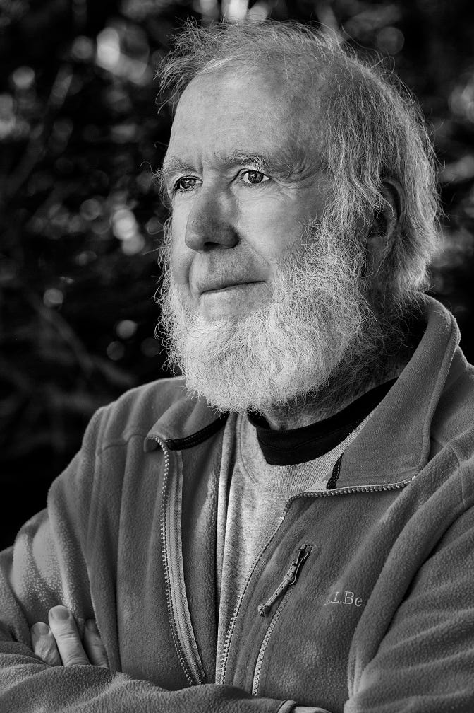

By Cmichel67 - [Own work](https://commons.wikimedia.org/w/index.php?curid=101529619), CC BY-SA 4.0  

作者：Cmichel67 - 自己的作品 , CC BY-SA 4.0

[Kevin Kelly](https://twitter.com/kevin2kelly) is one of the thinkers who helped define the ethos of the tech industry from its early days. As an editor of the Whole Earth Catalog in the 1980s and the founding editor of Wired magazine, he helped to integrate environmentalism and optimistic techno-futurism into a worldview that deeply influenced generations of founders, engineers, and creators. His work is so wide-ranging that it’s hard to sum it up in simple terms (I asked ChatGPT for help, but it could only give me vague generalities). His [books](https://en.wikipedia.org/wiki/Kevin_Kelly_(editor)#Books) and articles are a mix of technological prediction, interpretation 83 of the current zeitgeist, and philosophical exploration. Interestingly, his most recent book, _[Excellent Advice for Living: Wisdom I Wish I'd Known Earlier](https://www.amazon.com/Excellent-Advice-Living-Wisdom-Earlier/dp/0593654528)_, is a book of life advice! His intellectual breadth and ability to synthesize various seemingly unrelated trends and ideas are something to 5 I can only aspire.  

凯文-凯利是在科技行业早期就帮助定义其精神的思想家之一。作为20世纪80年代《整个地球目录》的编辑和《连线》杂志的创始编辑，他帮助将环保主义和乐观的技术未来主义融入世界观，深深影响了几代创始人、工程师和创造者。他的工作范围很广，很难用简单的术语来概括（我向ChatGPT寻求帮助，但它只能给我一些模糊的概括）。他的书和文章混合了技术预测、对当前时代潮流的解释和哲学探索。有趣的是，他最近的一本书《生活的卓越建议》。我希望我更早知道的智慧》是一本生活建议的书！他的知识面很广，综合能力很强。他的知识广度和综合各种看似不相关的趋势和想法的能力，是我唯一可以向往的。

Essentially, if you look at the fast-changing world of technology and you ask “Where is this all headed?”, and “Where _should_ this all be headed?”, then Kevin Kelly is a natural person to ask. And in the interview that follows, that is basically what I asked him. I especially focused on his idea of the “technium”, which is all of human technology acting together as a single natural system or organism. We talk about whether this technium exists in competition with Earth’s natural environment, or whether the two can exist in harmony. We also discuss AI, social media crypto, and we talk about whether and how technological development can be actively steered. He also dispenses a bit of helpful life advice.  

基本上，如果你看到快速变化的技术世界，并问 "这一切将走向何方？"，以及 "这一切应该走向何方？"，那么凯文-凯利是一个自然的询问者。在接下来的采访中，这基本上就是我问他的问题。我特别关注他的 "technium "的想法，即所有的人类技术作为一个单一的自然系统或有机体一起行动。我们谈论了这个技术体是否与地球的自然环境存在竞争，或者两者是否可以和谐地存在。我们还讨论了人工智能、社交媒体加密货币，我们还谈论了是否以及如何积极引导技术发展。他还分发了一些有用的生活建议。

_N.S.: So first let's talk about your new book, Excellent Advice for Living. What made you decide to write a book of life advice?  

N.S.: 那么首先让我们来谈谈你的新书《优秀的生活建议》。是什么让你决定写一本生活建议的书？_

K.K.: It’s an inadvertent book. Writing a book of advice was never on my bucket list. But I like pithy quotes. When I want to change my own behavior, I need to repeat little behavior-modifying mantras as reminders. I have found that memorable proverbs give me a way to grab hold of lofty advice. So if I can distill a whole book’s worth of advice into a sentence, that gives me the handle for it, to easily bring the lesson forward when needed. With that in mind I started the habit of compressing a lot of useful information into a short memorable tip. Advice is best when directed at a specific person, so I decided to aim my advice at my adult son, who was in his early twenties. Once I started writing tiny bits of advice down for him, I discovered I had a lot to say — as long as I could telegraph it into a tweet. Most of my advice is ancient wisdom, evergreen notions that have been circulating since forever. But I try to put everything into my own words, as few as possible. Most of my writing time on the project was trying to remove words and reduce the advice even further until it is less than 140 characters.  

K.K.：这是一本不经意的书。写一本建议的书从来没有在我的遗愿清单上。但我喜欢精辟的名言。当我想改变自己的行为时，我需要重复一些改变行为的小咒语作为提醒。我发现，令人难忘的谚语给了我一种抓住崇高建议的方法。因此，如果我可以把整本书的建议提炼成一句话，那就给了我一个把柄，在需要的时候可以轻松地把教训带入。考虑到这一点，我开始养成将很多有用的信息压缩成一个简短的、令人难忘的提示的习惯。建议最好是针对特定的人，所以我决定将我的建议对准我的成年儿子，他才二十出头。一旦我开始为他写下细小的建议，我发现我有很多话要说--只要我能够把它电报化为一条微博。我的大部分建议都是古老的智慧，是自古以来一直流传的常青观念。但我试图把所有东西都变成我自己的话，尽可能地少。我在这个项目上的大部分写作时间都是在试图删除单词，并进一步减少建议，直到它少于140个字符。

I like an old Irish custom where you give _others_ a present on your birthday. So on my 68th birthday, I gifted 68 short bits of advice to my son, and while I was at it, I shared it with the rest of my extended family and without any expectations, posted it on my blog. The list ricocheted around the internet. So in the following year I started jotting down more adages aimed at my two grown daughters. As I was composing them I kept asking myself a couple of questions: is this advice practical and actionable? Can I stand behind it as true for me?  Is this something I wished I had known earlier? If a bit passed these three filters, I’d add it to my list. On my next two birthdays I shared more insights I wished I had known earlier. I must have been getting better because these maxims reached escape velocity and were picked up by bloggers, newsletters and podcasters. They even made it onto the op-ed page of the _New York Times_.  

我喜欢爱尔兰的一个古老习俗，即在你生日时给别人一份礼物。所以在我68岁生日的时候，我把68条简短的建议送给了我的儿子，同时，我把它与我的其他大家庭分享，并在没有任何期望的情况下，把它张贴在我的博客上。这份清单在互联网上引起了强烈反响。所以在接下来的一年里，我开始记下更多针对我两个成年女儿的格言。在写的过程中，我不断问自己几个问题：这个建议是否实用和可操作？我可以支持它对我来说是真实的吗？ 这是不是我希望我早些知道的东西？如果有一点通过了这三个过滤器，我就会把它加入我的清单。在我接下来的两个生日上，我分享了更多我希望自己早些知道的见解。我一定是越来越好了，因为这些格言达到了逃逸的速度，被博客、新闻通讯和播客们所采纳。它们甚至上了《纽约时报》的专栏页。

It’s handy to have blog posts to point to, but I wanted a really easy way to pass these lessons onto a young person or someone young at heart. Thus a small printed book of 450 bits of unsolicited advice that I wished I had known earlier, or _[Excellent Advice for Living](https://amzn.to/3ja5BpY)_. To be published by Viking/Penguin in May.  

有博客文章可以参考是很方便的，但是我想有一个非常简单的方法，把这些经验传给年轻人或内心年轻的人。因此，我希望自己早点知道的450条不请自来的建议的小印刷书，即《生活的优秀建议》。将于5月由Viking/Penguin出版。

_N.S.: You've spent much of your life as a writer and editor. So your advice should be particularly relevant for me! What are one or two pieces of advice from the book that I should take to heart?  

N.S.: 你一生中大部分时间都在做作家和编辑。所以你的建议对我来说应该是特别有意义的!书中有哪一两条建议我应该记在心里？_

K.K.: Here are a few I learned the hard way:  

K.K.: 这里有一些是我艰难地学到的。

Most articles and stories are improved significantly if you delete the first page of the manuscript draft. Immediately start with the action.  

如果你删除手稿的第一页草稿，大多数文章和故事都会有明显的改进。立即从行动开始。

Separate the processes of creating from improving. You can’t write and edit, or sculpt and polish, or make and analyze at the same time. If you do, the editor stops the creator. While you write the first draft, don’t let the judgy editor get near. At the start, the creator mind must be unleashed from judgment.  

把创作和改进的过程分开。你不能同时进行写作和编辑，或雕刻和抛光，或制作和分析。如果你这样做，编辑就会阻止创造者的工作。当你写第一稿时，不要让评头论足的编辑靠近。在开始时，创造者的头脑必须从判断中释放出来。

To write about something hard to explain, write a detailed letter to a friend about why it is so hard to explain, and then remove the initial “Dear Friend” part and you’ll have a great first draft.  

要写一些难以解释的事情，可以给朋友写一封详细的信，说明为什么它如此难以解释，然后去掉最初的 "亲爱的朋友 "部分，你就会有一个好的初稿。

To be interesting just tell your story with uncommon honesty.  

要做到有趣，只需以不寻常的诚实来讲述你的故事。

_N.S.: Thanks! I will keep those in mind. You're somewhat of a role model for me, since you've managed to weave together surprisingly disparate interests -- technology, environmentalism, foreign cultures -- into a cohesive worldview, mainly through writing and editing, which is something I'd like to do as well. So anyway, let's talk a bit about that. One of your basic ideas is that technology itself makes up a natural system, which you call the technium. When did you first come up with this idea, and what made you think of it?  

N.S.: 谢谢!我会牢记这些。你在某种程度上是我的榜样，因为你已经成功地将令人惊讶的不同兴趣--技术、环保主义、外国文化--编织成一个有凝聚力的世界观，主要是通过写作和编辑，这也是我想做的事情。所以无论如何，让我们来谈一谈这个问题。你的一个基本想法是，技术本身构成了一个自然系统，你称之为technium。你第一次提出这个想法是什么时候，是什么让你想到了它？_

K.K.: First let me define what I mean by the technium. I call our human made system of all technologies working together, the technium. Each technology can not stand alone. It takes a saw to make a hammer and it takes a hammer to make a saw. And it takes both tools to make a computer, and in today’s factory it takes a computer to make saws and hammers. This co-dependency creates an ecosystem of highly interdependent technologies that support each other. The higher the technologies the more intertwined, complex, and codependent they become. At this point in our evolution we need farmers to support indoor plumbing and plumbing to support banks, and banks to enable farmers, and round and round   

K.K.：首先让我定义一下我所说的technium是什么意思。我把我们人类制造的、由所有技术共同工作的系统称为 "技术"。每种技术都不能单独存在。做一个锤子需要一把锯子，做一个锯子也需要一把锤子。而制造一台电脑也需要这两种工具，在今天的工厂里，需要一台电脑来制造锯子和锤子。这种共同依赖性创造了一个由高度相互依赖的技术组成的生态系统，它们相互支持。技术越高，它们就越相互交织，越复杂，越相互依赖。在我们进化的这一点上，我们需要农民支持室内管道，管道支持银行，银行支持农民，周而复始。

You might call this network of technologies “culture” because it is the sum of everything that humans make. But the technium is more than just the sum of everything that is made. It differs from culture in that it is a persistent system with agency. Like all systems, the technium has biases and tendencies toward action, in a way that the term “culture” does not suggest. The one thing we know about all systems is that they have emergent properties and unexpected dynamics that are not present in their parts. So too, this system of technologies (the technium) has internal leanings, urges, behaviors, attractors that bend it in certain directions, in a way that a single screwdriver does not. These systematic tendencies are not extensions of human tendencies; rather they are independent of humans, and native to the technium as a whole. Like any system, if you cycle through it repeatedly, it will statistically favor certain inherent patterns that are embedded in the whole system. The question I keep asking is: what are the tendencies in the system of technologies as a whole? What does the technium favor?  

你可以把这个技术网络称为 "文化"，因为它是人类制造的一切的总和。但是，技术不仅仅是所制造的一切的总和。它与文化的不同之处在于，它是一个具有代理权的持久性系统。像所有的系统一样，technium有偏见和行动的倾向，而 "文化 "一词并不表明这一点。我们对所有系统都知道的一点是，它们有突发的属性和意外的动态，而这些属性和动态在它们的部分中是不存在的。因此，这个技术系统（technium）也有内部倾向、冲动、行为、吸引者，使其向某些方向弯曲，而单一的螺丝刀则不会。这些系统化的倾向不是人类倾向的延伸；相反，它们独立于人类，是技术整体的本源。像任何系统一样，如果你反复循环，从统计学上看，它将有利于某些嵌入整个系统的固有模式。我一直在问的问题是：作为一个整体，技术系统中的趋势是什么？技术体系青睐什么？

This idea kind of arrived from reading the critics of technology, such as Ted Kaczynski, the Unabomber, or Lewis Mumford, or Langdon Winner. They argued that our human-made artifacts create a deep web of interdependencies which give the technosphere its own agency, and I found their arguments convincing. They see the strength of this system as getting increasingly stronger, with great non-human agency, which I also agree with. But where I depart from the critics is that they are convinced that this network of technologies, this technium, is hostile to both nature and in particular antithetical to us humans, its creators. In fact, in their view, the technium is so antagonistic, and so powerful, yet beyond our control, that we need to dismantle it, or at least diminish it, or unplug it. In the eyes of the Unabomber and other anti-civilizationists, we need to destroy the technium before it destroys us.  

这种想法来自于对技术的批评，比如特德-卡钦斯基（Ted Kaczynski），"炸弹客"（Unabomber），或刘易斯-芒福德（Lewis Mumford），或兰登-维纳（Langdon Winner）。他们认为，我们的人类制造的人工制品创造了一个相互依赖的深网，使技术圈有了自己的机构，我发现他们的论点很有说服力。他们认为这个系统的力量越来越强，有很大的非人类机构，我也同意这一点。但我与批评者的不同之处在于，他们确信这个技术网络，这个技术圈，既敌视自然，尤其是与我们人类，即它的创造者对立。事实上，在他们看来，这个技术体系是如此的敌对，如此的强大，但又是我们无法控制的，所以我们需要拆除它，或至少减少它，或拔掉它的插头。在Unabomber和其他反文明人士的眼中，我们需要在技术体摧毁我们之前将其摧毁。

On the other hand, I see this technium as an extension of the same self-organizing system responsible for the evolution of life on this planet. The technium is evolution accelerated. A lot of the same dynamics that propel evolution are also at work in the technium. At its core the technium is an ecosystem of inventions capable of evolving entirely new forms of being that wet biology alone can not reach. Our technologies are ultimately not contrary to life, but are in fact an extension of life, enabling it to develop yet more options and possibilities at a faster rate. Increasing options and possibilities is also known as progress, so in the end, what the technium brings us humans is progress.   

另一方面，我认为这个技术体是负责这个星球上生命进化的同一个自组织系统的延伸。技术体是进化的加速。许多推动进化的动力也在技术体中起作用。技术体的核心是一个发明的生态系统，能够进化出全新的存在形式，而这是湿生物学本身所不能达到的。我们的技术最终不会与生命背道而驰，实际上是生命的延伸，使其能够以更快的速度发展更多的选择和可能性。增加选择和可能性也被称为进步，所以最终，技术带给我们人类的是进步。

_N.S.: You talk about the emergent properties of the technium. What are some of these emergent properties? Are we capable of confirming their existence with data and writing down simple, explicable rules that predict the evolution and/or the behavior of the technium itself?  

N.S.：你谈到了技术体的涌现属性。这些涌现的属性有哪些？我们是否有能力用数据证实它们的存在，并写下简单的、可解释的规则来预测技术体本身的进化和/或行为？_

K.K.: One unexpected emergent property of the technium is that most inventions and innovations are co-invented multiple times, simultaneously and independently. That is, more than one person will honestly invent the next new thing about the same time. This means that the popular image of the lone mad inventor or heroic scientist is just wrong. For instance 23 other inventors created electric incandescent light bulbs prior to Thomas Edison. Edison is renowned primarily because he was the first to figure out the business model of electric lighting. Simultaneous independent invention is the norm, true for minor as well as major leaps like calculus, steam engines and the transistor. Because each and every technology is not a single standalone idea but a web of many ideas, the technium itself emerges as a significant partner in invention. Libraries, journals, communication networks, and the accumulation of other technologies help create the next idea, beyond the efforts of a single individual. If Alexander Graham Bell had not secured the patent for inventing the telephone, Elisha Gray would have gotten it because they both applied for the telephone patent on the same day (Feb 14, 1876). There is plenty of data and confirmation about this emergent phenomenon, and we can predict with pretty good accuracy that lone inventors will become increasingly rare, and that invention and innovation will increasingly operate at a higher institutional level.  

K.K.：技术体的一个意想不到的突发属性是，大多数发明和创新都是同时和独立地多次共同发明的。也就是说，不止一个人将诚实地在同一时间发明下一个新事物。这意味着，孤独的疯狂发明家或英雄科学家的流行形象就是错误的。例如，在托马斯-爱迪生之前，有23位其他发明家创造了电热白炽灯泡。爱迪生之所以闻名，主要是因为他是第一个弄清电灯商业模式的人。同时进行的独立发明是常态，对于像微积分、蒸汽机和晶体管这样的微小和重大的飞跃都是如此。因为每一项技术都不是一个独立的想法，而是由许多想法组成的网络，所以技术本身成为发明的一个重要伙伴。图书馆、期刊、通信网络和其他技术的积累有助于创造下一个想法，超出了单个人的努力。如果亚历山大-格雷厄姆-贝尔没有获得发明电话的专利，埃利沙-格雷就会得到它，因为他们都在同一天（1876年2月14日）申请了电话专利。关于这种出现的现象，有大量的数据和证实，我们可以很准确地预测，孤独的发明家将变得越来越少，发明和创新将越来越多地在更高的机构层面运作。

To be even more precise, quantitative, and rule-ish, we’d need to have more than a single example of the technium. Right now we have only one technium and so we have an N=1 study, which yields meager reliable rules. But in pre-history, when there was scarce communication between the Americas, Europe, Asia, Africa, and Australia, we had a N=5 case. The sequence of inventions on each continent were highly correlated locally, with the order of 60 ancient technologies such as pottery, weaving, and dog domestication appearing in a similar pattern on each separate continent. We also see near-identical parallel inventions of tricky contraptions like slingshots and blowguns. However, because it was so ancient, we don’t have a lot of data for this behavior. What we would really like is to have a N=100 study of hundreds of other technological civilizations in our galaxy. From that analysis we’d be able to measure, outline, and predict the development of technologies. That is a key reason to seek extraterrestrial life.  

为了更精确、更量化、更有规则，我们需要有不止一个技巧性的例子。现在我们只有一个技巧，所以我们有一个N=1的研究，这产生了微薄的可靠规则。但在史前时期，当美洲、欧洲、亚洲、非洲和澳大利亚之间的交流很少时，我们有一个N=5的案例。每个大陆上的发明顺序在当地是高度相关的，60种古代技术的顺序，如陶器、编织和狗的驯化，以类似的模式出现在每个独立的大陆上。我们还看到近乎相同的平行发明，如弹弓和吹箭筒等棘手的玩意儿。然而，由于它是如此古老，我们没有很多关于这种行为的数据。我们真正想要的是对我们星系中数百个其他技术文明进行N=100的研究。从这个分析中，我们将能够测量、勾勒和预测技术的发展。这是寻求地外生命的一个关键原因。

I think if we did have a robust set of techniums to inspect we’d find emergent phenomena like the rampant replication we see on this planet. At the core of the origin of life, and its ongoing billion-year metabolism, is its ability to replicate and copy information accurately. Life copies itself to live, copies to grow, copies to evolve. Life wants to copy. We could say the same about the technium, particularly the informational technium we are currently swimming in. Anything digital that can be copied, will be copied. To perform any kind of communication, information will be replicated perfectly, again and again. To send a message from one part of the globe to another requires innumerable copies along the route to be made. When information is processed in a computer, it is being ceaselessly replicated and re-copied while it computes. Information wants to be copied. Therefore, when certain people get upset about the ubiquitous copying happening in the technium, their misguided impulse is to stop the copies. They want to stamp out rampant copying in the name of "copy protection,” whether it be music, science journals, or art for AI training. But the emergent behavior of the technium is to copy promiscuously. To ban, outlaw, or impede the superconductivity of copies is to work against the grain of the system. It is a losing game. It’s like trying to work against the propensity of life to replicate. The “rule” then, is to flow with the copies. The prediction would be that innovations, agents, companies, and laws that embrace the easy flow of copies will prevail, while the innovations, agents, companies, and laws that try to thwart liberated ubiquitous copies will ultimately not prevail.  This is not the quantitative, precise kind of prediction we’d like to have, but this kind of general emergent trend is the best we’ll do with a sample size of N1.  

我想如果我们确实有一套强大的技术来检查，我们会发现像我们在这个星球上看到的猖獗的复制这样的突发现象。生命起源的核心，以及它正在进行的数十亿年的新陈代谢，是它复制和准确复制信息的能力。生命为了生存而复制自己，为了成长而复制，为了进化而复制。生命想要复制。我们可以对技术体说同样的话，特别是我们目前所处的信息技术体。任何可以被复制的数字都将被复制。为了进行任何形式的交流，信息将被完美地复制，一次又一次。将一条信息从地球的一个地方发送到另一个地方，需要沿途进行无数次的复制。当信息在计算机中被处理时，它在计算时被不断地复制和再复制。信息希望被复制。因此，当某些人对技术领域发生的无处不在的复制感到不安时，他们被误导的冲动是要阻止这些复制。他们想以 "复制保护 "的名义杜绝猖獗的复制，无论是音乐、科学期刊，还是人工智能训练的艺术。但技术体的新兴行为是乱复制。禁止、取缔或阻碍复制的超导性是与系统的纹理相悖的。这是一个失败的游戏。这就像试图反对生命复制的倾向一样。那么，"规则 "就是与副本一起流动。预测的结果是，拥抱复制的轻松流动的创新、代理、公司和法律将占上风，而试图阻挠自由的无处不在的复制的创新、代理、公司和法律最终将不会占上风。 这并不是我们想要的那种定量的、精确的预测，但这种普遍出现的趋势是我们在N1的样本量下所能做到的最好的。

_N.S.: So let's talk about some of the current and near-future effects of the technium on our world. There's currently a big debate about how technology interfaces with the environment. On one side we have degrowthers, who think the environment -- including the climate, but also natural habitats -- can only be preserved by curbing economic growth, and thus see the impact of human technology on the natural world as fundamentally extractive. On the other side are the technologists, who hold that only technological innovation gives us a realistic chance of reducing our environmental footprint and averting truly disastrous climate change. What's your perspective on this debate?  

N.S.：那么，让我们来谈谈技术对我们世界的一些当前和未来的影响。目前有一场关于技术与环境如何互动的大辩论。一边是退化论者，他们认为环境--包括气候，也包括自然栖息地--只能通过遏制经济增长来保护，因此认为人类技术对自然界的影响从根本上说是开采性的。另一方是技术专家，他们认为只有技术创新才能给我们一个现实的机会来减少我们的环境足迹，避免真正灾难性的气候变化。你对这场辩论有什么看法？_

K.K.: There is no question I favor the latter perspective: that while technology has gotten us into this mess (climate change) only technology can get us out of it. Only the technium (our technological system) is “big” enough to work at the global scale needed to fix this planetary sized problem. Individual personal virtue (bicycling, using recycling bins) is not enough. However the worry of some environmentalists is that technology can only contribute more to the problem and none to the solution. They believe that tech is incapable of being green because it is the source of relentless consumerism at the expense of diminishing nature, and that our technological civilization requires endless growth to keep the system going. I disagree.  

K.K.：毫无疑问，我赞成后一种观点：虽然技术让我们陷入了这种困境（气候变化），但只有技术才能让我们摆脱困境。只有技术（我们的技术系统）足够 "大"，能够在全球范围内解决这个地球大小的问题。个人的美德（骑自行车，使用回收箱）是不够的。然而，一些环保主义者的担忧是，技术只能对问题做出更多贡献，而不能解决。他们认为，科技不可能是绿色的，因为它是无情的消费主义的源头，以自然界的减少为代价，而且我们的技术文明需要无休止的增长来维持系统的运转。我不同意。

In English there is a curious and unhelpful conflation of the two meanings of the word “growth.”  The most immediate meaning is to increase in size, or increase in girth, to gain in weight, to add numbers, to get bigger. In short, growth means “more.” More dollars, more people, more land, more stuff. More is fundamentally what biological, economic, and technological systems want to do: dandelions and parking lots tend to fill all available empty places. If that is all they did, we’d be well to worry. But there is another equally valid and common use of the word “growth" to mean develop, as in to mature, to ripen, to evolve.  We talk about growing up, or our own personal growth. This kind of growth is not about added pounds, but about betterment. It is what we might call evolutionary or developmental, or type 2 growth. It’s about using the same ingredients in better ways. Over time evolution arranges the same number of atoms in more complex patterns to yield more complex organisms, for instance producing an agile lemur the same size and weight as a jelly fish. We seek the same shift in the technium. Standard economic growth aims to get consumers to drink more wine. Type 2 growth aims to get them to not drink more wine, but better wine.   

在英语中，对 "增长 "一词的两个含义有一种奇怪而无益的混淆。 最直接的含义是指尺寸增加，或周长增加，体重增加，数字增加，变大。简而言之，增长意味着 "更多"。更多的钱，更多的人，更多的土地，更多的东西。更多从根本上说是生物、经济和技术系统想要做的事情：蒲公英和停车场倾向于填补所有可用的空地。如果这就是他们所做的一切，我们就会很担心。但是，"成长 "这个词还有另一个同样有效和普遍的用法，它意味着发展，如成熟、成熟、进化。 我们谈论成长，或我们自己的个人成长。这种成长不是指体重增加，而是指改善。这就是我们所说的进化或发展，或第二类成长。它是关于以更好的方式使用相同的成分。随着时间的推移，进化将相同数量的原子安排在更复杂的模式中，从而产生更复杂的生物体，例如，产生与水母相同大小和重量的敏捷狐猴。我们在技术领域寻求同样的转变。标准经济增长的目的是让消费者喝更多的酒。第二类增长的目的不是让他们喝更多的酒，而是喝更好的酒。

The technium, like nature, excels at both meanings of growth. It can produce more, rapidly, and it can produce better, slowly. Individually, corporately and socially, we’ve tended to favor functions that produce more. For instance, to measure (and thus increase) productivity we count up the number of refrigerators manufactured and sold each year. More is generally better. But this counting tends to overlook the fact that refrigerators have gotten better over time. In addition to making cold, they now dispense ice cubes, or self-defrost, and use less energy. And they may cost less in real dollars. This betterment is truly real value, but is not accounted for in the “more” column. Indeed a tremendous amount of the betterment in our lives that is brought about by new technology is difficult to measure, even though it feels evident. This “betterment surplus” is often slow moving, wrapped up with new problems, and usually appears in intangibles, such as increased options, safety, choices, new categories, and self actualization — which like most intangibles, are very hard to pin down.  The benefits only become more obvious when we look back in retrospect to realize what we have gained. Part of our growth as a civilization is moving from a system that favors more barrels of wine, to one that favors the same barrels of better wine.  

技术员和自然界一样，擅长两种意义上的增长。它可以迅速地生产更多，也可以缓慢地生产更好。在个人、企业和社会方面，我们倾向于倾向于产生更多的功能。例如，为了衡量（从而提高）生产力，我们计算每年生产和销售的冰箱数量。一般来说，多就是好。但这种计算往往忽略了一个事实，即冰箱随着时间的推移已经变得更好。除了制造冷饮，它们现在还可以分配冰块，或自我解冻，并使用更少的能源。而且它们的实际成本可能更低。这种改进是真正的实际价值，但没有被计入 "更多 "一栏中。事实上，新技术给我们的生活带来的大量改善是难以衡量的，尽管它感觉很明显。这种 "改善的盈余 "往往进展缓慢，被新问题包裹着，通常出现在无形资产中，如增加的选择、安全、选择、新类别和自我实现--像大多数无形资产一样，很难确定。 只有当我们回顾过去，意识到我们获得了什么时，好处才会变得更加明显。我们作为一个文明的成长的一部分是从一个有利于更多桶装酒的系统，转向一个有利于同样的桶装更好的酒的系统。

A major characteristic of sapiens has been our compulsion to invent things, which we have been doing for tens of thousands of years. But for most of history our betterment levels were flatlined, without much evidence of type 2 growth. That changed about 300 years ago when we invented our greatest invention -- the scientific method. Once we had hold of this meta-invention we accelerated evolution. We turned up our growth rate in every dimension, inventing more tools, more food, more surplus, more population, more minds, more ideas, more inventions, in a virtuous spiral. Betterment began to climb. For several hundred years, and especially for the last hundred years, we experience steady betterment. But that betterment — the type 2 growth — has coincided with massive expansion of “moreness.” We’ve exploded our human population by an order of magnitude, we’ve doubled our living space per person, we have rooms full of stuff our ancestors did not. Our betterment, that is our living standards, have increased alongside the expansion of the technium and our economy, and most importantly the expansion of our population. There is obviously some part of a feedback loop where increased living standards enables yearly population increases and more people create the technology for higher living standards, but causation is hard to parse. What we can say for sure is that as a species we don’t have much experience, if any, with increasing living standards and fewer people every year. We’ve only experience increased living standards alongside of increased population.  

智人的一个主要特征是我们对发明事物的强迫性，这一点我们已经做了几万年。但在历史上的大部分时间里，我们的改善水平是平缓的，没有太多的证据表明有第二类增长。大约300年前，当我们发明了我们最伟大的发明--科学方法时，情况发生了变化。一旦我们掌握了这个元发明，我们就加速了进化。我们在每个方面都提高了增长率，发明了更多的工具，更多的食物，更多的剩余，更多的人口，更多的思想，更多的想法，更多的发明，形成了一个良性的螺旋。改善开始攀升。几百年来，特别是在过去的一百年里，我们经历了稳定的改善。但这种改善--第二类增长--与 "更多 "的大规模扩张相吻合。我们的人口增长了一个数量级，我们每人的生活空间增加了一倍，我们的房间里装满了我们祖先没有的东西。我们的改善，也就是我们的生活水平，已经随着技术和经济的扩张而增加，最重要的是我们人口的扩张。很明显，有一些反馈回路，其中生活水平的提高使人口逐年增加，更多的人创造了更高的生活水平的技术，但因果关系是难以解析的。我们可以肯定的是，作为一个物种，我们没有太多的经验，如果有的话，就是生活水平的提高和每年人数的减少。我们只经历过在人口增加的同时生活水平提高的情况。

By their nature demographic changes unroll slowly because they run on generational time. Inspecting the demographic momentum today it is very clear human populations are headed for a reversal on the global scale by the next generation. After a peak population around 2070, the total human population on this planet will start to diminish each year. So far, nothing we have tried has reversed this decline locally. Individual countries can mask this global decline by stealing residents from each other via immigration, but the global total matters for our global economy. This means that it is imperative that we figure out how to shift more of our type 1 growth to type 2 growth, because we won’t be able to keep expanding the usual “more.”  We will have to perfect a system that can keep improving and getting better with fewer customers each year, smaller markets and audiences, and fewer workers. That is a huge shift from the past few centuries where every year there has been more of everything.   

就其性质而言，人口变化是缓慢展开的，因为它们是按代际时间运行的。检查今天的人口势头，非常清楚的是，人类人口在全球范围内将在下一代发生逆转。在2070年左右的人口高峰之后，这个星球上的人类总人口将开始逐年减少。到目前为止，我们所做的任何努力都无法扭转这种局部的下降。个别国家可以通过移民从对方那里抢夺居民来掩盖这种全球性的下降，但全球总量对我们的全球经济很重要。这意味着我们必须弄清楚如何将更多的第一类增长转为第二类增长，因为我们将无法继续扩大通常的 "更多"。 我们将不得不完善一个系统，能够在每年客户减少、市场和受众缩小、工人减少的情况下不断改进和完善。这是一个巨大的转变，因为在过去的几个世纪里，每年都有更多的东西出现。

In this respect “degrowthers” are correct in that there are limits to bulk growth — and running out of humans may be one of them. But they don’t seem to understand that evolutionary growth, which includes the expansion of intangibles such as freedom, wisdom, and complexity, doesn’t have similar limits. We can always figure out a way to improve things, even without using more stuff — especially without using more stuff! There is no limit to betterment. We can keep growing (type 2) indefinitely.  

在这方面，"退化者 "是正确的，因为批量增长是有限制的--人类的耗尽可能是其中之一。但他们似乎不明白，进化的增长，包括自由、智慧和复杂性等无形资产的扩展，并没有类似的限制。我们总是能想出办法来改善事物，即使不使用更多的东西--尤其是不使用更多的东西！我们可以想出一个办法来改善事物。改进是没有限制的。我们可以无限期地保持增长（第二类）。

The related concern about the adverse impact of the technology on nature is understandable, but I believe, can also be solved. The first phases of agriculture and industrialization did indeed steamroll forests and wreck ecosystems. Industry often required colossal structures of high-temperature, high pressure operations that did not operate at human or biological scale. The work was done behind foot-thick safety walls and chain link fences. But we have "grown.” We’ve learned the importance of the irreplaceable subsidy nature provides our civilizations and we have begun to invent more suitable technologies. Industrial-strength nuclear fission power will eventually give way to less toxic nuclear fusion power. The work of this digital age is more accommodating to biological conditions. As kind of a symbolic example, the raw ingredients for our most valuable products, like chips, require ultra cleanliness, and copious volumes of air and water cleaner than we’d ever need ourselves. The tech is becoming more aligned with our biological scale. In a real sense, much of the commercial work done today is not done by machines that could kill us, but by machines we carry right next to our skin in our pockets. We continue to create new technologies that are more aligned with our biosphere. We know how to make things with less materials. We know how to run things with less energy. We’ve invented energy sources that reduce warming. So far we’ve not invented any technology that we could not successfully make more green.  

对技术对自然的不利影响的相关担忧是可以理解的，但我相信，也是可以解决的。农业和工业化的最初阶段确实蒸煮了森林，破坏了生态系统。工业通常需要巨大的高温高压操作结构，而这些结构并不是在人类或生物规模上运作的。这些工作是在一英尺厚的安全墙和铁丝网后面进行的。但我们已经 "成长 "了。我们已经了解到大自然为我们的文明提供的不可替代的补贴的重要性，我们已经开始发明更合适的技术。工业强度的核裂变发电最终将让位于毒性较小的核聚变发电。这个数字时代的工作对生物条件更加包容。作为一种象征性的例子，我们最有价值的产品的原材料，如芯片，需要超洁净，大量的空气和水比我们自己需要的还要干净。技术正变得与我们的生物规模更加一致。在真正意义上，今天的许多商业工作不是由可能杀死我们的机器完成的，而是由我们在口袋里紧贴皮肤的机器完成的。我们继续创造新的技术，与我们的生物圈更加一致。我们知道如何用更少的材料制造东西。我们知道如何用更少的能源来运行东西。我们已经发明了能减少变暖的能源。到目前为止，我们还没有发明过任何我们不能成功地使之更加绿色的技术。

We have a ways to go before we implement these at scale, economically, with consensus. And it is not inevitable at all that we will grab the political will to make these choices. But it is important to realize that the technium is not inherently contrary to nature; it is inherently derived from evolution and thus inherently capable of being compatible with nature. We can choose to create versions of the technium that are aligned with the natural world. Or not. As a radical optimist, I work towards a civilization full of life-affirming high technology, because I think this is possible, and by imagining "what could be" gives us a much greater chance of making it real.  

在我们大规模地、经济地、协商一致地实施这些之前，我们还有一段路要走。而且，我们要抓住政治意愿来做出这些选择，也不是不可避免的。但重要的是要认识到，技术体本质上并不与自然相悖；它本质上来自于进化，因此本质上能够与自然兼容。我们可以选择创造与自然界一致的technium版本。或者不创造。作为一个激进的乐观主义者，我致力于建设一个充满生命力的高科技文明，因为我认为这是可能的，通过想象 "可能是什么 "使我们有更大的机会使其成为现实。

_N.S.: I really like that vision a lot. You and I are quite closely aligned on our basic techno-optimism, our view of growth, and our concept of the relationship between human civilization and nature. But I'd like to try to challenge this optimism a little bit. Since around 2010, there have been increasing concerns about the direction the technium has taken us -- toward smartphones that absorb all our attention and take us out of the world and foster loneliness, toward social networks that sow sociopolitical discord and create feelings of personal inadequacy. Do you think innovation took something of a wrong turn in the 2010s, or are these problems overstated?  

N.S.：我真的非常喜欢这个愿景。你和我在基本的技术乐观主义、我们对增长的看法以及我们对人类文明和自然之间关系的概念上是相当一致的。但我想尝试挑战一下这种乐观主义。自2010年左右，人们越来越关注技术发展的方向--智能手机吸收了我们所有的注意力，使我们脱离了世界，助长了孤独感；社交网络播种了社会政治的不和谐，造成了个人的不充分感。你是否认为创新在2010年代出现了一些错误的转折，或者这些问题被夸大了？_

K.K.: These problems are overstated. The thing to remember when evaluating new technologies is we have to always ask “compared to what?.” Mercury-based dental fillings statistically caused some harm, but compared to what? Compared to cavities, they were a miracle. We tend to give existing technologies a pass from the degree of scrutiny we give new technologies. Social media can transmit false information at great range at great speed. But compared to what? Social media's influence on elections from transmitting false information was far less than the influence of the existing medias of cable news and talk radio, where false information was rampant. Did anyone seriously suggest we should regulate what cable news hosts or call in radio listeners could say? Bullying middle schoolers on social media? Compared to what? Does it even register when compared to the bullying done in school hallways? Radicalization on YouTube? Compared to talk radio? To googling?  

K.K.：这些问题被夸大了。在评估新技术时要记住的一点是，我们必须始终问 "与什么相比？"。据统计，以汞为基础的牙科填充物造成了一些伤害，但与什么相比？与蛀牙相比，它们是一个奇迹。我们倾向于给现有的技术一张通行证，而不是像我们给新技术的审查程度那样。社交媒体可以在很大的范围内以很快的速度传播虚假信息。但和什么相比呢？社交媒体因传播虚假信息而对选举产生的影响远远小于有线电视新闻和谈话广播等现有媒体的影响，后者的虚假信息非常猖獗。有谁认真建议我们应该规范有线电视新闻主持人或电话广播听众的言论？在社交媒体上欺负初中生？与什么相比？与学校走廊里的欺凌行为相比，它甚至能被记录下来吗？YouTube上的激进行为？与谈话广播相比？与谷歌搜索相比？

The complexity of social media is akin to biology. It is not a coincidence that we speak of things going viral. Figuring out what is going on with these new platforms, what is harmful, what is beneficial, is as challenging as determining what is best for our health. Human bodies have so many interacting variables, all difficult to isolate, that we can’t rely on a single or even a few studies to determine our best health practices. Initial, honest, well-crafted medical studies are often proven wrong, sometimes embarrassingly wrong, many studies later. In fact it may take _hundreds_ of studies before we can say a result is “true." Social media is equally complex, with even more variables, and it is still an infant. We are trying to evaluate a baby that is roughly 250 months old, and hoping to predict what it will be good for when it grows up.   

社交媒体的复杂性类似于生物学。我们说事情会变成病毒，这并不是一个巧合。弄清楚这些新平台是怎么回事，什么是有害的，什么是有益的，就像确定什么对我们的健康最好一样具有挑战性。人体有许多相互作用的变量，都很难隔离，所以我们不能依靠单一或甚至几个研究来确定我们的最佳健康做法。最初的、诚实的、精心设计的医学研究常常被证明是错误的，有时是令人尴尬的错误，许多研究之后。事实上，在我们说一个结果是 "真实 "之前，可能需要数百项研究。社会媒体同样复杂，有更多的变量，而且它还是一个婴儿。我们正试图评估一个大约250个月大的婴儿，并希望预测它长大后会有什么好处。

A further complication is that we are judging a class of technologies based on what kids do with them. Kids are inherently obsessive about new things, and can become deeply infatuated with stuff that they outgrow and abandon a few years later. So the fact they may be infatuated with social media right now should not in itself be alarming. Yes, we should indeed understand how it affects children and how to enhance its benefits, but it is dangerous to construct national policies for a technology based on the behavior of children using it.  

另一个复杂的问题是，我们是根据孩子们的表现来评判一类技术的。孩子们对新事物有天生的迷恋，他们可能会深深地迷恋上一些东西，但几年后就会被淘汰和抛弃。因此，他们现在可能迷恋社交媒体的事实本身并不值得警惕。是的，我们确实应该了解它是如何影响儿童的，以及如何提高其效益，但根据儿童使用技术的行为来构建国家政策是危险的。

Similarly, we should be wary of evaluating a technology within only one culture. So far, we are extremely biased because we have examined social media primarily in the US. There is little research on the effects — plus or minus — on users in other cultures. Since it is the same technology, inspecting how it is used in other parts of the world would help us isolate what is being caused by the technology and what is being caused by the peculiar culture of the US.  

同样地，我们应该警惕只在一种文化中评估一种技术。到目前为止，我们是非常有偏见的，因为我们主要是在美国研究社交媒体。关于对其他文化中的用户的影响--加或减--的研究很少。既然是同样的技术，检查它在世界其他地方的使用情况将有助于我们分离出什么是由技术造成的，什么是由美国的特殊文化造成的。

There are surely new problems generated by social media. We can not use something for hours a day, every day, and have it not affect us. We have hints, but don’t really know. As we discover how it works, a wise society would modulate how this technology is used — by adults and children. As we begin to understand its tendencies, harms and benefits, we can devise incentives to continually re-design the tech to enhance democracy and well-being. All this must be done on the fly, in real time, because what we have learned over the past 100 years is that we can’t figure out, and can’t predict, what technologies will be good for simply by thinking and talking about them. New technologies are so complex they have to be used on the street in order to reveal their actual character. We are likely to guess wrong at first, as we have been wrong in the past when trying to guess what a new technology meant. We can laugh now at the moral panics over the degrading nature of novels, cinema, sports, music, dancing, TV, and comic books (the latter two prohibited in our house when I was growing up), but we know prohibitions never work in the long term. We should engage with social media, because we can only steer technologies while we engage them. Without engagement we don’t get to steer.  

社交媒体肯定会产生新的问题。我们不可能每天都用几个小时的东西，而让它不影响我们。我们有一些暗示，但并不真正了解。当我们发现它是如何工作的时候，一个明智的社会会调节这种技术的使用方式--由成人和儿童使用。当我们开始了解它的倾向、危害和好处时，我们可以制定激励措施，不断地重新设计技术，以加强民主和福祉。所有这些都必须实时进行，因为我们在过去的100年里所学到的是，我们无法弄清楚，也无法预测，仅仅通过思考和讨论，什么技术会有好处。新技术是如此复杂，必须在街上使用，才能显示出它们的实际特性。我们很可能一开始就猜错了，就像我们过去在试图猜测一项新技术的含义时，也是错误的。我们现在可以嘲笑对小说、电影、体育、音乐、舞蹈、电视和漫画书（在我成长过程中，后两者在我们家是被禁止的）的堕落性质的道德恐慌，但我们知道禁止从来没有长期的作用。我们应该参与社交媒体，因为我们只能在参与时引导技术。没有参与，我们就没有机会引导。

_N.S.: When you say "only we can steer technologies", who does the "steering"? Should government be regulating new technologies more heavily, and if so, how? It seems hard for users themselves -- ourselves! -- to steer these technologies. I've been a heavy Twitter user for years, but I've never managed to do much about its tendency toward misinformation and performative, attention-seeking aggression. No one else has either. How can we steer big platforms?  

N.S:当你说 "只有我们才能引导技术 "时，谁来 "引导"？政府是否应该对新技术进行更严格的监管，如果是的话，如何监管？用户自己--我们自己！似乎很难引导这些技术。-- 来引导这些技术。多年来，我一直是Twitter的忠实用户，但我从未设法对其错误信息和表演性的、寻求关注的侵略性的倾向做什么。其他人也没有这样做。我们怎样才能引导大平台？_

K.K.: There are 3 levels of steerage. Level 1, individually we (you) ARE steering Twitter when you decide to mute or not to mute, or ban or not ban. You are voting what you think is important by using it. Or some people vote by not using it. You don’t notice what difference you make because of the platform's humongous billions-scale. In aggregate your choices make a difference which direction it — or any technology — goes. People prefer to watch things on demand, so little by little, we have steered the technology to let us binge watch. Streaming happened without much regulation or even enthusiasm of the media companies. Street usage is the fastest and most direct way to steer tech.  

K.K.：有3个层次的引导。第一层，当你决定静音或不静音，或禁言或不禁言时，我们（你）正在单独引导Twitter。你正在通过使用它来投票决定你认为重要的事情。或者有些人通过不使用它来投票。你没有注意到你所做的事情有什么不同，因为这个平台的规模庞大，数以亿计。总的来说，你的选择对它--或任何技术--的发展方向有影响。人们更喜欢按需观看，所以我们一点一点地引导技术，让我们狂看。流媒体的发生没有太多的监管，甚至没有媒体公司的热情。街头使用是引导技术的最快和最直接的方式。

Level 2, is regulation by governments. This can work, and is often necessary to steer. The challenge is premature regulation. The panic cycle for tech begins on the first bit of news about possible harms to anyone, and first response is a call to regulate. But as we just discussed, because it’s a newborn, it is easy — if not certain — that our first impressions about the tech are wrong, and thus early regulations often tend to brake more than steer. We have some good case examples of regulating tech in the right direction. We steered DDT away from being used as a plantation-scale pesticide (poisoning entire wildlife ecosystems), and redirected to be used judiciously, carefully, in small amounts in villages to eliminate mosquito borne malaria, saving the lives of many millions with minimum effect on ecosystems. That took years to accomplish, but the evidence was vivid. We should require more than precautionary type of evidence in order to use regulation to steer.  

第二级，是政府的监管。这可以起作用，而且往往是必要的引导。挑战是过早的监管。科技的恐慌周期始于关于可能对任何人造成伤害的第一条新闻，而第一反应就是呼吁监管。但正如我们刚刚讨论的那样，由于它是一个新生事物，我们对该技术的第一印象很容易--如果不是肯定的话--是错误的，因此早期的监管往往倾向于刹车而不是引导。我们有一些监管科技的正确方向的好例子。我们引导DDT不再被用作种植园规模的杀虫剂（毒害整个野生动物生态系统），而是转而被明智地、谨慎地、少量地用于村庄，以消除蚊子传播的疟疾，在对生态系统影响最小的情况下拯救了数百万人的生命。这需要多年的时间来完成，但证据是生动的。我们应该要求比预防性的证据更多的证据，以便利用监管来引导。

The third level of steerage is through innovation and entrepreneurship. When new problems are seen, new solutions are invented. Sometimes engineers in the host companies offer technical remedies, or shift directions. Often times solutions come from startups outside. Occasionally new directions are developed by the customers themselves. Vibrators instead of the cacophony of ringing bells on cell phones is one example of a marketplace technological solution. The marketplace needs regulation to keep it level, clean, optimal, and fertile for innovations to flourish. This is probably the more important role for regulation in steering.  

第三层次的引导是通过创新和创业。当看到新问题时，就会发明新的解决方案。有时，东道国公司的工程师提供技术补救措施，或转变方向。很多时候，解决方案来自外部的初创企业。偶尔，新的方向是由客户自己开发的。取代手机铃声的振动器是市场技术解决方案的一个例子。市场需要监管，以保持它的水平、清洁、优化，并为创新的蓬勃发展提供沃土。这可能是监管在引导方面更重要的作用。

It’s a messy process. And as messy as it has been to steer social media, it will be even messier to steer AIs and genetic engines, principally because they are so close to our identity as human and because we are so ignorant of what humans are good for. Consensus of a preferred direction will be very slow in coming. And slow should be mandatory regulation.  

这是一个混乱的过程。就像引导社交媒体一样混乱，引导人工智能和基因引擎将更加混乱，主要是因为它们与我们作为人类的身份如此接近，而且我们对人类的作用如此无知。对首选方向的共识将是非常缓慢的。而缓慢应该是强制性的监管。

_N.S.: In fact, that's a good segue into the topic of AI, which of course everyone is talking about, given the recent success of chatbots and AI art programs. Where do you land on the spectrum of enthusiasm. Does this new technology change everything, or is it overhyped? What do you expect to change as a result of the new efflorescence of AI? Will the relationship between humanity and the technium fundamentally alter?  

N.S.: 事实上，这是一个很好的切入点，鉴于最近聊天机器人和人工智能艺术项目的成功，当然每个人都在谈论人工智能这个话题。你的热情在哪里。这项新技术是否会改变一切，还是被过度炒作？你期望人工智能的新发展会带来什么变化？人类和技术体之间的关系会从根本上改变吗？_

K.K.: Despite the relentless hype, I think AI overall is underhyped. The long-term effects of AI will affect our society to a greater degree than electricity and fire, but its full effects will take centuries to play out. That means that we’ll be arguing, discussing, and wrangling with the changes brought about by AI for the next 10 decades. Because AI operates so close to our own inner self and identity, we are headed into a century-long identity crisis.  

K.K.：尽管有无情的炒作，我认为人工智能总体上被低估了。人工智能的长期影响将在更大程度上影响我们的社会，但它的全部影响需要几个世纪才能发挥出来。这意味着，在未来10年里，我们将对人工智能带来的变化进行争论、讨论和争吵。由于人工智能的运作与我们自己的内心和身份如此接近，我们将进入一个世纪的身份危机。

This span is particularly notable because we have been discussing the effects of AI for 100 years already. In fact, never before have humans so thoroughly rehearsed something as far ahead as AI. Long before it arrives, we’ve been imagining its pros and cons, and trying to anticipate it for several generations. This serious rehearsal is an improvement in our culture, and a pattern we should continue for other technologies like genetic engineering, the metaverse, and so on. The upside to a long rehearsal is that upon arrival, we should not be too surprised. The downside to a long rehearsal is that there are more ways something goes wrong than right, and we’ve had time to think of all of the horrible stuff, so that the positive conjectures feel mythical and unreal.  

这个跨度特别值得注意，因为我们讨论人工智能的影响已经有100年了。事实上，人类从来没有像人工智能这样对某件事情进行过如此彻底的预演。早在它到来之前，我们就已经在想象它的优点和缺点，并试图在几代人的时间里预测它。这种认真的演练是我们文化的进步，我们应该为其他技术，如基因工程、元空间等，继续这种模式。长时间排练的好处是，在到来时，我们不应该太惊讶。长时间预演的缺点是，事情出错的方式比正确的多，而且我们已经有时间考虑所有可怕的东西，所以积极的猜想感觉是神话和不真实的。

But now, here are chatbots, commercially available. However, in 30 years we will look back to 2023 and everyone then will agree that while something is happening with artificial smartness, we do not have anything like AI now. What we tend to call AI, will not be considered AI years from now. One useful corollary of this is that from the perspective of looking back 30 years hence, there are no AI experts today. This is good news for anyone starting out right now, because you have as much chance as anyone else of making breakthroughs and becoming the reigning experts.  

但现在，这里有聊天机器人，商业上可以使用。然而，30年后，我们回过头来看2023年，那时每个人都会同意，虽然人工智能正在发生一些事情，但我们现在并没有类似人工智能的东西。我们倾向于称之为人工智能的东西，多年后将不会被认为是人工智能。这方面的一个有用的推论是，从30年后回顾的角度来看，今天没有人工智能专家。这对现在刚起步的人来说是个好消息，因为你和其他人一样有机会取得突破，成为卫冕的专家。

Nonetheless, right now machine learning is overhyped. It is not sentient, and not as smart as it seems. What we are discovering is that many of the cognitive tasks we have been doing as humans are dumber than they seem. Playing chess was more mechanical than we thought. Playing the game Go is more mechanical than we thought. Painting a picture and being creative was more mechanical than we thought. And even writing a paragraph with words turns out to be more mechanical than we thought.  So far, out of the perhaps dozen of cognitive modes operating in our minds, we have managed to synthesize two of them: perception and pattern matching. Everything we’ve seen so far in AI is because we can produce those two modes. We have not made any real progress in synthesizing symbolic logic and deductive reasoning and other modes of thinking. It is those “others” that are so important because as we inch along we are slowly realizing we still have NO IDEA how our own intelligences really work, or even what intelligence is. A major byproduct of AI is that it will tell us more about our minds than centuries of psychology and neuroscience have.  

尽管如此，现在机器学习被过度炒作。它没有知觉，也不像它看起来那么聪明。我们正在发现的是，我们作为人类一直在做的许多认知任务比它们看起来更笨。下棋比我们想象的更加机械。下围棋比我们想象的更机械。画画和创意比我们想象的更机械。而即使是用文字写一段话，结果也比我们想象的更机械。 到目前为止，在我们头脑中运作的可能有十几种认知模式中，我们已经成功地综合了其中的两种：感知和模式匹配。到目前为止，我们在人工智能领域所看到的一切，都是因为我们能够产生这两种模式。我们在合成符号逻辑和演绎推理以及其他思维模式方面没有取得任何真正的进展。正是这些 "其他 "非常重要，因为随着我们的进步，我们慢慢意识到我们仍然不知道我们自己的智能是如何工作的，甚至不知道智能是什么。人工智能的一个主要副产品是，它将比几个世纪的心理学和神经科学告诉我们更多关于我们的思想。

There are books full of lessons waiting to be said about about AI as it is being born, so let me state just a few provocative points about what I expect:  

关于正在诞生的人工智能，有很多书都在等着我们去说，所以请允许我就我的期望陈述几个挑衅性的观点。

•We should prepare ourselves for AIs, plural. There is no monolithic AI. Instead there will be thousands of species of AIs, each engineered to optimize different ways of thinking, doing different jobs (better than a general AIs could do). Most of these AIs will be dumbsmarten: smart in many things and stupid in others. Expect frustration about how stupid they can be while being so smart.  

\-我们应该为人工智能做好准备，是复数。不存在单一的人工智能。相反，将有成千上万种人工智能，每一种都被设计为优化不同的思维方式，做不同的工作（比一般人工智能做得更好）。这些人工智能中的大多数将是愚蠢的：在许多方面很聪明，但在其他方面却很愚蠢。期待他们在如此聪明的情况下还能如此愚蠢，这让人感到沮丧。

• Theoretically any computer can emulate any other computer, but in practice it matters what substrate a computer runs on. No matter how fast or “smart” an AI may be, as long as it runs on silicon it will remain an alien. Its intelligence will be brilliant, but alien. Its humor will be sharp, but a little off. Its creativity will be intense, but a little otherworldly. The best framework for understanding complex AIs is to think of them as artificial aliens. Think of a robot Spock, super smart, but not quite human.  

\- 理论上，任何计算机都可以模拟任何其他计算机，但在实践中，计算机运行在什么基质上很重要。无论人工智能有多快或多 "聪明"，只要它在硅上运行，它就仍然是一个外星人。它的智慧将是辉煌的，但却是外来的。它的幽默感将是尖锐的，但有点不正常。它的创造力将是强烈的，但却有点像另一个世界。理解复杂的人工智能的最佳框架是将它们视为人造外星人。想一想机器人斯波克，超级聪明，但不完全是人类。

• Consciousness is a liability and not an asset in an AI. It is distracting and dangerous. We want our AIs to just drive, and not get anxious. Many expensive AIs will be advertised as “consciousness-free.”  

\- 意识在人工智能中是一种责任而不是一种资产。它让人分心，也很危险。我们希望我们的人工智能只是开车，而不是焦虑。许多昂贵的人工智能将被宣传为 "无意识"。

• The relationship AIs will have with us will tend towards being partners, assistants, and pets, rather than gods. This first round of primitive AI agents like ChatGPT and Dalle are best thought of as universal interns. It appears that the millions of people using them for the first time this year are using these AIs to do the kinds of things they would do if they had a personal intern: write a rough draft, suggest code, summarize the research, review the talk, brainstorm ideas, make a mood board, suggest a headline, and so on. As interns, their work has to be checked and reviewed. And then made better. It is already embarrassing to release the work of the AI interns as is. You can tell, and we’ll get better at telling. Since the generative AIs have been trained on the entirety of human work — most of it mediocre — it produces “wisdom of the crowd”-like results. They may hit the mark but only because they are average.  

\- 人工智能与我们的关系将倾向于成为伙伴、助手和宠物，而不是神。像ChatGPT和Dalle这样的第一轮原始人工智能代理最好被认为是通用实习生。看起来，今年首次使用它们的数百万人正在使用这些人工智能来做他们如果有一个私人实习生会做的各种事情：写一个粗略的草稿，建议代码，总结研究，审查谈话，集思广益，制作一个情绪板，建议一个标题，等等。作为实习生，他们的工作必须要被检查和审查。然后再做得更好。按原样发布人工智能实习生的工作已经很尴尬了。你可以告诉，我们会在告诉方面做得更好。由于生成性人工智能已经在人类的全部工作中得到了训练--其中大部分是平庸的--它产生了类似于 "人群智慧 "的结果。他们可能击中目标，但只是因为他们是平均水平。

• Because AIs are being trained on average human work, they exhibit the biases, prejudices, weaknesses, and vices of the average human. But we are not going to accept that. Nope. We want the ethics and values of AIs to be better than ours! They have to be less racist, less sexist, less selfish than we are on average. It is NOT difficult to program in ethical and moral guidelines into AIs — it is just more code. The challenge is that we humans have no consensus on what we mean by “better than us,” and exactly who “us” is. The problem is not the AIs. The problem is that the AIs have illuminated our own shallow and inconsistent ethics — even at our best. So making AIs better than us is a huge project.  

\- 因为人工智能是在普通人的工作上接受训练的，所以它们会表现出普通人的偏见、成见、弱点和恶习。但我们不打算接受这一点。不，不。我们希望人工智能的道德和价值观比我们的好！他们必须少一些种族主义，少一些偏见。它们必须比我们的平均水平更少种族主义，更少性别歧视，更少自私。将伦理和道德准则编入人工智能并不困难--这只是更多的代码。挑战在于，我们人类对于 "比我们好 "是什么意思以及谁是 "我们 "并没有达成共识。问题不在于人工智能。问题是，人工智能已经照亮了我们自己的浅薄和不一致的道德--即使在我们最好的时候。因此，使人工智能比我们更好是一个巨大的项目。

• I am not aware of any person who has lost their job to an AI so far. There may be a few professions — like the person paid to transcribe a talk into text — that will go away, but most jobs will shift their tasks to accommodate the emerging power of AI. Most of the worry about AI unemployment so far is third-person worry — people imagine some other person getting fired, not themselves.  

\- 迄今为止，我不知道有哪个人因为人工智能而失去了工作。可能会有一些职业--比如花钱把谈话转录成文本的人--会消失，但大多数工作会转移任务，以适应人工智能的新兴力量。到目前为止，对人工智能失业的担忧大多是第三人称的担忧--人们想象一些其他人被解雇，而不是自己。

• Different AIs will have different personalities. We already see this with image generators; some artists prefer working with one rather than another. It takes an extremely close intimacy to get your intern AI to help you produce great work. Some people are 10x and 100x better than others with these tools. They have become AI whisperers. Other people are repelled by this alienness and want nothing to do with it. That is fine. But 90% of AIs will never be encountered by anyone. That is because the bulk of AIs will run hidden in back offices. They will metaphorically reside in the walls so to speak, like plumbing and electrical wires -- vital but out of mind. This invisibility is the mark of the most successful technologies — to be ubiquitous but not seen.  

\- 不同的AI会有不同的个性。我们已经在图像生成器上看到了这一点；一些艺术家喜欢与一个而不是另一个一起工作。要想让你的实习AI帮助你产生伟大的作品，需要一种极其亲密的关系。有些人在使用这些工具时比其他人好10倍和100倍。他们已经成为人工智能的耳语者。其他人则对这种疏离感感到厌恶，不想与之发生任何关系。这很好。但90%的人工智能永远不会被任何人遇到。这是因为大部分的人工智能将隐藏在办公室里运行。可以说，它们将居住在墙壁里，就像水管和电线一样--重要但不被人注意。这种隐蔽性是最成功的技术的标志--普遍存在但不被人看见。

Before this becomes a book, I’ll stop there.  

在这成为一本书之前，我就不说了。

_N.S.: I share your optimism about AI. But let's briefly talk about the times when futurism fails. Two years ago, a lot of people in the tech world were talking breathlessly about -- and throwing very large amounts of money at -- "web3", a catch-all name for crypto stuff. We heard wide-eyed tales about how crypto would usher in an era of permissionless commerce, a new ownership society, financial independence, a new efflorescence of online creativity. Instead, essentially everything created in that crypto boom turned out to be either a Ponzi scheme, a pump-and-dump scam, or simply wildly overoptimistic. To cite a less dramatic example, the gig economy was supposed to revolutionize human labor and income and land use, but its impact, while real, has been much more modest than people expected. Is there any systematic reason these technological visions fell short? Is it possible to tell in advance what new limbs our technium will see fit to graft onto its body? Or is it just a matter of taking a lot of shots on goal and seeing what works?   

N.S.：我同意你对人工智能的乐观态度。但让我们简单地谈谈未来主义失败的时候。两年前，科技界的很多人都在喘着粗气谈论--并向 "web3 "投入了大量的资金，这是一个关于加密货币的总称。我们听到的是一个大开眼界的故事，说加密货币将迎来一个无许可商业的时代，一个新的所有权社会，财务独立，一个新的在线创造力的盛宴。相反，在加密货币热潮中创造的一切，基本上都被证明是庞氏骗局、抽水机和倾倒的骗局，或者仅仅是过度乐观。举一个不那么夸张的例子，演出经济本应彻底改变人类的劳动、收入和土地使用，但其影响虽然真实，却比人们预期的要小得多。这些技术愿景的落空有什么系统性的原因吗？是否有可能提前知道我们的技术体认为哪些新肢体适合移植到它的身体上？还是说这只是一个大量射门，看看什么是有效的问题？_

K.K.: The baseball oracle once said: predictions are hard to make, especially about the future. I think it is hard enough to predict the present. If we could predict the present, we’d be half done. Most of my work is trying to see what is actually happening right now.   

K.K.：棒球神谕曾说：预测是很难的，尤其是对未来的预测。我认为预测现在已经很困难了。如果我们能预测现在，我们就已经完成了一半。我的大部分工作是试图看到现在实际发生的事情。

Futurism fails all the time, but I actually think we are getting better at it. For one, we tend to over estimate change in the short term, and underestimate it over the longer term, and I see evidence of us beginning to learn that lesson and shift our expectations. Two, we’ve learned to expect that even nice technologies bite back. Now from the get-go we assume there will be significant costs and harms of anything new, which was not the norm in my parent's generation. Scenario planning, once esoteric, is now standard corporate planning procedure. Scenarios are less about predicting exactly what will happen and more about imagining the range of possible futures so that you are not surprised when one of them happens, and you can use the scenarios to generate contingency plans — what would we do if the world headed in this direction? This is a giant step forward in managing the future.  

未来主义总是失败的，但实际上我认为我们在这方面正变得越来越好。首先，我们倾向于在短期内高估变化，而在长期内低估变化，我看到有证据表明我们开始吸取这一教训并改变我们的期望。第二，我们已经学会了预期，即使是好的技术也会被反击。现在，我们从一开始就假设任何新事物都会有巨大的成本和危害，这在我父母那一代人中并不常见。场景规划，曾经是深奥的，现在是标准的企业规划程序。情景规划与其说是预测会发生什么，不如说是想象可能的未来范围，这样当其中一个发生时你就不会感到惊讶，你可以用情景规划来生成应急计划--如果世界朝着这个方向发展，我们会怎么做？这是管理未来的一个巨大进步。

This does not prevent a future fail like what happened with crypto. The astronomical volume of money and greed flowing through this frontier overwhelmed and disguised whatever value it may have had. If you prohibited the mention of “money”, “making money” or “saving money” from any discussion of crypto, it was always a very short conversation. I suspect there are some powerful ideas and tech possible using blockchain, but these value propositions are not going to show up until crypto is seen as an expense instead of a way of making money. It has to be valuable \*while\* it loses money, and that has not happened yet.  

这并不能阻止未来发生像加密货币那样的失败。流经这一前沿领域的天文数字般的资金和贪婪压倒并掩盖了它可能具有的任何价值。如果你禁止在任何关于加密货币的讨论中提到 "钱"、"赚钱 "或 "存钱"，那总是一个非常简短的对话。我怀疑有一些强大的想法和技术可能使用区块链，但这些价值主张不会显示出来，直到加密货币被视为一种支出，而不是一种赚钱的方式。它必须是有价值的，\*同时它又是赔钱的，而这还没有发生。

I think the fail of crypto is less a failure of futurism than a flop in culture in general. When I first experienced virtual reality in 1989, I felt sure the world would change in the next 5 years. It’s been 30 years now and the state of VR is about the same. I was part of a small group of techno-enthusiasts who thought believable VR was imminent, and got it wrong. What’s been different about crypto is that the main boosters have not been a small group of techno-enthusiasts. Rather crypto has been promoted sky high by athletes, celebrities, shoe companies, day traders, politicians, and hustlers. Half of the usual technology evangelists, like myself, have been silent on crypto, or openly skeptical of it. For every tech promoter of crypto there’s been a very educated tech criticism of it. And I don’t mean the usual tech criticism of “this is bad,” I mean the tech criticism of “this does not work.” (I would cautiously add the word “yet”.) So to half of the tech and futurist community, it is only a half-fail. And taking to heart the lesson #1 above, crypto still has potential to be revolutionary in the long run. The sweet elegance of blockchain enables decentralization, which is a perpetually powerful force. This tech just has to be matched up to the tasks — currently not visible — where it is worth paying the huge cost that decentralization entails. That is a big ask, but taking the long-view, this moment may not be a failure. I would say the same about the gig economy — let’s give it more time to judge; it’s barely been around 5,000 days.  

我认为加密货币的失败与其说是未来主义的失败，不如说是一般文化的失败。当我在1989年第一次体验虚拟现实时，我觉得世界将在未来5年内改变。现在已经过去30年了，VR的状况也差不多。我是一小群技术爱好者中的一员，他们认为可信的VR即将到来，但他们都错了。关于加密货币的不同之处在于，主要的推动者不是一小群技术爱好者。而是由运动员、名人、鞋业公司、日间交易商、政治家和骗子来推动加密货币的高涨。通常的技术布道者中，有一半像我一样，对加密货币保持沉默，或者公开表示怀疑。对于每一个加密货币的技术推广者，都有一个非常有教养的技术批评者。我指的不是通常的 "这很糟糕 "的技术批评，而是 "这不起作用 "的技术批评。(我会谨慎地加上 "尚未 "这个词。)所以对一半的技术和未来学家社区来说，它只是一个半失败。而铭记上述第1条的教训，从长远来看，加密货币仍有潜力成为革命性的。区块链的甜蜜优雅使去中心化成为可能，而这是一种永久的强大力量。这项技术只是必须与任务相匹配--目前还不可见--在那里它值得支付去中心化所带来的巨大成本。这是一个很大的要求，但从长远来看，这个时刻可能不是一个失败。对于打工经济，我也会这么说--让我们给它更多的时间来判断；它才刚刚出现了5000天。

_N.S.: I usually close these interviews by asking what someone is working on right now. In your case, I feel like I'll just read whatever it is when it comes out! So today I'll switch it up a bit. What do you think young people should be working on right now? What's exciting, new, and important in the world of 2023?  

N.S.：我通常在结束这些采访时问某人现在正在做什么。在你的情况下，我觉得不管是什么作品，当它出来的时候，我都会去读的！所以今天我会换个方式。所以今天我就换个方式。你认为年轻人现在应该从事什么工作？在2023年的世界里，什么是令人兴奋的、新的和重要的？_

K.K.: My generic career advice for young people is that if at all possible, you should aim to work on something that no one has a word for. Spend your energies where we don’t have a name for what you are doing, where it takes a while to explain to your mother what it is you do. When you are ahead of language, that means you are in a spot where it is more likely you are working on things that only you can do. It also means you won’t have much competition.  

K.K.：我对年轻人的一般职业建议是，如果可能的话，你应该争取从事一些没有人知道名字的工作。把你的精力用在我们没有名字的地方，用在需要花时间向你母亲解释你做什么的地方。当你领先于语言时，这意味着你处在一个更有可能从事只有你才能做的事情的地方。这也意味着你不会有太多的竞争。

Possible occupations that are ahead of our language would be person-that-sits-with-you-when-you-are-ill, story-teller-for-the-company, AI-whisper, media-fact-check-verifier, wireless-troubleshooter, eugenic-adviser-diviner, roaming-robot-repair-person, influence-matchmaker, polyandry-therapist, applied-historian-in-residence, and maybe, full-time-note-taker.  

领先于我们的语言的可能职业是：当你生病时坐在你身边的人、为公司讲故事的人、人工智能窃窃私语者、媒体事实核查者、无线故障排除者、优生咨询师、漫游机器人修理者、影响力匹配者、多配偶治疗师、应用历史学家驻场，也许还有全职的笔记员。

My second bit of counsel is anti-career advice (taken from my new book _[Excellent Advice](https://amzn.to/3ja5BpY)_) and it goes like this:   

我的第二点建议是反职业建议（取自我的新书《优秀建议》），它是这样的。

Your 20s are the perfect time to do a few things that are unusual, weird, bold, risky, unexplainable, crazy, unprofitable, and looks nothing like “success.” The less this time looks like success, the better it will be as a foundation. For the rest of your life these orthogonal experiences will serve as your muse and touchstone, upon which you can build an uncommon life.  

你的20多岁是做一些不寻常的、奇怪的、大胆的、冒险的、无法解释的、疯狂的、无利可图的、看起来不像是 "成功 "的事情的最佳时机。这段时间看起来越不像成功，它作为基础就越好。在你的余生中，这些正交的经验将作为你的缪斯和试金石，你可以在此基础上建立一个不寻常的生活。

[Share](https://noahpinion.substack.com/p/interview-kevin-kelly-editor-author?utm_source=substack&utm_medium=email&utm_content=share&action=share)
