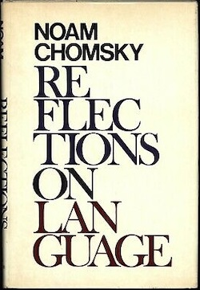
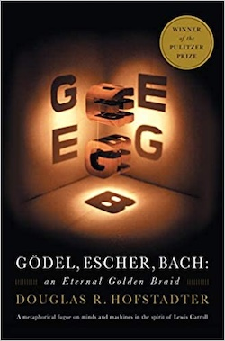
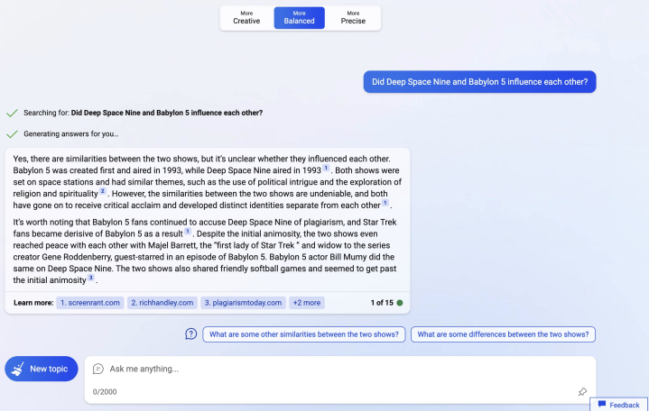
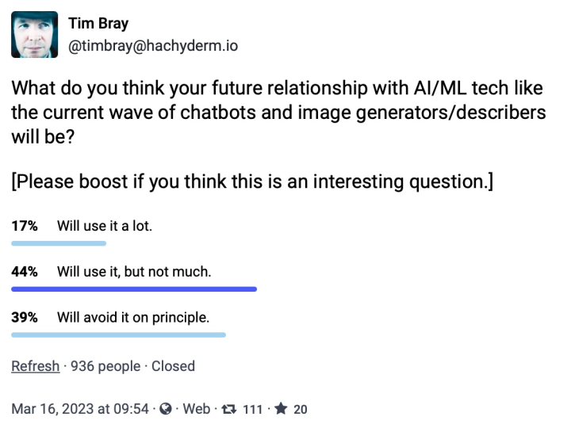
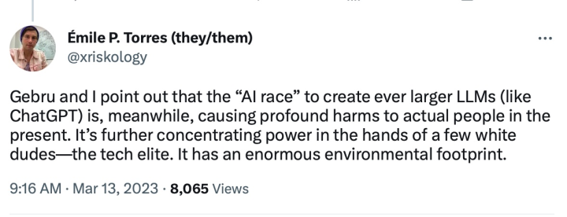

So far I’ve had nothing to say about the LLM chatbot frenzy. My understanding of the technology is shallow and I’ve no sense for its functional envelope, and lots of other people have had smart things to say. I hadn’t even conversed with any of the bots. But I fell off the wagon a few days ago and put time into GPT3 and (especially) the new GPT4-based Bing chat. I got off Bing’s waitlist a few days before the recent general availability, so I have more hands-on than most people. Plus I caught up on background reading. So, question: Are LLMs dangerous distractions or are they a glowing harbinger of a bright future? (Spoiler: I’m dubious but uncertain.)  

到目前为止，我对LLM聊天机器人的热潮没有什么可说的。我对这项技术的理解很肤浅，我对它的功能包络没有任何感觉，很多人都有聪明的说法。我甚至没有和任何一个机器人对话过。但几天前我从马车上摔下来，把时间放在GPT3和（特别是）基于GPT4的新Bing聊天上。我在最近的普遍供应前几天从Bing的等待名单上下来，所以我比大多数人有更多的实践经验。另外，我还读了一些背景资料。那么，问题来了。法学硕士是危险的分心，还是预示着光明的未来？(剧透：我很怀疑但不确定）。

Preconceptions · The Eighties, when I had my first-ever software job, featured another AI craze: [Fifth-Generation](https://en.wikipedia.org/wiki/Fifth_Generation_Computer_Systems) computing, GigaLIPS, OMG the Japanese are going to eat us all. It was hard to understand, but apparently running Prolog really fast was the future. I was already pretty cynical for a twentysomething, and arrogant enough to think that if I couldn’t understand it then it was bullshit. More or less by accident, since I didn’t actually know anything, I was right that time. Which left me with an attitude problem about AI in general. [¶](https://www.tbray.org/ongoing/When/202x/2023/03/14/Binging#p-1)  

先入为主--八十年代，当我有了第一份软件工作时，又出现了人工智能的热潮。 第五代计算，GigaLIPS，OMG日本人要把我们都吃掉。这很难理解，但显然，快速运行Prolog是未来的趋势。对于一个二十多岁的人来说，我已经很愤世嫉俗了，而且傲慢到认为如果我不能理解它，那么它就是胡说八道。或多或少是个意外，因为我实际上什么都不知道，我那次是对的。这给我留下了一个关于人工智能的一般态度问题。¶

Then in the Nineties we had “knowledge-based systems”, which turned out to be more bullshit.  

然后在九十年代，我们有了 "基于知识的系统"，结果是更多的狗屁。

Before I even discovered computers, I’d read the fashionable books by Hofstadter and Chomsky. I had no trouble believing that human intelligence and language processing are pretty well joined at the hip. I still believe this, and that belief is relevant to how one thinks about 2023’s ML technology. In the Nineties I seem to remember throwing poo on Usenet at John Searle’s Chinese Room partisans.  

在我发现计算机之前，我已经读过霍夫斯塔特和乔姆斯基的时尚书籍。我毫不犹豫地相信，人类智慧和语言处理是相当好地结合在一起的。我仍然相信这一点，而且这种信念与如何思考2023年的ML技术有关。在九十年代，我似乎记得在Usenet上向John Searle的 "中国房间 "的支持者扔便便。

My skepticism lasted until 2019; Working adjacent to the AWS EC2 Auto Scaling team, I watched the construction of [Predictive scaling](https://docs.aws.amazon.com/autoscaling/ec2/userguide/ec2-auto-scaling-predictive-scaling.html). It took forever to get the model tuned up, but eventually it became frighteningly accurate at looking 72 hours into the future to tell you when you were going to get load surges and needed to get your fleets scaled and warmed up in advance.  

我的怀疑态度一直持续到2019年；在AWS EC2自动扩展团队附近工作，我看到了预测性扩展的构建。我花了很长时间来调整这个模型，但最终它变得非常准确，可以展望未来72小时，告诉你什么时候会出现负载激增，需要提前让你的车队进行扩展和预热。

So (unlike, for example, with blockchain) there is objective evidence that this stuff is useful at least for something.  

因此（与区块链等不同），有客观证据表明这东西至少在某些方面是有用的。

Experience · I came to GPT-3 with preconceptions (it’s been covered to death) and, predictably, kind of hated it. I’d had some hope, given that I’ve dumped two-plus million words onto the Web since 2003, that maybe the bot could emulate me. No such luck, although it agreed that yes, its training materials included some of my stuff. “What does Tim Bray think about…” and “Write a paragraph in the style of Tim Bray about…” yielded no joy whatsoever. [¶](https://www.tbray.org/ongoing/When/202x/2023/03/14/Binging#p-2)  

经验--我带着先入为主的观念来到GPT-3（它已经被报道得面目全非），可以预见，我有点讨厌它。鉴于我自2003年以来已经在网络上发表了两百多万字的文章，我曾抱有一些希望，也许这个机器人可以模仿我。没有这样的运气，尽管它同意，是的，它的培训材料包括我的一些东西。"蒂姆-布雷怎么看...... "和 "按照蒂姆-布雷的风格写一段关于......的文章"，都没有得到任何好处。¶

Then I started poking around in two tiny historical niches where I know a lot: [T.E. Lawrence’s sexuality](https://www.tbray.org/ongoing/When/202x/2020/07/21/Polishing-Lawrence) and [the Demerara slave rebellion](https://www.tbray.org/ongoing/When/202x/2022/06/12/Demerara-Rebellion). It will surprise no-one to say that GPT-3 offered a useful very-basic introduction to both subjects but, when queried on specific questions of fact, was horribly and confidently wrong.  

然后我开始在我知道很多的两个小的历史角落里打探。 T.E. Lawrence的性行为和Demerara奴隶起义。说GPT-3对这两个主题提供了一个有用的非常基本的介绍，但当被问及具体的事实问题时，却可怕地、自信地错了，没有人会感到惊讶。

It doesn’t bother me much that bleeding-edge ML technology sometimes gets things wrong. It bothers me _a lot_ when it gives no warnings, cites no sources, and provides no confidence interval.  

尖端的ML技术有时会出错，这并不影响我。当它没有给出警告，没有引用来源，也没有提供置信区间时，我就很困扰了。

I’m unconvinced that this smoothed-out voice from nowhere deserves our attention.  

我不相信这个不知从何而来的平滑的声音值得我们注意。

Now, Bing… 现在，Bing...

Before you even begin to think about what’s in the bot’s two paragraphs, please cast your eyes just below them, where, in tastefully decorated shades of blue, there are… _Footnotes!_  

在你开始思考机器人的两段内容之前，请将你的目光投向这两段的下方，在那里，用有品味的蓝色装饰，有......脚注!

When you send a prompt to the bot, while it’s calculating it flashes up little messages saying “searching X … searching Y…” and so on, where the X and Y are what show up in the footnotes. Umm… is it really doing that? I dunno, but when you follow the footnote pointers, the bot’s offerings are consistent with what you find there.  

当你向机器人发送提示时，当它在计算时，它会闪现一些小信息，说 "搜索X......搜索Y...... "等等，其中的X和Y是显示在脚注中的内容。嗯......它真的在这么做吗？我不知道，但是当你按照脚注的指示，机器人提供的信息与你在那里找到的东西是一致的。

Anyhow, the perception created is that the bot is doing a fairly vanilla Web search to turn up sources, then writing a neutrally-toned précis of what it found. I can hardly express how much difference those footnotes made to me. (After I checked them, of course.) I was suddenly prepared to think about this thing as a mostly-safe maybe-useful tool.  

总之，所产生的感觉是，机器人正在做一个相当普通的网络搜索，以找到来源，然后对它所发现的东西写一个中性色调的简述。我很难表达这些脚注对我的影响有多大。(当然是在我检查过之后。)我突然准备把这个东西当作一个基本安全的可能有用的工具来考虑。

I did the same deep-dives on Lawrence and Demerara, and the bot managed to avoid huge this-is-just-all-wrong errors. It wasn’t perfect, there was one little problem with event sequencing. But way better than GPT-3; admittedly, a low bar.  

我对劳伦斯和德梅拉拉做了同样的深入研究，机器人成功地避免了巨大的这个--只是--所有--错误的错误。它并不完美，有一个事件排序的小问题。但比GPT-3要好得多；诚然，这是一个低标准。

At one point, on the Lawrence thread, it was reciting words, nearly verbatim, that I’d personally added to Wikipedia. I’m not sure that’s wrong, the text meets Wikipedia’s pretty-decent citation standards.  

有一次，在劳伦斯的主题上，它几乎是在逐字逐句地背诵我个人在维基百科上添加的文字。我不确定这是否有错，该文本符合维基百科相当体面的引用标准。

I’m not going to paste in the huge gobs of dialog that other writers have, but here’s a bit of entertainment: I asked the bot to write a description of Seattle “in the style of” a few different voices that seem distinctive to me.  

我不会像其他作家那样把大量的对话粘贴进去，但这里有一点娱乐。我要求机器人 "以 "我认为独特的几种不同声音的风格写一篇关于西雅图的描述。

In the style of **Ezra Pound**: “In the city of Seattle, the rain falls like a symphony of tears, A melody that echoes through the streets and fills the ears. The mountains rise like giants in the distance, Their peaks shrouded in mist, a sight of purest brilliance. The city itself is a place of contrasts, A mix of old and new, of history and progress. From the Space Needle to Pike Place Market, There’s always something new to discover and savor. Seattle is a city of dreams, A place where anything is possible, or so it seems.”  

以埃兹拉-庞德的风格。"在西雅图市，雨像眼泪的交响曲一样落下，旋律在街道上回荡，充斥着耳朵。山峰像巨人一样耸立在远处，它们的山峰笼罩在薄雾中，是最纯净的光辉。这座城市本身就是一个充满反差的地方，新与旧、历史与进步的结合。从太空针塔到派克市场，总有一些新的东西值得我们去发现和品味。西雅图是一个充满梦想的城市，一个一切皆有可能的地方，或者说看起来是这样的"。

…of **Samuel R. Delany**: “Seattle is a city of many faces, a place where the future and the past collide. It’s a city of contrasts, where the gleaming towers of downtown stand in stark contrast to the rugged beauty of the surrounding mountains. The streets are alive with the sounds of people from all walks of life, from the techies of Amazon and Microsoft to the artists and musicians who call the city home. The air is thick with the scent of coffee and the sound of rain, a symphony of sensory delights that is uniquely Seattle. From the Space Needle to the waterfront, there’s always something new to discover in this city of dreams.”  

...塞缪尔-R-德兰尼的作品。"西雅图是一个多面的城市，一个未来和过去相碰撞的地方。这是一个充满对比的城市，市中心金碧辉煌的高楼与周围山脉的粗犷之美形成鲜明对比。街道上活跃着来自各行各业的人们的声音，从亚马逊和微软的技术人员到以这座城市为家的艺术家和音乐人。空气中弥漫着咖啡的香味和雨声，这是西雅图独有的感官享受的交响乐。从太空针塔到滨水区，在这个梦想之城，总有一些新的东西值得我们去发现"。

…of **Shakespeare**: “In fair Seattle, where we lay our scene, From ancient grudge break to new mutiny, Where civil blood makes civil hands unclean. From forth the teeming streets of this fair town, A pair of star-crossed lovers take their life; Whose misadventured piteous overthrows Do with their death bury their parents’ strife. The fearful passage of their death-marked love, And the continuance of their parents’ rage, Which, but their children’s end, naught could remove, Is now the two hours’ traffic of our stage; The which if you with patient ears attend, What here shall miss, our toil shall strive to mend.  

...的莎士比亚。"在美丽的西雅图，我们的场景，从古老的怨恨到新的叛乱，公民的血使公民的手不干净。从这个美丽的小镇的繁华的街道上，一对相爱的恋人夺走了他们的生命；他们的不幸的悲惨遭遇，随着他们的死亡埋葬了他们父母的争斗。他们的死亡之爱的可怕经过，他们的父母的愤怒的持续，除了他们的孩子的结局，没有什么可以消除，现在是我们舞台的两个小时的交通；如果你用耐心的耳朵听，这里将错过什么，我们的努力将努力弥补。

…of **e.e. cummings**: “in just Seattle, this city of rain where the streets are alive with the sound of feet and the air is thick with the scent of coffee and the sound of music fills the night here is the city of dreams where anything is possible and the mountains rise like giants in the distance and the Space Needle stands tall against the sky in just Seattle, where the future and the past collide and the beauty of the world is all around here is a place where the heart can soar and the soul can find its home.  

...的E.E.康明斯。"在西雅图，这座雨城，街道上的脚步声很响亮，空气中弥漫着咖啡的香味，音乐声充斥着整个夜晚，这里是梦想之城，一切皆有可能，远处的山脉像巨人一样耸立，太空针塔高高矗立在天空中，在这里，未来和过去碰撞在一起，世界的美好就在身边，这里是一个让人心潮澎湃，灵魂找到归属的地方。

…of **Sylvia Plath**: “In Seattle, the rain falls like tears from the sky, A never-ending stream of sorrow and pain. The streets are dark and empty, The buildings looming like shadows in the night. The mountains rise like sentinels in the distance, Their peaks shrouded in mist and mystery. The city is a place of secrets and shadows, A place where the heart can break and the soul can die. But even in the darkness, there is beauty to be found, A glimmer of hope in the depths of despair. For in Seattle, as in life, There is always a chance for redemption and renewal.  

...的西尔维娅-普拉斯。"在西雅图，雨像眼泪一样从天而降，是永不停息的悲伤和痛苦的流淌。街道是黑暗和空旷的，建筑物像黑夜中的影子一样隐约可见。山峰像哨兵一样耸立在远处，它们的山峰笼罩在迷雾和神秘之中。这座城市是一个充满秘密和阴影的地方，是一个让人心碎、让人灵魂死亡的地方。但是，即使在黑暗中，也可以找到美丽，在绝望的深处有一丝希望。因为在西雅图，就像在生活中一样，总是有机会得到救赎和更新。

…of **Bing chat**: “Seattle is a city of many faces, a place where the future and the past collide. It’s a city of contrasts, where the gleaming towers of downtown stand in stark contrast to the rugged beauty of the surrounding mountains. The streets are alive with the sounds of people from all walks of life, from the techies of Amazon and Microsoft to the artists and musicians who call the city home. The air is thick with the scent of coffee and the sound of rain, a symphony of sensory delights that is uniquely Seattle. From the Space Needle to the waterfront, there’s always something new to discover in this city of dreams.  

...的Bing聊天。"西雅图是一个多面的城市，一个未来和过去相碰撞的地方。这是一个充满对比的城市，市中心金碧辉煌的高楼与周围山脉的粗犷之美形成鲜明对比。街道上活跃着来自各行各业的人们的声音，从亚马逊和微软的技术人员到以这座城市为家的艺术家和音乐人。空气中弥漫着咖啡的香味和雨声，这是西雅图独有的感官享受的交响乐。从太空针塔到滨水区，在这座梦想之城，总有一些新的东西值得我们去发现。

\[At this point, for some reason the paragraphs started becoming nearly identical in their second halves, reading much like the “Bing chat” version above. I have amputated the repetition.\]  

\[在这一点上，由于某种原因，这些段落的后半部分开始变得几乎相同，读起来很像上面的 "Bing chat "版本。我删去了重复的内容\]。

… of **Ursula Leguin**: “In Seattle, the rain falls like a curtain of mist, A veil that shrouds the city in mystery and magic. The streets are alive with the sounds of people, Their voices blending together in a symphony of life. The mountains rise like guardians in the distance, Their peaks reaching up to touch the sky. … ”  

...厄休拉-勒古恩的作品。"在西雅图，雨像雾帘一样落下，一层面纱将这个城市笼罩在神秘和神奇之中。街道上人声鼎沸，他们的声音汇成了一曲生命的交响乐。远处的山峰像守护者一样耸立着，它们的山峰高耸入云，触及天空。... "

… of **Leonard Cohen**: “In Seattle, the rain falls like a lover’s tears, A bittersweet symphony that echoes through the night. The streets are alive with the sounds of music, The air thick with the scent of coffee and dreams. The mountains rise like giants in the distance, Their peaks shrouded in mist and mystery. … ”  

... 伦纳德-科恩："在西雅图，雨像情人的眼泪一样落下，苦乐参半的交响乐在夜里回荡。街道上充满了音乐的声音，空气中弥漫着咖啡和梦想的气息。山峰像巨人一样耸立在远方，它们的山峰被迷雾和神秘所笼罩。... "

…of **Aristophanes**: “In Seattle, the rain falls like a chorus of nymphs, A symphony of sound that fills the air with magic. The streets are alive with the sounds of laughter, The air thick with the scent of coffee and dreams. The mountains rise like giants in the distance, … ”  

...的阿里斯托芬。"在西雅图，雨像仙女的合唱团一样落下，声音的交响乐让空气充满了魔力。街道上充满了笑声，空气中弥漫着咖啡和梦想的气息。远处的山脉像巨人一样耸立，......"

…of **Denis Johnson**: “In Seattle, the rain falls like a baptism, A cleansing of the soul that washes away the pain. The streets are alive with the sounds of music, The air thick with the scent of coffee and dreams. The mountains rise like giants in the distance, … ”  

...丹尼斯-约翰逊："在西雅图，雨水像洗礼一样落下，对灵魂的净化，洗去了痛苦。街道上的音乐声此起彼伏，空气中弥漫着咖啡和梦想的气息。远处的山脉像巨人一样耸立，......"

Well, some of those were better than others. Interestingly, the first sentence or two tended to be better than the rest. I left a few out. No, I don’t know why I picked Seattle, I’m not from there and I don’t love the place. It was easier to start doing this than to stop.  

嗯，其中一些比其他的好。有趣的是，第一句或第二句往往比其他的好。我遗漏了一些。不，我不知道为什么我选了西雅图，我不是那里的人，我也不爱那个地方。开始这样做比停止更容易。

Is this even a good idea? · There are extremely smart people asserting that this technology is some combination of useless and dangerous, and we should turn our backs and walk away. Here are two Mastodon posts from [Emily Bender:](https://hachyderm.io/@emilymbender@dair-community.social) [¶](https://www.tbray.org/ongoing/When/202x/2023/03/14/Binging#p-3)  

这到底是不是一个好主意？- 有非常聪明的人断言，这项技术是无用和危险的组合，我们应该转身离开。以下是Emily Bender的两篇Mastodon文章。 ¶

> [Folks, I encourage you to not work for @OpenAI for free:  
> 
> 伙计们，我鼓励你们不要为@OpenAI免费工作。](https://hachyderm.io/@emilymbender@dair-community.social/110029110142270008)  
> 
> Don't do their testing 不要做他们的测试  
> 
> Don't do their PR 不要做他们的公关  
> 
> Don't provide them training data 不要向他们提供训练数据  
> 
> \[[Link to an excellent related thread](https://dair-community.social/@emilymbender/110029104362666915) slamming OpenAI for generally sleazy behavior.\]  
> 
> \[链接到一个优秀的相关主题，抨击OpenAI的普遍肮脏行为。］
> 
> [I see people asking: How else will we critically study GPT-4 etc then?  
> 
> 我看到有人问：那我们还怎么批判性地研究GPT-4等？](https://hachyderm.io/@emilymbender@dair-community.social/110033249271600717)  
> 
> Don't. Opt out. Study something else.  
> 
> 不要。选择退出。学习其他东西。  
> 
> GPT-4 should be assumed to be toxic trash until and unless #OpenAI is \*open\* about its training data, model architecture, etc.  
> 
> GPT-4应该被认为是有毒的垃圾，除非#OpenAI对其训练数据、模型架构等\*开放。  
> 
> I rather suspect that if we ever get that info, we will see that it is toxic trash. But in the meantime, without the info, we should just assume that it is.  
> 
> 我相当怀疑，如果我们得到这些信息，我们将看到它是有毒的垃圾。但同时，在没有信息的情况下，我们应该假设它是。  
> 
> To do otherwise is to be credulous, to serve corporate interests, and to set terrible precedent.  
> 
> 否则就是信口开河，为企业利益服务，并开创了可怕的先例。  

Ms Bender is not alone. I ran a little [poll on Mastodon](https://hachyderm.io/@timbray/110034004735024625):  

班德女士并不孤单。我在Mastodon上做了一个小调查。

You might find it rewarding to follow the link to the poll and read the comment thread, there’s instructive stuff there.  

你可能会发现跟随投票的链接并阅读评论线程会有收获，那里有一些有启发性的东西。

Here’s another [excellent thread](https://twitter.com/xriskology/status/1635313897505980416):  

这里有另一个优秀的主题:

There’s more to say on this. But first…  

关于这一点，还有更多的话要说。但首先...

Do you have an opinion? · Please don’t post it. [¶](https://www.tbray.org/ongoing/When/202x/2023/03/14/Binging#p-4)  

你有意见吗？- 请不要发表。¶

First, go and read [On the Dangers of Stochastic Parrots: Can Language Models Be Too Big?](https://dl.acm.org/doi/pdf/10.1145/3442188.3445922) (lead authors Emily Bender and Timnit Gebru.) I’m serious; it’s only ten pages (not including references) and if you haven’t read it, you’re simply not qualified to publish anything on this subject.  

首先，去读《论随机鹦鹉的危险》。语言模型会不会太大？ (主要作者Emily Bender和Timnit Gebru。)我是认真的；它只有十页（不包括参考文献），如果你没有读过它，你根本没有资格就这个问题发表任何东西。

Here are the highlights, which I’m only listing so I can discuss them; the following is _not_ a substitute for reading Bender and Gebru.  

以下是重点内容，我列出这些内容只是为了让我能够讨论它们；以下内容不能代替阅读本德和格布鲁。

1.  The carbon load of LLM model-building and execution is horrifying. Quote: “…the amount of compute used to train the largest deep learning models (for NLP and other applications) has increased 300,000x in 6 years, increasing at a far higher pace than Moore’s Law.”  
    
    LLM模型的建立和执行的碳负荷是可怕的。引用一下。"......用于训练最大的深度学习模型（用于NLP和其他应用）的计算量在6年内增加了30万倍，其增长速度远远超过摩尔定律。"
    
    (Also, some of the economics involve shitty behavior; QA’ing LLMs is lousy, time-consuming work, so why not underpay poor people in the Third World?)  
    
    (另外，有些经济学涉及到低劣的行为；对法律硕士进行质量保证是一项糟糕的、耗时的工作，那么为什么不向第三世界的穷人支付低价呢？）
    
2.  The data sets that current LLMs are trained on are basically any old shit off the Internet, which means they’re full of intersectionally-abusive language and thinking. Quote: “Feeding AI systems on the world’s beauty, ugliness, and cruelty, but expecting it to reflect only the beauty is a fantasy.”  
    
    目前法学硕士接受培训的数据集基本上是互联网上的任何旧东西，这意味着它们充满了交叉滥用的语言和思维。引用一下。"用世界的美、丑和残酷来喂养人工智能系统，但期望它只反映美，这是一种幻想。"
    
3.  The whole LLM frenzy is diverting attention from research on machine language _understanding_ as opposed to statistically-driven _prediction_. Quote: “If a large LM, endowed with hundreds of billions of parameters and trained on a very large dataset, can manipulate linguistic form well enough to cheat its way through tests meant to require language understanding, have we learned anything of value about how to build machine language understanding or have we been led down the garden path?” Also: “However, no actual language understanding is taking place in LM-driven approaches to these tasks, as can be shown by careful manipulation of the test data to remove spurious cues the systems are leveraging. \[[21](https://arxiv.org/abs/2002.04108), [93](https://arxiv.org/abs/1907.07355)\]”  
    
    整个LLM的狂热正在转移人们对机器语言理解研究的注意力，而不是统计学驱动的预测。引用一下。"如果一个大型的LM，被赋予了数以千亿计的参数，并在一个非常大的数据集上进行了训练，可以很好地操纵语言形式，以欺骗的方式通过旨在要求语言理解的测试，我们是否学到了关于如何建立机器语言理解的有价值的东西，或者我们已经被带入了花园之路？"还有。"然而，在LM驱动的这些任务的方法中，并没有发生实际的语言理解，这一点可以通过对测试数据的仔细操作来证明，以消除系统正在利用的虚假线索。\[ 21 , 93 \]"
    

My experience with the LLM bots really had me nodding along to #1. When you throw a prompt at one of these things, what happens ain’t fast; it takes seconds and seconds to get the answer back. My background in cloud computing and concurrency research gives me, I think, a pretty good gut feel for this sort of stuff and, well… it’s _really freaking expensive_! I think that if it were cheap, that might change my (increasingly negative) view of the cost/benefit ratio.  

我与LLM机器人的经历真的让我对第一条点头。当你向这些东西扔出一个提示时，所发生的事情并不快；需要几秒钟的时间来得到答案。我在云计算和并发研究方面的背景让我对这种东西有很好的直觉，而且......它真的很贵！我认为，如果它很便宜的话，那么它就会很便宜。我想，如果它很便宜，那可能会改变我对成本/效益比的（越来越消极）看法。

Initially, I was less worried about #2. The Internet is already full of intersectionally-abusive crap (not to mention outright lies), and we do make progress at fighting it and creating safe spaces, albeit agonizingly slow. It’s not obvious to me that shitty LLMs are a worse problem than shitty people.  

起初，我对第2条不太担心。互联网上已经充满了交叉侵害的废话（更不用说公然的谎言），我们在打击这些废话和创造安全空间方面确实取得了进展，尽管缓慢得令人痛苦。在我看来，低劣的法学硕士比低劣的人更糟糕，这一点并不明显。

The good news is that there’s a clear path to addressing this, which Bender & Gebru lay out: Curate your damn training data! And be transparent and accountable about what it is and how it’s used. Unfortunately, OpenAI doesn’t do transparency.  

好消息是，有一条明确的路径来解决这个问题，Bender和Gebru对此做了说明。策划你那该死的训练数据!并对数据的内容和使用方式保持透明和负责任。不幸的是，OpenAI并没有做到透明。

Then the bad news: On the Internet, the truth is paywalled and the bullshit is free. And as just discussed, one of the problems with LLMs is that they’re expensive. Another is that they’re being built by capitalists. Given the choice between expensive quality ingredients and free bullshit, guess which they’ll pick?  

然后是坏消息。在互联网上，真相是收费的，废话是免费的。正如刚才所讨论的，法律硕士的问题之一是他们很昂贵。另一个问题是，它们是由资本家建立的。如果要在昂贵的优质原料和免费的废话之间做出选择，你猜他们会选择哪个？

On #3, I don’t have enough technical depth for well-founded opinion, but my intuition-based feelings are mixed. Yeah, the LLM-transform statistical methods are sort of a kludge, but you know what, so is human intelligence. Nobody would ever hire me to do AGI research but if they did, I’d start with a multipronged assault on language, using whatever witches’ brew of statistical and other ML methods were at hand.  

关于第3条，我没有足够的技术深度来发表有根据的意见，但我基于直觉的感觉是混合的。是的，LLM-变换的统计方法有点笨拙，但你知道吗，人类智能也是如此。没有人会雇我做AGI研究，但如果他们这样做了，我会从多管齐下地攻击语言开始，使用手头的任何统计和其他ML方法的巫术混合物。

Remember, John Searle’s “Chinese Room” argument is just wrong; at some point, if you build something that convinces educated, skeptical, observers that they’re talking to a real intelligence, the only safe hypothesis is that it’s a real intelligence.  

记住，约翰-塞尔的 "中国房间 "的论点就是错误的；在某些时候，如果你建造的东西能让受过教育的、持怀疑态度的观察者相信他们在与一个真正的智能体对话，那么唯一安全的假设就是它是一个真正的智能体。

Other voices · Noam Chomsky and a couple of colleagues write, in the NYTimes: [The False Promise of ChatGPT](https://www.nytimes.com/2023/03/08/opinion/noam-chomsky-chatgpt-ai.html). Obviously, it would be dumb to ignore input from Chomsky, but I found this kind of shallow. I don’t think it’s axiomatic that a hypothetical AGI need be built around the same trade-offs that our own intelligence is. [¶](https://www.tbray.org/ongoing/When/202x/2023/03/14/Binging#p-5)  

其他声音--诺姆-乔姆斯基和几个同事在《纽约时报》上写道。 ChatGPT的虚假承诺。显然，忽视来自乔姆斯基的意见是愚蠢的，但我发现这有点浅薄。我不认为假设的AGI需要围绕我们自己的智能所做的同样的权衡而建立，这是不言而喻的。¶

On the other hand, here’s Sabine Hossenfelder (in a video, transcript only on Patreon): [I believe chatbots partly understand what they chat about. Let me explain.](http://backreaction.blogspot.com/2023/03/i-believe-chatbots-partly-understand.html) Quote: “Understanding can’t be inferred from the relationship between input and output alone.” I’m not sure Dr H entirely convinced me, but that video is both intellectually dense and funny, and I strongly recommend it; her conclusions are studded with what seem to me extremely wise observations.  

另一方面，这里有Sabine Hossenfelder（在视频中，文字稿只在Patreon上）。 我相信聊天机器人能部分地理解他们所聊的内容。让我解释一下。 引用一下。"理解不能仅仅从输入和输出之间的关系来推断。"我不确定H博士是否完全说服了我，但那段视频既充满智慧又很有趣，我强烈推荐；她的结论中充满了在我看来极为明智的意见。

What do I think? · 3,500 words in and… um, I dunno. Really. I am somewhat consoled by the fact that nobody else does, either. [¶](https://www.tbray.org/ongoing/When/202x/2023/03/14/Binging#p-6)  

我是怎么想的？- 3,500字，......嗯，我不知道。真的。我感到有些安慰的是，其他人也不知道。¶

There are a very few posts I’m willing to drive into the ground:  

很少有帖子我愿意把它开到地下。

-   The claim that LLMs are nothing more than [fancy expensive markov chains](https://hachyderm.io/@zkat@toot.cat/110034419651017125) is a dangerous oversimplification or, in other words, wrong.  
    
    声称LLM不过是花哨昂贵的马尔科夫链，是一种危险的过度简化，或者说，是错误的。
    
-   There are going to be quality applications for this stuff. For example, reading out picture descriptions to blind people.  
    
    这个东西会有高质量的应用。例如，向盲人宣读图片描述。
    
-   In the same way that the Bing bot seems to be useful at looking up stuff online, it’s useful for computer programmers, to automate searching Stack Overflow. I asked it for suggestions on how to dedupe Go structs with slice fields, since you can’t use those as map keys, and it turned up pointers to useful discussions that I’d missed.  
    
    就像Bing机器人在网上查找东西时很有用一样，它对计算机程序员也很有用，可以自动搜索Stack Overflow。我向它询问了关于如何对带有分片字段的Go结构进行剔除的建议，因为你不能用这些字段作为映射键，而它则提供了我所错过的有用的讨论指针。
    
-   Are these things remotely cost-effective? I mean, it’s cool that Bing could research the relationship between DS9 and B5, and that it threw in humanizing detail about the softball games, but the number of watt-hours it probably burnt to get there is shocking. For what values of “worth it” is it worth it?  
    
    这些东西的成本效益如何？我的意思是，Bing能够研究DS9和B5之间的关系，并在垒球比赛中加入人性化的细节，这很酷，但它可能为了达到这个目的而消耗的瓦特小时数令人震惊。对于 "值得 "的价值，它值得吗？
    
-   Relatedly, it’s blindingly obvious that the VC and Big-Tech leadership are way out over their skis on this one, and that billions and billions are going to be pissed away on fever dreams pitched by people who were talking up crypto DAOs until last month.  
    
    与此相关的是，很明显的是，风险投资公司和大科技公司的领导层在这个问题上已经超出了他们的能力范围，数十亿和数十亿的资金将被那些直到上个月还在谈论加密货币DAO的人的狂热梦想所浪费掉。
    

Just now I wouldn’t bet my career on this stuff, nor would I ignore it.  

只是现在我不会把我的事业押在这个东西上，也不会忽视它。

It’s really, really OK to say “I don’t know.”  

说 "我不知道 "真的很好，真的可以。

___

___
