If you are reading this article, you are most likely using a web browser, and you have some expectations or beliefs about online privacy and security. For example, I do not know what you are reading on other tabs on your web browser, and you would like to keep it that way. But the websites themselves know that you are reading a particular page on their website. They most likely know your IP address and if you are signed in to their website, they also know your identity. This is not unreasonable because you chose to identify yourself in exchange for certain services. That’s how web works.  

如果你正在阅读这篇文章，你很可能正在使用一个网络浏览器，而且你对在线隐私和安全有一些期望或信念。例如，我不知道你在网络浏览器的其他标签上阅读什么，你也希望保持这种状态。但是，网站本身知道你正在阅读他们网站上的一个特定页面。他们很可能知道你的IP地址，如果你登录了他们的网站，他们也知道你的身份。这不是没有道理的，因为你选择表明自己的身份以换取某些服务。这就是网络的运作方式。

You might also be heard about cross site tracking using cookies. Cookies are persistent files set on your web browser by a website to identify you later when you visit the same site. Cross site cookies are set by third-party domains present on a website, and the same third-party might also present in other websites as well. Third party domains track you across your browsing sessions and able to identify you uniquely across different websites. That’s how you are shown ads based on your browsing history. Because the third party is usually an advertising company (cough! Google) and they are present in almost all websites. Even though it seems unethical for a third party to track your browsing history, at-least you had control. Web Browsers allows you to delete cookies, so third parties cannot link you back to your past sessions. This is what Private Browsing does. It basically wipes all cookies (and history) upon closing the window.  

你可能也听说过使用cookies的跨网站追踪。Cookies是一个网站在你的网络浏览器上设置的持久性文件，以便在你以后访问同一网站时识别你。跨网站cookies是由网站上的第三方域名设置的，而同一第三方也可能存在于其他网站。第三方域名在你的浏览会话中跟踪你，并能够在不同的网站上独特地识别你。这就是如何根据你的浏览历史向你展示广告的原因。因为第三方通常是一家广告公司（咳嗽！谷歌），他们几乎存在于所有的网站。尽管第三方追踪你的浏览历史似乎是不道德的，但至少你有控制权。网络浏览器允许你删除cookies，所以第三方无法将你与你过去的会话联系起来。这就是 "私人浏览 "的作用。它基本上是在关闭窗口时擦除所有的cookies（和历史记录）。

Browsers like Firefox now ships with advanced protection against this kind of tracking. They isolate third party cookies per website. This means advertisers or third-parties cannot track you across different websites. This affects advertisement companies revenue because they cannot know your full browsing activity and hence cannot show you personalized ads.  

像火狐这样的浏览器现在有针对这种跟踪的高级保护。他们在每个网站上隔离了第三方的cookies。这意味着广告商或第三方不能在不同的网站上跟踪你。这影响了广告公司的收入，因为他们无法知道你的全部浏览活动，因此无法向你展示个性化的广告。

Based on your threat model, even being identified by a first party website across different sessions might be uncomfortable for you. So you might set your web browser to automatically clear cookies or use add-ons to do that.  

基于你的威胁模式，即使在不同的会话中被第一方网站识别，也可能让你感到不舒服。因此，你可能会将你的网络浏览器设置为自动清除cookies，或使用附加组件来做到这一点。

But companies found another way to uniquely identify you across different sessions and websites without using cookies or other persistent storage. It’s called web fingerprinting. Fingerprinting is a more sophisticated approach to identify a user among millions of others. It works by studying your web browser and hardware configuration. Many websites use a fingerprinting library to generate a unique ID. This library collects data from multiple JavaScript APIs offered by your web browser. For example, websites can see web browser version, number of CPUs on your device, screen size, number of touchpoints, video/audio codecs, operating system and many other details that you would not want a typical news website to see.  

但公司发现了另一种方法，可以在不同的会话和网站上唯一地识别你，而不使用cookies或其他持久性存储。这就是所谓的网络指纹识别。指纹是一种更复杂的方法，可以在数以百万计的人中识别一个用户。它通过研究你的网络浏览器和硬件配置来工作。许多网站使用一个指纹库来生成一个独特的ID。这个库从你的网络浏览器提供的多个JavaScript APIs收集数据。例如，网站可以看到网络浏览器版本、你设备上的CPU数量、屏幕尺寸、触摸点数量、视频/音频编解码器、操作系统和其他许多你不希望典型新闻网站看到的细节。

All of these values are combined to generate a unique ID. Surprisingly, each user’s device and browser specifications differ so much that they get a unique ID among millions.  

所有这些值被组合起来，产生一个独特的ID。令人惊讶的是，每个用户的设备和浏览器规格差别很大，以至于他们在数百万人中得到一个独特的ID。

I did not think web fingerprinting is serious until I came across a company which is actually selling fingerprinting as a service to other websites. I tried their demo and shocked how accurate it is. Many ecommerce websites use it because these fingerprinting companies sell it, saying it prevents credit card frauds and increases security of the websites.  

我不认为网络指纹是认真的，直到我遇到了一家公司，它实际上是把指纹作为一项服务出售给其他网站。我试了一下他们的演示，对它的准确性感到震惊。许多电子商务网站使用它，因为这些指纹识别公司出售它，说它可以防止信用卡欺诈，增加网站的安全性。

If you are paranoid like me and use private browsers like Firefox Focus or always clearing cookies when you close the browser, it doesn’t really help to protect your privacy. Web Browsers and Web Standards become so complicated that fingerprinting is easier than you think.  

如果你像我一样偏执，使用像Firefox Focus这样的私人浏览器，或者在关闭浏览器时总是清除cookies，这对保护你的隐私并没有什么帮助。网络浏览器和网络标准变得如此复杂，以至于指纹识别比你想象的要容易。

## Fingerprinting as a Service 指纹服务

We are going to test a product built by a company called FingerprintJS Inc. who is selling fingerprinting as a service. They make JavaScript fingerprinting libraries which are in fact open source and sell it to many websites. There’s FingerprintJS Pro which is an even scarier version of regular fingerprinting library. It doesn’t matter if you are using a VPN or Private Browsing mode, they can accurately identify you. Here’s how they are describing themselves, **“The device identity platform for high-scale applications”.**  

我们要测试的是一家名为FingerprintJS Inc.的公司打造的产品，该公司将指纹识别作为一项服务进行销售。他们制作的JavaScript指纹库实际上是开源的，并将其出售给许多网站。还有FingerprintJS Pro，它是普通指纹库的一个更可怕的版本。不管你是使用VPN还是私人浏览模式，他们都能准确识别你。他们是这样描述自己的："大规模应用的设备识别平台"。

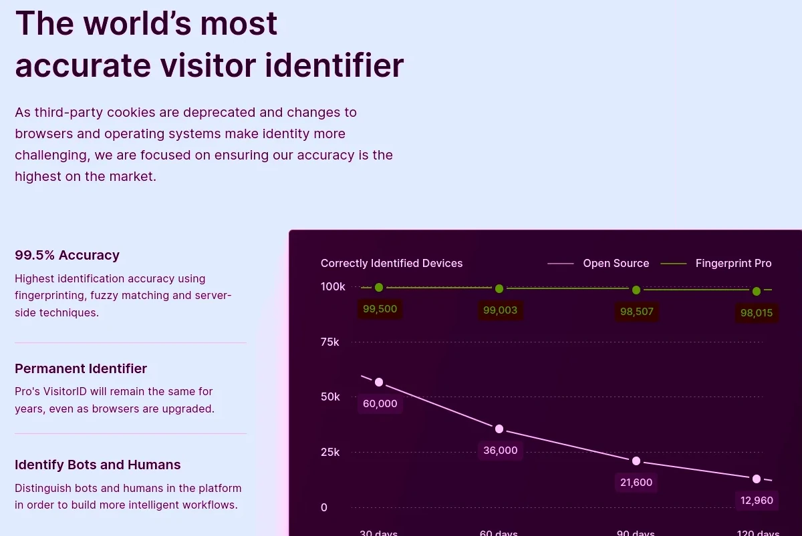

FingerprintJS has a demo built into it’s homepage, [https://fingerprint.com](https://fingerprint.com/). When you visit this website, they generate a visitor ID (fingerprint) which is unique for your browser. So even if you clear the cache (and other site data) or visit the site in Private Browsing mode, they can generate the same ID and correlate with your previous visit.  

FingerprintJS在它的主页上内置了一个演示， [https://fingerprint.com](https://fingerprint.com/) 。当你访问这个网站时，他们会生成一个访客ID（指纹），这对你的浏览器来说是独一无二的。因此，即使你清除了缓存（和其他网站数据）或在私人浏览模式下访问该网站，他们也能生成相同的ID并与你之前的访问相关联。

## My tests on popular web browsers  

我在流行的网络浏览器上的测试

Now we are going to perform the following steps to prove that fingerprinting works and severely undermines our privacy.  

现在，我们将执行以下步骤，以证明指纹识别的作用和严重破坏我们的隐私。

**Step 1:** Visit [https://fingerprint.com](https://fingerprint.com/)  

第1步：访问 [https://fingerprint.com](https://fingerprint.com/)

**Step 2:** View the fingerprint generated.  

第2步：查看生成的指纹。

**Step 3:** Clear browser cache and all other site data.  

第3步：清除浏览器缓存和所有其他网站数据。

**Step 4:** Visit [https://fingerprint.com](https://fingerprint.com/) once again.  

第四步：再次访问 [https://fingerprint.com](https://fingerprint.com/) 。

**Step 5:** View the fingerprint and also the previous visit history. Even if the browser has no cookies or other site data, their product can generate the same visitor ID and link it back to our previous visit.  

第五步：查看指纹，同时查看以前的访问历史。即使浏览器没有cookies或其他网站数据，他们的产品也能生成相同的访问者ID，并将其与我们之前的访问联系起来。

**Step 6:** Clear browser cache and all other site data.  

第6步：清除浏览器缓存和所有其他网站数据。

**Step 7:** Visit [https://fingerprint.com](https://fingerprint.com/) in Private Browsing mode.  

第7步：在私人浏览模式下访问 [https://fingerprint.com](https://fingerprint.com/) 。

**Step 8:** View the fingerprint and see how it is being correlated to the previous two visits we already made. Yes, in Private Browsing mode.  

第八步：查看指纹，看看它是如何与我们已经进行的前两次访问相关联的。是的，在私人浏览模式下。

We are going to perform these tests on Firefox, Chromium, and Tor Browser.  

我们将在Firefox、Chromium和Tor浏览器上进行这些测试。

### Firefox

  
| Visit 1 | Visit 2 | Private Browsing |
| --- | --- | --- |
| [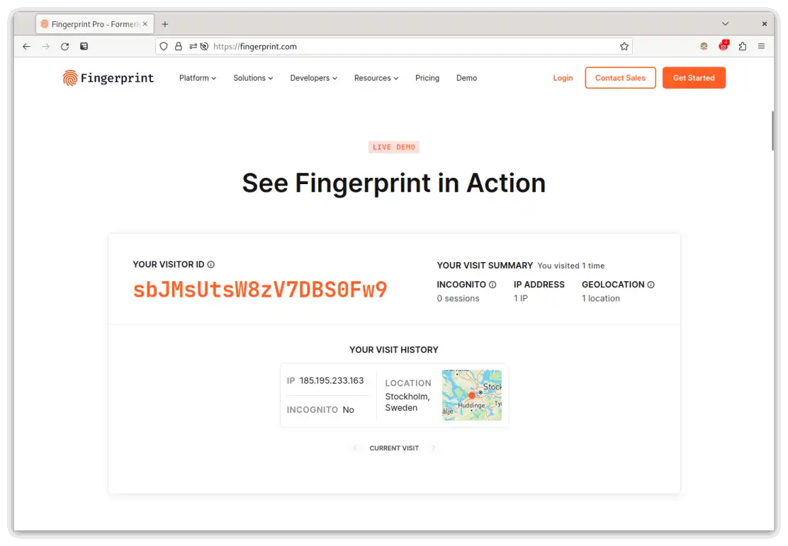](https://www.bitestring.com/images/2023-03-19-fingerprinting/firefox_visit_1.webp) | [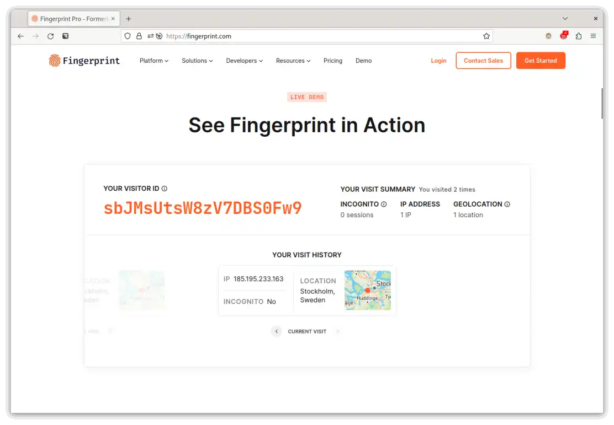](https://www.bitestring.com/images/2023-03-19-fingerprinting/firefox_visit_2.webp) | [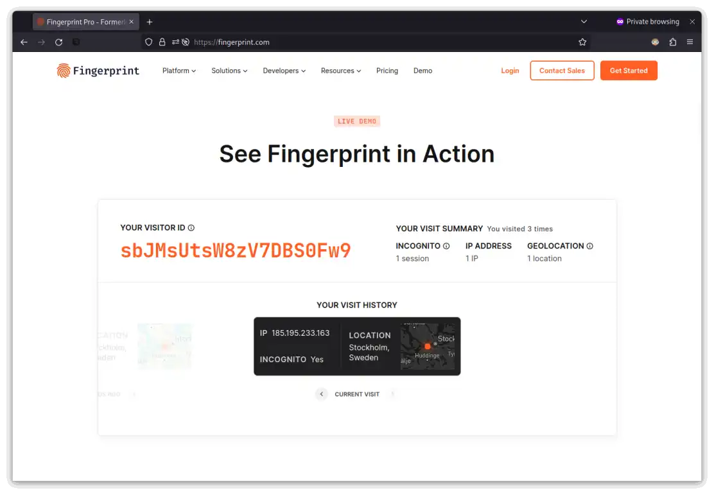](https://www.bitestring.com/images/2023-03-19-fingerprinting/firefox_visit_private_mode.webp) |

Notice how different sessions are connected by the same fingerprint generated by FingerprintJS. Firefox in its default configuration is prone to fingerprinting.  

请注意不同的会话是如何被FingerprintJS生成的同一个指纹所连接的。火狐在其默认配置中很容易出现指纹。

### Firefox with privacy.resistFingerprinting = true  

火狐的隐私.resistFingerprinting = true

Firefox has a setting called resistFingerprinting (initially contributed by The Tor Project) that makes it more resistance to fingerprinting. When activated, Firefox tries to mask certain properties like User Agent, CPU Count, Timezone, Screen Resolution etc. uniform for all users. This makes it harder for fingerprinting.  

火狐浏览器有一个叫做resistFingerprinting的设置（最初是由Tor项目贡献的），使其对指纹识别有更大的抵抗力。当激活时，火狐浏览器试图掩盖某些属性，如用户代理、CPU计数、时区、屏幕分辨率等，对所有用户都是统一的。这使得它更难被打上指纹。

You can enable it by visiting `about:config` and setting `privacy.resistFingerprinting = true` in your Firefox browser.  

你可以通过访问Firefox浏览器中的 `about:config` 和设置 `privacy.resistFingerprinting = true` 来启用它。

  
| Visit 1 | Visit 2 | Private Browsing |
| --- | --- | --- |
| [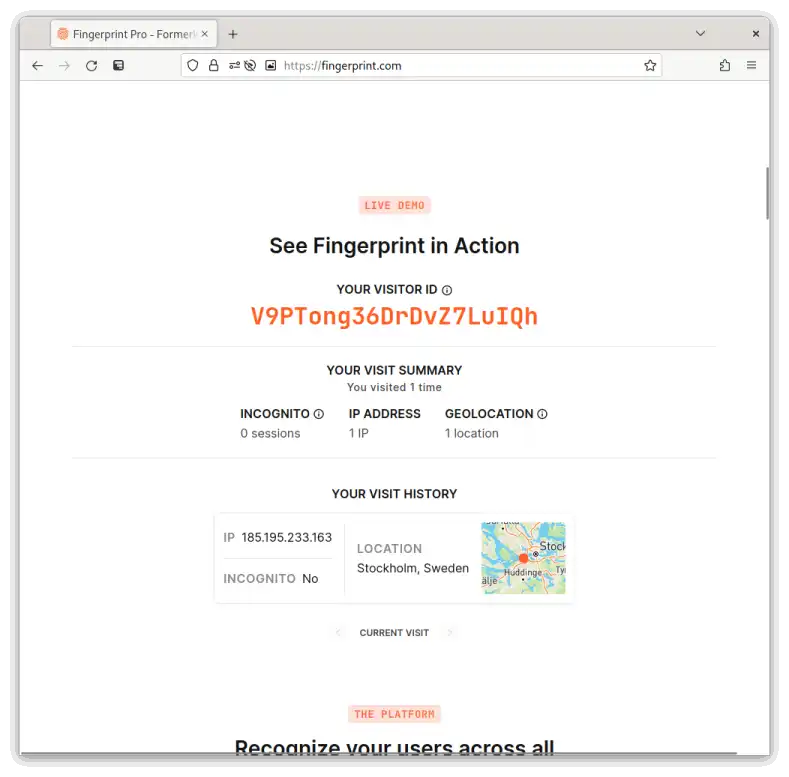](https://www.bitestring.com/images/2023-03-19-fingerprinting/firefox_resistfingerprinting_visit_1.webp) | [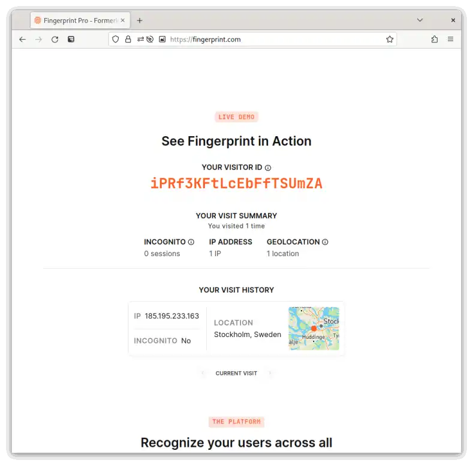](https://www.bitestring.com/images/2023-03-19-fingerprinting/firefox_resistfingerprinting_visit_2.webp) | [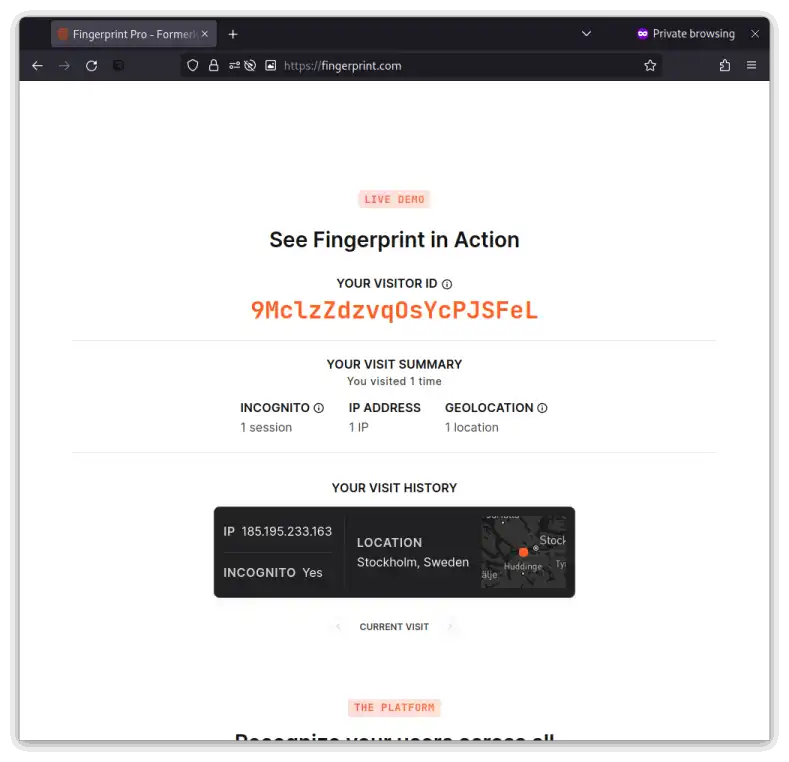](https://www.bitestring.com/images/2023-03-19-fingerprinting/firefox_resistfingerprinting_visit_private_mode.webp) |

This time, FingerprintJS could not link it with previous sessions. Each session gets a unique ID since Firefox hardens certain APIs against fingerprinting.  

这一次，FingerprintJS无法将其与以前的会话联系起来。每个会话都有一个独特的ID，因为Firefox对某些API进行了硬化处理，以防止指纹识别。

### Chromium / Chrome 铬 / 铬

Chromium (Chrome) is built by Google, an advertisement company which tracks its users for showing relevant ads. So naturally it doesn’t have any inbuilt protection against fingerprinting. Chromium (and Google Chrome) is vulnerable to fingerprinting.  

Chromium（Chrome）是由谷歌建立的，谷歌是一家广告公司，它追踪用户以显示相关广告。因此，它自然没有任何内置的保护措施来防止指纹识别。Chromium（和谷歌浏览器）容易受到指纹识别的影响。

  
| Visit 1 | Visit 2 | Private Browsing |
| --- | --- | --- |
| [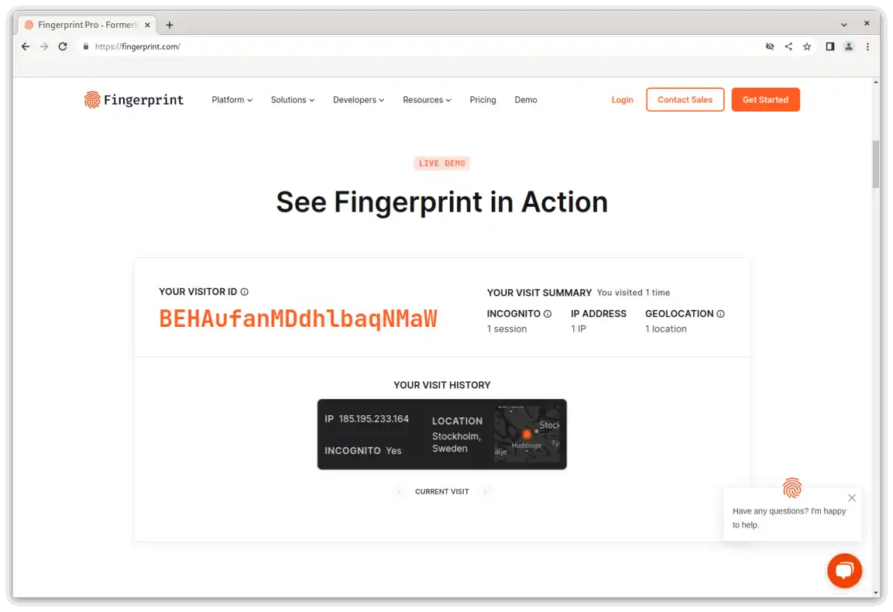](https://www.bitestring.com/images/2023-03-19-fingerprinting/chromium_visit_1.webp) | [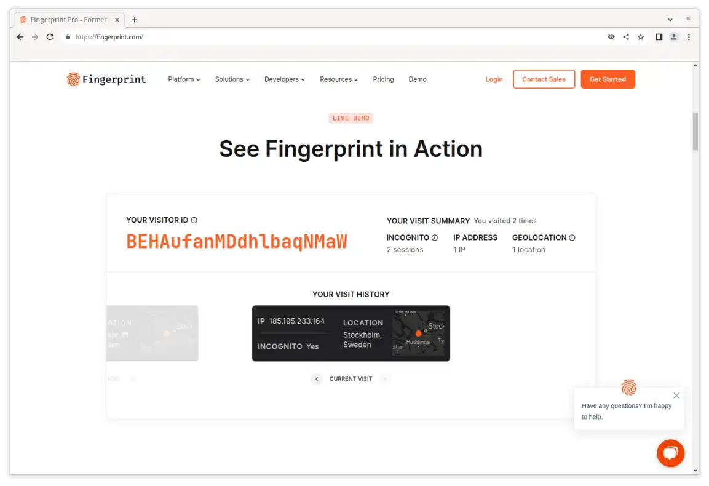](https://www.bitestring.com/images/2023-03-19-fingerprinting/chromium_visit_2.webp) | [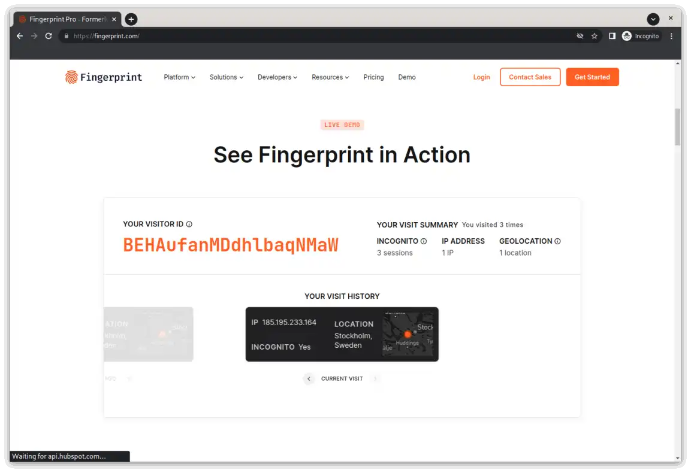](https://www.bitestring.com/images/2023-03-19-fingerprinting/chromium_visit_private_mode.webp) |

FingerprintJS generates the same ID in each Chromium session, thus it can identify its users across different sessions.  

FingerprintJS在每个Chromium会话中生成相同的ID，因此它可以在不同会话中识别其用户。

### Tor Browser

Tor Browser is made by [The Tor Project](https://www.torproject.org/), a non-profit organization. Tor Browser routes internet traffic through multiple relays across the world, thus making user’s browsing sessions more private. It is based on Firefox and many features of Tor Browser has been incorporated back in Firefox.  

Tor浏览器是由Tor项目（一个非营利组织）制作的。Tor 浏览器通过世界各地的多个中继站来路由互联网流量，从而使用户的浏览会话更加私密。它基于Firefox，Tor浏览器的许多功能已被纳入Firefox中。

  
| Visit 1 | Visit 2 |  |
| --- | --- | --- |
| [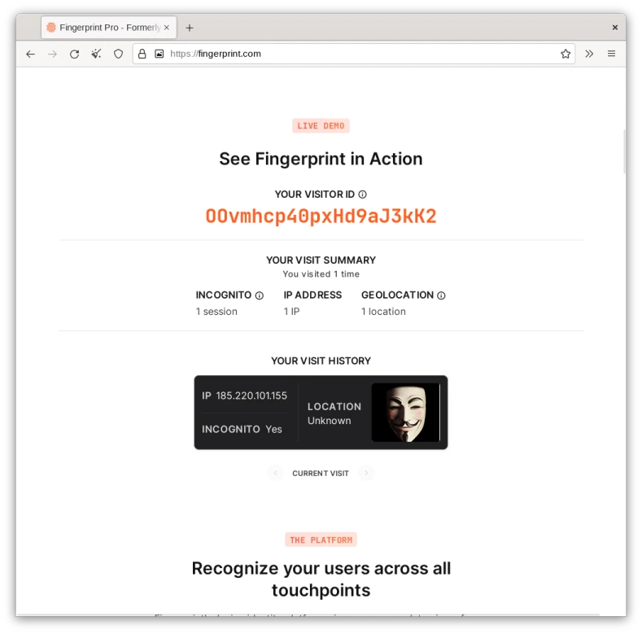](https://www.bitestring.com/images/2023-03-19-fingerprinting/torbrowser_visit_1.webp) | [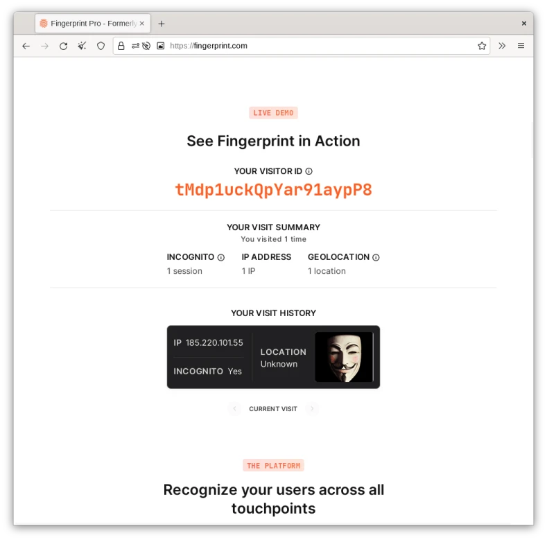](https://www.bitestring.com/images/2023-03-19-fingerprinting/torbrowser_visit_2.webp) |  |

> Please note that Tor Browser always operates in Private Browsing mode. So I did not test it under Private Browsing explicitly.  
> 
> 请注意，Tor 浏览器总是在私人浏览模式下运行。所以我没有明确地在私人浏览模式下测试它。

FingerprintJS could not link two different Tor Browser sessions by the same user. So Tor Browser is more secure against fingerprinting.  

FingerprintJS无法连接同一用户的两个不同的Tor浏览器会话。因此，Tor 浏览器对指纹识别更加安全。

## Conclusion

Fingerprinting has become a popular method of user tracking due to its ability to connect multiple different browsing sessions even if the user clears browsing history and data. Given there are companies selling fingerprinting as a service, if you want to really protect yourself from fingerprinting, you should use Tor Browser or Firefox with `resistFingerprinting=true`. If you need to use Chromium, then Brave browser is a good choice. It also randomizes fingerprint for each session, making it harder to link your browsing sessions. However, I do not recommend Brave because it is based on Google’s Chromium engine, thus only encourages Google’s monopoly.  

指纹识别已经成为一种流行的用户跟踪方法，因为它能够连接多个不同的浏览会话，即使用户清除了浏览历史和数据。鉴于有公司将指纹识别作为一项服务出售，如果你想真正保护自己不被指纹识别，你应该使用Tor浏览器或带有 `resistFingerprinting=true` 的Firefox。 如果你需要使用Chromium，那么Brave浏览器是一个不错的选择。它还能为每个会话随机化指纹，使你的浏览会话更难被链接。然而，我不推荐Brave，因为它是基于谷歌的Chromium引擎，因此只会鼓励谷歌的垄断。

On mobile, only Tor Browser and Firefox with `resistFingerprinting=true` were able to protect against fingerprinting. Firefox Focus leaks fingerprints even if you clear its session each time. Also note that VPNs does not help with fingerprinting. They only masks IP address.  

在手机上，只有Tor浏览器和带 `resistFingerprinting=true` 的Firefox能够防止指纹。即使你每次都清除会话，Firefox Focus也会泄露指纹。还要注意的是，VPNs对指纹识别没有帮助。它们只是掩盖了IP地址。
