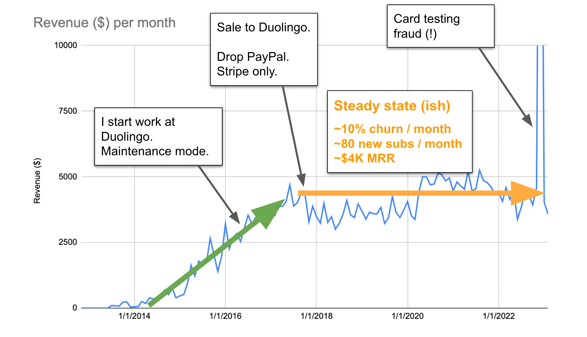
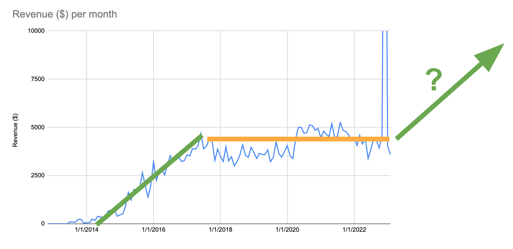

March 23, 2023 2023年3月23日

I wrote about my language learning startup, [Readlang](https://readlang.com/), back in [2014](https://steveridout.com/2014/03/22/readlang-my-bootstrapped-language-learning-web-app.html), and then again in [2016](https://steveridout.com/2016/01/04/readlang-3-years-as-a-one-man-startup.html), both times attracting attention on Hacker News, where my story of a struggling one-man startup seemed to resonate. Well, it’s now 7 years later, and a bunch has happened since, so it’s time for an update…  

我在2014年写过关于我的语言学习创业公司Readlang的文章，然后在2016年又写了一次，这两次都在Hacker News上引起了关注，在那里我关于一个人创业的挣扎故事似乎引起了共鸣。好吧，现在已经过去7年了，之后发生了很多事情，所以是时候更新一下了......

## The Aquihire

My Readlang story caught the attention of Duolingo and I went to work there in 2016. Meeting them for the first time on their company vacation at a fancy resort in Costa Rica was a culture shock after my frugal bootstrapper lifestyle. “You’ll get used to it” said one of the other engineers, which turned out to be half right. It was a wonderful, surreal experience.  

我的Readlang故事引起了Duolingo的注意，我在2016年去那里工作。在哥斯达黎加的一个豪华度假村，在他们公司的假期中第一次见到他们，在我节俭的引导者生活方式之后，是一种文化冲击。"你会习惯的"，其他一个工程师说，事实证明这话说对了一半。这是一个美妙的、超现实的经历。

We talked about a potential Readlang sale before I joined Duolingo. But they were more excited for me to work for on other projects. It sounded like an aquihire which made me uncomfortable. So instead we agreed that I would work for them for a while and keep Readlang on the side. I spent the first 9 months working on an [ill-fated chatbot](https://techcrunch.com/2016/10/06/duolingos-chatbots-help-you-learn-a-new-language/) (a few years too early [as it turns out](https://blog.duolingo.com/duolingo-max/)). After this, I decided that I had unfinished business and emailed to say that I’d be leaving to work on Readlang again. They quickly got back to me and said I could have carte-blanche to work on a completely new product around listening. I had ideas in this area already, and it seemed too cool to turn down. Get paid to hack together a new prototype that I would be in charge of? Yes please!  

在我加入Duolingo之前，我们谈论过潜在的Readlang销售。但他们对我为其他项目工作更感兴趣。这听起来像一个Aquihire，让我感到不舒服。因此，我们同意我为他们工作一段时间，并将Readlang保留在一边。在最初的9个月里，我为一个命运不佳的聊天工具工作（事实证明早了几年）。在这之后，我决定我还有未完成的工作，于是发邮件说我要离开，再次为Readlang工作。他们很快就给我回了信，说我可以全权委托他们围绕听觉开发一个全新的产品。我在这个领域已经有了一些想法，而且这似乎太酷了，我不能拒绝。拿到钱去破解一个我负责的新原型？是的，请！

My idea was to launch an MVP and then leave to work on Readlang again. Within a few months we launched the first version of Duolingo Stories and the reception both internally and externally was really promising. So much so that I was now pretty excited to continue growing it. It seemed we were onto something. Given that Stories was kinda similar to Readlang, it felt weird for me to be running Readlang on the side, so I brought up the option of a sale again with the idea that I’d either go all in with Duolingo or leave for Readlang. I figured that eventually I’d either work on Readlang inside Duolingo or Stories might even evolve to become a replacement for Readlang. So we did the deal. We migrated the site to run on their infrastructure and the customer’s payments went to Duolingo’s Stripe account instead of mine. Beyond that, nothing much changed with Readlang. Stories grew, but it never did turn into a Readlang replacement. I occasionally thought about pitching Readlang as a project to focus on, but I could never convince myself that it would move the needle at Duolingo’s scale, and so it was neglected.  

我的想法是推出一个MVP，然后离开，再次从事Readlang的工作。在几个月内，我们推出了Duolingo Stories的第一个版本，内部和外部的反应都非常好。以至于我现在对继续发展它感到非常兴奋。看来我们已经找到了一些东西。鉴于Stories与Readlang有点类似，我在一边经营Readlang感觉很奇怪，所以我再次提出了出售的选择，我的想法是要么全身心投入Duolingo，要么离开Readlang。我想，最终我要么在Duolingo内从事Readlang的工作，要么Stories甚至可能发展成为Readlang的替代品。所以我们做了这个交易。我们把网站迁移到他们的基础设施上运行，客户的付款进入了Duolingo的Stripe账户，而不是我的。除此之外，Readlang没有什么变化。Stories成长了，但它从未变成Readlang的替代品。我偶尔会想把Readlang作为一个项目来做，但我从来没有说服自己，认为它能在Duolingo的规模上取得进展，所以它被忽视了。

## The Buy-Back

At the end of 2021 [I left Duolingo](https://steveridout.com/2022/04/05/back-to-bootstrapping-a-new-web-app.html) and with it, Readlang. I left instructions on how to maintain Readlang but figured that one day something would break, and there was a good chance they’d want to shut it down. I said that if it ever got to that point to please get in touch with me.  

2021年底，我离开了Duolingo，同时也离开了Readlang。我留下了如何维护Readlang的说明，但我想有一天会出现问题，而且很有可能他们会想关闭它。我说，如果有一天到了那个地步，请与我联系。

I spent most of 2022 half-heartedly working on some other projects ([JigglePix](https://jigglepix.com/), [Flashdown](https://github.com/SteveRidout/flashdown), [Notepad Calculator](https://notepadcalculator.com/)), until in December I got 3 emails from random people complaining about payments being taken by Readlang that they had no idea about. To get 3 emails to my personal email was pretty strange. I asked Duolingo and they confirmed that something was going wrong. It turned out that people were using Readlang for [card testing fraud](https://stripe.com/docs/disputes/prevention/card-testing). After I helped them to fix the problem and refund everyone they asked if I wanted Readlang back and how much I’d pay. Of course I said yes!  

2022年的大部分时间我都在半心半意地做其他一些项目（JigglePix , Flashdown , Notepad Calculator），直到12月我收到3封随机的人的邮件，抱怨Readlang收取了他们不知道的费用。在我的个人邮箱中收到3封邮件是非常奇怪的。我问了Duolingo，他们确认出了问题。事实证明，人们正在使用Readlang进行卡片测试欺诈。在我帮助他们解决了问题并向所有人退款后，他们问我是否想要回Readlang，以及我将支付多少钱。我当然说好了！"！

## How Is Readlang Doing Now? Readlang现在做得怎么样了？

Surprisingly OK! If you had asked me 7 years ago what would happen to Readlang if I just abandoned it and left it in maintanence mode for all this time, I would have bet that it would have declined, but actually, it basically held steady. Here’s a monthly revenue graph:  

出乎意料的好!如果你在7年前问我，如果我就这样放弃它，让它一直处于维护模式，Readlang会发生什么，我打赌它会下降，但实际上，它基本上保持稳定。这是每月的收入图：

The first few years show good growth. During this time I was constantly adding new features, blogging about it, and it largely spread organically with enthusiastic users sharing it in different online and offline communities. After putting it maintenance mode in early 2016 it continued growing until the sale to Duolingo. At this point we dropped PayPal for simplicity resulting in a dip but after that revenue held surprisingly constant. About 10% of users were churning each month but the supply of new users never dried up. People continued to recommend Readlang, it even appeared in one of Tim Ferriss’ “5 Bullet Friday” newsletters in 2018! There was a noticeable bump in 2020 likely driven by the pandemic lockdowns.  

前几年显示出良好的增长。在这段时间里，我不断地添加新的功能，写博客，它在很大程度上通过热情的用户在不同的线上和线下社区分享而有机地传播。在2016年初进入维护模式后，它继续增长，直到出售给Duolingo。在这一点上，我们放弃了PayPal，以使其简单化，但在那之后，收入出奇地保持不变。大约10%的用户每个月都在流失，但新用户的供应从未枯竭。人们继续推荐Readlang，它甚至出现在2018年Tim Ferriss的 "5Bullet Friday "新闻通讯中！在2020年有明显的增长！2020年有一个明显的颠簸，可能是由大流行的锁定所驱动。

That’s the beauty of software - up-front work can continue delivering value for years to come!  

这就是软件的魅力--前期的工作可以在未来几年内继续提供价值!

Now that I have it back, I’m wondering how to get it to do this…  

现在我把它拿回来了，我想知道如何让它这样做......

I have ideas. And of course there are more ideas that time to implement them. Recently I experimented with adding ChatGPT-powered [Smart Definitions](https://blog.readlang.com/2023/03/23/smart-definitions.html). But I think the most important thing is to improve the streak mechanic to get people more invested in returning every day - did I mention I worked at Duolingo? :-) If I manage to improve growth then I might even think about re-investing the profits and get someone else to help out. It’s not like I’m committed to this one-man-startup approach forever!  

我有想法。当然还有更多的想法，就是有时间来实现它们。最近，我尝试添加由ChatGPT驱动的智能定义。但我认为最重要的是改善条纹机制，让人们更投入地每天回来 - 我有没有提到我在Duolingo工作过？）如果我设法改善增长，那么我甚至可能考虑重新投资利润，让别人来帮忙。我并不是要永远致力于这种一个人的创业方式！

Anyway, I’m looking forward to improving Readlang again. It’s fun to have my baby back!  

无论如何，我期待着再次改善Readlang。我的宝贝回来了，这很有趣！

## UPDATE

-   [Discuss on Hacker News  
    
    在Hacker News上讨论](https://news.ycombinator.com/item?id=35281617)
