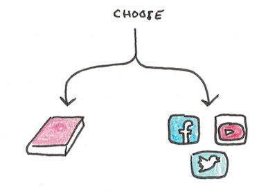

A recent Gallup poll finds that American adults are reading [fewer books each year](https://news.gallup.com/poll/388541/americans-reading-fewer-books-past.aspx):  

最近的一项盖洛普民意调查发现，美国成年人每年阅读的书籍都在减少：

> Americans say they read an average of 12.6 books during the past year, a smaller number than Gallup has measured in any prior survey dating back to 1990. U.S. adults are reading roughly two or three fewer books per year than they did between 2001 and 2016.  
> 
> 美国人说，他们在过去一年中平均阅读了12.6本书，这个数字比盖洛普在追溯到1990年的任何先前调查中测得的数字都要小。美国成年人每年阅读的书籍比2001年至2016年期间大约少了两到三本。
> 
> …
> 
> The decline is greater among subgroups that tended to be more avid readers, particularly college graduates but also women and older Americans. College graduates read an average of about six fewer books in 2021 than they did between 2002 and 2016, 14.6 versus 21.1.  
> 
> 在倾向于更热衷于阅读的亚群体中，下降幅度更大，特别是大学毕业生，但也包括女性和美国老年人。大学毕业生在2021年的平均阅读量比他们在2002年至2016年期间少了大约6本，即14.6本对21.1本。

This is a worrying trend. 这是一个令人担忧的趋势。

It’s possible, of course, to read fewer books and still engage in deep thinking. You can watch university classes on YouTube and read scientific papers online. Wikipedia does more than paper encyclopedias could have ever accomplished.  

当然，也可以少读点书，仍然进行深入思考。你可以在YouTube上观看大学课程，在线阅读科学论文。维基百科的作用比纸质百科全书所能完成的还要多。

Yet books still represent the best format for deep, sustained engagement with an idea or story. A decline in reading books does not necessarily mean a loss of depth in every case, but it probably indicates a trend toward more shallow engagement on average.  

然而，书籍仍然是深入、持续地参与一个想法或故事的最佳形式。阅读书籍的减少并不一定意味着在每一种情况下都失去了深度，但它可能表明了一种平均而言更加浅薄的参与趋势。

## Why Has Reading Books Declined? 为什么阅读书籍的人减少了？

The poll did not analyze the cause of the decline. However, a likely explanation is that this decline closely tracks the rise of social media and smartphones. Reading books is a leisure activity that struggles to compete with the algorithmic engineering underlying most online content.  

该民意调查没有分析造成这种下降的原因。然而，一个可能的解释是，这种下降密切跟踪社交媒体和智能手机的崛起。读书是一种休闲活动，很难与大多数在线内容的基础算法工程竞争。

Anecdotally, this fits with many conversations I have had. Many people who used to pick up a book during their spare time now pick up their phone instead.  

从轶事来看，这与我的许多对话相吻合。许多人曾经在闲暇时拿起一本书，现在却拿起了手机。

Reading books is both a skill and a habit. As an acquired skill, reading is initially effortful but becomes easier as we become fluent, recognizing words and building background knowledge of the matters discussed. As a habit, reading is something we choose to do (or not) in our moments of downtime.  

阅读书籍既是一种技能，也是一种习惯。作为一种后天的技能，阅读最初是费力的，但随着我们变得流利，认识单词和建立所讨论事项的背景知识而变得容易。作为一种习惯，阅读是我们在闲暇时选择做（或不做）的事情。

But both skills and habits can atrophy**.** If you spend less time reading, it takes more effort to work through challenging texts. If you decide to read less often, choosing to read becomes more effortful. Reading books, and the opposite, can both become self-reinforcing actions—readers read more books, while nonreaders find it increasingly hard to do so.  

但技能和习惯都会萎缩。如果你花在阅读上的时间较少，就需要付出更多的努力来完成具有挑战性的文本。如果你决定减少阅读次数，选择阅读就会变得更加费力。读书和反之，都可以成为自我强化的行动--读书人读更多的书，而不读书的人则发现越来越难做到这一点。

Given this state of affairs, it’s alarming that book reading is waning. Even if articles like this one act as a partial substitute, the skills and habits needed to engage deeply with ideas may still be declining. [Curating our media consumption](https://www.scotthyoung.com/blog/2023/01/31/curated-consumption/) may be necessary if we want to be the exception.  

鉴于这种状况，书籍阅读正在减弱，这令人震惊。即使像这样的文章起到了部分替代作用，深入接触思想所需的技能和习惯可能仍在下降。 如果我们想成为例外，策划我们的媒体消费可能是必要的。
