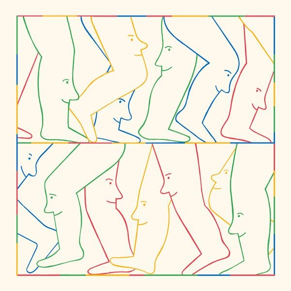

Guest Essay

March 25, 2023, 9:00 a.m. ET  

2023年3月25日，美国东部时间上午9:00

Credit...Pierre Buttin 信用...皮埃尔-布廷

Andrew McCarthy 作者：安德鲁-麦卡锡

Mr. McCarthy is the author of, most recently, “Walking With Sam: A Father, a Son, and Five Hundred Miles Across Spain.”  

麦卡锡先生是最近出版的《与山姆同行》的作者：一个父亲，一个儿子，以及穿越西班牙的五百英里"。

Sign up for the Opinion Today newsletter  Get expert analysis of the news and a guide to the big ideas shaping the world every weekday morning.  

注册订阅 "今日观点 "时事通讯每个工作日的早晨，我们都会收到专家对新闻的分析以及对影响世界的重大观点的指导。请将其发送至您的收件箱。

Walking is the worst-kept secret I know. Its rewards hide under every step.  

步行是我所知道的最不为人知的秘密。它的回报隐藏在每一步下。

Perhaps because we take walking so much for granted, many of us often ignore its ample gifts. In truth, I doubt I would walk often or very far if its sole benefit was physical, despite the abundant proof of its value in that regard. There’s something else at play in walking that interests me more. And with the arrival of spring, attention must be paid.  

也许是因为我们把步行视为理所当然，所以我们中的许多人常常忽略了它的充足的礼物。事实上，如果步行的唯一好处是身体，我怀疑自己是否会经常步行或走得很远，尽管有大量证据表明它在这方面的价值。步行中还有一些其他的东西在起作用，让我更感兴趣。随着春天的到来，必须注意。

I discovered the power of ambling more than a quarter century ago when I traipsed 500 miles across Spain on the Camino de Santiago, an ancient pilgrimage route. I stumbled upon the Camino by accident and then trudged across Spain with purpose. I’ve been a walker ever since. And I’m not the only one.  

四分之一个多世纪前，当我在圣地亚哥卡米诺（Camino de Santiago）这条古老的朝圣路线上跋涉500英里时，我发现了伏案工作的力量。我无意中发现了卡米诺，然后带着目的跋涉在西班牙。从那时起，我就成了一名步行者。而且我不是唯一的一个。

Hippocrates proclaimed that “walking is man’s best medicine.” The good doctor also knew that walking provided more than mere physical benefits when he suggested: “If you are in a bad mood, go for a walk. If you are still in a bad mood, go for another walk.” He was alluding to what so many who came after would attest, that walking not only nourishes the body but also soothes the mind while it burns off tension and makes our troubles recede into a more manageable perspective.  

希波克拉底宣称，"散步是人类最好的药物"。这位好医生还知道，步行提供的不仅仅是身体上的好处，他建议："如果你心情不好，就去走走。如果你的心情仍然不好，就再去走走"。他暗指后来的许多人都会证明，散步不仅能滋养身体，还能舒缓心灵，同时燃烧掉紧张情绪，使我们的烦恼退去，进入一个更容易管理的角度。

Soren Kierkegaard agreed when he confessed, “I know of no thought so burdensome that one cannot walk away from it.” And Charles Dickens was even more direct. “If I could not walk far and fast,” he wrote, “I think I should just explode and perish.”  

索伦-克尔凯郭尔（Soren Kierkegaard）表示同意，他承认："我不知道有什么思想是如此沉重的，以至于人们无法摆脱它"。查尔斯-狄更斯说得更直接。他写道："如果我不能走得又远又快，"他写道："我想我应该爆炸，然后灭亡。"

But walking does more than keep the devil from the door. The Welsh poet (and sometime vagabond) W.H. Davies wrote:  

但是步行的作用不仅仅是将魔鬼挡在门外。威尔士诗人（有时也是流浪者）W.H.Davies写道：

> Now shall I walk 我现在要走  
> 
> Or shall I ride? 还是要我骑马？  
> 
> “Ride,” Pleasure said. "骑马，"快乐说。  
> 
> “Walk,” Joy replied. "走路，"乔伊回答。

Walking buoys the spirits in a way that feels real and earned. It feels _owned_. And walking, like a generous partner, meets us more than halfway.  

走路使人精神振奋，感觉真实而有价值。它给人的感觉是拥有。而行走，就像一个慷慨的伙伴，满足我们超过一半的要求。

There’s abundant testimony that a good ramble fuels creativity. William Wordsworth swore by walking, as did Virginia Woolf. So did William Blake. Thomas Mann assured us, “Thoughts come clearly while one walks.” J.K. Rowling observed that there is “nothing like a nighttime stroll to give you ideas,” while the turn-of-the-20th-century novelist Elizabeth von Arnim concluded that walking “is the perfect way of moving if you want to see into the life of things.”  

有大量的证据表明，良好的漫游可以激发创造力。威廉-华兹华斯以散步为誓，弗吉尼亚-伍尔夫也是如此。威廉-布莱克也是如此。托马斯-曼向我们保证，"当一个人在散步时，思想会很清晰"。J.K.罗琳指出，"没有什么比夜间散步更能给你带来灵感"，而20世纪初的小说家伊丽莎白-冯-阿尼姆总结说，"如果你想看到事物的生命，散步是最完美的移动方式"。

And ask any deep thinker about the benefits of what Bill Bryson calls the “tranquil tedium” walking elicits. Jean-Jacques Rousseau admitted, “There is something about walking that animates and activates my ideas.” Even the resolutely pessimistic Friedrich Nietzsche had to give it up for a good saunter when he allowed, “All truly great thoughts are conceived while walking.”  

问问任何一个深思熟虑的人，比尔-布赖森所说的步行引起的 "宁静的乏味 "有什么好处。让-雅克-卢梭承认，"步行有一些东西能使我的思想活跃起来"。即使是坚决悲观的弗里德里希-尼采也不得不放弃散步，他说："所有真正伟大的思想都是在散步时构思的"。

While my own ruminations may not approach the lofty heights to which Nietzsche referred, a good long walk, or even one not so long, begins to carve out space between my thoughts that allows clarity to rise up through my shoes in a way that no other mode of transport does. The travel writer and scholar Patrick Leigh Fermor put it succinctly when he said, “All horsepower corrupts.”  

虽然我自己的思考可能无法达到尼采所说的崇高高度，但一次良好的长途步行，甚至是一次不太长的步行，开始在我的思想之间开辟出空间，使我的思想清晰起来，这是其他交通方式无法做到的。旅行作家和学者Patrick Leigh Fermor说得很简洁，他说："所有的马力都会使人堕落"。

Until I went to Spain with the sole mission of crossing the country on foot, I often considered walking a waste of my time. The Camino changed that. The monthlong walk revealed me to myself in a way nothing else had — my looping pattern of thinking, my habitual emotion cycles, my fearful nature. The Camino wore down my resistance to seeing myself, and then step after step built me back up. It altered my place in the world.  

在我带着徒步穿越这个国家的唯一任务去西班牙之前，我经常认为步行是在浪费我的时间。卡米诺改变了这一点。长达一个月的步行让我以一种其他方式看到了自己--我循环往复的思维模式、我习惯性的情绪循环、我的恐惧本性。卡米诺之旅磨灭了我对看清自己的抗拒，然后一步一步地把我重新建立起来。它改变了我在这个世界上的位置。

Instead of viewing walking as simply the slowest way to get somewhere, I grew to see it not only as a means to an end, but as the event itself. And since I walked the Camino for a second time last year with my 19-year-old son, I’ve come to understand walking as among the most valuable things I can do.  

我不再把步行看作是到达某地的最慢方式，而是逐渐把它看作是达到目的的一种手段，而且是事件本身。自从去年我和我19岁的儿子第二次走过卡米诺后，我开始理解步行是我能做的最有价值的事情之一。

The writer Rebecca Solnit pointed out that walking “is how the body measures itself against the earth.” And through such physical communion, walking offers up its crowning gift by bringing us emotionally, even spiritually, home to ourselves. When on the last day of our walk my son turned to me and said, “Dad, that’s the only ‘10 out of 10’ thing I’ve ever done in my life,” I knew he had arrived not only in Santiago de Compostela, but, more meaningfully, in himself.  

作家丽贝卡-索尔尼特（Rebecca Solnit）指出，步行 "是身体对地球的自我测量"。通过这样的身体交流，步行提供了它的最高礼物，使我们在情感上，甚至在精神上，回到自己的家。当我们行走的最后一天，我的儿子转身对我说："爸爸，这是我一生中做过的唯一一件'十全十美'的事情"，我知道他不仅到达了圣地亚哥-德孔波斯特拉，而且更有意义的是他自己。

The great naturalist John Muir keenly observed, “I only went out for a walk and … going out, I found, was really going in.” Has anyone ever emerged from ambling through nature for an hour and regretted their improved state of being? Perhaps this is what that dedicated walker Henry David Thoreau was referring to when he wrote, “I took a walk in the woods and came out taller than the trees.”  

伟大的自然学家约翰-穆尔敏锐地观察到，"我只是出去走走，......我发现出去，其实是进去"。有没有人在大自然中漫步一小时后，后悔自己的生存状态得到了改善？也许这就是那个热衷于散步的亨利-戴维-梭罗所说的，他写道："我在树林里散步，出来时比树还高。"

So the secret is out there. It’s under the leaves on the trail. It’s right there on the sidewalk. Spring has sprung. Lace up.  

所以秘密就在那里。它就在小路上的树叶下。它就在人行道上。春天已经来临。系上鞋带。

[Andrew McCarthy](https://andrewmccarthy.com/) is a writer and an actor and the author of, most recently, “Walking With Sam: A Father, a Son, and Five Hundred Miles Across Spain.”  

安德鲁-麦卡锡是一名作家和演员，最近的作品是《与山姆同行》：一个父亲，一个儿子，以及穿越西班牙的五百英里"。

_The Times is committed to publishing_ [_a diversity of letters_](https://www.nytimes.com/2019/01/31/opinion/letters/letters-to-editor-new-york-times-women.html) _to the editor. We’d like to hear what you think about this or any of our articles. Here are some_ [_tips_](https://help.nytimes.com/hc/en-us/articles/115014925288-How-to-submit-a-letter-to-the-editor)_. And here’s our email:_ [_letters@nytimes.com_](mailto:letters@nytimes.com)_._  

泰晤士报》致力于发表多样化的编辑来信。我们想听听你对这篇文章或我们任何文章的看法。这里有一些提示。而这里是我们的邮箱：letters@nytimes.com 。

_Follow The New York Times Opinion section on_ [_Facebook_](https://www.facebook.com/nytopinion)_,_ [_Twitter (@NYTopinion)_](http://twitter.com/NYTOpinion) _and_ [_Instagram_](https://www.instagram.com/nytopinion/)_._  

在Facebook、Twitter（@NYTopinion）和Instagram上关注《纽约时报》意见版。

**Sale ends soon 销售即将结束**

**: Gain unlimited access to all of The Times.  

:获得无限制地访问所有的《时代》杂志。**

~$3~ $0.50 a week for your first year.  

~$3~ 第一年每周0.50美元。

**Sale ends soon 销售即将结束**

**: Gain unlimited access to all of The Times.  

:获得无限制地访问所有的《时代》杂志。**

~$3~ $0.50 a week for your first year.  

~$3~ 第一年每周0.50美元。
