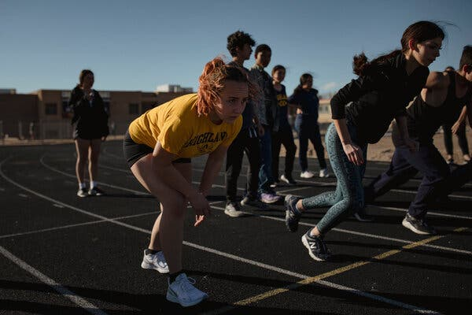
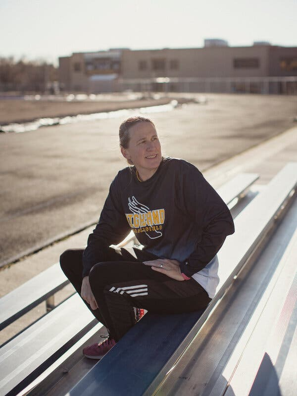
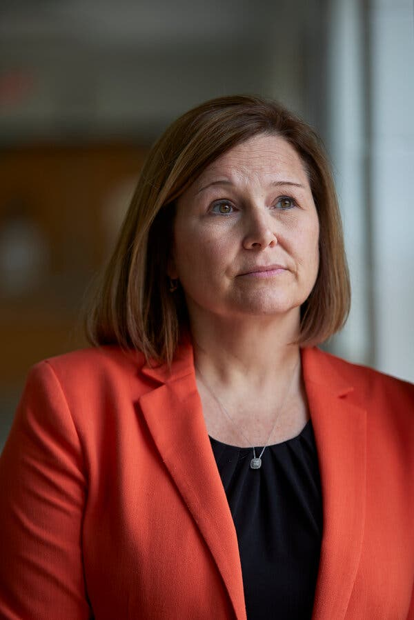
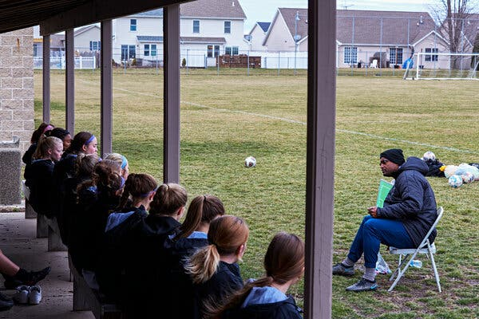

Nationwide, poor children and adolescents are participating far less in sports and fitness activities than their more affluent peers.  

在全国范围内，贫困儿童和青少年参加体育和健身活动的人数远远少于他们更富裕的同龄人。

Naomi Peralta, at left, prepares for a practice run at Highland High School in Albuquerque, N.M., in February.Credit...Adria Malcolm for The New York Times  

左边的纳奥米-佩拉尔塔（Naomi Peralta）准备在2月份在新墨西哥州阿尔伯克基的高地中学进行练习。阿德里亚-马尔科姆为《纽约时报》报道

Published March 24, 2023Updated March 25, 2023, 5:05 a.m. ET  

发布时间：2023年3月24日 更新时间：2023年3月25日，美东时间上午5:05

Over the last two decades, technology companies and policymakers warned of a “digital divide” in which poor children could fall behind their more affluent peers without equal access to technology. Today, with widespread internet access and smartphone ownership, the gap has narrowed sharply.  

在过去20年里，技术公司和政策制定者警告说，如果没有平等的技术机会，贫困儿童可能会落后于他们更富裕的同龄人，这就是 "数字鸿沟"。今天，随着互联网的普及和智能手机的拥有，这种差距已经急剧缩小。

But with less fanfare a different division has appeared: Across the country, poor children and adolescents are participating far less in sports and fitness activities than more affluent youngsters are. Call it the physical divide.  

但是，在不那么大张旗鼓的情况下，出现了不同的划分：在全国范围内，贫困儿童和青少年参与体育和健身活动的程度远远低于较富裕的青少年。这就是所谓的身体鸿沟。

Data from multiple sources reveal a significant gap in sports participation by income level. A Centers for Disease Control and Prevention study found that 70 percent of children from families with incomes above about $105,000 — four times the poverty line — participated in sports in 2020. But participation was around 51 percent for families in a middle-income range, and just 31 percent for families at or below the poverty line.  

来自多个渠道的数据显示，不同收入水平的体育参与度存在巨大差距。美国疾病控制和预防中心的一项研究发现，2020年，收入高于约105,000美元--贫困线的四倍--的家庭中，70%的儿童参加了体育活动。但中等收入家庭的参与率约为51%，而处于贫困线或以下的家庭只有31%。

A [2021 study](https://pubmed.ncbi.nlm.nih.gov/34209544/) of Seattle-area students from fifth grade through high school found that less affluent youth were less likely to participate in sports than their more affluent peers. The study also found that middle schoolers from more affluent families were three times as likely to meet physical exercise guidelines as less affluent students.  

2021年对西雅图地区五年级到高中的学生进行的一项研究发现，不太富裕的青少年比他们更富裕的同龄人更不可能参加体育运动。该研究还发现，来自较富裕家庭的初中生达到体育锻炼准则的可能性是较不富裕学生的三倍。

A combination of factors is responsible. Spending cuts and changing priorities at some public schools have curtailed physical education classes and organized sports. At the same time, privatized youth sports have become a multibillion-dollar enterprise offering new opportunities — at least for families that can afford hundreds to thousands of dollars each season for club-team fees, uniforms, equipment, travel to tournaments and private coaching.  

这是一个综合因素造成的。一些公立学校的开支削减和优先事项的改变，削减了体育课和有组织的体育运动。与此同时，私有化的青少年体育已经成为一个价值数十亿美元的企业，提供了新的机会--至少对于那些能够负担得起每个赛季数百至数千美元的俱乐部球队费用、制服、设备、锦标赛旅行和私人教练的家庭来说。

“What’s happened as sports has become privatized is that it has become the haves and have-nots,” said Jon Solomon, editorial director for the Aspen Institute Sports and Society Program.  

"阿斯彭研究所体育与社会项目的编辑主任乔恩-所罗门（Jon Solomon）说："随着体育的私有化，所发生的事情是，它已经成为富人和穷人。

Recent [Aspen Institute research](https://www.aspenprojectplay.org/state-of-play-2022/physical-mental-health-trends) found that among children from families making less than $25,000 a year, participation in a healthy level of activity fell to 26.6 percent in 2021 from 34.1 percent in 2013. For children from families with $25,000 to $50,000 in income, participation fell during that time to 35.7 percent from 38.1 percent.  

阿斯彭研究所最近的研究发现，在年收入低于25,000美元的家庭的儿童中，参与健康水平的活动从2013年的34.1%下降到2021年的26.6%。对于来自收入在2.5万至5万美元的家庭的儿童，在此期间参与率从38.1%下降到35.7%。

But among families with incomes above $100,000, participation rose in that period, to 46 percent from 43.9 percent, the Aspen Institute found.  

但是，阿斯彭研究所发现，在收入高于10万美元的家庭中，在此期间参与率上升，从43.9%上升到46%。

“Particularly for low-income kids, if they don’t have access to sports within the school setting, where are they going to get their physical activity?” Mr. Solomon said. “The answer is nowhere.”  

"特别是对于低收入的孩子来说，如果他们没有机会在学校环境中参加体育活动，他们将在哪里获得体育活动？"所罗门先生说。"答案是没有地方"。

Schools are not always filling the gap. [A recent report](https://paamovewithus.org/wp-content/uploads/2022/10/2022-US-Report-Card-on-Physical-Activity-for-Children-and-Youth.pdf) from the Physical Activity Alliance, a nonprofit organization, gave schools nationwide a grade of D– for physical fitness. That is a downgrade from a C– in 2014, with the new grade reflecting even less access to regular physical education classes, gym time and equipment in schools.  

学校并不总是能填补这一空白。 非营利组织 "体育活动联盟 "最近的一份报告给全国学校的体育健身评分为D-。这比2014年的C-级有所下降，新的等级反映了在学校获得常规体育课、健身时间和设备的机会更少。

Image

Ann Paulls-Neal, varsity track coach at Highland High, has noticed that more affluent students, with access to club sports, “are more comfortable moving, where the students in low-income areas are not.” Credit...Adria Malcolm for The New York Times  

安-鲍尔斯-尼尔是高地高中的校队田径教练，她注意到，更多的富裕学生，由于有机会参加俱乐部运动，"他们更喜欢运动，而低收入地区的学生则不喜欢。"信用...Adria Malcolm for The New York Times

Ann Paulls-Neal, a longtime physical education teacher and track coach in Albuquerque, has watched the trend play out. For nearly 20 years, until 2017, she taught at John Baker Elementary, which drew students largely from middle- and higher-income families ([less than one-third](https://nces.ed.gov/ccd/schoolsearch/school_detail.asp?ID=350006000070) qualified for free or reduced-price lunch). There, “all of my students did at least one sport after school,” she said. “Club soccer or pretty much club anything.”  

安-鲍尔斯-尼尔(Ann Paulls-Neal)是阿尔布开克市的一名长期体育教师和田径教练，她目睹了这一趋势的发生。近20年来，直到2017年，她一直在约翰-贝克小学任教，那里的学生主要来自中等和高收入家庭（不到三分之一的人有资格获得免费或减价午餐）。在那里，"我所有的学生在放学后至少做一项运动，"她说。"足球俱乐部或几乎所有的俱乐部。

Then she moved to a school, Wherry Elementary, where [100 percent](https://nces.ed.gov/ccd/schoolsearch/school_detail.asp?Search=1&Miles=10&Zip=87117&ID=350006000120) of the students qualified for free or reduced-price lunch. Students played on the playground, she said, “but we had just three kids that were playing any kind of sport outside of school.”  

然后她搬到了惠里小学，那里100%的学生有资格获得免费或减价午餐。她说，学生们在操场上玩耍，"但我们只有三个孩子在校外进行任何形式的运动。"

She speculated about the reasons. Families couldn’t afford private sports or didn’t have cars or time to ferry their children to practice, she proposed, and clubs were unthinkable “if these sites or clubs don’t hold practice on a bus line.”  

她猜测了其中的原因。她提出，家庭负担不起私人体育活动，或者没有汽车或时间来运送他们的孩子去练习，而俱乐部是不可想象的，"如果这些场地或俱乐部不在公交线路上举行练习。"

In 2019, Ms. Paulls-Neal became the department chair of health and physical education at Highland High School, where [100 percent](https://nces.ed.gov/ccd/schoolsearch/school_detail.asp?ID=350006000063) of students qualify for free lunch. Here, she said, she was seeing the impact of “this club and school divide.”  

2019年，鲍尔斯-尼尔女士成为高地学校的健康和体育系主任，该校100%的学生有资格获得免费午餐。她说，在这里，她看到了 "这种俱乐部和学校的分歧 "的影响。

More affluent children are often highly trained in sports — “a little bit ahead,” said Ms. Paulls-Neal, who is also the executive director of the New Mexico chapter of the Society of Health and Physical Educators, or SHAPE America. “And they are more comfortable moving, where the students in low-income areas are not.”  

更富裕的孩子往往在体育方面受到高度训练--"有点领先"，保尔斯-尼尔女士说，她也是健康和体育教育工作者协会（SHAPE America）新墨西哥州分会的执行主任。"而且他们更喜欢运动，而低收入地区的学生则不喜欢。

A similar pattern is emerging in Unit District No. 5 in McLean County, Ill. Faced with budget shortfalls, the district’s [board of education voted this year](https://meetings.boardbook.org/Documents/WebViewer/1482?file=1312ac43-4833-4e26-ab6e-8fe52d478143) to make a series of cuts, including to sports. Next year all the junior high sports will be gone: boys’ and girls’ basketball, cross-country, track, boys’ wrestling and baseball, and girls’ softball and volleyball.  

伊利诺伊州麦克莱恩县第5单元区也出现了类似的模式。面对预算短缺，该区的教育委员会今年投票决定进行一系列的削减，包括对体育的削减。明年，所有的初中体育项目都将消失：男女篮球、越野赛、田径、男子摔跤和棒球，以及女子垒球和排球。

The cuts also include freshman sports at the district’s two high schools; proposed cuts for the 2024-25 school year include junior varsity high school sports. In November, district voters rejected a proposal to raise taxes to fund those programs.  

削减的项目还包括该区两所高中的高一学生体育项目；2024-25学年的拟议削减项目包括初中体育。11月，该区选民否决了一项提高税收以资助这些项目的提案。

Image

Kristen Weikle, superintendent of Unit 5 District Schools in McLean County, Ill. Faced with budget shortfalls, the district’s board of education voted this year to eliminate numerous sports, including basketball, baseball and track.Credit...Mustafa Hussain for The New York Times  

伊利诺伊州麦克莱恩县第五区学校校长克里斯汀-韦克尔。面对预算短缺，该区的教育委员会今年投票决定取消许多运动项目，包括篮球、棒球和田径。Mustafa Hussain for The New York Times

“It’s devastating for the kids,” said Kristen Weikle, the district’s superintendent. She said that school sports promote good grades and boost physical and emotional health among students who participate.  

"这对孩子们来说是毁灭性的，"该区的主管Kristen Weikle说。她说，学校体育促进了良好的成绩，并提高了参与学生的身体和情感健康。

Private sports are accessible to some lower-income families, she added, but not to all. “It’s not just the cost to participate,” Ms. Weikle said. “It’s the cost to travel to competitions. It’s the time to take their child to club activities and then purchase the equipment.”  

她补充说，一些低收入家庭可以参加私人体育活动，但不是所有家庭都可以参加。"魏克尔女士说："这不仅仅是参与的费用。"这是去参加比赛的费用。这是带他们的孩子参加俱乐部活动的时间，然后购买设备。"

To improve equity, Valentine Walker, the coach of high school boys’ and girls’ soccer in the district, started a free soccer club in 2008. At the time, his 8-year-old son was participating in baseball and soccer clubs that cost hundreds of dollars a season. Mr. Walker noticed “an influx of Jamaicans and Africans and Hispanic kids whose families could not afford pay-to-play.”  

为了提高公平性，该区高中男女足球教练瓦伦丁-沃克(Valentine Walker)在2008年成立了一个免费足球俱乐部。当时，他8岁的儿子参加了一个赛季要花费数百美元的棒球和足球俱乐部。沃克先生注意到 "牙买加人、非洲人和西班牙裔孩子的涌入，他们的家庭无力承担付费比赛"。

Mr. Walker, who grew up in a poor family in Jamaica, saved money by borrowing school equipment and a 13-seat van from a friend for travel to tournaments and by having six or seven players share a hotel room. “I had to stick my nose under the door so I could get some fresh air,” Mr. Walker said with a laugh.  

沃克先生在牙买加的一个贫困家庭长大，他通过向朋友借学校设备和一辆13座的面包车来省钱，并让六、七个球员共用一个酒店房间。"沃克先生笑着说："我不得不把鼻子伸到门缝里，这样我才能呼吸到新鲜空气。

Mr. Walker is now fielding the second generation of that team, at a cost of around $400 per season; families that can’t afford it don’t pay, and more affluent families and sponsors subsidize the experience.  

沃克先生现在是该团队的第二代成员，每个赛季的费用约为400美元；买不起的家庭不付钱，而更富裕的家庭和赞助商则补贴这种体验。

He conceded that his private team tended to take players who were more gifted or showed particular potential. But on his public high school teams he makes no cuts, because many less affluent students who lack club experience would not be able to play otherwise. In the summer, he holds open soccer workouts from 6:30 to 8:30 a.m., followed by strength training in the weight room.  

他承认，他的私人球队倾向于选择那些更有天赋或表现出特别潜力的球员。但在他的公立高中球队中，他不做任何削减，因为许多不太富裕的学生缺乏俱乐部经验，否则就无法参加比赛。在夏天，他从早上6:30到8:30举行公开足球训练，然后在举重室进行力量训练。

“This is not a policy — it’s just me,” he said. “It’s because of my desire to reduce the inequities.”  

"这不是一个政策--这只是我，"他说。"这是因为我希望减少不平等现象。"

Image

Valentine Walker, coach of high school boys’ and girls’ soccer in Unit District No. 5. In 2008, he started a free soccer club for children who “could not afford pay-to-play.”Credit...Mustafa Hussain for The New York Times  

瓦伦丁-沃克(Valentine Walker)是第五区高中男女足球队的教练。2008年，他为那些 "无力支付比赛费用 "的儿童创办了一个免费的足球俱乐部。Mustafa Hussain for The New York Times

As public schools grapple with the economics of physical activity, a private youth sports industry has blossomed. Annual market revenue from team registrations, travel, apparel, equipment and other expenses grew to $28 billion in 2021 from $3.5 billion in 2010, according to WinterGreen Research, a private data company.  

随着公立学校努力解决体育活动的经济问题，私人青少年体育产业已经开花结果。根据私人数据公司WinterGreen Research的数据，团队注册、旅行、服装、设备和其他费用的年度市场收入从2010年的35亿美元增长到2021年的280亿美元。

“It started with software” that enabled teams to organize and collect money, said Susan Eustis, WinterGreen’s president. And then, she said, “schools started defunding their sports.”  

WinterGreen公司总裁苏珊-尤斯提斯（Susan Eustis）说，"它从软件开始"，使团队能够组织和收集资金。然后，她说，"学校开始削减他们的体育经费"。

At first, she added, “these two things didn’t have much to do with each other.” But increasingly, entrepreneurs and private coaches used technology to market, organize and create tournaments and to serve a growing population of parents who wanted deeper experiences for their children, and whose schools were divesting from sports and gym programs.  

她补充说，起初，"这两件事彼此之间没有什么关系"。但是，越来越多的企业家和私人教练利用技术来营销、组织和创建锦标赛，并为越来越多的父母提供服务，他们希望自己的孩子有更深入的体验，而他们的学校正在从体育和健身项目中剥离。

She cited cost as a barrier to lower-income children’s participation in private sports. The Aspen Institute found that [families spend on average](https://www.aspenprojectplay.org/state-of-play-2022/costs-to-play-trends) $1,188 per year per child for soccer, $1,002 for basketball, $714 for baseball and $581 for tackle football.  

她指出，费用是阻碍低收入儿童参与私人体育活动的一个障碍。阿斯彭研究所发现，家庭平均每年为每个孩子花费1,188美元用于足球，1,002美元用于篮球，714美元用于棒球，581美元用于橄榄球。

Ms. Eustis largely champions private youth sports, which she says provide “elite” training, reduce bullying with professional coaches and start at young ages, as early as 3. Then there is the chance to travel with family as a group activity — “dynamic new travel teams that consume nights and weekends for families,” she wrote in her 2022 report. “The best and the brightest want top-notch sports training for their children.”  

尤斯提斯女士在很大程度上倡导私人青少年体育，她说，这些运动提供 "精英 "训练，减少专业教练的欺凌行为，并从幼年开始，最早3岁。 然后，有机会作为一项集体活动与家人一起旅行--"充满活力的新旅行队，消耗家庭的夜晚和周末，"她在2022年的报告中写道。"最优秀和最聪明的人希望为他们的孩子提供一流的体育训练。"

Matt Richtel is a best-selling author and Pulitzer Prize-winning reporter based in San Francisco. He joined The Times in 2000, and his work has focused on science, technology, business and narrative-driven storytelling around these issues. [@mrichtel](https://twitter.com/mrichtel)  

马特-里希特是一位畅销书作家和普利策奖得主，常驻旧金山的记者。他于2000年加入《泰晤士报》，他的工作重点是科学、技术、商业和围绕这些问题的叙事驱动的故事。 [@mrichtel](https://twitter.com/mrichtel)

## Most Popular

**Sale ends soon 销售即将结束**

**: Gain unlimited access to all of The Times.  

:获得无限制地访问所有的《时代》杂志。**

~$3~ $0.50 a week for your first year.  

~$3~ 第一年每周0.50美元。

**Sale ends soon 销售即将结束**

**: Gain unlimited access to all of The Times.  

:获得无限制地访问所有的《时代》杂志。**

~$3~ $0.50 a week for your first year.  

~$3~ 第一年每周0.50美元。
