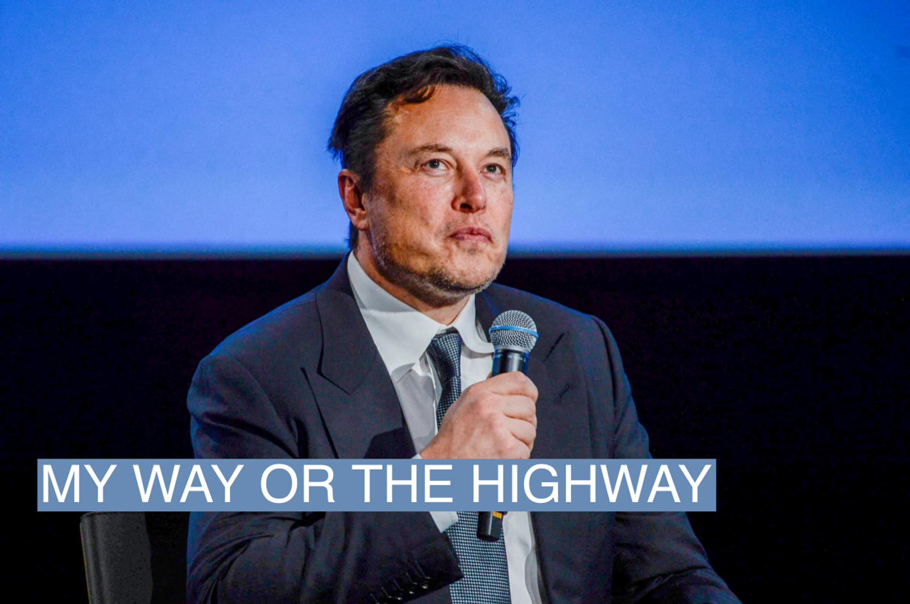

But in 2018, there was no reason to think that either the impulsive Musk or quirky, quiet Altman would become so central to the Silicon Valley narrative, even if they were already among its most prominent names. Musk, for one, had other headaches. Tesla was [struggling](https://www.businessinsider.com/why-tesla-is-struggling-to-make-model-3-2017-10) to keep up with production goals of its Model 3 sedan and the stock was [tanking](https://www.cnbc.com/2017/11/01/tesla-q3-2017-earnings.html), threatening the company’s future.  

但在2018年，没有理由认为冲动的马斯克或古怪、安静的奥特曼会成为硅谷叙事的核心，即使他们已经是硅谷最著名的人物之一。马斯克就有其他头痛的问题。特斯拉正在努力跟上其Model 3轿车的生产目标，其股票正在下跌，威胁到公司的未来。

Greg Brockman, an OpenAI co-founder who was chief technology officer at that time, also opposed Musk’s takeover as did others at OpenAI. A power struggle ensued, according to people familiar with the matter.  

当时担任首席技术官的OpenAI联合创始人格雷格-布洛克曼(Greg Brockman)也反对马斯克的收购，OpenAI的其他人也反对。据熟悉此事的人说，随后发生了一场权力斗争。

Altman, who also ran the powerful startup accelerator YCombinator, stepped in. According to tax documents, he added president to his title in 2018, in addition to being a director.  

同时掌管强大的创业公司加速器YCombinator的奥特曼介入了。根据税务文件，他在2018年除了担任董事外，还在自己的头衔上加上了总裁。

Musk then stepped down from OpenAI’s board of directors. Publicly, he and OpenAI said the reason for his departure was a conflict of interest. Tesla, which was developing its own artificial intelligence for autonomous driving, would be competing for talent with OpenAI.  

马斯克随后退出了OpenAI的董事会。他和OpenAI公开表示，他离职的原因是有利益冲突。特斯拉正在为自动驾驶开发自己的人工智能，它将与OpenAI争夺人才。

There was some truth to that rivalry. Tesla had already [poached](https://techcrunch.com/2017/06/20/tesla-hires-deep-learning-expert-andrej-karpathy-to-lead-autopilot-vision/) one of OpenAI’s best minds, Andrej Karpathy, who became the architect of Tesla’s autonomous driving program.  

这种竞争是有一定道理的。特斯拉已经挖走了OpenAI最优秀的人才之一Andrej Karpathy，他成为特斯拉自动驾驶项目的设计师。

But few people at OpenAI believed Musk was leaving for that reason, and a speech he gave at OpenAI’s offices at the time of his departure, which focused mainly on the potential conflict of interest, was not received well by most employees, who didn’t entirely buy the story.  

但在OpenAI，很少有人相信马斯克是出于这个原因离开的，他在离开时在OpenAI的办公室发表的演讲，主要集中在潜在的利益冲突上，但大多数员工对这个故事并不买账。

An OpenAI [announcement](https://openai.com/blog/openai-supporters) said Musk would continue to fund the organization, but Musk did not, according to people familiar with the matter. He had promised to donate roughly $1 billion over a period of years (he had already contributed $100 million), but his payments stopped after his departure, people familiar with the matter said. That left the nonprofit with no ability to pay the [astronomical](https://openai.com/research/ai-and-compute) fees associated with training AI models on supercomputers.  

据熟悉此事的人士称，OpenAI的一份公告称，马斯克将继续资助该组织，但马斯克没有这样做。熟悉此事的人说，他曾承诺在几年内捐赠大约10亿美元（他已经捐赠了1亿美元），但在他离开后，他的付款停止了。这使得该非营利组织没有能力支付与在超级计算机上训练人工智能模型有关的天文数字的费用。

Reuters/NTB/Carina Johansen 路透社/NTB/Carina Johansen

That fall, it became even more apparent to some people at OpenAI that the costs of becoming a cutting edge AI company were going to go up. Google Brain’s “[transformer](https://www.youtube.com/watch?v=9P_VAMyb-7k)” had blown open a new frontier, where AI could improve endlessly. But that meant feeding it endless data to train it — a costly endeavor.  

那年秋天，对OpenAI的一些人来说，成为一家尖端人工智能公司的成本将上升，这一点变得更加明显。谷歌大脑的 "变压器 "开辟了一个新的领域，人工智能可以无止境地改进。但这意味着要给它提供无尽的数据来训练它--这是一项昂贵的努力。

OpenAI made a big decision to pivot toward these transformer models.  

OpenAI做出了一个重大决定，转向这些变压器模型。

On March 11, 2019, OpenAI announced it was creating a [for profit](https://futurism.com/ai-elon-musk-openai-profit) entity so that it could raise enough money to pay for the compute power necessary to pursue the most ambitious AI models. “We want to increase our ability to raise capital while still serving our mission, and no pre-existing legal structure we know of strikes the right balance,” the company wrote at the time. OpenAI said it was capping profits for investors, with any excess going to the original nonprofit.  

2019年3月11日，OpenAI宣布它正在创建一个营利性实体，以便它能够筹集足够的资金来支付追求最雄心勃勃的人工智能模型所需的计算能力。"我们希望提高我们筹集资金的能力，同时仍然为我们的使命服务，而我们知道的任何现有的法律结构都无法达到正确的平衡，"该公司当时写道。OpenAI表示，它为投资者的利润设定了上限，任何多余的利润都将归于最初的非营利组织。

Altman also made an unusual decision for a tech boss: He would take no equity in the new for-profit entity, according to people familiar with the matter. Altman was already extremely wealthy, investing in several wildly successful tech startups, and didn’t need the money. The Information first [reported](https://www.theinformation.com/articles/microsoft-openai-inside-techs-hottest-romance?utm_source=ti_app&rc=nocdws) on the equity.  

阿特曼还做出了一个不寻常的决定，对于一个技术老板来说：据熟悉此事的人说，他不会在新的营利性实体中获得股权。阿特曼已经非常富有，他投资了几家非常成功的科技初创公司，他不需要这笔钱。信息报》首先报道了股权的情况。

He also believed the company needed to become a business to continue its work, but he told people the project was not designed to make money. Eschewing any ownership interest would help him stay aligned with the original mission.  But that decision actually turned off some potential investors in OpenAI, who worried that Altman didn’t see upside in the project.  

他还认为公司需要成为一个企业，以继续其工作，但他告诉人们这个项目不是为了赚钱。放弃任何所有权利益将帮助他与最初的使命保持一致。 但这一决定实际上拒绝了OpenAI的一些潜在投资者，他们担心奥特曼没有看到项目的上升空间。

Less than six months later, OpenAI took [$1 billion](https://techcrunch.com/2019/07/22/microsoft-invests-1-billion-in-openai-in-new-multiyear-partnership/) from Microsoft, which could provide not just funding but infrastructure know-how. Together they built a supercomputer to train massive models that eventually created ChatGPT and the image generator DALL-E. The latest language model, GPT-4, has 1 trillion parameters.  

不到六个月后，OpenAI从微软那里获得了10亿美元，微软不仅可以提供资金，还可以提供基础设施的专业知识。他们一起建立了一台超级计算机来训练大规模的模型，最终创造了ChatGPT和图像发生器DALL-E。最新的语言模型，GPT-4，有1万亿个参数。

When ChatGPT [launched](https://www.theguardian.com/technology/2022/dec/05/what-is-ai-chatbot-phenomenon-chatgpt-and-could-it-replace-humans) in November, OpenAI instantly became the hottest new tech startup, forcing Google to scramble to play catchup. Musk was furious, according to people familiar with the matter.  

当ChatGPT在11月推出时，OpenAI立即成为最热门的新科技创业公司，迫使谷歌争相追赶。据熟悉此事的人说，马斯克很生气。

In December, a month after the launch of ChatGPT, Musk [pulled](https://twitter.com/elonmusk/status/1599291104687374338?s=20) OpenAI’s access to the Twitter “fire hose” of data — a contract that was signed before Musk acquired Twitter.  

12月，在ChatGPT推出一个月后，马斯克撤销了OpenAI对Twitter "消防水管 "数据的访问权--这是马斯克收购Twitter之前签订的合同。

On Feb. 17, he [tweeted](https://twitter.com/elonmusk/status/1626516035863212034?s=20) “OpenAI was created as an open source (which is why I named it “Open” AI), non-profit company to serve as a counterweight to Google, but now it has become a closed source, maximum-profit company effectively controlled by Microsoft.”  

2月17日，他在推特上说："OpenAI是作为一个开源（这就是为什么我把它命名为 "开放 "人工智能）的非营利性公司创建的，以作为对谷歌的制衡，但现在它已经成为一个由微软有效控制的闭源、最高利润的公司。"

On March 15, he [tweeted](https://twitter.com/elonmusk/status/1636047019893481474?s=20), “I’m still confused as to how a non-profit to which I donated ~$100M somehow became a $30B market cap for-profit. If this is legal, why doesn’t everyone do it?”  

3月15日，他在推特上写道："我仍然很困惑，一个我捐赠了约1亿美元的非营利组织是如何成为一个市值300亿美元的营利组织的。如果这是合法的，为什么不是每个人都这样做？"

OpenAI declined to comment. Musk didn't respond to a request for comment but on Friday, he tweeted "I'm sure it will be fine" and [a meme of Elmo](https://twitter.com/elonmusk/status/1639200036578885632?s=20) with the words: "Me realizing AI, the most powerful tool that mankind has ever created, is now in the hands of a ruthless corporate monopoly."  

OpenAI拒绝发表评论。马斯克没有回应评论请求，但在周五，他在推特上写道："我相信它会好起来的"，并在推特上发了一张埃尔莫的备忘录，上面写道："我意识到人工智能是人类有史以来最强大的工具，现在却掌握在无情的企业垄断者手中"。

On Thursday, The Information reported that Shivon Zillis, an OpenAI board member, had stepped down. Zillis, who gave birth to Musk’s twins, did not respond to requests for comment.  

周四，The Information报道，OpenAI董事会成员Shivon Zillis已经卸任。Zillis为马斯克生了一对双胞胎，她没有回应评论请求。
