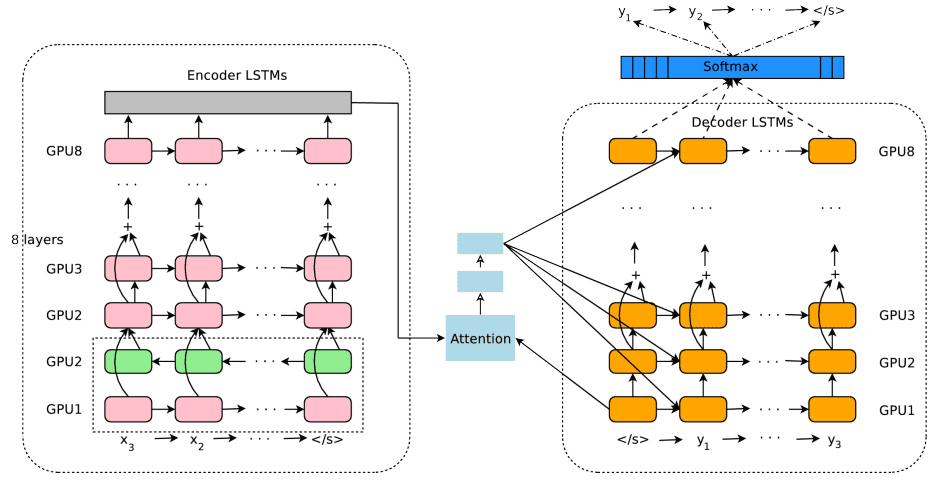
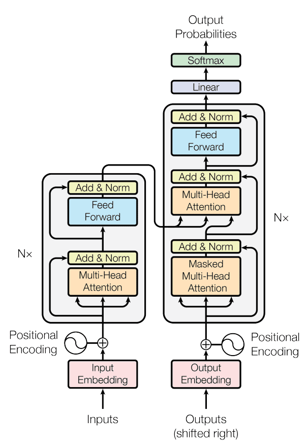
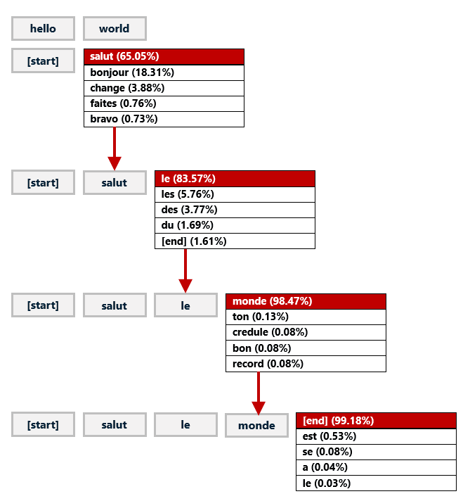
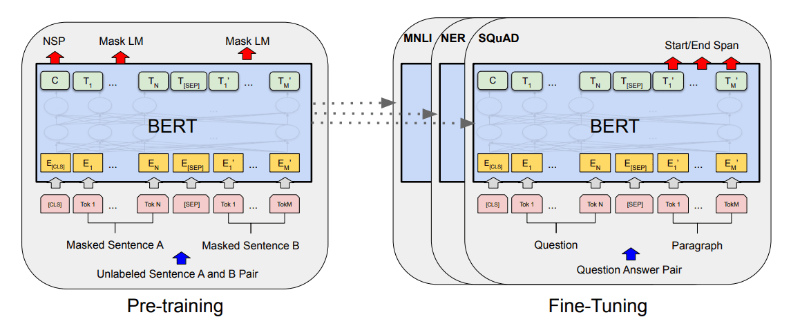
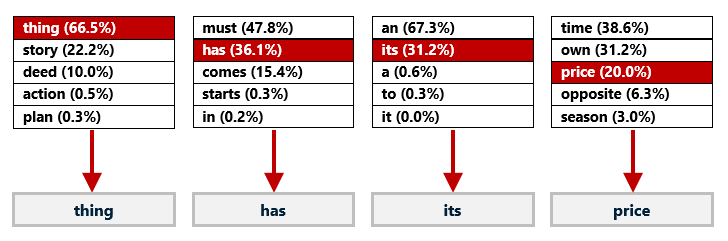

Unless you’ve lived in a cave for the last few months, you’ve heard of [ChatGPT](https://openai.com/blog/chatgpt). It’s a deep-learning model (neural network) created by [OpenAI](https://openai.com/) whose ability to generate human-like prose has made AI the topic of dinner-table conversations around the world. Here’s an example in which I asked it to explain molecular biology in the style of Dr. Seuss:  

除非你在过去几个月里住在山洞里，否则你已经听说过ChatGPT。这是一个由OpenAI创建的深度学习模型（神经网络），其生成类似人类的散文的能力使人工智能成为世界各地餐桌上的话题。这里有一个例子，我要求它用苏斯博士的风格解释分子生物学：

_Molecular biology is a funny thing,  

分子生物学是一个有趣的东西、_  

_It looks at the cells with a dingle-ding,  

它看着细胞，发出叮叮当当的声音、_  

_It studies the parts that make up the whole,  

它研究的是构成整体的各个部分、_  

_Like proteins and DNA with a roll and a toll.  

就像蛋白质和DNA一样，有一个滚动和收费。_  

_It looks at the way that genes are expressed,  

它着眼于基因的表达方式、_  

_How the proteins interact and how they’re blessed,  

蛋白质是如何相互作用的，它们是如何被祝福的、_  

_It looks at the structure and the way it’s made,  

它看的是结构和制作的方式、_  

_And how it’s all connected like a jigsaw parade.  

以及这一切是如何像拼图游行一样连接在一起的。_

You can try ChatGPT yourself by pointing your browser to [https://chat.openai.com/chat](https://chat.openai.com/chat) and typing a prompt such as “Write a short story that begins with it was a dark and stormy night.” You’ll have to create an account if you don’t already have one, but the account doesn’t have to be paid for. You get a certain number of free credits each month, and you can do a lot with those free credits.  

你可以自己试试ChatGPT，把你的浏览器指向 [https://chat.openai.com/chat](https://chat.openai.com/chat) ，然后输入一个提示，如 "写一个以It was a dark and stormy night开头的短篇故事"。如果你还没有账户，你必须创建一个账户，但账户不一定要付费。你每个月可以得到一定数量的免费点数，你可以用这些免费点数做很多事情。

ChatGPT isn’t limited to generating prose; it can produce code, too. Here’s how it responded when I prompted it to “Create a Python function that accepts an array of numbers as input, bubble sorts the numbers, and returns a sorted array:”  

ChatGPT并不局限于生成散文；它也可以生成代码。下面是当我提示它 "创建一个Python函数，接受一个数字数组作为输入，对数字进行冒泡排序，并返回一个排序后的数组 "时它的反应："

<table data-immersive-translate-effect="1"><tbody data-immersive-translate-effect="1"><tr data-immersive-translate-effect="1"><td data-immersive-translate-effect="1">
1

2

3

4

5

6

7

8

9

10

11
</td><td data-immersive-translate-effect="1">

<code data-immersive-translate-effect="1">def</code> <code data-immersive-translate-effect="1">bubble_sort(arr):</code>

<code data-immersive-translate-effect="1">&nbsp;&nbsp;&nbsp;&nbsp;</code><code data-immersive-translate-effect="1">n </code><code data-immersive-translate-effect="1">=</code> <code data-immersive-translate-effect="1">len</code><code data-immersive-translate-effect="1">(arr)</code>

<code data-immersive-translate-effect="1">&nbsp;&nbsp;&nbsp;&nbsp;</code><code data-immersive-translate-effect="1">for</code> <code data-immersive-translate-effect="1">i </code><code data-immersive-translate-effect="1">in</code> <code data-immersive-translate-effect="1">range</code><code data-immersive-translate-effect="1">(n):</code>

<code data-immersive-translate-effect="1">&nbsp;&nbsp;&nbsp;&nbsp;&nbsp;&nbsp;&nbsp;&nbsp;</code><code data-immersive-translate-effect="1">for</code> <code data-immersive-translate-effect="1">j </code><code data-immersive-translate-effect="1">in</code> <code data-immersive-translate-effect="1">range</code><code data-immersive-translate-effect="1">(</code><code data-immersive-translate-effect="1">0</code><code data-immersive-translate-effect="1">, n </code><code data-immersive-translate-effect="1">-</code> <code data-immersive-translate-effect="1">i </code><code data-immersive-translate-effect="1">-</code> <code data-immersive-translate-effect="1">1</code><code data-immersive-translate-effect="1">):</code>

<code data-immersive-translate-effect="1">&nbsp;&nbsp;&nbsp;&nbsp;&nbsp;&nbsp;&nbsp;&nbsp;&nbsp;&nbsp;&nbsp;&nbsp;</code><code data-immersive-translate-effect="1">if</code> <code data-immersive-translate-effect="1">arr[j] &gt; arr[j </code><code data-immersive-translate-effect="1">+</code> <code data-immersive-translate-effect="1">1</code><code data-immersive-translate-effect="1">]:</code>

<code data-immersive-translate-effect="1">&nbsp;&nbsp;&nbsp;&nbsp;&nbsp;&nbsp;&nbsp;&nbsp;&nbsp;&nbsp;&nbsp;&nbsp;&nbsp;&nbsp;&nbsp;&nbsp;</code><code data-immersive-translate-effect="1">arr[j], arr[j </code><code data-immersive-translate-effect="1">+</code> <code data-immersive-translate-effect="1">1</code><code data-immersive-translate-effect="1">] </code><code data-immersive-translate-effect="1">=</code> <code data-immersive-translate-effect="1">arr[j </code><code data-immersive-translate-effect="1">+</code> <code data-immersive-translate-effect="1">1</code><code data-immersive-translate-effect="1">], arr[j]</code>

<code data-immersive-translate-effect="1">&nbsp;&nbsp;&nbsp;&nbsp;</code><code data-immersive-translate-effect="1">return</code> <code data-immersive-translate-effect="1">arr</code>

</td></tr></tbody></table>

If Python isn’t your thing, ChatGPT understands dozens of other programming languages, too. You can even feed it code written in one language and ask it to convert it to another or ask it to comment on your raw source code files.  

如果Python不是你的菜，ChatGPT也能理解其他几十种编程语言。你甚至可以给它提供用一种语言编写的代码，并要求它将其转换成另一种语言，或者要求它对你的原始源代码文件进行评论。

So exactly what is ChatGPT? How was it built, and how does it work? The best way to explain ChatGPT is to start at the beginning. And the beginning, in this case, goes back to 2017.  

那么ChatGPT究竟是什么？它是如何建立的，又是如何运作的？解释ChatGPT的最好方法是从开始说起。在这种情况下，开始可以追溯到2017年。

## From LSTMs to Transformers 从LSTMs到变形金刚

ChatGPT falls under the branch of deep learning known as [natural language processing](https://en.wikipedia.org/wiki/Natural_language_processing), or NLP. NLP encompasses a variety of activities, including text classification (sentiment analysis and spam filtering, for example), keyword extraction, named-entity recognition, document summarization, and question answering – posing a question in plain English and searching a corpus of text for an answer. One of the more ambitious tasks to which NLP is applied is neural machine translation, or NMT, which translates text into other languages.  

ChatGPT属于深度学习的一个分支，被称为自然语言处理，或NLP。NLP包括各种活动，包括文本分类（例如情感分析和垃圾邮件过滤）、关键词提取、命名实体识别、文档总结和问题回答--用普通英语提出问题并搜索文本库以获得答案。应用NLP的一个更雄心勃勃的任务是神经机器翻译，即NMT，它将文本翻译成其他语言。

Until 2017, most NMT models, including the one that powered Google Translate, were [recurrent neural networks](https://en.wikipedia.org/wiki/Recurrent_neural_network). RNNs use [Long Short-Term Memory](https://en.wikipedia.org/wiki/Long_short-term_memory) (LSTM) cells to factor word order into their calculations. They understand, for example, that “Park the car down the street” and “The car park down the street” have two different meanings. Per the illustration below, which comes from a [paper published by Google engineers](https://arxiv.org/abs/1609.08144) in 2016, the Google Translate of that era used consecutive layers of LSTM cells to encode phrases to be translated, and another stack of LSTM cells to decode them into the target language. An _attention module_ positioned between the encoder and decoder helped zero in on a sentence’s most important words.  

直到2017年，大多数NMT模型，包括为谷歌翻译提供动力的模型，都是递归神经网络 。递归神经网络使用长短期记忆（LSTM）单元，将词序纳入其计算。例如，它们理解 "把车停在街边 "和 "把车停在街边 "有两种不同的含义。根据下面的插图，它来自谷歌工程师在2016年发表的一篇论文，那个时代的谷歌翻译使用连续的LSTM细胞层来编码要翻译的短语，而另一堆LSTM细胞将它们解码成目标语言。一个位于编码器和解码器之间的注意力模块帮助锁定一个句子中最重要的词。

_Google Translate circa 2016 谷歌翻译大约在2016年_

In 2017, a landmark paper titled “[Attention Is All You Need](https://arxiv.org/abs/1706.03762)” changed the way data scientists approach NMT and other NLP tasks. That paper proposed a better way to process language based on _transformer models_ that eschew LSTMs and use [neural attention](https://en.wikipedia.org/wiki/Attention_(machine_learning)) mechanisms to model the context in which words are used. Transformer models are superior to LSTM models in several ways, not the least of which is that they can infer meaning from text samples of any size (by contrast, as text length grows, an RNN’s power to connect related words diminishes) and they can be trained in parallel on multiple GPUs. Today, transformer models have almost entirely replaced LSTM-based models, particularly in the field of NLP. They also play an ever-increasing role in computer vision, particularly in models that generate images from textual descriptions.  

2017年，一篇题为" Attention Is All You Need "的里程碑式的论文改变了数据科学家处理NMT和其他NLP任务的方式。那篇论文提出了一种更好的方式来处理语言，它基于变压器模型，摒弃了LSTM，使用神经注意机制来模拟单词的使用环境。变换器模型在几个方面优于LSTM模型，其中最重要的是它们可以从任何大小的文本样本中推断出意义（相比之下，随着文本长度的增加，RNN连接相关词语的能力会减弱），而且它们可以在多个GPU上进行并行训练。今天，转化器模型几乎已经完全取代了基于LSTM的模型，特别是在NLP领域。它们在计算机视觉中也发挥着越来越大的作用，特别是在从文本描述生成图像的模型中。

The diagram below comes from the aforementioned paper and documents a transformer encoder-decoder architecture that supports neural machine translation, among other tasks. (It also depicts the core architecture of ChatGPT.) The model has two inputs. On the left is a transformer that encodes text input to it into arrays of floating-point numbers that capture meaning. On the right is a transformer that takes the output from the encoder and a second text input and decodes them into a set of probabilities that predicts the next word in the second input. When translating English to French, the first text input is the English phrase to be translated. The second text input is the French translation generated so far. The model operates iteratively, first generating the first word in the translation, then the second, and so on. Much of the magic lies in the multi-head attention layers, which use the _self-attention_ mechanism described in the paper to model relationships between words independent of the input length.  

下图来自上述论文，记录了一个支持神经机器翻译和其他任务的变换器编码器-解码器架构。(它也描述了ChatGPT的核心架构。)该模型有两个输入。左边是一个转化器，它将输入的文本编码为捕捉意义的浮点数数组。右边是一个转化器，将编码器的输出和第二个文本输入解码成一组概率，预测第二个输入中的下一个词。当把英语翻译成法语时，第一个文本输入是要翻译的英语短语。第二个文本输入是到目前为止产生的法语翻译。该模型迭代运行，首先生成翻译中的第一个词，然后是第二个词，以此类推。大部分的神奇之处在于多头关注层，它使用论文中描述的自我关注机制来模拟独立于输入长度的单词之间的关系。

_Transformer encoder-decoder architecture  

变换器编码器-解码器结构_

Chapter 13 of my book “[Applied Machine Learning and AI for Engineers](https://www.amazon.com/Applied-Machine-Learning-Engineers-Algorithmically/dp/1492098051/)” features the [source code](https://github.com/jeffprosise/Applied-Machine-Learning/blob/main/Chapter%2013/Neural%20Machine%20Translation%20(Transformer).ipynb) for a working transformer-based NMT model. It does a credible job of translating short sentences written in English to French given that it was trained on just 50,000 phrase pairs: short English sentences and their French equivalents Here’s a sample of the training data. Note the special tokens denoting the start and end of the French phrases:  

我的书《工程师的应用机器学习和人工智能》的第13章介绍了一个基于转化器的NMT模型的源代码。它在将英语短句翻译成法语方面做得很好，因为它只在5万个短语对上进行了训练：英语短句和它们的法语对等物。注意表示法语短语开始和结束的特殊标记：

<table data-immersive-translate-effect="1"><tbody data-immersive-translate-effect="1"><tr data-immersive-translate-effect="1"><td data-immersive-translate-effect="1">He heard the noise&nbsp;他听到了噪音</td><td data-immersive-translate-effect="1">[start] Il entendit le bruit [end] [开始] Il entendit le bruit [结束]</td></tr><tr data-immersive-translate-effect="1"><td data-immersive-translate-effect="1">He heard the sound&nbsp;他听到了声音</td><td data-immersive-translate-effect="1">[start] Il a entendu le son [end] [开始] Il a entendu le son [结束]</td></tr><tr data-immersive-translate-effect="1"><td data-immersive-translate-effect="1">He held his breath&nbsp;他屏住呼吸</td><td data-immersive-translate-effect="1">[start] Il a retenu sa respiration [end] [开始]Il a retenu sa respiration [结束] 。</td></tr><tr data-immersive-translate-effect="1"><td data-immersive-translate-effect="1">He held his breath&nbsp;他屏住呼吸</td><td data-immersive-translate-effect="1">[start] Il a retenu son souffle [end] [开始] Il a retenu son souffle [结束]</td></tr><tr data-immersive-translate-effect="1"><td data-immersive-translate-effect="1">He is a bank clerk&nbsp;他是一名银行职员</td><td data-immersive-translate-effect="1">[start] Il est employé de banque [end] [开始]他在银行工作[结束]</td></tr><tr data-immersive-translate-effect="1"><td data-immersive-translate-effect="1">He is a bus driver&nbsp;他是一名巴士司机</td><td data-immersive-translate-effect="1">[start] Il est conducteur de bus [end] [开始]他是公共汽车的指挥者[结束]</td></tr><tr data-immersive-translate-effect="1"><td data-immersive-translate-effect="1">I think you’re cute&nbsp;我觉得你很可爱</td><td data-immersive-translate-effect="1">[start] Je pense que tu es mignonne [end] [开始]我认为你是个好人 [结束]</td></tr><tr data-immersive-translate-effect="1"><td data-immersive-translate-effect="1">I think you’re cute&nbsp;我觉得你很可爱</td><td data-immersive-translate-effect="1">[start] Je pense que vous êtes adorable [end] [开始]我觉得你很可爱[结束]。</td></tr><tr data-immersive-translate-effect="1"><td data-immersive-translate-effect="1">Are you a good golfer&nbsp;你是一个好的高尔夫球手吗？</td><td data-immersive-translate-effect="1">[start] Êtes-vous bon golfeur [end] [开始] Êtes-vous bon golfeur [结束]</td></tr><tr data-immersive-translate-effect="1"><td data-immersive-translate-effect="1">Are you a good golfer&nbsp;你是一个好的高尔夫球手吗？</td><td data-immersive-translate-effect="1">[start] Es-tu une bonne golfeuse [end] [开始] Es-tu une bonne golfeuse [结束] 。</td></tr></tbody></table>

Like the encoder-decoder in the diagram, my model has two inputs. One accepts an English phrase, the other a partially completed French phrase. The process of translating “hello world” into French is pictured below. You first input “hello world” to the English input and “\[start\]” to the French input. The model predicts the next word in the French translation by assigning a probability to every word in its French vocabulary – in this example, about 12,000 words – based on the corpus of text that it was trained with and picking the word with the highest probability. Then you call the model again, this time passing “hello world” to the English input and “\[start\] salut” to the French input. You repeat this process until the next predicted word is “\[end\]” denoting the end of the translation.  

像图中的编码器-解码器一样，我的模型有两个输入。一个接受一个英语短语，另一个接受一个部分完成的法语短语。将 "hello world "翻译成法语的过程如下图所示。你首先在英语输入中输入 "hello world"，在法语输入中输入"\[start\]"。该模型预测法语翻译中的下一个词，方法是根据它所训练的文本语料库为其法语词汇中的每个词分配一个概率--在这个例子中，大约有12000个词--并挑选出概率最高的词。然后你再次调用该模型，这次将 "hello world "传递给英语输入，将"\[start\] salut "传递给法语输入。你重复这个过程，直到下一个预测的词是"\[结束\]"，表示翻译的结束。

_How a neural network translates English to French  

一个神经网络如何将英语翻译成法语_

The model can translate phrases it has never seen because it learned the mechanics of translating English to French from the 50,000 training samples. It’s not perfect, but the more data it’s trained with, the more capable it becomes. Google Translate was trained on more than [25 billion phrase pairs](https://syncedreview.com/2019/10/31/google-introduces-huge-universal-language-translation-model-103-languages-trained-on-over-25-billion-examples/) in over 100 languages, which explains why it rivals a human’s ability to translate text.  

该模型可以翻译它从未见过的短语，因为它从50,000个训练样本中学习了将英语翻译成法语的机制。它并不完美，但它训练的数据越多，它的能力就越强。谷歌翻译在超过100种语言的250亿个短语对上进行了训练，这解释了为什么它能与人类的文本翻译能力相媲美。

## Bidirectional Encoder Representations from Transformers (BERT)  

来自变压器的双向编码器表示法(BERT)

Building models like Google Translate is expensive. First, you have to collect (or manufacture) billions of lines of training data. Then you need massive amounts of compute power to do the training. Models like these often require weeks to train on hundreds of graphics processing units (GPUs) or tensor processing units (TPUs) costing $10,000 or more each. But the introduction of transformers in 2017 laid the groundwork for another landmark innovation in the NLP space: _Bidirectional Encoder Representations from Transformers_, or BERT for short. Introduced by Google researchers in a 2018 paper titled “[BERT: Pre-training of Deep Bidirectional Transformers for Language Understanding](https://arxiv.org/abs/1810.04805)”, BERT advanced the state of the art by providing pre-trained transformers that can be fine-tuned for a variety of NLP tasks.  

建立像谷歌翻译这样的模型是昂贵的。首先，你必须收集（或制造）数十亿行的训练数据。然后你需要大量的计算能力来进行训练。像这样的模型往往需要数周时间在数百个图形处理单元（GPU）或张量处理单元（TPU）上进行训练，每个单元的成本为1万美元或更高。但2017年变压器的引入为NLP领域的另一个里程碑式的创新奠定了基础：来自变压器的双向编码器表示法，简称BERT。谷歌研究人员在2018年一篇题为 "BERT：用于语言理解的深度双向变换器的预训练 "的论文中介绍，BERT通过提供预训练的变换器，可以为各种NLP任务进行微调，推动了技术水平的提高。

Google instilled BERT with language understanding by training it with more than 2.5 billion words from Wikipedia articles and 800 million words from Google Books. Training required four days on 64 TPUs. BERT isn’t generally useful by itself, but it can be fine-tuned to perform specific tasks such as sentiment analysis or question answering. Fine-tuning is accomplished by further training the pre-trained model with task-specific samples at a reduced learning rate, and it is _much_ less expensive and time-consuming than training BERT from scratch. It’s as if you’re running a 26-mile marathon and BERT spots you the first 25 miles.  

谷歌通过对维基百科文章中的25亿个单词和谷歌图书中的8亿个单词进行训练，向BERT灌输语言理解能力。训练需要在64个TPU上进行四天。BERT本身一般没有用处，但它可以被微调以执行特定的任务，如情感分析或问题回答。微调是通过以较低的学习速度用特定任务的样本进一步训练预训练的模型来完成的，它比从头开始训练BERT要便宜得多，也费时得多。这就好像你在跑26英里的马拉松，而BERT在前25英里就发现了你。

_BERT as a base model for fine-tuning  

BERT作为微调的基础模型_

Aside from the fact that it was trained with a huge volume of text, the key to BERT’s ability to understand human language is an innovation known as [Masked Language Modeling](https://analyticsindiamag.com/a-complete-tutorial-on-masked-language-modelling-using-bert/). MLM turns a large corpus of text into a training ground for learning the structure of a language. When BERT models are pretrained, a specified percentage of the words in each batch of text – usually 15% – are randomly removed or “masked” so the model can learn to predict the missing words from the words around them. Unidirectional models look at the text to the left or the text to the right and attempt to predict what the missing word should be. MLM uses text on the left _and_ right to inform its decisions. That’s why BERT is a “bidirectional” transformer. A model has a better chance of predicting what word should fill in the blank in the phrase “Every good \_\_\_\_ does fine” than it has at predicting the next word in the phrase “Every good \_\_\_\_.” The answer could be _boy_, as in “Every good boy does fine,” or it could be _turn_, as in “Every good turn deserves another.” Or it could be something else entirely.  

除了用大量的文本进行训练外，BERT理解人类语言的能力的关键是一种被称为 "掩码语言建模 "的创新。MLM将大量的文本语料库变成了学习语言结构的训练场。当BERT模型被预训练时，每批文本中指定比例的词--通常是15%--被随机删除或 "屏蔽"，这样模型就能学会从周围的词中预测缺失的词。单向模型看左边的文本或右边的文本，并试图预测缺失的词应该是什么。MLM使用左侧和右侧的文本来告知其决策。这就是为什么BERT是一个 "双向 "的转化器。一个模型在预测 "每个好的\_\_\_\_，做得很好 "这句话的空白处应该填什么词的机会比预测 "每个好的\_\_\_\_"这句话的下一个词的机会要大。答案可能是男孩，如 "每个好男孩都做得很好"，也可能是转身，如 "每个好转身都值得再来一次"。也可能是其他完全不同的东西。

Next-word prediction is the super power that drives text generators such as ChatGPT. Thanks to MLM, deep-learning models can learn to predict the next word in a sentence without labeled datasets. That’s important, because creating labeled data is time-consuming – especially when it involves billions of samples.  

下一个词的预测是推动ChatGPT等文本生成器的超级力量。多亏了MLM，深度学习模型可以在没有标记数据集的情况下学习预测句子中的下一个词。这很重要，因为创建标记的数据很耗时--尤其是当它涉及到数十亿的样本时。

BERT has been called the “Swiss Army knife” of NLP. Google uses it to [improve search results](https://blog.google/products/search/search-language-understanding-bert/) and predict text as you type into a Gmail or Google Doc. Dozens of variations have been published, including DistilBERT, which retains 97% of the accuracy of the original model while weighing in 40% smaller and running 60% faster. Also available are variations of BERT already fine-tuned for specific tasks such as question answering. Such models can be further refined using domain-specific datasets, or they can be used as is.  

BERT被称为NLP的 "瑞士军刀"。谷歌用它来改善搜索结果，并在你输入Gmail或谷歌文档时预测文本。已经发表了几十个变体，包括DistilBERT，它保留了原始模型97%的准确性，同时重量减少40%，运行速度提高60%。还有一些BERT的变体已经针对特定的任务（如问题回答）进行了微调。这些模型可以使用特定领域的数据集进一步完善，或者可以按原样使用。

If you’re a programmer and you’re curious to know what BERT fine-tuning looks like, my book offers an [example](https://github.com/jeffprosise/Applied-Machine-Learning/blob/main/Chapter%2013/Sentiment%20Analysis%20(BERT).ipynb). But 2018 was a long time ago. ChatGPT doesn’t rely on fine-tuned versions of BERT. The next section explains why.  

如果你是一个程序员，你很想知道BERT微调是什么样子的，我的书提供了一个例子.但2018年是很久以前的事了。ChatGPT并不依赖BERT的微调版本。下一节将解释原因。

## From BERT to ChatGPT 从BERT到ChatGPT

BERT was the world’s first _Large Language Model_ (LLM). It featured around 345 million parameters, which is a measure of the size and complexity of a neural network. (Think of an equation that has 345 million terms. That’s a big equation!)  OpenAI followed Google’s lead and produced BERT-like LLMs of their own in 2018 and 2019: first GPT-1 with 117 million parameters, and then GPT-2 with 1.5 billion parameters. In 2020, OpenAI rocked the NLP world by releasing GPT-3 featuring a whopping _175 billion_ parameters, earning it the title of the largest LLM, indeed the largest neural network, ever built. March 2023 saw the release of GPT-4, which builds on GPT-3. At the time of this writing, OpenAI hasn’t revealed GPT-4’s parameter count, but it is rumored to be in the neighborhood of 1 trillion.  

BERT是世界上第一个大型语言模型（LLM）。它有大约3.45亿个参数，这是衡量一个神经网络的大小和复杂性的标准。(想想一个有3.45亿个术语的方程，这是一个大方程！）OpenAI跟随谷歌的步伐，在2018年和2019年生产了自己的类似BERT的LLM：首先是GPT-1，有1.17亿个参数，然后是GPT-2，有15亿个参数。2020年，OpenAI发布了具有高达1750亿个参数的GPT-3，震撼了NLP世界，为它赢得了有史以来最大的LLM的称号，实际上是最大的神经网络。2023年3月，GPT-4发布，它建立在GPT-3的基础上。在写这篇文章的时候，OpenAI还没有透露GPT-4的参数数，但据传是在1万亿左右。

GPT stands for Generative Pretrained Transformer – _generative_ because these models excel at generating text. Not only can they translate “hello world” to French, but they can also translate “Write a short story about three young people attending a wizarding school” into fully formed prose. GPT-3 was trained with roughly half a trillion words from [Common Crawl](https://commoncrawl.org/),  [WebText](https://www.webtext.com/), Wikipedia, and a corpus of books. (OpenAI hasn’t revealed how long it took to train GPT-3, but they have said that they used a distributed training process with 1,728 NVIDIA V100 GPUs hosted in Microsoft Azure.) It was also trained to respond to natural-language prompts such as “Describe molecular biology in the style of Dr. Seuss” or “Translate hello world into French.” Unlike BERT, GPT models can perform certain NLP tasks such as text translation and question-answering _without fine-tuning_, a feat known as _zero-shot_ or _few-shot learning_. OpenAI documented this in a seminal 2020 paper titled “[Language Models are Few-Shot Learners](https://arxiv.org/abs/2005.14165).”  

GPT是Generative Pretrained Transformer的缩写--生成性是因为这些模型擅长生成文本。它们不仅能将 "hello world "翻译成法语，而且还能将 "写一个关于三个年轻人上魔法学校的短篇故事 "翻译成完全成型的散文。GPT-3用来自Common Crawl、WebText、Wikipedia和一个书本语料库的大约5万亿个单词进行了训练。(OpenAI没有透露训练GPT-3花了多长时间，但他们说他们使用了分布式训练过程，在微软Azure中托管了1,728个NVIDIA V100 GPU。）它还被训练成能够响应自然语言提示，如 "用苏斯博士的风格描述分子生物学 "或 "把hello world翻译成法语"。与BERT不同，GPT模型可以执行某些NLP任务，如文本翻译和回答问题，而不需要进行微调，这一壮举被称为零点学习或少数点学习。OpenAI在2020年的一篇题为 "语言模型是少量学习者 "的开创性论文中记录了这一点。

ChatGPT is a fine-tuned version of GPT-3.5, which itself is a fined-tuned version of GPT-3. At its heart, ChatGPT is a transformer encoder-decoder that responds to prompts by iteratively predicting the first word in the response, then the second word, and so on – much like a transformer that translates English to French. The diagram below shows how ChatGPT might respond to the prompt “Complete the sentence _every good_.” Like a text translator, it generates each word in the response one word at a time, and it determines what the next word should be based on probabilities derived from the vast corpus of text it was trained on and the text it has generated so far. In this example, it picks the highest-ranking word every time, yielding the response “every good thing must come to an end.”  

ChatGPT是GPT-3.5的一个微调版本，而GPT-3本身就是GPT-3的微调版本。在其核心部分，ChatGPT是一个转换编码器-解码器，通过迭代预测响应中的第一个词，然后是第二个词，以此类推--很像一个将英语翻译成法语的转换器。下图显示了ChatGPT如何响应 "完成每个好的句子 "的提示。像文本翻译器一样，它一次生成响应中的每个词，并根据从其训练的大量文本语料库和迄今为止生成的文本中得出的概率，确定下一个词应该是什么。在这个例子中，它每次都选取排名最高的词，从而产生了 "每件好事都会有尽头 "的回应。

_How ChatGPT completes a sentence with temperature=0.0  

ChatGPT如何完成一个温度=0.0的句子_

Picking the top-ranking word in each iteration works fine for short responses, but it can make longer responses feel stiff and unimaginative. That’s why ChatGPT offers various knobs and dials that you can adjust to alter how it selects words. One of these is the _temperature_ setting. If _temperature_\=0, ChatGPT selects the word with the highest probability in each iteration. But if you raise _temperature_ to, say, 0.7, ChatGPT sometimes picks words lower in the list, yielding text that often feels more natural and creative. This is illustrated below, where a non-zero temperature setting yields “every good thing has its price” from the same input prompt.  

在每次迭代中挑选排名最靠前的词，这对简短的回答很有效，但它会使较长的回答感到生硬和缺乏想象力。这就是为什么ChatGPT提供了各种旋钮和转盘，你可以调整以改变它选择单词的方式。其中之一是温度设置。如果温度=0，ChatGPT会在每次迭代中选择概率最高的词。但是如果你把温度提高到，比如说0.7，ChatGPT有时会选择列表中较低的词，产生的文本往往感觉更自然和有创意。下图显示了这一点，在同一输入提示中，非零的温度设置产生了 "每个好东西都有它的价格"。

_How ChatGPT completes a sentence with temperature=0.7  

ChatGPT如何完成一个温度=0.7的句子_

ChatGPT is a glorified word predictor. It isn’t sentient. It doesn’t know what it’s saying, and yes, you can coax it into admitting that it wants to take over the world or saying hurtful things (although it was specially conditioned during training to try to suppress such output). It’s simply stringing words together using an expansive statistical model built from billions of sentences.  

ChatGPT是一个光荣的单词预测器。它不是有知觉的。它不知道自己在说什么，是的，你可以哄骗它承认它想接管世界或说一些伤人的话（尽管它在训练中被特别调教，试图抑制这种输出）。它只是用一个从数十亿句子中建立起来的广泛的统计模型将单词串起来。

Speaking of conditioning: ChatGPT was trained in three phrases. First, the base model, GPT-3.5, was trained with more than 10,000 sample prompts and responses. Next, it was asked to generate several responses to each of tens of thousands of prompts, and a team of contractors graded each response for accuracy, appropriateness, and other criteria, assigning lower grades, for example, to responses that were inaccurate, unhelpful, or hurtful. Finally, the model was tweaked to favor higher-ranked responses. Out of this came ChatGPT as we know it today.  

说到调理：ChatGPT的训练分为三个部分。首先，基础模型GPT-3.5用超过10,000个样本提示和回应进行训练。接下来，它被要求对数以万计的提示产生几个反应，一个承包商团队对每个反应的准确性、适当性和其他标准进行评分，例如，对不准确、无益或伤害性的反应给予较低的评分。最后，对模型进行了调整，以有利于排名较高的回复。由此产生了我们今天所知的ChatGPT。

One of the more remarkable aspects of ChatGPT is that when you ask it a question, it doesn’t crawl the Internet to find an answer. The entire body of knowledge present on the Internet in September 2021 (and then some) was baked into those 175 billion parameters during training. It’s akin to you answering a question off the top of your head rather than reaching for your phone and Googling for an answer. When Microsoft incorporated GPT-4 into Bing, they added a separate layer providing Internet access. OpenAI did the same with [WebGPT](https://openai.com/research/webgpt), a GPT-3 variant. ChatGPT neither needs nor has that capability.  

ChatGPT的一个更显著的方面是，当你问它一个问题时，它不会在互联网上爬行来寻找答案。2021年9月互联网上存在的全部知识体系（还有一些）在培训期间就被纳入了这1750亿个参数。这就好比你在回答一个问题时是凭空想象，而不是伸手去拿你的手机在谷歌上搜索答案。当微软将GPT-4纳入Bing时，他们增加了一个单独的层，提供互联网访问。OpenAI也用WebGPT做了同样的事情，这是一个GPT-3的变体。ChatGPT既不需要也不具备这种能力。

ChatGPT was also trained on billions of lines of code from the world’s most popular source-code repository, GitHub, which is why it’s able to generate code as well as prose. This begs the question: Is it fair – and legal – to train a deep-learning model that “learns” from code written by others? Especially when much of that code is governed by open-source licenses that require attribution when used? That’s the billion-dollar question, and it’s the subject of a [class-action lawsuit](https://www.theverge.com/2023/1/28/23575919/microsoft-openai-github-dismiss-copilot-ai-copyright-lawsuit) filed against Microsoft, GitHub, and OpenAI last year. It’s too early to tell how it will turn out, but it’s not too dramatic to say that the future of AI (and of writers, programmers, and artists as well) could hang in the balance. AI, after all, is nothing without vast amounts of data to train on.  

ChatGPT还对世界上最受欢迎的源代码库GitHub的数十亿行代码进行了培训，这就是为什么它能够生成代码和散文。这就提出了一个问题：训练一个从他人编写的代码中 "学习 "的深度学习模型是否公平--以及是否合法？特别是当这些代码大多受开源许可的约束，在使用时需要注明出处？这是一个价值数十亿美元的问题，也是去年对微软、GitHub和OpenAI提起集体诉讼的主题。现在判断结果还为时过早，但说人工智能的未来（以及作家、程序员和艺术家的未来）可能悬而未决也不为过。毕竟，如果没有大量的数据进行训练，人工智能就什么都不是。

## The ChatGPT API ChatGPT API

On March 1st, 2023, OpenAI made ChatGPT available through a REST API, making it possible for programmers to infuse ChatGPT’s intelligence into their own code. The following example, written in Python, uses the ChatGPT API to answer the question “In which academic paper was the deep learning transformer introduced, and where can I find it?”  

2023年3月1日 st ，OpenAI通过REST API提供了ChatGPT，使程序员有可能将ChatGPT的智能注入自己的代码中。下面的例子是用Python编写的，使用ChatGPT API来回答 "深度学习转化器是在哪篇学术论文中介绍的，我在哪里可以找到它？"

<table data-immersive-translate-effect="1"><tbody data-immersive-translate-effect="1"><tr data-immersive-translate-effect="1"><td data-immersive-translate-effect="1">
1

2

3

4

5

6

7

8

9

10

11

12
</td><td data-immersive-translate-effect="1">

<code data-immersive-translate-effect="1">messages </code><code data-immersive-translate-effect="1">=</code> <code data-immersive-translate-effect="1">[{</code>

<code data-immersive-translate-effect="1">&nbsp;&nbsp;&nbsp;&nbsp;</code><code data-immersive-translate-effect="1">'role'</code><code data-immersive-translate-effect="1">: </code><code data-immersive-translate-effect="1">'user'</code><code data-immersive-translate-effect="1">,</code>

<code data-immersive-translate-effect="1">&nbsp;&nbsp;&nbsp;&nbsp;</code><code data-immersive-translate-effect="1">'content'</code><code data-immersive-translate-effect="1">: </code><code data-immersive-translate-effect="1">'In which academic paper was the deep learning transformer '</code> <code data-immersive-translate-effect="1">\</code>

<code data-immersive-translate-effect="1">&nbsp;&nbsp;&nbsp;&nbsp;&nbsp;&nbsp;&nbsp;&nbsp;&nbsp;&nbsp;&nbsp;&nbsp;&nbsp;&nbsp;&nbsp;</code><code data-immersive-translate-effect="1">'introduced, and where can I find it?'</code>

<code data-immersive-translate-effect="1">}]</code>

<code data-immersive-translate-effect="1">response </code><code data-immersive-translate-effect="1">=</code> <code data-immersive-translate-effect="1">openai.ChatCompletion.create(</code>

<code data-immersive-translate-effect="1">&nbsp;&nbsp;&nbsp;&nbsp;</code><code data-immersive-translate-effect="1">model</code><code data-immersive-translate-effect="1">=</code><code data-immersive-translate-effect="1">'gpt-3.5-turbo'</code><code data-immersive-translate-effect="1">,</code>

<code data-immersive-translate-effect="1">&nbsp;&nbsp;&nbsp;&nbsp;</code><code data-immersive-translate-effect="1">messages</code><code data-immersive-translate-effect="1">=</code><code data-immersive-translate-effect="1">messages</code>

<code data-immersive-translate-effect="1">)</code>

<code data-immersive-translate-effect="1">print</code><code data-immersive-translate-effect="1">(response.choices[</code><code data-immersive-translate-effect="1">0</code><code data-immersive-translate-effect="1">].message.content)</code>

</td></tr></tbody></table>

ChatGPT responded as follows: ChatGPT答复如下：

_The deep learning transformer was introduced in the academic paper titled “Attention Is All You Need” published in 2017 by Ashish Vaswani, Noam Shazeer, Niki Parmar, Jakob Uszkoreit, Llion Jones, Aidan N. Gomez, Łukasz Kaiser, and Illia Polosukhin. The paper is available on the arXiv preprint server: https://arxiv.org/abs/1706.03762.  

深度学习转化器是在Ashish Vaswani、Noam Shazeer、Niki Parmar、Jakob Uszkoreit、Llion Jones、Aidan N. Gomez、Łukasz Kaiser和Illia Polosukhin于2017年发表的题为 "Attention Is All You Need "的学术论文中提出的。该论文可在arXiv预印本服务器上获得：https://arxiv.org/abs/1706.03762。_

I’ll introduce the ChatGPT API and some of the amazing things you can do with it in subsequent posts. For now, I’ll close with a description of ChatGPT written by ChatGPT:  

我将在随后的文章中介绍ChatGPT API和一些你能用它做的神奇事情。现在，我将以ChatGPT编写的ChatGPT描述作为结束：

_ChatGPT is a language model developed by OpenAI that uses the GPT-3.5 architecture to generate human-like responses to a wide range of topics. Trained on vast amounts of text from the internet, books, and other sources, ChatGPT can understand and generate natural language, engaging in conversations with people to provide informative and helpful responses. Its ability to understand context, infer meaning, and generate coherent and relevant responses makes it a powerful tool for a variety of applications, from language translation and customer service to personal assistants and creative writing. Continuously learning and improving through updates and refinements to its algorithms and training data, ChatGPT is an advanced technology that is changing the way we interact with computers and artificial intelligence.  

ChatGPT是一个由OpenAI开发的语言模型，它使用GPT-3.5架构来生成类似于人类对广泛主题的回应。通过对互联网、书籍和其他来源的大量文本进行训练，ChatGPT可以理解并生成自然语言，与人们进行对话，提供信息和帮助性的回应。它理解上下文、推断意义并产生连贯和相关的反应的能力使它成为各种应用的强大工具，从语言翻译和客户服务到个人助理和创意写作。通过对其算法和训练数据的更新和完善，ChatGPT不断学习和改进，是一项先进的技术，正在改变我们与计算机和人工智能的互动方式。_

I couldn’t have said it better myself.  

我自己说得再好不过了。
