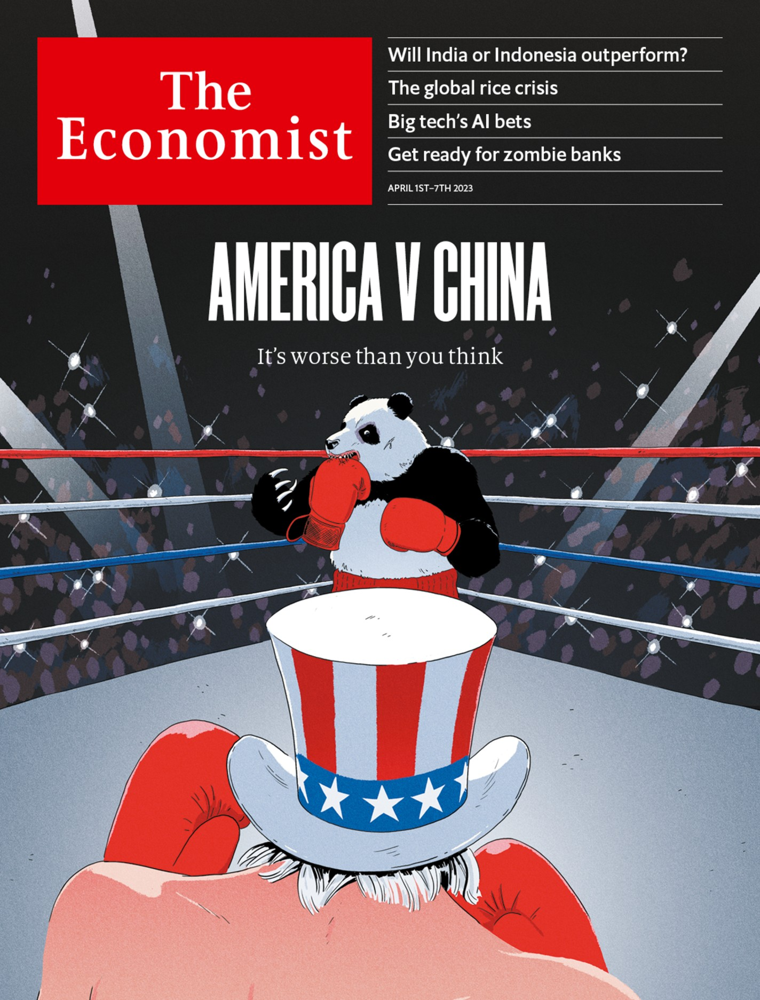

## Both countries are pioneering new ways to get rich in a troubled world  

两个国家正在开创在动荡的世界中获取财富的新途径。

If you are looking for growth opportunities among the world’s 20 biggest economies, two stand out: India and Indonesia. The Asian giants, with a combined population of 1.7bn, are forecast by the imf to be the two fastest-growing top-20 economies in 2023, and over the next five years. Both are pioneering strategies for getting richer in an era of de-globalisation, fraught geopolitics, automation and energy shifts, even as they seek a political formula that wins elections and avoids social unrest. Whether they succeed matters not just for their people and the investors betting many billions of dollars on them. It will also set an example for scores of other countries searching for new and reliable ways to develop in the 2020s and beyond.  

如果您正在寻找世界前20大经济体中的增长机会，印度和印度尼西亚是两个突出的选择。这两个亚洲巨头的总人口达17亿，根据国际货币基金组织的预测，它们将成为2023年和未来五年内增长最快的前20大经济体。尽管它们正在寻求一种在去全球化、地缘政治紧张、自动化和能源转变时代中变得更富有的策略，但它们仍在寻求一种赢得选举并避免社会动荡的政治公式。无论它们是否成功，都不仅关乎它们的人民和投注数十亿美元的投资者。它还将为其他寻求在2020年代及以后开发新的可靠方式的国家树立榜样。

Listen to this story. 听这个故事。

Enjoy more audio and podcasts on [iOS](https://economist-app.onelink.me/d2eC/bed1b25) or [Android](https://economist-app.onelink.me/d2eC/7f3c199).  

在iOS或Android上享受更多的音频和播客。

Your browser does not support the <audio> element.  

您的浏览器不支持<audio>元素。

Listen to this story 听这个故事。

Save time by listening to our audio articles as you multitask  

通过听我们的音频文章，您可以在多任务处理时节省时间。

For decades developing countries have followed a trusted formula for growing wealthier. Move workers from fields to more productive manufacturing jobs in cities, have them make goods for export, and watch the rapid formalisation of the economy. It worked in South Korea and Taiwan. In China it saw 800m people escape poverty. But today this scheme no longer works well. Many countries are rowdy democracies, not authoritarian states (as South Korea and Taiwan were when they industrialised). Protectionism challenges export-led growth. Factories use more robots.  

几十年来，发展中国家一直遵循一种可靠的增加财富的公式。将工人从农田转移到城市的更具生产力的制造业工作中，让他们生产出口商品，并观察经济的快速正规化。这在韩国和台湾取得了成功。在中国，这使得8亿人摆脱了贫困。但是今天，这种方案不再奏效。许多国家是喧闹的民主国家，而不是像韩国和台湾工业化时那样的威权国家。保护主义挑战出口导向型增长。工厂使用更多的机器人。

At first glance, India and Indonesia have much in common. Both are led by charismatic leaders first elected in 2014, and both will hold elections next year. Narendra Modi, India’s prime minister, and Joko Widodo (widely known as Jokowi), Indonesia’s president, cut their teeth in local politics and have a reputation for getting things done. They run vast (India has 1.4bn people and Indonesia 280m) and relatively young countries with myriad ethnicities and languages.  

乍一看，印度和印度尼西亚有很多共同点。两国都由于2014年首次当选的有魅力的领导人领导，并且两国明年都将举行选举。印度总理纳伦德拉·莫迪（Narendra Modi）和印度尼西亚总统佐科·维多多（广泛称为Jokowi）都在地方政治中锻炼过，并以完成任务的声誉而闻名。他们管理着庞大的国家（印度有14亿人口，印度尼西亚有2.8亿人口），这些国家拥有众多的种族和语言。

Both places have grown quickly: India’s gdp has expanded by 71% over the past decade, and Indonesia’s by 52%. Services, not manufacturing, dominate output (see chart). Both are fairly open, with trade at around 40% of gdp and annual inflows of foreign direct investment worth some 1.5% of gdp. Both are largely informal: 90% of India’s workers and 60% of Indonesia’s toil in the grey economy. The state is small by rich-world standards: public spending comes to just 30% of gdp in India and 18% in Indonesia.  

两个地方都快速增长：过去十年中，印度的国内生产总值增长了71％，印度尼西亚的国内生产总值增长了52％。服务业而非制造业主导产出（见图表）。两个地方都相当开放，贸易占国内生产总值的约40％，外国直接投资的年流入价值约占国内生产总值的1.5％。两个地方都主要是非正式的：印度90％的工人和印度尼西亚60％的工人在灰色经济中劳动。按照富裕国家的标准，这两个地方的国家规模较小：印度的公共支出仅占国内生产总值的30％，印度尼西亚的公共支出仅占国内生产总值的18％。

Both countries are in the midst of ambitious infrastructure build-outs. Indonesia has built 18 ports, 21 airports and 1,700km of toll roads since Jokowi took office. India is adding 10,000km of highway each year. Yet there is still a huge amount of economic catch-up to exploit. Indonesia’s gross national income per person is $4,180 and India’s is about half that: both are “lower middle-income” economies.  

两个国家都在进行雄心勃勃的基础设施建设。自Jokowi上任以来，印度尼西亚已经建造了18个港口、21个机场和1,700公里的收费公路。印度每年正在新增1万公里的公路。然而，仍有大量的经济赶超可以利用。印度尼西亚的人均国民收入为4,180美元，印度的人均国民收入约为其一半：两国都是“较低中等收入”的经济体。

That is where the similarities end. To illuminate this we considered four areas in each country: the leading export sector; industrial policy; their geopolitical stance; and their strategy for pleasing voters. Start with export successes, a reflection of comparative advantage. In India the leading export sector is technology services. Thanks to its ability to crank out half a million new engineers a year, in 2021 India accounted for 15% of global it services spending. Indonesia’s advantage lies in commodities, some of which, such as nickel, are in global demand owing to the energy transition. By 2030 Indonesia will be the world’s fourth-largest producer of the “green commodities” used in batteries and grids.  

那就是相似之处的终点。为了阐明这一点，我们在每个国家考虑了四个方面：领先的出口部门；工业政策；它们的地缘政治立场；以及取悦选民的策略。从出口成功开始，这反映了比较优势。在印度，领先的出口部门是技术服务。由于其每年能够培养出50万名新工程师的能力，2021年印度占全球IT服务支出的15%。印度尼西亚的优势在于商品，其中一些商品，如镍，由于能源转型而在全球需求旺盛。到2030年，印度尼西亚将成为用于电池和电网的“绿色商品”的全球第四大生产国。

These industries generate chunky foreign earnings. In 2021 tech services made up about 17% of India’s exports by value, and commodities (excluding fuel) accounted for 22% of Indonesia’s. But these sectors generate few jobs: even India’s it industry has only 5m workers.  

这些行业创造了可观的外汇收入。2021年，技术服务约占印度出口总值的17％，而商品（不包括燃料）占印度尼西亚出口总值的22％。但这些行业创造的就业机会很少：即使是印度的IT行业也只有500万工人。

Both governments want to supercharge the private sector through industrial policy. India has a more auspicious starting-point (see chart two). The msci India index, which covers about 85% of the market, is worth some $830bn, about 24% of gdp. The Indonesia Index is worth just $123bn, or 10% of gdp. India has 108 “unicorn” businesses (ie, valued at over $1bn), more than any other country except America and China. Indonesia has produced fewer than a dozen. Mr Modi is betting on $30bn of “production-linked incentives” to catalyse investment in 14 priority industries, including semiconductors. His pledge to achieve “net-zero” emissions of greenhouse gases by 2070 involves building solar farms, producing batteries and much more. Beyond greenery, the idea is to create jobs and cut the cost of power. India’s energy-import bill is expected to drop from 4% of gdp in 2021 to 2.5% in 2032.  

两国政府都希望通过产业政策来激发私营部门的活力。印度有一个更为吉利的起点（见图表二）。MSCI印度指数涵盖了约85%的市场，价值约8300亿美元，相当于国内生产总值的24%。印度有108家“独角兽”企业（即估值超过10亿美元的企业），仅次于美国和中国。印度总理莫迪打算通过300亿美元的“生产链激励计划”来促进14个重点行业的投资，包括半导体。他承诺在2070年实现“净零”温室气体排放，这涉及建设太阳能发电厂、生产电池等等。除了绿色环保，其目的是创造就业机会并降低电力成本。预计印度的能源进口账单将从2021年的国内生产总值的4%下降到2032年的2.5%。而印度尼西亚指数仅价值1230亿美元，相当于国内生产总值的10%。印度生产的“独角兽”企业不到十家。

The Indonesian government’s flagship industrial policy, “downstreaming”, is focused on natural resources. It uses sticks more than carrots. It hopes that by banning exports of selected raw materials, it will push multinationals to build refineries locally. Exports of raw nickel, for example, were prohibited in 2014. The number of nickel smelters has grown from two before the ban, to 13 in 2020 and as many as 30 by the end of this year. A ban on bauxite exports will soon take effect. Plans are afoot to shimmy higher up the value chain. Indonesia aims to make electric-car batteries with a total capacity of 140GWh in 2030—almost as much as global production in 2020. Last year Hyundai, a carmaker, started building electric cars in Indonesia.  

印度尼西亚政府的旗舰工业政策“下游产业化”专注于自然资源。它更多地使用棍棒而不是胡萝卜。它希望通过禁止出口选定的原材料，推动跨国公司在当地建造炼油厂。例如，2014年禁止出口原始镍。镍冶炼厂的数量从禁令前的两个增加到2020年的13个，到今年年底可能会增加到30个。铝土矿出口禁令即将生效。计划向价值链更高端发展。印度尼西亚计划在2030年制造总容量为140GWh的电动汽车电池，几乎与2020年全球产量相当。去年，汽车制造商现代在印度尼西亚开始生产电动汽车。

## A cruel, cruel world  一个残酷的世界。

As Sino-American tensions build, the two countries maintain different geopolitical stances. These will affect foreign investment and trade for decades. Consistent with its long-held policy of nonalignment, Indonesia wants to balance China and the West. Its sovereign-wealth fund, launched in 2021, is expected to receive up to $3bn in investment from China, which is also one of its largest sources of foreign direct investment. The government doesn’t see this as playing countries off against each other. “Indonesia puts Indonesia first,” says Nadiem Makarim, a minister.  

随着中美紧张关系的加剧，两国保持着不同的地缘政治立场。这些将影响外国投资和贸易数十年。印度尼西亚一贯奉行不结盟政策，希望平衡中国和西方。其主权财富基金于2021年启动，预计将获得来自中国的高达30亿美元的投资，中国也是其最大的外国直接投资来源之一。政府认为这不是在各国之间玩弄对手。“印度尼西亚把印度尼西亚放在第一位，”部长Nadiem Makarim说。

Mr Modi’s India is far more wary of China. Amid deadly border clashes with its neighbour, it has joined the Quad, a strategic grouping with America, Australia and Japan. This has implications for the economy. In 2020 India banned TikTok and dozens of other Chinese apps. Chinese tech firms, including Vivo and Xiaomi, have faced raids and investigations since. Part of Mr Modi’s industrial strategy is designed to lure Western firms that are diversifying away from China. A unit of Foxconn, a Taiwanese maker of iPhones, recently received approval to build a $1bn facility in the state of Karnataka.  

莫迪先生的印度对中国更加谨慎。在与邻国发生致命边境冲突的情况下，它加入了四方联盟，这是一个与美国、澳大利亚和日本的战略集团。这对经济有影响。2020年，印度禁止了TikTok和其他数十个中国应用程序。自那以后，包括Vivo和小米在内的中国科技公司一直面临着突击检查和调查。莫迪先生的工业战略的一部分旨在吸引正在从中国分散的西方公司。富士康的一个部门，这是一家台湾的iPhone制造商，最近获得了在卡纳塔克邦建造10亿美元工厂的批准。

Our final category concerns how the two governments keep voters happy. Both are delivering decent growth, but far too few formal jobs of the kind China and East Asian tigers managed to create. “There are a lot of unemployed youth, which is a waste of \[India’s\] demographic dividend,” says Raghuram Rajan, formerly the Indian central bank’s governor.  

我们的最后一个类别涉及两个政府如何让选民满意。两者都提供了不错的增长，但是创造出类似中国和东亚虎国家所创造的正式工作的数量太少了。前印度央行行长拉古拉姆·拉詹说：“有很多失业的年轻人，这是对\[印度\]人口红利的浪费。”

Part of the response involves better redistribution, often using new, digitally enabled welfare states. Indonesia has an enormous cash-transfer scheme. Mr Modi’s “India stack”, a state-sponsored suite of digital platforms, links citizens, armed with an electronic identity, to payments and tax systems, and bank accounts. In the 2022 financial year the state handed over $76.5bn, more than 2% of gdp, through these so-called direct-benefit transfers, reaching around 900m beneficiaries.  

响应的一部分涉及更好的再分配，通常使用新的、数字化的福利国家。印度尼西亚有一个巨大的现金转移计划。莫迪先生的“印度堆栈”，一个由国家赞助的数字平台套件，将拥有电子身份的公民与支付和税收系统以及银行账户联系起来。在2022财年，该国通过这些所谓的直接福利转移支付了765亿美元，超过国内生产总值的2％，惠及约9亿受益人。

Yet the political differences are stark. Jokowi sits atop a sprawling coalition that includes former opponents and eight of the ten parties in parliament. Part of Jokowi’s “genius” has been to stem Islamist parties through inclusion, writes Kishore Mahbubani, a Singaporean former diplomat. Jokowi is barred from running again in next year’s election, but his pluralist approach is fairly likely to endure.  

然而，政治分歧明显。佐科威（Jokowi）领导着一个庞大的联盟，包括前对手和议会中的十个政党中的八个。新加坡前外交官基绍尔·马布巴尼（Kishore Mahbubani）写道，佐科威的“天才”之一是通过包容来遏制伊斯兰主义政党。佐科威明年的选举被禁止再次参选，但他的多元主义方法很可能会持续下去。

Mr Modi has gone the opposite way, using anti-Muslim chauvinism to galvanise India. Two-thirds of India’s Hindus now say being Hindu is very important to being “truly Indian”, according to Pew, a research firm. Next year’s elections are likely to see rising religious tensions and a further erosion of liberal norms. Last week [Rahul Gandhi](https://www.economist.com/asia/2023/03/27/the-worlds-biggest-democracy-is-becoming-less-free), the leader of the main opposition party, lost a court case and was disqualified from parliament.  

莫迪先生走了相反的道路，利用反穆斯林沙文主义来激发印度。根据研究公司皮尤的数据，印度三分之二的印度教徒现在认为成为“真正的印度人”非常重要。明年的选举可能会看到宗教紧张局势的上升和自由主义规范的进一步侵蚀。上周，主要反对党领袖拉胡尔·甘地在一起法庭案件中败诉并被取消议会资格。

## Getting rich quickly 快速致富

Which model will deliver the quickest growth? The countries face some common problems, such as cronyism. Jokowi is surrounded by well-connected tycoons; in India the troubles of the Adani Group, an influential conglomerate, have been national news. Arvind Subramanian, a former economic adviser to the Indian government, points out that the _zaibatsu_ conglomerates in Japan and the _chaebol_ in South Korea operated in tradable sectors, forcing them to compete with international rivals. But Adani and other favourites mainly service the domestic market, leaving them sheltered. This charge may also apply to Indonesian firms.  

哪种模型将带来最快的增长？这些国家面临一些共同的问题，例如任人唯亲。Jokowi被有影响力的大亨包围；在印度，Adani集团的麻烦成为了全国新闻。印度政府前经济顾问Arvind Subramanian指出，日本的财阀和韩国的财阀在可交易的领域运营，迫使它们与国际竞争对手竞争。但Adani和其他受欢迎的公司主要服务于国内市场，使它们受到保护。这一指控也可能适用于印度尼西亚公司。

Ultimately, with its deeper private sector and capital markets India is likely to continue to grow faster. The risk lies in its politics. Both countries’ models of development rely on a narrow part of the economy racing ahead; on wealth trickling down through the informal economy or welfare schemes; and on the political system being able to manage the resulting social pressures. In Indonesia the government moulds and placates public opinion; in India it sometimes incites and directs public anger. In the short term that may not matter much. In the long run, it may be a serious problem.■  

最终，由于其更深入的私营部门和资本市场，印度可能会继续快速增长。风险在于其政治。两国的发展模式都依赖于经济的狭窄部分快速发展；通过非正式经济或福利计划向下滴漏财富；以及政治体系能够管理由此产生的社会压力。在印度尼西亚，政府塑造和安抚公众舆论；在印度，它有时会煽动和引导公众愤怒。短期内这可能并不重要。但从长远来看，这可能是一个严重的问题。■

This article appeared in the International section of the print edition under the headline "India v Indonesia"  

本文出现在印刷版的国际版面，标题为“印度对印度尼西亚”。

### From the April 1st 2023 edition  

从2023年4月1日版开始

Discover stories from this section and more in the list of contents  

在目录列表中发现此部分和更多的故事。

[Explore the edition 探索版本](https://www.economist.com/printedition/2023-04-01)

The Economist today

## Handpicked stories, in your inbox

A daily newsletter with the best of our journalism
