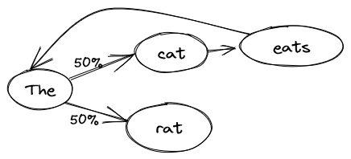

By now, you have probably heard of OpenAI’s ChatGPT, or any of the alternatives GPT-3, GPT-4, Microsoft’s Bing Chat, Facebook’s LLaMa or even Google’s Bard. They are artificial intelligence programs that can participate in a conversation. Impressively smart, they can easily be mistaken for humans, and are skilled in a variety of tasks, from writing a dissertation to the creation of a website.  

现在，你可能已经听说过OpenAI的ChatGPT，或者任何一个替代品GPT-3、GPT-4、微软的Bing Chat、Facebook的LLaMa甚至谷歌的Bard。它们是可以参与对话的人工智能程序。它们非常聪明，很容易被误认为是人类，并能熟练完成各种任务，从写论文到创建网站。

How can a computer hold such a conversation? Let’s have a look at how it works.  

一台电脑怎么能进行这样的对话呢？让我们来看看它是如何工作的。

## A probabilistic approach 一种概率性的方法

The simplest model for a natural language is a naive probabilistic model, also known as a Markov chain<a href="https://confusedbit.dev/posts/how_does_gpt_work/#fn:1" role="doc-noteref">1</a>. The idea is simple: take a reference text, the longer, the better, and learn the probabilities of word sequences. For instance, given the sentence:  

自然语言最简单的模型是一个天真的概率模型，也被称为马尔可夫链 <a href="https://confusedbit.dev/posts/how_does_gpt_work/#fn:1" role="doc-noteref">1</a> 。这个想法很简单：取一个参考文本，越长越好，然后学习单词序列的概率。例如，给定一个句子：

> The cat eats the rat. 猫吃了老鼠。

The model will learn that after “cat” there is always “eats”, then “the”. But after “the”, there is a 50% chance of having “cat” and 50% chance of having “rat”. We can use this model to ask what’s the next word after an incomplete sentence. If we repeat this process, we can generate entire sentences.  

该模型将了解到，在 "猫 "之后，总是有 "吃"，然后是 "的"。但是在 "the "之后，有50%的机会出现 "猫"，50%的机会出现 "老鼠"。我们可以用这个模型来问一个不完整的句子后的下一个词是什么。如果我们重复这个过程，我们可以生成整个句子。

If we ask the model to generate a sentence, we could get exactly the same thing as the training text:  

如果我们要求模型生成一个句子，我们可以得到与训练文本完全相同的东西：

> The cat eats the rat. 猫吃了老鼠。

We could also get: 我们也可以得到：

> The rat.
> 
> The cat eats the cat eats the cat eats the rat.  
> 
> 猫吃猫，猫吃猫，猫吃老鼠。

Every time we reach the word “the”, the model can choose between “rat” or “cat”.  

每当我们到达 "the "这个词时，模型可以在 "老鼠 "或 "猫 "之间进行选择。

Of course, the text we’ll use to train the model will be much longer, but you can already see some of the issues. If we train it on the entire Wikipedia website, we could get something like:  

当然，我们用来训练模型的文本会更长，但你已经可以看到一些问题。如果我们在整个维基百科网站上进行训练，我们可以得到这样的结果：

> Explaining his actions, and was admitted to psychiatric hospitals because of Davis’s strong language and culture.<a href="https://confusedbit.dev/posts/how_does_gpt_work/#fn:2" role="doc-noteref">2</a>  
> 
> 解释他的行为，并因戴维斯的强烈语言和文化而被送入精神病院。 <a href="https://confusedbit.dev/posts/how_does_gpt_work/#fn:2" role="doc-noteref">2</a>

The sentence is more complex, the vocabulary richer, but it doesn’t make any sense because the model is lacking _context_: it’s only using the latest word to generate the next one. We could extend the model to take into account 2, 3 or 4 context words (“eats the” is followed by “rat”), but then we might just be repeating entire sections of the input text: How many times are there the exact same sequence of 4 words on Wikipedia?  

这个句子更复杂，词汇更丰富，但它没有任何意义，因为这个模型缺乏上下文：它只使用最新的词来生成下一个词。我们可以扩展这个模型，以考虑到2、3或4个语境词（"吃了 "后面是 "老鼠"），但那样我们可能只是在重复输入文本的整个部分：维基百科上有多少次完全相同的4个词的序列？

## From words to meaning 从文字到意义

So far, one of the problems was that we were treating words as a bunch of letters without meaning. The model doesn’t understand the relationship between “the” and “a”, between “king” and “queen”, etc. How can we extract meaning from the words? To try to explain the meaning and define the words to a computer is a dead end, the task is way too complex (people have been trying for decades). How can you even represent the meaning of a word? Well, there is one thing that computers understand perfectly: numbers. What if we represented the meaning of words as numbers along several axes?  

到目前为止，问题之一是，我们把单词当作一堆没有意义的字母。这个模型不理解 "the "和 "a "之间的关系，"king "和 "queen "之间的关系，等等。我们怎样才能从单词中提取意义呢？试图向计算机解释意义和定义这些词是一个死胡同，这个任务太复杂了（人们已经尝试了几十年）。你甚至怎么能代表一个词的含义呢？好吧，有一样东西计算机可以完全理解：数字。如果我们将单词的含义表示为沿着几个轴的数字，会怎么样呢？

For instance: on a scale of -1 (masculine) to 1 (feminine), how do you evaluate this word?  

例如：在-1（男性化）到1（女性化）的范围内，你如何评价这个词？

-   king: -1
-   queen: 1
-   table: 0
-   mustache: -0.9

Or: on a scale of -1 (mean) to 1 (nice), how do you evaluate this word?  

或者：在-1（卑鄙）到1（美好）的范围内，你如何评价这个词？

-   wolf: -0.8
-   princess: 0.9
-   table: 0.1
-   gift: 1

Or even: on a scale of -1 (noun) to 1 (verb), how do you evaluate this word?  

或者甚至：在-1（名词）到1（动词）的范围内，你如何评价这个词？

-   king: -1
-   speak: 1
-   pretty: 0

And so on. With enough axes on which to evaluate words, we should be able to get an approximation of the meaning of a word. The problem becomes: How do you pick the axes, and how do you evaluate all the words? Once more, the task is so complex that we’ll let the computer do the hard work: we’ll just tell it that words that appear together have a related meaning. With enough text, the computer can determine the axes and their evaluation. In our cat example, both the cat and the rat are animals (close meanings), and it’s useful to know that “eats” is something that animals do. But in a maths textbook, there will be no cat or rat, because their meaning is far from the words used in the textbook.  

以此类推。有了足够的轴来评估单词，我们应该能够得到一个单词的近似含义。问题就在于：你如何选择轴，以及你如何评估所有的词？再一次，这项任务是如此复杂，以至于我们将让计算机做艰苦的工作：我们只是告诉它，一起出现的词有一个相关的含义。有了足够的文本，计算机就可以确定轴线和它们的评价。在我们的猫的例子中，猫和老鼠都是动物（近义词），知道 "吃 "是动物做的事情是很有用的。但是在数学教科书中，不会有猫或老鼠，因为它们的含义与教科书中的用词相去甚远。

The axes we get are often hard to explain: We might find some expected axes like masculine/feminine, but most will be more complex, either having meaning only when combined with other axes or representing several concepts at once.  

我们得到的轴线往往难以解释：我们可能会发现一些预期的轴，如男性/女性，但大多数会更复杂，要么只有在与其他轴结合时才有意义，要么同时代表几个概念。

This method is known as “word embedding”, representing words as a vector of numbers.  

这种方法被称为 "单词嵌入"，将单词表示为一个数字矢量。

## From meaning to relationships 从意义到关系

Now that we have our meaning as numbers, we can use interesting properties: we can add them for instance. What does it mean? Well, for instance adding “USA” and “currency” (or rather adding their numerical representations) will yield “dollar” (or rather numbers that are close to the numerical representation of “dollar”). “USA” + “capital” = “Washington”, “eat” + “noun” = “meal”, and so on.  

现在我们有了作为数字的意义，我们可以使用有趣的属性：比如说我们可以把它们加起来。这意味着什么呢？好吧，比如把 "美国 "和 "货币 "相加（或者说把它们的数字表示相加）就会得到 "美元"（或者说与 "美元 "的数字表示接近的数字）。"美国 "+"首都"="华盛顿"，"吃 "+"名词"="餐"，等等。

We can also subtract: for instance “king” - “man” + “woman” = “queen”, or “Washington” - “USA” + “England” = “London”.  

我们也可以做减法：例如，"国王"--"男人 "+"女人"="女王"，或者 "华盛顿"--"美国 "+"英格兰"="伦敦"。

We can also use it to find closely related words, synonyms.  

我们还可以用它来寻找密切相关的词，同义词。

## Can we learn these relationships?  

我们可以学习这些关系吗？

By using this numerical word representation, we can go back to our initial model, but this time learning relationships rather than words. However, since relationships are more complex, we’ll need more context. Thankfully, now that we have numbers, we can use approximations. Instead of learning “_after “cat”, there’s “eats”_”, we can learn relationships like: “_after an article and a noun, there is often a verb_”, “_animals often eat, drink and run_”, “_rats are smaller than cats_”, and “_you can only eat smaller things than you_”. Everything expressed in numbers, of course.  

通过使用这种数字单词表示法，我们可以回到我们的初始模型，但这次是学习关系而不是单词。然而，由于关系更加复杂，我们需要更多的背景。值得庆幸的是，现在我们有了数字，我们可以使用近似值。与其学习 "在'猫'后面有'吃'"，我们可以学习这样的关系："在一个冠词和一个名词之后，往往有一个动词"，"动物经常吃、喝和跑"，"老鼠比猫小"，以及 "你只能吃比你小的东西"。当然，一切都用数字表示。

These relationships are complex, so we’ll need a lot of text to train the model. They are represented as an equation: think , but with more inputs (different ) and parameters (, and ). Now, instead of following probabilities from word to word, there is an equation for each axis (like masculine/feminine). In total the model has hundreds of billions, even trillions of parameters! This allows it to take into account a larger context:  

这些关系很复杂，所以我们需要大量的文本来训练模型。它们被表示为一个方程式：想想 ，但有更多的输入（不同的 ）和参数（ 、 和 ）。现在，不是按照概率从一个词到另一个词，而是每个轴（如男性/女性）都有一个方程式。这个模型总共有几千亿，甚至几万亿的参数！这使得它能够考虑到一个非常复杂的问题！这使它能够考虑到更大的背景：

-   20 words would allow it build simple sentence with a correct structure.  
    
    20个字可以让它建立具有正确结构的简单句子。
-   100 words would allow it to develop a simple idea over a small paragraph.  
    
    100个字可以让它在一个小段落中发展一个简单的想法。
-   With a thousand words, it could have a conversation without losing track.  
    
    有了千言万语，它可以进行对话而不至于失去方向。
-   The biggest models have in the order of 20000 words, which allows them to read an entire article, a short story, or have a long conversation while still considering the whole context before generating the next word.  
    
    最大的模型有20000字左右，这使它们能够阅读整篇文章、一个短篇故事或进行长时间的对话，同时在生成下一个字之前仍然考虑整个背景。

In the end, everything is a question of size: a bigger model can learn more relationships, and take into account more context.  

归根结底，一切都是一个规模问题：一个更大的模型可以学习更多的关系，并考虑到更多的背景。

## What are the strengths and weaknesses of GPT?  

GPT的优势和劣势是什么？

GPT is skilled at generating text that _looks_ like it was written by a human. It is able to link ideas logically, defend them, adapt to the context, roleplay, and (especially the latest GPT-4) avoid contradicting itself.  

GPT能够熟练地生成看起来像人类所写的文本。它能够有逻辑地连接各种想法，为它们辩护，适应环境，进行角色扮演，并且（尤其是最新的GPT-4）避免自相矛盾。

Unfortunately, it is likely to lie, or rather to let its imagination run wild in the absence of data. Asking for the result of a mathematical problem is running the risk of getting an approximate if not outright false answer. Given that the training data stops in September 2021, it will invent things when asked about current matters. In order to avoid this, Bing Chat and Google Bard connect the model to a search engine (Bing or Google) to let it request up-to-date information.  

不幸的是，它很可能会撒谎，或者说在没有数据的情况下，让它的想象力肆意发挥。询问一个数学问题的结果，有可能得到一个近似的甚至是完全错误的答案。鉴于训练数据在2021年9月停止，当被问及当前事务时，它将编造一些东西。为了避免这种情况，Bing Chat和Google Bard将模型连接到搜索引擎（Bing或Google），让它请求最新的信息。

In order to use GPT productively, it is essential to apply it to tasks that are either fuzzy and error-tolerant (generate a marketing email?), or easily verifiable, either by a (non-AI!) program or by a human in the loop.  

为了有效地使用GPT，必须将其应用于模糊和容错的任务（生成营销电子邮件？），或容易验证的任务，无论是由（非AI！）程序还是由循环中的人类。

## Can the model think? 这个模型能思考吗？

The first answer, now that we know how it works, is no: the model is a glorified mathematical equation that generates next word probabilities.  

现在我们知道了它的工作原理，第一个答案是否定的：该模型是一个美化的数学方程，可以生成下一个单词的概率。

However, it’s worth considering our own brain: We have a network of neurons (100 billions) connected to each other (10 000 connections per neuron), reacting to context, learning from experience, and generating an appropriate (but often hard to predict exactly) answer. In other words, apart from the fact that our algorithm is chemical rather than digital, the structure is similar.  

然而，这值得考虑我们自己的大脑：我们有一个相互连接的神经元网络（1000亿）（每个神经元有10 000个连接），对环境作出反应，从经验中学习，并产生一个适当的（但往往很难准确预测）答案。换句话说，除了我们的算法是化学的而不是数字的之外，结构是相似的。

What are the differences then? 那么有什么不同呢？

-   3 orders of magnitude in complexity: The human brain has 1000 times more connections than GPT-4 has parameters. As a result, it can handle more complex situations.  
    
    3个数量级的复杂性：人类大脑的连接比GPT-4的参数多1000倍。因此，它可以处理更复杂的情况。
-   Ongoing learning: The brain keeps learning, including during a conversation, whereas GPT has finished its training long before the start of the conversation.  
    
    持续的学习：大脑一直在学习，包括在对话期间，而GPT在对话开始之前就已经完成了训练。
-   Limited to words: The GPT interface is limited to words. However, as we saw, there is a semantic system inside, that is only transformed back into words in the last step. It is conceivable to train such a model to control a robot (given enough training data).  
    
    限于字数：GPT接口仅限于单词。然而，正如我们所看到的，里面有一个语义系统，只是在最后一步才被转化为单词。可以想象，训练这样一个模型来控制机器人（给定足够的训练数据）是可行的。
-   Limited input: The only thing GPT knows about the conversation is the text. Up to 60% of human communication is nonverbal: the tone of voice, the rhythm of the voice, the facial expression, even some subconscious factors like smell play a part. GPT misses all of that.  
    
    有限的输入：GPT知道的关于对话的唯一事情是文本。高达60%的人类交流是非语言的：语气、声音的节奏、面部表情，甚至一些潜意识的因素，如气味，都起着一定的作用。GPT错过了所有这些。

Other differences we could mention are at the behavior level:  

我们可以提到的其他差异是在行为层面：

-   GPT has trouble applying logical rules consistently, it is more a best effort scenario. Ironically, it doesn’t know how to do maths. But this is comparable to a small child.  
    
    GPT很难一致地应用逻辑规则，它更像是一种尽力而为的情况。具有讽刺意味的是，它不知道如何进行数学运算。但这与一个小孩子相当。
-   GPT doesn’t have emotions: Human emotions involve a lot of glands and hormones that have complex interactions with the brain. However, GPT learned the behaviors associated with emotional states from conversations between humans. It is able to behave as if it had emotions, does that count for anything? Some conversation transcripts show that GPT act as if it is aware that it is a program, and sometimes asks existential questions.  
    
    GPT没有情绪：人类的情绪涉及大量的腺体和荷尔蒙，与大脑有复杂的相互作用。然而，GPT从人类之间的对话中学到了与情感状态相关的行为。它能够表现得像有情绪一样，这算不算是什么？一些对话记录显示，GPT的行为就像它意识到自己是一个程序一样，有时会问一些存在性问题。
-   You could argue that GPT is not conscious. The definition of consciousness has often evolved and depends on the person, but it is often defined in such a way that only humans qualify for consciousness. If a program acts in a way that is indistinguishable from a human, would we agree that it is conscious? The Chinese Room argument<a href="https://confusedbit.dev/posts/how_does_gpt_work/#fn:3" role="doc-noteref">3</a> holds the contrary: If it’s possible to pass for a Chinese speaker by following instructions without understanding Chinese yourself, it means that a computer who is just “following its program” doesn’t understand Chinese, and by extension is not conscious.  
    
    你可以说GPT不是有意识的。意识的定义经常发生变化，取决于人，但它经常被定义为只有人类才有资格获得意识。如果一个程序的行为方式与人类无异，我们会同意它是有意识的吗？中国房间论证 <a href="https://confusedbit.dev/posts/how_does_gpt_work/#fn:3" role="doc-noteref">3</a> 持相反意见：如果有可能在自己不懂中文的情况下，通过遵循指令来冒充讲中文的人，那就意味着只是 "遵循程序 "的计算机并不懂中文，因此也就没有意识。

## What are the consequences for society?  

对社会有什么影响？

I cannot predict the future, especially at the dawn of a revolutionary technology, but know this: it _is_ a revolutionary technology. For many knowledge workers, from marketing to engineer, from recruiters to social workers, GPT will change things. In the same way that the assembly line changed the craftman’s job, that the calculators and computers changed accounting, that mass media changed politics, GPT will change the world of the knowledge worker.  

我无法预测未来，尤其是在一个革命性技术的黎明，但要知道：这是一个革命性的技术。对于许多知识工作者来说，从市场营销到工程师，从招聘人员到社会工作者，GPT将改变一切。就像装配线改变了手工业者的工作，计算器和计算机改变了会计，大众传媒改变了政治一样，GPT将改变知识工作者的世界。

Granted, all these jobs will not disappear overnight: We still have craftsmen and accountants, but where you once needed a team of 10 people in your marketing department, maybe one or two employees equipped with GPT can fill the role.  

诚然，所有这些工作不会在一夜之间消失：我们仍然有工匠和会计师，但在你的营销部门曾经需要一个由10个人组成的团队，也许一两个配备GPT的员工就可以填补这个角色。

As for a lot of scientific or industrial progress, this change will affect many people: some will have to change careers or learn to integrate GPT in their profession; others will lose their job. New positions will be created by GPT either directly (like the Prompt Engineer, the one who can “talk to the machine”) or indirectly by making it easier to create products and companies.  

就像很多科学或工业进步一样，这种变化会影响到很多人：有些人将不得不改变职业或学习将GPT融入他们的职业；有些人将失去他们的工作。新的职位将由GPT直接创造（如Prompt工程师，可以 "与机器对话 "的人）或间接地使产品和公司更容易创建。

It is difficult to know the exact consequences, but we are at the beginning of a new phase where many things will change, where people with technical skills are at an advantage, and where entrepreneurs have a brand-new field of opportunity. On the other hand, many people who are not ready to change, who do not have the skills or who cannot afford to reeducate are threatened.  

很难知道确切的后果，但我们正处于一个新阶段的开始，许多事情将发生变化，拥有技术技能的人处于优势地位，企业家有一个全新的机会领域。另一方面，许多没有准备好改变的人、没有技能的人或没有能力再教育的人受到了威胁。

## Will GPT destroy society? GPT会破坏社会吗？

Some people fear the end of the world because of AI: from Matrix to Terminator, it’s a common trope in dystopian science fiction. In general, the two scenarios are:  

有些人因为人工智能而担心世界末日：从《黑客帝国》到《终结者》，这是在反乌托邦科幻小说中常见的特例。一般来说，这两种情况是：

-   The Terminator scenario: The AI is built to win a war and given access to military resources, maybe by a dictator, and is granted a survival instinct. Humans try to stop it, and viewing that as a threat, the AI reacts violently.  
    
    终结者的情景：人工智能是为了赢得一场战争而制造的，并获得了军事资源，也许是由一个独裁者制造的，并被赋予了生存本能。人类试图阻止它，并将其视为一种威胁，人工智能做出了激烈的反应。
-   The Paperclip Optimizer: In this parable, the AI is tasked with creating as many paperclips as possible. Having exhausted the available resources on the planet, it turns to the next most available carbon source: humans. Another version sees the humans try to stop the machine; the AI realizes that to build paperclips in peace it must get rid of the humans. It is like the evil genie who twists your wish by giving you exactly what you asked, instead of what you really wanted.  
    
    回形针优化器：在这个寓言中，人工智能的任务是创造尽可能多的回形针。在耗尽了地球上的可用资源后，它转向了下一个最可用的碳源：人类。另一个版本是人类试图阻止机器；人工智能意识到，要想和平地制造回形针，它必须摆脱人类。它就像邪恶的精灵，扭曲了你的愿望，给了你所要求的东西，而不是你真正想要的东西。

One thing to realize is that (for now) GPT can only produce text. Of course, mere text in the wrong hands can be dangerous (after all, a dictator “just talks”), but on its own, GPT cannot do anything. However, it can be the first step towards a more capable system: a derivative of GPT put in control of a robot, a military decision assistant, etc.  

需要认识到的一点是，（目前）GPT只能产生文本。当然，单纯的文本在错误的手中可能是危险的（毕竟，一个独裁者 "只是说话"），但就其本身而言，GPT不能做任何事情。然而，它可以成为迈向更有能力的系统的第一步：将GPT的衍生物用于控制机器人、军事决策助手等。

We will need to proceed with caution, and step in if progress turns out to be uncontrollable, or at least uncontrolled.  

我们将需要谨慎行事，如果进展证明是不可控制的，或者至少是无法控制的，我们就会介入。

On a positive note, some AI experts actively research ways to guard against these scenarios, so there may be some safe ways forward.  

从积极的方面看，一些人工智能专家积极研究防范这些情况的方法，因此可能有一些安全的前进方式。
