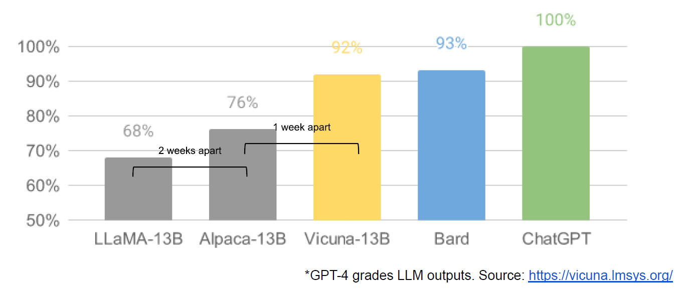

###### \_The text below is a very recent leaked document, which was shared by an anonymous individual on a public Discord server who has granted permission for its republication. It originates from a researcher within Google. We have verified its authenticity. The only modifications are formatting and removing links to internal web pages. The document is only the opinion of a Google employee, not the entire firm. We do not agree with what is written below, nor do other researchers we asked, but we will publish our opinions on this in a separate piece for subscribers. We simply are a vessel to share this document which raises some very interesting points.

下面的文字是最近泄露的一份文件，由一个匿名人士在一个公开的 Discord 服务器上分享，他已经同意重新发布该文件。它来自谷歌的一名研究员。我们已经验证了其真实性。唯一的修改是格式化和删除内部网页的链接。该文件只是一个谷歌员工的意见，而不是整个公司的意见。我们不同意下面写的内容，我们问过的其他研究人员也不同意，但我们会在另一篇文章中为订阅者发表我们对此的看法。我们只是作为一个容器来分享这份文件，它提出了一些非常有趣的观点。\_

We’ve done a lot of looking over our shoulders at OpenAI. Who will cross the next milestone? What will the next move be?

我们在 OpenAI 做了很多审视自己肩膀的工作。谁会跨越下一个里程碑？下一步会有什么行动？

But the uncomfortable truth is, _we aren’t positioned to win this arms race and neither is OpenAI_. While we’ve been squabbling, a third faction has been quietly eating our lunch.

但令人不安的事实是，我们没有能力赢得这场军备竞赛，OpenAI 也是如此。在我们争吵不休的时候，第三个派别一直在悄悄地吃我们的午餐。

I’m talking, of course, about open source. Plainly put, they are lapping us. **Things we consider “major open problems” are solved and in people’s hands today.** Just to name a few:

当然，我说的是开放源代码。坦率地说，他们正在追赶我们。我们认为是 "主要的开放问题 "的东西今天已经解决了，并且在人们的手中。仅举几个例子：

- **LLMs on a Phone:** [People are running foundation models on a Pixel 6](https://twitter.com/thiteanish/status/1635678053853536256) at 5 tokens / sec.

  手机上的 LLMs： 人们在 Pixel 6 上运行基础模型，速度为 5 tokens/秒。

- **Scalable Personal AI:** [You can finetune a personalized AI on your laptop in an evening.](https://github.com/tloen/alpaca-lora)

  可扩展的个人人工智能：你可以在一个晚上在你的笔记本电脑上微调一个个性化的人工智能。

- **Responsible Release:** This one isn’t “solved” so much as “obviated”. [There are entire websites full of art models with no restrictions whatsoever](https://civitai.com/), and text is [not far behind.](https://medium.com/geekculture/list-of-open-sourced-fine-tuned-large-language-models-llm-8d95a2e0dc76)

  负责任的释放：这个问题不是 "解决 "了，而是 "避免 "了。 有整个网站都是没有任何限制的艺术模型，而文字也不例外。

- **Multimodality:** [The current multimodal ScienceQA SOTA was trained in an hour](https://arxiv.org/pdf/2303.16199.pdf).

  多模态： 目前的多模态科学 QA SOTA 在一小时内完成了培训。

While our models still hold a slight edge in terms of quality, the [gap is closing astonishingly quickly](https://arxiv.org/pdf/2303.16199.pdf). Open-source models are faster, more customizable, more private, and pound-for-pound more capable. They are [doing things with $100 and 13B params](https://lmsys.org/blog/2023-03-30-vicuna/) that we struggle with at $10M and 540B. And they are doing so in weeks, not months. This has profound implications for us:

虽然我们的模型在质量方面仍有轻微的优势，但差距正在以惊人的速度缩小。开源模型的速度更快，可定制性更强，更有私密性，而且一磅一磅的能力更强。他们正在用 100 美元和 130 亿的参数做一些事情，而我们在 1000 万美元和 540 亿的参数上却很难做到。而且他们在几周内就能做到，而不是几个月。这对我们有深远的影响：

- **We have no secret sauce.** Our best hope is to learn from and collaborate with what others are doing outside Google. We should prioritize enabling 3P integrations.

  我们没有秘方。我们最好的希望是向谷歌以外的其他人学习并与他们合作。我们应该优先考虑实现 3P 整合。

- **People will not pay for a restricted model when free, unrestricted alternatives are comparable in quality.** We should consider where our value add really is.

  当免费的、不受限制的替代品质量相当时，人们不会为受限制的模式付费。我们应该考虑我们的附加值到底在哪里。

- **Giant models are slowing us down.** In the long run, the best models are the ones

  巨大的模型正在拖累我们。从长远来看，最好的模型是那些

  which can be iterated upon quickly. We should make small variants more than an afterthought, now that we know what is possible in the <20B parameter regime.

  这可以快速迭代。既然我们知道在<20B 的参数体系中什么是可能的，我们就应该让小变体不再是事后的想法。

https://lmsys.org/blog/2023-03-30-vicuna/

At the beginning of March the open source community [got their hands on](https://www.vice.com/en/article/xgwqgw/facebooks-powerful-large-language-model-leaks-online-4chan-llama) their first really capable foundation model, as Meta’s LLaMA was leaked to the public. It had no instruction or conversation tuning, and no RLHF. Nonetheless, the community immediately understood the significance of what they had been given.

3 月初，开源社区得到了他们的第一个真正有能力的基础模型，因为 Meta 的 LLaMA 被泄露给了公众。它没有指令或对话调整，也没有 RLHF。尽管如此，社区立即理解了他们所得到的东西的意义。

A tremendous outpouring of innovation followed, with just days between major developments (see The Timeline for the full breakdown). Here we are, barely a month later, and there are variants with [instruction tuning](https://crfm.stanford.edu/2023/03/13/alpaca.html), [quantization](https://github.com/ggerganov/llama.cpp), [quality improvements](https://lmsys.org/blog/2023-03-30-vicuna/), [human evals](https://arxiv.org/pdf/2303.16199.pdf), [multimodality](https://arxiv.org/pdf/2303.16199.pdf), [RLHF](https://drive.google.com/file/d/10iR5hKwFqAKhL3umx8muOWSRm7hs5FqX/view), etc. etc. many of which build on each other.

随后，巨大的创新涌现出来，主要的发展只间隔了几天（完整的分类见时间轴）。在这里，我们几乎没有一个月，就出现了指令调整、量化、质量改进、人类评价、多模态、RLHF 等等等等的变体，其中很多都是相互关联的。

Most importantly, [they have solved the scaling problem](https://github.com/tloen/alpaca-lora) to the extent that anyone can tinker. Many of the new ideas are from ordinary people. The barrier to entry for training and experimentation has dropped from the total output of a major research organization to one person, an evening, and a beefy laptop.

最重要的是，他们已经解决了缩放问题，达到了任何人都可以修补的程度。许多新的想法都来自于普通人。培训和实验的门槛已经从一个主要研究机构的总产出下降到一个人、一个晚上和一台强大的笔记本电脑。

In many ways, this shouldn’t be a surprise to anyone. The current renaissance in open source LLMs comes hot on the heels of a renaissance in image generation. The similarities are not lost on the community, with many calling this the “[Stable Diffusion moment](https://simonwillison.net/2023/Mar/11/llama/)” for LLMs.

在许多方面，这对任何人来说都不应该是一个惊喜。目前开源 LLM 的复兴是紧随图像生成的复兴而来的。社区并没有忘记这些相似之处，许多人称这是 LLMs 的 "稳定扩散时刻"。

In both cases, low-cost public involvement was enabled by a vastly cheaper mechanism for fine tuning called [low rank adaptation](https://arxiv.org/abs/2106.09685), or LoRA, combined with a significant breakthrough in scale ([latent diffusion](https://arxiv.org/abs/2112.10752) for image synthesis, [Chinchilla](https://arxiv.org/abs/2203.15556) for LLMs). In both cases, access to a sufficiently high-quality model kicked off a flurry of ideas and iteration from individuals and institutions around the world. In both cases, this quickly outpaced the large players.

在这两种情况下，低成本的公众参与是通过一种称为低等级适应（LoRA）的更便宜的微调机制，结合规模上的重大突破（图像合成的潜伏扩散，LLM 的 Chinchilla）实现的。在这两种情况下，获得一个足够高质量的模型引发了世界各地的个人和机构的想法和迭代的热潮。在这两种情况下，这很快就超过了大型企业。

These contributions were pivotal in the image generation space, setting Stable Diffusion on a different path from Dall-E. Having an open model led to [product integrations](https://github.com/AbdullahAlfaraj/Auto-Photoshop-StableDiffusion-Plugin), [marketplaces](https://civitai.com/), [user interfaces](https://github.com/AUTOMATIC1111/stable-diffusion-webui), and [innovations](https://stablediffusionweb.com/ControlNet) that didn’t happen for Dall-E.

这些贡献在图像生成领域非常关键，使稳定扩散公司走上了一条与 Dall-E 不同的道路。拥有一个开放的模式导致了产品的整合、市场、用户界面和创新，这些都是 Dall-E 所没有的。

The effect was palpable: [rapid domination](https://trends.google.com/trends/explore?date=2022-08-01%202023-04-10&q=Stable%20Diffusion,Dall-E&hl=en) in terms of cultural impact vs the OpenAI solution, which became increasingly irrelevant. Whether the same thing will happen for LLMs remains to be seen, but the broad structural elements are the same.

其效果是可想而知的：在文化影响方面迅速占据主导地位，与 OpenAI 的解决方案相比，它变得越来越无关紧要。同样的事情是否会发生在法律硕士身上还有待观察，但广泛的结构元素是相同的。

The innovations that powered open source’s recent successes directly solve problems we’re still struggling with. Paying more attention to their work could help us to avoid reinventing the wheel.

推动开源最近成功的创新直接解决了我们仍在挣扎的问题。多关注他们的工作可以帮助我们避免重新发明车轮。

[LoRA](https://arxiv.org/abs/2106.09685) works by representing model updates as low-rank factorizations, which reduces the size of the update matrices by a factor of up to several thousand. This allows model fine-tuning at a fraction of the cost and time. Being able to personalize a language model in a few hours on consumer hardware is a big deal, _particularly_ for [aspirations that involve incorporating new and diverse knowledge in near real-time](http://www.internalgooglesitescrubbedbyus.com/). The fact that this technology exists is underexploited inside Google, even though it directly impacts some of our most ambitious projects.

LoRA 的工作原理是将模型更新表示为低秩因子化，这就将更新矩阵的大小减少了几千倍。这使得模型的微调只需要一小部分的成本和时间。能够在几个小时内在消费类硬件上对语言模型进行个性化调整是一件大事，特别是对于那些涉及在近乎实时的情况下纳入新的和多样化的知识的愿望。这项技术的存在在谷歌内部没有得到充分的利用，尽管它直接影响了我们一些最雄心勃勃的项目。

Part of what makes LoRA so effective is that - like other forms of fine-tuning - it’s stackable. Improvements like instruction tuning can be applied and then leveraged as other contributors add on dialogue, or reasoning, or tool use. While the individual fine tunings are low rank, their sum need not be, allowing full-rank updates to the model to accumulate over time.

LoRA 之所以如此有效，部分原因在于--像其他形式的微调--它是可堆叠的。像指令调整这样的改进可以被应用，然后随着其他贡献者增加对话、推理或工具使用而被利用。虽然单个的微调是低等级的，但它们的总和不需要，允许对模型的全等级更新随着时间的推移而积累起来。

This means that as new and better datasets and tasks become available, the model can be cheaply kept up to date, without ever having to pay the cost of a full run.

这意味着，随着新的和更好的数据集和任务的出现，模型可以廉价地保持更新，而不需要支付完整的运行成本。

By contrast, training giant models from scratch not only throws away the pretraining, but also any iterative improvements that have been made on top. In the open source world, it doesn’t take long before these improvements dominate, making a full retrain extremely costly.

相比之下，从头开始训练巨型模型，不仅丢掉了预训练，还丢掉了在上面进行的任何迭代改进。在开放源码的世界里，这些改进不需要很长时间就会占据主导地位，从而使全面的重新训练变得极其昂贵。

We should be thoughtful about whether each new application or idea really needs a whole new model. If we really do have major architectural improvements that preclude directly reusing model weights, then we should invest in more aggressive forms of distillation that allow us to retain as much of the previous generation’s capabilities as possible.

我们应该深思熟虑，每个新的应用或想法是否真的需要一个全新的模型。如果我们真的有重大的架构改进，排除了直接重复使用模型权重，那么我们应该投资于更积极的提炼形式，让我们尽可能多地保留前一代的能力。

LoRA updates are very cheap to produce (~$100) for the most popular model sizes. This means that almost anyone with an idea can generate one and distribute it. Training times under a day are the norm. At that pace, it doesn’t take long before the cumulative effect of all of these fine-tunings overcomes starting off at a size disadvantage. Indeed, in terms of engineer-hours, the pace of improvement from these models vastly outstrips what we can do with our largest variants, and the best [are already largely indistinguishable from ChatGPT](https://bair.berkeley.edu/blog/2023/04/03/koala/). **Focusing on maintaining some of the largest models on the planet actually puts us at a disadvantage.**

对于最受欢迎的模型尺寸来说，LoRA 更新的生产成本非常低（约 100 美元）。这意味着，几乎任何有想法的人都可以生成并分发它。训练时间少于一天是正常的。在这种速度下，所有这些微调的累积效应不需要很长时间就可以克服开始时的尺寸劣势。事实上，就工程师时间而言，这些模型的改进速度远远超过了我们最大的变体所能做到的，而且最好的模型已经与 ChatGPT 基本没有区别了。专注于维护地球上一些最大的模型实际上使我们处于不利地位。

Many of these projects are saving time by [training on small, highly curated datasets](https://bair.berkeley.edu/blog/2023/04/03/koala/). This suggests there is some flexibility in data scaling laws. The existence of such datasets follows from the line of thinking in [Data Doesn't Do What You Think](http://www.internalgooglesitescrubbedbyus.com/), and they are rapidly becoming the standard way to do training outside Google. These datasets are built using synthetic methods (e.g. filtering the best responses from an existing model) and scavenging from other projects, neither of which is dominant at Google. **Fortunately, these high quality datasets are open source, so they are free to use.**

这些项目中有许多是通过在小型、高度策划的数据集上进行训练来节省时间。这表明在数据扩展规律中存在一些灵活性。这种数据集的存在源于《数据不随人愿》中的思路，而且它们正迅速成为谷歌之外的标准训练方式。这些数据集是用合成方法（例如从现有的模型中过滤出最好的反应）和从其他项目中搜刮来的，这两种方法在谷歌都不占优势。幸运的是，这些高质量的数据集是开源的，所以它们可以免费使用。

This recent progress has direct, immediate implications for our business strategy. **Who would pay for a Google product with usage restrictions if there is a free, high quality alternative without them?**

最近的这一进展对我们的商业战略有直接、直接的影响。如果有一个没有使用限制的免费、高质量的替代品，谁还会为谷歌的产品付费呢？

And we should not expect to be able to catch up. The [modern internet runs on open source](https://openuk.uk/wp-content/uploads/2021/07/State-of-Open-Phase-Two.pdf) for a reason. Open source has some significant advantages that we cannot replicate.

而我们不应该期望能够追赶上。现代互联网在开放源码上运行是有原因的。开源有一些我们无法复制的显著优势。

Keeping our technology secret was always a tenuous proposition. Google researchers are leaving for other companies on a regular cadence, so we can assume they know everything we know, and will continue to for as long as that pipeline is open.

对我们的技术进行保密一直是一个脆弱的提议。谷歌的研究人员定期离开，前往其他公司，因此我们可以假设他们知道我们所知道的一切，而且只要这个管道是开放的，就会继续知道。

But holding on to a competitive advantage in technology becomes even harder now that cutting edge research in LLMs is affordable. Research institutions all over the world are building on each other’s work, exploring the solution space in a breadth-first way that far outstrips our own capacity. We can try to hold tightly to our secrets while outside innovation dilutes their value, or we can try to learn from each other.

但现在，由于法律硕士的前沿研究是可以负担得起的，因此在技术方面坚持竞争优势变得更加困难。世界各地的研究机构都在彼此的工作基础上，以广度优先的方式探索解决方案的空间，远远超过了我们自己的能力。我们可以尝试紧紧抓住我们的秘密，而外部的创新则稀释了它们的价值，或者我们可以尝试相互学习。

Much of this innovation is happening on top of the leaked model weights from Meta. While this will inevitably change as [truly open models](https://bigscience.huggingface.co/blog/bloom) get better, the point is that they don’t have to wait. The legal cover afforded by “personal use” and the impracticality of prosecuting individuals means that individuals are getting access to these technologies while they are hot.

这种创新大部分是在 Meta 公司泄露的模型权重之上发生的。虽然随着真正的开放模型变得更好，这将不可避免地发生变化，但问题是，他们不必等待。个人使用 "所提供的法律保护和起诉个人的不切实际，意味着个人可以趁热打铁获得这些技术。

Browsing through the models that people are creating in the image generation space, there is a vast outpouring of creativity, from anime generators to HDR landscapes. These models are used and created by people who are deeply immersed in their particular subgenre, lending a depth of knowledge and empathy we cannot hope to match.

浏览人们在图像生成领域创建的模型，有大量的创造力，从动漫生成器到 HDR 景观。这些模型是由那些深深沉浸在他们特定的子类型中的人使用和创造的，提供了我们无法企及的知识深度和共鸣。

Paradoxically, the one clear winner in all of this is Meta. Because the leaked model was theirs, they have effectively garnered an entire planet's worth of free labor. Since most open source innovation is happening on top of their architecture, there is nothing stopping them from directly incorporating it into their products.

矛盾的是，在这一切中，一个明显的赢家是美达公司。因为泄露的模型是他们的，他们有效地获得了整个地球的免费劳动力。由于大多数开源创新都发生在他们的架构之上，没有什么可以阻止他们直接将其纳入自己的产品。

**The value of owning the ecosystem cannot be overstated.** Google itself has successfully used this paradigm in its open source offerings, like Chrome and Android. By owning the platform where innovation happens, Google cements itself as a thought leader and direction-setter, earning the ability to shape the narrative on ideas that are larger than itself.

拥有生态系统的价值怎么强调都不为过。谷歌本身已经在其开源产品中成功地使用了这种模式，如 Chrome 和 Android。通过拥有创新发生的平台，谷歌巩固了自己作为思想领袖和方向制定者的地位，赢得了在比自己更大的想法上塑造叙述的能力。

**The more tightly we control our models, the more attractive we make open alternatives.** Google and OpenAI have both gravitated defensively toward release patterns that allow them to retain tight control over how their models are used. But this control is a fiction. Anyone seeking to use LLMs for unsanctioned purposes can simply take their pick of the freely available models.

我们越是严格控制我们的模型，我们就越能吸引开放的替代品。谷歌和 OpenAI 都倾向于防御性的发布模式，这使得他们能够保持对其模型使用方式的严格控制。但这种控制是一种虚构。任何想要将 LLMs 用于未经批准的目的的人都可以简单地从免费提供的模型中挑选。

Google should establish itself a leader in the open source community, taking the lead by cooperating with, rather than ignoring, the broader conversation. This probably means taking some uncomfortable steps, like publishing the model weights for small ULM variants. This necessarily means relinquishing some control over our models. But this compromise is inevitable. We cannot hope to both drive innovation and control it.

谷歌应该在开源社区建立自己的领导地位，通过与更广泛的对话合作，而不是忽视它。这可能意味着要采取一些不舒服的步骤，比如公布小型 ULM 变体的模型权重。这必然意味着放弃对我们模型的一些控制。但这种妥协是不可避免的。我们不能希望既推动创新又控制创新。

All this talk of open source can feel unfair given OpenAI’s current closed policy. Why do we have to share, if they won’t? But the fact of the matter is, we are already sharing everything with them in the form of the steady flow of poached senior researchers. Until we stem that tide, secrecy is a moot point.

鉴于 OpenAI 目前的封闭政策，所有这些关于开放源代码的讨论都会让人感觉不公平。如果他们不愿意，我们为什么要分享呢？但事实是，我们已经在与他们分享一切了，因为我们的高级研究人员不断被挖走。在我们阻止这一浪潮之前，保密是一个没有意义的问题。

And in the end, _OpenAI doesn’t matter_. They are making the same mistakes we are in their posture relative to open source, and their ability to maintain an edge is necessarily in question. Open source alternatives can and will eventually eclipse them unless they change their stance. In this respect, at least, we can make the first move.

而最终，OpenAI 并不重要。他们在相对于开源的姿态上犯了和我们一样的错误，他们保持优势的能力必然受到质疑。除非他们改变立场，否则开源替代方案能够而且最终将使他们黯然失色。至少在这一点上，我们可以先下手为强。

[Meta launches LLaMA](https://ai.facebook.com/blog/large-language-model-llama-meta-ai/), open sourcing the code, but not the weights. At this point, LLaMA is not instruction or conversation tuned. Like many current models, it is a relatively small model (available at 7B, 13B, 33B, and 65B parameters) that has been trained for a relatively large amount of time, and is therefore quite capable relative to its size.

Meta 推出了 LLaMA，开放了代码，但没有开放权重。在这一点上，LLaMA 没有经过指导或对话调整。像目前的许多模型一样，它是一个相对较小的模型（有 7B、13B、33B 和 65B 的参数），已经被训练了相对较多的时间，因此相对于它的规模来说是相当有能力的。

Within a week, [LLaMA is leaked to the public](https://www.vice.com/en/article/xgwqgw/facebooks-powerful-large-language-model-leaks-online-4chan-llama). The impact on the community cannot be overstated. Existing licenses prevent it from being used for commercial purposes, but suddenly anyone is able to experiment. From this point forward, innovations come hard and fast.

在一个星期内，LLaMA 被泄露给了公众。这对社区的影响怎么强调都不为过。现有的许可证阻止它被用于商业目的，但突然间任何人都可以进行实验。从这一点来看，创新来得又快又猛。

A little over a week later, Artem Andreenko [gets the model working on a Raspberry Pi](https://github.com/ggerganov/llama.cpp/issues/58). At this point the model runs too slowly to be practical because the weights must be paged in and out of memory. Nonetheless, this sets the stage for an onslaught of minification efforts.

一个多星期后，Artem Andreenko 让这个模型在 Raspberry Pi 上运行。在这一点上，该模型运行得太慢了，以至于不实用，因为权重必须在内存中被分页出来。尽管如此，这为大量的简化工作奠定了基础。

The next day, Stanford releases [Alpaca](https://crfm.stanford.edu/2023/03/13/alpaca.html), which adds instruction tuning to LLaMA. More important than the actual weights, however, was Eric Wang’s [alpaca-lora](https://github.com/tloen/alpaca-lora) repo, which used [low rank fine-tuning](https://arxiv.org/abs/2106.09685) to do this training “within hours on a single RTX 4090”.

第二天，斯坦福大学发布了 Alpaca ，它为 LLaMA 增加了指令调整。然而，比实际权重更重要的是 Eric Wang 的 alpaca-lora repo，它使用低等级微调，"在单个 RTX 4090 上的几个小时内 "完成了这个训练。

Suddenly, anyone could fine-tune the model to do anything, kicking off a race to the bottom on low-budget fine-tuning projects. Papers proudly describe their total spend of a few hundred dollars. What’s more, the low rank updates can be distributed easily and separately from the original weights, making them independent of the original license from Meta. Anyone can share and apply them.

突然间，任何人都可以对模型进行微调，以做任何事情，开启了一场低预算微调项目的竞赛。论文自豪地描述他们的总花费为几百美元。更重要的是，低等级的更新可以很容易地与原始权重分开发布，使它们独立于 Meta 的原始许可。任何人都可以分享和应用它们。

Georgi Gerganov [uses 4 bit quantization](https://github.com/ggerganov/llama.cpp) to run LLaMA on a MacBook CPU. It is the first “no GPU” solution that is fast enough to be practical.

Georgi Gerganov 使用 4 位量化技术在 MacBook CPU 上运行 LaMA。这是第一个 "无 GPU "的解决方案，其速度快到足以实用。

The next day, a cross-university collaboration releases [Vicuna](https://lmsys.org/blog/2023-03-30-vicuna/), and uses GPT-4-powered eval to provide qualitative comparisons of model outputs. While the evaluation method is suspect, the model is materially better than earlier variants. **Training Cost: $300.**

第二天，一个跨大学的合作项目发布了 Vicuna ，并使用 GPT-4 驱动的评估来提供模型输出的定性比较。虽然评估方法值得怀疑，但该模型比早期的变体有实质性的改进。培训费用：300 美元。

Notably, they were able to use data from ChatGPT while circumventing restrictions on its API - They simply sampled examples of “impressive” ChatGPT dialogue posted on sites like [ShareGPT](https://sharegpt.com/).

值得注意的是，他们能够使用 ChatGPT 的数据，同时规避其 API 的限制--他们只是抽查了 ShareGPT 等网站上发布的 "令人印象深刻 "的 ChatGPT 对话实例。

Nomic creates [GPT4All](https://github.com/nomic-ai/gpt4all), which is both a [model](https://s3.amazonaws.com/static.nomic.ai/gpt4all/2023_GPT4All_Technical_Report.pdf) and, more importantly, an [ecosystem](https://github.com/nomic-ai/gpt4all#gpt4all-compatibility-ecosystem). For the first time, we see models (including Vicuna) being gathered together in one place. **Training Cost: $100.**

Nomic 创建了 GPT4All，它既是一个模型，更重要的是，是一个生态系统。这是第一次，我们看到模型（包括 Vicuna）被聚集在一个地方。培训费用：100 美元。

Cerebras (not to be confused with our own Cerebra) trains the GPT-3 architecture using the optimal compute schedule implied by Chinchilla, and the optimal scaling implied by [μ-parameterization](https://arxiv.org/abs/2203.03466). This outperforms existing GPT-3 clones by a wide margin, and represents the first confirmed use of μ-parameterization “in the wild”. These models are trained from scratch, meaning the community is no longer dependent on LLaMA.

Cerebras（不要与我们自己的 Cerebra 混淆）使用 Chinchilla 所暗示的最佳计算时间表和 μ 参数化所暗示的最佳比例来训练 GPT-3 架构。这比现有的 GPT-3 克隆的性能要好得多，也代表了首次确认的 μ-参数化的 "野外 "使用。这些模型是从头开始训练的，这意味着该社区不再依赖于 LLaMA。

Using a novel Parameter Efficient Fine Tuning (PEFT) technique, [LLaMA-Adapter](https://arxiv.org/pdf/2303.16199.pdf) introduces instruction tuning and multimodality in one hour of training. Impressively, they do so with just 1.2M learnable parameters. The model achieves a new SOTA on multimodal ScienceQA.

LLaMA-Adapter 使用新颖的参数高效微调（PEFT）技术，在一个小时的培训中引入了指令调整和多模态。令人印象深刻的是，他们只用了 120 万个可学习的参数就做到了这一点。该模型在多模态的 ScienceQA 上取得了新的 SOTA。

Berkeley launches [Koala](https://bair.berkeley.edu/blog/2023/04/03/koala/), a dialogue model trained entirely using freely available data.

伯克利推出了 Koala，这是一个完全使用免费提供的数据训练的对话模型。

They take the crucial step of measuring real human preferences between their model and ChatGPT. While ChatGPT still holds a slight edge, more than 50% of the time users either prefer Koala or have no preference. **Training Cost: $100.**

他们采取了关键步骤，测量他们的模型和 ChatGPT 之间的真实人类偏好。虽然 ChatGPT 仍然占有轻微的优势，但超过 50%的用户要么喜欢考拉，要么没有偏好。培训费用：100 美元。

[Open Assistant](https://open-assistant.io/) launches [a model and, more importantly, a dataset](https://drive.google.com/file/d/10iR5hKwFqAKhL3umx8muOWSRm7hs5FqX/view) for Alignment via RLHF. Their model is close (48.3% vs. 51.7%) to ChatGPT in terms of human preference. In addition to LLaMA, they show that this dataset can be applied to Pythia-12B, giving people the option to use a fully open stack to run the model. Moreover, because the dataset is publicly available, it takes RLHF from unachievable to cheap and easy for small experimenters.

Open Assistant 通过 RLHF 推出了一个模型，更重要的是，推出了一个用于对齐的数据集。他们的模型在人类的偏好方面与 ChatGPT 接近（48.3%对 51.7%）。除了 LLaMA，他们还表明这个数据集可以应用于 Pythia-12B，让人们可以选择使用完全开放的堆栈来运行这个模型。此外，由于该数据集是公开的，它使 RLHF 对于小型实验者来说从无法实现到便宜和容易。
