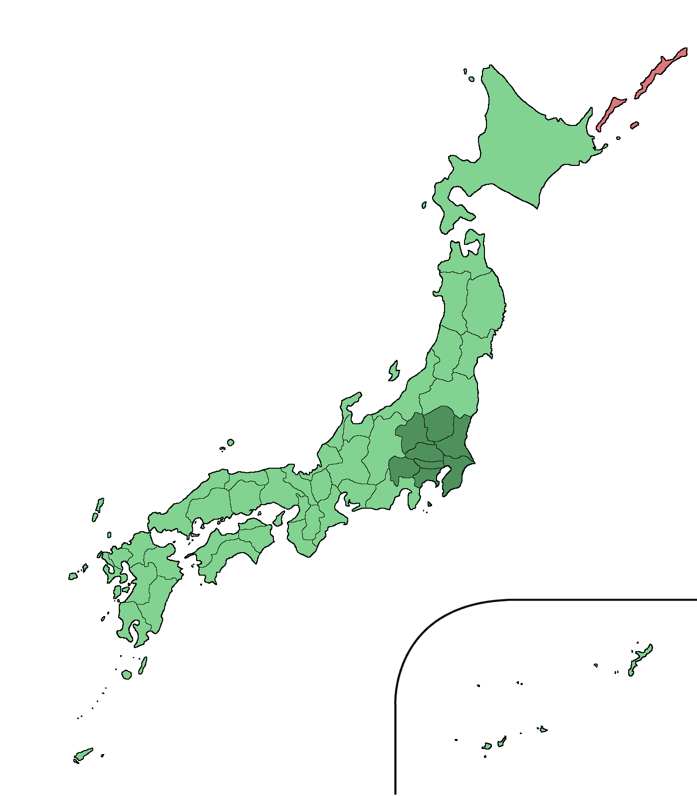

\[_This is one of the finalists in the 2023 book review contest, written by an ACX reader who will remain anonymous until after voting is done. I’ll be posting about one of these a week for several months. When you’ve read them all, I’ll ask you to vote for a favorite, so remember which ones you liked_\]  

\[这是2023年书评比赛的入围作品之一，由一位ACX读者撰写，在投票结束前将保持匿名。我将在几个月内每周发布一篇这样的文章。当你全部读完后，我会请你为最喜欢的作品投票，所以请记住你喜欢的作品。］

If you know Jane Jacobs at all, you know her for her work on cities. Her most famous book, published in 1961, is called _The Death and Life of Great American Cities_. It criticizes large-scale, top-down “urban renewal” policies, which destroy organic communities. Today almost everyone agrees with her on that, and she is considered one of the most influential thinkers on urban theory.  

如果你了解简-雅各布斯，你会知道她在城市方面的工作。她最有名的书出版于1961年，名为《美国大城市的死与生》。它批评了大规模的、自上而下的 "城市更新 "政策，这些政策破坏了有机社区。今天，几乎所有人都同意她的观点，她被认为是城市理论方面最有影响力的思想家之一。

This is not a review of _The Death and Life of Great American Cities_. Perhaps it would be, if I had become interested in Jane Jacobs’s ideas on cities like a normal person. But I didn’t: I started with two books that came to me by random chance, or fate, if you want to call it that.  

这不是对《美国伟大城市的死与生》的评论。如果我像普通人一样对简-雅各布斯的城市思想感兴趣的话，也许会是这样。但我没有：我是从两本书开始的，这两本书是随机出现在我面前的，或者说是命运，如果你想这么说的话。

The first book is _Cities and the Wealth of Nations: Principles of Economic Life_, first published in 1984. I found it, as it happens, in a city, more specifically in one of those public bookshelves where people give books away. A lucky find: my copy is somehow signed by Jane Jacobs herself. A friend said that although this book is read less often than _The Death and Life etc._, it actually contains the real gems from Jane Jacobs’s thought. So I was quite excited to read it, by which I mean that I kept the book on my bookshelf for more than a year before finally digging into it.   

第一本书是《城市与国富》：经济生活的原则》，首次出版于1984年。我是在一个城市里找到它的，更确切地说，是在人们送书的那种公共书架上。一个幸运的发现：我的副本不知为何有简-雅各布斯本人的签名。一个朋友说，虽然这本书比《死与生》等书更少被阅读，但它实际上包含了简-雅各布斯思想中真正的瑰宝。所以我读起来相当兴奋，我的意思是，我把这本书放在书架上一年多，最后才钻研它。

Mere days after I finished reading it, thinking it was indeed one of the best essays I’d ever read, I checked the same public bookshelf again. And lo! There was a second Jane Jacobs book: _The Question of Separatism: Quebec and the Struggle Over Sovereignty_.  

在我读完这本书仅仅几天后，认为这确实是我读过的最好的文章之一，我再次查看了同一个公共书架。瞧！有了第二本简-雅各布斯的书：分离主义的问题：魁北克和对主权的斗争。 

This book is Jacobs’s least read. It was published in 1980, right after the first referendum where Quebecers voted to remain a part of Canada. It is based on lectures that Jacobs (who was an American but had moved to Canada in 1968) gave in Toronto right _before_ the referendum. It’s not hard to guess why the book didn’t have a huge (read: any) impact. First, most people outside Quebec or Canada don’t have any reason to care. Second, the essay — which was written in English — argues _in favor_ of the secession of Quebec, which virtually no one among the English-speaking population of Canada agreed with. The natural reaction from Canada’s intelligentsia was to ignore the book altogether. Meanwhile, few people in Quebec itself read it, since the referendum was over; it wasn’t even translated into French until decades later.  

这本书是雅各布斯最不喜欢的书。它出版于1980年，就在魁北克人投票决定继续作为加拿大的一部分的第一次公投之后。这本书是根据雅各布斯（他是美国人，但在1968年移居加拿大）在公投前在多伦多的讲座编写的。不难猜测为什么这本书没有产生巨大（读作：任何）影响。首先，魁北克或加拿大以外的大多数人没有任何理由去关心。第二，这篇文章--是用英语写的--主张魁北克的分离，在加拿大的英语人口中几乎没有人同意。加拿大知识界的自然反应是完全无视这本书。同时，在魁北克本身也很少有人读到这本书，因为公投已经结束；甚至直到几十年后才被翻译成法语。

As a result, _The Question of Separatism_ sits awkwardly in Jane Jacobs’s bibliography, as if it were “a mistake in an otherwise brilliant career,” like I read somewhere. In a 2005 interview, one year before her death, Jacobs said that no journalist ever asked her about it.  

结果，《分离主义问题》在简-雅各布斯的书目中显得很尴尬，就像我在某处读到的那样，它是 "在一个本来很出色的职业生涯中的一个错误"。在2005年的一次采访中，也就是她去世前的一年，雅各布斯说，没有记者问过她这个问题。

But the book was not a mistake. I don’t claim any special insight here: Jane Jacobs herself said so in that same interview. She said that she would have written the same book in 2005, “because that’s the way it is in the world, and it still holds.” Besides, _The Question of Separatism_ is in fact not that much about the specifics of Quebec’s political situation, but rather about interesting generalities: what size means for countries and organizations, and why the fate of nations depends primarily on what happens in their cities.  

但这本书并不是一个错误。我在这里并不声称有什么特别的见解：简-雅各布斯自己在那次采访中也这么说。她说，如果是在2005年，她也会写同样的书，"因为世界上的情况就是这样，而且现在仍然是这样"。此外，《分离主义的问题》事实上并没有那么多关于魁北克政治局势的细节，而是关于有趣的一般情况：规模对国家和组织意味着什么，以及为什么国家的命运主要取决于其城市发生的事情。

Taken together with _Cities and the Wealth of Nations_, which Jacobs wrote a few years later to expand on those ideas, we get a coherent and deeply interesting philosophy of economics: one that favors the local scale, cities and small countries, antifragility long before Nassim Taleb coined the term, and avoiding grandstanding theories that always fail to take into account the real complexity of the world.  

与雅各布斯几年后为扩展这些观点而写的《城市与国富》放在一起，我们得到了一个连贯的、深刻有趣的经济学哲学：一个有利于地方规模、城市和小国的经济学哲学，早在纳西姆-塔勒布创造这个词之前就有反脆弱性，并避免总是不能考虑到世界的真正复杂性的宏大理论。

_Cities and the Wealth of Nations_ opens on an economic mystery.  

城市与国富》以一个经济之谜开篇。

“For a little while in the middle of this century,” writes Jacobs, “it seemed that the wild, intractable, dismal science of economics had yielded up something we all want: instructions for getting or keeping prosperity.” This was the 1940s to 1960s, and economists thought they had it all figured out. It was the golden age of high modernism and scientific technocracy. Everywhere from China to the Soviet Union to the United States and Britain and the nascent European Economic Community, leaders were coming up with elaborate plans, rooted in macroeconomic theories, that were supposed to guarantee future wealth and avoid economic crises.   

"雅各布斯写道："在本世纪中叶的一小段时间里，似乎疯狂的、棘手的、令人沮丧的经济学已经产生了我们都想要的东西：关于获得或保持繁荣的指示。"这是20世纪40年代到60年代，经济学家们认为他们已经弄清楚了一切。那是高度现代主义和科学技术主义的黄金时代。从中国到苏联，再到美国、英国和新生的欧洲经济共同体，各地的领导人都在想出精心设计的计划，这些计划植根于宏观经济理论，被认为可以保证未来的财富，避免经济危机的发生。

The theories had been developed by many thinkers over the previous two hundred years: Richard Cantillon, Adam Smith, John Stuart Mill, Karl Marx, John Maynard Keynes. Jacobs explains how they each had their own ideas of how the economy worked, disagreeing over things like whether supply or demand was the main driving mechanism, but they all agreed on a fundamental fact: inflation and unemployment have an inverse relationship to each other, like a seesaw. High inflation comes with low unemployment; high unemployment comes with low inflation, or even deflation when prices drop.  

这些理论是由许多思想家在过去两百年中发展起来的：理查德-坎蒂隆、亚当-斯密、约翰-斯图尔特-米尔、卡尔-马克思、约翰-梅纳德-凯恩斯。雅各布斯解释说，他们对经济如何运作都有自己的想法，在诸如供应还是需求是主要驱动机制的问题上存在分歧，但他们都同意一个基本事实：通货膨胀和失业有一个相反的关系，像一个跷跷板。高通货膨胀率伴随着低失业率；高失业率伴随着低通货膨胀率，甚至在价格下降时出现通货紧缩。

The Great Depression, a time of deflation, had provided proof of the seesaw. Big government projects, as prescribed by Keynesians, were a way for states to reduce unemployment and bring the seesaw back in a balanced state. Economists developed fancy models, based on historical data, to predict the behavior of the economy. The [Phillips curve](https://en.wikipedia.org/wiki/Phillips_curve) in particular became popular.   

大萧条，一个通货紧缩的时代，为跷跷板提供了证明。凯恩斯主义者规定的大政府项目，是国家减少失业和使跷跷板回到平衡状态的一种方式。经济学家们根据历史数据，开发了花哨的模型来预测经济的行为。特别是菲利普斯曲线开始流行。

It was the golden age of technocracy; it was the triumph of high modernism. From now on wealth was assured, because we weren’t blind anymore: we had the curves.   

那是技术主义的黄金时代；那是高度现代主义的胜利。从现在开始，财富是有保障的，因为我们不再是盲人：我们有了曲线。

And yet — by the 1970s and 1980s, when Jane Jacobs was writing, the theories all stopped working. There was high inflation _and_ high unemployment. People called it stagflation. Keynesian advisers in various governments were devastated: either their ideas were wrong, or they were applying them wrong. Economists such as Milton Friedman, from a rival school of economists called the monetarists or the Chicago school, came to the rescue — but their remedy, Jacobs believes, only made things worse. Whatever governments did to increase employment made inflation worse; whatever they did to attenuate inflation killed employment. The seesaw from the theories was working in application, even though it didn’t explain reality anymore. Stagflation was not supposed to exist, so stagflation could not be fought.  

然而--到了20世纪70年代和80年代，当简-雅各布斯在写作时，这些理论都不再起作用。出现了高通货膨胀和高失业率。人们称它为滞胀。各地政府的凯恩斯主义顾问们大受打击：要么他们的想法是错误的，要么他们的应用是错误的。米尔顿-弗里德曼(Milton Friedman)等经济学家，来自一个被称为货币主义者或芝加哥学派的敌对学派，前来救援--但雅各布斯认为，他们的补救措施只会让事情变得更糟。无论政府做什么来增加就业，都会使通货膨胀恶化；无论他们做什么来减少通货膨胀，都会扼杀就业。理论中的跷跷板在应用中是有效的，尽管它已经不能解释现实。滞胀是不应该存在的，所以滞胀是不可能被打击的。

At this point we’re near the end of Chapter 1, the densest part of the book. Jacobs has artfully guided us along economic history and laid out the mystery for us. What’s going on? we wonder. How are we supposed to deal with the two-headed monster of stagflation, if all economists are stumped?  

此时，我们已接近第一章的尾声，这是本书最密集的部分。雅各布斯巧妙地引导我们沿着经济史前进，为我们揭开了谜底。我们不禁要问，这到底是怎么回事？如果所有的经济学家都束手无策，我们该如何应对滞胀这个双头怪物呢？

Then Jacobs, in a masterstroke, flips the whole thing over. I was impressed enough that I would have inserted a spoiler alert here, if it didn’t feel so silly putting a spoiler alert in an essay on economics.  

然后，雅各布斯以大手笔将整个事情翻转过来。我印象深刻，以至于我想在这里插入一个扰流警报，如果不是觉得在一篇关于经济学的文章中加入扰流警报很傻的话。

Stagflation is not a strange monster from legend. It is, Jacobs says, just the normal state of everything. Backward economies are in fact constantly in a state of stagflation. The prices in a poor country like Portugal or India (her two examples) feel low for an American or Canadian, but they’re high for most Portuguese or Indian people. At the same time, Portugal and India provide too few jobs to their residents. Inflation and unemployment are both perennially high, and none of that feels surprising whatsoever.   

滞胀不是传说中的奇怪怪物。雅各布斯说，它只是一切事物的正常状态。落后经济体实际上一直处于滞胀状态。像葡萄牙或印度这样的穷国（她的两个例子）的价格对美国人或加拿大人来说感觉很低，但对大多数葡萄牙人或印度人来说却很高。同时，葡萄牙和印度为其居民提供的就业机会太少。通货膨胀和失业率都常年居高不下，而这一切都不令人感到惊讶。

Stagflation, in short, is just good ol’ poverty. All these fancy economists, from Cantillon in 1700s France to Keynes and Friedman in the 20th century Anglosphere, were thinking and writing about unusual places: rich countries that were undergoing fast economic development. They were making the classic mistake of treating poverty as a mystery and wealth as a given, when in fact poverty is the normal order of things and wealth, when it does occur, is what warrants an explanation. The result is that we don’t really know how to fix the economy of poor countries, nor do we know how to deal with decline in rich countries, whether we call it stagflation or something else.  

滞胀，简而言之，就是良好的贫困。所有这些花哨的经济学家，从17世纪法国的坎蒂龙到20世纪英国的凯恩斯和弗里德曼，都在思考和书写不寻常的地方：正在经历快速经济发展的富裕国家。他们犯了一个典型的错误，即把贫穷当作一个谜，而把财富当作一个给定的东西，事实上，贫穷是事物的正常秩序，而财富，当它确实发生时，是值得解释的东西。其结果是，我们并不真正知道如何解决穷国的经济问题，也不知道如何处理富国的衰退问题，无论我们称之为滞胀还是其他什么。

Jacobs derives from this a pretty damning view of macroeconomics. It is to her a science that has failed again and again, each time engulfing the equivalent of billions of dollars in wasted wealth. “We must,” she writes at the close of Chapter 1, “find more realistic and fruitful lines of observation and thought than we have tried to use so far. It is bootless to choose among existing schools of thought. We are on our own.”  

雅各布斯由此得出了对宏观经济学相当不利的看法。对她来说，这是一门一再失败的科学，每次都吞噬了相当于数十亿美元的浪费的财富。"她在第一章的结尾写道："我们必须找到比我们迄今为止试图使用的更现实和更有成效的观察和思考方法。在现有的思想流派中进行选择是没有用的。我们只能靠自己"。

Fortunately, she has some ideas.   

幸运的是，她有一些想法。

The original sin of macroeconomics, Jacobs believe, is to treat sovereign countries, or nations, as the main unit of economic analysis.   

雅各布斯认为，宏观经济学的原罪是将主权国家或民族作为经济分析的主要单位。

This error, she claims, goes back to mercantilism, one of the first formal economic policies. Oversimplified, mercantilism states that wealth is synonymous with the amount of gold and silver in a nation’s treasury. This makes nations the main unit of economic analysis by definition. It’s a tautology — and one that was somehow embedded so deep in economic thinking that even the non-mercantilist Adam Smith would eventually choose, for his masterpiece of economic theory, the title _An Inquiry into the Nature and Causes of the Wealth of **Nations**_. Today, even though mercantilism has long been obsolete, we perpetuate the same tautology whenever we talk of the Gross Domestic Product or look at the very nice charts from [Our World in Data](https://ourworldindata.org/), which for the most part allow only one level of resolution: sovereign countries.  

她声称，这个错误可以追溯到重商主义，这是最早的正式经济政策之一。重商主义过于简单，认为财富是一个国家国库中黄金和白银数量的同义词。根据定义，这使得国家成为经济分析的主要单位。这是一个同义反复--而且这个同义反复在经济思维中如此深入，甚至连非重商主义的亚当-斯密也最终为他的经济理论杰作选择了《国富论的性质和原因探究》这一标题。今天，尽管重商主义早已过时，但每当我们谈论国内生产总值或看《我们的数据世界》中非常漂亮的图表时，我们都会延续同样的同义词，这些图表在大多数情况下只允许一个层次的分辨率：主权国家。

Of course, nations are an economically important concept because of that one property: they are sovereign, and therefore they write laws and implement policies that affect the economy. These policies can be productively compared. But that’s about it — for everything else, nations aren’t the right way to think about wealth.   

当然，国家在经济上是一个重要的概念，因为有这样一个属性：它们是主权国家，因此它们制定法律和实施政策，影响经济。这些政策可以进行有效的比较。但仅此而已--就其他方面而言，国家并不是思考财富的正确方式。

One reason is simply that they’re very different from one another: “it affronts common sense,” Jacobs writes, “to think of units as disparate as, say, Singapore and the United States, or Ecuador and the Soviet Union, or the Netherlands and Canada, as economic common denominators.” I would add that countries are arbitrary and changing: when the Soviet Union was replaced by 15 sovereign countries, the economic reality didn’t suddenly reshape itself to match the new borders. Lastly, nations contain, under the hood, many sub-economies that are _also_ highly different from one another.   

其中一个原因是，它们彼此之间非常不同："雅各布斯写道："把新加坡和美国、厄瓜多尔和苏联、荷兰和加拿大这样不同的单位看作是经济上的共同点，这有悖于常识"。我想补充的是，国家是任意的和不断变化的：当苏联被15个主权国家取代时，经济现实并没有突然重新塑造自己以匹配新的边界。最后，国家包含了许多子经济，这些子经济彼此之间也有很大不同。

None of that is secret or forbidden knowledge. Everyone has always been aware that New York City, or Milan, are economically very different from rural Mississippi or Sicily. But I find that it’s far easier to think in terms of “the United States” or “Italy,” especially when you’re not from there. Nations are an abstraction of real-life complexity, and are accordingly very tempting to use.   

这些都不是秘密或禁忌的知识。每个人都一直知道，纽约市或米兰在经济上与密西西比或西西里的农村有很大不同。但我发现，用 "美国 "或 "意大利 "来思考要容易得多，尤其是当你不是来自那里的时候。国家是对现实生活复杂性的抽象，因此非常诱人。

Also, they’re often the entities that collect statistics, which is another difficult-to-resist temptation for anyone who likes quantitative data.  

另外，他们往往是收集统计数据的实体，这对喜欢量化数据的人来说是另一个难以抵挡的诱惑。

If nations aren’t the best unit to analyze the economy, what is? This is a Jane Jacobs book, so the answer is obviously going to be cities.  

如果国家不是分析经济的最佳单位，那么什么才是？这是一本简-雅各布斯的书，所以答案显然会是城市。

Jacobs doesn’t actually give a clear argument why. Maybe that was in her previous book, _The Economy of Cities_. So far as I can see, her reasoning is, ironically, a bit tautological: “all developing economic life depends on city economies; it depends on them by definition because, wherever economic life is developing, the very process itself creates cities and has probably always done so.”   

雅各布斯实际上并没有给出一个明确的论据，为什么？也许那是在她以前的书《城市经济》中。在我看来，她的推理具有讽刺意味，有点同义反复："所有发展中的经济生活都依赖于城市经济；根据定义，它依赖于城市经济，因为无论经济生活在哪里发展，这个过程本身就创造了城市，而且可能一直如此。"

But so far as I can see, this reasoning is correct. Cities concentrate people, and therefore economic life, and therefore economic power. The driving force for all this is a phenomenon that, from what I gather, was discovered by Jacobs when she wrote _The Economy of Cities_: [import replacement](https://en.wikipedia.org/wiki/Import_replacement).   

但就我所见，这种推理是正确的。城市集中了人，因此也集中了经济生活，因此也集中了经济力量。据我所知，这一切的驱动力是雅各布斯在写《城市经济》时发现的一个现象：进口替代。

Consider, say, Boston back when it was a tiny settlement, not yet a city, in colonial times. At first, Boston didn’t produce much, especially not much that would be of interest to its main trading partner, London. It exported some natural resources: timber, fish. Whatever else the Bostonians needed, they needed to import it from other cities, again mostly London. (Remember to think of imports and exports in terms of cities, not nations.) For instance, at first, all metal tools in Boston came from European cities, and were paid for by the revenue from selling the timber and fish.   

考虑一下，比如说，波士顿在殖民时期还是一个小小的定居点，还不是一个城市。起初，波士顿并不生产很多东西，尤其是对其主要贸易伙伴伦敦感兴趣的东西不多。它出口一些自然资源：木材、鱼类。无论波士顿人需要什么，他们都需要从其他城市进口，同样主要是伦敦。(例如，起初，波士顿的所有金属工具都来自欧洲城市，并由出售木材和鱼的收入支付。

Then, one day, some Bostonians decided to build an ironworks and make metal tools themselves. (Pictured: a reconstruction of the Saugus Iron Works, established 1646.)  

然后，有一天，一些波士顿人决定建立一个铁厂，自己制造金属工具。(图为：1646年建立的索格斯铁厂的重建图）。

This wasn’t of any interest to London or other European cities. The Bostonians weren’t nearly as good or efficient at making metal tools as Londonians were. So Boston couldn’t export the metal tools back to Europe — but it could use them internally, and also export them to other American cities that were about as poor as Boston was, or poorer. Internally, this meant the spark of a manufacturing economy in Boston, as easily obtained metal parts made it easier for other Bostonians to replace _other_ imports from European cities, and eventually develop a symbiotic network of industries. It also meant that the revenue from fish and timber could be used to import new things, including new innovations from European cities (which would later become opportunities for more import replacement). And because there were customers for Boston-made metal goods in New York and Philadelphia, and eventually Cincinnati and Chicago and Pittsburgh as these cities came into existence, it meant additional revenue for Boston that it could reinvest into developing its production further.   

这对伦敦或其他欧洲城市没有任何意义。波士顿人在制造金属工具方面的能力和效率远不如伦敦人。因此，波士顿无法将金属工具出口到欧洲--但它可以在内部使用这些工具，也可以将它们出口到与波士顿一样贫穷的其他美国城市，甚至更贫穷。就内部而言，这意味着波士顿制造业经济的火花，因为容易获得的金属零件使其他波士顿人更容易取代从欧洲城市进口的其他产品，并最终发展出一个共生的产业网络。这也意味着来自鱼类和木材的收入可以用来进口新的东西，包括来自欧洲城市的新的创新（这将成为后来更多进口替代的机会）。由于纽约和费城有波士顿制造的金属制品的客户，最终辛辛那提、芝加哥和匹兹堡也随着这些城市的出现而出现，这意味着波士顿的额外收入，它可以重新投资于进一步发展其生产。

For Jacobs, virtually all city development can be seen through the lens of import replacement (which, to be clear, has approximately nothing to do with policies of [import substitution industrialization](https://en.wikipedia.org/wiki/Import_substitution_industrialization); import replacement is not a policy, but a naturally arising free market phenomenon). Her book contains many other examples than Boston, such as Venice, which started off in the early Middle Ages as a small town that sold salt to Constantinople, but then diversified its production to become one of the wealthiest cities of its time; or Taipei and Kaohsiung, two cities in Taiwan that kickstarted their development not long before the 1980s, by forcing expropriated landlords to invest into local import-replacing businesses. One is reminded of [Scott’s review of](https://astralcodexten.substack.com/p/book-review-how-asia-works) _[How Asia Works](https://astralcodexten.substack.com/p/book-review-how-asia-works)_.  

在雅各布斯看来，几乎所有的城市发展都可以通过进口替代的视角来看待（说白了，这与进口替代工业化的政策大约没有关系；进口替代不是一项政策，而是一种自然产生的自由市场现象）。她的书中还有许多其他例子，比如威尼斯，它在中世纪早期只是一个向君士坦丁堡卖盐的小镇，但后来实现了生产的多样化，成为当时最富有的城市之一；或者台北和高雄，台湾的两个城市在20世纪80年代前不久通过强迫被征用的地主向当地的进口替代企业投资而启动了它们的发展。这让人想起斯科特对《亚洲如何运作》的评论。

Import replacement, then, is what makes cities economically powerful. And this power is so great that it causes ripples in distant places. In fact it is the main reason that anything happens at all in non-city areas.   

那么，进口替代是使城市具有经济实力的原因。这种力量是如此之大，以至于它在遥远的地方引起了涟漪。事实上，它是在非城市地区发生任何事情的主要原因。

Jacobs gives the example of [Bardou](https://en.wikipedia.org/wiki/Bardou,_H%C3%A9rault), a small village in southern France. Bardou looks like this:  

雅各布斯举了法国南部的一个小村庄巴杜的例子。巴尔杜看起来像这样：

To the extent that Bardou ever had an economic life, that life was almost entirely driven by distant cities. In ancient times, the area was populated because of iron mines nearby. The mines were exploited to serve the needs of people in the distant cities of Lugdunum (Lyon), Nemausus (Nîmes), or even Rome. As Jacobs notes, we could say that the mines served “the Roman Empire,” but that would be another example of using the abstraction of sovereign countries when we should instead be specific. It was Lugdunum, Nemausus and Rome that wanted the iron — not some random rural area of the empire, and certainly not the part of the empire in which Bardou was located.   

就巴杜曾经有过的经济生活而言，这种生活几乎完全是由遥远的城市推动的。在古代，该地区之所以有人居住是因为附近有铁矿。铁矿的开采是为了满足远方城市Lugdunum（里昂）、Nemausus（尼姆）甚至罗马的人们的需求。正如雅各布斯所指出的，我们可以说这些矿场为 "罗马帝国 "服务，但这将是使用主权国家这一抽象概念的另一个例子，而我们应该具体地说出来。想要铁的是卢格杜努姆、内马乌斯和罗马--而不是帝国的某个随机农村地区，当然也不是巴杜所在的帝国的一部分。

Eventually the mines and the region were abandoned. More than 1,000 years later, peasants moved into the area and built the modern village. For centuries they lived a wretchedly poor life of subsistence farming. No cities exerted any influence on it, and indeed nothing happened. Then, in the 19th century, the people of Bardou learned that they could improve their situation by moving to distant cities such as Paris, and most of them did. Again, the force wasn’t being exerted by “France”; Bardou was already part of France. The force was specifically being exerted by Paris and other cities with jobs for poor peasants.   

最终，矿场和该地区被放弃了。1000多年后，农民迁入该地区并建立了现代村庄。几个世纪以来，他们过着可怜的自给自足的农业生活。没有城市对它施加任何影响，事实上也没有发生任何事情。然后，在19世纪，巴杜的人们了解到，他们可以通过迁移到巴黎等遥远的城市来改善他们的处境，而且他们中的大多数人都这样做了。同样，这种力量不是由 "法国 "施加的；巴杜已经是法国的一部分。这股力量是由巴黎和其他为贫困农民提供工作机会的城市特别施加的。

By the 1960s, only one old man was left. That’s when two foreign visitors, a German and an American, happened upon the village, decided to buy most of it, revitalized it, and turned it into a tourist spot (and even, for a brief time, into a set for a movie company). Today Bardou is a popular place for travelers — who are mostly city people, and spend money that was mostly earned in cities.   

到了20世纪60年代，只剩下一个老人了。这时，两个外国游客，一个德国人和一个美国人，偶然发现了这个村庄，决定买下它的大部分，振兴它，并把它变成一个旅游景点（甚至在短暂的时间内，成为一家电影公司的拍摄地）。今天，巴杜是一个深受旅行者欢迎的地方--他们大多是城市人，花的钱大多是在城市赚来的。

The Bardou story contains examples of several of the forces that import-replacing cities radiate, according to Jacobs. These forces are central to her thinking. There are five of them:   

雅各布斯认为，巴杜的故事包含了取代进口的城市所辐射的几种力量的例子。这些力量是她思想的核心。其中有五种：

-   **Markets**. Cities house a lot of people who need a lot of goods and services, and are therefore strong markets to sell goods and services to. This was the force that acted on the Bardou area when it was a Roman mining region, and again today when it functions as a tourist spot for city vacationers.   
    
    市场。城市里有很多人，他们需要大量的商品和服务，因此是销售商品和服务的强大市场。当巴杜地区还是罗马人的采矿区时，这就是作用于巴杜地区的力量，今天当它作为城市度假者的旅游点时，又是如此。
    
-   **Jobs**. Prosperous cities tend to attract people from elsewhere who come for work, which is what depopulated Bardou in the 19th and 20th centuries.  
    
    工作。繁荣的城市往往会吸引来自其他地方的人前来工作，这就是19和20世纪巴杜人口减少的原因。
    
-   **Technology**. New things are disproportionately invented in cities, and only later do they affect other regions. Bardou received a windfall when the movie company rented it for location shots; that would obviously not have been possible before movie technology was invented.  
    
    技术。新事物在城市的发明不成比例，后来才影响到其他地区。当电影公司租用巴杜进行外景拍摄时，巴杜获得了一笔意外之财；这在电影技术发明之前显然是不可能的。
    
-   **Transplants**. Sometimes cities send transplanted factories to other regions. (I don’t think that happened to Bardou.)  
    
    移植。有时城市会把移植的工厂送到其他地区。(我不认为这发生在巴豆身上)。
    
-   **Capital**. Cities can provide money directly to other regions, for instance as subsidies, loans, or development grants. I’m guessing that Bardou received some assistance from the French national or regional governments at some point.  
    
    资本。城市可以直接向其他地区提供资金，例如，作为补贴、贷款或发展赠款。我猜测，巴杜在某个时候得到了法国国家或地区政府的一些援助。
    

These five forces determine pretty much everything that happens in rural regions. We can distinguish at least seven types of these regions, depending on which forces act upon them.  

这五种力量几乎决定了在农村地区发生的一切。我们至少可以将这些地区区分为七种类型，这取决于哪些力量作用于它们。

When the five forces act together in a reasonably balanced manner, this creates a type of rural area that Jacobs calls a **city region**. This is a confusing name, because it absolutely does _not_ mean “any region around a city,” nor does it mean “suburbs.” We know this because Jacobs spends several pages telling us which cities have a city region and which don’t. For instance, Tokyo has a city region, the largest in the world as of 1984, but Sapporo, in northern Japan, doesn’t. Boston, Paris, Milan, and Taipei do; Atlanta, Marseille, Naples, or Manila don’t.   

当这五种力量以一种合理平衡的方式共同作用时，这就创造了一种农村地区，雅各布斯称之为城市地区。这是一个令人困惑的名字，因为它绝对不是指 "城市周围的任何区域"，也不是指 "郊区"。我们知道这一点，因为雅各布斯花了几页纸告诉我们哪些城市有城市区域，哪些没有。例如，东京有一个城市区域，截至1984年是世界上最大的城市，但日本北部的札幌却没有。波士顿、巴黎、米兰和台北有；亚特兰大、马赛、那不勒斯或马尼拉没有。

A city region, in Jacobs’s terms, is the rural hinterland around a city that gets “radically reshaped” by that city’s economy. It contains a mix of productive farms, prosperous satellite towns, and factories that have moved out of the city, forming a symbiotic network of commercial and industrial enterprises. City regions “are the richest, densest, and most intricate of all types of economies except for cities themselves,” she writes. They arise thanks to the interplay between the five forces.   

用雅各布斯的话说，城市区域是一个城市周围的农村腹地，它被该城市的经济 "彻底地重塑 "了。它包含了生产性农场、繁荣的卫星城镇和迁出城市的工厂，形成一个商业和工业企业的共生网络。她写道："除了城市本身，城市地区是所有经济类型中最丰富、最密集和最复杂的。它们的出现得益于五种力量之间的相互作用。

In another of her wonderfully told examples, Jacobs summarizes a book about Shinohata, a real Japanese village (but with a fake name, for anonymity) on the outskirts of the Tokyo area. In the post-war era, Tokyo was expanding rapidly, and so was its city region, eventually reaching Shinohata in the 1950s. Before, most families in the village lived from subsistence farming and exported a little bit of silk to distant places. Almost no one moved out to Tokyo or other cities. But after 1955, the markets, jobs, technology, transplants, and capital from the city all came bearing upon Shinohata at the same time, totally transforming it.  

在她讲述的另一个精彩的例子中，雅各布斯总结了一本关于Shinohata的书，这是一个真实的日本村庄（但为了匿名，用的是假名字），位于东京地区的郊区。在战后时代，东京正在迅速扩张，其城市区域也在迅速扩张，最终在20世纪50年代达到了Shinohata。以前，村里的大多数家庭靠自给自足的农业生活，并向远方出口一点丝绸。几乎没有人搬到东京或其他城市。但在1955年之后，市场、工作、技术、移植和来自城市的资本都同时来到了筱畑，完全改变了它。

The growing city markets meant that most families could switch to new cash crops and make more money. New jobs were opening up in Tokyo for the sons and daughters of Shinohata, many of whom left — prompting the remaining farmers to buy labor-saving equipment, which made productivity soar. Soon, a large food processing factory was transplanted into the village, providing additional jobs and money and causing a variety of smaller businesses to pop up in the area. After a typhoon disaster in 1959, a recovery grant from the government — an example of city capital — was put to good use by providing much needed excavation work and infrastructure development.  

不断增长的城市市场意味着大多数家庭可以改种新的经济作物，赚取更多的钱。筱畑的儿子和女儿们在东京找到了新的工作，其中许多人离开了东京--这促使剩下的农民购买节省劳动力的设备，从而使生产力飙升。不久，一家大型食品加工厂被移植到村里，提供了额外的工作和资金，并导致各种小型企业在该地区涌现。在1959年的一场台风灾害后，政府提供的恢复拨款--城市资本的一个例子--通过提供急需的挖掘工作和基础设施建设得到了很好的利用。

Shinohata is in Tochigi Prefecture, but I couldn’t figure out what its real name is. In any case, it is part of the vast Greater Tokyo Area, a region that combines the largest city in the world with large tracts of rural land, and occupies a disproportionate space in Japan’s demographics and national economy.  

筱畑位于枥木县，但我搞不清楚它的真实名称是什么。无论如何，它是广阔的大东京地区的一部分，这个地区结合了世界上最大的城市和大片的农村土地，在日本的人口和国民经济中占据了不成比例的空间。

Rural regions far from import-replacing cities are generally less lucky. Their plights take different forms, depending on which of the five forces dominates the others.  

远离进口替代城市的农村地区通常没有那么幸运。他们的困境有不同的形式，取决于这五种力量中的哪一种主导了其他力量。

-   An oversized market force creates a **supply region**: a place that exploits agricultural or natural resources and exports them to distant cities. These regions (the most common in the world) can be rich or poor, but they’re never economically dynamic — and they’re very sensitive to disturbances in the markets that they serve. Jacobs’s example is Uruguay, a country that grew rich selling animal products to European cities in the early 20th century, but then suffered immensely when the market changed in the 1950s, propelling the nation into a succession of economic crises.   
    
    一个过大的市场力量创造了一个供应区域：一个开采农业或自然资源并将其出口到遥远的城市的地方。这些地区（世界上最常见的）可以是富裕的，也可以是贫穷的，但它们在经济上从来都是充满活力的--而且它们对它们所服务的市场的干扰非常敏感。雅各布斯的例子是乌拉圭，这个国家在20世纪初向欧洲城市出售动物产品而致富，但在20世纪50年代市场发生变化时遭受了巨大的损失，将这个国家推入了一系列的经济危机。
    
-   An oversized jobs force creates a **region workers abandon**. When workers leave to work in distant cities, they improve their own situation, but their region of origin stagnates. This is true even if the workers send remittances, as in her main example, the town of Napizaro in rural Mexico. Most men from Napizaro work hundreds of kilometers north, in the factories of the dynamic city of Los Angeles. Even though they send back a lot of money to their families in Napizaro, Napizaro is never able to develop, because it imports everything it consumes and doesn’t replace those imports.   
    
    过大的就业队伍创造了一个工人放弃的地区。当工人离开到遥远的城市工作时，他们改善了自己的状况，但他们的原籍地区却停滞不前。即使工人汇款也是如此，就像她的主要例子，墨西哥农村的纳皮扎罗镇。大多数来自纳皮扎罗的男人在北方数百公里外的充满活力的洛杉矶市的工厂工作。尽管他们给在纳皮扎罗的家人寄回了很多钱，但纳皮扎罗始终无法发展，因为它所消费的一切都要靠进口，而且没有替代这些进口。
    
-   An oversized technology force creates a **clearance region**. The example here is the Scottish Highlands, where a technological innovation was introduced in the late 18th century: a new breed of sheep. (Technically this was a rural invention, but the introduction to Scotland was devised by businessmen in London.) The new sheep greatly improved the yields from the land, but at the cost of violently displacing a large number of poor tenant farmers to make room for pastures. So it goes for other technologies, like farm machinery: when they are introduced to a poor rural region that isn’t integrated into an import-replacing economy, they just replace workers and leave them idle, poorer than before, or forced to emigrate.   
    
    超大的技术力量创造了一个通关区域。这里的例子是苏格兰高地，那里在18世纪末引入了一项技术革新：一种新的绵羊品种。(从技术上讲，这是一项农村发明，但引进苏格兰是由伦敦的商人设计的）。新的羊群极大地提高了土地的产量，但代价是为了给牧场腾出空间，大量贫穷的佃农被暴力驱赶。其他技术也是如此，比如农业机械：当它们被引进到没有融入进口替代经济的贫穷农村地区时，它们只是取代了工人，让他们无所事事，比以前更穷，或者被迫移民。
    
-   An oversized transplant force creates a **transplant economy**: a place that depends on industries that it did not generate itself. Getting a transplanted factory is always tempting for the governments of poor regions. But while the new jobs do alleviate poverty, transplants almost never lead to durable economic development (with rare exceptions, such as Taiwan). Jacobs has multiple examples, but the one I like most is Iran just before the revolution, when the Shah used oil money to buy a helicopter factory from the United States — thereby spurring a lot of development in the United States, where many companies got involved in building the factory, and almost none in Iran.  
    
    过大的移植力量造成了移植经济：一个地方依赖它自己没有产生的产业。对于贫困地区的政府来说，获得移植的工厂总是很诱人的。但是，虽然新的工作机会确实能缓解贫困，但移植几乎从未带来持久的经济发展（只有极少数例外，如台湾）。雅各布斯有多个例子，但我最喜欢的是革命前的伊朗，当时伊朗国王用石油资金从美国购买了一家直升机工厂--从而刺激了美国的大量发展，许多公司参与了工厂的建设，而在伊朗几乎没有。
    
-   Finally, an oversized capital force creates an **artificial city region**. In the US, the Tennessee Valley Authority was a Depression Era program to develop a poor region using federal government money. The hydroelectric dams and other infrastructure that the money bought seemed to be great successes at first, and to be sure they did reduce poverty. But problems later appeared, and today the region isn’t particularly dynamic, in addition to being riddled with environmental issues. Jacobs explains that the federal aid could never truly help, because the Tennessee Valley has always lacked an import-replacing city. Subsidies, grants, and loans give at best the illusion of development.  
    
    最后，过大的资本力量创造了一个人造的城市区域。在美国，田纳西河谷管理局是大萧条时期的一个项目，利用联邦政府的资金发展一个贫困地区。这些钱买来的水电大坝和其他基础设施一开始似乎是巨大的成功，而且可以肯定的是，它们确实减少了贫困。但后来问题出现了，今天这个地区并不特别有活力，而且还充斥着环境问题。雅各布斯解释说，联邦援助永远无法真正帮助，因为田纳西河谷一直缺乏一个替代进口的城市。补贴、赠款和贷款最多只能给人以发展的假象。
    

None of these five types of rural regions tend to do great in the long run, unless they manage to generate an import-replacing city. But at least they receive _something_ from distant cities. It’s far worse when a region is untouched by city forces at all, as Bardou was for a long time. Or as was a hamlet in North Carolina that Jacobs calls “Henry” for anonymity reasons, but which we can safely reveal to be [Higgins](https://en.wikipedia.org/wiki/Higgins,_North_Carolina), in the Appalachian region. Here is what Higgins looked like in 2013 on Google Street View:  

从长远来看，这五种类型的农村地区都不会有大的发展，除非它们能够产生一个替代进口的城市。但至少他们能从遥远的城市获得一些东西。如果一个地区完全没有受到城市力量的影响，情况就会更糟，就像巴杜有很长一段时间是这样。或者像北卡罗来纳州的一个小村庄一样，雅各布斯出于匿名的原因称其为 "亨利"，但我们可以安全地揭示它是阿巴拉契亚地区的希金斯。这是2013年希金斯在谷歌街景中的模样：

There is a nice modern road in that screenshot, but between its 18th-century founding and the 1920s, there wasn’t even a path that a horse-drawn wagon could use, and so Higgins was extremely isolated. It barely sold anything to anyone outside, and accordingly imported very little. The people lived from subsistence farming. Their lives were so difficult, so focused on sheer survival, that they gradually forgot many of the skills and techniques that their British ancestors had, like candle making, weaving from a loom, and even masonry. When Jacobs’ aunt arrived as a Presbyterian missionary in 1922, and suggested that they build a church out of stone, the people of Higgins confidently stated that this was impossible: mortar just wasn’t strong enough. “These people came of a parent culture that had not only reared stone parish churches from time immemorial, but great cathedrals,” Jacobs writes, and yet eventually they forgot that stone buildings were a possibility at all.   

在那张截图中，有一条漂亮的现代道路，但在18世纪建国到20世纪20年代之间，甚至没有一条马车可以使用的道路，因此希金斯是极其孤立的。它几乎不向外界出售任何东西，因此进口也很少。人们靠自给自足的农业生活。他们的生活是如此艰难，如此专注于纯粹的生存，以至于他们逐渐忘记了他们的英国祖先所拥有的许多技能和技术，如制作蜡烛、用织布机织布，甚至泥瓦匠。当雅各布斯的姨妈在1922年作为长老会传教士来到这里，并建议他们用石头建造教堂时，希金斯的人们自信地表示这是不可能的：砂浆就是不够坚固。雅各布斯写道："这些人来自母体文化，自古以来，他们不仅建造了石头教区教堂，还建造了伟大的大教堂，"然而，最终他们忘记了石头建筑是一种可能性。

Such is the fate of regions that get cut off from cities. Jacobs calls them **bypassed places**. Sometimes these places are entire countries, such as Ethiopia, once the seat of an empire, but which as of the 1980s had barely any links to cities except its own backward ones. Unsurprisingly, Ethiopia has high prices (for Ethiopians) and too few jobs. That will always be so, unless one of its cities can start the process of import replacement.  

这就是那些与城市隔绝的地区的命运。雅各布斯称它们为被绕过的地方。有时，这些地方是整个国家，例如埃塞俄比亚，曾经是一个帝国的所在地，但截至20世纪80年代，除了它自己的落后城市，几乎没有任何与城市的联系。不出所料，埃塞俄比亚的物价很高（对埃塞俄比亚人来说），工作机会太少。除非它的某个城市能够启动进口替代的进程，否则情况将永远如此。

That was roughly the first half of the book. After that, Jane Jacobs discusses various consequences of her theory, including why decline happens and how we can, in theory, prevent it. We’ll get there — but first, it’s time for a detour through the other book, _The Question of Separatism_, which provides a great case study of Jacobs’s ideas.  

这大概是该书的前半部分。之后，简-雅各布斯讨论了她的理论的各种后果，包括为什么会发生衰退，以及在理论上我们如何能够防止它。我们会到达那里--但首先，是时候绕过另一本书《分离主义问题》，它为雅各布斯的思想提供了一个很好的案例研究。

After an introductory chapter in which Jacobs acknowledges that separatism always makes everyone emotional, and warns that she’s going to study it in a dispassionate manner anyway, she starts by describing the issues in Quebec and Canada through a specific lens. You can probably guess which lens. That’s right — cities. To her, the question of Quebec separatism is primarily the question of how the two main cities in Canada, Toronto and Montreal, have coexisted and will coexist in the future.   

在介绍性章节中，雅各布斯承认分离主义总是让每个人情绪激动，并警告说她无论如何要以冷静的方式研究它，之后她开始通过一个特定的镜头描述魁北克和加拿大的问题。你可能能猜到是哪个镜头。没错，就是城市。对她来说，魁北克分离主义的问题主要是加拿大的两个主要城市--多伦多和蒙特利尔--如何共存以及未来如何共存的问题。

At this point you need at least a basic understanding of Canadian history. Here’s a quick primer, focusing on those two cities.   

在这一点上，你至少需要对加拿大历史有一个基本的了解。这里有一个快速入门，重点是这两个城市。

Canada, a word that used to refer to the large valley around the St. Lawrence river and the Great Lakes, was originally a colony of the Kingdom of France. Then the Kingdom of Great Britain conquered it in 1760. For various reasons, most of the French settlers stayed in Canada rather than emigrating to France or being deported, so at first, a small British elite ruled over a mostly French-speaking and Catholic colony. However, immigration from the British Isles, as well as from the newly seceded United States (loyalists who wanted to live in a monarchy rather than a republic for some reason) eventually tipped the linguistic and cultural balance. The population sorted itself such that the lower part of the valley (what is now Quebec) remained French, while the upper part (what is now Ontario) became English.   

加拿大，这个词曾经指的是圣劳伦斯河和五大湖周围的大山谷，最初是法国王国的殖民地。然后大不列颠王国在1760年征服了它。由于各种原因，大多数法国定居者留在加拿大，而不是移民到法国或被驱逐出境，所以起初，一小部分英国精英统治着这个大部分讲法语和天主教的殖民地。然而，来自英伦三岛以及新分离的美国的移民（出于某种原因，他们希望生活在君主制而不是共和国）最终使语言和文化平衡发生了变化。人口的分类使山谷的下半部分（即现在的魁北克）保持法语，而上半部分（即现在的安大略）成为英语。

The exception to this trend was the city of Montreal. Although located in Quebec, it became an English-speaking city and the hub for the British merchant elite. For at least a hundred years, it was the main city in Canada across almost all metrics: population, wealth, manufacturing, political influence.  

这一趋势的例外是蒙特利尔市。虽然位于魁北克省，但它成为了一个讲英语的城市和英国商人精英的中心。至少在一百年间，它几乎是加拿大所有指标的主要城市：人口、财富、制造业、政治影响。

In the middle of the 20th century, Montreal grew enormously and became French-speaking again, owing to immigration from rural Quebec. It became the center of Quebecois culture and, with its increasingly educated population, the breeding ground for new ideas, including separatism. At the same time, the main city in Ontario, Toronto, was growing even faster. Immigrants from all over Canada and other countries poured into it (including Jane Jacobs herself). Sometime around 1970, it became bigger and wealthier than Montreal, and replaced it as the main economic hub. Many people attribute this to the rise of Quebec separatists, which supposedly scared the Anglo elite of Montreal into moving all the banks and companies to Toronto, and, to be sure, some of that happened — but of course, Jacobs prefers explanations that rely on city economics.   

在20世纪中叶，由于来自魁北克农村的移民，蒙特利尔得到了巨大的发展，并再次成为讲法语的地方。它成为魁北克文化的中心，并且随着人口受教育程度的提高，成为包括分离主义在内的新思想的滋生地。与此同时，安大略省的主要城市多伦多的发展速度更快。来自加拿大各地和其他国家的移民涌入这里（包括简-雅各布斯本人）。大约在1970年的某个时候，它变得比蒙特利尔更大、更富有，并取代它成为主要的经济中心。许多人将此归因于魁北克分离主义者的崛起，据说这吓坏了蒙特利尔的英裔精英，让他们把所有的银行和公司都搬到了多伦多，而且，可以肯定的是，有些事情确实发生了--但当然，雅各布斯更倾向于依靠城市经济的解释。

One of the reasons for Toronto's economic and demographic growth is that it became the nexus of what Jacobs calls a conurbation, and would have called a city region if we were in the other book. In case you craved another concrete example of a city region, here’s a map of Ontario with two ways to define Toronto’s so-called “Golden Horseshoe” (Toronto itself is just the tiny strip in the middle of the red area, next to the lake):  

多伦多经济和人口增长的原因之一是，它成为雅各布斯所说的城市群的核心，如果我们在另一本书中，会称之为城市区域。如果你渴望另一个城市区域的具体例子，这里是安大略省的地图，有两种方法来定义多伦多所谓的 "金马蹄"（多伦多本身只是红色区域中间的小地带，挨着湖）：

Meanwhile, Montreal never generated a conurbation or significant city region. This is Jacobs’s main hypothesis for why it was overtaken by Toronto, though she doesn’t give a lot of detail on why it happened. In any case, the result was that Montreal lost its status as the economic capital of the country. It became a regional city.   

同时，蒙特利尔从未形成一个城市群或重要的城市区域。这是雅各布斯对其被多伦多超越的主要假设，尽管她并没有详细说明为什么会发生这种情况。无论如何，结果是蒙特利尔失去了其作为国家经济首都的地位。它变成了一个区域性城市。

The problem is that regional cities tend to do poorly. The nature of nations is to centralize everything in one place (we’ll come back to this). That’s why Paris has a large and rich city region, but Lyon and Marseille don’t. That’s why London looms so large in the UK’s economy while Glasgow or Manchester now contribute very little.   

问题是区域性城市往往做得很差。国家的性质是将一切都集中在一个地方（我们会回到这个问题）。这就是为什么巴黎有一个庞大而丰富的城市区域，但里昂和马赛却没有。这就是为什么伦敦在英国的经济中占有如此大的比重，而格拉斯哥或曼彻斯特现在却贡献甚微。

There’s nothing _wrong_ per se with being an economically stagnant regional city. Such cities can be fine places. When they’re the center of a supply region, like Calgary and Edmonton in oil-rich Alberta, they can even be wealthy. The complication for Montreal, though, is that its previous status as the main Canadian metropolis made it grow too large for this purpose. Yet, at the same time, Montreal plays an outsized _cultural_ role for French-speaking Canadians — one that Toronto doesn’t even come close to fulfilling.   

作为一个经济停滞不前的区域性城市，本身并没有错。这样的城市可以是好地方。如果它们是一个供应地区的中心，如阿尔伯塔省石油资源丰富的卡尔加里和埃德蒙顿，它们甚至可以很富裕。不过，蒙特利尔的问题是，它以前作为加拿大主要大都市的地位使它在这方面发展得过于庞大。然而，与此同时，蒙特利尔对讲法语的加拿大人起到了巨大的文化作用--多伦多甚至无法满足这一作用。

So, Jacobs sees only decline for Montreal. And she thinks this means decline for Quebecois culture generally. Without a strong import-replacing city, Quebec will become a patchwork of supply regions, regions that workers abandon, or transplant economies, like the poverty-stricken Atlantic provinces in eastern Canada already are. Either the Quebecois resign themselves to this fate, she says, or they fight it — and the only true way to fight it is to declare independence.   

因此，雅各布斯认为蒙特利尔只有衰退。而且她认为这意味着魁北克文化的普遍衰落。如果没有一个强大的进口替代城市，魁北克将成为一个由供应地区、工人放弃的地区或移植经济组成的拼凑体，就像加拿大东部贫困的大西洋省份已经成为这样。她说，魁北克人要么认命，要么与之斗争--而与之斗争的唯一真正方法是宣布独立。

As of the 1980 referendum, she thinks they should go for independence.   

截至1980年的公投，她认为他们应该争取独立。

Quebecers did not go for independence, neither then in 1980 nor in 1995 when they voted on the question again.   

魁北克人没有选择独立，无论是在1980年还是在1995年他们再次就这个问题进行投票时。

If they had, it would probably have been an example of a peaceful secession. Jacobs points out that there haven’t been many of those, if you exclude the decolonization of overseas imperial possessions (like Canada from Britain). _Non_\-peaceful secessions have been common, but in those cases the destructiveness of war tends to overshadow everything else, economically speaking. In fact that might be the main reason most of us intuitively dislike separatism: we associate it with conflict.  

如果他们这样做了，那就可能是一个和平分离的例子。雅各布斯指出，如果不包括海外帝国属地的非殖民化（如加拿大脱离英国），这种情况并不多见。非和平分离很常见，但在这些情况下，战争的破坏性往往会掩盖其他一切，从经济上讲。事实上，这可能是我们大多数人在直觉上不喜欢分离主义的主要原因：我们把它与冲突联系在一起。

But peaceful non-colonial secessions do happen. Since 1980 there have been several more cases, like Czechia and Slovakia. When Jacobs wrote her book, though, the only good example she could think of was the independence of Norway from Sweden in 1905. She tells a great account of the process, noting that the outcome wasn’t predetermined: Sweden didn’t want to lose its western province, and did what it could to contain Norwegian nationalist sentiment. But Norwegian nationalist sentiment won — and importantly, both Norway and Sweden seemingly benefitted. Neither of them was particularly rich in the 19th century, and Norway was in fact dirt poor, which is why so many Norwegians escaped by emigrating to North America. Yet after the dissolution of their union, the two countries developed quickly, and both are now among the wealthiest countries in the world. They certainly didn’t disintegrate.  

但和平的非殖民地分离确实发生了。自1980年以来，又出现了几个案例，如捷克和斯洛伐克。不过，当雅各布斯写这本书时，她能想到的唯一好例子是1905年挪威从瑞典独立。她对这个过程进行了精彩的叙述，指出结果并不是预先确定的：瑞典不想失去它的西部省份，并竭力遏制挪威的民族主义情绪。但挪威的民族主义情绪赢得了胜利--而且重要的是，挪威和瑞典似乎都受益了。在19世纪，这两个国家都不是特别富有，挪威实际上是很穷的，这就是为什么这么多挪威人通过移民到北美来逃避。然而，在他们的联盟解体后，这两个国家迅速发展，现在都是世界上最富有的国家之一。他们当然没有解体。

(Of course, in Norway the wealth is due in large part to the oil that they discovered in the late 1960s. But they were pretty advanced by that point already — advanced enough that they could use the oil to develop their own industry, rather than get rich quick by exporting it raw, which is what keeps many countries trapped as supply regions.)  

(当然，挪威的财富在很大程度上是由于他们在1960年代末发现的石油。但那时他们已经相当先进了--先进到他们可以利用石油来发展自己的工业，而不是通过出口石油来快速致富，这也是许多国家被困在供应区的原因）。

When people argue against separatism, they often tout the benefits of being large. A Canada that would be split in two would mean smaller markets, and a weaker political counterweight to the United States. (Not to be mean to Canadian readers, but this argument seems delusional to me — I don’t think Americans currently see Canada as a political counterweight of any significance.) It would certainly be less _prestigious_. Large size, Jacobs says, is associated with power, and we admire power. We love slogans like “unity makes strength.”  

当人们反对分离主义时，他们经常吹捧大国的好处。一个一分为二的加拿大将意味着更小的市场，以及对美国更弱的政治抗衡。(不是要对加拿大读者说三道四，但这种说法在我看来是妄想--我不认为美国人目前将加拿大视为任何意义上的政治抗衡力量）。当然，它的声望也会降低。雅各布斯说，大尺寸与权力有关，而我们崇拜权力。我们喜欢 "团结就是力量 "这样的口号。

But after the medium-sized country of Sweden-Norway became the two smaller countries of Sweden and Norway, they both did well. Small size is less powerful, but it has its own advantages, such as nimbleness and ability to fail non-catastrophically. Small size also allows more diversity in cultural and economic matters, and here Jacobs waxes philosophical, pointing out that favoring diversity over uniformity is a recent, post-Enlightenment idea that has not yet been fully embraced in politics.  

但在瑞典-挪威这个中等规模的国家变成瑞典和挪威这两个小国之后，它们都做得很好。小国的实力较弱，但它也有自己的优势，如灵活和非灾难性失败的能力。小规模也允许在文化和经济事务上有更多的多样性，在这里雅各布斯讲了一些哲理，指出有利于多样性而不是统一性是一个最近的、后启蒙时代的想法，在政治上还没有被完全接受。

We can see analogs everywhere. Europe, split into numerous small countries from the Middle Ages onward, became far more advanced than China, which has been unified more often than not. The city-states of ancient Greece and Renaissance Italy are seen as golden ages of Western civilization, even if they weren’t part of larger political units and therefore constantly went to war with one another. In business, large companies are impressive and powerful, but people always complain that Google or Microsoft have become stagnant and that the best place to work is tiny startups of about 2 cofounders and 4 employees. In biology, humans are more successful than numerous larger animals, and in terms of raw numbers, small animals like rats or insects are the most successful of all.  

我们到处都可以看到类似的情况。欧洲从中世纪开始分裂成无数小国，变得比中国先进得多，而中国更多时候是统一的。古希腊和文艺复兴时期意大利的城邦被视为西方文明的黄金时代，即使它们不是更大的政治单位的一部分，因此不断地相互交战。在商业领域，大公司令人印象深刻，实力雄厚，但人们总是抱怨谷歌或微软已经变得停滞不前，最好的工作场所是由大约2名联合创始人和4名员工组成的微小创业公司。在生物学上，人类比众多大型动物更成功，就原始数字而言，像老鼠或昆虫这样的小型动物是最成功的。

Jacobs’s point isn’t that smaller is always better. Her point is that the converse statement, “bigger is always better,” is false — despite how intuitive it feels for political entities. Just like we don’t view a small nation like Switzerland or Singapore as a failure of unity, we (and in particular, Canadians) shouldn’t see the secession of a place like Quebec, if it’s done peacefully and democratically, as a failure either.   

雅各布斯的观点不是说小的总是好的。她的观点是，反过来说，"越大越好 "是错误的--尽管这对政治实体来说是多么直观的感觉。就像我们不认为像瑞士或新加坡这样的小国是团结的失败，我们（特别是加拿大人）也不应该把像魁北克这样的地方的分离看作是失败，如果它是和平和民主地进行的。

Still, some people in online reviews of the book complain that this argument is a bit thin, especially considering that it serves as the foundation for the later chapters (which are more directly about late 1970s Quebec politics). Sure, small is beautiful, but large states are great for stability, peace, markets, whatever. If the potential benefits of small national size are Jacobs’s strongest argument, then we can breathe a sigh of relief and go back to agreeing that separatism is bad.  

不过，在网上对该书的评论中，有些人抱怨这个论点有点单薄，特别是考虑到它是后面几章的基础（更直接的是关于1970年代末魁北克政治）。当然，小就是美，但大国对稳定、和平、市场等都有好处。如果小国规模的潜在好处是雅各布斯最有力的论据，那么我们可以松一口气，回去同意分离主义是坏事。

Pointing out the widespread bias in favor of unified political entities does seem valuable to me, but okay, fair enough. Does Jacobs have deeper reasons why separatism might be a good idea in general? Yes, and for this we go back to the second half of _Cities and the Wealth of Nations_.  

指出支持统一的政治实体的普遍偏见对我来说确实很有价值，但好吧，足够公平。雅各布斯是否有更深层次的理由说明分离主义在总体上可能是一个好主意？是的，为此我们要回到《城市与国富》的后半部分。

Our breathing rate is regulated through a feedback mechanism. Too much carbon dioxide in the blood, or too little oxygen, and the brain stem commands the diaphragm to accelerate breathing. Once the levels are back to normal, the brain stem receives this feedback and slows breathing down again.  

我们的呼吸速率是通过反馈机制调节的。血液中的二氧化碳太多，或氧气太少，脑干就会命令横膈膜加速呼吸。一旦水平恢复正常，脑干就会收到这个反馈并再次放慢呼吸。

Now, Jacobs asks, imagine an impossible creature: ten people, all doing their own thing, but whose breathing is somehow regulated by a single brain stem. The feedback the brain stem receives is a consolidated average of everyone’s carbon dioxide and oxygen levels, and the breathing rate the stem decides on is applied to all ten people, regardless of whether they’re sleeping or playing tennis.   

现在，雅各布斯问道，想象一种不可能的生物：十个人，都在做自己的事情，但他们的呼吸以某种方式由一个脑干来调节。脑干收到的反馈是每个人的二氧化碳和氧气水平的综合平均值，而脑干决定的呼吸速率适用于所有十个人，无论他们是在睡觉还是打网球。

This, to put it mildly, wouldn’t work.  

说句不客气的话，这是不可能的。

This creature is an analogy, representing a nation. The ten people are its individual cities, and the breathing rate is the cities’ economies. If it sounds like a stupid analogy, that’s because it is: “I have had to propose a preposterous situation,” writes Jacobs, “because systems as structurally flawed as this don’t exist in nature; they wouldn’t last.” Nor do they exist in machines we design; they wouldn’t work. But “nations, from this point of view, don’t work either, yet do exist.”  

这个生物是一个比喻，代表一个国家。这十个人是它的各个城市，而呼吸频率是这些城市的经济。如果这听起来像一个愚蠢的比喻，那是因为它是：雅各布斯写道："我不得不提出一个荒谬的情况，""因为像这样结构上有缺陷的系统不存在于自然界中；它们不会持久。"它们也不存在于我们设计的机器中；它们不会工作。但是，"从这个角度来看，国家也不工作，但确实存在"。

The feedback mechanism that fails to work properly in a nation is currency. A currency always fluctuates according to the exports and imports of the area where it circulates. Let me use the Republic of Venice and its ducat as a toy example, because the coins look nice:  

一个国家不能正常工作的反馈机制是货币。一种货币总是根据其流通地区的出口和进口情况而波动。让我用威尼斯共和国和它的杜卡作为一个玩具的例子，因为这些硬币看起来很不错：

Whenever Venice produces something (like salt) and sells it abroad, foreigners need ducats to buy the exports, so the demand for ducats increases. When Venice buys something from abroad, it needs to use foreign currencies, so the demand for ducats decreases. Add up everything that Venice exports and imports, and you get either a trade surplus (more exports than imports) or a trade deficit (more imports than exports), which determines the value of the ducat relative to other currencies.  

每当威尼斯生产某种东西（如盐）并将其卖到国外时，外国人需要金币来购买出口的东西，所以对金币的需求增加。当威尼斯从国外购买东西时，它需要使用外国货币，所以对金币的需求减少了。把威尼斯出口和进口的东西加起来，你会得到贸易顺差（出口多于进口）或贸易逆差（进口多于出口），这决定了杜卡特相对于其他货币的价值。

In both cases, a negative feedback loop restores balance over time, just like our brain stem does with carbon dioxide levels. A trade surplus, and therefore a strong ducat, means that when foreigners want Venetian salt, it’s expensive. So Venice’s exports decrease, while imports increase, since Venetians can use their valuable ducats to buy stuff cheaply from abroad. Conversely, a trade deficit makes exports a bargain for foreigners and imports expensive for Venetians.   

在这两种情况下，负反馈回路会随着时间的推移恢复平衡，就像我们的脑干对二氧化碳水平所做的那样。贸易顺差，因此，强大的金币，意味着当外国人想要威尼斯的盐时，它很昂贵。所以威尼斯的出口减少，而进口增加，因为威尼斯人可以用他们宝贵的金币从国外廉价购买东西。相反，贸易逆差使出口对外国人来说很便宜，而进口对威尼斯人来说很昂贵。

This feedback loop is great. It’s exactly what a city needs to trigger the crucial import replacement process. When exports decrease and a trade deficit begins (maybe because Constantinople found a cheaper source of salt somewhere else), the weak ducat means that Venice is less able to afford the resources and manufactured goods it used to import. The people of Venice don’t want to have less of those goods, though, so they figure out ways to produce some themselves — that is, they do import replacement. Later they will be able to export the output of the newly expanding industries too, strengthening the ducat and continuing the cycle.   

这种反馈循环是伟大的。这正是一个城市需要触发关键的进口替代过程的原因。当出口减少和贸易逆差开始时（也许是因为君士坦丁堡在其他地方找到了更便宜的盐源），疲软的金币意味着威尼斯没有能力负担它过去进口的资源和制成品。不过，威尼斯人不希望少了这些商品，所以他们想办法自己生产一些--也就是说，他们确实在进口替代。后来，他们也能出口新扩张的产业的产出，加强了杜卡，继续循环。

Currencies, Jacobs explains, function as automatic tariffs (to protect local industry from foreign imports) and automatic export subsidies (to encourage local industry to export). They are “automatic” because of the feedback mechanism. Just like an accelerated breathing rate, they take effect exactly when they are needed — and no longer.   

雅各布斯解释说，货币的功能是自动关税（保护本地产业免受外国进口产品的影响）和自动出口补贴（鼓励本地产业出口）。它们是 "自动 "的，因为有反馈机制。就像加快呼吸速度一样，它们在需要的时候正好生效--而不是更久。

… Or so they should, except that import replacement, as we discussed, is a _city_ process.  Whereas most currencies are national or supranational. National currencies work well for city-states, like the Republic of Venice or today’s Singapore. But in large nations, which, remember, are not the fundamental unit of economic life, they mess everything up.   

......或者说他们应该如此，除了我们讨论过的进口替代，是一个城市的过程。 而大多数货币是国家或超国家的。国家货币对城邦来说效果很好，比如威尼斯共和国或今天的新加坡。但在大国，记住，大国不是经济生活的基本单位，它们把一切都搞乱了。

Take a city like Detroit. When Detroit’s exports (primarily cars) decrease, Detroit gets no feedback about this, because its currency is the United States dollar, and the United States dollar’s value depends on much more than Detroit. It depends on other cities whose foreign exports might be increasing at the moment. And on rural regions that are selling resources like oil abroad. Also, trade between Detroit and other cities that use the United States dollar — i.e., American cities — is structurally unable to provide any feedback whatsoever. So Detroit doesn’t get the signal that it should buy less stuff from other cities and replace the missing imports with local production. Instead, it just declines.  

以底特律这样的城市为例。当底特律的出口（主要是汽车）减少时，底特律没有得到这方面的反馈，因为它的货币是美元，而美元的价值不仅仅取决于底特律。它取决于其他城市，这些城市的对外出口可能在此刻增加。还有那些在国外出售石油等资源的农村地区。此外，底特律和其他使用美元的城市--即美国城市--之间的贸易在结构上无法提供任何反馈。因此，底特律并没有得到信号，认为它应该减少从其他城市购买的东西，并以本地生产取代缺少的进口。相反，它只是下降了。

Jacobs hypothesizes that this issue of national currencies is at the root of every large country’s economic troubles. It is why nations and empires always centralize everything into one large city, whether that’s Paris, London, Tokyo, or Toronto, or ancient Rome: that city, being the largest, is simply the only one for which national-level currency feedback works fine.   

雅各布斯假设，国家货币的这个问题是每个大国经济问题的根源。这就是为什么国家和帝国总是把一切都集中在一个大城市，无论是巴黎、伦敦、东京、多伦多，还是古罗马：这个城市作为最大的城市，是唯一一个国家层面的货币反馈工作正常的城市。

The rest of the nation or empire, then, declines. But of course, nations and empires don’t accept this. They care about the economic well-being of their peripheral regions, sometimes out of genuine concern for the people there, sometimes out of fear that they rebel or hold independence referendums. So nations and empires will embark on every possible solution to reverse the decline. All of their solutions will look like good ideas at first, and yet fail at helping the peripheral regions. Worse, these solutions will weaken the cities, thereby destroying the only real wealth of the country and bringing untold hardship for everyone. Eventually the nation or empire will disintegrate, as nations and empires always do, and always will.  

那么，这个国家或帝国的其他部分就会衰落。但当然，国家和帝国并不接受这一点。他们关心其边缘地区的经济福祉，有时是出于对那里的人民的真正关心，有时是出于对他们叛乱或举行独立公投的恐惧。所以国家和帝国会着手采取各种可能的解决方案来扭转衰退。他们所有的解决方案一开始看起来都是好主意，但却无法帮助边缘地区。更糟糕的是，这些解决方案会削弱城市，从而摧毁国家唯一的真正财富，给每个人带来难以言喻的困难。最终，这个国家或帝国将解体，就像国家和帝国总是这样，也总是会解体。

Jacobs calls these false solutions **transactions of decline**. She identifies three types, and, content warning, you might not like some of them depending on your political sensibilities.  

雅各布斯称这些虚假的解决方案为衰落的交易。她指出了三种类型，而且，内容警告，根据你的政治敏感度，你可能不喜欢其中的一些。

-   Sustained **military production** is a transaction of decline. Permanent military bases and garrison towns are a special kind of settlement: they import a lot and export nothing. Superficially, producing weapons and supplies for the military seems like a good deal for some cities — Jacobs gives the example of Seattle, which, before Microsoft and Amazon were a thing, depended mostly on making military aircraft. But because nobody in a military base ever tries to replace those weapons and supplies with their own production, the trade is sterile in terms of economic development. In a sense, the wealth is slowly “drained” from cities. Large empires are especially prone to this: eventually all of their wealth is destined to the military just to keep the empire together.   
    
    持续的军事生产是一种衰退的交易。永久的军事基地和驻军城镇是一种特殊的定居方式：它们大量进口而不出口。表面上看，为军队生产武器和物资对某些城市来说似乎是一笔好买卖--雅各布斯举了西雅图的例子，在微软和亚马逊出现之前，它主要依靠制造军用飞机。但是，由于军事基地里没有人试图用自己的生产来替代这些武器和物资，所以从经济发展的角度来看，这种贸易是没有活力的。从某种意义上说，财富被慢慢地从城市中 "榨干"。大型帝国尤其容易出现这种情况：最终他们所有的财富都注定要用于军事，只是为了维持帝国的发展。
    
-   Maybe you’re a pacifist and are thinking, “well yeah, pouring money into the military is dumb, we should use the money to help people instead.” Well, Jane Jacobs has bad news for you. **Welfare programs** are also transactions of decline. They, too, drain the wealth away from cities. When the Canadian government takes production from the Toronto city region and redirects it to your choice of: 1) the poor province of New Brunswick; 2) unproductive retired people; 3) farmers who depend on agricultural subsidies, that’s production that Toronto could have exported to an economically dynamic city instead, fostering development in both. Poor regions on the receiving end might seem better off, but remember that they don’t develop from welfare: depending on the exact shape the aid takes, they become clearance regions, transplant economies, or artificial city regions.  
    
    也许你是一个和平主义者，并在想，"好吧，是的，把钱投入军队是愚蠢的，我们应该用这些钱来帮助人们。"好吧，简-雅各布斯给你带来了坏消息。福利项目也是衰退的交易。它们也会把财富从城市中抽走。当加拿大政府从多伦多市的生产中抽出资金，并将其重新定向到你选择的地方：1）贫穷的新不伦瑞克省；2）不具生产力的退休人员；3）依赖农业补贴的农民，这就是多伦多本可以出口到一个有经济活力的城市的生产，从而促进两者的发展。接受援助的贫困地区可能看起来更好，但请记住，他们并不是从福利中发展起来的：根据援助的确切形式，他们会成为清关地区、移植经济或人造城市地区。
    
-   The third transaction of decline is **heavy trade between advanced and backward cities**, especially on credit. Selling a helicopter factory to the Shah of Iran is fine if the Shah pays for it with oil, but if Iran buys the factory on a loan and fails to pay it back (as poor regions often do, and as Iran did due to the revolution), then that’s also wealth that is drained away from cities. Nor does this kind of trade help backward economies develop. You can’t replace imports from an economy that’s much more advanced than you are: the gulf is too great.  
    
    衰退的第三种交易是先进城市和落后城市之间的大量贸易，尤其是赊账。如果伊朗国王用石油来支付直升机工厂，那么卖给伊朗国王是没有问题的，但如果伊朗以贷款方式购买工厂，却无法偿还（贫困地区经常这样做，伊朗也因为革命而这样做），那么这也是财富从城市中流失了。这种贸易也不能帮助落后的经济发展。你无法从一个比你先进得多的经济体那里取代进口：差距太大。
    

Let’s take a moment here to appreciate how Jacobs casually destroys ideas so many of us hold dear. Trade between rich and poor countries seems _obviously_ good. Military production isn’t exactly popular, but most people agree we need it for peace. The world would be far less safe without the military-backed Pax Americana. And welfare programs! Who wouldn’t want to send help to the poor, the unproductive, the retired? It seems inhumane to say that rich countries shouldn’t redistribute their wealth to alleviate poverty.   

让我们在这里花点时间来欣赏一下雅各布斯是如何随意破坏我们许多人所珍视的理念的。富国和穷国之间的贸易显然是好事。军事生产并不完全受欢迎，但大多数人同意我们需要它来实现和平。如果没有军队支持的美国和平，世界将变得更加不安全。还有福利项目!谁不想给穷人、无产者和退休者提供帮助？说富国不应该重新分配他们的财富以减轻贫困，这似乎是不人道的。

Unfortunately, that’s exactly why these things are transactions of decline. They seem like obviously good ideas at first. But then they spiral out of control. The more military production you invest in, the poorer you become, and the more you need military production to hold the empire together. The more welfare you provide, the poorer you become, and the more you need welfare to alleviate that poverty.   

不幸的是，这正是这些东西成为衰退交易的原因。它们起初看起来显然是好主意。但随后它们就失去了控制。你投资的军事生产越多，你就越穷，你就越需要军事生产来维持帝国的稳定。你提供的福利越多，你就越穷，你就越需要福利来缓解这种贫困。

Jacobs’s book, published in 1984, includes this sentence: “As this is written, French students are rioting because of curtailments of subsidies.” Well. As this review is written, in March 2023, French people are rioting because the government is pushing the age of retirement from 62 to 64. Once you start relying on transactions of decline, you can’t ever stop.  

雅各布斯在1984年出版的书中有这样一句话："在写这本书的时候，法国学生正在因为削减补贴而发生暴动"。好吧。在写这篇评论的时候，2023年3月，法国人正在暴动，因为政府正在将退休年龄从62岁推到64岁。一旦你开始依赖衰退的交易，你就永远无法停止。

All empires eventually collapse. This is not what we would expect if empires were a good economic arrangement. If they only ever got wealthier and wealthier, they wouldn’t disintegrate into various separatist factions or end in foreign conquest. The first empire to form would have slowly absorbed everything else, and we would all be living good lives under the enlightened rule of the Sumerians or whatever.   

所有的帝国最终都会崩溃。如果帝国是一种良好的经济安排，这并不是我们所期望的。如果他们只变得越来越富有，他们就不会解体为各种分离主义派别或在外国征服中结束。第一个形成的帝国会慢慢吸收其他一切，而我们都会在苏美尔人或其他什么人的开明统治下过上好日子。

But that doesn’t happen, because empires always milk their own cities until they become poor. Modern nation-states do the same. They accumulate stress by trying to hold themselves together, and then, one day, the stress is released all at once. Wars and revolutions galore. Most countries are born that way, like new stars formed in the aftermath of a supernova.   

但这并没有发生，因为帝国总是挤兑自己的城市，直到它们变得贫穷。现代民族国家也是如此。他们通过努力把自己团结在一起而积累压力，然后，有一天，压力一下子被释放出来。战争和革命层出不穷。大多数国家都是这样诞生的，就像在超新星之后形成的新星。

Peaceful separatism offers an alternative, Jacobs says — but only a theoretical one.   

雅各布斯说，和平分离主义提供了一种选择--但只是一种理论上的选择。

Jacobs shows us a glimpse of a world in which secessions would be “a normal, untraumatic accompaniment of economic development itself.” Regions would separate when they feel the need to, before decline has set in. “In this utopian fantasy,” she writes, “young sovereignties splitting off from the parent nation would be told, in effect, ‘Good luck on your independence! Now do try your very best to generate \[or maintain, as the case may be\] a creative city and its region and we’ll all be better off.’”  

雅各布斯向我们展示了一个世界的缩影，在这个世界里，分离将是 "经济发展本身的一种正常的、无创伤的伴随物"。各个地区会在他们觉得有必要的时候分离，在衰退开始之前。"她写道："在这个乌托邦式的幻想中，"从母国分裂出来的年轻主权国家将被告知，实际上，'祝你们独立成功！'！现在，请尽力创造\[或维持，视情况而定\]一个有创造力的城市和它的地区，我们都会过得更好。

Can you imagine Canada saying this to Quebec? Or England to Scotland? Or China to Tibet and Taiwan? Yeah, me neither. That’s why it’s only theoretical and utopian. Jacobs knows very well that nations will never accept separatism as an option. And though the term “nationalist” has fallen out of fashion, almost all of us still think very much in terms of nations.   

你能想象加拿大对魁北克这样说吗？或者英格兰对苏格兰？或者中国对西藏和台湾？是的，我也不能。这就是为什么它只是理论上的和乌托邦式的。雅各布斯非常清楚，国家永远不会接受分离主义作为一种选择。尽管 "民族主义 "这个词已经过时，但我们几乎所有人都仍然以国家为单位进行思考。

Even when separatism does seem grudgingly acceptable, I’d say that’s usually either because it’s an instance of decolonization (colonial empires are _decidedly_ out of fashion) or for cultural, nationalistic reasons. Quebecois, Scottish, or Catalan separatists say that they belong to nations that are culturally distinct from Canada, the United Kingdom, or Spain. And they love their smaller nation just as much as others love the larger one. If any of these separatists got their way, we can be sure that the new nation of Quebec, Scotland, or Catalonia would then oppose further separatism in the strongest terms. When the American South seceded from the Union in 1861, the reaction wasn’t “good luck!” even though the Union was itself the result of a secession from Great Britain.  

即使分离主义看起来被勉强接受，我也会说这通常是因为它是一个非殖民化的例子（殖民帝国已经明显过时了），或者是出于文化、民族主义的原因。魁北克人、苏格兰人或加泰罗尼亚人的分离主义者说，他们属于在文化上与加拿大、英国或西班牙不同的国家。而且他们热爱自己的小国，就像其他人热爱大国一样。如果这些分离主义者中的任何一个得逞，我们可以肯定，魁北克、苏格兰或加泰罗尼亚的新国家届时将以最强烈的措辞反对进一步的分离主义。当美国南方在1861年脱离联邦时，人们的反应并不是 "好运！"，尽管联邦本身就是脱离英国的结果。

To separate for _economic_ reasons seems forbidden. Unthinkable. For one thing, it would be selfish. If Catalonia left, the poor regions of Spain, which benefit from welfare financed in part by Barcelona, would suffer, which is obviously unacceptable to Spain. For another, it’s not guaranteed to work. Small countries and city-states can still adopt dumb economic policies. It can seem intolerably risky to go your own way, unless your region is already rich, in which case see the selfishness point above.   

因经济原因而分离似乎是不允许的。难以想象。首先，这将是自私的。如果加泰罗尼亚离开，受益于部分由巴塞罗那资助的福利的西班牙贫困地区将受到影响，这显然是西班牙所不能接受的。另外，这也不能保证能成功。小国家和城邦仍然可以采取愚蠢的经济政策。走自己的路似乎有不可容忍的风险，除非你的地区已经很富裕，在这种情况下，请看上面的自私点。

Widespread separatism also seems worse for solving large-scale coordination problems, like environmental issues, nuclear proliferation (and, perhaps, AI), or war. I suspect that Jacobs would agree with Nassim Taleb’s antifragility framing: it’s better to be in a constant state of mild disorder than to have apparent stability that hides stressors and ends in violent conflict. But that idea is not intuitive. Most of us would pick apparent stability over mild disorder.  

广泛的分离主义似乎也不利于解决大规模的协调问题，如环境问题、核扩散（也许还有人工智能），或战争。我怀疑雅各布斯会同意纳西姆-塔勒布（Nassim Taleb）的反脆弱性框架：持续处于温和的无序状态比表面上的稳定隐藏了压力源并以暴力冲突结束要好。但这个想法并不直观。我们大多数人都会选择表面上的稳定而不是轻微的混乱。

I also suspect — and this is my personal take — that we dread the additional complexity of having numerous small countries. We look at a map of medieval Germany, like this one…  

我还怀疑--这是我个人的看法--我们害怕拥有众多小国带来的额外复杂性。我们看一下中世纪德国的地图，就像这个一样...

… and we think, thank goodness that Germany is unified now. So much easier to think about! Can you _imagine_ if the Our World in Data charts had to show separate lines for the Electorate of Saxony, the Prince-Bishopric of Augsburg, the Duchy of Brunswick-Lüneburg, and about 1,800 other semi-sovereign states? Can you imagine traveling around if _each of them had its own currency_?  

...我们想，谢天谢地，德国现在已经统一了。这样想起来就容易多了!你能想象，如果 "我们的数据世界 "图表必须为萨克森选帝侯国、奥格斯堡王子主教国、不伦瑞克-吕讷堡公国以及其他大约1800个半主权国家显示单独的线条吗？你能想象，如果他们每个人都有自己的货币，你还能到处旅行吗？

(Fun fact: the [List of states in the Holy Roman Empire](https://en.wikipedia.org/wiki/List_of_states_in_the_Holy_Roman_Empire) Wikipedia page doesn’t contain such a list. Instead it points to no less than _28_ sub-lists.)  

(有趣的是：神圣罗马帝国的国家名单维基百科页面并不包含这样一份名单。相反，它指出了不少于28个子名单）。

Jacobs stops shy of asking, in either book, the question that seems to be the logical continuation of her reasoning: should everything be a city-state? Should we encourage separatism until each inhabited place in the world is either a city or a city region with its own currency?   

雅各布斯在这两本书中都没有问一个问题，这个问题似乎是她推理的逻辑延续：一切都应该是一个城邦？我们是否应该鼓励分离主义，直到世界上每个有人居住的地方都是一个城市或一个拥有自己货币的城市地区？

We can hazard a guess as to what her answer would be. She would probably say that there’s no need to upend everything right this moment. Just adopt an attitude of political openness and experimentation. Don’t try to hold together entities that don’t work that well. When separatist sentiment arises somewhere, you can argue it’s a bad idea, but don’t fight it out of emotion such as fear for your nation’s integrity. Eventually, things will settle — the regions that want to be city-states will be, and those that prefer to be united with others, for cultural or economic reasons, will stay that way. Unity has good PR and some genuine advantages, so there will still be plenty of it.  

我们可以大胆猜测一下她的答案是什么。她可能会说，此刻没有必要颠覆一切。只要采取一种政治开放和实验的态度。不要试图把那些不那么好用的实体固定在一起。当某地出现分离主义情绪时，你可以争辩说这是个坏主意，但不要出于对国家完整性的恐惧等情绪而与之斗争。最终，事情会得到解决--想要成为城邦的地区会成为城邦，而那些由于文化或经济原因而喜欢与其他地区联合的地区会保持这种状态。统一具有良好的公共关系和一些真正的优势，所以仍然会有很多这样的情况。

But maybe Jane Jacobs never asks this question because she knows it’s irrelevant. We just can’t help fighting for our big countries and supranational unions (like the EU), and too bad if they enter long periods of stagflation until they violently collapse. This might be the right time to mention that her last book, published in 2004, is called _Dark Age Ahead_.  

但也许简-雅各布斯从不问这个问题，因为她知道这无关紧要。我们只是不能不为我们的大国和超国家联盟（如欧盟）而战，如果它们进入长期的滞胀期，直到它们暴力崩溃，那就太糟糕了。这也许是提及她在2004年出版的最后一本书的恰当时机，该书名为《前方的黑暗时代》。

Jane Jacobs’s most famous book is _The Death and Life of Great American Cities_. She is recognized as perhaps _the_ most influential thinker in urbanism. She is credited with saving Greenwich Village and SoHo in New York City, and helping cancel the Spadina Expressway in Toronto. To this day people organize “Jane’s Walks” as a living memorial to her impact on cities.  

简-雅各布斯最有名的书是《美国大城市的死与生》。她被公认为可能是城市主义中最有影响力的思想家。她被认为拯救了纽约市的格林威治村和SoHo，并帮助取消了多伦多的Spadina高速公路。直到今天，人们还在组织 "简的散步 "活动，作为对她对城市影响的活纪念。

But Jane Jacobs herself thought that her greatest intellectual contribution was not in city planning, but in economics. She thought that import replacement was her most important discovery, since it explained how wealth expands better than existing macroeconomic theories. She wrote multiple books that were explicitly about economics and was about to write another when she died, _Uncovering the Economy_.  

但简-雅各布斯本人认为，她最大的智力贡献不是在城市规划方面，而是在经济学方面。她认为进口替代是她最重要的发现，因为它比现有的宏观经济理论更能解释财富如何扩张。她写了多本明确关于经济学的书，在她去世时还准备写另一本《揭秘经济》。

I am not an economist, so I might not be qualified to make a judgment on this matter, but: it seems to me that there’s a discrepancy here. Jacobs is widely seen as a great intellectual, but her economic ideas don’t quite seem mainstream. I’d never heard of import replacement before reading her book. Why not?  

我不是经济学家，所以我可能没有资格对这个问题做出判断，但是：在我看来，这里有一个差异。雅各布斯被广泛认为是一个伟大的知识分子，但她的经济思想似乎并不十分主流。在读她的书之前，我从未听说过进口替代。为什么不呢？

The null hypothesis is that economists have examined her ideas and simply rejected them. There were some critical [academic](https://www.jstor.org/stable/2562568) [reviews](https://journals.sagepub.com/doi/abs/10.1177/030913258601000109?journalCode=phgb) of _Cities and the Wealth of Nations_ when it came out, and more recently Tyler Cowen [expressed](https://marginalrevolution.com/marginalrevolution/2006/05/why_i_cannot_fa.html) his own mild skepticism. Some of the criticism involves the lack of quantitative data in her work, and her failure to think about issues of scale. The most obvious target, of course, is her city obsession: yes, cities are important, but they’re not the only economic phenomenon that matters, some would say. Perhaps Jacobs has overplayed her hand.  

无效的假设是，经济学家们研究了她的想法，并简单地拒绝了它们。在《城市与国富》问世的时候，有一些批评性的学术评论，最近泰勒-考恩也表达了自己温和的怀疑态度。一些批评涉及到她的工作中缺乏定量数据，以及她没有考虑到规模问题。当然，最明显的目标是她对城市的痴迷：是的，城市很重要，但它们不是唯一重要的经济现象，有人会说。也许雅各布斯已经玩过头了。

But there are other possible explanations for the discrepancy. One is that she was a woman and had no credentials, which made it difficult for (mostly male) professionals to take her seriously. We know this was true at the beginning of her career at least. It seems possible that even after she managed to establish herself as an original urban thinker, economists had trouble accepting that she could, with her lack of any college degree, come up with new insights in _their_ field.  

但对这种差异还有其他可能的解释。其一是她是一个女人，没有任何证书，这使得（大多数男性）专业人士很难认真对待她。我们知道，至少在她职业生涯的开始阶段是这样的。似乎有可能，即使在她成功地建立了自己作为一个原创的城市思想家的地位之后，经济学家们也很难接受她在没有任何大学学位的情况下，能够在他们的领域中提出新见解。

I doubt that’s really true today, though. We do take Jacobs seriously, and still read all of her books, which is more than we could say about most economists. Instead, I propose that the discrepancy comes from a darker place: in laboring to be comprehensive about cities and economics, she reached conclusions that most people don’t want to be true.   

不过，我怀疑今天的情况是否真的如此。我们确实认真对待雅各布斯，并且仍然阅读她的所有书籍，这比我们对大多数经济学家说的要多。相反，我认为这种差异来自一个更黑暗的地方：在努力全面了解城市和经济的过程中，她得出的结论是大多数人不希望是真的。

No matter your politics, there’ll be something for you to dislike in Jacobs’s work. For example, it’s pretty clear that she didn’t think the European Union was a good idea, so she probably would have supported Brexit. Brexiters might rejoice, except that a lot of them are British nationalists who certainly don’t want Scotland to leave the UK, whereas Jacobs would agree with that. Which would be great news to Scottish independentists — except that if a new separatist movement arose within Scotland, she’d also support _that_.   

无论你的政治立场如何，雅各布斯的作品中都会有你不喜欢的东西。例如，很明显，她不认为欧盟是一个好主意，所以她可能会支持英国脱欧。英国脱欧派可能会欢欣鼓舞，只是他们中的很多人都是英国民族主义者，他们当然不希望苏格兰离开英国，而雅各布斯会同意这一点。这对苏格兰独立派来说是个好消息--只不过，如果苏格兰内部出现新的分离主义运动，她也会支持。

Jacobs’s ideas and grassroots activism in favor of small-scale, organic urban planning have come to be seen as left-wing — yet her criticism of national welfare programs wouldn’t make her out of place among hardcore right-wingers. Unless those right-wingers were military hawks, in which case they’d find no solace in reading Jacobs on military transactions of decline.   

雅各布斯的想法和支持小规模、有机城市规划的基层活动已被视为左翼，但她对国家福利计划的批评不会使她在铁杆右翼分子中失去地位。除非这些右翼分子是军事鹰派，在这种情况下，他们在阅读雅各布斯关于军事交易衰退的文章中找不到安慰。

Writing during the Cold War, Jacobs criticized the Soviet Union for its incredible centralization of decision-making in Moscow. She rightfully predicted its collapse, making her an ideological ally of the capitalist West, right? Not so, since the United States is also, according to her, too centralized and in the early stages of decay. “Today the Soviet Union and the United States each predicts and anticipates the economic decline of the other,” she writes. “Neither will be disappointed.” Whether she was correct about the US is left as an exercise to the reader.   

雅各布斯在冷战期间写作时，批评了苏联令人难以置信的集中在莫斯科的决策。她正确地预测了它的崩溃，使她成为资本主义西方的意识形态盟友，对吗？并非如此，因为按照她的说法，美国也过于集权，处于衰败的早期阶段。"今天，苏联和美国各自预测并预料到对方的经济衰退，"她写道。"两者都不会失望"。她对美国的看法是否正确，就留给读者自己去思考吧。

In any case, she did foresee, using her theory on cities, the decline of Japan. This must have been bold in the 1980s at the peak of the Japanese economic miracle, when there was a widespread trope that [Japan would soon take over the world](https://tvtropes.org/pmwiki/pmwiki.php/Main/JapanTakesOverTheWorld). Yet she was right: in 1991, Japan entered its “lost decade,” which soon became two lost decades, and then three. To be fair, she predicted the decline of _all_ large-ish countries, so I wouldn’t mark her as a superforecaster or anything. Still, this puts in perspective the more recent trope that _China_ is going to take over the world. No country, no ideology is safe from Jacobs’s prophecies.  

无论如何，她确实利用她的城市理论预见到了日本的衰落。这在20世纪80年代日本经济奇迹的巅峰时期一定是很大胆的，当时有一种普遍的说法是日本很快就会接管世界。然而她是对的：1991年，日本进入了它的 "失去的十年"，这很快就变成了两个失去的十年，然后是三个。公平地说，她预测了所有大国的衰落，所以我不会把她标记为超级预言家或任何东西。不过，这还是让人看到了最近关于中国将接管世界的说法。没有一个国家，没有一种意识形态能从雅各布斯的预言中幸免。

Smaller ideologies aren’t spared, either. Effective altruism would probably seem totally mistaken to her, since at its core it promotes an inorganic, top-down transfer of wealth from prosperous cities to poor areas. Progress studies people think that technological innovation will solve economic stagnation, but she would point out how labor-saving equipment so often causes damage when it is introduced to regions that don’t benefit from the other city forces, like the Scottish Highlands or many of her other examples in Colombia, India, or the American South.  

较小的意识形态也没有被放过。有效的利他主义在她看来可能是完全错误的，因为它的核心是促进无机的、自上而下的财富从繁荣的城市转移到贫困地区。进步研究的人认为技术创新会解决经济停滞问题，但她会指出，当节省劳动力的设备被引入那些没有从其他城市力量中受益的地区时，往往会造成损害，比如苏格兰高地或她在哥伦比亚、印度或美国南部的许多其他例子。

(This point would deserve an essay of its own, but reading Jacobs has made me a bit more worried about the “AI will take our jobs” thing. It’s clear that new jobs will appear, but when the technology city force from the San Francisco Bay Area reaches distant places with poor economies, which it will very soon thanks to the internet, the effects might not be very pleasant to see.)  

(这一点值得单独写一篇文章，但阅读雅各布斯让我对 "人工智能将夺走我们的工作 "这件事更加担心。很明显，新的工作机会将会出现，但当旧金山湾区的技术城市力量到达经济落后的遥远地方时，由于互联网的存在，它很快就会到达，其影响可能不是很令人愉快）。

Overall, the political ideology that might fit Jacobs the best might be… libertarianism? She’s not a big fan of large governments who make big top-down decisions, clearly. Yet I don’t get the feeling that this association fits all that well either. Jacobs doesn’t seem to be anti-government if the government is at the city level. I doubt she would have liked the kind of hyperfragmented world depicted in _Snow Crash_ by Neal Stephenson. I also doubt she’d be impressed by cryptocurrency-backed “cloud cities” or [fantasies](https://astralcodexten.substack.com/p/model-city-monday) [of](https://astralcodexten.substack.com/p/model-city-monday-11821) [charter](https://astralcodexten.substack.com/p/model-city-monday-8122) [cities](https://astralcodexten.substack.com/p/model-city-monday-62722), none of which she would see as real cities in the sense of concentrated pockets of people who start replacing what they import with local production.   

总的来说，最适合雅各布的政治意识形态可能是......自由主义？显然，她不太喜欢那些自上而下做出重大决定的大政府。然而，我也没有感觉到这种联想很适合。如果政府是在城市一级，雅各布斯似乎并不反对政府。我怀疑她会喜欢尼尔-斯蒂芬森（Neal Stephenson）在《雪崩》中描绘的那种超碎片化的世界。我也怀疑她会对加密货币支持的 "云城市 "或特许城市的幻想留下深刻印象，她不会把这些城市看作是真正的城市，即人们集中在一起，开始用当地生产的东西取代他们的进口。

Jane Jacobs, in sum, was an archetypal [accidental moderate](http://www.paulgraham.com/mod.html). She took one idea very seriously — the idea that cities are fundamental — and explored its ramifications without caring in the slightest if it led to the “wrong” opinions, as her friends in 1980 Toronto must have thought when she wrote about Quebec. I don’t know if she went too far; I’m sure someone more qualified than I am can find flaws in that core idea or any of her other observations. But to me she sounds convincing, and her consistency is frankly admirable.   

简-雅各布斯，总之，是一个典型的意外的温和主义者。她非常认真地对待一个想法--城市是根本的想法--并探索其影响，丝毫不关心它是否会导致 "错误 "的意见，就像她在1980年多伦多的朋友在写魁北克时一定认为的那样。我不知道她是否走得太远；我相信比我更有资格的人可以在这个核心思想或她的任何其他观察中找到缺陷。但对我来说，她听起来很有说服力，而且她的一致性坦率地说令人钦佩。

So, to end this review on a more review-y note, go read Jane Jacobs. Her books are a delight, with their elegant arguments and masterfully told anecdotes. Her predictions often take an air of doom, but she is also an optimist who offers constructive ways forward. She sets an example for all of us who care about getting the details right, no matter the credentialed experts, the current political climate, or the great theories of the past.   

因此，为了以更多的评论来结束这篇评论，去读读简-雅各布斯的书。她的书是一种乐趣，有优雅的论点和巧妙的轶事。她的预测常常带有厄运的气息，但她也是一个乐观主义者，提供了建设性的前进方式。她为我们所有关心细节的人树立了一个榜样，不管是有资历的专家、当前的政治气候，还是过去的伟大理论。

-   _**Cities and the Wealth of Nations**_ **book cover**: from [Amazon](https://www.amazon.com/Cities-Wealth-Nations-Principles-Economic/dp/0394729110?keywords=cities+and+the+wealth+of+nations&qid=1679610174).  
    
    城市与国富》书籍封面：来自亚马逊。
    
-   _**The Question of Separatism**_ **book cover**: from [Amazon](https://www.amazon.com/Question-Separatism-Quebec-Struggle-Sovereignty/dp/0394509811?crid=12MKPBFYG2U22&keywords=the+question+of+separatism&qid=1679610276).  
    
    分离主义的问题》一书的封面：来自亚马逊。
    
-   **Phillips curve**: from Phillips, A.W. (1958), The Relation Between Unemployment and the Rate of Change of Money Wage Rates in the United Kingdom, 1861–1957. _Economica_, 25: 283-299. [https://doi.org/10.1111/j.1468-0335.1958.tb00003.x](https://doi.org/10.1111/j.1468-0335.1958.tb00003.x)  
    
    菲利普斯曲线：来自菲利普斯，A.W.（1958），英国的失业率和货币工资率变化率之间的关系，1861-1957。Economica, 25: 283-299. https://doi.org/10.1111/j.1468-0335.1958.tb00003.x
    
-   **Our World in Data historical GDP charts**: from Our World in Data’s [article on economic growth](https://ourworldindata.org/economic-growth).  
    
    我们的数据世界》历史GDP图表：来自《我们的数据世界》关于经济增长的文章。
    
-   **Saugus Iron Works photograph**: By Daderot at the English-language Wikipedia, CC BY-SA 3.0. From [Wikimedia Commons](https://commons.wikimedia.org/w/index.php?curid=10748200).  
    
    索格斯铁厂的照片：作者：Daderot在英语维基百科，CC BY-SA 3.0。来自维基共享资源。
    
-   **Bardou photograph**: By Ckeen - Own work, CC BY-SA 3.0. From [Wikimedia Commons](https://commons.wikimedia.org/w/index.php?curid=164777).  
    
    巴杜的照片：作者：Ckeen - 自己的作品，CC BY-SA 3.0。来自维基共享资源。
    
-   _**Shinohata**_ **book cover**: from [Penguin Random House Canada](https://www.penguinrandomhouse.ca/books/42051/shinohata-by-ronald-dore/9780307831934).  
    
    筱筱书的封面：来自加拿大企鹅兰登书屋。
    
-   **Greater Tokyo Area map**: By Qrsk075 - Own work, CC BY-SA 3.0. From [Wikimedia](https://commons.wikimedia.org/w/index.php?curid=15541972).  
    
    大东京地区地图：作者：Qrsk075 - 自己的作品，CC BY-SA 3.0。来自维基媒体。
    
-   **Higgins, North Carolina screenshot**: from [Google Street View](https://www.google.com/maps/@35.9566518,-82.3715803,3a,75y,319.61h,78.07t/data=!3m6!1e1!3m4!1sQo6HlG3MbDiVVvLhCjIL1A!2e0!7i13312!8i6656).  
    
    北卡罗来纳州的希金斯截图：来自谷歌街景。
    
-   **Dominion of Canada map**: “Map of the Dominion of Canada Showing Location of Some of the Principal Products (1900)”. Found on [Flickr](https://www.flickr.com/photos/manitobamaps/3811643901).  
    
    加拿大主国地图："加拿大多米尼加地图显示一些主要产品的位置（1900年）"。在Flickr上找到。
    
-   **Golden Horseshoe map**: By Vidioman - Crop and trace of Image:Canada (geolocalisation).svg; trace of Image:Ontario subdivisions.PNG. From [Wikimedia Commons](https://commons.wikimedia.org/w/index.php?curid=2919445).  
    
    金马蹄铁地图：作者：Vidioman - Image:Canada (geolocalisation).svg的裁剪和痕迹；Image:Ontario subdivisions.PNG的痕迹。来自维基共享资源。
    
-   **Venetian ducat photograph**: By Classical Numismatic Group, Inc. http://www.cngcoins.com, CC BY-SA 3.0. From [Wikimedia Commons](https://commons.wikimedia.org/w/index.php?curid=687990).  
    
    威尼斯金币照片：由古典钱币集团公司提供。http://www.cngcoins.com，CC BY-SA 3.0。来自维基共享资源。
    
-   **2023 French protests in Besançon photograph**: By Toufik-de-Planoise, CC BY-SA 4.0. From [Wikimedia Commons](https://commons.wikimedia.org/wiki/File:Manifestation_retraites_23_mars_2023_Besan%C3%A7on_Toufik-de-Planoise.jpg).  
    
    2023年法国在贝桑松的抗议活动照片：By Toufik-de-Planoise, CC BY-SA 4.0.来自维基共享资源。
    
-   **Holy Roman Empire map**: “Deutschland im XIV. Jahrhundert”, Gustav Droysen, 1886. From [Wikimedia Commons](https://commons.wikimedia.org/wiki/File:Deutschland_im_XIV._Jahrhundert.jpg).  
    
    神圣罗马帝国地图："Deutschland im XIV.Jahrhundert", Gustav Droysen, 1886.来自维基共享资源。
    
-   **Jane Jacobs portrait**: Ron Bull/Toronto Star  
    
    简-雅各布斯的画像：罗恩-布尔/多伦多星报
