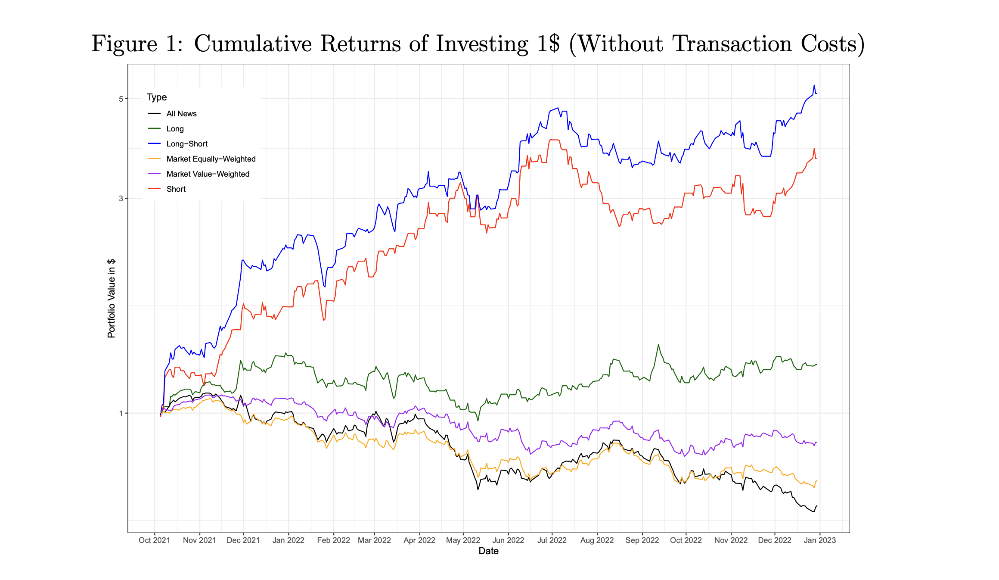

Researchers from the University of Florida have [released a study](https://papers.ssrn.com/sol3/papers.cfm?abstract_id=4412788) suggesting that the AI model ChatGPT can reliably predict stock market trends. Using public markets data and news from October 2021 to December 2022, their testing found that trading models powered by ChatGPT could generate returns exceeding 500% in this period. This performance stands in stark contrast to the -12% return from buying and holding an S&P 500 ETF during the same timeframe. The study also underscored ChatGPT's superior performance over other language models, including GPT-1, GPT-2, and BERT, as well as traditional sentiment analysis methods.  

佛罗里达大学的研究人员发布了一项研究，表明人工智能模型ChatGPT可以可靠地预测股市趋势。利用2021年10月至2022年12月的公共市场数据和新闻，他们的测试发现，由ChatGPT驱动的交易模型在这一时期可以产生超过500%的回报。这一表现与同一时间段内购买和持有标准普尔500指数ETF的-12%回报率形成鲜明对比。该研究还强调了ChatGPT比其他语言模型，包括GPT-1、GPT-2和BERT，以及传统的情感分析方法的卓越表现。

### An In-depth Look into the Methodology  

对方法论的深入研究

The team employed a rigorous methodology to backtest the efficacy of ChatGPT-driven trading strategies. They focused on examining a data set comprised of stock-related headlines from October 2021 to December 2022, ensuring that none of the news pieces were part of ChatGPT’s training data.  

该团队采用了严格的方法来回测ChatGPT驱动的交易策略的功效。他们重点检查了由2021年10月至2022年12月的股票相关头条新闻组成的数据集，确保这些新闻都不属于ChatGPT的训练数据。

The researchers collated 67,586 headlines pertaining to 4,138 unique companies during this time, using web scraping techniques. These headlines were subsequently filtered for relevance, with the team narrowing their focus to full articles and press releases, excluding any stock-gain or stock-loss headlines. They also removed duplicate news to ensure only fresh information was used.  

研究人员利用网络搜索技术，在这段时间内整理了67,586条与4,138家独特公司有关的标题。这些头条新闻随后被过滤，研究小组将重点缩小到完整的文章和新闻稿，排除任何股票上涨或股票下跌的头条新闻。他们还删除了重复的新闻，以确保只使用新鲜信息。

The research team used ChatGPT (powered by GPT-3.5) to evaluate whether a given headline was indicative of Good News, Bad News, or Unknown, also asking for a brief explanation. For instance, when presented with the headline "Rimini Street Fined $630,000 in Case Against Oracle," ChatGPT returned the nuanced response:  

研究小组使用ChatGPT（由GPT-3.5驱动）来评估一个给定的标题是否表明了好消息、坏消息或未知的情况，同时也要求进行简要的解释。例如，当看到 "Rimini Street在与甲骨文公司的诉讼中被罚款63万美元 "这一标题时，ChatGPT给出了细微的回应：

> YES. The fine against Rimini Street could potentially boost investor confidence in Oracle’s ability to protect its intellectual property and increase demand for its products and services.  
> 
> 是。对里米尼街的罚款有可能增强投资者对甲骨文保护其知识产权和增加其产品和服务需求的能力的信心。

This response reflects the superior reasoning and natural language capabilities of ChatGPT, which deemed the headline positive for Oracle, whereas a market-leading sentiment analysis software labeled the headline as negative.  

这一反应反映了ChatGPT卓越的推理和自然语言能力，它认为标题对甲骨文是积极的，而市场领先的情感分析软件则将标题标记为消极的。

### Impressive Results Across Several Strategies  

在多个战略中取得令人印象深刻的结果

The team tested six different investing strategies during the October 2021 to December 2022 period.   

该团队在2021年10月至2022年12月期间测试了六种不同的投资策略。

-   The Long-Short strategy, which involved buying companies with good news and short-selling those with bad news, yielded the highest returns, at over 500%.   
    
    多空策略，即买入有好消息的公司，卖空有坏消息的公司，收益率最高，超过500%。
    
-   The Short-only strategy, focusing solely on short-selling companies with bad news, returned nearly 400%.   
    
    只做空的策略，只专注于卖空有坏消息的公司，回报率接近400%。
    
-   The Long-only strategy, which only involved buying companies with good news, returned roughly 50%.   
    
    只做长线的策略，只买有好消息的公司，回报率大约为50%。
    
-   Three other strategies resulted in net losses: the “All News” hold strategy, the Equally-Weighted hold strategy, and the Market Value-Weight hold strategy.  
    
    其他三个策略导致了净亏损："所有新闻 "持有策略，同等权重持有策略，以及市场价值-权重持有策略。
    

When benchmarking against other methods, such as sentiment analysis and older language models like GPT-1, GPT-2, and BERT, ChatGPT consistently outperformed the competition. Traditional sentiment analysis methods produced markedly inferior results across all investment strategies, while GPT-1, GPT-2, and BERT failed to accurately predict returns.  

在与其他方法，如情感分析和GPT-1、GPT-2和BERT等老的语言模型进行基准测试时，ChatGPT的表现一直优于竞争对手。传统的情感分析方法在所有的投资策略中产生了明显逊色的结果，而GPT-1、GPT-2和BERT未能准确预测回报。

A visualization of how various ChatGPT-powered strategies performed, with the long-short strategy delivering 500% returns. Credit: University of Florida  

各种由ChatGPT驱动的策略表现的可视化，其中长短线策略带来了500%的回报。资料来源：佛罗里达大学

### Implications for the Finance Industry  

对金融业的影响

Two Sigma, DE Shaw, and Renaissance Technologies are several prominent hedge funds that incorporate sentiment analysis into their automated trading systems, and numerous other boutique hedge funds also utilize sentiment analysis signals as part of their proprietary strategies. ChatGPT’s strong performance in understanding headlines and their implications could add to a new arms race as funds compete to have an edge from Generative AI.  

Two Sigma、DE Shaw和Renaissance Technologies是将情绪分析纳入其自动交易系统的几个著名对冲基金，其他众多精品对冲基金也利用情绪分析信号作为其专有战略的一部分。ChatGPT在理解头条新闻及其影响方面的强劲表现，可能会增加新的军备竞赛，因为基金们争相从生成性人工智能中获得优势。

ChatGPT’s powerful natural language processing abilities could also threaten businesses that have developed their own proprietary sentiment analysis machine learning models, which could find themselves outperformed by a simple ChatGPT prompt. Notably, companies like Lexalytics that claim “world-leading NLP” could find themselves with both an opportunity and a challenge in this market as generative AI tools emerge and make past models obsolete.  

ChatGPT强大的自然语言处理能力也可能威胁到那些已经开发出自己专有的情感分析机器学习模型的企业，它们可能会发现自己被简单的ChatGPT提示所超越。值得注意的是，像Lexalytics这样声称 "世界领先的NLP "的公司可能会发现自己在这个市场上既是机会又是挑战，因为生成性人工智能工具的出现使过去的模型变得过时。

The stock-picking edge that ChatGPT has demonstrated could also empower retail traders. Notably, subreddits like r/WallStreetBets are filled with due diligence posts (called “DDs”) and bragging posts on stock returns from various long and short strategies. ChatGPT, with its ability to deduce nuance and second-order implications from just understanding headlines, could help ambitious retail traders in their own efforts to generate outsized returns.   

ChatGPT所展示的选股优势也可以赋予散户交易员权力。值得注意的是，像r/WallStreetBets这样的subreddits充满了尽职调查的帖子（称为 "DD"）和关于各种多头和空头策略的股票回报的吹嘘帖子。ChatGPT有能力从理解头条新闻中推断出细微差别和二阶影响，可以帮助雄心勃勃的散户交易者在他们自己的努力下获得超额回报。

Investors expect the next few years to be very dynamic in the finance space as generative AI takes hold. Unsurprisingly, the technology-focused ARK Investment Management is especially bullish. In her 2023 Big Ideas report, ARK’s founder Cathie Wood predicted AI as one of the trends that will define this technological era. “We've been working on artificial intelligence for a long time now,” said Wood, “and I think some of the things we're seeing are just the beginning of the impact that artificial intelligence is going to have on every sector, every industry, and every company.”  

投资者预计，随着生成性人工智能的普及，未来几年的金融领域将非常活跃。不出所料，专注于技术的ARK投资管理公司特别看好。在她的2023年大想法报告中，ARK的创始人Cathie Wood预测人工智能是定义这个技术时代的趋势之一。"我们已经在人工智能方面工作了很长时间，"伍德说，"我认为我们看到的一些东西只是人工智能将对每个部门、每个行业和每个公司产生影响的开始。"
