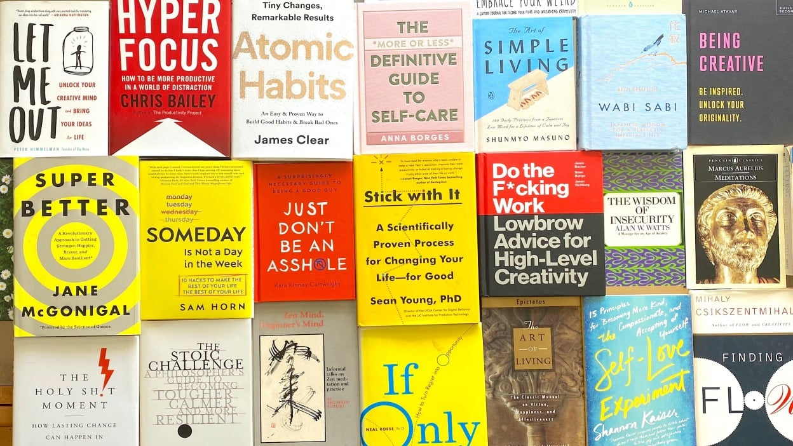

A small selection of centuries-spanning advice. Credit: chris taylor / mashable  

一小部分跨越几个世纪的建议。资料来源：Chris Taylor / Mashable

The first self-described self-help book was published in 1859. The author's name, improbably, was Samuel Smiles; the title, even more improbably, was _[Self-Help(opens in a new tab)](https://www.gutenberg.org/files/935/935-h/935-h.htm)_. A [distillation of lessons](https://mashable.com/article/self-help-tips) from the lives of famous people who had pulled themselves up by their bootstraps, it sold millions of copies and was a mainstay in Victorian households. Every generation since had its runaway bestseller, such as _[How to Live on 24 Hours a Day(opens in a new tab)](https://www.gutenberg.org/files/2274/2274-h/2274-h.htm)_ (1908), _[Think and Grow Rich(opens in a new tab)](https://zdcs.link/Aqedq?cd36=Standard&t=article&m=content_body&e=offer&i=text-link&el=Think%20and%20Grow%20Rich%28opens%20in%20a%20new%20tab%29&cd62=article&cd63=00Z8W8Xypn5aiD85AbLnEKk&short_url=Aqedq&u=https%3A%2F%2Fmashable.com%2Farticle%2Fbest-self-help-book-advice)_ (1937), or _[Don't Sweat the Small Stuff(opens in a new tab)](https://zdcs.link/0glPN?cd36=Standard&t=article&m=content_body&e=offer&i=text-link&el=Don%27t%20Sweat%20the%20Small%20Stuff%28opens%20in%20a%20new%20tab%29&cd62=article&cd63=00Z8W8Xypn5aiD85AbLnEKk&short_url=0glPN&u=https%3A%2F%2Fmashable.com%2Farticle%2Fbest-self-help-book-advice)_ [(opens in a new tab)](https://zdcs.link/0glPN?cd36=Standard&t=article&m=content_body&e=offer&i=text-link&el=%28opens%20in%20a%20new%20tab%29&cd62=article&cd63=00Z8W8Xypn5aiD85AbLnEKk&short_url=0glPN&u=https%3A%2F%2Fmashable.com%2Farticle%2Fbest-self-help-book-advice)(1997).  

第一本自称是自助的书于1859年出版。作者的名字很不巧，是塞缪尔-斯迈尔斯（Samuel Smiles）；书名则更不巧，是《自助》。这本书从那些自强不息的名人的生活中提炼出了一些经验，卖出了数百万册，成为维多利亚时代家庭的主力。此后，每一代人都有其失控的畅销书，如《如何靠一天24小时生活》（1908年）、《思考与致富》（1937年）或《不要为小事发愁》（1997年）。

By now, the [$11 billion self-help industry(opens in a new tab)](https://www.webwire.com/ViewPressRel.asp?aId=248507) is most definitely not small stuff. Yet when you strip it down, there's very little new information. After all, we were consuming self-help for centuries before Smiles, just under different names. Roman emperor Marcus Aurelius gave tweet-sized advice in [Meditations(opens in a new tab)](https://www.gutenberg.org/files/2680/2680-h/2680-h.htm); so did Benjamin Franklin in _[Poor Richard's Almanack(opens in a new tab)](https://www.google.com/books/edition/Poor_Richard_s_Almanack/o6lJAAAAIAAJ?hl=en&gbpv=1&printsec=frontcover)_. Even self-help parody isn't new. Shakespeare did it with Polonius' "to thine own self be true" speech in _Hamlet_: basically a bullet-point list from a blowhard.  

到现在为止，110亿美元的自助行业绝对不是小东西。然而，当你把它剥下来时，几乎没有什么新的信息。毕竟，在斯迈尔斯之前的几个世纪里，我们一直在消费自助，只是名称不同而已。罗马皇帝马库斯-奥勒留（Marcus Aurelius）在《沉思录》（Meditations）中给出了推特大小的建议；本杰明-富兰克林（Benjamin Franklin）在《理查德年鉴》（Poor Richard's Almanack）中也是如此。甚至自我帮助的模仿也不是什么新鲜事。莎士比亚在《哈姆雷特》中用波洛涅斯的 "做真实的自己 "的演讲做到了这一点：基本上是一个吹牛者的要点清单。

The 21st century has seen a measure of self-awareness about our self-help addiction. There's the wave of [sweary self-help bestsellers I wrote about](https://mashable.com/article/fuck-self-help-books), such as _[The Subtle Art of Not Giving a F\*ck(opens in a new tab)](https://zdcs.link/o7DeL?cd36=Standard&t=article&m=content_body&e=offer&i=text-link&el=The%20Subtle%20Art%20of%20Not%20Giving%20a%20F%2Ack%28opens%20in%20a%20new%20tab%29&cd62=article&cd63=00Z8W8Xypn5aiD85AbLnEKk&short_url=o7DeL&u=https%3A%2F%2Fmashable.com%2Farticle%2Fbest-self-help-book-advice)_. They hover somewhere between parody and dressing up the same advice as their forebears in earthier language. More recently, there's a trend you might call meta-self-help: books in which people write about their experiences following self-help books, such as _[Help Me!(opens in a new tab)](https://zdcs.link/rPMd8?cd36=Standard&t=article&m=content_body&e=offer&i=text-link&el=Help%20Me%21%28opens%20in%20a%20new%20tab%29&cd62=article&cd63=00Z8W8Xypn5aiD85AbLnEKk&short_url=rPMd8&u=https%3A%2F%2Fmashable.com%2Farticle%2Fbest-self-help-book-advice)_ (2018) and [How to Be Fine(opens in a new tab)](https://zdcs.link/mxNV5?cd36=Standard&t=article&m=content_body&e=offer&i=text-link&el=How%20to%20Be%20Fine%28opens%20in%20a%20new%20tab%29&cd62=article&cd63=00Z8W8Xypn5aiD85AbLnEKk&short_url=mxNV5&u=https%3A%2F%2Fmashable.com%2Farticle%2Fbest-self-help-book-advice) (2020), based on the similar self-help podcast [By the Book(opens in a new tab)](https://bythebookpod.com/about-us).  

在21世纪，我们对自我帮助成瘾有了一定程度的自我认识。有一波我写过的脏话式自助畅销书，如《不给钱的微妙艺术》（The Subtle Art of Not Giving a F\*ck）。它们徘徊在模仿和用更朴实的语言装扮与前辈相同的建议之间。最近，有一种趋势，你可以称之为元自助：人们在书中写下了自己阅读自助书籍的经历，如《帮助我！》（Help Me!(2018)和How to Be Fine (2020)，基于类似的自助播客By the Book。

But hey, if it's all pretty much the same stuff — and it is — why stop at distilling it into a single book? Why not condense the repeated lessons of an entire genre into one article? That's what I've attempted here, after reading dozens of history's biggest bestsellers so you don't have to. Here is the essence of the advice I've seen delivered again and again.  

但是，如果都是差不多的东西--确实如此--为什么要停留在把它提炼成一本书上？为什么不把整个流派的重复教训浓缩到一篇文章中呢？这就是我在阅读了几十本历史上最大的畅销书之后，在这里所做的尝试，这样你就不必再做了。以下是我一再看到的建议的精华。

## **1\. Take one small step.  

1.迈出一小步。**

Your daily habits aren't just important; they're the whole ballgame. Aristotle knew this when he wrote "we are what we repeatedly do." And despite your natural desire to fix everything at once, the best way to get big results is to make tiny, continuous changes to daily habits. In Japan, this is known as _[kaizen(opens in a new tab)](https://www.investopedia.com/terms/k/kaizen.asp#:~:text=Kaizen%20is%20a%20Japanese%20term,a%20gradual%20and%20methodical%20process.)_, a concept introduced to American readers in Stephen Covey's 1989 bestseller _[The 7 Habits of Highly Effective People(opens in a new tab)](https://zdcs.link/NpeMy?cd36=Standard&t=article&m=content_body&e=offer&i=text-link&el=The%207%20Habits%20of%20Highly%20Effective%20People%28opens%20in%20a%20new%20tab%29&cd62=article&cd63=00Z8W8Xypn5aiD85AbLnEKk&short_url=NpeMy&u=https%3A%2F%2Fmashable.com%2Farticle%2Fbest-self-help-book-advice)_.  

你的日常习惯不仅仅是重要的；它们是整个球赛的关键。亚里士多德知道这一点，他写道："我们就是我们反复做的事情"。尽管你天生就想一下子解决所有问题，但取得重大成果的最佳方式是对日常习惯进行微小的、持续的改变。在日本，这被称为 "持续"（kaizen），在斯蒂芬-柯维1989年的畅销书《高效能人士的7个习惯》中向美国读者介绍了这个概念。

Habit adjustment got a lot of help in the 21st century from groundbreaking studies into human behavior. These are outlined in the 2014 bestseller _[The Power of Habit(opens in a new tab)](https://zdcs.link/lPZVr?cd36=Standard&t=article&m=content_body&e=offer&i=text-link&el=The%20Power%20of%20Habit%28opens%20in%20a%20new%20tab%29&cd62=article&cd63=00Z8W8Xypn5aiD85AbLnEKk&short_url=lPZVr&u=https%3A%2F%2Fmashable.com%2Farticle%2Fbest-self-help-book-advice)_. Then came [Atomic Habits(opens in a new tab)](https://zdcs.link/DlXdZ?cd36=Standard&t=article&m=content_body&e=offer&i=text-link&el=Atomic%20Habits%28opens%20in%20a%20new%20tab%29&cd62=article&cd63=00Z8W8Xypn5aiD85AbLnEKk&short_url=DlXdZ&u=https%3A%2F%2Fmashable.com%2Farticle%2Fbest-self-help-book-advice) (2018), which points out that improving any metric by one percent at a time adds up to exponential growth over the long term. What matters in the short term is the repetition, which takes your behavior out of the limited realm of willpower and makes it automatic.  

习惯调整在21世纪从对人类行为的突破性研究中得到了很多帮助。这些在2014年的畅销书《习惯的力量》中有所概述。然后是《原子习惯》（2018年），其中指出，每次改善任何指标百分之一，从长期来看就会有指数级的增长。短期内重要的是重复，这使你的行为脱离了意志力的有限领域，成为自动行为。

Personally I like the summary in [Mini Habits(opens in a new tab)](https://zdcs.link/dn4MM?cd36=Standard&t=article&m=content_body&e=offer&i=text-link&el=Mini%20Habits%28opens%20in%20a%20new%20tab%29&cd62=article&cd63=00Z8W8Xypn5aiD85AbLnEKk&short_url=dn4MM&u=https%3A%2F%2Fmashable.com%2Farticle%2Fbest-self-help-book-advice) (2013): Make your daily practice "too small to fail." Ensure you exercise for five minutes every day, for example, and you'll soon find yourself eager to do more.  

我个人喜欢Mini Habits (2013)中的总结：让你的日常练习 "小到不能再小"。例如，确保你每天锻炼5分钟，你很快就会发现自己渴望做更多。

## **2\. Change your mental maps.  

2.改变你的心理地图。**

Time to enter the world of sports cliché. "If you believe it, the mind can achieve it": These motivational-poster words are attributed to the NFL's Ronnie Lott, but also reflect what nearly every self-help book has tried to tell us since _[The Power of Positive Thinking(opens in a new tab)](https://www.google.com/books/edition/The_Power_of_Positive_Thinking/EF6NDwAAQBAJ?hl=en&gbpv=1&printsec=frontcover)_ (1952). In achieving any goal, basically, you have to thoroughly visualize your preferred end result, then work backwards in precisely-planned steps.  

是时候进入体育陈词滥调的世界了。"如果你相信它，心灵就能实现它"：这些激励人心的话是美国国家橄榄球联盟的罗尼-洛特说的，但也反映了自《积极思考的力量》（1952年）以来几乎所有自助书籍都试图告诉我们的内容。在实现任何目标时，基本上，你必须彻底想象你喜欢的最终结果，然后按照精确规划的步骤向后努力。

The planning part is key. Take it away and you get the semi-spiritual mumbo jumbo of _[The Secret(opens in a new tab)](https://zdcs.link/M1eV6?cd36=Standard&t=article&m=content_body&e=offer&i=text-link&el=The%20Secret%28opens%20in%20a%20new%20tab%29&cd62=article&cd63=00Z8W8Xypn5aiD85AbLnEKk&short_url=M1eV6&u=https%3A%2F%2Fmashable.com%2Farticle%2Fbest-self-help-book-advice)_ (2006), which itself was a rewrite of _[The Science of Getting Rich(opens in a new tab)](https://www.google.com/books/edition/The_Science_of_Getting_Rich/IZkoAAAAYAAJ?hl=en&gbpv=1&printsec=frontcover)_ (1910), which was based on the 19th century's ["mind over body" movement(opens in a new tab)](https://www.britannica.com/event/New-Thought). But science tells us there is no "law of attraction" (though there is a [psychological explanation for why we might think we see examples(opens in a new tab)](https://www.psychologytoday.com/us/blog/the-blame-game/201609/the-truth-about-the-law-attraction) of it).  

计划部分是关键。把它拿走，你就得到了《秘密》（2006年）的半精神性的胡言乱语，它本身就是《致富科学》（1910年）的改写，该书是基于19世纪的 "精神战胜身体 "运动。但科学告诉我们没有 "吸引力法则"（尽管有一个心理学解释，为什么我们可能认为我们看到了它的例子）。

The plan is how you get to your goal, and the process may take years. You're playing the long game. Emotional connection to your visualization is how you acquire ["mental toughness"(opens in a new tab)](https://www.lifehack.org/articles/productivity/how-to-develop-mental-toughness.html) to get past the hurdles that make us want to quit on the way to anything worthwhile.  

计划是你如何达到你的目标，而这个过程可能需要几年时间。你要玩的是长期游戏。与你的可视化的情感联系是你获得 "精神韧性 "的方式，以克服在实现任何有价值的东西的道路上使我们想放弃的障碍。

## **3\. Struggle is good. Scary is good.  

3.挣扎是好的。可怕是好的。**

<iframe id="video-container-wH6dSe_dYgM" data-immersive-translate-effect="1" data-immersive_translate_walked="6124d894-85c0-4cd3-925c-b7de76a71236" frameborder="0" allowfullscreen="1" allow="accelerometer; autoplay; clipboard-write; encrypted-media; gyroscope; picture-in-picture; web-share" title="Epictetus - How To Be A Stoic (Stoicism)" width="896" height="504" src="https://www.youtube.com/embed/wH6dSe_dYgM?autoplay=0&amp;controls=1&amp;rel=0&amp;modestbranding=1&amp;start&amp;enablejsapi=1&amp;origin=https%3A%2F%2Fmashable.com&amp;widgetid=1"></iframe>

The Stoic philosophy dates back to the 3rd century B.C. And it's still enormously popular, cropping up not just in _[The Stoic Challenge: A Philosopher's Guide to Becoming Tougher, Calmer and More Resilient(opens in a new tab)](https://zdcs.link/gM0lb?cd36=Standard&t=article&m=content_body&e=offer&i=text-link&el=The%20Stoic%20Challenge%3A%20A%20Philosopher%27s%20Guide%20to%20Becoming%20Tougher%2C%20Calmer%20and%20More%20Resilient%28opens%20in%20a%20new%20tab%29&cd62=article&cd63=00Z8W8Xypn5aiD85AbLnEKk&short_url=gM0lb&u=https%3A%2F%2Fmashable.com%2Farticle%2Fbest-self-help-book-advice)_ (2019), but in more or less every other modern self-help tome.  

斯多葛哲学可以追溯到公元前3世纪，它仍然非常流行，不仅出现在《斯多葛挑战》中：A Philosopher's Guide to Becoming Tougher, Calmer and More Resilient》（2019年），而且还出现在或多或少的其他现代自助书籍中。

Stoicism is not about being unfeeling, but about shifting your mental framework so that you expect and even welcome the worst instead of fearing it. "Say to yourself in the early morning: I shall meet today ungrateful, violent, treacherous, envious, uncharitable men," Marcus Aurelius wrote. Which is, apart from anything else, the perfect mantra for using Twitter.  

斯多葛主义并不是不讲情面，而是转变你的心理框架，使你期待甚至欢迎最坏的情况，而不是害怕它。"在清晨对自己说：马库斯-奥勒留写道："我今天将遇到忘恩负义、暴力、背信弃义、嫉妒和不善的人。除了其他方面之外，这也是使用Twitter的完美咒语。

Throughout history there are many similar attempts to rewire our expectations — such as the Buddhist principle, [stolen(opens in a new tab)](https://www.goodreads.com/quotes/8802508-life-is-suffering-love-is-the-desire-to-see-unnecessary) by [controversial](https://mashable.com/article/gillette-ad-masculinity) academic Jordan Peterson, that says [life is suffering(opens in a new tab)](https://www.learnreligions.com/life-is-suffering-what-does-that-mean-450094). Once you accept this, the next level is not simply to expect it — but to rush headlong into the things that make you afraid.  

纵观历史，有许多类似的尝试来重新调整我们的期望值--比如被有争议的学者乔丹-彼得森盗用的佛教原则，说生命是痛苦的。一旦你接受了这一点，下一个层次就不是简单的期待--而是一头冲进让你害怕的事情。

"You must do the thing you think you cannot do," said Eleanor Roosevelt. This is [often rendered(opens in a new tab)](https://quoteinvestigator.com/2013/08/09/scare/) as the version that appeared in the famous "sunscreen" [advice column(opens in a new tab)](https://www.chicagotribune.com/columns/chi-schmich-sunscreen-column-column.html) and [song(opens in a new tab)](https://www.youtube.com/watch?v=sTJ7AzBIJoI): "Do one thing every day that scares you." Which, with its nod to daily habits, is probably the most succinct self-help sentence ever.  

"你必须做你认为你不能做的事情，"埃莉诺-罗斯福说。这句话经常被渲染成出现在著名的 "防晒 "建议专栏和歌曲中的版本："每天做一件让你害怕的事"。这句话，由于其对日常习惯的点头，可能是有史以来最简洁的自我帮助句子。

This leads us to what we might call "self-scare" books, with titles like [Feel the Fear and Do It Anyway(opens in a new tab)](https://zdcs.link/k2mnw?cd36=Standard&t=article&m=content_body&e=offer&i=text-link&el=Feel%20the%20Fear%20and%20Do%20It%20Anyway%28opens%20in%20a%20new%20tab%29&cd62=article&cd63=00Z8W8Xypn5aiD85AbLnEKk&short_url=k2mnw&u=https%3A%2F%2Fmashable.com%2Farticle%2Fbest-self-help-book-advice) (1987), which the author of the meta-self-help book _[Help Me!(opens in a new tab)](https://www.google.com/books/edition/Help_Me/6IqADwAAQBAJ?hl=en&gbpv=1&printsec=frontcover)_ judged her most effective read. You don't have to quit your job, plunge into ice-cold ponds or face the embarrassment of public speaking as she did, but getting your ass off the couch and putting butterflies in your stomach is a necessary part of every stoic self-help plan.  

这就把我们引向了我们可以称之为 "自我关怀 "的书籍，标题是《感受恐惧，无论如何都要做》（1987年），这本书被元自助书《帮助我！》的作者判定为她最有效的读物。你不必像她那样辞掉工作，跳进冰冷的池塘，或面对公开演讲的尴尬，但让你的屁股离开沙发，把蝴蝶放在你的肚子里，是每个坚忍不拔的自助计划的必要组成部分。

## **4\. Instant judgment is bad.  

4.即时判断是不好的。**

It's hard to explain this common self-help rule without slipping into clichés. How often have you been told to take a deep breath and count to 10 before reacting to some perceived slight? Or to keep an open mind? Or to walk a mile in someone's shoes? Or to question your assumptions? Or that it's probably not about you? "Be kind," says a [quote from a Scottish author that is often misattributed to Plato(opens in a new tab)](https://quoteinvestigator.com/2010/06/29/be-kind/), "for everyone you meet is fighting a hard battle."  

要解释这个常见的自助规则而不落入俗套是很难的。有多少次有人告诉你，在对一些被认为是轻视的人做出反应之前，要深呼吸并数到10？或者保持开放的心态？或在别人的鞋子里走一英里？或者质疑你的假设？或者说，这可能与你无关？"要善良，"一位苏格兰作家的一句话常常被误认为是柏拉图说的，"因为你遇到的每个人都在打一场硬仗。"

Call it empathy, call it compassion, call it playing devil's advocate, call it examining your privilege. It's all one and the same purpose — avoiding a rush to judgment about your fellow humans. Evolution has hardwired us to see patterns and make snap decisions. Which is useful when saber-toothed tigers are charging our cave, but not so much in a tight-knit multicultural society.  

称之为同理心，称之为同情心，称之为扮演魔鬼的代言人，称之为审视自己的特权。这都是一个相同的目的--避免对你的同胞匆忙做出判断。进化使我们有能力看到模式并做出快速决定。当剑齿虎在我们的洞穴里冲锋陷阵时，这很有用，但在一个紧密的多元文化社会中就不那么有用了。

That's bad news for us, but good news for every self-help author who gets to remind us, repeatedly, in too many books to count.  

这对我们来说是个坏消息，但对每个自助作者来说是个好消息，他们可以在许多书中反复提醒我们，数不胜数。

#### Related Video: The hosts of 'Queer Eye' reimagine the American dream  

相关视频：同性恋者之眼 "的主持人重新构想美国梦

0 of 2 minutes, 30 secondsVolume 0%

## **5\. Remember the end of your life.  

5.记住你生命的终点。**

As we pass what would have been Robin Williams' 69th birthday, let us recall the ["carpe diem" scene(opens in a new tab)](https://www.youtube.com/watch?v=vi0Lbjs5ECI) from _Dead Poets' Society_. "We are food for worms, lads," says Williams; a line that is now almost too poignant to bear.  

当我们经过罗宾-威廉姆斯的69岁生日时，让我们回忆一下《死亡诗社》中 "及时行乐 "的场景。威廉姆斯说："我们是虫子的食物，伙计们"；这句话现在几乎太凄美了，难以承受。

But bear it we must, because the foreknowledge of our own demise isn't just what sets humans apart from animals. It's also one of the most useful tools in the self-help arsenal. Sufi poets originated the phrase "this too shall pass;" Julius Caesar made a servant whisper it in his ear when he entered the gates of Rome. [Socrates](https://mashable.com/article/self-care-history) gave us the _[memento mori(opens in a new tab)](https://www.lexico.com/definition/memento_mori)_. Why does it work so well? Because when we remember we're going to die, the inane squabbles of daily life tend to fall away, revealing a sudden clarity of purpose. "When a man knows he is to be hanged," 18th century wit Samuel Johnson [wrote(opens in a new tab)](https://www.goodreads.com/quotes/192643-depend-upon-it-sir-when-a-man-knows-he-is), "it concentrates his mind wonderfully."  

但我们必须忍受它，因为对自己死亡的预知不仅使人类与动物不同。它也是自助武器库中最有用的工具之一。苏菲派诗人发明了 "这也会过去 "这句话；凯撒大帝在进入罗马城门时让一个仆人在他耳边说了这句话。苏格拉底给了我们 "死亡纪念"。为什么它的效果这么好？因为当我们记得我们会死的时候，日常生活中无意义的争吵往往会消失，显示出一种突然清晰的目标。"当一个人知道他将被绞死时，"18世纪的智者塞缪尔-约翰逊写道，"这使他的思想得到了极大的集中。"

So how do we seize this day? By listing and doing the most important things, the sooner the better. _[Someday Is Not A Day in the Week(opens in a new tab)](https://zdcs.link/veVd8?cd36=Standard&t=article&m=content_body&e=offer&i=text-link&el=Someday%20Is%20Not%20A%20Day%20in%20the%20Week%28opens%20in%20a%20new%20tab%29&cd62=article&cd63=00Z8W8Xypn5aiD85AbLnEKk&short_url=veVd8&u=https%3A%2F%2Fmashable.com%2Farticle%2Fbest-self-help-book-advice)_ (2019) tells the story of the author's father, who dreamed his whole life of visiting every U.S. National Park, then died of a stroke in a hotel bathroom on his way to do exactly that, one week after his retirement. If that's your fate, what would you do differently?  

那么，我们如何抓住这一天呢？通过列出并做最重要的事情，越早越好。Someday Is Not A Day in the Week》（2019年）讲述了作者的父亲的故事，他一生都梦想着游览每一个美国国家公园，然后在他退休一周后，在去做这件事的路上因中风去世。如果这是你的命运，你会采取什么不同的做法？

If your own death is too scary to contemplate, there's a safer version that is more effective for some: Think of yourself in your 80s in a retirement home. _Really_ picture it: You in a wheelchair, wrinkled and frail, eating soft food from a tray in front of a droning TV. Would that person be glad you took the leap you want to make right now, or would they regret it?  

如果你自己的死亡让人不敢想象，有一个更安全的版本，对一些人来说更有效：想一想自己80多岁时在养老院的样子。真的想象一下：你坐在轮椅上，满脸皱纹，身体虚弱，在喋喋不休的电视前用托盘吃着软饭。那个人会为你现在所做的飞跃感到高兴吗，还是会后悔？

This is a thought experiment known as "[prospective retrospection(opens in a new tab)](https://osf.io/ywzer)." Jeff Bezos [calls it(opens in a new tab)](https://www.google.com/books/edition/The_Mind_Bending_Truths_about_a_Life_wit/pt-dDwAAQBAJ?hl=en&gbpv=1&dq=regret+minimization+framework&pg=PT33&printsec=frontcover) "regret minimization," and it's what he used in 1996 to take the biggest risk of his life. He decided 80-year-old Jeff would be less regretful if he drove to Seattle and founded Amazon, no matter the outcome, than if he stayed in his safe New York consulting gig. Love Bezos or hate him, you can't deny it worked.  

这是一个被称为 "前瞻性回顾 "的思想实验。杰夫-贝索斯称之为 "遗憾最小化"，这是他在1996年用来承担他生命中最大风险的方法。他决定80岁的杰夫如果开车到西雅图并创立亚马逊，无论结果如何，都会比留在安全的纽约咨询工作中更少后悔。不管是爱贝索斯还是恨他，你都不能否认它的作用。

## **6\. Be playful. 6.6.要玩得开心。**

<iframe id="video-container-mOHkRk00iI8" data-immersive-translate-effect="1" data-immersive_translate_walked="6124d894-85c0-4cd3-925c-b7de76a71236" frameborder="0" allowfullscreen="1" allow="accelerometer; autoplay; clipboard-write; encrypted-media; gyroscope; picture-in-picture; web-share" title="HD video of Jeremy Fry - Celtics Fan Dancing to Bon Jovi Living on a Prayer at a Celtics game" width="896" height="504" src="https://www.youtube.com/embed/mOHkRk00iI8?autoplay=0&amp;controls=1&amp;rel=0&amp;modestbranding=1&amp;start&amp;enablejsapi=1&amp;origin=https%3A%2F%2Fmashable.com&amp;widgetid=2"></iframe>

_[On Being Awesome: A Unified Theory of How Not to Suck(opens in a new tab)](https://zdcs.link/VOe0J?cd36=Standard&t=article&m=content_body&e=offer&i=text-link&el=On%20Being%20Awesome%3A%20A%20Unified%20Theory%20of%20How%20Not%20to%20Suck%28opens%20in%20a%20new%20tab%29&cd62=article&cd63=00Z8W8Xypn5aiD85AbLnEKk&short_url=VOe0J&u=https%3A%2F%2Fmashable.com%2Farticle%2Fbest-self-help-book-advice)_ (2017) has one of the more unusual beginnings of any self-help book: A description of nerdy Celtics fan Jeremy Fry rocking out to Bon Jovi's _Living on a Prayer_ on the stadium cam, a viral video viewed nearly 19 million times. Why? Because Fry was behaving as awesomely as we wish we all could, throwing caution to the wind, fully expressing himself in front of thousands.  

关于 "令人敬畏"：如何不失败的统一理论》（2017年）是所有自助书籍中更不寻常的开端之一：书中描述了书呆子凯尔特人队的球迷杰里米-弗莱（Jeremy Fry）在体育场的摄像头上摇摆着邦乔维（Bon Jovi）的《生活在祈祷中》（Living on a Prayer），这个病毒视频被观看了近1900万次。为什么？因为弗莱的行为就像我们希望我们都能做到的那样令人敬畏，在成千上万的人面前抛开谨慎，充分表达自己。

It wasn't that Fry was dancing like no one was watching, to name another cliché. It's that he was dancing _with everyone_, fully aware they were all watching, and loving it. Here's where _The Subtle Art of Not Giving a F\*ck_ and its ilk come in handy, by reminding us of one essential truth: Life is _way_ too short to give any fucks whatsoever about what other people think of you when you're living your best life. And paradoxically, others are drawn to you when you behave like that.  

这并不是说弗莱在跳舞，好像没有人在看一样，这是另一个陈词滥调。而是他和大家一起跳舞，完全知道他们都在看，而且很喜欢。这就是《不在乎的微妙艺术》及其同类作品的用武之地，它提醒我们一个基本的真理：生命太短暂了，当你过着你最好的生活时，根本不需要在乎别人对你的看法。矛盾的是，当你这样做的时候，别人会被你吸引。

What's more, you should actively cultivate your quirks. An increasing number of creative self-help books make this explicit, such as Felicia Day's [Embrace Your Weird(opens in a new tab)](https://zdcs.link/q2BkD?cd36=Standard&t=article&m=content_body&e=offer&i=text-link&el=Embrace%20Your%20Weird%28opens%20in%20a%20new%20tab%29&cd62=article&cd63=00Z8W8Xypn5aiD85AbLnEKk&short_url=q2BkD&u=https%3A%2F%2Fmashable.com%2Farticle%2Fbest-self-help-book-advice) (2019). "The things that made you weird as a kid are the source of your creative powers," says James Victore in [Feck Perfuction: Dangerous Ideas on the Business of Life(opens in a new tab)](https://zdcs.link/EAey7?cd36=Standard&t=article&m=content_body&e=offer&i=text-link&el=Feck%20Perfuction%3A%20Dangerous%20Ideas%20on%20the%20Business%20of%20Life%28opens%20in%20a%20new%20tab%29&cd62=article&cd63=00Z8W8Xypn5aiD85AbLnEKk&short_url=EAey7&u=https%3A%2F%2Fmashable.com%2Farticle%2Fbest-self-help-book-advice) (2019)_._ "These are the base elements of who you are. Not perfect. Not trying. Just yourself." And as Buddhists will tell you, just being yourself without effort is the best way to leave that troublesome ego at the door.  

更重要的是，你应该积极培养自己的怪癖。越来越多的创意自助书籍明确了这一点，比如费利西亚-戴的《拥抱你的怪异》（2019）。"小时候让你感到怪异的事情是你创造能力的源泉，"詹姆斯-维克多在《Feck Perfuction》中说：关于生活事业的危险想法》（2019）。"这些是你是谁的基本要素。不完美。不努力。只是你自己。"而正如佛教徒会告诉你的那样，不费吹灰之力地做自己就是把那个麻烦的自我留在门外的最好方法。

No matter how difficult your task is, you can always make it playful. You wouldn't think this rule would apply to recovery from serious illness, but games designer Jane McGonigal wrote [SuperBetter(opens in a new tab)](https://zdcs.link/YNK02?cd36=Standard&t=article&m=content_body&e=offer&i=text-link&el=SuperBetter%28opens%20in%20a%20new%20tab%29&cd62=article&cd63=00Z8W8Xypn5aiD85AbLnEKk&short_url=YNK02&u=https%3A%2F%2Fmashable.com%2Farticle%2Fbest-self-help-book-advice) (2015) to prove the case. Suffering from a concussion so severe that it almost drove her to suicide, she built a digital game that rewarded her for each tiny step in her post-traumatic growth. More than half a million people have since been helped by the recovery game.  

无论你的任务有多难，你总是可以让它变得很好玩。你不会认为这条规则适用于严重疾病的康复，但游戏设计师Jane McGonigal写了《SuperBetter》（2015）来证明这一点。她遭受了严重的脑震荡，几乎导致她自杀，她建立了一个数字游戏，奖励她在创伤后成长中的每一个微小的步骤。此后，有50多万人得到了这个康复游戏的帮助。

## **7\. Be useful to others.  

7.要对他人有用。**

What is the oldest piece of self-help advice? In the loosest definition, it's probably the Golden Rule — treat others as you would want to be treated — a basic principle which appears to have emerged independently in every culture in the world. The rule dates to at least the 6th century B.C. in China and Greece, and around 2,000 B.C. in Egypt. There are many more ways to say it, from "love thy neighbor" to, in the words of a 2020 self-help title, [Just Don't Be An Assh\*le(opens in a new tab)](https://zdcs.link/82VBR?cd36=Standard&t=article&m=content_body&e=offer&i=text-link&el=Just%20Don%27t%20Be%20An%20Assh%2Ale%28opens%20in%20a%20new%20tab%29&cd62=article&cd63=00Z8W8Xypn5aiD85AbLnEKk&short_url=82VBR&u=https%3A%2F%2Fmashable.com%2Farticle%2Fbest-self-help-book-advice).  

最古老的自我帮助建议是什么？在最宽泛的定义中，它可能是黄金法则--像你希望被对待一样对待他人--这一基本原则似乎在世界的每一种文化中都独立出现过。该规则至少可以追溯到公元前6世纪的中国和希腊，以及公元前2000年左右的埃及。还有更多的说法，从 "爱你的邻居 "到2020年自我帮助标题中的一句话："不要成为一个混蛋"。

But the Golden Rule can trip you up if your neighbors don't want to be treated the way you do. You can become an asshole by being overly helpful, too. C.S. Lewis noted this in his 1942 classic _[Screwtape Letters(opens in a new tab)](https://zdcs.link/Jjedl?cd36=Standard&t=article&m=content_body&e=offer&i=text-link&el=Screwtape%20Letters%28opens%20in%20a%20new%20tab%29&cd62=article&cd63=00Z8W8Xypn5aiD85AbLnEKk&short_url=Jjedl&u=https%3A%2F%2Fmashable.com%2Farticle%2Fbest-self-help-book-advice)_ (spiritual self-help in the form of correspondence from the devil): "She's the sort of person who lives for others. You can tell who the others are by their hunted expression."  

但是，如果你的邻居不希望被你这样对待，黄金法则就会把你绊倒。你也可能因为过度帮助而成为一个混蛋。C.S.刘易斯在他1942年的经典作品《螺丝钉信札》（以魔鬼来信的形式进行精神上的自我帮助）中指出了这一点："她是那种为他人而活的人。你可以通过他们猎奇的表情来判断别人是谁"。

So a better way to think is in terms of _usefulness_. "The purpose of life is not to be happy, it is to be useful," [wrote(opens in a new tab)](https://excellencereporter.com/2019/02/18/ralph-waldo-emerson-on-love-beauty-and-the-purpose-of-life/) Ralph Waldo Emerson, and it's as true now as it was in the 19th century. Being useful to others doesn't just give us a warm and fuzzy feeling, one rooted deep in our tribal evolution. It also allows us to employ our particular talents, our quirks, and it gives them a direction. Find the thing that makes you _you_, then use it in a way that will help as much of humanity as possible: This is as close as we get to the meaning of life.  

因此，一个更好的思考方式是以有用为前提。"生活的目的不是为了快乐，而是为了有用，"拉尔夫-瓦尔多-爱默生写道，现在和19世纪时一样正确。对他人有用不仅给我们带来温暖和模糊的感觉，这种感觉深深扎根于我们的部落进化。它还使我们能够运用我们的特殊才能，我们的怪癖，并给他们一个方向。找到使你自己的东西，然后用它来帮助尽可能多的人类：这是我们最接近生命的意义的地方。

Is it too trite to simply say that loving one another is the answer? Indeed it is — and finding new stories that cut through the syrup to remind us of that essential truth is what keeps self-help writers (not to mention novelists, preachers, and screenwriters) in business. "We must love one another or die," [wrote(opens in a new tab)](https://poets.org/poem/september-1-1939) the poet W.H. Auden — which, in light of rule #5, he later changed to "we must love one another _and_ die."  

简单地说，彼此相爱就是答案，这是不是太老套了？的确如此--寻找新的故事，穿过糖浆，提醒我们这个基本的真理，是使自助作家（更不用说小说家、传教士和编剧）继续工作的原因。诗人W.H.奥登写道："我们必须彼此相爱，否则就会死亡。"鉴于第5条规则，他后来将其改为 "我们必须彼此相爱并死亡"。

## **8\. Perfectionism = procrastination  

8.完美主义=拖延症**

Over the years I've bought an armful of books to tackle procrastination, ironically waiting for a rainy day to read them. I also sought books that dealt with my perfectionist behavior. But it wasn't until I read _[How to Be an Imperfectionist(opens in a new tab)](https://zdcs.link/PReyo?cd36=Standard&t=article&m=content_body&e=offer&i=text-link&el=How%20to%20Be%20an%20Imperfectionist%28opens%20in%20a%20new%20tab%29&cd62=article&cd63=00Z8W8Xypn5aiD85AbLnEKk&short_url=PReyo&u=https%3A%2F%2Fmashable.com%2Farticle%2Fbest-self-help-book-advice)_ that one simple fact became clear: They were one and the same problem.  

多年来，我买了一大堆解决拖延问题的书，讽刺的是，我一直在等待一个雨天来阅读这些书。我还寻找处理我的完美主义行为的书籍。但直到我读了《如何成为一个不完美主义者》，一个简单的事实才变得清晰：它们是同一个问题。

Perfect results are impossible in this world, so if you're expecting them, of course you're going to procrastinate. Perfectionism isn't playful. It won't let you embrace your flaws, or the notion that habit change is supposed to be slow and easy, so if anything you overreach — hello, New Year's resolutions! — and end up failing to change your habits at all.  

完美的结果在这个世界上是不可能的，所以如果你期待它们，你当然会拖延。完美主义不是玩的。它不会让你接受你的缺陷，也不会让你接受习惯的改变应该是缓慢而简单的概念，所以如果有什么事情你会过度追求--你好，新年的决议！最后根本无法改变你的习惯！- 结果是根本无法改变你的习惯。

Again, there's a Japanese principle at work here: _[wabi-sabi(opens in a new tab)](https://en.wikipedia.org/wiki/Wabi-sabi)_, the acceptance and love of imperfection in all things. How do you put it into action? You get started, no matter whether you're ready. Sometimes you learn best by doing, by throwing yourself in at the deep end. To use a sometimes annoying aphorism that cropped up in English sometime in the 1970s: Fake it 'til you make it.  

同样，这里有一个日本的原则在起作用：Wabi-sabi，接受和热爱所有事物的不完美。你如何把它付诸行动？你要开始行动，不管你是否准备好了。有时，你最好通过实践来学习，通过把自己扔在深渊里。用70年代某个时候在英语中出现的一个有时令人讨厌的格言来说：假冒它，直到你成功。

## **9\. Sleep, exercise, eat, chill out. Repeat.  

9.睡觉，运动，吃饭，放松。重复进行。**

Being human means accepting the limitations and maintenance of our meat sack. The Roman poet Juvenal put it best: _Mens sana in corpore sano_, a healthy mind in a healthy body. We need to eat ([not too much, not too often, and the right stuff](https://mashable.com/article/fasting-dieting-the-switch)). We need to sleep (between 6 and 10 hours, depending on our age and our DNA) and to [pay attention to our chronotype,](https://mashable.com/article/night-owl-flexible-schedule) which we can't change no matter how many times we read self-help books like _[The 5 A.M. Miracle(opens in a new tab)](https://zdcs.link/1PDvA?cd36=Standard&t=article&m=content_body&e=offer&i=text-link&el=The%205%20A.M.%20Miracle%28opens%20in%20a%20new%20tab%29&cd62=article&cd63=00Z8W8Xypn5aiD85AbLnEKk&short_url=1PDvA&u=https%3A%2F%2Fmashable.com%2Farticle%2Fbest-self-help-book-advice)_ that promise to make us a morning person.  

做人意味着接受我们肉袋的限制和维护。罗马诗人尤韦纳尔说得最好：Mens sana in corpore sano，一个健康的身体里有一个健康的头脑。我们需要吃东西（不要太多，不要太频繁，而且要吃对的东西）。我们需要睡眠（6到10个小时，取决于我们的年龄和我们的DNA），并注意我们的时间类型，无论我们读多少次像《早上5点的奇迹》这样的自助书籍，承诺使我们成为一个早晨的人，我们都无法改变。

And yes, sorry, we need to exercise daily. It really is a silver bullet that boosts our resilience while reducing pain, inflammation, depression, and the stress hormone cortisol. But cortisol fighting doesn't end with your run/walk/jazzercise. A ton of self-help books, not just the Buddhist ones, recommend meditation and mindfulness, with good scientific reason.  

而且是的，对不起，我们需要每天锻炼。它真的是一颗银弹，可以提高我们的复原力，同时减少疼痛、炎症、抑郁和压力荷尔蒙皮质醇。但对抗皮质醇并不以你的跑步/散步/爵士运动为终点。大量的自助书籍，不仅仅是佛教书籍，都推荐冥想和正念，有很好的科学理由。

And then there's _[The Importance of Living(opens in a new tab)](https://www.google.com/books/edition/The_Importance_Of_Living/tsUu85jBow0C?hl=en&gbpv=1&printsec=frontcover)_, a popular 1937 American self-help book by a Chinese immigrant named Lin Yutang, which recommends just chilling out, loafing, going with the flow. One whole chapter is devoted to the best posture while lying in bed. "If you can spend a perfectly useless afternoon in a perfectly useless manner," Yutang writes, "you have learned how to live."  

还有《生活的重要性》，这是一本流行于1937年的美国自助书籍，作者是一位名叫林语堂的中国移民，书中建议只需放松，闲逛，随波逐流。有一整章专门讨论躺在床上的最佳姿势。"玉堂写道："如果你能以一种完全无用的方式度过一个完全无用的下午，你就学会了如何生活。

Which isn't to say that you shouldn't strive to do more, find your purpose, visualize your goals, etc. etc. But if you don't make room for the simple pleasures, ideally with your cortisol-spiking smartphone as far away as possible, you will never be fully refreshed and restored and ready to give back to the world. It's also vital for your sense of humor, says Yutang, who offers this formula: "Reality + dreams + humor = wisdom."  

这并不是说你不应该努力做得更多，找到你的目的，想象你的目标，等等。但是，如果你不为简单的快乐留出空间，最好是让你的皮质醇飙升的智能手机尽可能地远离你，你将永远不会完全恢复活力，恢复并准备回馈世界。玉堂说，这对你的幽默感也至关重要，他提供了这个公式："现实+梦想+幽默=智慧"。

## **10\. Write it all down.  

10.把它全部写下来。**

No matter which self-help guide you follow, you aren't going to get far without writing. You need to hone a plan. You need to visualize. You need to make lists. David Allen's 2002 classic _[Getting Things Done(opens in a new tab)](https://zdcs.link/e6RBW?cd36=Standard&t=article&m=content_body&e=offer&i=text-link&el=Getting%20Things%20Done%28opens%20in%20a%20new%20tab%29&cd62=article&cd63=00Z8W8Xypn5aiD85AbLnEKk&short_url=e6RBW&u=https%3A%2F%2Fmashable.com%2Farticle%2Fbest-self-help-book-advice)_ offers the best system I've ever seen for a to-do list, and it can be boiled down to this: Capture literally everything you think you might have to do or want to do, now or in the future. Then for each item, either do it immediately (if it takes less than 5 minutes), defer it (to a specific date or a "someday/maybe" list) or delegate it (if you're lucky enough to have people to do stuff for you).  

无论你遵循哪种自助指南，你不写作是不会走远的。你需要磨练一个计划。你需要视觉化。你需要制定清单。大卫-艾伦（David Allen）2002年的经典著作《搞定》（Getting Things Done）提供了我所见过的最好的待办事项清单系统，它可以归结为以下几点：捕捉你认为现在或将来可能要做或想做的一切。然后，对于每一个项目，要么立即去做（如果它需要不到5分钟），要么推迟（到一个特定的日期或 "某天/也许 "列表），要么委托它（如果你足够幸运，有人为你做事情）。

You can and should write in a freeform and spontaneous way too, even if you're not a writer. That's the advice of Julia Cameron, author of the 1992 bestseller _[The Artist's Way(opens in a new tab)](https://zdcs.link/X5pDe?cd36=Standard&t=article&m=content_body&e=offer&i=text-link&el=The%20Artist%27s%20Way%28opens%20in%20a%20new%20tab%29&cd62=article&cd63=00Z8W8Xypn5aiD85AbLnEKk&short_url=X5pDe&u=https%3A%2F%2Fmashable.com%2Farticle%2Fbest-self-help-book-advice)_, which introduced the concept of "morning pages." In the first hour of your day, before your brain has a chance to fully wake up and censor itself, write three pages by hand. The subject: anything that comes to mind. Invariably, the first two pages are full of crap like "I don't know why I'm doing this, it's boring," before the third page hits on some surprising epiphany.  

你也可以而且应该以自由和自发的方式写作，即使你不是一个作家。这是1992年畅销书《艺术家之路》的作者朱莉娅-卡梅隆的建议，该书提出了 "晨读页 "的概念。在你一天的第一个小时里，在你的大脑有机会完全醒来和审查自己之前，用手写三页。主题：任何想到的东西。前两页总是充满了 "我不知道我为什么要做这个，这很无聊 "之类的废话，然后第三页就会出现一些令人惊讶的顿悟。

Then there's the gratitude journal. The concept still makes me roll my eyes, but it's hard to deny the science of it: The simple act of listing things we're grateful for every day has been shown to [rewire our brains and improve our mental health(opens in a new tab)](https://greatergood.berkeley.edu/article/item/how_gratitude_changes_you_and_your_brain), even after just a few weeks of the practice.  

然后是感恩日记。这个概念仍然让我翻白眼，但很难否认它的科学性：每天列出我们所感激的事情这一简单的行为已被证明可以重塑我们的大脑并改善我们的心理健康，即使是在短短几周的实践之后。

## **11\. You can't get it all from reading.  

11.你不可能从阅读中得到所有的东西。**

If you read an author who claims you can get literally everything you need from their book or article, that's not self-help. It's a cult. Luckily, almost all writers admit the limitations of reading in a well-rounded life improvement program. At some point, you need to put the book down and do the work. And you need to recognize your limitations. You will always backslide. St. Augustine, in the 5th century A.D., knew this when he wrote about the two parts of the self, the one that perversely enjoys doing the wrong things and the one that wants to kick its ass. Neither one will ever achieve complete victory.  

如果你读到一个声称你可以从他们的书或文章中得到你所需要的一切的作者，那就不是自助了。那是一种邪教。幸运的是，几乎所有的作家都承认阅读在一个全面的生活改善计划中的局限性。在某些时候，你需要把书放下，做工作。而且你需要认识到你的局限性。你总是会退步的。公元5世纪的圣奥古斯丁知道这一点，他写到自我的两个部分，一个是反常地喜欢做错事的部分，另一个是想踢自己屁股的部分。两者都不会取得完全的胜利。

Even the most self-reliant of us need help to get as far along that road as we can. That's the final stage of _7 Habits of Highly Effective People_, where we move from the rebellious teenage stage of independence to an adult understanding of interdependence. Plenty of self-help authors suggest nominating an "accountability buddy" to keep you honest, while you do the same for them.  

即使是我们中最自立的人也需要帮助，以便在这条路上走得越远越好。这是《高效能人士的七个习惯》的最后阶段，我们从叛逆的青少年独立阶段转向对相互依赖的成人理解。大量的自助作者建议提名一个 "责任伙伴"，让你保持诚实，而你也为他们做同样的事情。

If you're lucky enough to have someone who will call you on literally all of your shit, hang on to that person for dear life. But friends, co-workers and family who love you are naturally going to be wary of telling you everything you can't see for fear of the reaction, just as you would be with them. So a better solution, say it with me now, is to see a therapist. You can read all about Cognitive Behavioral Therapy in books such as the bestselling [Feeling Good(opens in a new tab)](https://zdcs.link/LGeb0?cd36=Standard&t=article&m=content_body&e=offer&i=text-link&el=Feeling%20Good%28opens%20in%20a%20new%20tab%29&cd62=article&cd63=00Z8W8Xypn5aiD85AbLnEKk&short_url=LGeb0&u=https%3A%2F%2Fmashable.com%2Farticle%2Fbest-self-help-book-advice) (1980), for example. But you can't put it into practice until you're talking to a professional who can apply it to your particular case.  

如果你足够幸运，有一个人愿意指责你的所有破事，那就抓紧这个人的生命吧。但是，爱你的朋友、同事和家人自然会对告诉你所有你看不到的事情保持警惕，因为担心会有反应，就像你对他们一样。因此，一个更好的解决方案，现在跟我说，是去看治疗师。你可以在诸如畅销书《感觉良好》（1980年）等书中读到所有关于认知行为疗法的内容。但是，除非你与能够将其应用于你的特定案例的专业人士交谈，否则你无法将其付诸实践。

Self-help bestsellers have been recommending talk therapy since _[The Road Less Traveled(opens in a new tab)](https://zdcs.link/yo3LO?cd36=Standard&t=article&m=content_body&e=offer&i=text-link&el=The%20Road%20Less%20Traveled%28opens%20in%20a%20new%20tab%29&cd62=article&cd63=00Z8W8Xypn5aiD85AbLnEKk&short_url=yo3LO&u=https%3A%2F%2Fmashable.com%2Farticle%2Fbest-self-help-book-advice)_ in 1978. Still, the stigma remains: If you see a therapist it must be an admission of defeat, that you're somehow mentally deficient, right? Wrong. Even therapists need therapists. Ultimately, this too is part of the meaning of life: Not just to be useful to others, but to be strong enough to let others be useful to us.  

自1978年《少有人走的路》以来，自我帮助的畅销书一直在推荐谈话疗法。然而，污名仍然存在：如果你去见治疗师，那一定是承认失败，你在某种程度上有精神缺陷，对吗？错了。即使治疗师也需要治疗师。归根结底，这也是生命意义的一部分：不仅仅是要对他人有用，而且要足够强大，让他人对我们有用。

**You may also like: 你可能也喜欢：**

-   [From 'Not Giving a F\*ck' to 'F\*ck Yeah,' sweary self-help books aren't what they seem  
    
    从《不给力》到《F\*ck Yeah》，脏话连篇的自助书籍并不像它们看起来那样](https://mashable.com/article/fuck-self-help-books)
    
-   [The decade's most important novel is your summer must-read  
    
    这十年来最重要的小说是你的夏季必读之作](https://mashable.com/article/summer-books-must-read-overstory)
    
-   [The end of aging  
    
    老龄化的结束](https://mashable.com/feature/aging)
    
-   [You've been getting self-care all wrong. It's a political act and always has been.  
    
    你对自我保健的理解完全错误。这是一种政治行为，一直如此。](https://mashable.com/article/self-care-history)
    

Chris is a veteran journalist and the author of 'How Star Wars Conquered the Universe.' Hailing from the U.K., Chris got his start working as a sub editor on national newspapers in London and Glasgow. He moved to the U.S. in 1996, and became senior news writer for Time.com a year later. In 2000, he was named San Francisco bureau chief for Time magazine. He has served as senior editor for Business 2.0, West Coast editor for Fortune Small Business and West Coast web editor for Fast Company.Chris is a graduate of Merton College, Oxford and the Columbia University Graduate School of Journalism. He is also a long-time volunteer at 826 Valencia, the nationwide after-school program co-founded by author Dave Eggers. His book on the history of Star Wars is an international bestseller and has been translated into 11 languages.  

克里斯是一位资深记者，也是《星球大战如何征服宇宙》的作者。克里斯来自英国，他开始在伦敦和格拉斯哥的全国性报纸上担任副编辑。他于1996年移居美国，一年后成为Time.com的高级新闻作家。2000年，他被任命为《时代》杂志的旧金山分社社长。他曾担任《商业2.0》的高级编辑、《财富》小型企业的西海岸编辑和《快速公司》的西海岸网络编辑。克里斯毕业于牛津大学默顿学院和哥伦比亚大学新闻学研究生院。他也是826瓦伦西亚的长期志愿者，这是作家戴夫-埃格斯（Dave Eggers）共同创立的全国性课后计划。他关于《星球大战》历史的书是一本国际畅销书，已被翻译成11种语言。
