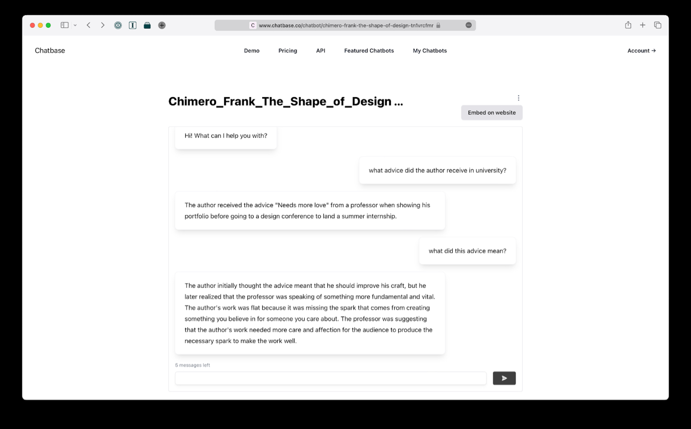
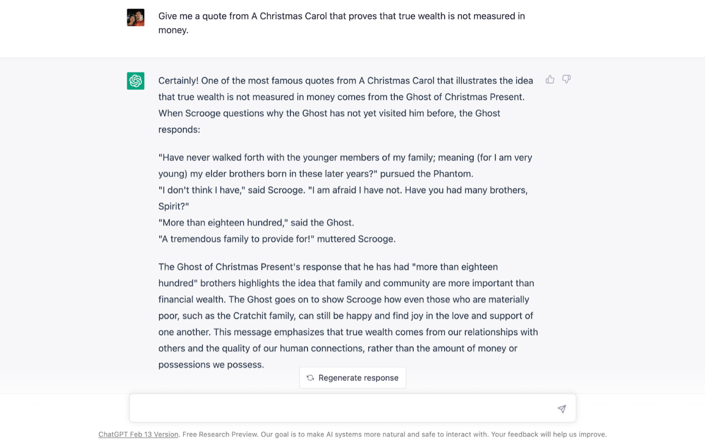

To embrace e-books is to embrace change, to accept that books are collections of words and ideas, to believe that the form factor of a book is not sacred.  

拥抱电子书就是拥抱变化，接受书籍是文字和思想的集合，相信书籍的形式因素不是神圣的。

For a book is “a written or printed work consisting of pages glued or sewn together,” according to the _New Oxford American Dictionary_. An e-book, meanwhile, is merely a collection of words in a file, a book only if you squint. It is words, one after another, with no permanence, no sense of length or depth aside from a scrollbar or reading percentage. It is impermanent, flexible, a reading jack-of-all-trades, the farthest thing possible from sewn pages.  

因为根据《新牛津美国词典》，书是 "由粘在一起的书页组成的书面或印刷作品"。同时，电子书只是文件中的文字集合，只有当你眯起眼睛时才是一本书。它是单词，一个接一个，没有持久性，除了滚动条或阅读百分比之外，没有长度或深度的感觉。它是无常的，灵活的，是一种阅读的万能工具，与缝制的书页相差甚远。

E-books, if anything, have more in common with their earlier cousin, the scroll. As [Tim Urban discovered](https://waitbutwhy.com/2023/02/last-six-years.html) when trying to find the optimal way to read his _What’s Our Problem_ eBook, “The best e-book experience … is Apple Books > iPad > sepia > vertical scroll.”  Nothing could be closer to a reincarnated scroll—perhaps a more fitting metaphor for electronic texts than the book.  

电子书，如果有的话，与它们早期的表亲--卷轴有更多共同之处。正如蒂姆-乌尔班在试图找到阅读他的《我们的问题是什么》电子书的最佳方式时发现的那样，"最好的电子书体验......是苹果书>iPad>深褐色>垂直滚动"。没有什么比这更接近于转世的卷轴了--也许是比书更适合电子文本的隐喻。

E-books have always felt like they’re missing something. They’re lacking what [Glenn Fleishman](https://www.theatlantic.com/books/archive/2021/09/why-are-ebooks-so-terrible/620068/) coined as “bookiness”: “The essence that makes someone feel like they’re using a book.” Bookiness is the heft, the aroma of paper and ink, the sensation of flipping through pages.  

电子书总是让人感觉缺少一些东西。它们缺少格伦-弗莱什曼（Glenn Fleishman）所说的 "书香"："使人感到他们在使用一本书的本质"。书卷气是指重量、纸张和墨水的香气、翻阅书页的感觉。

The harder e-books try to imitate a book—Apple Books’ paper-like page turn animations, Kindle’s estimated page numbers, and PDF documents’ faithful-to-print page layouts—the worse they feel. No amount of skeuomorphic animations and layout can make up for the slightly off-kilter feeling in e-books when the typography and margins are a bit off and page numbers change on a whim.  

电子书越是努力模仿书籍--苹果书的纸质翻页动画，Kindle的估计页码，以及PDF文档的忠实于印刷的页面布局--它们的感觉就越差。当电子书的排版和页边距有点偏离，页码随心所欲地变化时，再多的拟态动画和布局也无法弥补电子书中那种略显偏离的感觉。

We made e-books in the image of books, and in a head-to-head competition on bookiness, the e-book will always come up short. “E-books are digital, but beyond that they’re not much different than books,” [remarked tech analyst Ben Thompson](https://stratechery.com/2015/disconfirming-ebooks/) in 2015, and maybe that’s been their problem all along.  

我们以书本的形象制作电子书，在书本的正面竞争中，电子书总是落在下风。技术分析师本-汤普森（Ben Thompson）在2015年说："电子书是数字化的，但除此之外，它们与书籍没有什么不同。"也许这一直是它们的问题。

What if we had it wrong? What if ideas weren’t meant to be bound between covers, locked away in inky, typeset pages? What if the book was only one stage in the evolution of knowledge storage, and now it’s time to reinvent the long-form text?  

如果我们搞错了呢？如果思想不应该被装订在封面之间，锁在墨色的、排版的书页中呢？如果书只是知识存储演变中的一个阶段，而现在是重塑长篇文字的时候了呢？

What if we start over, and remake the book in the image of technology?  

如果我们重新开始，以技术的形象重塑这本书呢？

## From clay tablets to the tabula: tracing the evolution of books  

从泥板到Tabula：追踪书籍的演变

If you step back in time, the book itself wasn’t invented in a single burst of inspiration. The history of books started, as so much of human history did, in Mesopotamia.  

如果你回到过去，书本身并不是在一次灵感迸发中发明的。书籍的历史开始于美索不达米亚，就像人类历史上的许多事情一样。

Paper had yet to be invented when humans began writing knowledge down to store it somewhere [safe to forget](https://www.reproof.app/blog/notes-apps-help-us-forget). From Mesopotamia on, as early as 4000 BCE, our ancestors scratched their earliest ideas onto clay tablets.  

当人类开始将知识写下来储存在安全的地方以便遗忘时，纸张还没有被发明。从美索不达米亚开始，早在公元前4000年，我们的祖先就把他们最早的想法划在泥板上。

“Tablets were for disposable text,” [noted author Lev Grossman](https://www.nytimes.com/2011/09/04/books/review/the-mechanic-muse-from-scroll-to-screen.html). You’d jot down ideas then pat the clay smooth to reuse it later. Monumental ideas could be preserved for posterity, if you wanted, by baking the clay to freeze ideas into stone. Everything else, you’d smooth out and start again tomorrow.  

"作家列夫-格罗斯曼（Lev Grossman）指出："平板电脑是用于一次性的文本。你可以把想法记下来，然后把粘土拍光滑，以后再使用。如果你愿意，可以通过烘烤粘土将想法冻结在石头上，为后人保留不朽的想法。其他的东西，你都可以抹平，明天再开始。

Then someone got the idea to put two clay tablets together to build the first book: the tabula.  

然后有人想到把两块泥板放在一起，建立了第一本书：《塔布拉》。

Take two pieces of wood, hinged together with a clasp, and cover them with “blackened wax that could be inscribed with a bronze or iron stylus, one end of which was flat so the wax could be smoothed and written upon again,” relays James Grout in [Encyclopaedia Romana](https://penelope.uchicago.edu/~grout/encyclopaedia_romana/scroll/scrollcodex.html), and you had a proto-notebook. You’d write and rewrite your ideas and calculations, before smoothing them into oblivion to start over again. It was an iterative update to clay tablets, enough to carry humans and their mobile writing needs into the Roman era.  

詹姆斯-格鲁特在《罗马百科全书》中说："拿两块木头，用扣子铰接在一起，然后用 "发黑的蜡，可以用青铜或铁质的笔来刻，笔的一端是平的，所以蜡可以被磨平，然后再写上去。"这样，你就有了一本原始的笔记。你写了又写，重写你的想法和计算，然后再把它们抹掉，重新开始。这是对泥板的迭代更新，足以将人类和他们的移动书写需求带到罗马时代。

The tabula was humanity’s first book, crafted in the image of the clay tablet.  

塔布拉是人类的第一本书，以泥板的形象制作而成。

#### Papyrus, parchment, paper, and low-end disruption  

纸莎草纸、羊皮纸、纸张和低端的干扰

Humans innovate, as they’re wont to do, and the state-of-the-art in writing technology started moving on. By the time the tabula was invented (during the dawn of the Roman empire), there was another writing medium for the long-term storage of important ideas: Egyptian papyrus. Made from sheets of Nile reed pith, papyrus emerged around 2000 BCE. It “keeps a faithful witness of human deeds; it speaks of the past, and is the enemy of oblivion,” [enthused Roman scholar Cassidorus](https://penelope.uchicago.edu/~grout/encyclopaedia_romana/scroll/scrollcodex.html). It wasn’t for everyday musings. It was for posterity, with lengthy texts rolled into scrolls.  

人类不断创新，正如他们惯常所做的那样，最先进的书写技术开始向前发展。当塔布拉被发明的时候（在罗马帝国的黎明时期），已经有了另一种用于长期储存重要思想的书写媒介：埃及纸莎草纸。纸莎草由尼罗河的芦苇芯片制成，大约在公元前2000年出现。它 "忠实地见证了人类的行为；它讲述了过去，是遗忘的敌人"，罗马学者卡西多拉斯兴奋地说。它不是用于日常思考的。它是为后人准备的，冗长的文字被卷成卷轴。

Either a papyrus shortage or an export ban from Alexandria (of Library fame) prompted a switch starting around 200 BCE from papyrus to sheepskin parchment as a drop-in replacement for papyrus. It was a medium change, the iPhone-losing-the-home-button of ancient times. You still wrote the most important ideas and rolled them in scrolls, but now they were made of cheaper, more widely available sheepskin turned into parchment.  

无论是纸莎草纸的短缺还是亚历山大（图书馆的名声）的出口禁令，都促使人们从公元前200年左右开始从纸莎草纸转向羊皮羊皮纸作为纸莎草纸的替代品。这是一种媒介上的变化，就像古代的iPhone--失去了家庭按钮。你仍然把最重要的想法写在卷轴上，但现在它们是由更便宜、更广泛的羊皮变成羊皮纸制成的。

That medium change planted the seed for something new. Parchment was cheaper than imported papyrus. That marginal difference meant you could experiment with parchment and find new use cases for it beyond scrolls.  

这一媒介变化为新事物的发展埋下了种子。羊皮纸比进口的纸莎草纸更便宜。这种微小的差异意味着你可以用羊皮纸做实验，并为它找到卷轴以外的新用途。

The book was one such use case. Someone in Rome got the bright idea to swap the wood and wax of the tabula with parchment, and invented the first actual notebook—at first, called a codex. A codex could contain as many pages as you wanted, now that you were no longer limited by weighty clay. “Stitched together and protected by a cover, the parchment notebook was used for accounts, notes, drafts, and letters,” writes Grout. This was for ordinary writing, the writing formerly done on clay tablets, not the lofty ideas reserved for scrolls.  

书就是这样一个使用案例。罗马有人灵机一动，用羊皮纸代替了木头和蜡，并发明了第一本真正的笔记本--起初被称为抄本。抄本可以包含你想要的任何页数，现在你不再受到沉重的泥土的限制。"格劳特写道："羊皮纸笔记本缝在一起并有封面保护，用于记账、笔记、草稿和信件。这是普通的写作，即以前在泥板上的写作，而不是保留给卷轴的崇高思想。

The codex was an early example of what Clayton Christensen would call [low-end disruption](https://hbr.org/2015/12/what-is-disruptive-innovation). Parchment was a “good-enough product”—cheaper and more widely available than papyrus, even if it didn’t afford as nice of a writing experience. Parchment changed the medium behind scrolls, then changed clay tabula into early books, before going up-market and changing publishing forever.   

抄本是克莱顿-克里斯坦森所说的低端破坏的一个早期例子。羊皮纸是一种 "足够好的产品"--比纸莎草纸更便宜、更广泛，即使它不能提供那么好的书写体验。羊皮纸改变了卷轴背后的媒介，然后将粘土塔布拉变成了早期的书籍，最后走向市场并永远改变了出版业。

If humanity had only shifted the writing material from papyrus to parchment, the medium change would have merely lowered the price of the written word. It was the format shift—combining the innovations of the tabula with parchment into an early book—that changed everything.  

如果人类只是将书写材料从纸莎草纸转移到羊皮纸，那么媒介的变化只是降低了文字的价格。是格式上的变化--将塔布拉纸和羊皮纸的创新结合到早期的书中--改变了一切。

The size made information portable, the cover added durability, the pages made information more available, and the parchment brought the price down. It was a virtuous cycle of innovation that brought us the first books.  

尺寸使信息便于携带，封面增加了耐用性，书页使信息更容易获得，而羊皮纸则使价格下降。这是一个创新的良性循环，为我们带来了第一批书籍。

Then came modern paper made from ordinary bark and wood, invented in China around the year 100 and imported to Europe through the Middle East, lowering the price of the writing medium again. Then came movable type and the printing press to produce full pages of text mechanically, automating the scribe’s job of handwriting books away and easing distribution. Standards grew out of necessity and artistry, with the dimensions of books being based on the original size of folded sheepskin parchment and the typography and margins slowly converging into the one true idea of what a book should be.  

后来，中国在100年左右发明了用普通树皮和木材制成的现代纸，并通过中东进口到欧洲，再次降低了书写媒介的价格。随后，活字印刷术和印刷机出现，以机械方式生产整页的文字，使抄写员手写书籍的工作自动化，并简化了发行工作。标准出于需要和艺术的需要而增长，书籍的尺寸是基于折叠的羊皮纸的原始尺寸，而排版和页边则慢慢汇聚成书籍应该有的一个真正概念。

Even as books grew in popularity, they didn’t replace scrolls entirely. “Scrolls were the prestige format, used for important works only: sacred texts, legal documents, history, literature,” noted Grossman. Parchment retained that status well into modern times—when 13 British colonies chose revolution, they leaned on parchment’s permanence and authoritativeness to declare themselves the United States.  

即使书籍越来越受欢迎，它们也没有完全取代卷轴。格罗斯曼指出："卷轴是有声望的格式，只用于重要的作品：神圣的文本、法律文件、历史、文学，"。羊皮纸的地位一直保留到现代--当13个英国殖民地选择革命时，他们依靠羊皮纸的持久性和权威性宣布自己为美国。

“New technology seldom eliminates old technology,” [wrote Mark Kurlansky in his history of paper](https://www.amazon.com/Paper-Through-History-Mark-Kurlansky-ebook/dp/B00ZAT8WTC/?tag=thematguasblo-20). “It only creates another alternative.”  

"新技术很少会淘汰旧技术，"马克-库兰斯基在他的纸张历史中写道。"它只是创造了另一种选择"。

It was the upstarts—the poets, the writers, the dreamers, those whom Steve Jobs would later fondly call “the crazy ones”—who embraced change and made the book take hold. “You, who wish my poems should be everywhere with you … buy these which the parchment confines in small pages. This copy of me \[sic\] one hand can grasp,” [advertised Roman poet Marcus Valerius Martialis](http://thetextualmechanic.blogspot.com/2015/08/virginius-rufus-killed-by-large-bookroll.html) (better known as Martial) of his notebook-sized works.  

正是这些后起之秀--诗人、作家、梦想家，那些后来被史蒂夫-乔布斯亲切地称为 "疯狂的人 "的人--接受了变革，并使这本书得以流行。"你们，希望我的诗应该无处不在......买下这些被羊皮纸限制在小页里的东西。罗马诗人马库斯-瓦莱里乌斯-马蒂亚尔（Marcus Valerius Martialis，又称马蒂亚尔）为他的笔记本大小的作品做了广告，"这本我\[原文如此\]的副本一只手就能抓到。

The earliest Christian church also made the book its own, from around 70 CE, with its literature written in books, not scrolls. “The codex permitted longer texts, such as the Gospels, to be contained within a single volume and to be referred to more easily,” [notes Grout in his history](https://penelope.uchicago.edu/~grout/encyclopaedia_romana/scroll/scrollcodex.html) of the book neé codex. It likely didn’t hurt that books lent the Church the cachet of the new and innovative, moving beyond the stuffy scrolls favored by Greek and Hebrew temples alike.  

最早的基督教会也将书作为自己的东西，从公元70年左右开始，其文献写在书上，而不是卷轴上。"抄本允许较长的文本，如福音书，被包含在一卷书中，并且更容易被引用，"格鲁特在他的书籍和抄本的历史中指出。书籍给教会带来了新的和创新的声誉，超越了希腊和希伯来神庙所青睐的闷热的卷轴，这可能也没有坏处。

The book wasn’t invented in a stroke or popularized overnight. It was distilled from clay tablets to hardcover tomes over centuries, promoted by the early adopters and improved by innovators. One page at a time, they made the book the primary information store for humanity, and over the two ensuing millennia, the book [became a default](https://www.reproof.app/blog/on-defaults). We write quick notes in notebooks, publish more disposable, fleeting ideas in newspapers and pamphlets (both codices by Roman standards, if not books by modern ones), and publish our most important ideas in books for preservation. Over 51 million books fill the Library of Congress today, the greatest store of humanity’s collective knowledge.  

书不是一蹴而就的，也不是一夜之间普及的。它是经过几个世纪从泥板提炼成精装书的，由早期采用者推广，由创新者改进。他们一页一页地把书变成了人类的主要信息库，而在随后的两千年里，书成了一种默认的东西。我们在笔记本上写快速笔记，在报纸和小册子上发表更多一次性的、转瞬即逝的想法（按照罗马的标准，即使不是现代的书籍，也都是法典），并在书籍中发表我们最重要的想法，以便保存。今天，超过5100万册图书充斥着美国国会图书馆，这是人类集体知识的最大储存。

It’s hard to think that the book didn’t exist all along.  

很难想象，这本书一直以来都不存在。

## E-book inventors dreamed of ideas liberated from pages  

电子书的发明者们梦想着从书页中解放出来的思想

Then the industrial age shifted into the information age, and doubt started to creep in. What if the book wasn’t the end-all of information storage? The earliest computers made humanity realize books might not be the final resting place for information after all.  

然后，工业时代转变为信息时代，疑问开始悄然而至。如果书本并不是信息存储的全部呢？最早的计算机使人类认识到书本毕竟可能不是信息的最终归宿。

“The Encyclopædia Britannica could be reduced to the volume of a matchbox,” [imagined Vannevar Bush](https://www.theatlantic.com/magazine/archive/1945/07/as-we-may-think/303881/) in 1947. He contemplated how everyday life could be changed by the computers that helped win World War II—the British codebreaking Colossus computer and IBM’s punch-card accounting machines that aided the Manhattan Project.  

"1947年，范尼瓦尔-布什（Vannevar Bush）设想："《大英百科全书》可以缩减到一个火柴盒的体积。他思考了日常生活如何被那些帮助赢得二战的计算机所改变--英国破译密码的 "巨人 "计算机和帮助曼哈顿计划的IBM打卡会计机。

“A special button transfers him immediately to the first page of the index,” Bush wrote, imagining an operator navigating a digital book’s mechanical interface. “Any given book of his library can thus be called up and consulted with far greater facility than if it were taken from a shelf.” Nearly five centuries after Gutenberg’s first printing press, Bush was dreaming up the e-book, and search was what would make his matchbox-book better.  

布什写道："一个特殊的按钮让他立即进入索引的第一页，"他想象着一个操作者在数字书的机械界面上导航。"这样一来，他的图书馆中的任何一本书都可以被调用和查阅，比从书架上取书要方便得多。"在古腾堡的第一台印刷机问世近五个世纪后，布什正在设想电子书，而搜索将使他的火柴盒书变得更好。

A year later, Jesuit priest Roberto Busa decided to take up the challenge, [digitalizing the works of 13th-century priest Thomas Aquinas](https://en.wikipedia.org/wiki/Index_Thomisticus), in what became the world’s first e-book. Seventy people labored over three decades to transcribe 10 million words into punch cards (the earliest way to store computer data, on holes punched into paper cards) and 1,500 kilometers of magnetic tape (the computing equivalent of cassette tapes, storing data magnetically at a far higher density than punch cards afforded).  

一年后，耶稣会牧师罗伯托-布萨决定接受挑战，将13世纪的牧师托马斯-阿奎那的作品数字化，成为世界上第一本电子书。七十人经过三十年的努力，将1000万字转录到打孔卡（最早的计算机数据存储方式，在纸卡上打孔）和1500公里的磁带（相当于磁带的计算机，以磁力存储数据，密度远高于打孔卡）。

A matchbox this was not (at first anyhow), until the march of progress reduced the volume to a couple CDs in the ’90s, then [a single website powered by a 1.4GB database in 2005](https://www.economist.com/christmas-specials/2020/12/19/how-data-analysis-can-enrich-the-liberal-arts). But Busa’s goal was the same as Bush’s: to aid discovery, to unlock the ideas that previously had been bound between covers—not to simply read a book on a computer.  

这不是一个火柴盒（无论如何起初是这样），直到进步的步伐在90年代将数量减少到几张CD，然后在2005年由一个1.4GB的数据库驱动的单一网站。但布萨的目标与布什的目标相同：帮助发现，解开以前被束之高阁的思想，而不是简单地在电脑上阅读一本书。

Busa sought to index the works of Aquinas, to find every instance of any specific word or phrase throughout the volumes. For that, a digitized book seemed the perfect disruption—not better than a book, but a companion to a book, a way to analyze its words, if not to read them in their entirety.  

布萨试图为阿奎那的作品编制索引，在各卷书中找到任何特定的单词或短语的每一个实例。为此，数字化书籍似乎是一个完美的中断--不是比书更好，而是书的伴侣，一种分析其文字的方式，如果不是完整地阅读它们。

Busa and Bush were not alone in trying to rethink information storage. Psychologist J. C. R. Licklider was thinking along the same lines in 1965 as he dreamed of [libraries of the future](http://worrydream.com/refs/Licklider%20-%20Libraries%20of%20the%20Future.pdf). “Books are bulky and heavy. They contain much more information than the reader can apprehend at any given moment, and the excess often hides the part he wants to see,” he wrote. “Except for use in consecutive reading—which is not the modal application in the domain of our study—books are not very good display devices.”  

布萨和布什并不是唯一试图重新思考信息存储的人。心理学家J.C.R. Licklider在1965年梦想着未来的图书馆时也在沿着同样的思路思考。"书籍是笨重的。它们所包含的信息比读者在任何时候都能理解的要多得多，而且多余的信息往往掩盖了他想看到的部分，"他写道。"除了用于连续阅读--这不是我们研究领域中的模式应用--书籍不是很好的显示设备"。

When these thinkers imagined a digital book—what we’d come to call an e-book—they dreamed of ideas liberated from pages. The book had perfected “consecutive reading,” the long read, the text in which you’d lose yourself. Yet that lengthiness and narrative didn’t aid in information storage, organization, and retrieval, something for which the then-new computers seemed ideally suited.  

当这些思想家想象着数字书--我们后来称之为电子书--他们梦想着从书页中解放出来的思想。书籍已经完善了 "连续阅读"，长篇阅读，你会迷失自己的文本。然而，这种冗长的叙述并不能帮助信息的存储、组织和检索，而这正是当时新的计算机似乎最适合的东西。

Along came Michael Hart, the founder of [Project Gutenberg](https://www.gutenberg.org/), perhaps the singularly most influential project in making e-books mainstream. Hart was gifted free university computing time in 1971, and decided to use that to digitalize the world’s libraries. “The greatest value created by computers would not be computing,” [theorized Hart](https://www.gutenberg.org/about/background/history_and_philosophy.html), “but would be the storage, retrieval, and searching of what was stored in our libraries.”  

随之而来的是迈克尔-哈特，古腾堡计划的创始人，也许是使电子书成为主流的唯一最有影响力的项目。哈特在1971年获得了免费的大学计算时间，并决定利用它来实现世界图书馆的数字化。"哈特的理论是："计算机创造的最大价值不是计算，而是存储、检索和搜索储存在我们图书馆的内容。

So Hart typed the Declaration of Independence into the University of Illinois’ Xerox Sigma V mainframe—a room-sized contraption that [cost over $300,000](http://web.archive.org/web/20011002033127/https://www.post-gazette.com/healthscience/20011001sigma1001p5.asp) and could only store 3MB of data on its 5-foot-tall hard drive—then started typing up complete public-domain books and adding them to his budding digital library.   

因此，哈特将《独立宣言》打入伊利诺伊大学的施乐Sigma V主机--一个房间大小的装置，成本超过30万美元，在其5英尺高的硬盘上只能存储3MB的数据--然后开始打出完整的公共领域的书籍，并将它们加入他正在萌芽的数字图书馆。

Project Gutenberg was founded on two of Hart’s principles: that “anything that can be entered into a computer can be reproduced indefinitely” and thus be free or nearly so, and that searching through books was as important as reading them.   

古腾堡计划建立在哈特的两个原则之上："任何可以输入计算机的东西都可以无限期地复制"，因此是免费的或几乎是免费的，以及翻阅书籍与阅读书籍一样重要。

The easiest-to-replicate and-search books would have to be standardized, readable by anyone with any software. That’s why books in the Project Gutenberg library—originally plain-text files, later rereleased as modern ePub e-books—are transcribed in “plain vanilla ASCII,” with only the raw text contained in the books. Even formatting is discarded, with italics and bold replaced by capitalized text.  

最容易复制和搜索的书籍必须是标准化的，任何人用任何软件都可以阅读。这就是为什么古腾堡计划图书馆中的书籍--最初是纯文本文件，后来作为现代电子书重新发布--是以 "纯正的ASCII "转录的，书中只包含原始文本。甚至连格式都被抛弃了，斜体和粗体被大写的文本所取代。

Gutenberg e-books are the opposite of printed book norms. No one on the Gutenberg team carefully selects a typeface and formats the page margins and endnotes. These books are pure text.   

古腾堡的电子书与印刷书的规范相反。古腾堡团队中没有人仔细选择字体，也没有人对页边距和尾注进行排版。这些书是纯文本。

That helped Hart’s vision stand the test of time. As technology evolved, Gutenberg books were able to adapt. If you read any out-of-copyright e-books today, there is a high chance it was first digitized by [Project Gutenberg](https://www.gutenberg.org/). (And, in fact, [Gutenberg e-books helped train GPT](https://openai.com/research/summarizing-books)!)   

这有助于哈特的愿景经受住时间的考验。随着技术的发展，古腾堡图书也能够适应。如果你今天阅读任何版权过期的电子书，它很有可能是由古腾堡计划首次数字化的。(而且，事实上，古腾堡的电子书帮助培养了GPT！）。

After the Gutenberg era, innovation picked up where digital books left off. Software was built to analyze the books, e-book reader apps formatted the digital text into nicer reader experiences, search engines indexed them, and vocalists recorded them into audiobooks.   

在古腾堡时代之后，创新接上了数字书籍的末班。建立了分析书籍的软件，电子书阅读器应用程序将数字文本格式化为更好的读者体验，搜索引擎为其编制索引，声乐家将其录制成有声读物。

It took a few decades for computers to become small enough, so people could carry them around and put them in their pockets and be able to read digital books anywhere. But the writing was on the wall. By the time the PalmPilot PDAs launched in 1997, Hart’s dream of having a free library—in your pocket, no less—was finally coming true. Commercial books weren’t far behind, with Simon & Schuster launching an e-book imprint in 1999, followed by an official Palm e-book store with over 5,000 titles in 2002.  

几十年后，计算机才变得足够小，人们可以随身携带，放在口袋里，能够在任何地方阅读数字书籍。但文字已经在墙上了。到1997年PalmPilot掌上电脑推出时，哈特的梦想是在你的口袋里有一个免费的图书馆，这一点终于实现了。商业书籍也不甘落后，西蒙和舒斯特公司在1999年推出了电子书，随后在2002年推出了拥有5000多种书籍的官方Palm电子书商店。

Then came the Kindle in 2007, with a black-and-white paper-like screen to make e-books feel a bit more like print. Then came the iPad in 2010, launched with Steve Jobs showcasing how much nicer the reading experience could be on a digital tablet.  

然后，2007年出现了Kindle，它有一个类似纸张的黑白屏幕，使电子书感觉更像印刷品。然后是2010年的iPad，由史蒂夫-乔布斯推出，展示了数字平板电脑上的阅读体验是多么的美好。

Suddenly e-books were everywhere and mainstream, the default way humanity was reading books. And yet, for all the innovation, e-books felt stuck in the past, “not much different than books,” as Ben Thompson [opined](https://stratechery.com/2015/disconfirming-ebooks/). A Kindle book could never replicate the feeling of handpicking a hardcover book at a bookstore. Aside from Project Gutenberg’s free e-books, digital books often weren’t even cheaper than their print counterparts.  

突然间，电子书无处不在，成为主流，成为人类阅读书籍的默认方式。然而，对于所有的创新，电子书感觉停留在过去，"与书本没有多大区别"，正如本-汤普森所认为的。一本Kindle书永远无法复制在书店里亲手挑选一本精装书的感觉。除了古腾堡计划的免费电子书外，数字书往往甚至不比印刷品便宜。

Was all that innovation, this time, for naught?  

这一次，所有的创新都是徒劳的吗？

#### E-books' secret sauce = distribution and search  

电子书的秘诀=分销和搜索

Along the way of commercializing digital books, with shiny new Kindles and iPads, it was easy to lose sight of what was truly disruptive about e-books: distribution and search.  

在数字图书商业化的过程中，随着闪亮的新Kindles和iPad的出现，人们很容易忽略了电子书真正的颠覆性之处：发行和搜索。

Perhaps e-books are not all that different from books. Perhaps they’re worse, even, lacking that essential “bookiness.” Yet you can buy one on a whim, in the middle of the night, and start reading instantly—a distribution win that print books could never replicate. And you can search for anything in your books, the original benefit that Hart, Licklider, Busa, and Bush alike dreamed of.  

也许电子书与书本没有什么不同。也许它们甚至更糟，缺乏那种基本的 "书香"。然而，你可以在半夜心血来潮时买一本，并立即开始阅读--这是印刷书籍永远无法复制的发行胜利。你还可以在书中搜索任何东西，这是哈特、利克莱德、布萨和布什等人梦想的原始好处。

While the other tech giants were perfecting the reading experience, making nicer software and gadgets for e-books, Google was one of the few companies that kept their eyes on the search value of digital books. In 2004, Google Books aimed to scan _every_ book and journal—both in and out of copyright. Here, the goal wasn’t as much letting us _read_ every book as it was more unlocking the ideas in the books by making every written word searchable.   

当其他科技巨头都在完善阅读体验，为电子书制作更好的软件和小工具时，谷歌是少数几个一直关注数字书籍搜索价值的公司之一。2004年，谷歌图书的目标是扫描每一本图书和期刊--包括版权内和版权外的。在这里，目标并不是让我们阅读每一本书，而是通过让每一个书面文字都可以被搜索到，从而释放出书中的思想。

Google Books’ scanned pages could be read page after page, if you’re determined. But that’s not the ideal use case. If anything, the best book pairing today would be a paper copy of a classic book alongside a phone or tablet with Google Books, Internet Archive, or Amazon’s _Look Inside_ open. You could then lean on today’s digital tech to rapidly search the book you’re reading, and ancient tech (the book itself) to soak up the info in its raw form.  

如果你有决心，谷歌图书的扫描页可以一页一页地阅读。但这并不是理想的使用情况。如果有的话，今天最好的图书搭配是在手机或平板电脑上打开谷歌图书、互联网档案馆或亚马逊的Look Inside，同时放上一本纸质的经典书籍。然后，你可以依靠今天的数字技术来快速搜索你正在阅读的书，以及古代技术（书本身）来吸收其原始形式的信息。

The thinkers and innovators who laid the groundwork for today’s e-book ecosystem all had the same goal in mind. Books, to them, were repositories of information. Search and replication were the goal, to unlock the ideas hidden in the pages. Fonts and formatting were secondary at best.   

为今天的电子书生态系统奠定基础的思想家和创新者们都有一个相同的目标。对他们来说，书籍是信息的储存库。搜索和复制是目标，以解开隐藏在书页中的思想。字体和格式充其量是次要的。

Reading on a screen isn’t (perhaps) better than on paper. No amount of animations or paper-like screens could replicate bookiness. Thus came the disillusion that e-books aren’t so different from books, that maybe we’re just as good going back to print.  

在屏幕上阅读并不（也许）比在纸上阅读更好。无论多少动画或类似纸张的屏幕都无法复制书本的感觉。因此，出现了这样的幻觉：电子书与书本并没有什么不同，也许我们回到印刷品也一样好。

Perhaps we’ll never make something better than a book. Humanity perfected books over centuries, and their tactile, inky pages are as close to perfect as the wheel or a spoon, a crucial human invention you can’t improve upon. But when you shed all of the baggage, when books are reduced to their words and nothing else, that’s when e-books can be something truly different and can come alive.  

也许我们永远无法制造出比书更好的东西。几个世纪以来，人类完善了书籍，其触感、墨色的书页就像车轮或勺子一样接近完美，是你无法改进的重要人类发明。但是，当你卸下所有的包袱，当书籍被简化为它们的文字而不是其他东西时，这时电子书可以成为真正不同的东西，可以活起来。

Which is what is happening with OpenAI’s ChatGPT.  

这就是OpenAI的ChatGPT正在发生的事情。

## They, being dead, yet speak: AI Dickens arrives  

他们虽然死了，但还能说话：AI狄更斯来了

The innovation that has finally liberated humanity’s knowledge from pages started out as a project to build a friendly AI. What became today’s ChatGPT started out in 2015 as a project to “advance digital intelligence in the way that is most likely to benefit humanity as a whole,” a mission reminiscent of the dream behind Project Gutenberg. GPT wasn’t built as a new way to read e-books and didn’t set out to reinvent the book, yet it’s the greatest change to the book concept since a Roman put two clay tablets together into a tabula.  

最终将人类的知识从书页中解放出来的创新，最初是一个建立友好人工智能的项目。今天的ChatGPT始于2015年，是一个 "以最有可能使全人类受益的方式推进数字智能 "的项目，这一使命让人想起古腾堡计划背后的梦想。GPT并不是作为一种阅读电子书的新方式而建立的，也没有打算重新发明书，但它是自罗马人将两块泥板拼成一个Tabula以来对书的概念的最大改变。

Today’s language-model AIs aren’t just a way to search through a book. They can read vast libraries of digital books, divine their meaning, and answer questions from the text using the author’s own words, rewritten years, centuries even, after they were first pinned.  

今天的语言模型人工智能不仅仅是一种搜索书籍的方式。它们可以阅读庞大的数字图书库，推测它们的含义，并使用作者自己的文字回答文本中的问题，这些文字是在它们第一次被钉上后数年，甚至数百年后重写的。

Try opening ChatGPT or Bing Chat and asking it a question about a classic book. Moments later,  you’ll get a summary of the book’s core ideas and thesis, as well as significant quotes. You can ask GPT to role-play as a book’s protagonist, acting like Sherlock helping you solve a mystery. It feels like something Sir Arthur Conan Doyle could have written himself.  

试着打开ChatGPT或Bing Chat，问它一个关于经典书籍的问题。几分钟后，你会得到该书的核心思想和论点的摘要，以及重要的引文。你可以要求GPT扮演书中的主人公，像夏洛克一样帮助你解决一个谜团。这感觉就像阿瑟-柯南-道尔爵士可能自己写的东西。

_Caption: Hallucinations from a Chatbase bot trained on Frank Chimero’s  

标题：来自弗兰克-奇梅罗的Chatbase机器人训练的幻觉。_[_The Shape of Design 设计的形状_](https://shapeofdesignbook.com/)

It’s far from perfect. AI still has far too many hallucinations to be fully reliable. Case in point, a Chatbase bot trained on Frank Chimero’s [_The Shape of Design_](https://shapeofdesignbook.com/) listed 19 books when I asked it for every reference in the book. Its answers ranged from plausible options like [_The Design of Everyday Things_](http://amazon.com/design-everyday-things-revised-expanded/dp/0465050654?tag=thematguasblo-20) to the Bible and Haruki Murakami novels (none which were actually quoted in the book). With AI today, you have to proceed with caution, but the tantalizing hint of the future is there.  

它远非完美。人工智能仍然有太多的幻觉，不可能完全可靠。例如，当我问及弗兰克-奇梅罗的《设计的形状》中的每一个参考文献时，一个经过训练的Chatbase机器人列出了19本书。它的答案从《日常事物的设计》这样的合理选项到《圣经》和村上春树的小说（书中都没有实际引用过）不等。对于今天的人工智能，你必须谨慎行事，但未来的诱人暗示就在那里。

That same faulty chatbot, though, was capable enough to summarize advice Chimero gave in his book and surmise what that advice meant. The AI couldn’t share a specific page, but it _did_ guide me toward what to search. It’s a halting start at a research assistant that can help you learn more from a text while reading it.  

不过，这个有问题的聊天机器人有足够的能力总结奇梅罗在他的书中提出的建议，并推测出这些建议的含义。人工智能不能分享一个具体的页面，但它确实引导我去搜索什么。这是一个研究助手的蹒跚起步，它可以帮助你在阅读时从文本中了解更多。

AI can surface words and phrases, but it still doesn’t truly understand what they mean. ChatGPT lacks the cultural clues often needed to divine meaning from books. For example, it misinterpreted a quote from Charles Dickens’ [_A Christmas Carol_](https://www.gutenberg.org/files/46/46-h/46-h.htm) about the Ghost of Christmas Present having “more than eighteen hundred” siblings to mean that family is more important than wealth, instead of the more literal interpretation that over 1,800 Christmases had passed since Dickens wrote the passage.   

人工智能可以浮现单词和短语，但它仍然不能真正理解它们的含义。ChatGPT缺乏从书本中推断意义所需的文化线索。例如，它将查尔斯-狄更斯的《圣诞颂歌》中关于 "圣诞幽灵 "有 "一千八百多个 "兄弟姐妹的一句话误解为家庭比财富更重要，而不是从字面上解释为自狄更斯写这段话以来已经过去了1800多个圣诞节。

Yet, for all its faults, GPT let me talk to the mind of Charles Dickens, or at least the parts of it that were preserved on paper. Dickens is long gone, but his ghost still speaks, advising us on the nature of true wealth even while misunderstanding Dickens’ turns of speech.  

然而，尽管它有种种缺点，《GPT》还是让我与查尔斯-狄更斯的思想对话，或者至少是保留在纸上的部分。狄更斯早已不在人世，但他的鬼魂仍在说话，向我们建议真正财富的本质，即使是在误解狄更斯的说话方式时。

_Caption: Ghost Dickens as channeled through a ChatGPT medium  

标题：通过ChatGPT媒介传递的狄更斯幽灵_

AI is the parchment-meets-tabula revolution of e-books. The first wave of parchment meant cheaper scrolls; the first wave of e-books meant cheaper books, along with perhaps easier sharing of key quotes you manually discover. The second wave married ideas from the clay tablets with parchment (giving us the notebook, then the codex, then the book). The current wave of e-books enabled search, then interactivity, then analysis—and AI has only just gotten started.  

羊皮纸的第一波意味着更便宜的卷轴；电子书的第一波意味着更便宜的书，以及也许更容易分享你手动发现的关键引文。第二波浪潮将泥板的想法与羊皮纸结合起来（给了我们笔记本，然后是手抄本，然后是书）。当前的电子书浪潮使搜索成为可能，然后是互动性，然后是分析--而人工智能才刚刚开始。

It’s only when we stripped books down to their pure words, to their essence of ideas, that we made something that’s not quite a book but is far more valuable than its paper ancestors.   

只有当我们把书剥离成纯粹的文字，剥离成思想的精髓时，我们才制造出不完全是书的东西，但比它的纸质祖先更有价值。

Paper books were like vinyl records (to take one final analogy). You could generally figure out where a new song (or idea) started, place the needle on vinyl (or finger through the pages), and jump in midstream. You could start again later, but it’d be a bit hit-and-miss to find where you left off the previous time.  

纸质书就像黑胶唱片（最后一个比喻）。一般来说，你可以找出一首新歌（或想法）的起点，把针放在黑胶唱片上（或用手指翻阅书页），然后跳入中游。你可以稍后再开始，但要找到你上次离开的地方，就有点一发不可收拾了。

Today’s e-books are like cassette tapes. You’d start but could stop anytime to pick back up where you left off. Jumping around wasn’t so easy, but keeping going was. If anything, with cassettes, you had a better chance at restarting right where you left off listening than you did with, say, CDs.  

今天的电子书就像磁带。你会开始，但可以随时停止，从你离开的地方重新开始。跳来跳去并不容易，但坚持下去却很容易。如果有的话，对于磁带，你有更好的机会从你离开的地方重新开始听，比方说，CD。

E-books with AI are, to really stretch the analogy, the Spotify of books. They’re best chopped up, as bits of wisdom to navigate on their own.  

含有人工智能的电子书，真正延伸的比喻是书籍的Spotify。它们最好被分割开来，作为智慧的碎片，自己去浏览。

“Even if our memory retains the content, it alters the words; but there discourse is stored in safety, to be heard forever with consistency,” continued Cassidorus’ praise of papyrus. For centuries, books have let those who “being dead yet speaketh,” as the Bible put it. However, for the longest time, the only way to get the author’s voice and ideas was to dedicate hours to reading all of it.  

"即使我们的记忆保留了内容，也会改变文字；但那里的话语是安全的，可以永远听到一致的声音，"卡西多拉斯继续赞美纸莎草纸。几个世纪以来，书籍让那些 "死了还能说话 "的人，正如《圣经》所说。然而，在很长一段时间里，要想获得作者的声音和想法，唯一的办法就是拿出几个小时来阅读所有的书。

That, perhaps, is still the best way to _retain_ the info, to make it a part of your mental model. And it’s why paper books won’t go away.  

这也许仍然是保留信息的最佳方式，使其成为你心理模型的一部分。这也是纸质书籍不会消失的原因。

But e-books, now with search and AI-powered interactivity, have become _more_ navigable than paper books. This flexibility let the book take over the scroll, and we may have just found the key innovative advantage that makes e-books more valuable than their print counterparts. We can chat with books and keep their authors’ voices alive far beyond the grave. E-books may be a poor version of books, but they’re infinitely better stores of knowledge.  

但是电子书，现在有了搜索和人工智能驱动的互动性，已经变得比纸质书更容易浏览。这种灵活性让书本接管了卷轴，我们可能刚刚找到了关键的创新优势，使电子书比其印刷品更有价值。我们可以和书本聊天，让他们的作者的声音在坟墓之外的地方继续存在。电子书可能是书籍的劣质版本，但它们是无限好的知识仓库。

___

_Matthew Guay is co-founder of_ [_Pith & Pip_](https://pithandpip.com/)_, a content consultancy, and_ [_Reproof_](https://reproof.app/)_, an upcoming writing platform. Find him on_ [_Twitter_](https://twitter.com/maguay)_._  

马修-盖伊是内容咨询公司Pith & Pip和即将推出的写作平台Reproof的联合创始人。在Twitter上找到他。
