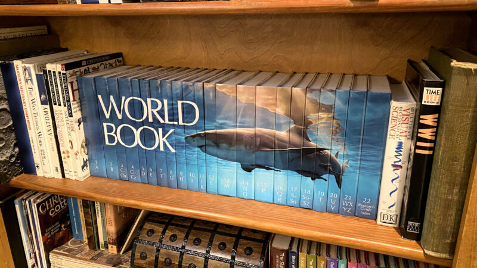
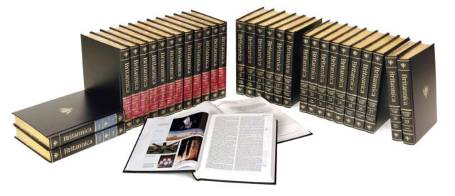

#### A handsome, shark-bound reference —  

一个英俊的、被鲨鱼咬过的参考资料 --

## The still-updated World Book Encyclopedia is my antidote to the information apocalypse.  

仍在更新的《世界图书百科全书》是我应对信息末日的解药。

[Enlarge](https://cdn.arstechnica.net/wp-content/uploads/2023/06/world_book_hero_2-scaled.jpg) / A photo of the 2023 edition of the World Book Encyclopedia on the author's family room shelf.  

放大/作者家庭房间书架上的2023年版《世界图书百科全书》的照片。

Benj Edwards 本杰-爱德华兹

These days, many of us live online, where machine-generated content has begun to [pollute](https://www.nytimes.com/2023/05/19/technology/ai-generated-content-discovered-on-news-sites-content-farms-and-product-reviews.html) the Internet with misinformation and noise. At a time when it's hard to know what information to trust, I felt delight when I recently learned that World Book [still prints](https://www.worldbook.com/worldbookencyclopedia2023) an up-to-date book encyclopedia in 2023. Although the term "encyclopedia" is now almost synonymous with [Wikipedia](https://www.wikipedia.org/), it's refreshing to see such a sizable reference printed on paper. So I [bought one](https://amzn.to/3qBdY1p), and I'll tell you why.  

这些天，我们许多人都生活在网上，机器生成的内容已经开始用错误的信息和噪音污染互联网。在很难知道该相信什么信息的时候，当我最近得知世界书局在2023年仍然印刷最新的图书百科全书时，我感到很高兴。虽然 "百科全书 "一词现在几乎成了维基百科的同义词，但看到这样一本印在纸上的可观的参考资料，还是让人耳目一新。所以我买了一本，我将告诉你为什么。

Based in Chicago, World Book, Inc. first published an encyclopedia in 1917, and it has released a new edition almost every year since 1925. The company, a subsidiary of Warren Buffett's [Berkshire Hathaway](https://en.wikipedia.org/wiki/Berkshire_Hathaway), claims that its encyclopedia is "the only general reference encyclopedia still published today." My research seems to back up this claim; it's true even for other languages. Its fiercest competitor of yore, The Encyclopedia Britannica, [ended its print run](https://www.reuters.com/article/net-us-encyclopediabritannica/encyclopedia-britannica-ends-print-goes-digital-idUSBRE82C1FS20120314) in 2012 after 244 years in print.  

总部设在芝加哥的世界图书公司于1917年首次出版了一本百科全书，自1925年以来，它几乎每年都会推出新版本。该公司是沃伦-巴菲特的伯克希尔-哈撒韦公司的子公司，它声称其百科全书是 "今天仍在出版的唯一的通用参考百科全书"。我的研究似乎支持这一说法；即使对其他语言也是如此。它过去最激烈的竞争对手《大英百科全书》在印刷了244年后于2012年结束了它的印刷。

In a nod to our present digital age, World Book also offers its encyclopedia as a [subscription service](https://www.worldbook.com/digital.aspx) through the web. Yet it's the print version that mystifies and attracts my fascination. Why does it still exist?  

为了向我们现在的数字时代致敬，世界书局还通过网络提供其百科全书的订阅服务。然而，令我感到神秘和着迷的是印刷版本。为什么它仍然存在？

"Because there is still a demand!" Tom Evans, World Book's editor-in-chief, told Ars over email.  

"因为仍然有需求！"世界书局的主编汤姆-埃文斯通过电子邮件告诉阿斯。

Today, up-to-date information flows freely thanks to the Internet. It's only a Google search away. Many people rely on Wikipedia, which is a nonprofit collaborative resource, for reference purposes. Despite that, some people and organizations apparently still buy paper encyclopedias. Evans said that sales of the print edition are "in the thousands" and that World Book always prints just enough copies to satisfy demand.  

今天，由于互联网的存在，最新的信息自由流动。只需在谷歌上搜索一下就可以了。许多人依赖维基百科，这是一个非营利性的合作资源，用于参考目的。尽管如此，一些人和组织显然仍然购买纸质百科全书。埃文斯说，印刷版的销售量 "数以千计"，而且世界书局总是印制足够的副本来满足需求。

[Enlarge](https://cdn.arstechnica.net/wp-content/uploads/2023/06/encyclopedia_britannica.jpg) / The Encyclopedia Britannica, a competitor of World Book, ended its print run in 2012.  

放大/《大英百科全书》是世界书的竞争者，于2012年结束了印刷。

Encyclopedia Britannica 大英百科全书》(Encyclopedia Britannica)

A World Book rep [told Quartz](https://qz.com/1271013/does-anyone-still-sell-world-book-encyclopedias) in 2019 that the print encyclopedia sold mostly to schools, public libraries, and homeschooling families. Today, Evans says that public and school libraries are still the company's primary customers. "World Book has a loyal following of librarians who understand the importance of a general reference encyclopedia in print form, accessible to all."  

世界书局的一名代表在2019年告诉石英，印刷版百科全书主要卖给学校、公共图书馆和家庭教育家庭。今天，埃文斯说，公共和学校图书馆仍然是该公司的主要客户。"世界图书公司拥有一批忠实的图书馆员，他们了解以印刷品形式提供的一般参考百科全书的重要性，所有人都可以使用。"

As a kid, our family owned a 1968 edition of World Book that I relied on for school reports and projects all the way until my high school graduation in 1999, although I briefly used [Microsoft Encarta](https://en.wikipedia.org/wiki/Encarta) on CD-ROM and a [CompuServe encyclopedia](https://www.vintagecomputing.com/index.php/archives/685/retro-scan-of-the-week-the-compuserve-school-report) in the 1990s. At the time, even with electronic references, instantaneous, up-to-date information didn't seem as important. We were still largely operating at the speed of paper. While that concept seems foreign to us in our current world, there was a certain kind of comfort in that slowness.  

小时候，我们家有一本1968年版的《世界书》，我一直依靠它来做学校报告和项目，直到1999年高中毕业，尽管在20世纪90年代我曾短暂使用过微软的Encarta光盘和CompuServe的百科全书。当时，即使有了电子参考资料，即时的、最新的信息似乎并不那么重要。我们在很大程度上仍然以纸张的速度运作。虽然这个概念对我们现在的世界来说似乎很陌生，但这种缓慢的速度有某种安慰。

Speaking of slow, a paper encyclopedia set certainly can't run away from you. Back in the day, our family's encyclopedia set took up a large dedicated shelf in our family room. Just like my old 1968 edition, the new print edition of World Book is a physically hefty reference. The 2023 version spans 17,000 articles spread over 14,000 pages in 22 volumes. The company says it features over 25,000 photographs, illustrations, diagrams, and maps.  

说到慢，一套纸质的百科全书肯定是跑不了的。在过去，我们家的这套百科全书在家庭房间里占了一个大的专用书架。就像我1968年的老版本一样，新印刷版的《世界大全》是一本物理上很厚重的参考书。2023年的版本有17,000篇文章，分布在22卷的14,000页上。该公司说，它有超过25,000张照片、插图、图表和地图。

All this paper-bound content can't possibly come cheap, you might think. And, of course, you're right. At a time when most information comes to us for free online (with [strings attached](https://en.wikipedia.org/wiki/Surveillance_capitalism), of course), it's easy to have sticker shock at the $1,199 retail price for the 2023 edition of World Book, although shoppers might occasionally find it for as low as $799 on Amazon (to compare, the online subscription costs [$250 per year](https://www.worldbook.com/World-Book-Online)). Earlier editions are available for much lower prices.  

你可能会想，所有这些纸质的内容不可能便宜。当然，你是对的。在大多数信息都是通过网络免费提供给我们的时候（当然是有附加条件的），我们很容易对2023年版《世界书》1199美元的零售价感到震惊，尽管购物者偶尔会在亚马逊上找到低至799美元的价格（作为比较，在线订阅每年需要250美元）。更早的版本可以用更低的价格买到。

I know it may seem weird to prefer the print edition since you can get the same content in the online version in a space-saving and portable format. But with the paper version, the World Book will always be yours. It can't be edited stealthily or taken down if the company needs the server space or goes out of business.  

我知道喜欢印刷版可能看起来很奇怪，因为你可以在网络版中以节省空间和便携的格式获得同样的内容。但是有了纸质版，世界书将永远是你的。它不能被隐蔽地编辑，也不能在公司需要服务器空间或倒闭时被取下。

So I took the plunge.  

所以我冒了险。
