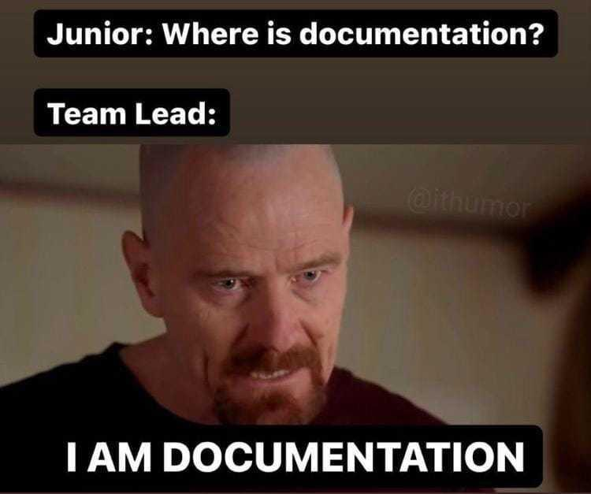
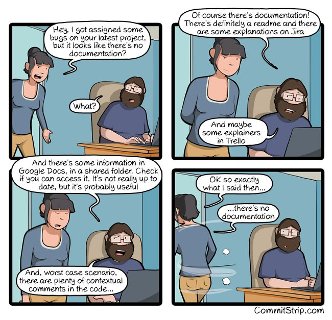
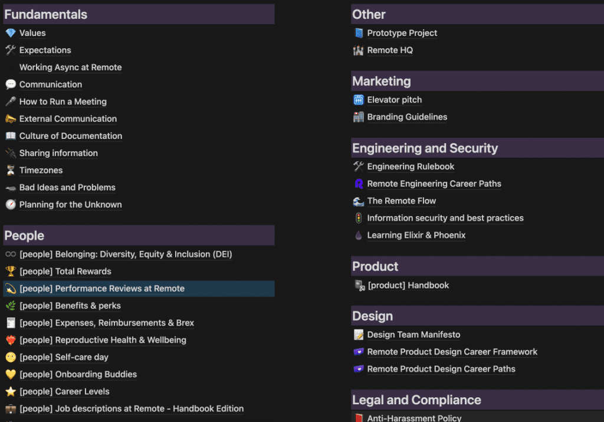
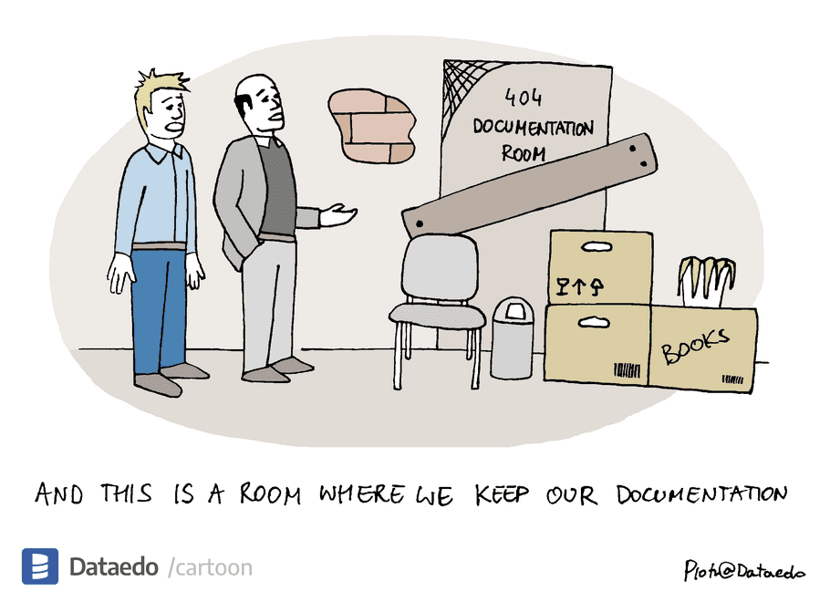

I’m a big fan of documentation. I think it’s my favorite boring thing to do after coding. It brings the business so much long-term value that every hour invested into documentation by anyone saves literally x100 productivity hours across the company.  

我是文档的忠实粉丝。我认为这是我编码后最喜欢做的无聊的事情。它为企业带来了如此多的长期价值，以至于任何人在文档中投入的每一小时都可以在整个公司节省 x100 个生产力小时。

If you’re a CTO, documentation is your secret weapon, the unsung hero of your startup, the gray knight, which keeps things going behind the product development. It eradicates guesswork and reinvention of the wheel. Think of it as your golden ticket to suuuuper fast onboarding. This treasure map guides newcomers and veterans from other departments into the labyrinth of your startup's processes. Your team will find their footing faster, becoming effective contributors sooner, and work more effectively than you'd expect, all because you decided to prioritize writing down stuff.  

如果你是一名首席技术官，文档就是你的秘密武器，是你创业公司的无名英雄，灰骑士，它使产品开发落后。它消除了猜测和轮子的重新发明。把它想象成你快速入职的黄金门票。这张藏宝图引导其他部门的新手和退伍军人进入创业公司流程的迷宫。你的团队会更快地找到自己的立足点，更快地成为有效的贡献者，并且比你预期的更有效，这一切都是因为你决定优先考虑写下东西。



Don't be like this. 不要这样。

Here’s a question for you, which is better:  

这里有一个问题要问你，哪个更好：

1.  Writing someone an email, knocking them out of their focus zone, asking to explain how a piece of software works  
    
    给某人写一封电子邮件，把他们赶出他们的焦点区域，要求解释一个软件是如何工作的
2.  Or looking up the necessary information yourself and processing that at your own pace.  
    
    或者自己查找必要的信息并按照自己的节奏进行处理。

Hint: It’s the second one.  

提示：这是第二个。

## [](https://vadimkravcenko.com/shorts/proper-documentation/#importance-of-documentation)Importance of Documentation  

文档的重要性

Let’s start from the basics.  

让我们从基础开始。

Imagine you’re a technical co-founder at an early-stage startup (or maybe you don’t even need to imagine), and you’re drowning in chaos, as is expected. You’re playing whack-a-mole on a daily basis and are just trying to get a single breath of sanity before being pulled down into yet another issue. How do you get out of this spiral? The answer is simple — documentation. Now, I'm not just talking about maintaining a simple how-to manual or jotting down meeting minutes; Those are also important, yes, but I mean building a culture where knowledge isn't confined to individuals but is dispersed and accessible to the entire organization.  

想象一下，你是一家早期创业公司的技术联合创始人（或者你甚至不需要想象），正如预期的那样，你正淹没在混乱中。你每天都在玩打鼹鼠，只是想在被拉入另一个问题之前获得一口理智。你如何摆脱这个漩涡？答案很简单——文档。现在，我不只是在谈论维护一个简单的操作手册或记下会议记录;这些也很重要，是的，但我的意思是建立一种文化，在这种文化中，知识不仅限于个人，而是分散的，整个组织都可以访问。

**Every single thing that is not written down equals wasted resources in the future and a potential for headaches.** Your headaches. And I don’t know about you, but I’d like to make sure I don’t have any headaches; that’s why I enjoy building systems that work without me. Now imagine how much stuff you haven’t written down yet, and that’s your current potential to drown in unexpected issues. For example, your continuous deployment broke because of some package updates. Coincidentally only Bob from Department X knows how to fix this issue. Oh, and they’re on vacation this whole week.  

每一件没有写下来的事情都等于未来的资源浪费和潜在的头痛。你的头痛。我不了解你，但我想确保我没有任何头痛;这就是为什么我喜欢构建没有我也能工作的系统。现在想象一下你还有多少东西还没有写下来，这就是你目前淹没在意想不到的问题中的可能性。例如，由于某些包更新，持续部署中断。巧合的是，只有部门 X 的 Bob 知道如何解决此问题。哦，他们整个星期都在度假。

```
🚨 Documentation lessens headaches and saves vacations.
```

You can think of Documentation as essentially the backbone of effective knowledge sharing. In the early stages of a startup, when you’re the only one coding and building, sharing information and insights can be as simple as chatting with your CEO across the desk. You have the knowledge and the means to fix something if it breaks. But this is exhausting, and you’re basically the limiting factor of the company. If you go on vacation — scratch that; you’re not going on vacation because everything will stop if you do.  

您可以将文档视为有效知识共享的支柱。在初创公司的早期阶段，当您是唯一编码和构建的人时，共享信息和见解就像在办公桌对面与您的首席执行官聊天一样简单。你有知识和方法在它坏了时修复它。但这很累，你基本上是公司的限制因素。如果你去度假——抓挠那个;你不会去度假，因为如果你去度假，一切都会停止。

As the startup scales, the number of people, projects, and complexities increase exponentially. The knowledge gets siloed in your head, communication becomes convoluted, and before you know it, people are spending more time hunting you down for information than actually using it. **If you’re a technical co-founder - extract every bit of knowledge that you can and put it into writing.** This will serve as a universal source of truth, a dynamic repository that captures and preserves collective wisdom. This wisdom can help everyone on the team solve issues they had no idea how to solve a minute ago. And this will also allow you to take a vacation. Trust me; you need it.  

随着初创公司的规模扩大，人员、项目和复杂性的数量呈指数级增长。知识在你的脑海中变得孤立，沟通变得复杂，在你意识到之前，人们花更多的时间寻找你的信息，而不是实际使用它。如果你是一个技术联合创始人 - 提取你能提取的每一点知识，并将其写成文字。这将作为一个普遍的真相来源，一个捕捉和保存集体智慧的动态存储库。这种智慧可以帮助团队中的每个人解决他们一分钟前不知道如何解决的问题。这也将允许您休假。相信我;你需要它。

## [](https://vadimkravcenko.com/shorts/proper-documentation/#documentation-first-meetings-second)Documentation first, meetings second  

文件第一，会议第二

So now that you know that documentation makes your life easier and not harder, let’s talk about time and efficiency.  

因此，既然您知道文档使您的生活更轻松而不是更难，那么让我们谈谈时间和效率。

In the world of startups, time is the ultimate currency. Each tick of the clock carries the weight of decisions made, products built, and markets conquered. And meetings are notorious thieves of this currency. Don't get me wrong. I'm not saying that all meetings are evil, but we must critically scrutinize their cost against their value. In the words of Bukowski, "Don't do it unless it comes out of your soul like a rocket," apply the same principle to meetings — don't hold them unless necessary.  

在创业公司的世界里，时间是最终的货币。时钟的每一滴答声都承载着决策、制造产品和征服市场的重量。会议是臭名昭著的这种货币窃贼。不要误会我的意思。我并不是说所有的会议都是邪恶的，但我们必须严格审查它们的成本和它们的价值。用布科夫斯基的话来说，“除非它像火箭一样从你的灵魂中出来，否则不要这样做”，将同样的原则应用于会议——除非必要，否则不要举行会议。

The constant need to have meetings is a symptom of a deeper problem — **a lack of clear, accessible, and reliable documentation.** A well-documented workflow doesn't need an hour-long session for clarification. A well-documented decision doesn't need a room full of people to understand its rationale. A well-documented knowledge base doesn't need a group huddle whenever a new member joins the team.  

不断需要开会是一个更深层次问题的征兆——缺乏清晰、可访问和可靠的文档。记录良好的工作流程不需要长达一小时的会议来澄清。一个有据可查的决定不需要一屋子的人来理解它的基本原理。一个有据可查的知识库不需要在新成员加入团队时进行分组。

"But aren't meetings essential for communication?" Yes, they are. But too many of them, especially the poorly managed ones, can cripple your startup. They create an illusion of productivity, while in reality, they are stunting it. By reducing reliance on meetings and emphasizing documentation-first asynchronous communication, you're empowering your team to communicate effectively without being bound by the confines of a Zoom call.  

“但会议不是沟通的必要条件吗？”是的，他们是。但是其中太多，尤其是管理不善的，可能会削弱你的创业公司。他们创造了一种生产力的错觉，而实际上，他们正在阻碍生产力。通过减少对会议的依赖并强调文档优先的异步通信，您可以使您的团队能够有效地进行沟通，而不受 Zoom 通话的限制。


That would be an awesome feature. Source: Twitter  

这将是一个很棒的功能。来源：推特

Think about it: every unnecessary meeting is a missed opportunity. It's time that could have been spent refining that crucial algorithm or simply taking a moment to recharge and prevent burnout. In essence, reducing the reliance on meetings isn't just about reclaiming time; it's about reclaiming the ability to focus, innovate, and create — the very lifeblood of a startup.  

想想看：每一次不必要的会议都是错失的机会。这是本可以花在完善关键算法上的时间，或者只是花点时间充电并防止倦怠。从本质上讲，减少对会议的依赖不仅仅是回收时间;这是关于重新获得专注、创新和创造的能力——这是初创公司的命脉。

As a CTO who's been through the fiery crucible of startup growth more times than I care to count, I can assure you: **your time and resources are better spent documenting than on meetings.** Most meetings could easily be replaced by a well-drafted document that presents the relevant data and proposed solutions and invites feedback.  

作为一名经历过创业成长的火热熔炉的首席技术官，我可以向你保证：你的时间和资源花在记录上比花在会议上更好。大多数会议可以很容易地被一份精心起草的文件所取代，该文件提供了相关数据和拟议的解决方案，并邀请反馈。

```
💡 Meetings have a way of ballooning out of proportion. You call a quick catch-up to discuss a minor issue, and before you know it, you're embroiled in a two-hour debate about the color of the landing page's CTA button.
```

Also, meetings often favor the loudest voices, not necessarily those with the best ideas. It's a subtle form of bias that can stifle innovation and diversity of thought. Documentation, on the other hand, levels the playing field. It provides a platform for every team member to articulate their thoughts and insights, regardless of rank or communication style. It promotes a culture of thoughtfulness and reflection rather than snap judgments and impulsive decisions.  

此外，会议通常偏爱最响亮的声音，而不一定是那些有最好想法的人。这是一种微妙的偏见形式，可以扼杀创新和思想的多样性。另一方面，文档可以创造公平的竞争环境。它为每个团队成员提供了一个平台，无论级别或沟通方式如何，都可以表达他们的想法和见解。它提倡一种深思熟虑和反思的文化，而不是仓促的判断和冲动的决定。

You might think it’s a good idea to have a company-wide meeting where you announce that you will integrate AI into all the processes starting now. But is it? In the adrenaline rush of being part of a fast-paced startup, it's easy for details to get lost in the whirlwind. You mention something, you make a joke, you mumble and miscommunicate, and before you know it, you have another issue on your plate that needs solving. Writing down the decision and how it came to be equals clarity.  

您可能认为召开全公司范围的会议是个好主意，宣布将从现在开始将AI集成到所有流程中。但真的是这样吗？在成为快节奏初创公司一部分的肾上腺素激增中，细节很容易迷失在旋风中。你提到一些事情，你开个玩笑，你喃喃自语和沟通不畅，在你意识到之前，你的盘子里还有另一个问题需要解决。写下决定及其形成方式等于清晰。

Every decision is a brick in the foundation of your growing startup, and documenting them can provide a solid record, a kind of architecture blueprint that details your thought processes, concerns, and rationale. This clarity can be invaluable as you scale and face increasingly complex challenges.  

每个决定都是您成长中的创业公司基础中的一块砖，记录它们可以提供一个可靠的记录，一种架构蓝图，详细说明您的思维过程、关注点和基本原理。当您扩展规模并面临日益复杂的挑战时，这种清晰度可能是无价的。

Enjoyed the read? Subscribe to read more articles from me.  

喜欢阅读吗？订阅以阅读我的更多文章。

When you introduce documentation into your decision-making process, it acts as a knowledge repository. It holds the context, the insights, and the learning that came with each decision. And this repository can be referred back to when similar situations arise. You can reference them. This, in itself, is a sustainability hack.  

当您将文档引入决策过程时，它充当知识库。它包含每个决策的背景、见解和学习。当出现类似情况时，可以参考此存储库。您可以引用它们。这本身就是一个可持续性黑客。

Now, as a CTO, how can you facilitate this? Encourage your team to document their decision-making process to clarify assumptions, reasoning, and expected outcomes. Make it a standard practice to discuss these documented decisions in your meetings, promoting a culture of open feedback and collaborative decision-making.  

现在，作为首席技术官，您如何促进这一点？鼓励您的团队记录他们的决策过程，以澄清假设、推理和预期结果。在会议中讨论这些记录在案的决策成为标准做法，促进开放反馈和协作决策的文化。

The beauty of this is that it turns every decision into a learning opportunity, fostering a growth mindset within your team. **It allows everyone to see the consequences of past choices and understand the considerations behind them, making them better decision-makers.**  

这样做的美妙之处在于，它将每个决定都转化为学习机会，在团队中培养成长心态。它让每个人都能看到过去选择的后果，并了解其背后的考虑因素，使他们成为更好的决策者。

## [](https://vadimkravcenko.com/shorts/proper-documentation/#building-a-documentation-first-culture)Building a documentation-first culture  

建立文档优先的文化

Documentation-first culture means cultivating a shared consciousness in your startup, a unifying force that links everyone together. This isn't just about some rigid adherence to process — it's about democratizing knowledge, breaking down hierarchical barriers, and fostering a learning culture. A documentation-first culture does not mean everyone is busy writing documents all day. _It means that everyone appreciates the value of documenting and sharing their experiences._  

文档优先的文化意味着在你的创业公司中培养一种共同的意识，一种将每个人联系在一起的统一力量。这不仅仅是对流程的严格遵守——而是关于知识民主化、打破等级障碍和培养学习文化。文档优先的文化并不意味着每个人都整天忙于编写文档。这意味着每个人都欣赏记录和分享他们的经验的价值。

What it also means, of course — when building a project, always account for documentation as part of ANY task. It should be a default that some percentage of employees’ time goes into writing down their stories. It's not just about efficiency — it's about creating an environment where shared knowledge is celebrated. It's about creating a culture that doesn't just create a product but crafts a story — a story of collective growth.  

当然，这也意味着什么 - 在构建项目时，始终将文档作为任何任务的一部分。默认情况下，员工一定比例的时间用于写下他们的故事。这不仅仅是关于效率 - 而是关于创造一个庆祝共享知识的环境。这是关于创造一种文化，这种文化不仅仅是创造一种产品，而是创造一个故事——一个集体成长的故事。



Relatable? Source:CommitStrip  

相关？来源：提交条

Your role in this can be as a catalyst and a facilitator. Always start by setting an example. Document your own processes and decisions and share them openly. Take notes, always. Encourage a culture of feedback and learning, where every document is a starting point for discussion, improvement, and innovation. If a decision needs to be made, start with a document, not a meeting. If there’s a pros/cons discussion — start with a document.  

你在这方面的角色可以是催化剂和促进者。始终从树立榜样开始。记录您自己的流程和决策，并公开分享。始终记笔记。鼓励反馈和学习的文化，其中每个文档都是讨论、改进和创新的起点。如果需要做出决定，请从文件开始，而不是会议。如果有利弊讨论——从文档开始。

```
💡 As a CTO, people will look up to you and do as you do. Because everything that you do in the context of your company is the right way to do it, this is a double-edged sword, so be careful with what example you set for others.
```

By encouraging your colleagues to document their processes, decisions, and learnings, you're showing that you value their insights and experiences. This fosters a sense of ownership and engagement beyond their designated roles and tasks. They become active contributors to the company's knowledge base and its success.  

通过鼓励您的同事记录他们的流程、决策和学习，您表明您重视他们的见解和经验。这培养了一种超越其指定角色和任务的主人翁感和参与感。他们成为公司知识库及其成功的积极贡献者。

Give praise to those who write good documentation. Share it publicly. Congratulate those who are as enthusiastic about documentation as you are.  

表扬那些写好文档的人。公开分享。祝贺那些像您一样热衷于文档的人。

### [](https://vadimkravcenko.com/shorts/proper-documentation/#the-tools)The Tools 工具

Next, give tools to your team members that make documentation a breeze. Find a tool that fits your team’s needs and workflows, whether a shared drive, Notion, Confluence, Gitlab, or some other knowledge management platform. There are hundreds of them. Remember, the easier you make it for your team to document their work, the more likely they are to do it.  

接下来，为您的团队成员提供工具，使文档变得轻而易举。找到适合您团队需求和工作流程的工具，无论是共享驱动器、概念、Confluence、Gitlab 还是其他知识管理平台。有数百个。请记住，您越容易让您的团队记录他们的工作，他们就越有可能这样做。

Prepare templates AND guidelines. Think of them as the DNA of your documentation - they provide the structure, consistency, and predictability that allow your knowledge to replicate and spread effectively throughout the organization. This is a complex and time-intensive task, but once you have them, it gets easier.  

准备模板和指南。将它们视为文档的 DNA - 它们提供结构、一致性和可预测性，使您的知识能够在整个组织中有效地复制和传播。这是一项复杂且耗时的任务，但是一旦拥有它们，它就会变得更容易。



Remote.Com Notion documentation. Inspired by GitLab  

Remote.Com 概念文档。灵感来自 GitLab

Templates ensure the information is recorded in a standardized format, making it easy to understand and compare. On the other hand, guidelines provide the 'rules of the game,’ ensuring that everyone understands what to document, how to do it, and where to find it.  

模板确保信息以标准化格式记录，使其易于理解和比较。另一方面，指南提供了“游戏规则”，确保每个人都了解要记录的内容，如何做以及在哪里可以找到它。

```
💡 Create checklists, initiate review processes, and set up version control. These tools aren't chains; they help your documentation speak with one voice, one tone, and one style.
```

Promote documentation as a part of your company's values. Encourage your team to see it not as an additional chore but as an integral part of their work, as vital as writing code. Make it a routine part of performance evaluations and feedback sessions. Ask them to improve it, and ask them to find flaws in your processes.  

将文档推广为公司价值观的一部分。鼓励你的团队不要把它看作是一件额外的苦差事，而是看作是他们工作中不可或缺的一部分，就像编写代码一样重要。使其成为绩效评估和反馈会议的常规部分。要求他们改进它，并要求他们发现您的流程中的缺陷。

As your startup evolves, so will its documentation needs.  

随着初创公司的发展，其文档需求也会随之增长。

### [](https://vadimkravcenko.com/shorts/proper-documentation/#dedicated-team)The People 野

Designating a dedicated team or individual for documentation in an early-stage startup can seem extravagant. But trust me, it’s one of the smartest investments you can make. Why? Because knowledge is the lifeblood of your startup, and a dedicated handbook team acts as the circulatory system, ensuring that this vital knowledge flows freely and efficiently throughout the organization.  

在早期创业公司中指定一个专门的团队或个人来记录文档似乎很奢侈。但相信我，这是你能做的最明智的投资之一。为什么？因为知识是您创业公司的命脉，而专门的手册团队充当循环系统，确保这些重要知识在整个组织中自由有效地流动。

```
💡 It doesn’t need to be a whole team, though. A single person whose job is solely focused on improving the documentation can be a huge asset.
```

The benefits extend beyond mere knowledge management. Your documentation team can enhance overall organizational effectiveness by bridging gaps between teams, facilitating cross-functional collaboration, and breaking down silos. They serve as the glue that binds all your team brains together.  

好处不仅仅是知识管理。您的文档团队可以通过弥合团队之间的差距、促进跨职能协作和打破孤岛来提高整体组织效率。它们是将您所有团队大脑结合在一起的粘合剂。

### [](https://vadimkravcenko.com/shorts/proper-documentation/#moving-forward)The Pushback 反击

Not everyone is going to like it. If you’re an established startup with a few years under your belt, there will be pushback. Remember, you're not just dealing with code; you're dealing with people. Their fears, comfort zones, and hesitations are as real as any technical bug. They need to be addressed with the same level of patience.  

不是每个人都会喜欢它。如果你是一家成熟的创业公司，有几年的时间，就会有阻力。请记住，您不只是在处理代码;你在与人打交道。他们的恐惧、舒适区和犹豫与任何技术错误一样真实。需要以同样的耐心解决这些问题。

One of the most effective ways to deal with resistance is through engagement.  Listen to your team's concerns, understand their perspectives, and address their fears. Show them the benefits, efficiencies, and liberation a documentation-first culture can bring. And I’d like to repeat — model the behavior you want to see, be the first to document, to share, to learn, and show them how awesome it can be.  

应对阻力的最有效方法之一是通过接触。 倾听团队的担忧，了解他们的观点，并解决他们的恐惧。向他们展示文档优先文化可以带来的好处、效率和解放。我想重复一遍——模仿你想看到的行为，成为第一个记录、分享、学习的人，并向他们展示它有多棒。



Celebrate those who dare go into this room to fix things.  

庆祝那些敢于进入这个房间解决问题的人。  

Source: Dataedo 来源：数据网

Celebrate those who adopt this culture — their wins, efforts, and strides toward a documentation-first approach. This not just encourages them but also inspires others to follow suit.  

庆祝那些采用这种文化的人 - 他们的胜利、努力和朝着文档优先方法迈进。这不仅鼓励了他们，也激励了其他人效仿。

It’s not that “not everyone will like it” is your only problem. The documentation itself will also not be perfect and might be pretty bad at the start. That’s okay, don’t panic. Remember, it’s a living organism that takes time to evolve. As a CTO, your role is to ensure that the quality of your documentation grows over time. This isn't about policing. It’s about cultivating.  

并不是说“不是每个人都会喜欢它”是你唯一的问题。文档本身也不会完美，一开始可能会很糟糕。没关系，不要惊慌。请记住，它是一种需要时间进化的生物体。作为首席技术官，您的职责是确保文档质量随着时间的推移而提高。这与警务无关。这是关于培养的。

### [](https://vadimkravcenko.com/shorts/proper-documentation/#what-good-documentation-has)The Good 善

This is more of my subjective thoughts on how good documentation looks like.  

这更多的是我对好文档的主观想法。

**First off, clarity and conciseness.** It's about breaking down complex concepts into digestible bits, trimming the fat, and focusing on what matters. Your document isn't some long-winded novel; it's a guidebook that others need to follow.  

首先，清晰简洁。这是关于将复杂的概念分解成可消化的部分，减少脂肪，并专注于重要的事情。您的文档不是什么冗长的小说;这是其他人需要遵循的指南。

-   For example, in Notion, you can emphasize information in different ways.  
    
    例如，在 Notion 中，您可以通过不同的方式强调信息。
-   If it feels too dry, it needs to be rewritten.  
    
    如果感觉太干，需要重写。
-   Add Illustrations and video explanations.  
    
    添加插图和视频说明。

**Then comes structure and organization.** You need a format that makes sense, that's intuitive. If people can't find what they're looking for, they'll get lost and frustrated. Your document needs to guide them, not confuse them.  

然后是结构和组织。你需要一种有意义、直观的格式。如果人们找不到他们想要的东西，他们就会迷路和沮丧。您的文档需要引导他们，而不是混淆他们。

-   Break it down into pages and cross-link related documents.  
    
    将其分解为页面并交叉链接相关文档。
-   Build a table of contents.  
    
    构建目录。
-   Next / Previous — suggest which other document might be helpful.  
    
    下一个/上一个 — 建议哪个其他文档可能会有所帮助。

**Next up, accessibility and discoverability.** Your document isn't some secret tome hidden in a dusty old library. It's a living, breathing resource that needs to be easily accessible and discoverable.  

接下来是可访问性和可发现性。您的文档不是隐藏在尘土飞扬的旧图书馆中的秘密大部头。它是一种活生生的、呼吸的资源，需要易于访问和发现。

-   Utilize tags and categories, and segment your information into different clusters.  
    
    利用标签和类别，并将您的信息细分到不同的集群中。
-   Utilize full-text search or AI vector search  
    
    利用全文搜索或 AI 矢量搜索

**Lastly, and this is critical, your document isn't a monument.** It's not something you build once and forget about. It's a growing, evolving entity that needs regular updates and maintenance. Your organization changes, your knowledge expands, and your document needs to reflect that.  

最后，这一点至关重要，您的文档不是纪念碑。这不是你构建一次就忘记的东西。这是一个不断发展的实体，需要定期更新和维护。您的组织在变化，您的知识在扩展，您的文档需要反映这一点。

-   Track the last changed dates, and update those older than a year.  
    
    跟踪上次更改的日期，并更新超过一年的日期。
-   Track who the owner of this information is, and update it regularly.  
    
    跟踪此信息的所有者是谁，并定期更新。

Here are a few open-source documentation systems that I recommend studying to get some inspiration:  

以下是一些我建议学习以获得灵感的开源文档系统：

1.  Gitlab — [Gitlab handbook](https://about.gitlab.com/handbook/) is 2000 Pages of Documentation that is version-controlled and is constantly updated. Highly recommend reading through it.  
    
    Gitlab — Gitlab 手册是 2000 页的文档，由版本控制并不断更新。强烈建议通读。
2.  Strapi - Inspired by the radical transparency of Gitlab, also [good documentation](https://handbook.strapi.io/) to read through.  
    
    Strapi - 受到Gitlab激进透明度的启发，也是很好的文档阅读。
3.  Remote.com - Another [good example](https://remotecom.notion.site/a3439c6ccaac4d5f8c7515c357345c11)  
    
    Remote.com - 另一个很好的例子

## [](https://vadimkravcenko.com/shorts/proper-documentation/#not-a-silver-bullet)Not a silver bullet  

不是灵丹妙药

I've been singing the praises of documentation for a while now; thanks for reading this far, by the way. But let me put down my pompoms for a minute: Documentation, while impressive, is not a magical cure-all. It won’t swoop in like some superhero and rescue your startup from every problem. It's a tool; like any tool, it has limitations. You’re still going to be dealing with issues… but less.  

一段时间以来，我一直在歌颂文档;顺便说一下，感谢您阅读本文。但让我放下我的绒球一分钟：文档虽然令人印象深刻，但并不是万能的灵丹妙药。它不会像一些超级英雄一样猛扑过来，把你的创业公司从每一个问题中拯救出来。它是一种工具;像任何工具一样，它也有局限性。你仍然要处理问题...但更少。

Documentation, while a boon for collaboration, is not a substitute for human interaction. It cannot replicate the nuances of face-to-face communication, the value of immediate feedback, or the bonding when a team huddles together to tackle a tricky problem. The camaraderie built during these meetings or even informal catch-ups is vital for fostering a healthy work culture and driving team motivation. If you swap all human interaction for a series of documents, you're setting up your team for isolation and disconnection, a one-way ticket to low engagement.  

文档虽然是协作的福音，但不能替代人类交互。它无法复制面对面沟通的细微差别、即时反馈的价值或团队聚集在一起解决棘手问题时的纽带。在这些会议甚至非正式追赶期间建立的友情对于培养健康的工作文化和推动团队动力至关重要。如果您将所有人际互动换成一系列文档，那么您正在设置您的团队隔离和断开连接，这是一张单程票，导致参与度低。

The process of documenting itself can be time-consuming. There's a certain art to writing a practical, concise, and easily digestible document. It requires thoughtfulness, clarity of thought, and a knack for simplification. Some might argue that the time spent crafting these documents could be better utilized elsewhere. And they're not entirely wrong. If you're documenting every tiny detail, you will have an overwhelming library of information that's as difficult to navigate as a dense jungle and might not be THAT useful.  

记录本身的过程可能很耗时。写一份实用、简洁、易于消化的文档是有一定的艺术的。它需要深思熟虑、思路清晰和简化的诀窍。有些人可能会争辩说，花在制作这些文件上的时间可以在其他地方得到更好的利用。他们并非完全错误。如果你记录每一个微小的细节，你将拥有一个压倒性的信息系统，这些信息库和茂密的丛林一样难以导航，而且可能没有那么有用。

```
🚨 Do you know how sometimes there are articles that have a 2000-word introduction to that one sentence that you need to solve your problem? That’s what over-documenting can feel like.
```

Lastly, despite your best efforts, documentation can quickly become outdated. Technology evolves, processes change, and what was relevant a month ago might not be relevant today. Keeping your documentation up to date requires constant vigilance and regular maintenance, which can be challenging for a rapidly growing startup with limited resources.  

最后，尽管您尽了最大努力，文档很快就会过时。技术在发展，流程在变化，一个月前相关的东西在今天可能已经不重要了。保持文档最新需要时刻保持警惕和定期维护，这对于资源有限的快速发展的初创公司来说可能具有挑战性。

## [](https://vadimkravcenko.com/shorts/proper-documentation/#conclusion)Conclusion 结论

My advice to all the young tech enthusiasts, future engineering managers, and CTOs is simple: cultivate a love for documentation. You may view it as a chore, an afterthought, or a nuisance. But trust me when I say this: Documentation isn't just a task on your to-do list; it's a pillar for success and a bridge that connects ideas, people, and vision. Treat it not as a burden but as an opportunity to learn, share, and create an impact.  

我对所有年轻的技术爱好者、未来的工程经理和首席技术官的建议很简单：培养对文档的热爱。您可能会将其视为苦差事、事后的想法或麻烦。但是当我这样说时，请相信我：文档不仅仅是您的待办事项列表中的一项任务;它是成功的支柱，也是连接思想、人员和愿景的桥梁。不要把它当作负担，而是把它当作学习、分享和产生影响的机会。

Start small, but start today. Don't wait for a grand strategy or a perfect tool. Start by documenting your code, your decisions, and your learnings. Make it a part of your daily workflow, not an end-of-the-day chore. And as you move forward, imbibe this culture of documentation into your teams, your projects, and your organization. Create systems and processes that encourage and facilitate documentation.  

从小处着手，但从今天开始。不要等待一个宏伟的战略或一个完美的工具。首先记录您的代码、决策和学习情况。让它成为您日常工作流程的一部分，而不是一天结束时的琐事。随着您的前进，将这种文档文化吸收到您的团队、项目和组织中。创建鼓励和促进文档编制的系统和流程。

If there’s one thing you can take out from this article, carry this mantra with you: _"Document to empower, document to grow."_ Embrace this philosophy, and you'll be surprised at the transformations it brings, not just in your career but in how you view and navigate the world of technology.  

如果你能从这篇文章中拿出一件事，那就随身携带这个口头禅：“记录授权，文件成长。接受这种哲学，你会惊讶于它带来的转变，不仅在你的职业生涯中，而且在你如何看待和驾驭技术世界。

Enjoyed the read? Subscribe to read more articles from me.  

喜欢阅读吗？订阅以阅读我的更多文章。

___

Other [Newsletter](https://vadimkravcenko.com/newsletter/) Issues: 其他时事通讯问题：

-   [Contracts you should never sign  
    
    你永远不应该签署的合同](https://vadimkravcenko.com/shorts/contracts-you-should-never-sign/)
-   [⛓ Implementing Atomic Habits in IT  
    
    ⛓ 在 IT 中实施原子习惯](https://vadimkravcenko.com/shorts/atomic-habits-in-it/)
-   [Things they didn’t teach you about Software Engineering  
    
    他们没有教你关于软件工程的事情](https://vadimkravcenko.com/shorts/things-they-didnt-teach-you/)

### [](https://vadimkravcenko.com/shorts/proper-documentation/#reactions-new)Reactions  反应New! 新增功能！
