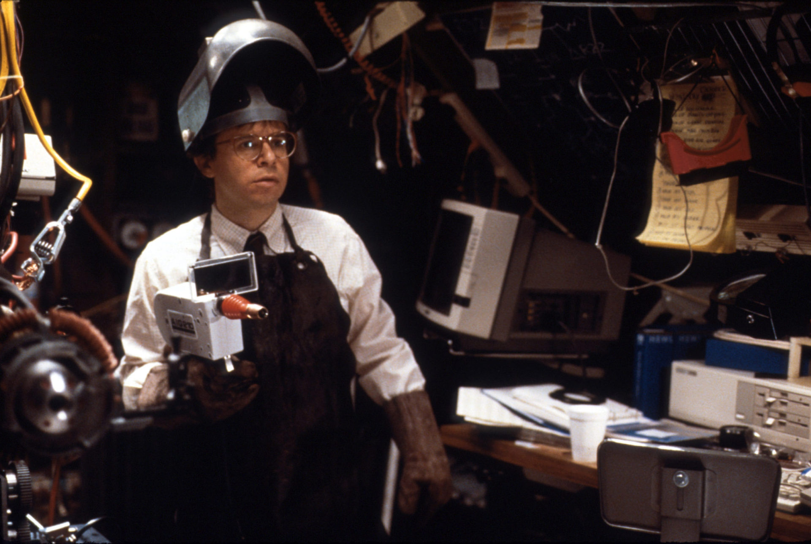
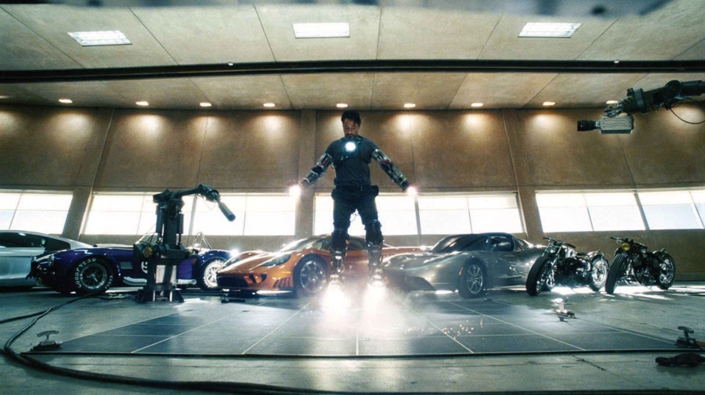

As a child of the 1990s, only three possible jobs existed to my young mind: paleontologist, Chicago Bull, and inventor. The last seemed the most practical of the options, as I lacked the height to dunk or the lateral agility to juke velociraptors. Invention seemed practical by its sheer omnipresence. In grade school we read about Great Men like Thomas Edison and Nikola Tesla, singular visionaries who invented the future on their own initiative.  

作为20世纪90年代的孩子，在我年轻的头脑中只有三种可能的工作：古生物学家、芝加哥公牛和发明家。最后一种似乎是最实用的选择，因为我缺乏扣篮的身高和对付迅猛龙的横向敏捷性。发明似乎因其无处不在而显得实用。在小学里，我们读到了像托马斯-爱迪生和尼古拉-特斯拉这样的伟人，他们是主动发明未来的奇异的幻想家。

Television and movies brought it closer to home. Edison and Tesla were distant from me by time and complicated suits, but on the big (and little) screen, inventors were my contemporaries. They were of similar look and means, most notably in their “laboratory.” Pop culture inventors invariably worked out of their garages, that emblem of middle-class mobility. Invention seemed within reach when it was two steps out the front door.  

电视和电影让它离家更近。爱迪生和特斯拉因时间和复杂的西装而与我相距甚远，但在大屏幕（和小屏幕）上，发明家是我的同龄人。他们有着相似的外表和手段，最明显的是在他们的 "实验室"。流行文化的发明家们总是在他们的车库里工作，那是中产阶级流动性的象征。发明似乎触手可及，只要走出前门两步就可以了。

This next generation doesn’t suffer from the same delusion, and their sanity frightens me. Instead, invention has become a secret knowledge, accessible only to M.I.T. grads (and occasionally Stanford). Rather than a meritocratic act of creation, invention in the public consciousness has become elite in nature and limited in scope. The pool of possible inventors has grown smaller, and the depth of their potential shallower. We used to dream of flying cars; now we only hope for slightly less buggy apps.  

这一代人并没有遭受同样的错觉，他们的理智让我感到害怕。相反，发明已经成为一种秘密知识，只有麻省理工学院的毕业生（偶尔也有斯坦福大学的毕业生）才能获得。公众意识中的发明不是一种功利性的创造行为，而是在性质上成为精英，在范围上受到限制。可能的发明家队伍已经越来越小，他们的潜力深度也越来越浅。我们曾经梦想着飞行汽车；现在我们只希望能有一个稍微不那么糟糕的应用程序。

The fault lies in a subtle yet violent shift in our imagination away from our own responsibility to invent. Pop culture’s vision of invention creates a place where inventions are not only possible but expected. In an ouroboros of cause and effect, our depiction of invention on the screen has shifted from populist obligation to the exclusive right of a technocratic priestly caste. To put it less verbosely, the inventors in film used to look like us; now they look like Robert Downey Jr.  

错就错在我们的想象力发生了微妙而猛烈的转变，脱离了我们自己的发明责任。流行文化对发明的看法创造了一个地方，在那里发明不仅是可能的，而且是期待的。在一个因果关系的乌龙事件中，我们在屏幕上对发明的描述已经从民众的义务转变为技术官僚牧师阶层的专属权利。简而言之，电影中的发明家过去像我们，现在他们像小罗伯特-唐尼。

Some of the fondest memories from my childhood are of staying home sick, watching daytime television. One commercial in this timeslot played more frequently than most. It showed a cartoon caveman carving the first wheel out of stone, and the voice-over encouraged viewers to patent their own invention at the advertised company, because clearly copyright law should have come before pants.  

我童年时最美好的记忆是生病呆在家里，看白天的电视。在这个时段，有一个广告比大多数广告播放得更频繁。它展示了一个卡通山顶洞人用石头雕刻出第一个车轮，画外音鼓励观众在广告公司为自己的发明申请专利，因为显然版权法应该在裤子之前。

The ad, like all daytime television commercials without Wilford Brimley, proved to be a scam. But then the whole myth of the lone wolf inventor was a scam as well. Tesla got his break working for Westinghouse, and Edison had his own sweatshop of engineers cranking out inventions while he was busy electrocuting dogs.  

这个广告，就像所有没有威尔福德-布林利的日间电视广告一样，被证明是一个骗局。但是，整个独狼式发明家的神话也是一个骗局。特斯拉在为西屋公司工作时获得了突破，爱迪生有自己的工程师血汗工厂，在他忙于电击狗的时候也在搞发明。

But the unreality is hardly the point. After all, culture is just myth with the skepticism withered away. In printing the legend over the truth, we created a society where inventors did arise. Likewise, through a conspiracy of education and Bob Barker, I believed I could invent a cotton gin and steer the course of human history.  

但是，不真实性几乎不是问题的关键。毕竟，文化只是神话，怀疑主义已经凋零。在将传说印在真相之上时，我们创造了一个发明家确实出现的社会。同样，通过教育和Bob Barker的阴谋，我相信我可以发明轧棉机并引导人类历史的发展。

American film and television had no shortage of such inspiring lies. For the sake of brevity and my lacking a Criterion Channel subscription, let’s start with the 1960s. The three most prominent pop culture inventors of the time were, not coincidentally, all professors; one Absent-Minded, one Nutty, and the last so renowned on his little island he was known simply as “the Professor.”  

美国的电影和电视不乏这种鼓舞人心的谎言。为了简洁起见，以及我没有订阅Criterion频道，让我们从60年代开始。当时最突出的三位流行文化发明家，并非巧合，都是教授；一位是心不在焉，一位是疯子，而最后一位在他的小岛上非常有名，只被称为 "教授"。

Wayne Szalinski (Rick Moranis) in _Honey, I Shrunk the Kids_, 1989  

韦恩-萨林斯基（里克-莫兰尼斯）在《亲爱的，我缩小了的孩子》中，1989年  

Buena Vista Pictures / [Alamy](https://www.alamy.com/stock-photo-cherie-jai-retrecit-les-gosses-honey-i-shrunk-the-kids-anne-1989-usa-22273093.html)  

布埃纳维斯塔图片社/阿拉米

Fred MacMurray’s _Absent-Minded Professor_ Brainard wants to use flubber to make basketball players jump and help out the military, resisting the attempts of a local businessman to exploit it for pure profit. Jerry Lewis’s _Nutty Professor_ Kelp doesn’t sell his transformation serum to the military-industrial complex to create an army of super soldiers and instead keeps it for the more relatable desire of scoring a hot blonde. And if _Gilligan’s Island_ is indeed a microcosm of civilization, as we’ve long suspected, then the Professor is invention at its most altruistic. He never condescends to his fellow castaways, instead using all manner of coconut to ease their troubles. He always has time for a bamboo fashion show or whatever nonsense, even if constructing a raft is a better use of his talents.  

弗雷德-麦克默里（Fred MacMurray）的心不在焉的布雷纳德（Brainard）教授想用橡皮泥让篮球运动员跳起来，帮助军队，抵制当地商人为纯粹的利益而利用它的企图。杰里-刘易斯（Jerry Lewis）的坚果教授（Nutty Professor Kelp）没有把他的变身血清卖给军工企业，以创造一支超级士兵的军队，而是保留了它，以获得一个性感的金发女郎，这是更可亲的愿望。如果《吉利根岛》确实是文明的一个缩影，正如我们一直怀疑的那样，那么教授就是最利他的发明。他从不屈从于他的同伴，而是用各种方式的椰子来减轻他们的麻烦。他总是有时间参加竹子的时装表演或其他无聊的活动，即使建造木筏是对他才能的更好利用。

While academia is far from a blue-collar field, all three demonstrated their populist bona fides. Only fifteen years from the Manhattan Project, the public still saw invention as the domain of the university. But more importantly, they saw academics as the domain of the people. The GI bill wedged a work boot into the college door — it was no longer just the nesting ground for George Plimpton types. Here the professors use their inventions for plebian good: finding love and helping white kids dunk.  

虽然学术界远非蓝领领域，但这三人都表现出他们的民粹主义特征。距离曼哈顿计划只有15年，公众仍然认为发明是大学的领域。但更重要的是，他们认为学术是人民的领域。美国大兵法案将一只工作靴塞进了大学的大门--它不再只是乔治-普林普顿类型的巢穴。在这里，教授们用他们的发明为平民谋福利：寻找爱情和帮助白人孩子灌篮。

But in the 1970s, stagnation didn’t lend itself to an inventing ethos. Jimmy Carter is a good man, but he built houses, not jetpacks. The true run of populist inventors came from Carter’s defeat and the following dozen years of Republican administration. The image of Americans as independent innovators in the Eighties was a proxy battle of the Cold War; if Soviets were but a facet of the wider state, then each American would be the whole of America unto himself.  

但在20世纪70年代，停滞不前的状况并不适合发明创造的精神。吉米-卡特是个好人，但他造的是房子，不是喷气背包。民粹主义发明家的真正崛起来自于卡特的失败和随后十几年的共和党政府。八十年代美国人作为独立创新者的形象是冷战的代理战；如果苏联人只是更广泛的国家的一个方面，那么每个美国人将是美国的全部，而不是自己。

It is here, in the 1980s and early 90s, where we start to see the rise of the “garage inventor” in film. This is not someone who invents garages, mind you — garages are like crabs in their simple perfection. Rather, the garage inventor is the middle-class inventor who operates out of his suburban garage, sending colorful mushroom plumes out the window to the fury of the neighbor. (The neighbor is invariably played by Charles Grodin, or his non-union equivalent.)  

正是在这里，在20世纪80年代和90年代初，我们开始看到电影中 "车库发明家 "的崛起。这不是一个发明车库的人，请注意--车库就像螃蟹一样简单完美。相反，车库发明家是中产阶级的发明家，他在自己的郊区车库里操作，将五颜六色的蘑菇状物送出窗外，惹得邻居大怒。(邻居总是由查尔斯-格罗丁（Charles Grodin）或他的非工会成员扮演）。

Doc Brown from _Back to the Future_ is the platonic ideal, even constructing his time machine out of an automobile. Other examples include the dad from _Gremlins_, Belle’s dad from _Beauty and the Beast_, and Rick Moranis as the dad in _Honey, I Shrunk the Kids_. The last of these actually works out of his attic, but an attic is spiritually a garage. We store Christmas decorations in both, which is the true and only litmus. It seems there are at the time no garage inventor moms on screen. The man alone is to provide for his family in the most impractical way possible. Harrison Ford in _Mosquito Coast_ portrays a more horrifying possibility for the garage inventor father, but it was morning in America and thus too early for bad news.  

回到未来》中的布朗医生是柏拉图式的理想人物，他甚至用一辆汽车来建造他的时间机器。其他例子包括《小精灵》中的父亲、《美女与野兽》中贝儿的父亲以及《亲爱的，我缩小了孩子》中的瑞克-莫兰尼斯的父亲。最后一个人实际上是在他的阁楼上工作，但阁楼在精神上就是一个车库。我们在这两个地方存放圣诞装饰品，这是真正的也是唯一的试金石。似乎当时屏幕上没有车库的发明家妈妈。男人独自以最不切实际的方式供养家人。哈里森-福特在《蚊子海岸》中为车库发明家父亲描绘了一种更可怕的可能性，但那是美国的早晨，因此对坏消息来说太早。

The populist inventor even extends to desolate locales such as outer space and Canada. In _Mystery Science Theater 3000_, Joel is a janitor forced to watch terrible movies in his satellite prison. Yet he still manages to create his robot friends to ease his loneliness. For the best inventor of them all we must look to _The Red Green Show_. Mr. Green’s Canadian know-how enables him to take junkyard scraps and fashion low-cost alternatives for the working class. He isn’t backed by venture capital; duct tape provides the only support he needs. While these shows had a tenuous grasp on reality, the blue-collar tinkerer protagonists were our access point. No matter how outlandish their creations got, we still believed these lowly proles had it in them.  

这位民粹主义的发明家甚至延伸到了荒凉的地方，如外太空和加拿大。在《神秘科学剧场3000》中，乔尔是一个看门人，被迫在他的卫星监狱中观看可怕的电影。然而，他仍然设法创造了他的机器人朋友，以缓解他的孤独感。对于他们中最好的发明家，我们必须看一下《红绿秀》。格林先生的加拿大技术使他能够利用垃圾场的废料，为工人阶级创造低成本的替代品。他没有风险资本的支持；胶带是他唯一需要的支持。虽然这些节目对现实的把握不大，但蓝领修理工的主角们是我们的接入点。无论他们的创作有多么离奇，我们仍然相信这些低级的无产者有能力。

Classifying the garage inventor is like cataloging all the varying breeds of an extinct marsupial. As big tech has taken over the economy, and indeed our lives, the garage inventor has ceded his throne to the wealthy technocrat.  

对车库发明家进行分类，就像对一种已灭绝的有袋动物的所有不同品种进行分类。由于大技术已经接管了经济，甚至我们的生活，车库发明家已经把他的王位让给了富有的技术官僚。

The logic tracks; as we transition into a service economy, we have yielded the baseline mechanical comprehension to change our oil, let alone build a time machine out of a DeLorean. “Tech” has stepped into the vacancy and assumed the role of “inventor,” partly out of its own self-regard and partly because there’s no one else to fill the vacuum.  

逻辑上讲，随着我们过渡到服务经济，我们已经放弃了更换机油的基本机械理解力，更不用说用DeLorean制造时光机了。"技术 "已经介入了这个空缺，并承担了 "发明家 "的角色，部分是出于其自我评价，部分是因为没有人可以填补这个真空。

Let’s look to Marvel movies, or as kids call them these days, “the movies.” Tony Stark operates in a garage, albeit one that lies beneath his Malibu compound. He is a beloved character not for his relatability, but for his arrogance. He defines himself by his isolation; no one is as clever or rich as he is, but he’d like to see you try. His altruism is set on his terms. He has, as he famously decreed at a congressional hearing, “[privatized world peace](https://www.youtube.com/watch?v=yc8qbcIMZVg).” We see the same with Hank Pym, a.k.a. the original Ant-Man. Although helping mankind, he uses his shrinking technology for himself and his select protégés. With great power comes great responsibility, but that power belongs only to the mogul who invented it.  

让我们来看看漫威电影，或者像现在的孩子们所说的那样，"电影"。托尼-斯塔克在一个车库里运作，尽管这个车库位于他的马里布大院下面。他是一个令人喜爱的角色，不是因为他的亲和力，而是因为他的傲慢。他通过自己的孤立来定义自己；没有人像他一样聪明或富有，但他希望看到你尝试。他的利他主义是按他的条件设定的。正如他在一次国会听证会上著名地宣称："将世界和平私有化"。我们在汉克-皮姆身上看到了同样的情况，也就是最初的蚁人。尽管他在帮助人类，但他把他的缩小技术用于自己和他挑选的门徒。巨大的权力带来巨大的责任，但这种权力只属于发明它的大亨。

Tony Stark (Robert Downey Jr.) in _Iron Man_, 2008  

钢铁侠》中的托尼-斯塔克（小罗伯特-唐尼），2008年  

Paramount Pictures / [Alamy](https://www.alamy.com/iron-man-date-2008-image157145702.html)  

Paramount Pictures / Alamy

It applies to non-superheroes as well. _Ex Machina_ has the structure of a mad scientist tale, with a lonely traveler uncovering horrors in a remote laboratory — classic stuff. But here the lonely traveler is a programmer, and the mad scientist a mad tech CEO. The beats remain the same, yet we don’t believe in a man of pure creativity anymore. Now he must have stock shares. In the more recent _M3gan_, Gemma indeed makes the diabolical robot doll at home, rather than her professional lab. But she is also an M.I.T. prodigy who struggles to relate to her niece’s down-to-earth needs. She seems more interested in her career advancement and bourgeois Seattle real estate. Oddly enough, all these inventors create tangible products while aping techie aesthetics. Our visual language has changed, yet we still long for an invention that isn’t in the cloud.  

这也适用于非超级英雄。Ex Machina》有一个疯狂科学家故事的结构，一个孤独的旅行者在一个遥远的实验室里发现了恐怖--经典的东西。但在这里，孤独的旅行者是一个程序员，而疯狂的科学家是一个疯狂的技术CEO。节奏保持不变，但我们不再相信一个人有纯粹的创造力了。现在他必须有股票。在最近的《M3gan》中，Gemma确实在家里制作了邪恶的机器人娃娃，而不是她的专业实验室。但她也是一个M.I.T.的神童，她努力与她侄女的实际需求相联系。她似乎对自己的职业发展和西雅图的资产阶级房地产更感兴趣。奇怪的是，所有这些发明家在模仿科技美学的同时创造了有形的产品。我们的视觉语言已经改变，但我们仍然渴望有一个不在云端的发明。

Today’s real-life techies feel the same longing. It’s easy to forget that even the playground of the rich was raised on the same media of the garage inventor, and thus has the same shorthand. The modern techie dresses in the same disheveled manner as Rick Moranis — now he just pays top dollar for the privilege. Tech entrepreneurs like to state proudly how their startups began in their parents’ garage. They neglect to mention that their parents threw in 1.5 million dollars in seed money with the garage. It’s rude to talk about finances.  

今天的现实生活中的科技人员也有同样的渴望。我们很容易忘记，即使是富人的游乐场也是在车库发明家的相同媒体上长大的，因此有相同的速记。现代科技人员的穿着与瑞克-莫兰尼斯（Rick Moranis）一样凌乱--现在他只是为这一特权支付了高价。科技企业家喜欢自豪地陈述他们的创业公司是如何在父母的车库里开始的。他们忽略了他们的父母在车库里投入了150万美元的种子资金。谈论财务问题是不礼貌的。

Just chart the warring soul of Elon Musk. He is torn asunder between his desires to be a Bond villain and a garage inventor. His TV and film appearances illustrate the struggle. On one hand he [appeared](https://www.youtube.com/watch?v=nfiRd4Y5z_g) in _Iron Man 2_, with Tony Stark treating him as a rare equal. Yet he also [cameoed](https://www.youtube.com/watch?v=4xIwP-65oD0) in _Rick and Morty_, his cartoon avatar working alongside garage inventor Rick Sanchez. Elon splits the difference in his superiority and populism. It results in a man who owns Twitter but uses it only to share Reddit tier memes.  

只需画出埃隆-马斯克交战的灵魂。他在成为邦德式反派和车库发明家的欲望之间纠结不已。他在电视和电影中的出现说明了这种挣扎。一方面，他出现在《钢铁侠2》中，托尼-斯塔克把他当作一个罕见的平等者。然而，他也在《瑞克和莫蒂》中客串，他的卡通化身与车库发明家瑞克-桑切斯一起工作。埃隆在他的优越感和民粹主义中分庭抗礼。这导致他拥有Twitter，但只用它来分享Reddit层的备忘录。

But as with Edison and Tesla, the technocrat inventor archetype is more hype than substance. I won’t deny the real results of modern technology. My great-grandfather would clutch his hat at the breadth and distance of strangers I can hate every morning. But tech hardly invents, it rarely brings something new to the table; instead it consolidates and innovates already existing tools. In the book _Zero to One_, Peter Thiel refers to this as “horizontal progress.” Just as I would use my lateral agility to sidestep velociraptors, tech can innovate on its level but doesn’t take the step upward to actual invention, which Thiel naturally calls “vertical progress.” Silicon Valley can work miracles in an app, but it’s still just an app. They can combine your Internet and your phone, but unlike Alexander Graham Bell they can’t seem to invent anything like the phone itself.  

但就像爱迪生和特斯拉一样，技术官僚发明家的原型是炒作多于实质。我不会否认现代技术的真正成果。我的曾祖父会攥紧他的帽子，因为我每天早上都能讨厌陌生人的广度和距离。但是，科技几乎没有发明，它很少给人们带来新的东西；相反，它巩固和创新了已经存在的工具。在《从零到一》一书中，彼得-蒂尔将此称为 "横向进步"。就像我会用我的横向敏捷性来避开迅猛龙一样，科技可以在它的水平上进行创新，但没有采取向上的步骤来进行实际的发明，蒂尔自然称之为 "垂直进步"。硅谷可以在一个应用程序中创造奇迹，但它仍然只是一个应用程序。他们可以把你的互联网和你的电话结合起来，但与亚历山大-格雷厄姆-贝尔不同的是，他们似乎无法发明像电话本身那样的东西。

The prognosis is bleak. Invention inspires entertainment, but entertainment too inspires invention. Without _Star Trek_ we wouldn’t have had nerds inventing the future. This next generation of pop culture doesn’t have the same egalitarian subtext. We will never be Spock, but new media won’t even let us make the presumption. We risk cycling through the inventions we already have, shrinking them smaller and smaller until we have nothing left. Down that path lies stagnation, decadence, and inevitably a Ross Douthat column.  

预测是暗淡的。发明激发了娱乐，但娱乐也激发了发明。没有《星际迷航》，我们就不会有发明未来的书呆子。这下一代的流行文化没有同样的平等主义潜台词。我们永远不会成为斯波克，但新媒体甚至不会让我们做出这样的推测。我们有可能在我们已经拥有的发明中循环往复，把它们越缩越小，直到我们什么都不剩。沿着这条路走下去，就是停滞、颓废，以及不可避免的Ross Douthat专栏。

But the beauty of the life-changing invention is that you don’t see it coming. One day you’re gnawing loaves like some feral beast, then a bold thinker cuts the bread into thin wedges that she calls slices. The future could change in a heartbeat, a miracle solution to a problem we did not know existed. I would love to have my thesis invalidated. And yet I wait for the Fonzie elbow to smash the jukebox and get the music going again. That’s the human touch.  

但是，改变生活的发明的美妙之处在于，你没有看到它的到来。有一天，你像一些野蛮的野兽一样啃着面包，然后一个大胆的思想家把面包切成薄薄的楔子，她称之为切片。未来可能会在一瞬间发生变化，一个奇迹般地解决了我们不知道存在的问题。我很想让我的论题失效。然而，我却等待着方济各的肘部砸碎点唱机，让音乐再次响起。这就是人情味。
