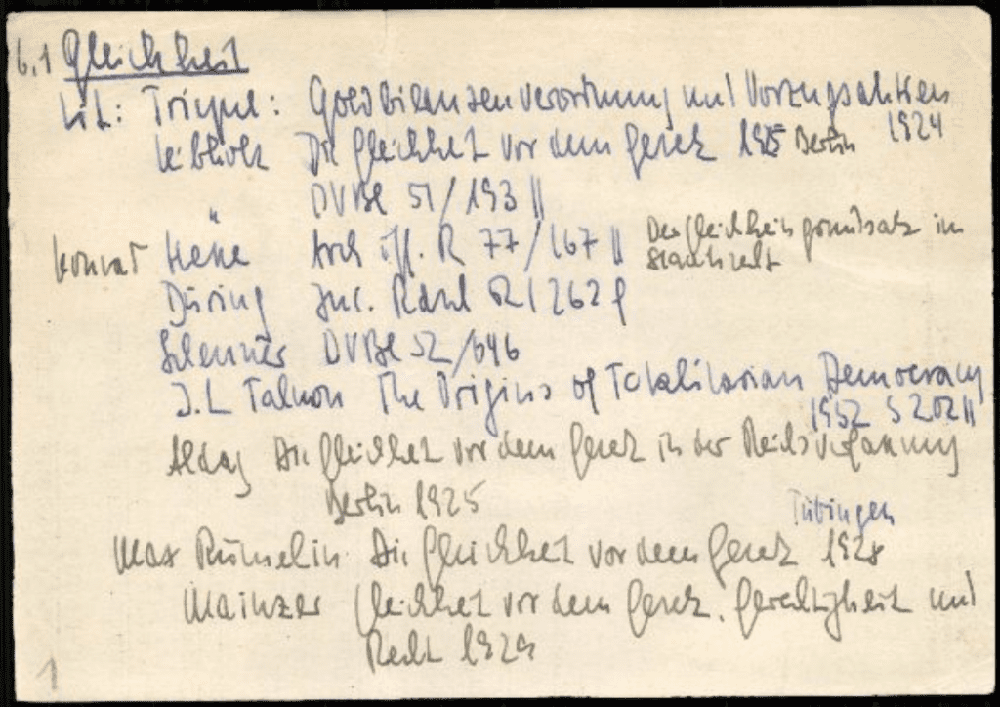
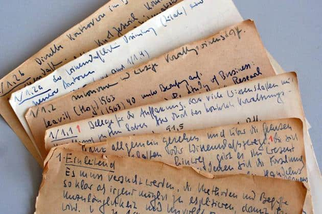
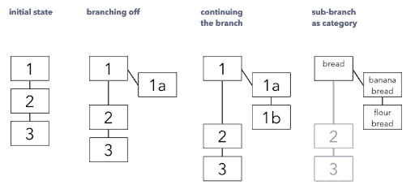

I long ago stopped reading books on note-taking.  

我早就不看关于记笔记的书了。

They were always too vague and boring, full of platitudes that had little to do with the world outside academia.  

他们总是过于模糊和无聊，充满了陈词滥调，与学术界以外的世界没有什么关系。

I especially avoided “how-to” style books on the subject.  

我特别避开了关于这个主题的 "如何做 "的书籍。

They would often list dozens of tips and tricks that had little to do with each other. There was never an overarching system for turning notes into concrete results.  

他们往往会列出几十个相互之间没有什么关系的技巧和窍门。从来没有一个总体的系统来把笔记变成具体的结果。

But recently I picked up [_How To Take Smart Notes_](https://amzn.to/2tPBYkt) (affiliate link) by [Sönke Ahrens](https://twitter.com/soenke_ahrens). Ahrens is a Lecturer in Philosophy of Education at the University of Duisburg-Essen and also coaches students, academics, and professionals with a focus on time management, decision-making, and personal growth.  

但最近我拿起了Sönke Ahrens的《如何做聪明的笔记》（附属链接）。Ahrens是杜伊斯堡-埃森大学的教育哲学讲师，也是学生、学者和专业人士的教练，重点是时间管理、决策和个人成长。

It is by far the most impactful and profound book I’ve ever read on the subject. I was astounded to encounter in its pages (with uncanny similarity) many of the same principles I had discovered over 10 years of personal experience.  

这是迄今为止我读过的关于这个主题的最有影响和最深刻的书。我惊奇地发现，在它的书页中（有惊人的相似性），我在10年的个人经验中发现了许多相同的原则。

This book is so full of insights that it broke my usual approach to summarizing books.  

这本书充满了真知灼见，打破了我总结书籍的一贯做法。

My approach is based on the assumption that most books are a few morsels of real insight wrapped in layers and layers of fluff. As I read, I systematically unravel those layers of fluff and extract only those insights, like a chemist distilling only the purest compound.  

我的方法是基于这样的假设：大多数书都是被一层又一层的绒毛包裹着的几块真正的洞察力。当我阅读时，我有系统地揭开这些绒毛层，只提取那些洞察力，就像化学家只提炼最纯净的化合物。

But this book is not written in the usual way. It is written using an external thinking system, which I call a [Second Brain](https://www.buildingasecondbrain.com/).  

但这本书不是以通常的方式写的。它是用一种外部思维系统写的，我称之为第二大脑。

The evidence is clear: Instead of squeezing as many pages as possible out of one idea, _How To Take Smart Notes_ squeezes as many ideas as possible onto every page. Every paragraph has a point, and I struggled to leave anything out of this summary.  

证据很明显：《如何做聪明的笔记》不是从一个想法中挤出尽可能多的页数，而是将尽可能多的想法挤到每一页。每个段落都有一个观点，我努力在这个总结中留下任何东西。

By identifying the principles that stand the test of time despite huge changes in the underlying technology, we can better understand the essential nature of the creative process. We can focus our efforts on mastering the art of creative note-taking, producing more insightful writing, and fulfilling our full potential.  

通过确定那些在基础技术发生巨大变化的情况下仍能经受时间考验的原则，我们可以更好地理解创作过程的基本性质。我们可以集中精力掌握创造性笔记的艺术，写出更有见地的文章，并充分发挥我们的潜力。

In this article, I’ll summarize the 10 most important principles for taking “smart” notes according to Ahrens. You can also find a detailed, step-by-step description of the method at the end.  

在这篇文章中，我将根据阿伦斯的观点，总结出做 "聪明 "笔记的10条最重要的原则。你还可以在最后找到该方法的详细步骤说明。

## What the book is about  

这本书是关于什么的

_How To Take Smart Notes_ is a book on note-taking for students, academics, and non-fiction writers.  

How To Take Smart Notes》是一本为学生、学者和非小说作者编写的笔记书。

It promises to help readers adopt “a reliable and simple external structure to think in that compensates for the limitations of our brains.” By adopting such a system, Ahrens promises that we will be able to “efficiently turn our thoughts and discoveries into convincing written pieces and build up a treasure of smart and interconnected notes along the way.”  

它承诺帮助读者采用 "一种可靠而简单的外部结构来思考，以弥补我们大脑的局限性"。通过采用这样一个系统，阿伦斯承诺，我们将能够 "有效地将我们的想法和发现转化为令人信服的书面作品，并在此过程中建立起一个聪明和相互联系的笔记宝库"。

While producing published written works is the end goal, is it not the only goal. Ahrens argues convincingly that turning one’s thoughts into writing isn’t just useful for writers but for anyone who wants to improve their thinking and learning in general.  

虽然创作出版书面作品是最终目标，但这是不是唯一的目标。阿伦斯令人信服地认为，将一个人的思想转化为文字，不仅对作家有用，而且对任何想改善其思维和学习的人都有用。

By focusing on writing, Ahrens is able to speak in concrete terms about a specific creative process while simultaneously drawing universal conclusions. Instead of notes becoming a “graveyard for thoughts,” they can become a life-long pool of rich and interconnected ideas we can draw on no matter where our interests lead us.  

通过专注于写作，阿伦斯能够以具体的术语谈论一个特定的创作过程，同时得出普遍的结论。笔记不是成为 "思想的坟场"，而是可以成为我们终身的丰富和相互联系的思想库，无论我们的兴趣在哪里，我们都可以利用。

## Luhmann’s slip-box 卢曼的滑轮箱

Ahrens’ approach to note-taking was inspired by the 20th-century German sociologist Niklas Luhmann (1927-1998). Luhmann was a prolific note-taker, writer, and academic. Early in his academic career, Luhmann realized that a note was only as valuable as its _context_ – its network of associations, relationships, and connections to other information.   

阿伦斯的笔记方法受到20世纪德国社会学家尼克拉斯-卢曼（1927-1998）的启发。Luhmann是一位多产的笔记者、作家和学者。在他学术生涯的早期，Luhmann意识到，一个笔记的价值只取决于它的背景--它的关联、关系和与其他信息的联系网络。

Niklas Luhmann Niklas Luhmann

He developed a simple system based on paper index cards, which he called his “slip-box” (or _zettelkasten_ in German). It was designed to connect any given note to as many different potentially relevant contexts as possible.   

他开发了一个基于纸质索引卡的简单系统，他称之为 "纸条箱"（德语为zettelkasten）。它旨在将任何给定的笔记与尽可能多的不同的潜在相关背景联系起来。

Luhmann rejected alphabetical categorization of his notes, along with fixed categories like the Dewey Decimal System. He intended his notes not just for a single project or book but for a lifetime of reading and researching. He designed his slip-box as a research database made up of index cards (_zettel_) that were “thematically unlimited” and could be infinitely extended in any direction.  

卢曼拒绝按字母顺序对他的笔记进行分类，以及像杜威十进制系统那样的固定类别。他希望他的笔记不仅仅是为了一个项目或一本书，而是为了一生的阅读和研究。他把他的滑箱设计成一个由索引卡（zettel）组成的研究数据库，这些索引卡 "主题无限"，可以向任何方向无限延伸。

One of the 90,000 index cards Luhmann created over his 30-year career, on Gleichheit (“equality”). Note the red number in the bottom-left corner indicating a branching topic. You can view a full archive of Luhmann’s notes in an [online database](http://ds.ub.uni-bielefeld.de/viewer/search/-/MD_AUTHOR_UNTOKENIZED:%22Luhmann%2CU005C+Niklas%22/1/-/-/) maintained by the University of Bielefeld. \[Source: [Marvin Blum](https://medium.com/emvi/luhmanns-zettelkasten-a-productivity-tool-that-works-like-your-brain-abe2d53a2948)\]  

卢曼在其30年的职业生涯中创建了90,000张索引卡，其中一张是关于Gleichheit（"平等"）的。请注意左下角的红色数字表示一个分支主题。你可以在比勒费尔德大学维护的一个在线数据库中查看卢曼笔记的完整档案。\[来源：Marvin Blum\]

Although it appeared to be just a simple filing system made up of index cards, Luhmann’s slip-box grew to become an equal thinking partner in his work. He described his system as his secondary memory (  

虽然它看起来只是一个由索引卡组成的简单归档系统，但卢曼的滑板箱逐渐成为他工作中的一个平等的思考伙伴。他把他的系统描述为他的第二记忆(_zweitgedächtnis 第二记忆_), alter ego, or reading memory (  

)，另一个自我，或阅读记忆(_lesegedächtnis 困难重重_). He reported that it continuously surprised him with ideas he’d forgotten he had. Because of this, he claimed that there was actual communication going on between himself and his).他报告说，它不断给他带来惊喜，让他有了忘记自己的想法。正因为如此，他声称在他自己和他的朋友之间存在着实际的交流。 _zettelkasten 采矿业_. As he built up his collection of notes, he embarked on a series of achievements that would eventually make him one of the most influential sociologists and scientists of the 20th century.   

.在他积累笔记的过程中，他开始了一系列的成就，最终使他成为20世纪最有影响力的社会学家和科学家之一。

A picture of the very first notecard Luhmann added to his slip-box, labeled with a number 1 in the top-left corner. It begins “1 Introduction; It must be attempted to explain the criteria and concepts as clearly as is possible so that their inadequacy and imperfection becomes clear.” \[Source: Taking Note blog\]  

一张卢曼添加到他的滑箱中的第一张记事卡的照片，左上角标有数字1。它的开头是 "1简介；必须尝试尽可能清楚地解释标准和概念，以便它们的不足和不完善变得清晰。"\[来源：Taking Note博客\]

Here’s how it  以下是它如何 worked 工作:

-   Luhmann wrote down interesting or potentially useful ideas he encountered in his reading on uniformly sized index cards  
    
    卢曼把他在阅读中遇到的有趣或潜在的有用的想法写在统一大小的索引卡上
-   He wrote only on one side of each card to eliminate the need to flip them over, and he limited himself to one idea per card so they could be referenced individually  
    
    他只在每张卡片的一面书写，以消除翻转卡片的需要，而且他限制自己在每张卡片上只写一个想法，这样他们就可以单独参考了。
-   Each new index card received a sequential number, starting at 1. When a new source was added to that topic, or he found something to supplement it, he would add new index cards with letters as suffixes (1a, 1b, 1c, etc.)  
    
    每张新的索引卡都有一个顺序号，从1开始。当该主题增加了一个新的来源，或者他发现了一些补充内容，他就会增加新的索引卡，用字母作为后缀（1a，1b，1c，等等）。
-   These branching connections were marked in red as close as possible to the point where the branch began  
    
    这些分支连接被标记为红色，尽可能靠近分支的起始点。
-   Any of these branches could also have their own branches. The card for fellow German sociologist Jürgen Habermas, for example, was labeled 21/3d26g53  
    
    这些分支中的任何一个也可以有自己的分支。例如，德国社会学家尤尔根-哈贝马斯（Jürgen Habermas）的卡片被标为21/3d26g53
-   As he read, he would create new cards, update or add comments to existing ones, create new branches from existing cards, and create new links between cards on different “strands”  
    
    在阅读过程中，他将创建新的卡片，对现有的卡片进行更新或添加评论，从现有的卡片中创建新的分支，并在不同 "股 "的卡片之间创建新的链接。

This diagram shows how subtopics branched off from main topics:  

这张图显示了副主题是如何从主主题中分支出来的：

A diagram showing Luhmann’s system, with new cards branching off from existing ones and receiving a letter designation \[Source: [Zettelkasten Blog](https://zettelkasten.de/posts/luhmann-folgezettel-truth/)\]  

显示卢曼系统的图表，新卡从现有的卡中分支出来，并得到一个字母的指定 \[来源：Zettelkasten博客\]

Not only did this create a system that could extend infinitely in any direction, but it also gave each index card a permanent ID number. This number could be referenced from any other card, because it would never change. The branches created “strands” of thought that one could enter at any point, following it downstream to be elaborated upon or upstream to its source.   

这不仅创造了一个可以在任何方向上无限延伸的系统，而且还给每张索引卡提供了一个永久的ID号码。这个号码可以从任何其他卡片上引用，因为它永远不会改变。这些分支创造了思想的 "股"，人们可以在任何时候进入，沿着它的下游进行阐述，或在上游找到它的来源。

It also led to a meaningful topography within the system: Topics that had been extensively explored had long reference numbers, making their length informative on its own. There is no hierarchy in the zettelkasten, which means it can grow internally without any preconceived scheme. By creating notes as a decentralized network instead of a hierarchical tree, Luhmann anticipated hypertext and URLs.  

这也导致了系统内有意义的拓扑结构：已经被广泛探讨过的主题有很长的参考编号，使它们的长度本身就具有信息量。zettelkasten中没有等级制度，这意味着它可以在没有任何预设方案的情况下内部成长。通过将笔记创建为一个分散的网络而不是一棵分层的树，卢曼预见到了超文本和URL。

Over his 30-year career, Luhmann published 58 books and hundreds of articles on the way to completing his two-volume masterwork, _The Society of Society_ (1997). It presented a radical new theory that not only changed sociology but also provoked heated discussions in philosophy, education, political theory, and psychology.   

在他30年的职业生涯中，卢曼出版了58本书和数百篇文章，最终完成了他的两卷本巨著《社会的社会》（1997）。该书提出了一个激进的新理论，不仅改变了社会学，而且还在哲学、教育、政治理论和心理学方面引发了激烈的讨论。

For years, the importance of Luhmann’s slip-box was underestimated. As early as 1985, he would regularly point to it as the source of his amazing productivity: “I, of course, do not think everything by myself. It happens mainly within the slip-box” (Luhmann, Baecker, and Stanitzek 1987, 142). Until recently, no one believed that such a simple system could produce such prolific output. We are so used to the idea that great outcomes require great (and complicated) efforts.  

多年来，卢曼的滑板箱的重要性被低估了。早在1985年，他就经常指出，这是他惊人的生产力的来源："当然，我并不是什么都自己想。它主要发生在滑箱中"（Luhmann, Baecker, and Stanitzek 1987, 142）。直到最近，没有人相信这样一个简单的系统可以产生如此多产的产出。我们已经习惯了这样的想法，即伟大的成果需要巨大（和复杂）的努力。

But Luhmann often remarked that he never forced himself to do anything he didn’t feel like doing: “I only do what is easy. I only write when I immediately know how to do it. If I falter for a moment, I put the matter aside and do something else” (Luhmann et al., 1987, 154f).  

但卢曼经常说，他从不强迫自己做任何他不喜欢做的事情："我只做容易的事。我只在我立即知道如何去做的时候才写作。如果我有片刻的动摇，我就把这件事放在一边，做别的事情"（Luhmann等人，1987, 154f）。

Wouldn’t it make sense that such output over so many years would be possible _because_ it was simple and easy, not in spite of it? Upon his death, Luhmann’s slip-box contained 90,000 notes. This may seem like a staggering number until you realize that it amounts to only six notes per day.  

这么多年来，这样的产出之所以能够实现，难道不是因为它简单易行，而不是不顾一切吗？在他死后，卢曼的纸盒里有90,000张纸币。这似乎是一个惊人的数字，直到你意识到这相当于每天只有六张纸币。

Let’s look deeper at the main principles that Luhmann used in his work, which Ahrens has adapted to the modern age. The explosion of technology and connectivity has inundated us with an overabundance of information. These principles go a long way toward reestablishing the boundaries and constraints that creativity needs to thrive.   

让我们深入了解一下卢曼在其作品中使用的主要原则，阿伦斯将这些原则改编为现代的。技术和连接性的爆炸使我们被过多的信息所淹没。这些原则在重新建立创造力所需的界限和约束方面有很大的作用。

## Want to dive deeper into Sönke’s ideas on notetaking?  

想更深入地了解桑克关于记事的想法吗？

**Get access to my interview with him** and discover what the author of _How to Take Smart Notes_ thinks about…  

获取我对他的采访，了解《如何做聪明的笔记》的作者对...

• The importance of building an external brain  

\- 建立外脑的重要性

• Selecting the right notetaking app for you  

\- 选择适合你的记事本应用程序

• How to get started with a notetaking system and what pitfalls to avoid  

\- 如何开始使用记事系统以及避免哪些误区

• How to go from merely collecting notes to using them and making connections between your ideas  

\- 如何从单纯的收集笔记到使用它们并在你的想法之间建立联系

__

## Principle #1: Writing is not the outcome of thinking; it is the medium in which thinking takes place  

原则1：写作不是思考的结果；它是思考发生的媒介。

Writing doesn’t begin when we sit down to put one paragraph after another on the screen or page. It begins much, much earlier, as we take notes on the articles or books we read, the podcasts or audiobooks we listen to, and the interesting conversations and life experiences we have.   

写作并不是从我们坐下来在屏幕或页面上写下一段又一段的时候开始的。它开始得更早，因为我们在阅读的文章或书籍、收听的播客或有声读物、以及有趣的对话和生活经历中做笔记。

These notes build up as a byproduct of the reading we’re already doing anyway. Even if you don’t aim to develop a grand theory, you need a way to organize your thoughts and keep track of the information you consume.   

这些笔记是作为我们已经在做的阅读的副产品而建立起来的。即使你的目标不是发展一个宏大的理论，你也需要一种方法来组织你的思想，并跟踪你所消费的信息。

If you want to learn and remember something long-term, you have to write it down. If you want to understand an idea, you have to translate it into your own words. If we have to do this writing anyway, why not use it to build up resources for future publications?   

如果你想长期学习和记住一些东西，你必须把它写下来。如果你想理解一个想法，你必须把它翻译成你自己的语言。如果我们无论如何都要做这种写作，为什么不利用它来为未来的出版物积累资源呢？

Writing is not only for proclaiming fully formed opinions, but for developing opinions worth sharing in the first place.   

写作不仅是为了宣扬完全形成的观点，而且首先是为了发展值得分享的观点。

Writing works well in improving one’s thinking because it forces you to engage with what you’re reading on a deeper level. Just because you read more doesn’t automatically mean you have more or better ideas. It’s Iike learning to swim – you have to learn by doing it, not by merely reading about it.  

写作在改善一个人的思维方面效果很好，因为它迫使你在更深的层次上参与你正在阅读的内容。仅仅因为你读得多并不自动意味着你有更多或更好的想法。这就像学习游泳一样--你必须通过实践来学习，而不是仅仅通过阅读。

The challenge of writing as well as learning is therefore not so much to learn, but to understand, as you will already have learned what you understand. When you truly understand something, it is anchored to a latticework of related ideas and meanings, which makes it far easier to remember.  

因此，写作和学习的挑战不在于学习，而在于理解，因为你已经学会了你所理解的东西。当你真正理解某件事情时，它就会被固定在相关想法和意义的格子里，这使得它更容易被记住。

For example, you could memorize the fact that arteries are red and veins are blue. But it is only when you understand _why_ – that arteries carry oxygen-rich blood from the heart to the rest of the body, while veins carry blood low in oxygen back to the heart – that that fact has any value. And once we make this meaningful connection between ideas, it’s hard _not_ to remember it.  

例如，你可以记住动脉是红色而静脉是蓝色的事实。但只有当你理解了原因--动脉将富含氧气的血液从心脏输送到身体其他部位，而静脉将低氧的血液输送回心脏--这一事实才有价值。而一旦我们在观念之间建立起这种有意义的联系，就很难不记住它。

The problem is that the meaning of something is not always obvious. It requires _elaboration_ – we need to copy, translate, re-write, compare, contrast, and describe a new idea in our own terms. We have to view the idea from multiple perspectives and answer questions such as “How does this fact fit with others I already know?” and “How can this phenomenon be explained by that theory?” or “How does this argument compare to that one?”  

问题是，某件事的意义并不总是显而易见的。它需要阐述--我们需要复制、翻译、重写、比较、对比，并以我们自己的方式描述一个新的想法。我们必须从多个角度来看待这个想法，并回答诸如 "这个事实与我已经知道的其他事实如何吻合？"和 "这个现象如何能用那个理论来解释？"或 "这个论点与那个论点相比如何？"

Completing these tasks is exceedingly difficult inside the confines of our heads. We need an external medium in which to perform this elaboration, and writing is the most effective and convenient one ever invented.   

在我们的头脑中完成这些任务是非常困难的。我们需要一个外部媒介来进行这种阐述，而写作是有史以来最有效和最方便的媒介。

## Principle #2: Do your work as if writing is the only thing that matters  

原则2：把写作当作唯一重要的事情来做

The second principle extends the previous one even further: Do you work as if writing is the only thing that matters.  

第二条原则是对前一条原则的进一步延伸：你是否将写作作为唯一重要的事情来做。

In academia and science, virtually all research is aimed at eventual publication Ahrens notes that “there is no such thing as private knowledge in academia. An idea kept private is as good as one you never had.”  

在学术界和科学界，几乎所有的研究都是为了最终发表，Ahrens指出，"在学术界不存在私人知识这种东西。一个不为人知的想法和一个你从未拥有的想法一样好。"

The purpose of research is to produce _public_ knowledge that can be scrutinized and tested. For that to happen, it has to be written down. And once it is, what the author meant doesn’t matter – only the actual words written on the page matter.  

研究的目的是产生可以被审查和测试的公共知识。要做到这一点，必须将其写下来。一旦写下来，作者的意思并不重要--只有写在纸上的实际文字才重要。

This principle requires us to expand our definition of “publication” beyond the usual narrow sense. Few people will ever publish their work in an academic journal or even on a blog. But everything that we write down and share with someone else counts: notes we share with a friend, homework we submit to a professor, emails we write to our colleagues, and presentations we deliver to clients all count as knowledge made public.  

这一原则要求我们将 "发表 "的定义扩大到通常的狭义上。很少有人会在学术期刊或甚至博客上发表自己的作品。但是，我们写下并与他人分享的一切都算数：我们与朋友分享的笔记，我们提交给教授的作业，我们写给同事的电子邮件，以及我们向客户提供的演讲都算作公开的知识。

This might still seem like a radical principle. Should we publicize even the ideas we’ve only just encountered, or opinions half-formed, or wild theories we can’t substantiate? Do we really need even more people broadcasting half-baked opinions and theories online?  

这可能仍然看起来是一个激进的原则。我们是否应该宣传我们刚刚遇到的想法，或半成品的意见，或我们无法证实的疯狂理论？我们真的需要更多的人在网上广播半生不熟的意见和理论吗？

But the important part is the principle: Work _as if_ writing is the only thing that matters. Having a clear, tangible purpose when you consume information completely changes the way you engage with it. You’ll be more focused, more curious, more rigorous, and more demanding. You won’t waste time writing down every detail, trying to make a perfect record of everything that was said. Instead, you’ll try to learn the basics as efficiently as possible so you can get to the point where open questions arise, as these are the only questions worth writing about.  

但重要的部分是原则：像写作一样工作是唯一重要的事情。当你消费信息时有一个明确的、有形的目的，会完全改变你参与信息的方式。你会更加专注，更加好奇，更加严谨，要求更高。你不会浪费时间写下每一个细节，试图对所说的一切做一个完美的记录。相反，你会尝试尽可能有效地学习基础知识，这样你就能达到产生开放性问题的程度，因为这些是唯一值得写的问题。

Almost every aspect of your life will change when you live as if you are working toward publication. You’ll read differently, becoming more focused on the parts most relevant to the argument you’re building. You’ll ask sharper questions, no longer satisfied with vague explanations or leaps in logic. You’ll naturally seek venues to present your work, since the feedback you receive will propel your thinking forward like nothing else. You’ll begin to act more deliberately, thinking several steps beyond what you’re reading to consider its implications and potential.  

当你像为出版而工作一样生活时，你生活的几乎每个方面都会改变。你会以不同的方式阅读，变得更加专注于与你正在建立的论点最相关的部分。你会提出更尖锐的问题，不再满足于模糊的解释或逻辑上的跳跃。你会自然而然地寻找场地来展示你的工作，因为你收到的反馈将推动你的思维向前发展，而不是其他什么。你会开始更慎重地行动，超越你所读的东西思考几个步骤，考虑其影响和潜力。

Deliberate practice is the best way to get better at anything, and in this case, you are deliberately practicing the most fundamental skill of all: thinking. Even if you never actually publish one line of writing, you will vastly improve every aspect of your thinking when you do everything as if nothing counts except writing.  

刻意练习是在任何事情上得到提高的最好方法，在这种情况下，你是在刻意练习最基本的技能：思考。即使你从未真正发表过一行文字，但当你做任何事情时，你会极大地提高你思维的各个方面，就好像除了写作之外什么都不算。

## Principle #3: Nobody ever starts from scratch  

原则三：没有人可以从头开始

One of the most damaging myths about creativity is that it starts from nothing. The blank page, the white canvas, the empty dance floor: Our most romantic and universal artistic motifs seem to suggest that “starting from scratch” is the essence of creativity.  

关于创造力的最有害的神话之一是，它从无到有。白纸、白布、空舞池：我们最浪漫、最普遍的艺术主题似乎在暗示，"从零开始 "是创造力的本质。

This belief is reinforced by how writing is typically taught: We are told to “pick a topic” as a necessary first step, then to conduct research, discuss and analyze it, and finally come to a conclusion.  

这种信念在通常的写作教学中得到了加强：我们被告知 "选择一个主题 "是必要的第一步，然后进行研究，讨论和分析，最后得出结论。

But how can you decide on an interesting topic before you’ve read about it? You have to immerse yourself in research before you even know how to formulate a good question. And the decision to read about one subject versus another also doesn’t appear out of thin air. It usually comes from an existing interest or understanding. The truth is every intellectual endeavor starts with a preceding conception.  

但是，在你阅读之前，你怎么能决定一个有趣的主题呢？在你知道如何提出一个好的问题之前，你必须让自己沉浸在研究中。而且，阅读一个主题和另一个主题的决定也不是凭空出现的。它通常来自于现有的兴趣或理解。事实上，每项智力活动都是以先前的概念开始的。

This is the tension at the heart of the creative process: You have to research _before_ you pick what you will write about. Ideally, you should start researching long before, so you have weeks and months and even years of rich material to work with as soon as you decide on a topic. This is why an external system to record your research is so critical. It doesn’t just enhance your writing process; it makes it possible.  

这就是创作过程中的核心紧张：你必须在选择你要写的东西之前进行研究。理想的情况是，你应该在很早以前就开始研究，这样你一旦决定了一个主题，就有几周、几个月甚至几年的丰富材料可以利用。这就是为什么一个记录你的研究的外部系统是如此关键。它不仅能加强你的写作过程，还能使之成为可能。

And all this pre-research also involves writing. We build up an ever-growing pool of externalized thoughts as we read. When the time comes to produce, we aren’t following a blindly invented plan plucked from our unreliable brains. We look in our notes and follow our interests, curiosity, and intuition, which are informed by the actual work of reading, thinking, discussing, and taking notes. We never again have to face that blank screen with the impossible demand of “thinking of something to write about.”  

而所有这些预研究也涉及到写作。我们在阅读时建立了一个不断增长的外化思想库。当生产的时候，我们不是按照从我们不可靠的大脑中摘取的盲目发明的计划。我们在笔记中寻找，遵循我们的兴趣、好奇心和直觉，这些都是在阅读、思考、讨论和做笔记的实际工作中得到的。我们再也不必面对那个空白的屏幕，不可能要求 "想出一些东西来写"。

No one ever really starts from scratch. Anything they come up with has to come from prior experience, research, or other understanding. But because they haven’t acted on this fact, they can’t track ideas back to their origins. They have neither supporting material nor accurate sources. Since they haven’t been taking notes from the start, they either have to start with something completely new (which is risky) or retrace their steps (which is boring).  

没有人真正从头开始。他们想出的任何东西都必须来自先前的经验、研究或其他理解。但是，由于他们没有对这一事实采取行动，他们无法追踪想法的起源。他们既没有辅助材料，也没有准确的来源。由于他们从一开始就没有做笔记，所以他们要么从全新的东西开始（这很冒险），要么就追溯他们的步骤（这很无聊）。

It’s no wonder that nearly every guide to writing begins with “brainstorming.” If you don’t have notes, you have no other option. But this is a bit like a financial advisor telling a 65-year-old to start saving for retirement – too little, too late.  

难怪几乎所有的写作指南都以 "头脑风暴 "开始。如果你没有笔记，你就没有其他选择。但这有点像一个财务顾问告诉一个65岁的人开始为退休储蓄--太少，太晚了。

Taking notes allows you to break free from the traditional, linear path of writing. It allows you to systematically extract information from linear sources, mix and shake them up together until new patterns emerge, and then turn them back into linear texts for others to consume.   

做笔记可以让你从传统的、线性的写作路径中解脱出来。它允许你系统地从线性来源中提取信息，将它们混合在一起，直到出现新的模式，然后将它们转回线性文本，供他人使用。

You’ll know you’ve succeeded in making this shift when the problem of not having enough to write about is replaced by the problem of having far too much to write about. When you finally arrive at the decision of what to write about, you’ll already have made that decision again and again at every single step along the way.   

当没有足够内容可写的问题被有太多内容可写的问题所取代时，你就会知道你已经成功实现了这种转变。当你最终决定写什么的时候，你已经在这条路上的每一步都反复做出了这个决定。

## Principle #4: Our tools and techniques are only as valuable as the workflow  

原则四：我们的工具和技术只有在工作流程中才有价值

Just because writing is not a linear process doesn’t mean we should go about it haphazardly. We need a _workflow_ – a repeatable process for collecting, organizing, and sharing ideas.  

写作不是一个线性过程，但这并不意味着我们应该胡乱地进行写作。我们需要一个工作流程--一个收集、组织和分享想法的可重复过程。

Writing is often taught as a collection of “tips and tricks” – brainstorm ideas, make an outline, use a three-paragraph structure, repeat the main points, use vivid examples, set a timer. Each one in isolation might make sense, but without the holistic perspective of how they fit together, they add more work than they save. Every additional technique becomes its own project without bringing the whole much further forward. Before long, the whole mess of techniques falls apart under its own weight.  

写作常常被教导为 "技巧和窍门 "的集合--集思广益，制定大纲，使用三段式结构，重复要点，使用生动的例子，设置定时器。孤立地看，每一个技巧可能都有意义，但如果不从整体上看它们是如何结合在一起的，它们所增加的工作量就比它们所节省的多。每一个额外的技巧都会成为自己的项目，而不会使整个项目取得更大的进展。不久之后，整个混乱的技术就会在其自身的重量下崩溃。

It is only when all the work becomes part of an integrated process that it becomes more than the sum of its parts. Even the best techniques won’t make a difference if they are used in conflicting ways. This is why the slip-box isn’t yet another technique. It is the system in which all the techniques are linked together.  

只有当所有的工作成为一个综合过程的一部分时，它才会超过其各部分的总和。即使是最好的技术，如果它们以相互冲突的方式被使用，也不会有什么不同。这就是为什么滑板箱不是另一种技术。它是一个系统，在这个系统中，所有的技术都联系在一起。

Good systems don’t add options and features; they strip away complexity and distractions from the main work, which is thinking. An undistracted brain and a reliable collection of notes is pretty much all we need. Everything else is just clutter.  

好的系统不会增加选项和功能；它们剥去了复杂和对主要工作的干扰，也就是思考。一个不受干扰的大脑和一个可靠的笔记收集几乎是我们所需要的全部。其他一切都只是杂乱无章。

## Principle #5: Standardization enables creativity  

原则五：标准化使人有创造力

Ahrens uses the excellent analogy of how the invention of shipping containers revolutionized international trade to demonstrate the role of note-taking in modern writing  

阿伦斯用航运集装箱的发明如何彻底改变了国际贸易这一出色的比喻来说明记事本在现代写作中的作用

Container shipping is a simple idea: ship products in standardized containers instead of loading them onto ships haphazardly as had always been done. But it took multiple failed attempts before it was successful, because it wasn’t actually about the container, which after all is just a box.  

集装箱运输是一个简单的想法：用标准化的集装箱运输产品，而不是像以往那样胡乱地把它们装到船上。但在成功之前，它经历了多次失败的尝试，因为它实际上与集装箱无关，毕竟它只是一个盒子。

The potential of the shipping container was only unleashed when _every other part_ of the shipping supply chain was changed to accommodate it. From manufacturing to packaging to final delivery, the design of ships, cranes, trucks, and harbors all had to align around moving containers as quickly and efficiently as possible. Once they did, international shipping exploded, setting the stage for Asia to become an economic power among many other historic changes.   

只有当航运供应链的每个其他部分都被改变以适应它时，航运集装箱的潜力才得以释放。从制造到包装再到最终交付，船舶、起重机、卡车和港口的设计都必须围绕着尽可能快速和有效地移动集装箱而进行。一旦做到这一点，国际航运就会爆发，为亚洲成为经济强国和其他许多历史性变化创造了条件。

Many people still take notes, if at all, in an ad-hoc, random way. If they see a nice sentence, they underline it. If they want to make a comment, they write it in the margins. If they have a good idea, they write it in whichever notebook is close at hand. And if an article seems important enough, they might make the effort to save an excerpt. This leaves them with many different kinds of notes in many different places and formats. This means when it comes time to write, they first have to undertake a massive project to collect and organize all these scattered notes.  

许多人仍然在做笔记，如果有的话，也是以一种临时的、随机的方式。如果他们看到一个好的句子，他们就在下面划线。如果他们想发表评论，他们就写在空白处。如果他们有一个好主意，他们就把它写在手边的任何一个笔记本上。如果一篇文章看起来足够重要，他们可能会努力保存一份摘录。这使得他们在许多不同的地方和格式中都有许多不同类型的笔记。这意味着当要写作时，他们首先要进行一个庞大的项目来收集和组织所有这些分散的笔记。

Notes are like shipping containers for ideas. Instead of inventing a new way to take notes for every source you read, use a completely standardized and predictable format every time. It doesn’t matter what the notes contain, which topic they relate to, or what medium they arrived through – you treat each and every note exactly the same way.  

笔记就像思想的运输容器。与其为你阅读的每一个资料发明一种新的方法来做笔记，不如每次都使用一种完全标准化的、可预测的格式。笔记包含什么内容，与哪个主题有关，或者通过什么媒介到达，都不重要--你要以完全相同的方式对待每一个笔记。

It is this standardization of notes that enables a critical mass to build up in one place. Without a standard format, the larger the collection grows, the more time and energy have to be spent navigating the ever-growing inconsistencies between them. A common format removes unnecessary complexity and takes the second-guessing out of the process. Like LEGOs, standardized notes can easily be shuffled around and assembled into endless configurations without losing sight of what they contain.   

正是这种笔记的标准化，使得在一个地方积累了足够的数量。如果没有一个标准的格式，收集的资料越多，就必须花更多的时间和精力来处理它们之间不断增长的不一致之处。一个共同的格式消除了不必要的复杂性，并将猜测从这个过程中剔除。就像乐高积木一样，标准化的笔记可以很容易地被推来推去，组装成无尽的配置，而不会忘记它们所包含的内容。

The same principle applies to the steps of processing our notes. Consider that no single step in the process of turning raw ideas into finished pieces of writing is particularly difficult. It isn’t very hard to write down notes in the first place. Nor is turning a group of notes into an outline very demanding. It also isn’t much of a challenge to turn a working outline full of relevant arguments into a rough draft. And polishing a well-conceived rough draft into a final draft is trivial.  

这一原则也适用于处理我们的笔记的步骤。考虑到在将原始想法转化为写作成品的过程中，没有一个步骤是特别困难的。首先，写下笔记并不难。把一组笔记变成一个大纲也不是很困难。把一个充满相关论点的工作大纲变成一个粗略的草稿也不是什么挑战。而将一个精心构思的粗稿打磨成最终的草稿也是小事一桩。

So if each individual step is so easy, why do we find the overall experience of writing so grueling? Because we try to do all the steps at once. Each of the activities that make up “writing” – reading, reflecting, having ideas, making connections, distinguishing terms, finding the right words, structuring, organizing, editing, correcting, and rewriting – require a very different kind of attention.  

那么，如果每一个单独的步骤都如此简单，为什么我们会发现写作的整体经验如此艰难？因为我们试图同时完成所有的步骤。构成 "写作 "的每一项活动--阅读、思考、有想法、建立联系、区分术语、寻找合适的词语、结构化、组织、编辑、纠正和改写--都需要非常不同的注意力。

Proofreading requires very focused, detail-oriented attention, while choosing which words to put down in the first place might require a more open, free-floating attention. When looking for interesting connections between notes, we often need to be in a playful, curious state of mind, whereas when putting them in logical order, our state of mind probably needs to be more serious and precise.  

校对需要非常集中的、以细节为导向的注意力，而选择哪些词首先要写下来，可能需要更开放的、自由的注意力。在寻找音符之间的有趣联系时，我们往往需要处于一种好玩、好奇的心态，而在把它们按逻辑顺序排列时，我们的心态可能需要更加严肃和精确。

The slip-box is the host of the process outlined above. It provides a place where distinct batches of work can be created, worked on, and saved permanently until the next time we are ready to deploy that particular kind of attention. It deliberately puts distance between ourselves and what we’ve written, which is essential for evaluating it objectively. It is far easier to switch between the role of creator and critic when there is a clear separation between them, and you don’t have to do both at the same time.  

滑箱是上述过程的主机。它提供了一个地方，可以创建不同批次的工作，并将其永久保存，直到下一次我们准备好部署这种特殊的关注。它有意在我们自己和我们所写的东西之间拉开距离，这对于客观地评估它是至关重要的。当创造者和批评者之间有明确的分离时，在两者之间转换角色要容易得多，而且你不必同时做这两件事。

By standardizing and streamlining both the format of our notes and the steps by which we process them, the real work can come to the forefront: thinking, reflecting, writing, discussing, testing, and sharing. This is the work that adds value, and now we have the time to do it more effectively.  

通过规范和精简我们的笔记格式和处理它们的步骤，真正的工作可以走到前面来：思考、反思、写作、讨论、测试和分享。这是增加价值的工作，而现在我们有时间来更有效地完成它。

## Principle #6: Our work only gets better when exposed to high-quality feedback  

原则六：我们的工作只有在接触到高质量的反馈时才会变得更好

A workflow is similar to a chemical reaction: It can feed on itself, becoming a virtuous cycle where the positive experience of understanding a text motivates us to take on the next task, which helps us get better at what we’re doing, which in return makes it more likely for us to enjoy our work, and so on.   

工作流程类似于一个化学反应：它可以自给自足，成为一个良性循环，理解文本的积极经验激励我们承担下一个任务，这有助于我们更好地完成我们正在做的事情，这反过来使我们更有可能享受我们的工作，等等。

Nothing motivates us more than becoming better at what we do. And we can only become better when we intentionally expose our work to high-quality feedback.  

没有什么比在我们的工作中变得更好更能激励我们了。而只有当我们有意将我们的工作暴露于高质量的反馈时，我们才能变得更好。

There are many forms of feedback, both internal and external – from peers, from teachers, from social media, and from rereading our own writing. But notes are the only kind of feedback that is available anytime you need it. It is the only way to deliberately practice your thinking and communication skills multiple times per day.  

有许多形式的反馈，包括内部和外部的--来自同伴、老师、社交媒体，以及重读我们自己的写作。但笔记是唯一一种随时可以得到的反馈。它是每天多次刻意练习你的思维和沟通技巧的唯一途径。

It is easy to think we understand a concept until we try to put it in our own words. Each time we try, we practice the core skill of insight: distinguishing the bits that truly matter from those that don’t. The better we become at it, the more efficient and enjoyable our reading becomes.  

我们很容易认为自己理解了一个概念，直到我们尝试用自己的语言来表达它。每次我们尝试，我们都在练习洞察力的核心技能：区分真正重要的部分和不重要的部分。我们在这方面做得越好，我们的阅读就越有效率，越令人愉快。

Feedback also helps us adjust our expectations and predictions about how much we can get done in an hour or a day. Instead of sitting down to the amorphous task of “writing,” we dedicate each working session to concrete tasks that can be finished in a reasonable timeframe: Write three notes, review two paragraphs, check five sources for an essay, etc. At the end of the day, we know exactly how much we accomplished (or didn’t accomplish) and can adjust our future expectations accordingly.  

反馈也帮助我们调整对一小时或一天内能完成多少工作的期望和预测。我们不是坐下来完成 "写作 "这一无定形的任务，而是将每个工作环节用于在合理时间范围内完成的具体任务：写三份笔记，复习两段，检查一篇文章的五个来源，等等。在一天结束时，我们清楚地知道我们完成了多少（或没有完成），并可以相应地调整我们未来的期望。

## Principle #7: Work on multiple, simultaneous projects  

原则7：同时进行多个项目的工作

It is only when you have multiple, simultaneous projects and interests that the full potential of an external thinking system is realized.  

只有当你有多个同时进行的项目和兴趣时，外部思维系统的全部潜力才得以实现。

Think of the last time you read a book. Perhaps you read it for a certain purpose – to gain some familiarity with a topic you’re interested in or find insights for a project you’re working on. What are the chances that the book contains only the precise insights you were looking for, and no others? Extremely low it would seem. We encounter a constant stream of new ideas, but only a tiny fraction of them will be useful and relevant to us at any given moment.  

想一想你最后一次阅读一本书。也许你是为了某种目的而读的--对你感兴趣的话题有所了解，或者为你正在进行的项目寻找见解。这本书只包含你要找的准确见解，而没有其他的机会是什么？看起来极低。我们会遇到源源不断的新观点，但其中只有极小部分在任何特定时刻对我们有用，与我们相关。

Since the only way to find out which insights a book contains is to read it, you might as well read and take notes productively. Spending a little extra time to record the best ideas you encounter – whether or not you know how they will ultimately be used – vastly increases the chances that you will “stumble upon” them in the future.  

既然发现一本书包含哪些见解的唯一方法是阅读它，那么你不妨有成效地阅读和做笔记。花一点额外的时间来记录你遇到的最好的想法--无论你是否知道它们最终会被如何使用--都会大大增加你在未来 "偶然发现 "它们的机会。

The ability to increase the chances of such future accidental encounters is a powerful one, because the best ideas are usually ones we haven’t anticipated. The most interesting topics are the ones we didn’t plan on learning about. But we can anticipate _that_ fact and set our future selves up for a high probability of productive “accidents.”  

增加未来这种意外相遇的机会的能力是一种强大的能力，因为最好的想法通常是我们没有预料到的。最有趣的话题是那些我们没有计划要学习的话题。但我们可以预见到这一事实，并为未来的自己设置一个高概率的富有成效的 "意外"。

## Principle #8: Organize your notes by context, not by topic  

原则8：按背景而不是按主题组织你的笔记

Now that you’ve been collecting notes on your reading, how should you organize them?  

现在你一直在收集你的阅读笔记，你应该如何组织它们？

The classic mistake is to organize them into ever more specific topics and subtopics. This makes it look less complex, but quickly becomes overwhelming. The more notes pile up, the smaller and narrower the subtopics become, limiting your ability to see meaningful connections between them. With this approach, the greater one’s collection of notes, the less accessible and useful they become.  

典型的错误是将它们组织成越来越具体的主题和副主题。这使它看起来不那么复杂，但很快就变得不堪重负。笔记堆积得越多，副主题就越小越窄，限制了你看到它们之间有意义联系的能力。采用这种方法，一个人收集的笔记越多，他们就越不容易获得，也就越有用。

Instead of organizing by topic and subtopic, it is much more effective to organize by _context_. Specifically, the _context in which it will be used_. The primary question when deciding where to put something becomes “In which context will I want to stumble upon this again?”  

与其按主题和副主题来组织，不如按背景来组织更有效。具体地说，就是它将被使用的背景。当决定把东西放在哪里时，首要的问题是 "我想在哪种情况下再次看到这个东西？"

In other words, instead of filing things away according to where they came from, you file them according to where they’re going. This is the essential difference between organizing _like a librarian_ and organizing _like a writer_.  

换句话说，你不是按照东西的来源来归档，而是按照它们的去向来归档。这就是像图书管理员那样整理和像作家那样整理的本质区别。

A librarian asks “Where should I _store_ this note?” Their goal is to maintain a taxonomy of knowledge that is accessible to everyone, which means they have to use only the most obvious categories. They might file notes on a psychology paper under “misjudgments,” “experimental psychology,” or “experiments.”   

一个图书馆员问："我应该把这个笔记存放在哪里？"他们的目标是维持一个人人都能使用的知识分类法，这意味着他们必须只使用最明显的类别。他们可能会把一篇心理学论文的笔记归入 "错误判断"、"实验心理学 "或 "实验"。

That works fine for a library, but not for a writer. No pile of notes filed uniformly under “psychology” will be easy to turn into a paper. There is no variation or disagreement from which an interesting argument could arise.  

这对图书馆来说很有效，但对作家来说就不行了。没有一堆统一归入 "心理学 "的笔记会容易变成一篇论文。没有任何变化或分歧可以产生有趣的争论。

A writer asks “In which circumstances will I want to stumble upon this note?” They will file it under a paper they are writing, a conference they are speaking at, or an ongoing collaboration with a colleague. These are concrete, near-term deliverables and not abstract categories.  

作家会问："在哪些情况下，我想偶然发现这个笔记？"他们会把它归入他们正在写的论文、正在演讲的会议、或正在进行的与同事的合作。这些都是具体的、近期的可交付成果，而不是抽象的类别。

Organizing by context does take a little bit of thought. The answer isn’t always immediately obvious. A book about personal finance might interest me for completely different reasons if I am a politician working on a campaign speech, a financial advisor trying to help a client, or an economist developing monetary policy. If I encounter a novel engineering method, it may be useful for completely different reasons depending on whether I am working on an engineering textbook, a skyscraper, or a rocket booster.  

按上下文组织确实需要一点思考。答案并不总是那么明显。如果我是一个正在准备竞选演讲的政治家，一个试图帮助客户的财务顾问，或者一个正在制定货币政策的经济学家，那么一本关于个人财务的书可能会让我感兴趣，原因完全不同。如果我遇到一种新的工程方法，它可能会因完全不同的原因而有用，这取决于我是在编写工程教科书、摩天大楼还是火箭助推器。

Writers don’t think about a single, “correct” location for a piece of information. They deal in “scraps” which can often be repurposed and reused elsewhere. The discarded byproducts from one piece of writing may become the essential pillars of the next one. The slip-box is a thinking tool, not an encyclopedia, so completeness is not important. The only gaps we do need to be concerned about are the gaps in the final manuscript we are working toward.  

作家们不考虑一个单一的、"正确的 "信息位置。他们处理的是 "残渣"，这些残渣往往可以在其他地方重新使用。一篇文章中被丢弃的副产品可能成为下一篇文章的重要支柱。滑板箱是一种思考工具，而不是百科全书，所以完整性并不重要。我们确实需要关注的唯一差距是我们正在努力实现的最终手稿中的差距。

By saving all the byproducts of our writing, we collect all the future material we might need in one place. This approach sets up your future self with everything they need to work as decisively and efficiently as possible. They won’t need to trawl through folder after folder looking for all the sources they need. You’ll already have done that work for them.  

通过保存我们写作的所有副产品，我们在一个地方收集所有未来可能需要的材料。这种方法为你未来的自己准备了他们所需要的一切，以尽可能果断和有效地工作。他们不需要翻阅一个又一个的文件夹来寻找他们需要的所有资料。你已经为他们完成了这项工作。

## Want to dive deeper into Sönke’s ideas on notetaking?  

想更深入地了解桑克关于记事的想法吗？

**Get access to my interview with him** and discover what the author of _How to Take Smart Notes_ thinks about…  

获取我对他的采访，了解《如何做聪明的笔记》的作者对...

• The importance of building an external brain  

\- 建立外脑的重要性

• Selecting the right notetaking app for you  

\- 选择适合你的记事本应用程序

• How to get started with a notetaking system and what pitfalls to avoid  

\- 如何开始使用记事系统以及避免哪些误区

• How to go from merely collecting notes to using them and making connections between your ideas  

\- 如何从单纯的收集笔记到使用它们并在你的想法之间建立联系

__

## Principle #9: Always follow the most interesting path  

原则9：始终遵循最有趣的路径

Ahrens notes that in most cases, students fail not because of a lack of ability, but because they lose a personal connection to what they are learning:  

阿伦斯指出，在大多数情况下，学生失败并不是因为缺乏能力，而是因为他们与所学内容失去了个人联系：

“When even highly intelligent students fail in their studies, it’s most often because they cease to see the meaning in what they were supposed to learn (cf. Balduf 2009), are unable to make a connection to their personal goals (Glynn et al. 2009) or lack the ability to control their own studies autonomously and on their own terms (Reeve and Jan 2006; Reeve 2009).”  

"当即使是高智商的学生在学习上失败时，最常见的原因是他们不再看到他们应该学习的东西的意义（参见Balduf 2009），无法与他们的个人目标建立联系（Glynn等人，2009），或者缺乏自主地和按照自己的条件控制自己的学习的能力（Reeve和Jan 2006；Reeve 2009）。"

This is why we must spend as much time as possible working on things we find interesting. It is not an indulgence. It is an essential part of making our work sustainable and thus successful.  

这就是为什么我们必须花尽可能多的时间去做我们认为有趣的事情。这不是一种放纵。它是使我们的工作可持续发展，从而取得成功的一个重要部分。

This advice runs counter to the typical approach to planning we are taught. We are told to “make a plan” upfront and in detail. Success is then measured by how closely we stick to this plan. Our changing interests and motivations are to be ignored or suppressed if they interfere with the plan.  

这个建议与我们所学到的典型的计划方法背道而驰。我们被告知要预先制定详细的 "计划"。然后，成功的衡量标准是我们对这个计划的坚持程度。我们不断变化的兴趣和动机如果干扰了计划，就会被忽视或压制。

The history of science is full of stories of accidental discoveries. Ahrens gives the example of the team that discovered the structure of DNA. It started with a grant, but not a grant to study DNA. They were awarded funds to find a treatment for cancer. As they worked, the team followed their intuition and interest, developing the actual research program along the way (Rheinberger 1997). If they had stuck religiously to their original plan, they probably wouldn’t have discovered a cure for cancer and certainly wouldn’t have discovered the structure of DNA.  

科学史中充满了意外发现的故事。阿伦斯举了一个发现DNA结构的团队的例子。它始于一笔资金，但不是研究DNA的资金。他们获得的资金是为了寻找治疗癌症的方法。在工作中，该团队遵循他们的直觉和兴趣，沿途制定了实际的研究计划（Rheinberger 1997）。如果他们虔诚地坚持原来的计划，他们可能就不会发现治疗癌症的方法，当然也就不会发现DNA的结构。

Plans are meant to help us feel in control. But it is much more important to actually _be_ in control, which means being able to steer our work towards what we consider interesting and relevant. According to a 2006 study by psychology professor Arlen Moller, “When people experienced a sense of autonomy with regard to the choice \[of what to work on\], their energy for subsequent tasks was not diminished” (Moller 2006, 1034). In other words, when we have a choice about what to work on and when, it doesn’t take as much willpower to do it.  

计划是为了帮助我们感受到控制。但更重要的是实际控制，这意味着能够将我们的工作引向我们认为有趣和相关的事情。根据心理学教授Arlen Moller 2006年的一项研究，"当人们在选择\[工作内容\]方面有自主感时，他们对后续任务的精力并没有减少"（Moller 2006, 1034）。换句话说，当我们对工作内容和时间有选择时，做这些工作就不需要那么多意志力。

Our sense of motivation depends on making consistent forward progress. But in creative work, questions change and new directions emerge. That is the nature of insight. So we don’t want to work according to a rigid workflow that is threatened by the unexpected. We need to be able to make small, constant adjustments to keep our interest, motivation, and work aligned.  

我们的动力感取决于持续不断地向前推进。但在创造性的工作中，问题会改变，新的方向会出现。这就是洞察力的本质。因此，我们不希望按照僵化的工作流程来工作，因为这样会受到意外情况的威胁。我们需要能够做出小的、持续的调整，以保持我们的兴趣、动机和工作的一致性。

By breaking down the work of writing into discrete steps, getting quick feedback on each one, and always following the path that promises the most insight, unexpected insights can become the driving force of our work.   

通过将写作工作分解成不连续的步骤，在每个步骤上得到快速反馈，并始终遵循有望获得最多见解的路径，意外的见解可以成为我们工作的驱动力。

Luhmann never forced himself to do anything and only did what came easily to him: “When I am stuck for one moment, I leave it and do something else.” As in martial arts, if you encounter resistance or an opposing force, you should not push against it but instead redirect it towards another productive goal.  

卢曼从不强迫自己做任何事情，只做他容易做到的事情："当我被卡住的一瞬间，我就离开它，做别的事情"。正如在武术中，如果你遇到阻力或反对的力量，你不应该推动它，而是将它转向另一个有成效的目标。

## Principle #10: Save contradictory ideas  

原则#10：保存矛盾的想法

Working with a slip-box naturally leads us to save ideas that are contradictory or paradoxical.  

使用滑板箱工作，自然会使我们保存那些相互矛盾或自相矛盾的想法。

It’s much easier to develop an argument from a lively discussion of pros and cons rather than a litany of one-sided arguments and perfectly fitting quotes.  

从对正反两方面的热烈讨论中发展出一个论点要比一连串的片面论据和完全合适的引文容易得多。

Our only criterion for what to save is whether it connects to existing ideas and adds to the discussion. When we focus on open connections, disconfirming or contradictory data suddenly becomes very valuable. It often raises new questions and opens new paths of inquiry. The experience of having one piece of data completely change your perspective can be exhilarating.   

我们保存什么的唯一标准是它是否与现有的想法相联系，并对讨论有所补充。当我们专注于开放的联系时，不确定的或矛盾的数据突然变得非常有价值。它往往会提出新的问题，并打开新的探究路径。一条数据完全改变了你的观点，这种经历可能是令人振奋的。

The real enemy of independent thinking is not any external authority, but our own inertia. We need to find ways to counteract _confirmation bias_ – our tendency to take into account only information that confirms what we already believe. We need to regularly confront our errors, mistakes, and misunderstandings.   

独立思考的真正敌人不是任何外部权威，而是我们自己的惰性。我们需要找到对抗确认性偏见的方法--我们倾向于只考虑那些证实我们已经相信的信息。我们需要经常面对自己的错误、失误和误解。

By taking notes on a wide variety of sources and in objective formats that exist outside our heads, we practice the skill of seeing what is really there and describing it plainfully and factually. By saving ideas that aren’t compatible with each other and don’t necessarily support what we already think, we train ourselves to develop subtle theories over time instead of immediately jumping to conclusions.   

通过对各种来源和存在于我们头脑之外的客观格式进行记录，我们练习了看到真实存在的东西并对其进行简单和事实的描述的技能。通过保存那些互不相容、不一定支持我们已有想法的想法，我们训练自己随着时间的推移发展微妙的理论，而不是立即下结论。

By playing with a concept, stretching and reconceiving and remixing it, we become less attached to how it was originally presented. We can extract certain aspects or details for our own uses. With so many ideas at our disposal, we are no longer threatened by the possibility that a new idea will undermine existing ones.  

通过玩弄一个概念，对其进行延伸、重新认识和重新混合，我们变得不那么拘泥于它最初是如何呈现的。我们可以提取某些方面或细节供我们自己使用。有了这么多可供我们支配的想法，我们不再受到一个新想法会破坏现有想法的威胁。

## Don’t just feel smarter. Become smarter.  

不要只是觉得自己更聪明。要变得更聪明。

Working with a slip-box can be disheartening, because you are constantly faced with the gaps in your understanding. But at the same time, it increases the chances that you will actually move the work forward.  

使用滑板箱工作可能会令人沮丧，因为你不断面临着理解上的差距。但与此同时，它也增加了你实际推进工作的机会。

Our choice then is whether we want to _feel_ smarter or _become_ smarter.  

那么我们的选择是，我们是想感觉更聪明还是变得更聪明。

Students in most educational institutions are not encouraged to independently build a network of connections between different kinds of information. They aren’t taught how to organize the very best and most relevant knowledge they encounter in a long-term way across many topics. Most tragically of all, they aren’t taught to follow their interests and take the most promising path in their research.  

大多数教育机构不鼓励学生独立建立不同种类信息之间的联系网络。他们没有被教导如何以一种长期的方式组织他们在许多主题中遇到的最好和最相关的知识。最可悲的是，他们没有被教导跟随自己的兴趣，在研究中走最有前途的道路。

Ultimately, learning should not be about hoarding stockpiles of knowledge like gold coins. It is about becoming a different kind of person with a different way of thinking. The beauty of this approach is that we co-evolve with our slip-boxes: We build the same connections in our heads as we deliberately develop them in our slip-box. Writing then is best seen not only as a tool for thinking but as a tool for personal growth.  

归根结底，学习不应该是像金币一样囤积知识的储存。它是关于成为一个具有不同思维方式的不同类型的人。这种方法的好处是，我们与我们的滑板箱共同发展：我们在头脑中建立同样的联系，因为我们在我们的滑板箱中有意地发展它们。那么，写作最好不仅被看作是一种思考的工具，而且是一种个人成长的工具。

___

## The 8 Steps of Taking Smart Notes  

聪明做笔记的8个步骤

Ahrens recommends the following 8 steps for taking notes:  

阿伦斯建议采取以下8个步骤来做笔记：

1.  Make fleeting notes 做转瞬即逝的笔记
2.  Make literature notes 做文学笔记
3.  Make permanent notes 做永久性的笔记
4.  Now add your new permanent notes to the slip-box  
    
    现在，将你的新永久笔记添加到滑箱中
5.  Develop your topics, questions and research projects bottom up from within the slip-box  
    
    从滑箱内自下而上地开发你的主题、问题和研究项目
6.  Decide on a topic to write about from within the slip-box  
    
    从滑板箱中决定一个要写的主题
7.  Turn your notes into a rough draft  
    
    将你的笔记变成一个粗略的草稿
8.  Edit and proofread your manuscript  
    
    编辑和校对你的手稿

He notes that Luhmann actually had _two_ slip-boxes: the first was the “bibliographical” slip-box, which contained brief notes on the content of the literature he read along with a citation of the source; the second “main” slip-box contained the ideas and theories he developed based on those sources. Both were wooden boxes containing paper index cards.   

他指出，卢曼实际上有两个滑板箱：第一个是 "书目 "滑板箱，其中包含他所阅读的文献内容的简要说明，以及对来源的引用；第二个 "主要 "滑板箱包含他根据这些来源发展的想法和理论。这两个盒子都是木制的，里面有纸质索引卡。

Luhmann distinguished between three kinds of notes that went into his slip-boxes: fleeting notes, literature notes, and permanent notes.   

卢曼区分了进入他的滑板箱的三种笔记：转瞬即逝的笔记、文学笔记和永久性笔记。

### **1\. Make fleeting notes 1.瞬息万变的笔记**

Fleeting notes are quick, informal notes on any thought or idea that pops into your mind. They don’t need to be highly organized, and in fact shouldn’t be. They are not meant to capture an idea in full detail, but serve more as reminders of what is in your head.  

短暂的笔记是对你脑海中突然出现的任何想法或主意的快速、非正式的笔记。它们不需要高度组织，事实上也不应该如此。它们并不是为了记录一个想法的全部细节，而更多地是为了提醒你脑中的想法。

### **2\. Make** **literature notes** 2.做文学笔记

The second type of note is known as a “literature note.” As he read, Luhmann would write down on index cards the main points he didn’t want to forget or that he thought he could use in his own writing, with the bibliographic details on the back.   

第二种类型的笔记被称为 "文献笔记"。在阅读过程中，卢曼会在索引卡上写下他不想忘记的要点或他认为可以在自己的写作中使用的要点，并在背面写上书目细节。

Ahrens offers four guidelines in creating literature notes:  

阿伦斯提供了创建文学笔记的四个准则：

1.  Be extremely selective in what you decide to keep  
    
    对你决定保留的东西要有极高的选择性
2.  Keep the overall note as short as possible  
    
    尽可能保持总体说明的简短
3.  Use your own words, instead of copying quotes verbatim  
    
    用你自己的话，而不是逐字逐句地复制引文
4.  Write down the bibliographic details on the source  
    
    写下有关来源的书目细节

### 3\. Make permanent notes 3.做永久性笔记

Permanent notes are the third type of note, and make up the long-term knowledge that give the slip-box its value.  

永久票据是第三种类型的票据，构成了赋予滑车箱价值的长期知识。

This step starts with looking through the first two kinds of notes that you’ve created: fleeting notes and literature notes. Ahrens recommends doing this about once a day, before you completely forget what they contain.  

这一步首先是查看你所创建的前两种笔记：转瞬即逝的笔记和文学笔记。阿伦斯建议在你完全忘记它们的内容之前，大约每天做一次。

As you go through them, think about how they relate to your research, current thinking, or interests. The goal is not just to _collect_ ideas, but to _develop_ arguments and discussions over time. If you need help jogging your memory, simply look at the existing topics in your slip-box, since it already contains only things that interest you.   

当你浏览它们时，想想它们与你的研究、当前的思考或兴趣有什么关系。我们的目标不仅仅是收集想法，而是随着时间的推移形成论点和讨论。如果你需要帮助唤起你的记忆，只需看看你的滑板箱中现有的主题，因为它已经只包含你感兴趣的东西。

Here are a few questions to ask yourself as you turn fleeting and literature notes into permanent notes:  

在你把转瞬即逝的文学笔记变成永久性的笔记时，这里有几个问题要问自己：

-   How does the new information contradict, correct, support, or add to what I already know?  
    
    新的信息是如何与我已经知道的内容相矛盾、纠正、支持或补充的？
-   How can I combine ideas to generate something new?  
    
    我怎样才能把想法结合起来，产生新的东西？
-   What questions are triggered by these new ideas?  
    
    这些新想法引发了哪些问题？

As answers to these questions come to mind, write down each new idea, comment, or thought on its own note. If writing on paper, only write on one side, so you can quickly review your notes without having to flip them over.  

当这些问题的答案出现在脑海中时，把每个新的想法、评论或思考写在自己的笔记上。如果写在纸上，只写一面，这样你就可以快速回顾你的笔记，而不必翻开它们。

Write these permanent notes as if you are writing for someone else. That is, use full sentences, disclose your sources, make explicit references, and try to be as precise and brief as possible.   

写这些永久性的笔记，就像你在为别人写东西一样。也就是说，使用完整的句子，披露你的信息来源，明确参考资料，并尽量做到准确和简短。

Once this step is done, throw away (or delete) the fleeting notes from step one and file the literature notes from step two into your bibliographic slip-box.  

这一步完成后，扔掉（或删除）第一步中转瞬即逝的笔记，将第二步中的文献笔记归入你的书目单箱。

### **4\. Add your permanent notes to the slip-box  

4.将你的永久笔记添加到滑箱中**

It’s now time to add the permanent notes you’ve created to your slip-box. Do this by filing each note behind a related note (if it doesn’t relate to any existing notes, add it to the very end).  

现在是时候将你创建的永久性笔记添加到你的滑板箱中了。做到这一点的方法是，将每条笔记放在相关笔记的后面（如果它与任何现有的笔记没有关系，就把它加到最后）。

Optionally, you can also:  

可选的是，你也可以：

-   Add links to (and from) related notes  
    
    添加链接到（或来自）相关笔记
-   Adding it to an “index” – a special kind of note that serves as a “table of contents” and entry point for an important topic, including a sorted collection of links on the topic  
    
    将其添加到 "索引"--一种特殊的说明，作为一个重要主题的 "目录 "和入口点，包括一个关于该主题的分类链接集。

Each of the above methods is a way of creating an internal pathway through your slip-box. Like hyperlinks on a website, they give you many ways to associate ideas with each other. By following the links, you encounter new and different perspectives than where you started.  

上述每一种方法都是在你的滑板箱中创建一个内部通道的方式。就像网站上的超链接一样，它们给你提供了许多方法，让你的想法相互关联。通过跟踪这些链接，你会遇到与你开始的地方不同的新观点。

Luhmann wrote his notes with great care, not much different from his style in the final manuscript. More often than not, new notes would become part of existing strands of thought. He would add links to other notes both close by, and in distantly related fields. Rarely would a note stay in isolation.  

卢曼非常认真地写他的笔记，与他在最终手稿中的风格没有什么不同。更多的时候，新的笔记会成为现有思想线索的一部分。他还会添加与附近的其他笔记的链接，以及与遥远的相关领域的链接。很少有笔记是孤立存在的。

### **5\. Develop your topics, questions, and research projects bottom up from within the slip-box  

5.自下而上地制定你的主题、问题和研究项目，从滑板箱内部开始。**

With so many standardized notes organized in a consistent format, you are now free to develop ideas in a “bottom up” way. See what is there, what is missing, and which questions arise. Look for gaps that you can fill through further reading.  

有了这么多以一致格式组织的标准化笔记，你现在可以自由地以 "自下而上 "的方式发展想法。看看那里有什么，缺少什么，以及出现哪些问题。寻找你可以通过进一步阅读来填补的空白。

If and when needed, another special kind of note you can create is an “overview” note. These notes provide a “bird’s eye view” of a topic that has already been developed to such an extent that a big picture view is needed. Overview notes help to structure your thoughts and can be seen as an in-between step in the development of a manuscript.  

如果需要，你可以创建另一种特殊的笔记，即 "概览 "笔记。这些笔记提供了一个 "鸟瞰图"，介绍了一个已经发展到需要大局观的主题。综述笔记有助于组织你的思想，可以看作是稿件发展中的一个中间步骤。

### **6\. Decide on a topic to write about from within the slip-box  

6.从滑板箱中决定一个要写的主题**

Instead of coming up with a topic or thesis upfront, you can just look into your slip-box and look for what is most interesting. Your writing will be based on what you already have, not on an unfounded guess about what the literature you are about to read might contain. Follow the connections between notes and collect all the relevant notes on the topic you’ve found.  

你不需要预先想出一个主题或论文，而只需查看你的滑板箱，寻找最有趣的东西。你的写作将基于你已经掌握的内容，而不是毫无根据地猜测你即将阅读的文献可能包含的内容。遵循笔记之间的联系，收集所有关于你所发现的主题的相关笔记。

### **7\. Turn your notes into a rough draft  

7.将你的笔记变成一个粗略的草稿**

Don’t simply copy your notes into a manuscript. _Translate_ them into something coherent and embed them into the context of your argument. As you detect holes in your argument, fill them or change the argument.  

不要简单地将你的笔记复制到手稿中。把它们翻译成连贯的东西，并把它们嵌入到你的论证背景中。当你发现你的论点有漏洞时，就填补它们或改变论点。

### **8\. Edit and proofread your manuscript  

8.编辑和校对你的手稿**

From this point forward, all you have to do is refine your rough draft until it’s ready to be published.  

从这一点出发，你所要做的就是完善你的初稿，直到它可以出版。

This process of creating notes and making connections shouldn’t be seen as merely maintenance. The search for meaningful connections is a crucial part of the thinking process. Instead of figuratively searching our memories, we literally go through the slip-box and form concrete links. By working with actual notes, we ensure that our thinking is rooted in a network of facts, thought-through ideas, and verifiable references.  

这种创建笔记和建立联系的过程不应该被看作是单纯的维护。寻找有意义的联系是思考过程中的一个关键部分。我们不是形象地搜索我们的记忆，而是从字面上去看滑板箱，形成具体的联系。通过使用实际的笔记，我们确保我们的思维植根于一个由事实、深思熟虑的想法和可验证的参考资料组成的网络。

___

_Thank you to Kathleen Martin, Fadeke Adegbuyi, Norman Chella, Fred Terenas, Maruthi Sandeep Medisetty for their feedback and suggestions on this article.  

感谢Kathleen Martin, Fadeke Adegbuyi, Norman Chella, Fred Terenas, Maruthi Sandeep Medisetty对本文的反馈和建议。_

___

**Follow us for the latest updates and insights around productivity and Building a Second Brain on [Twitter](https://twitter.com/fortelabs/), [Facebook](https://www.facebook.com/fortelabs/), [Instagram](https://www.instagram.com/fortelabsco/), [LinkedIn](https://www.linkedin.com/in/tiagoforte/), and [YouTube](http://basb.io/youtube). And if you're ready to start building your Second Brain, [get the book](https://www.buildingasecondbrain.com/book) and learn the proven method to organize your digital life and unlock your creative potential.  

在Twitter、Facebook、Instagram、LinkedIn和YouTube上关注我们关于生产力和建立第二大脑的最新更新和见解。如果你已经准备好开始建立你的第二大脑，请获得这本书并学习经过验证的方法来组织你的数字生活和释放你的创造潜力。**

Join the Forte Labs Newsletter  

加入Forte实验室通讯

Every Tuesday, I send over 100,000 subscribers new essays, videos, event invites, and other resources designed to **level up your productivity and life.**  

每周二，我都会向超过10万名订阅者发送新的文章、视频、活动邀请和其他资源，以提高你的生产力和生活水平。

Join us, and I'll send you my **Top 10 Most Popular Articles** right away as a thank you.  

加入我们，我将立即向您发送我的十大最受欢迎的文章作为感谢。
