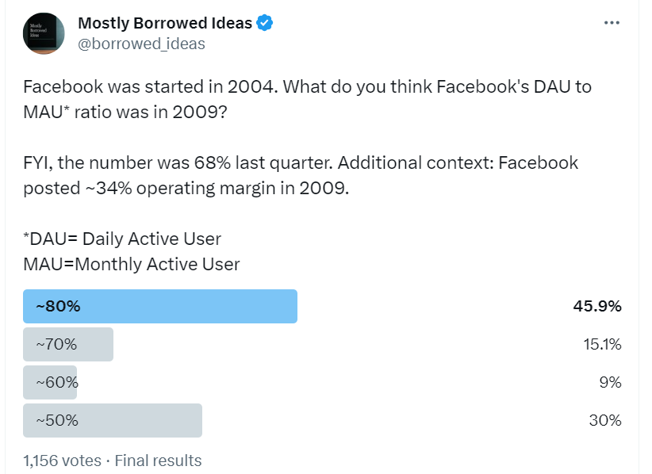
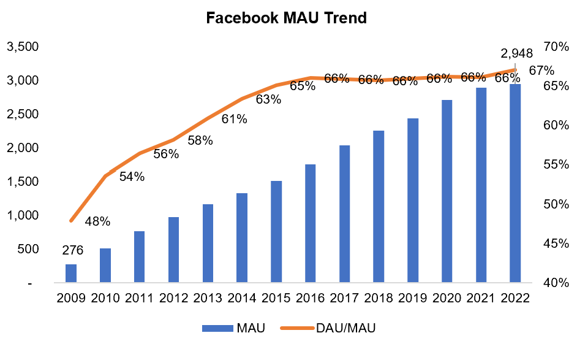
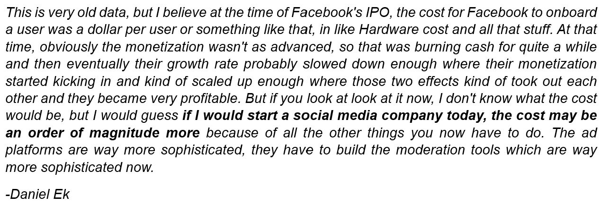
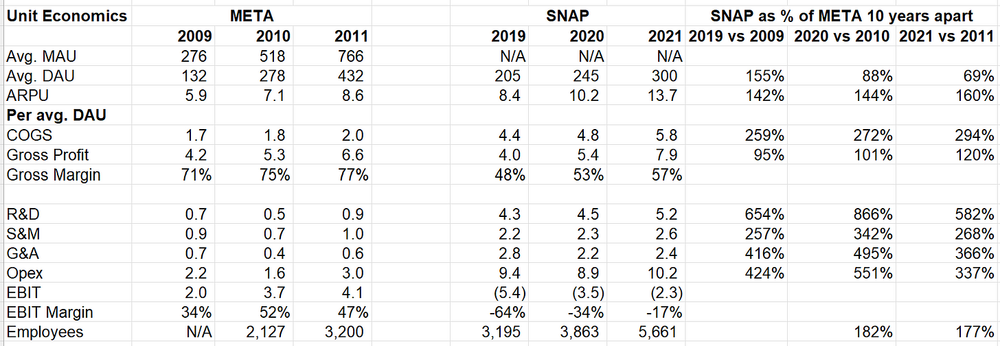
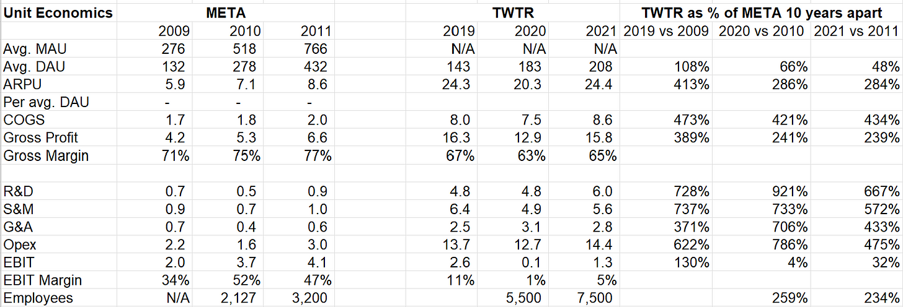
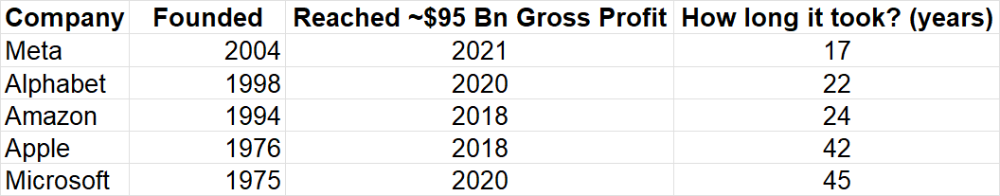
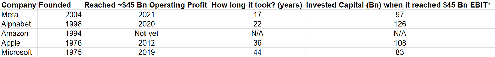

_**It's not "network effects".  

这不是 "网络效应"。**_

_Disclosure: I own Meta’s shares and January 2025 $50 Call Options  

披露：我拥有Meta的股票和2025年1月的50美元看涨期权_

During the weekend, I [asked](https://twitter.com/borrowed_ideas/status/1670192933092433920?ref=mbi-deepdives.com) my twitter followers: What do you think Facebook's DAU to MAU ratio was in 2009? The number that got the highest votes was ~80% even though I mentioned the most recent number was ~68%. I asked this question a couple of friends in real life too and they too picked the ~80% number.  

在周末，我问我的twitter粉丝：你认为2009年Facebook的DAU与MAU之比是多少？得票最高的数字是~80%，尽管我提到最近的数字是~68%。我在现实生活中也问了几个朋友这个问题，他们也选择了~80%的数字。

I asked why they picked this number. Their explanation was, “well, Facebook used to be really cool back then. Everyone was using it and we were certainly oversharing stuffs that would make us cringe today. If DAU to MAU is ~68% now, it must have been higher back then.” I suspect most of my twitter followers had similar rationale in mind.  

我问他们为什么选择这个号码。他们的解释是，"好吧，Facebook在当时真的很酷。每个人都在使用它，而且我们肯定会过度分享一些今天会让我们感到害怕的东西。如果DAU与MAU的比例现在是68%，那么当时肯定更高。"我怀疑我的大多数微博粉丝心中都有类似的理由。

The actual number was 48%. While the DAU/MAU has hardly changed since 2016, the ratio rapidly increased from 48% in 2009 to 66% in 2016. As a result, while Facebook’s MAU increased by 10.7x in 2022 vs 2009, its DAU became 15x during the same time.  

实际数字是48%。虽然DAU/MAU自2016年以来几乎没有变化，但该比例从2009年的48%迅速增加到2016年的66%。因此，虽然Facebook的MAU在2022年与2009年相比增加了10.7倍，但其DAU在同一时期变成了15倍。

What did most of the respondents to the poll miss? Smartphone penetration. Global smartphone shipments [increased](https://www.statista.com/statistics/271491/worldwide-shipments-of-smartphones-since-2009/?ref=mbi-deepdives.com) from 173.5 Mn in 2009 to 1.2 Bn in 2022. Ironically, while transition to mobile was widely believed to potentially “kill” Facebook, Facebook turned out to be perhaps one of the largest beneficiaries (along with Apple and Google of course).  

投票的大多数受访者错过了什么？智能手机的渗透率。全球智能手机出货量从2009年的1.735亿部增加到2022年的12亿部。具有讽刺意味的是，虽然人们普遍认为向移动端过渡可能会 "杀死 "Facebook，但Facebook最终可能成为最大的受益者之一（当然还有苹果和谷歌）。

Source: Company Filings, MBI Deep Dives  

资料来源：公司文件：公司文件，MBI深度调查

As I was discussing some of these aspects with a couple of friends, they mentioned why the expansion of DAU/MAU ratio isn’t surprising since thanks to network effects, the product is supposed to become stickier. That makes intuitive sense, but did it also happen in some of the other social apps such as Snap, Twitter, Reddit or Pinterest? Unfortunately, we don’t know the answer since Snap and Twitter don’t disclose MAU, and Pinterest doesn’t report DAU.  

当我和几个朋友讨论这些方面时，他们提到为什么DAU/MAU比例的扩大并不令人惊讶，因为由于网络效应，产品应该变得更有粘性。这有直观的意义，但它是否也发生在其他一些社交应用程序，如Snap、Twitter、Reddit或Pinterest？不幸的是，我们不知道答案，因为Snap和Twitter没有披露MAU，而Pinterest也没有报告DAU。

One of the things I think many people often misunderstand about network effects is people tend to think it only needs to be solved **once** as if once you get the flywheel going, you could just sit back and let the network grow on its own. While many investors can be susceptible to thinking in such simplistic terms, that’s not how it works in reality. Here’s a [quote](https://marker.medium.com/the-untold-history-of-facebooks-most-controversial-growth-tool-2ea3bfeaaa66?ref=mbi-deepdives.com) from Zuckerberg reminiscing Facebook’s challenges in growing their network in “early” years:  

我认为许多人经常误解网络效应的一件事是，人们倾向于认为它只需要解决一次，好像一旦你得到了飞轮，你就可以坐下来，让网络自己成长。虽然许多投资者容易受到这种简单化思维的影响，但现实中并不是这样的。下面是扎克伯格回忆Facebook在 "早期 "发展网络时面临的挑战的一段话：

> “Growth had plateaued around 90 million people, I remember people saying it’s not clear if it was ever going to get past a 100 million at that time. We basically hit a wall and we needed to focus on that.” (**MBI note**: Myspace at its peak had 75.9 Mn users)  
> 
> "增长在9000万人左右时已经趋于平稳，我记得人们说当时还不清楚它是否会超过1亿人。我们基本上碰到了一堵墙，我们需要专注于此。"(MBI注：Myspace在其高峰期有7590万用户)

The reality is that network effects need to cross several chasms to keep growing and those chasms don’t get solved on their own; people running the business need to take ingenious approaches to tackle the growth challenges. What complicates this even further is there are competing networks (i.e. other social apps) which makes **speed** a paramount importance, but at the same time, your tech infrastructure needs to be ready to facilitate such speed and retain the userbase after acquiring them. In other words, the moat derived from network effects can be short lived and what needs to follow after the initial spark is just relentless and near flawless execution by the people running the business.  

现实情况是，网络效应需要跨越几个鸿沟来保持增长，而这些鸿沟不会自己得到解决；经营业务的人需要采取巧妙的方法来解决增长的挑战。更加复杂的是，有竞争性的网络（即其他社交应用程序），这使得速度成为最重要的，但与此同时，你的技术基础设施需要准备好促进这种速度，并在获得用户群后保留用户群。换句话说，来自网络效应的护城河可能是短暂的，在最初的火花之后，需要的只是经营企业的人无情的、近乎完美的执行。

But what does “execution” exactly mean? And of course, growing users is not much of a promised land either; you need to know how to monetize your users and you need to learn how to do it profitably.  

但 "执行 "到底是什么意思？当然，增长用户也不是什么应许之地；你需要知道如何使你的用户盈利，你需要学习如何做到盈利。

Having interacted with many investors following social networking industry over the last few years, I suspect most investors deeply underestimate how much everyone else in this industry fell behind on the “execution” department. Instead of making qualitative statements, I intend to show this point quantitatively to contextualize what I am talking about.  

在过去几年中，我与许多关注社交网络行业的投资者进行了交流，我怀疑大多数投资者都深深地低估了这个行业的其他人在 "执行 "方面的落后程度。我不打算做定性的陈述，而是打算从数量上说明这一点，以了解我所谈论的内容。

One of the things that made me dig deep into this is I myself started wondering why Meta posted 34% operating margin in 2009 but today’s crop of social networking companies are either unprofitable or barely profitable even at similar scale. Daniel Ek, Spotify’s CEO,  [indicated](https://twitter.com/borrowed_ideas/status/1659655525762473995?ref=mbi-deepdives.com) in a recent podcast the sea change in unit economics that likely occurred since Facebook’s IPO:  

促使我深入研究这个问题的原因之一是，我自己开始想知道为什么Meta公司在2009年公布了34%的营业利润率，而今天的社交网络公司即使在类似的规模下也是不盈利或几乎不盈利的。Spotify的首席执行官丹尼尔-埃克（Daniel Ek）在最近的一次播客中指出，自Facebook上市以来，单位经济性可能发生了巨大变化：

Source: Acquired [Podcast](https://open.spotify.com/episode/671O5v5twrIfApPuyBdJTv?si=3e1bba54ce144729&nd=1&ref=mbi-deepdives.com) 来源：《中国新闻周刊》：获得的播客

Here’s what I am going to do: I will show the unit economics of Meta (then Facebook; they also had just “Facebook” website/app back then) in 2009-11 and then show the unit economics of Snap, Pinterest, and Twitter in 2019-2021 period. Snap, Pinterest, and Twitter **somewhat** resemble Meta in terms of userbase 10 years apart and this exercise is indeed quite revealing to gauge what exactly is Meta’s moats against today’s **and** future set of competitors in their social networking business. I will briefly comment on TikTok later.  

以下是我要做的事情：我将展示2009-11年Meta（当时是Facebook；他们当时也只有 "Facebook "网站/应用程序）的单位经济效益，然后展示2019-2021年期间Snap、Pinterest和Twitter的单位经济效益。Snap、Pinterest和Twitter在相隔10年的用户群方面与Meta有些相似，这种做法确实很有启示意义，可以衡量Meta在社交网络业务方面对今天和未来的一系列竞争对手的护城河到底是什么。我稍后将简要评论TikTok。

**Meta vs Snap Meta vs Snap**

Seven years after Facebook, Snap was founded in 2011. In 2019, Snap had 155% of what Facebook’s DAU was in 2009. But by 2021, Snap came down to 69% of Facebook’s DAU in 2011.  

在Facebook之后7年，Snap成立于2011年。在2019年，Snap的DAU是Facebook在2009年的155%。但到2021年，Snap降到了2011年Facebook DAU的69%。

Interestingly, while Snap’s Cost of revenue was ~3x higher than Meta’s 10 years ago, their Gross Profit (GP) is largely similar, thanks to much better monetization of the users by Snap and Facebook’s relatively primitive monetization/ad infrastructure back then by today’s standard. It’s the below the gross profit line where things start to diverge dramatically.  

有趣的是，虽然Snap的收入成本比10年前的Meta高3倍，但他们的毛利（GP）基本相似，这要归功于Snap更好的用户货币化和Facebook当时相对原始的货币化/广告基础设施（以今天的标准）。在毛利线以下，情况开始出现巨大的分歧。

**On a per DAU basis**, Snap’s R&D was ~6-8x, S&M ~2.5-3x, and G&A ~3-5x of what Meta had 10 years ago at similar scale! Snap had almost double the employees Meta had and while neither company doesn’t exactly disclose salary related expenses, Opex (R&D+S&M+G&A) per average employee for Snap was $644k in 2021 vs Meta’s $493k in 2011.  

按每DAU计算，Snap的研发费用是Meta 10年前类似规模下的~6-8倍，S&M~2.5-3倍，G&A~3-5倍！Snap的员工几乎是Meta的两倍！Snap的员工人数几乎是Meta的两倍，虽然两家公司都没有完全披露与工资有关的支出，但2021年Snap每名平均员工的Opex（研发+S&M+G&A）为64.4万美元，而Meta在2011年为49.3万美元。

\*Avg. MAU or DAU is calculated based on average of the four quarterly reported user date; Source: Company Filings, MBI Deep Dives  

\*Avg.MAU或DAU是根据四个季度报告的用户日期的平均数计算的；来源：公司文件，MBI深度调查：公司文件，MBI深度调查

One of the things that always somewhat surprised me about Snap is how so many people seem to rave about Evan Spiegel’s [leaked](https://wikileaks.org/sony/emails/emailid/139920?ref=mbi-deepdives.com) email **from 2014**. When I first read it a couple of years ago, I was happy to ignore his macro prognostics but was alarmed to see his deeply flawed understanding of the elephant i.e. Facebook in the industry he is building his own business (see the below excerpt). Some of my friends tell me I’m being harsh on Spiegel since he was just 23 at that time. Unfortunately, capitalism doesn’t have any grace period related to age; in any case, when Google came after with all its might after Facebook by launching Google+ in 2011, Zuckerberg was just 27 years old. I know ZIRP world made it easy to forget, but capitalism tends to be sink or swim if you don’t know what you are doing. Ironically, even though Spiegel had a lot to say about Fed and interest rates, his company may be one of the largest beneficiaries of such environment as Snap IPO-ed in March 2017 at $24 Bn valuation despite the fact that they reported **negative 11.7%** gross margin and **negative 128.7% operating margin** (no typo here) in 2016.  

关于Snap，总让我有些吃惊的一件事是，这么多人似乎对埃文-斯皮格尔2014年泄露的电子邮件赞不绝口。几年前，当我第一次读到这封邮件时，我很高兴地忽略了他的宏观预言，但当我看到他对大象，即他正在建立自己的业务的行业中的Facebook的理解存在严重缺陷时，我感到震惊（见以下摘录）。我的一些朋友告诉我，我对斯皮格尔很苛刻，因为他当时才23岁。不幸的是，资本主义没有任何与年龄有关的宽限期；无论如何，当谷歌在2011年全力追赶Facebook，推出Google+时，扎克伯格才27岁。我知道ZIRP世界让人很容易忘记，但如果你不知道自己在做什么，资本主义往往会沉没或游泳。具有讽刺意味的是，尽管斯皮格尔对美联储和利率有很多意见，但他的公司可能是这种环境的最大受益者之一，因为Snap在2017年3月以240亿美元的估值进行了IPO，尽管他们在2016年报告了负11.7%的毛利率和负128.7%的营业利润率（这里没有打错）。

Source: Excerpt from Evan Spiegel’s [leaked](https://wikileaks.org/sony/emails/emailid/139920?ref=mbi-deepdives.com) email  

来源：《中国新闻周刊》：摘自埃文-斯皮格尔泄露的电子邮件

**Meta vs Pinterest Meta vs Pinterest**

Pinterest was founded in 2008. Similar to Snap, Pinterest had slightly better GP than Meta at similar scale although their path to slightly better GP per MAU was different to Snap’s. Both their ARPU and Cost of revenue was more or less similar to what Meta had 10 years ago. People likely spend less time on Pinterest than they used to on Facebook back then, so perhaps that’s why they have similar ARPU even with Facebook’s basic ad infrastructure during 2009-2011 period.  

Pinterest成立于2008年。与Snap类似，Pinterest在类似规模下的GP略好于Meta，尽管他们实现每个MAU的GP略好的路径与Snap不同。他们的ARPU值和收入成本或多或少与10年前Meta的情况相似。人们在Pinterest上花费的时间可能比他们当时在Facebook上花费的时间要少，所以也许这就是为什么他们在2009-2011年期间即使使用Facebook的基本广告基础设施也有类似的ARPU值。

Since Pinterest IPO-ed in 2019, I am going to ignore 2019 vs 2009 comparison. **On a per MAU basis**, Pinterest’s R&D was ~3-5x, S&M ~2.5-3x, and G&A ~2-3.5x of what Meta had 10 years ago at similar scale! What’s interesting is Pinterest actually had similar number of employees to what Meta had back then. So why exactly Pinterest’s cost structure was still so wildly different?  

由于Pinterest在2019年上市，我将忽略2019年与2009年的比较。按每MAU计算，Pinterest的研发费用是Meta 10年前类似规模时的3-5倍，S&M是2.5-3倍，G&A是2-3.5倍有趣的是，Pinterest的员工人数与Meta当年的员工人数相似。那么，究竟为什么Pinterest的成本结构仍有如此大的差异？

There may be multiple factors at play. But average salary per employee almost certainly increased over time which may be the primary reason for such divergence. Again, as I have [discussed](https://www.mbi-deepdives.com/sbc/) before, there are only a handful of companies in Silicon Valley which **built** de-facto monopoly, and the primary “raw materials” to sustain their monopoly (using the word very loosely; FTC lawyers are encouraged to ignore my phrasings) is their pool of human capital. As you can expect, with their “monopoly” profits, they basically call shot in pricing the labor market and you have to play along even if you don’t have monopoly yourself. To say it differently, everyone in Tech at Silicon Valley or Seattle are rich thanks to a handful of monopolies regardless of whether they work at any of the monopolies themselves. If there were no monopolies in Silicon Valley/Seattle, labor market would likely go through a sea change to reflect the reality of the economics of many of the younger tech companies that were started close to GFC era.  

可能有多种因素在起作用。但每个员工的平均工资几乎肯定随着时间的推移而增加，这可能是这种分歧的主要原因。同样，正如我以前讨论过的，在硅谷只有少数几家公司建立了事实上的垄断，而维持其垄断的主要 "原材料"（使用这个词非常宽松；鼓励联邦贸易委员会律师忽略我的措辞）是其人力资本库。正如你所期望的那样，由于他们的 "垄断 "利润，他们基本上在劳动力市场的定价上说了算，即使你自己没有垄断权，你也必须配合。换句话说，硅谷或西雅图的科技界人士都因少数垄断企业而致富，而不管他们是否在任何一家垄断企业工作。如果硅谷/西雅图没有垄断企业，劳动力市场很可能会发生巨大变化，以反映许多在全球金融危机时期创办的年轻科技公司的经济现实。

Source: Company Filings, MBI Deep Dives  

资料来源：公司文件：公司文件，MBI深度调查

**Meta vs Twitter Meta与Twitter**

While Facebook was started in 2004, it became open to general public in 2006, the same year Twitter was founded. Therefore, these two companies are bit of a contemporary but their fates have diverged materially. Mark Zuckerberg had an apt quote about Twitter that gets repeated every now and then:  

虽然Facebook于2004年成立，但它在2006年开始向公众开放，同年Twitter也成立了。因此，这两家公司有点像同时代的公司，但它们的命运却有很大的不同。马克-扎克伯格有一句关于Twitter的名言，时常被重复引用：

> “Twitter is such as mess — it’s as if they drove a clown car into a gold mine and fell in.”  
> 
> "推特是如此混乱--就好像他们把一辆小丑车开进了一个金矿，然后掉了进去。"

Despite being a contemporary, Twitter’s mDAU or “monetizable DAU” in 2019 (Twitter stopped disclosing DAU or MAU and used to report mDAU) was similar to what Facebook had in 2009. By 2021, Twitter’s mDAU was less than half of Facebook’s in 2011.  

尽管是当代人，但推特在2019年的mDAU或 "可货币化的DAU"（推特停止披露DAU或MAU，习惯报告mDAU）与Facebook在2009年的情况类似。到2021年，Twitter的mDAU还不到Facebook在2011年的一半。

Twitter’s ARPU in 2019-21 was actually ~3-4x of Facebook’s 10 years ago which led to GP per DAU to be ~2.5-4x of Facebook’s. Anything below GP line, again, is just a sorry state of affairs.  

Twitter在2019-21年的ARPU值实际上是10年前Facebook的~3-4倍，这导致每DAU的GP值是Facebook的~2.5-4倍。任何低于GP线的东西，同样只是一种遗憾。

**On a per DAU basis**, Twitter’s R&D was ~7-9x, S&M ~6-7x, and G&A ~4-7x of what Meta had 10 years ago at somewhat similar scale (perhaps these numbers are slightly overstated since I’m using mDAU as DAU for Twitter)! It is perhaps no surprise that Elon Musk got tempted to buy and right size the cost structure a bit, but it seems he had done that at the expense of ARPU so far, so the jury is still out there whether Twitter is in a better position pre or post acquisition by Musk.  

按每DAU计算，Twitter的研发费用是Meta公司10年前规模相似时的7-9倍，S&M是6-7倍，G&A是4-7倍（也许这些数字略显夸张，因为我用mDAU作为Twitter的DAU）!也许埃隆-马斯克被诱惑去收购并使成本结构合理化并不奇怪，但到目前为止，他似乎是以牺牲ARPU值为代价的，因此Twitter在被马斯克收购之前或之后是否处于一个更好的位置，陪审团还没有定论。

\*Ignored Twitter’s litigation expense for 2021 Opex and EBIT calculation; Source: Company Filings, MBI Deep Dives  

\*在计算2021年Opex和EBIT时忽略了Twitter的诉讼费用；资料来源：公司文件，MBI深度调查

The two other companies that are mostly talked about in social networking industry but yet to be public are Reddit and of course, TikTok (which isn’t necessarily “social”, but they are certainly Meta’s perhaps most potent competition). Reddit, another contemporary of Meta as it was founded in **2005**, likely generated [$350 Mn](https://www.theinformation.com/articles/reddits-ad-revenue-expected-to-double-to-at-least-350-million-this-year?ref=mbi-deepdives.com) revenue in 2021 which is basically **a day’s revenue of Meta today**.  

另外两家在社交网络行业被谈论最多但尚未公开的公司是Reddit，当然还有TikTok（不一定是 "社交"，但他们肯定是Meta可能最有力的竞争对手）。Reddit是与Meta同时代的另一家公司，因为它成立于2005年，可能在2021年产生3.5亿美元的收入，这基本上是Meta今天的一天的收入。

TikTok, on the other hand, [generated](https://fortune.com/2023/04/06/tiktok-ban-china-bytedance-increased-ad-spending/?ref=mbi-deepdives.com) $10 Bn revenue in 2022 which would put them closest to Meta in terms of revenue. If WSJ’s [reporting](https://www.wsj.com/articles/tiktok-parent-bytedance-sees-losses-swell-in-push-for-growth-11665071238?ref=mbi-deepdives.com) is true that ByteDance, the owner of TikTok, posted $7.15 Bn losses in 2021, TikTok almost certainly had a pretty deep loss in 2021. Anecdotally speaking, TikTok pays a hefty premium to lure talent away from Big Tech; but even such premium wasn’t enough to convince a couple of my acquaintances to join TikTok since they were not confident that TikTok would be around in the US in 2-3 years. Therefore, while I don’t expect TikTok’s cost structure to resemble some of the public companies discussed here, it is still likely nowhere close to Meta’s unit economics.  

另一方面，TikTok在2022年创造了100亿美元的收入，这将使他们在收入方面最接近Meta。如果WSJ的报道是真的，TikTok的所有者ByteDance在2021年公布了71.5亿美元的损失，那么TikTok在2021年几乎肯定有相当深的损失。从轶事来看，TikTok支付了高额的溢价，以吸引人才离开大科技公司；但即使这样的溢价也不足以说服我的几个熟人加入TikTok，因为他们对TikTok在2-3年内会在美国存在没有信心。因此，虽然我不指望TikTok的成本结构会像这里讨论的一些上市公司一样，但它仍然可能远不及Meta的单位经济。

What is my broad takeaway from digging into these numbers?  

挖掘这些数字给我带来的广泛启示是什么？

While it is tempting to blame management of one company or another (and they likely do deserve some criticisms), we probably should take a step back and wonder why is every single Meta’s competitors being managed so poorly? Why were they all spending money like drunken sailors without any clear sight to compelling economics in the near future?  

虽然责备某个公司的管理层是很诱人的（而且他们很可能确实应该受到一些批评），但我们也许应该退一步想一想，为什么每一个美达公司的竞争对手都被管理得如此糟糕？为什么他们都像喝醉酒的水手一样花钱，而在不久的将来却没有任何清晰的视线来实现令人信服的经济效益？

I’m sure low interest rates and investors willingness to look past losses for the elusive economics at scale played their parts too, but I think the primary reason is the business of social media likely changed forever. On the surface level, social networking seems like an amazing business: once you manage to create network effects, the nodes of the network grow and the network just feeds on itself. Since your users generate all the content at zero marginal cost, and your job is basically to just aggregate demand to sell the network’s attention to advertisers vs paying for content in the legacy media business, this sounds like a great business model . Operating margin for such business was understandably expected to be at least ~30% and potentially much more (Meta’s highest ever operating margin was 52.3% in 2010 which likely contributed to such inflated expectations).  

我相信低利率和投资者愿意为难以捉摸的规模经济看淡损失也起到了一定作用，但我认为主要原因是社交媒体的业务可能永远改变了。从表面上看，社交网络似乎是一门了不起的生意：一旦你设法创造网络效应，网络的节点就会增长，网络就会自我滋生。由于你的用户以零边际成本产生所有的内容，而你的工作基本上只是汇总需求，将网络的注意力卖给广告商，而不是为传统媒体业务的内容付费，这听起来是一个伟大的商业模式。可以理解的是，这类业务的运营利润率预计至少为30%，甚至可能更高（Meta有史以来最高的运营利润率是2010年的52.3%，这可能促成了这种膨胀的预期）。

Why isn’t that happening at all? I already wrote about “raw material” inflation which may not reverse anytime soon. AI may help lowering the demand for software engineers in the medium to long-term, but even then as long as Big Tech have the profits, it shouldn’t be hard for them to maintain a persistent and increasing “inflation” for the talented pool of human capital. Attracting talent at reasonable cost itself would be a difficult challenge, but as societies around the world demand more data privacy, security, and moderations in these companies, it is creating the **unintended benefit** to the incumbent such as Meta (think ATT, GDPR etc.). **So, today these two things: a) ability to attract and price talent, and b) regulatory capture are the primary moats of Meta.**  

为什么根本没有发生呢？我已经写过关于 "原材料 "的通货膨胀，它可能不会很快逆转。人工智能可能有助于在中长期降低对软件工程师的需求，但即使如此，只要大科技公司拥有利润，他们应该不难维持对人才库的持续和不断增长的 "通货膨胀"。以合理的成本吸引人才本身将是一个困难的挑战，但随着世界各地的社会要求这些公司有更多的数据隐私、安全和节制，它正在为现任者创造意想不到的好处，如Meta（想想ATT、GDPR等）。因此，今天这两件事：a）吸引人才和为人才定价的能力，以及b）监管的把握是Meta公司的主要护城河。

But even beyond that, perhaps yet another challenge for these companies is their competitor is Meta. Tech may seem inherently a [red queen’s race](https://en.wikipedia.org/wiki/Red_Queen%27s_race?ref=mbi-deepdives.com), but it may become more difficult to keep pace for everyone else if the company that is way ahead is also run by an operator who is so paranoid about durability of his business that he ends up running faster than everyone else.  I would even argue most moats in tech are essentially “execution” moats (maybe also why Buffett mostly avoids them), and except maybe one or two, none of the tech companies can just sell products/services without perennially participating in the red queen’s race.  

但即便如此，这些公司的另一个挑战也许是他们的竞争对手是Meta。科技似乎本来就是红娘的比赛，但如果遥遥领先的公司也是由一个对其业务的持久性如此偏执的经营者经营，以至于他最终比其他人跑得更快，那么其他人就可能变得更难跟上。我甚至认为科技界的大多数护城河本质上是 "执行 "护城河（也许也是巴菲特大多避开它们的原因），除了一两家，没有一家科技公司可以只卖产品/服务而不常年参与红色皇后的竞赛。

When Michael Nathanson asked the below question to Mark Zuckerberg in 2Q’22 earnings call, admittedly I found Zuckerberg’s response a bit lacking and thought the real answer that he’s not saying is Meta’s moats are evaporating. Not sure if it’s just the stock price that’s influencing me here, but I do think he indeed pointed out the moat Meta likely capitalized the most in its history (the network effects moat expired some time ago) and it’s their **execution**:  

当Michael Nathanson在22年第二季度财报电话会议上向Mark Zuckerberg提出以下问题时，诚然，我发现Zuckerberg的回答有点欠缺，认为他没有说的真正答案是Meta的护城河正在蒸发。不知道是否只是股价在这里影响了我，但我确实认为他确实指出了Meta公司历史上可能资本化程度最高的护城河（网络效应护城河前段时间已经过期），这就是他们的执行：

> **Michael Nathanson 迈克尔-纳坦森（Michael Nathanson**
> 
> Mark, I think going to one of the earlier questions about your advantages at Facebook. The previous moat, we would argue, was just the social graph of billions of people, families and friends. Do you think what you're building now with AI and from digital, how all those content is even a better moat, is a better business than the one you had before, which was a pretty high barrier to entry, just given the social effects of the network you built? (**MBI**: _if it were so high barrier to entry, how could Snap, Pinterest, TikTok enter and gain massive userbase over time? It was always a very weak moat, yet there is almost no profit left for others to eat)_
> 
>   
> 
> 马克，我想回到之前关于你在Facebook的优势的一个问题。我们认为，以前的护城河只是数十亿人的社交图，家庭和朋友。你是否认为你现在用人工智能和从数字方面建立的，所有这些内容甚至是一个更好的护城河，是一个比你以前的更好的业务，这是一个相当高的进入门槛，只是考虑到你建立的网络的社会效应？(MBI: 如果它的进入门槛如此之高，Snap、Pinterest、TikTok如何进入并随着时间的推移获得大量的用户群？它始终是一个非常薄弱的护城河，然而几乎没有利润留给别人吃)
> 
> **Mark Zuckerberg 马克-扎克伯格**
> 
> In terms of building sustainable competitive advantages, in terms of the social graph, right, which you cited from before, people have been able to get that from phones for more than a decade now, right? S**o I don't really think that's been the thing for us. I think it's we're a serious technology company. We invest a lot in building infrastructure. And culturally, we focus on moving and learning faster than everyone else. And I think that those are sustainable advantages.**
> 
>   
> 
> 就建立可持续的竞争优势而言，就你之前引用的社交图谱而言，人们已经能够从手机上获得这些东西，现在已经有十多年了，对吗？所以我真的不认为这对我们来说是个问题。我认为，我们是一家严肃的技术公司。我们在建设基础设施方面投入了很多。在文化上，我们专注于比其他人更快的行动和学习。我认为，这些是可持续的优势。
> 
> And so certainly, I think that the AI technology infrastructure that we're building, **I think it can compound and be better than others in the industry and that will be an advantage and make the product better over time**. But I think at the end of the day, what that really comes down to is just **I try to push the company to be one that learns faster and just keeps iterating and moving faster than we did in the past and than others in the industry do**. And I think if we can do that well, then we'll continue to succeed.
> 
>   
> 
> 因此，当然，我认为我们正在建立的人工智能技术基础设施，我认为它可以复合，比行业中的其他人更好，这将是一个优势，并随着时间的推移使产品更好。但我认为，在一天结束时，真正归结为的是，我试图推动公司成为一个学习速度更快、不断迭代的公司，并比我们过去和行业中的其他人走得更快。我认为，如果我们能够很好地做到这一点，那么我们将继续取得成功。
> 
> **But I think the moment that we stop doing that, then we'll basically fall behind**. It's a very competitive field and we need to keep on pushing ahead. But I think the reason why we have succeeded and seen so good results with Facebook, Instagram and the other social apps is **because we basically focus pretty relentlessly on just pushing to constantly improve them.**
> 
>   
> 
> 但我认为，一旦我们停止这样做，那么我们基本上就会落后。这是一个竞争非常激烈的领域，我们需要继续向前推进。但我认为，我们之所以成功，并在Facebook、Instagram和其他社交应用程序中看到如此好的结果，是因为我们基本上相当不懈地专注于不断推动改善它们。

Just as it didn’t satisfy me back then, Zuckerberg’s response may not feel convincing to many because it feels a bit fluffy and not the usual kind of moat we talk about. But if you look at Meta’s financials since 2009 and study carefully not only against other social companies but also other big tech, it is hard not to infer their execution has been almost unparalleled. Here’s what I [wrote](https://www.mbi-deepdives.com/meta2023/) back in March this year:  

就像当年没有让我满意一样，扎克伯格的回答可能让很多人觉得没有说服力，因为它感觉有点蓬头垢面，不是我们通常说的那种护城河。但是，如果你看一下Meta自2009年以来的财务状况，并仔细研究一下，不仅与其他社交公司，而且与其他大型科技公司相比，很难不推断出他们的执行力几乎是无与伦比的。以下是我在今年3月时写的内容：

“While investors have perennially wondered about the ghost of Myspace, FOA (Family of Apps) continued to reach new and unforeseen heights in the social media industry.  

"当投资者常年对Myspace的幽灵感到疑惑时，FOA（Family of Apps）继续在社交媒体行业达到新的和不可预见的高度。

A **19-year old** Mark Zuckerberg co-founded Facebook (currently Meta) in 2004 and it is hard not to be awestruck by what he did in less than couple of decades. Let me contextualize Zuckerberg's height of success with Facebook (now Meta).  

2004年，19岁的马克-扎克伯格共同创立了Facebook（目前为Meta），很难不为他在不到几十年的时间里所做的事情而感到震惊。让我来介绍一下扎克伯格在Facebook（现在的Meta）的成功高度。

17 years after being founded, Meta reached $95 Bn Gross Profit in 2021. To reach similar Gross Profit, Alphabet, Amazon, Apple, and Microsoft took 22, 24, 42, and 45 years respectively.  

成立17年后，Meta在2021年达到950亿美元的毛利润。为了达到类似的毛利润，Alphabet、亚马逊、苹果和微软分别花了22、24、42和45年。

Source: Company Filings, MBI Deep Dives  

资料来源：公司文件：公司文件，MBI深度调查

How about **GAAP** Operating Profit? Meta posted $45 Bn operating profit (**including** ~$10 Bn losses in Reality Labs) in 2021. To reach similar operating profit, Alphabet, Apple, and Microsoft took 22, 36, and 44 years respectively. To post such operating profit, only Microsoft required lower invested capital than Meta, so Meta was able to reach such profitability with incredible margins **and** ROIC. Perhaps the AGI will beat Zuckerberg's record by reaching $45 Bn operating profit faster. While Meta may have gotten a bit derailed in 2022, it would be unfair to not acknowledge, appreciate, and applaud what Zuckerberg and his team did in 2004-2021.”  

GAAP营业利润如何？Meta在2021年发布了450亿美元的营业利润（包括现实实验室的约100亿美元损失）。为了达到类似的营业利润，Alphabet、苹果和微软分别花了22年、36年和44年。为了实现这样的营业利润，只有微软需要的投资资本比Meta低，所以Meta能够以令人难以置信的利润率和ROIC达到这样的盈利能力。也许AGI将打破扎克伯格的记录，更快地达到450亿美元的运营利润。虽然Meta在2022年可能有点脱轨，但不承认、不欣赏、不赞扬扎克伯格和他的团队在2004-2021年所做的一切是不公平的。"

\*Invested Capital is calculated as total assets-cash and short-term investments-current liabilities; Source: Company Filings, MBI Deep Dives  

\*投资资本的计算方法是总资产-现金和短期投资-流动负债；资料来源：公司文件：公司文件，MBI深度调查

If “execution” is the moat, what is the driver of such moats? It’s the people who have to execute the plan, and it’s the CEO who need to design the plan and recruit the right people to get the job done.  

如果 "执行 "是护城河，那么这种护城河的驱动力是什么？是必须执行计划的人，是CEO需要设计计划并招募合适的人去完成工作。

Of course, investing is inherently about the future, and what Meta did in 2004-2021 can prove to be just relics of history. But it is historical track record that is the bedrock to form our qualitative insights for the long-term.  

当然，投资本质上是关于未来的，美达公司在2004-2021年所做的事情可能被证明只是历史的遗迹。但是，正是历史记录才是形成我们对长期的定性见解的基石。

I do admit Meta’s capital allocation in 2021-22 period was far from anything to be proud of (and Zuckerberg would probably not disagree either); I do want to point out that for most tech companies, capital allocation doesn’t start based on what FCF you generate, so I’m not just alluding to Meta’s ill-timed buybacks in 2021. It essentially starts at Gross Profit level; how much a tech company spends in R&D, S&M, and G&A are deeply integral to capital allocation framework. From this perspective, Zuckerberg made some very suboptimal decisions and committed mistakes by over hiring which he later needed to correct through a massive and painful series of layoffs. Overhiring is a mistake committed by many CEOs in 2021-22 period, but that’s not a defense for Meta or Zuckerberg because if “execution” is the primary moat, you better be switched on when everyone else is off.  

我承认梅塔公司在2021-22年期间的资本分配远不是什么值得骄傲的事情（扎克伯格可能也不会反对）；我确实想指出，对于大多数科技公司来说，资本分配并不是根据你产生的FCF开始的，所以我不仅仅是暗指梅塔公司在2021年不合时宜的回购。它基本上是从毛利水平开始的；一家科技公司在研发、S&M和G&A方面的支出是资本分配框架的重要组成部分。从这个角度来看，扎克伯格做出了一些非常不理想的决定，并通过过度招聘犯了错误，后来他需要通过一系列大规模的痛苦的裁员来纠正。过度招聘是许多CEO在2021-22年期间犯下的错误，但这不是美达或扎克伯格的辩护理由，因为如果 "执行 "是主要的护城河，你最好在其他人都关闭的时候开机。

At the end of the day, the real question about Meta’s “execution” moat is which “Zuckerberg” reflects closer to reality today going forward: is it 2004-21 Zuckerberg? or is 2021-22 one? Investors generally dislike personality based moats as they can be excruciatingly hard to assess/evaluate/track, and these personalities often tend to test your patience, but if you look at tech history and perhaps the most outlier successes, such personality driven (and not necessarily business driven moats), are not a rarity.  

最后，关于Meta的 "执行 "护城河的真正问题是，在未来，哪个 "扎克伯格 "反映出更接近今天的现实：是2004-21年的扎克伯格？ 还是2021-22年的那个？投资者一般不喜欢基于个性的护城河，因为它们可能极难评估/评价/跟踪，而且这些个性往往倾向于考验你的耐心，但如果你看看科技史，也许最离谱的成功，这种个性驱动（而不一定是业务驱动的护城河），并不罕见。

Even before the 2022-23 drama, I have always thought the Facebook or Meta’s long-term bull case revolves around Zuckerberg (see my [2020 thread](https://twitter.com/borrowed_ideas/status/1253165456850145281?ref=mbi-deepdives.com)). Imagine if someone told you in 2015 that by 2023, the most popular social formats would be “Stories” and “Short form videos”, both of which would be invented (and hence enjoy a material leg up) by Meta’s two closest competitors at the time, you would probably be worried whether Meta would remain relevant in just 8 years. When Meta was transitioning hard to mobile, operating margin fell from 47.3% in 2011 to 10.6% in 2012. Transitioning to Stories and Reels also required Meta to be willing to give up valuable surfaces or time spent on their apps to materially lower monetized features which create near-term earnings pressure. This is the kind of decisions which are not quite hard to take by a founder but can be quite tricky to pursue for hired management.  

即使在2022-23年的大戏之前，我一直认为Facebook或Meta的长期牛市案例都是围绕扎克伯格展开的（见我的2020年主题）。想象一下，如果有人在2015年告诉你，到2023年，最流行的社交格式将是 "故事 "和 "短视频"，这两种格式都是Meta当时最接近的两个竞争对手发明的（因此享有实质性的优势），你可能会担心Meta是否会在短短8年内保持相关性。当Meta正努力向移动端过渡时，营业利润率从2011年的47.3%下降到2012年的10.6%。过渡到Stories和Reels也要求Meta公司愿意放弃宝贵的表面或花在其应用程序上的时间，以实质性地降低货币化的功能，这造成了近期的盈利压力。这种决定对创始人来说并不难做，但对受雇的管理层来说，追求这种决定可能相当棘手。

The social media of 2030-35 would probably be very, very different than what it is today. Any careful analysis of today’s business fundamentals may become obsolete and hence, your ability to be long-term owner of this business may be largely dependent on your opinion about the quality of management as the people running the business would likely need to go through a couple of format/feature shifts every decade or so (maybe OS too every 2-3 decades).  

2030-35年的社会媒体可能会与今天的情况非常、非常不同。任何对今天商业基本面的仔细分析都可能变得过时，因此，你能否成为这个企业的长期所有者，可能主要取决于你对管理质量的看法，因为经营这个企业的人很可能需要每十年左右经历几次格式/功能的转变（也许操作系统也是每二三十年一次）。

Considering almost constant negative press coverage and the difficulty of forecasting/underwriting social media businesses for 5-10 years, the stock may persistently trade at below market multiples. Despite +134% YTD, the stock still trades at ~17x NTM EV/EBIT which is ~8-10 turn lower compared to Nasdaq 100 (when you include SBC in EBIT calculation) and ~3-4 turn lower than S&P 500 (again, similar SBC adjustments to QQQ). To the extent my opinion about Meta’s management is correct is what will likely drive shareholders’ long-term return.  

考虑到几乎持续的负面新闻报道，以及对社交媒体业务进行5-10年的预测/承销的难度，该股可能持续以低于市场的倍数交易。尽管YTD增长了134%，该股仍以约17倍的NTM EV/EBIT交易，比纳斯达克100指数低8-10倍（当你将SBC纳入EBIT计算时），比标准普尔500指数低3-4倍（同样，SBC调整与QQQ类似）。如果我对美达管理层的看法是正确的，那么这将可能推动股东的长期回报。

**P.S.** I know any piece on Meta’s moat may seem incomplete without any discussion on Metaverse or AR/VR segment. It is simply too early to form any rigid opinion there, but for curious readers, I encourage you to read this Benedict Evans piece which I thought was perhaps the most thoughtful [piece](https://www.ben-evans.com/benedictevans/2023/6/15/vision-pro?ref=mbi-deepdives.com) on Vision Pro/Quest post WWDC.  

P.S. 我知道如果不讨论Metaverse或AR/VR部分，任何关于Meta的护城河的文章都可能显得不完整。但对于好奇的读者，我鼓励你们阅读本尼迪克特-埃文斯的文章，我认为这可能是WWDC之后关于Vision Pro/Quest的最有思想的文章。

You can also read a bit more detailed analysis on Meta [**here**](https://www.mbi-deepdives.com/meta2023/) (March, 2023)  

你也可以在这里阅读关于Meta的更详细的分析（2023年3月）。

**_Disclaimer:_** _All posts on “MBI Deep Dives” are for informational purposes only. This is NOT a recommendation to buy or sell securities discussed. Please do your own work before investing your money._  

免责声明："MBI深潜 "的所有帖子仅用于提供信息的目的。这不是一个购买或出售所讨论的证券的建议。在投资之前，请做你自己的工作。
