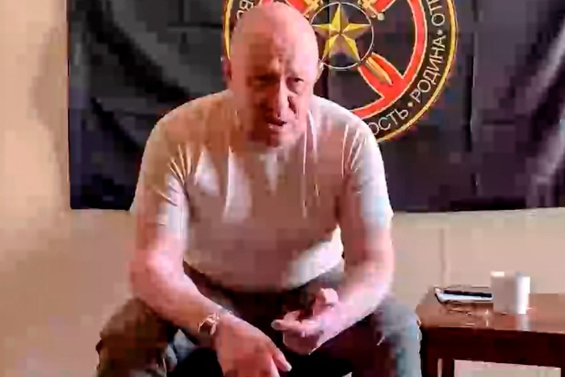
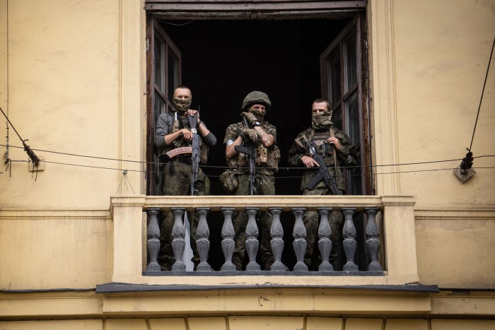
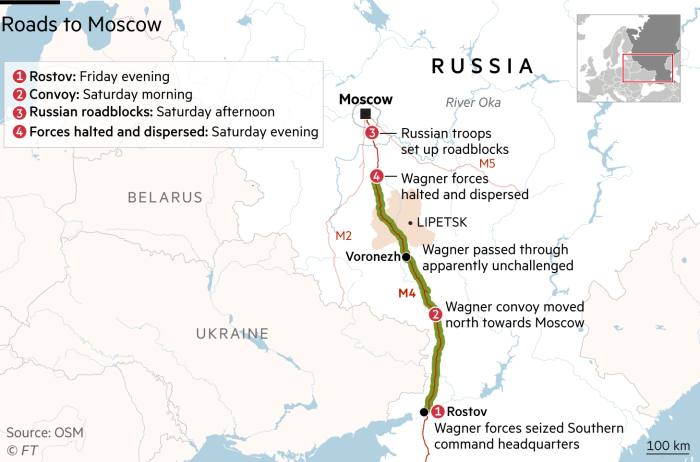
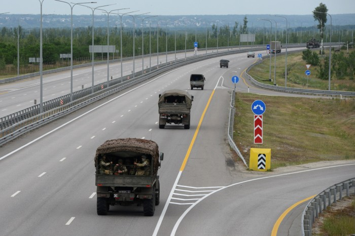
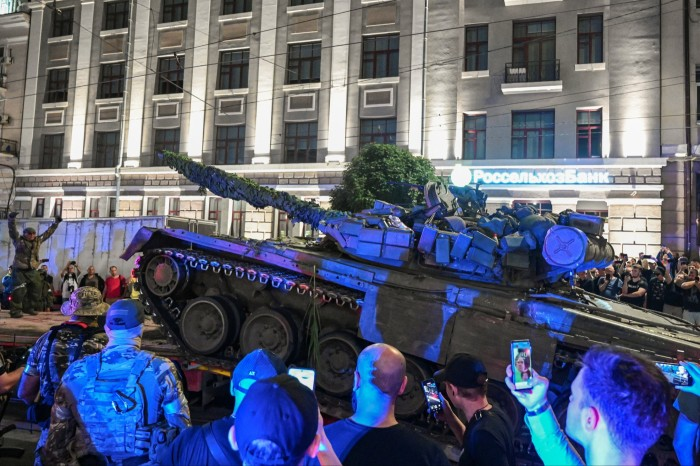

The first armed uprising attempted in Russia in three decades started with a crackly voice-note left on the Telegram messenger app.   

三十年来俄罗斯的第一次武装起义始于Telegram信使应用程序上留下的噼里啪啦的语音笔记。

It was warlord [Yevgeny Prigozhin](https://www.ft.com/content/34715f7b-1392-4062-b910-e8fd0800103c), accusing the army’s leadership of “murdering tens of thousands of Russian soldiers” as a result of their disastrous invasion of Ukraine.  

是军阀叶夫根尼·普里戈任指责军队领导层由于灾难性入侵乌克兰而 “谋杀了数万名俄罗斯士兵”。

Prigozhin, head of the Wagner group of mercenaries fighting for Russia in east Ukraine, had been [complaining](https://www.ft.com/content/f5aafe8d-3856-42e4-9b4d-171976bc5065) about the leaders of the regular army for many months. But this time was different. Prigozhin and his men were about to launch an audacious march on Moscow to “punish” the defence minister and army top brass.  

在乌克兰东部为俄罗斯作战的瓦格纳雇佣军集团负责人普里戈任几个月来一直在抱怨正规军领导人。但这次不同。普里戈津和他的手下即将向莫斯科发起一场大胆的游行，以“惩罚”国防部长和陆军高级官员。

“Wagner’s commanders have come to a decision. The evil being spread by the country’s military leadership must be stopped,” Prigozhin said in the short recorded message, issued at around 9pm local time on Friday.   

“瓦格纳的指挥官已经做出决定。必须阻止该国军事领导层传播的邪恶，“Prigozhin在当地时间周五晚上9点左右发布的简短录音信息中说。

The warlord, his voice seething with anger, said his men who numbered 25,000 would start moving from their base camps in east Ukraine towards Moscow.   

这位军阀的声音充满了愤怒，他说他的25，000人将开始从乌克兰东部的大本营向莫斯科移动。

Yevgeny Prigozhin in a video he released at the start of his insurrection © Prigozhin Press Service/AP  

叶夫根尼·普里戈津在起义©开始时发布的视频中 普里戈任新闻社/美联社

“I ask everyone to get out of our way. Those who try to stop us, we will consider them a threat and destroy them immediately,” he said. “This is not a military coup. It is a march for justice.”  

“我要求每个人都让开。那些试图阻止我们的人，我们会认为他们是威胁并立即摧毁他们，“ 他说。“这不是军事政变。这是一场正义游行。

Stunned officials scrambled to respond. Late on Friday, the FSB security service announced it had opened a criminal case against Prigozhin for “organising an armed insurrection”.  

目瞪口呆的官员争先恐后地做出回应。周五晚些时候，FSB安全部门宣布已对Prigozhin提起刑事诉讼，罪名是“组织武装叛乱”。

A top army general Sergei Surovikin recorded a video calling on Wagner fighters to lay down their arms. An urgent news bulletin was screened on the state’s Channel One and the anchor attempted to rebut Prigozhin’s claims. Kremlin spokesman Dmitry Peskov told reporters that President Vladimir Putin had been informed.   

陆军高级将领谢尔盖·苏罗维金（Sergei Surovikin）录制了一段视频，呼吁瓦格纳战士放下武器。该州第一频道播放了紧急新闻公告，主播试图反驳普里戈任的说法。克里姆林宫发言人德米特里佩斯科夫告诉记者，弗拉基米尔普京总统已被告知。

Security was tightened in Moscow and during the night people shared photos of military vehicles in the street. But the focal point of the insurrection quickly became Rostov-on-Don in southern Russia, home to the army’s Southern command, which is in charge of the war in Ukraine.   

莫斯科加强了安全，夜间人们在街上分享军车的照片。但起义的焦点很快成为俄罗斯南部的顿河畔罗斯托夫，这里是负责乌克兰战争的军队南部司令部的所在地。

The large port city is just a two-hour drive from occupied areas of east Ukraine, where Wagner have their base camps. And by the early hours of Saturday morning, their mercenaries had arrived.   

这座大型港口城市距离乌克兰东部被占领地区仅两小时车程，瓦格纳在那里设有大本营。到星期六凌晨，他们的雇佣兵已经到达。

Wagner members on the balcony of a building in central Rostov on Saturday © AFP via Getty Images  

瓦格纳成员周六©在罗斯托夫市中心一栋建筑物的阳台上 法新社通过盖蒂图片社

Wagner tanks and armoured vehicles were spotted across the city. Heavily armed soldiers jumped out and encircled key buildings: the military headquarters, the local government building, the head office of the FSB.   

瓦格纳坦克和装甲车遍布整个城市。全副武装的士兵跳出来包围了关键建筑物：军事总部、地方政府大楼、FSB 总部。

Andrei, a local blogger, filmed the scenes while crossing the city to go to work. “Rostov. 9am. People are panicking, that’s for sure. Everyone is outside trying to figure out what’s going on . . . Everyone’s afraid,” he said in the video.  

当地博主安德烈（Andrei）在穿越城市去上班时拍摄了这些场景。“罗斯托夫。上午9点，人们惊慌失措，这是肯定的。每个人都在外面试图弄清楚发生了什么......每个人都害怕，“ 他在视频中说。

He filmed a roadblock set up by the police. Behind it, Wagner men stood guard. At another crossroads, he found men from the mercenary group sitting in a pick-up truck with a machine gun set up on the back. The situation appeared calm, but Wagner had taken control of the city.  

他拍摄了警察设置的路障。在它后面，瓦格纳的人站岗。在另一个十字路口，他发现雇佣兵团的人坐在一辆皮卡车上，后面架着机关枪。局势看起来很平静，但瓦格纳已经控制了这座城市。

Prigozhin was filmed in the army’s Rostov HQ, which his forces had seized, sitting down for a terse conversation with Russia’s deputy minister of defence.   

普里戈津在军队的罗斯托夫总部被拍摄，他的部队已经占领了该总部，坐下来与俄罗斯国防部副部长进行了简短的交谈。

Across the rest of the country, authorities started to take down Wagner banners and billboards. Its head office in St Petersburg, a sparkling glass skyscraper, was encircled by the police. Moscow and the Moscow region announced its security status was moving to a counter-terrorism level, including random ID checks and increased surveillance.  

在全国其他地区，当局开始拆除瓦格纳的横幅和广告牌。它在圣彼得堡的总部是一座闪闪发光的玻璃摩天大楼，被警察包围。莫斯科和莫斯科地区宣布其安全状况正在向反恐水平转变，包括随机身份证检查和加强监视。

State TV programming remained routine, filled with cheery morning cooking shows and series, but at 10am Moscow time it was interrupted by an emergency broadcast by Putin.  

国家电视节目仍然是例行公事，充满了欢快的早晨烹饪节目和系列节目，但在莫斯科时间上午10点，普京的紧急广播打断了它。

“Internal traitors,” the president said, speaking to camera, have “allowed their personal interests to lead them to treason”. Wagner had organised a mutiny. “Action will be taken.”  

“内部叛徒，”总统在镜头前说，“允许他们的个人利益导致他们叛国”。瓦格纳组织了一次兵变。“会采取行动的。”

As he spoke, a convoy of Wagner vehicles and fighters was pressing north from Rostov up the M4 highway which leads to Moscow. Tanks and other vehicles moved in small units.   

在他讲话时，一支由瓦格纳车辆和战斗机组成的车队正从罗斯托夫向北推进通往莫斯科的M4高速公路。坦克和其他车辆以小单位移动。

By midday on Saturday, the column was heading through the Voronezh region. The army attempted to intercept it. Reports of clashes emerged.   

到周六中午，该纵队正在穿过沃罗涅日地区。军队试图拦截它。出现了冲突的报道。

“Operational and combat activities” are taking place in the region, the Voronezh governor warned. “Frontline aviation is working along the M4 highway,” the Rybar Telegram channel, run by a former defence ministry press secretary, wrote. A helicopter was shot down.  

沃罗涅日州长警告说，该地区正在发生 “作战和战斗活动”。“前线航空正在M4高速公路沿线工作，”由前国防部新闻秘书运营的Rybar Telegram频道写道。一架直升机被击落。

Eyewitnesses in the villages that run along the highway in Voronezh region shared videos of artillery fire and explosions in the distance with combat helicopters above. Russians could not believe the scenes: “bombing Voronezh” is a popular meme, a byword for Russia shooting itself in the foot. Now, the meme had become a reality.  

沃罗涅日地区高速公路沿线村庄的目击者与上方的战斗直升机分享了远处炮火和爆炸的视频。俄罗斯人简直不敢相信这些场景：“轰炸沃罗涅日”是一个流行的模因，是俄罗斯搬起石头砸自己的脚的代名词。现在，这个模因已经成为现实。

“It was really loud and frightening, people’s roofs were destroyed and windows were shattered. From what I understood, Wagner fighters were attacked and they were protecting themselves,” a woman from the village of Pavlovsk in Voronezh region said.   

“这真的很响亮和可怕，人们的屋顶被摧毁，窗户被打碎。据我了解，瓦格纳战士遭到袭击，他们正在保护自己，“沃罗涅日地区巴甫洛夫斯克村的一名妇女说。

She saw “two columns \[of Wagner vehicles\] about 3km length each” heading towards Voronezh’s regional capital. “They were so heavily armed, I have not seen military equipment like this ever in my life,” she added.  

她看到“两列\[瓦格纳车辆\]每列约3公里长”向沃罗涅日的地区首府驶去。“他们全副武装，我一生中从未见过这样的军事装备，”她补充说。

Another woman in an eastern suburb of the city of Voronezh shared a video of a helicopter passing just a few metres above her roof. “This just flew over our house,” she wrote. “When we first read the news from Rostov, we stayed calm and continued smoking shisha in our backyard. Well, it’s not a shisha-smoking vibe anymore.”  

沃罗涅日市东郊的另一名妇女分享了一段直升机从她屋顶上方几米处经过的视频。“这刚刚飞过我们的房子，”她写道。“当我们第一次读到罗斯托夫的新闻时，我们保持冷静，继续在后院抽水烟。好吧，这已经不是抽水烟的氛围了。

Wagner’s trucks on the M4 highway heading towards Moscow © STR/Reuters  

瓦格纳的卡车在M4高速公路上驶向莫斯科© STR/路透社

At about 1pm local time, as a helicopter flew over an oil depot on the left bank of the Voronezh river, residents heard a loud explosion and saw flames breaking out. A tall column of black smoke billowing over the depot was visible from the city centre.  

当地时间下午1点左右，当一架直升机飞越沃罗涅日河左岸的一个油库时，居民听到一声巨大的爆炸声，看到火焰爆发。从市中心可以看到一股高高的黑烟在仓库上空滚滚而来。

Several news agencies reported that Wagner units “had taken control of military facilities in Voronezh”, though none of the locals had seen paramilitary fighters or vehicles in the city.  

几家新闻机构报道说，瓦格纳部队“控制了沃罗涅日的军事设施”，尽管当地人都没有在该市看到准军事战士或车辆。

“I took a drive through the city. There was nothing unusual at all, the streets were clear. The only thing I noticed were the queues at the gas stations. People thought we were running out of gas because the oil depot was on fire,” a man from Voronezh said.  

“我开车穿过城市。一点也不奇怪，街道很清晰。我唯一注意到的是加油站的排队。人们认为我们的汽油快用完了，因为油库着火了，“一名来自沃罗涅日的男子说。

Meanwhile in Rostov, Wagner forces continued to hold the city. Some residents took selfies with the soldiers, others clambered up on to tanks. Some mercenaries were photographed sipping coffee and buying takeaway lunches.  

与此同时，在罗斯托夫，瓦格纳军队继续控制着这座城市。一些居民与士兵自拍，其他人爬上坦克。一些雇佣兵被拍到喝咖啡和购买外卖午餐。

The army’s attempts to intercept the Wagner convoy failed, and it continued to head north. By 4pm it had reached the Lipetsk region, 400km from the southern edge of Moscow.   

军队拦截瓦格纳车队的尝试失败了，它继续向北前进。到下午4点，它到达了距离莫斯科南部边缘400公里的利佩茨克地区。

Local authorities in the regions to the north of the convoy rushed to find ways to prevent the column’s advance. Roads were blocked with school buses and trucks. Diggers appeared on the highway and began to tear holes in the asphalt. The Oka river, which cuts across the region just south of Moscow, became a key defence line for the capital. Bridges across it were blocked by the army.  

车队以北地区的地方当局急于寻找阻止纵队前进的方法。校车和卡车封锁了道路。挖掘机出现在高速公路上，开始在沥青上撕开洞。横跨莫斯科南部地区的奥卡河成为首都的关键防线。横跨它的桥梁被军队封锁。

A detachment of the mercenaries pulls out of Rostov on Saturday evening, returning to their bases in occupied eastern Ukraine © STR/Reuters  

周六晚上，一支雇佣军分队撤出罗斯托夫，返回他们在被占领的乌克兰东部的©基地 STR/路透社

The turmoil caused widespread amusement in Ukraine, where jokes about popcorn running out in supermarkets flew around social media. Politicians revelled in [the display of Russian weakness.](https://www.ft.com/content/3b999265-6576-4430-91b1-8cc369c6719b)  

这场动荡在乌克兰引起了广泛的娱乐，关于超市爆米花用完的笑话在社交媒体上飞来飞去。政客们陶醉于俄罗斯软弱的表现。 

“The tragicomedy of recent days eloquently explains to the leaders of other countries why Ukraine does not see it possible to negotiate with Putin’s Russia today,” said Mykhailo Podolyak, adviser to the Ukrainian president. “The days of this gang are numbered, there is no master in the house.”  

乌克兰总统顾问米哈伊洛·波多利亚克说：“最近几天的悲喜剧雄辩地向其他国家领导人解释了为什么乌克兰认为今天不可能与普京的俄罗斯进行谈判。“这帮人的日子屈指可数了，家里没有主人。”

As the convoy pressed closer to Moscow, Russians’ fears of a bloody clash with the army mounted. But suddenly, as evening fell, Prigozhin had a fresh message for his fellow citizens.   

随着车队向莫斯科逼近，俄罗斯人对与军队发生血腥冲突的担忧加剧。但突然间，随着夜幕降临，普里戈津向他的同胞们传达了一个新的信息。

“In the space of 24 hours, we have made it as far as 200km away from Moscow,” he said in a new voice recording on Telegram.  

“在24小时内，我们已经到达了距离莫斯科200公里的地方，”他在Telegram上的一段新录音中说。

“Now is the moment when blood could be spilled,” he said. In order to avoid this, “we are turning our convoy around”.  

“现在是可以流血的时刻，”他说。为了避免这种情况，“我们正在调转我们的车队”。

Simultaneously, a statement was issued by the office of the president of Belarus, a close Putin ally. Alexander Lukashenko had been negotiating with Prigozhin all day, on Putin’s request. They had struck a deal. Wagner would pull back to its bases in eastern Ukraine and Prigozhin would go to Belarus.   

与此同时，普京的亲密盟友白俄罗斯总统办公室发表了一份声明。亚历山大·卢卡申科应普京的要求，整天都在与普里戈任谈判。他们达成了协议。瓦格纳将撤回其在乌克兰东部的基地，普里戈任将前往白俄罗斯。

As night fell in Rostov, residents watched Wagner fighters preparing to depart from the city. People cheered the mercenaries; shouts of “Strength to Wagner!” rung out. Prigozhin appeared and received a hero’s welcome.  

夜幕降临，罗斯托夫的居民们看着瓦格纳战士准备离开这座城市。人们为雇佣兵欢呼;“瓦格纳的力量！”的呼喊声响起。普里戈津出现并受到了英雄的欢迎。

By Sunday morning, Wagner had crossed out of Russia, back into occupied Ukraine. Little sign was left of the coup. Rostov’s mayor said the militia’s tank treads had damaged 10,000 sq m of the city’s asphalt — work to restore the tarmac would begin immediately.   

到周日早上，瓦格纳已经越过俄罗斯，回到被占领的乌克兰。政变几乎没有留下任何迹象。罗斯托夫市长表示，民兵的坦克踏板损坏了该市10，000平方米的沥青 - 恢复停机坪的工作将立即开始。

_Additional reporting by Roman Olearchyk in Kyiv  

Roman Olearchyk在基辅的补充报道_
