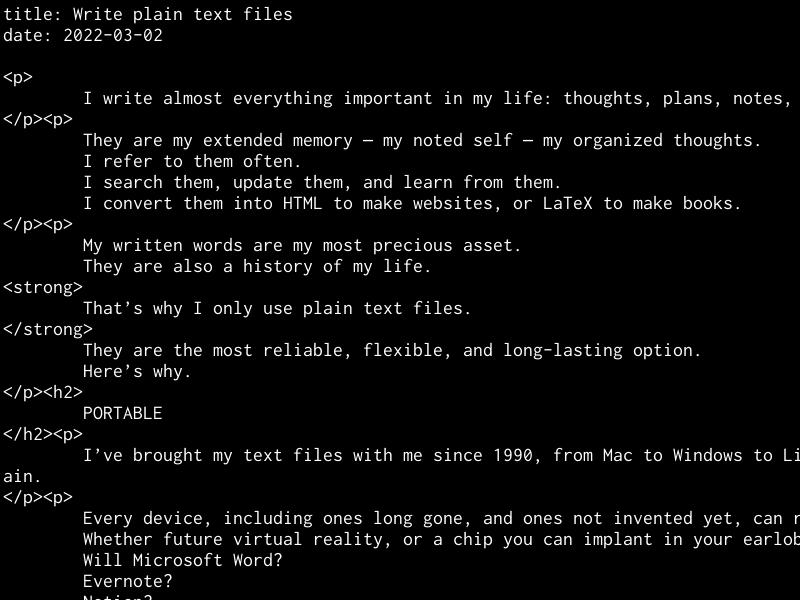

2022-03-02

I write almost everything important in my life: thoughts, plans, notes, diaries, correspondence, code, articles, and entire books.  

我几乎写下了我生活中所有重要的东西：思想、计划、笔记、日记、信件、代码、文章和整本书。

They are my extended memory — my noted self — my organized thoughts. I refer to them often. I search them, update them, and learn from them. I convert them into HTML to make websites, or LaTeX to make books.  

它们是我的扩展记忆--我注意到的自我--我有组织的思想。我经常参考它们。我搜索它们，更新它们，并从它们中学习。我把它们转换成HTML来做网站，或用LaTeX来做书。

My written words are my most precious asset. They are also a history of my life. **That’s why I only use plain text files.** They are the most reliable, flexible, and long-lasting option. Here’s why.  

我的书面文字是我最宝贵的资产。它们也是我生活的历史。这就是为什么我只使用纯文本文件。它们是最可靠、最灵活、最持久的选择。原因就在这里。

## PORTABLE  

携带方便

I’ve brought my text files with me since 1990, from Mac to Windows to Linux to BSD, from PCs to laptops to tablets to Android to iOS to a tiny device the size of my thumb, and back again.  

自1990年以来，我一直带着我的文本文件，从Mac到Windows到Linux到BSD，从PC到笔记本电脑到平板电脑到安卓到iOS到一个只有拇指大小的小设备，然后再回来。

**Every device, including ones long gone, and ones not invented yet, can read and edit plain text.** Whether future virtual reality, or a chip you can implant in your earlobe, plain text will be there. Will Microsoft Word? Evernote? Notion? Maybe. Maybe not.  

每一种设备，包括早已消失的设备，以及尚未发明的设备，都可以阅读和编辑纯文本。无论是未来的虚拟现实，还是你可以植入耳垂的芯片，纯文本都会存在。Microsoft Word会吗？Evernote？Notion？也许会。也许不会。

But plain text? Always. Everywhere.  

但是纯文本？总是如此。到处都是。

## UN-COMMERCIAL  

非商业性

Every few years a new company says you should use their special format. You have to pay them a monthly fee to use it — or keep all of your documents in their care. They offer some convenience or features, but at the cost of flexibility, portability, and independence.  

每隔几年就有一家新公司说你应该使用他们的特殊格式。你必须向他们支付月费才能使用它--或者把你的所有文件都交给他们保管。他们提供一些便利或功能，但代价是灵活性、便携性和独立性。

When you store your writing in one company’s unique format, then you need that program to access it. Then the economy takes a turn, they go out of business, and your work is trapped in an unusable format.  

当你以一家公司的独特格式存储你的写作时，那么你需要那个程序来访问它。然后经济出现转折，他们倒闭了，你的工作就被困在一个无法使用的格式中了。

**You will outlive these companies.** Your writing should outlive you. Depending on companies is not an option.  

你会比这些公司活得更久。你的写作应该比你长寿。依靠公司是不可取的。

Plain text is un-commercial. It removes you from the world of subscriptions and hype. There will always be plenty of free, non-commercial software in the public domain for reading and editing text files.  

纯文本是非商业性的。它将你从订阅和炒作的世界中移除。在公共领域永远有大量免费的、非商业的软件用于阅读和编辑文本文件。

## OFFLINE  

OFFLINE

There are places and times when you can’t get online. Don’t depend on any tool that needs an internet connection.  

有的地方和时间你不能上网。不要依赖任何需要互联网连接的工具。

**There are great benefits to being intentionally offline and unreachable, to focus.** It’s a super productivity boost. You need to be able to write, and have access to all your writing, during these times.  

故意离线和无法联系的情况下，有很大的好处，可以集中精力。这是一个超级生产力的提升。在这些时间里，你需要能够写作，并且能够接触到你所有的写作。

## NO DEPENDENCIES  

无依赖性

If you rely on Word, Evernote or Notion, for example, then you can’t work unless you have Word, Evernote, or Notion. **You are helpless without them.** You are dependent.  

例如，如果你依赖Word、Evernote或Notion，那么除非你有Word、Evernote或Notion，否则你就无法工作。没有它们，你就无能为力。你是依赖性的。

People tell me about more tools I could use in addition to my text files. But I don’t need or want anything else. **Plain text files and a basic text editor are enough. This is everything you need for great thinking and writing.** (A paper notebook and pencil are enough, too.)  

人们告诉我，除了我的文本文件之外，我还可以使用更多的工具。但我不需要也不想要其他东西。普通的文本文件和一个基本的文本编辑器就足够了。这就是你进行伟大的思考和写作所需要的一切。(一个纸质笔记本和铅笔也足够了）。

If you only use plain text, you can work on any device, forever. The less you depend on, the better. Peace and focus come when you stop looking for more.  

如果你只使用纯文本，你可以在任何设备上工作，永远。你依赖的东西越少越好。当你停止寻求更多时，和平和专注就会到来。

## EASIEST TO CONVERT  

最容易转换

Plain text can be converted into anything else.  

普通文本可以被转换成任何其他东西。

HTML, Markdown, JSON, LaTeX, and many other standard formats, are just plain text. I’ve written four books and four hundred blog posts in plain text.  

HTML、Markdown、JSON、LaTeX以及其他许多标准格式，都只是纯文本。我已经用纯文本写了四本书和四百篇博客文章。

You can make your own personal formats in your plain text files. Maybe in each diary entry, the first two lines are like:  

你可以在你的纯文本文件中制作你自己的个人格式。也许在每个日记条目中，前两行是这样的：

```
date: 2022-02-28
tags: where-to-live, kids, dog, anxious

```

Then it’s easy to use any little scripting language like Ruby, Python, or JavaScript to grab the date and tags, and use them for categorizing, sorting, renaming, archiving, or exporting.  

然后很容易使用任何小的脚本语言，如Ruby、Python或JavaScript来抓取日期和标签，并使用它们进行分类、排序、重命名、归档或导出。

Or if you don’t want to do it yourself, then it’s easy to find someone who can. Anyone who’s been programming for more than a week should be able to do it easily.  

或者如果你不想自己做，那么很容易找到可以做的人。任何从事过一周以上编程的人都应该能轻松做到这一点。

## NEED HIERARCHY?  

需要等级制度吗？

Use directories — also known as folders. These are also good for keeping your text together with other files like images and audio.  

使用目录--也被称为文件夹。这也有利于将你的文本与其他文件如图像和音频放在一起。

```
Documents/
Documents/Diary/
Documents/Diary/2022/
Documents/Diary/2022/2022-02-28.txt
Documents/Thoughts/
Documents/Thoughts/WhereToLive/
Documents/Thoughts/WhereToLive/2019-06-30.txt
Documents/Thoughts/WhereToLive/2020-01-18.txt
Documents/Ideas/
Documents/Ideas/MusicalChairs.txt
Documents/Ideas/NewHouse/
Documents/Ideas/NewHouse/Design/
Documents/Ideas/NewHouse/Design/entryway.jpg
Documents/Ideas/NewHouse/Design/roof.jpg
Documents/Ideas/NewHouse/Architect/
Documents/Ideas/NewHouse/Architect/JM_Lim.txt
Documents/Ideas/NewHouse/Architect/TPS_Inc.txt

```

## NEED VISUALS OR GRAPHICS?  

需要视觉效果或图形吗？

Need visual mind-mapping with circles and lines? Maybe you do. **But maybe you don’t.** Maybe it’s just another distraction, focusing on the tools instead of your thinking.  

需要用圆圈和线条进行视觉思维导图吗？也许你需要。但也许你不需要。也许这只是另一种分心，专注于工具而不是你的思考。

I love that plain text files have no formatting to tinker with. A tab key, SHIFT KEY, and vertical line breaks can go a long way, keeping you writing instead of formatting.  

我喜欢纯文本文件没有格式可言。一个TAB键、SHIFT键和垂直换行符可以发挥很大的作用，使你保持写作而不是格式化。

If you really need graphics, do your drawing using something else. Digital drawing into SVG files. Paper drawing, scanned into JPGs.  

如果你真的需要图形，就用别的东西做图。数字画成SVG文件。纸上绘画，扫描成JPG。

Formats that aren’t owned by any company. Formats that will outlast you.  

不属于任何公司的格式。将超越你的格式。

Keep your graphics files alongside your text files. But keep your text as plain text.  

把你的图形文件和你的文本文件放在一起。但保持你的文本为纯文本。

## CONCLUSION  

结论

Reliable, flexible, portable, independent, and long-lasting. Plain text files will be readable by future generations, hundreds of years from now.  

可靠、灵活、便携、独立、持久。普通文本文件在几百年后仍可被后代人阅读。

I especially enjoy the tranquility of their offline, non-commercial nature. They’re quiet. They’re focused. (As I aim to be.)  

我特别喜欢他们离线的、非商业性质的宁静。他们很安静。他们很专注。(正如我的目标一样）。


