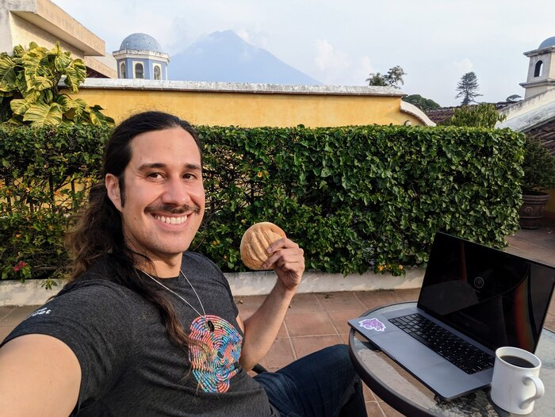
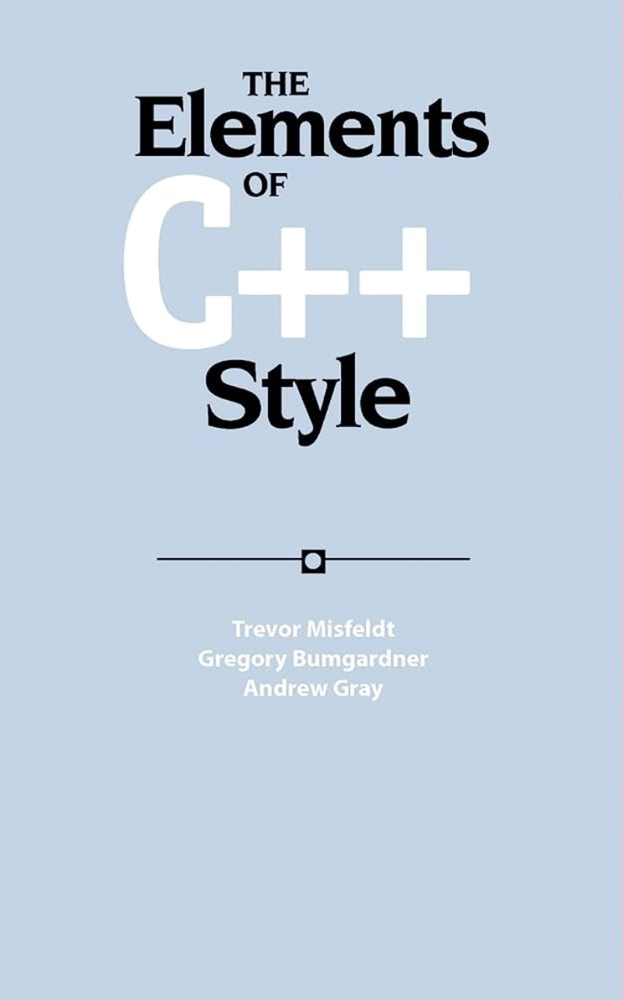
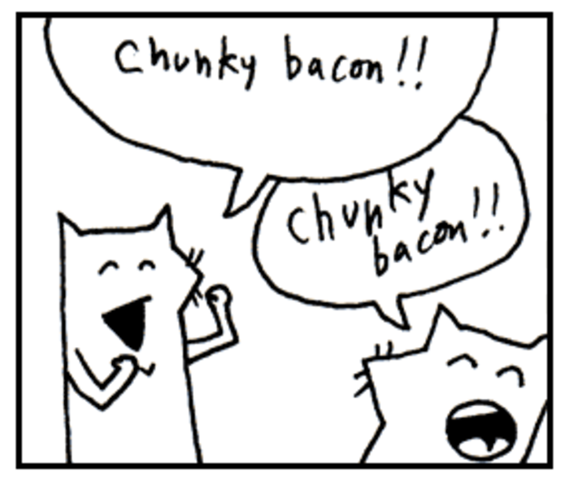
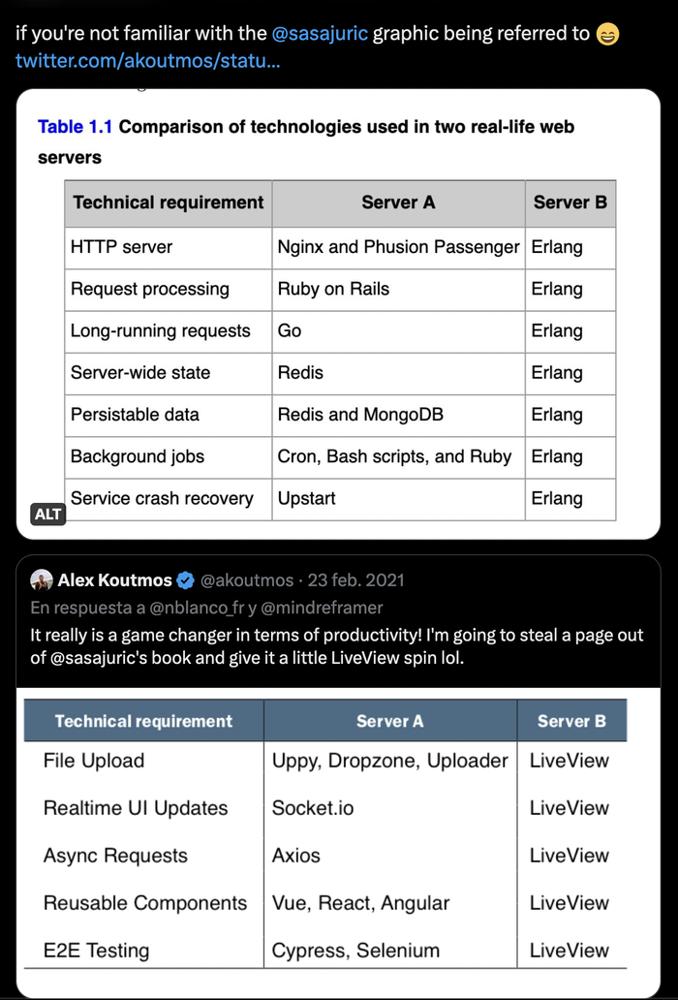

Tuesday, June 13, 2023 :: Tagged under: [engineering](https://morepablo.com/tags/engineering.html) [essay](https://morepablo.com/tags/essay.html). ⏰ 15 minutes.  

2023年6月13日，星期二 :: 标签： 工程论文。⏰15分钟。

🎵 _The song for this post is [Torn](https://www.youtube.com/watch?v=xSZBIs0gs0E), by Natalie Imbruglia._ 🎵  

这篇文章的歌曲是Natalie Imbruglia的Torn。🎵

On vacation, visiting Guatemala for the first time in ~5 years 😍 Finishing this post like dis.  

正在度假，5年来第一次访问危地马拉😍完成这个帖子，就像是在做梦。

What was behind the flames of [_Where have all the hackers gone?_](https://morepablo.com/2023/05/where-have-all-the-hackers-gone.html)? The biggest one I'm conscious of is [Kellan's _Software and its Discontents_ series](https://laughingmeme.org/2023/01/16/software-and-its-discontents-part-1.html). It's an excellent set of articles that try to provide answers to the question "why is everyone so miserable about software these days?"  

所有黑客都去哪儿了》的火焰背后是什么？我所意识到的最大的是凯兰的《软件及其不满》系列。这是一组优秀的文章，试图为 "为什么现在每个人都对软件如此痛苦 "的问题提供答案。

I really loved it, but I felt it didn't articulate the overarching narrative I observed behind all the glum feelings: _application software is no longer a game of "creatives" and "talents," it's now a "commodified sludge" version with a playbook on how to produce it._ This playbook describes a game that's a) not fun or motivating for most of the people involved, b) based on risk management (fear) rather than outcome maximization (hope), and c)… still doesn't seem to work, actually? But everyone yells at you and calls you immature or Not Serious if you deviate?  

我真的很喜欢它，但我觉得它没有阐明我观察到的所有阴郁情绪背后的总体叙事：应用软件不再是 "创造者 "和 "人才 "的游戏，它现在是一个 "商品化的污泥 "版本，有一本关于如何生产它的游戏手册。这本游戏手册描述了一个游戏：a）对大多数参与的人来说没有乐趣或动力，b）基于风险管理（恐惧）而不是结果最大化（希望），以及c）......实际上似乎还是没有用？但如果你偏离了，每个人都对你大喊大叫，说你不成熟或不认真？

The labor/hiring market was very slow to catch up to this, so for a while, remuneration and narrative were about creatives/hackers, but the work and outcomes were conservative and managerial. Software was Taylor Swift-priced but "uncredited studio musician"-outcomed.  

劳动力/雇佣市场对此反应非常缓慢，所以有一段时间，报酬和叙述都是关于创造者/黑客的，但工作和结果是保守的和管理的。软件的价格是泰勒-斯威夫特（Taylor Swift）的价格，但 "未被认可的工作室音乐家 "的结果。

For many people working in software, this gets incredibly demotivating, but also, of particular interest to me: when we overreact and play to a playbook too much, we prevent any Taylor Swifts from ascending, since we decide to work with mediocre tools and "lowest common denominator" teams. Getting back to "that magic feeling" comes from reaching for the ceiling and maximizing your people, rather than flattening them, as scary as that may be.  

对于许多从事软件工作的人来说，这令人难以置信地打击了他们的积极性，而且，我特别感兴趣的是：当我们反应过度，过多地按照游戏规则行事时，我们就会阻止任何泰勒-斯威夫特的上升，因为我们决定用平庸的工具和 "最低标准 "的团队工作。回到 "那种神奇的感觉 "来自于达到天花板和最大化你的人，而不是把他们压扁，尽管这可能是可怕的。

This post describes what I mean by a "creative"/"talents" industry, argues that moving away from this model made software more miserable for everybody, and that maybe we need to reconsider the playbook that represents that move, at least in part.  

这篇文章描述了我所说的 "创意"/"人才 "产业的含义，认为摆脱这种模式使软件对每个人来说都更加悲惨，也许我们需要重新考虑代表这一举措的游戏规则，至少是部分规则。

In 2009, I bought this book, because when you walked into a codebase, it had a style. You had something of a "code handwriting." Now we have [black](https://black.readthedocs.io/en/stable/) and [gofmt](https://pkg.go.dev/cmd/gofmt).  

2009年，我买了这本书，因为当你走进一个代码库时，它有一种风格。你有一些 "代码手写体"。现在我们有了黑色和gofmt。

## "Do they have "the juice""?!  

"他们有 "果汁 "吗？

Something you see a lot in these industries: scouts and producers looking for talent that delivers, and using their "gut" to find it, because it's not obvious on inspection what's going to work. These industries are… colorful. An example is entertainment: if you were a music executive who wanted to cash in on grunge in the 90's, you could try to create a _new_ grunge band with professional musicians, or you could have talent scouts finding teenagers in garages.  

在这些行业中，你会看到很多东西：星探和制片人在寻找能够提供的人才，并利用他们的 "直觉 "来寻找，因为在检查时并不明显，什么会成功。这些行业是......丰富多彩的。一个例子是娱乐业：如果你是一个音乐主管，想在90年代的grunge乐队中赚钱，你可以尝试用专业的音乐家创建一个新的grunge乐队，或者你可以让星探在车库里寻找青少年。

One of these is strictly the better option: _there's no formula to create successful grunge;_ some bands have "the juice" that resonated with disaffected White teens who bought CDs en masse, and others can technically play the instruments and say the words, but it's missing that magic, and the teens reject it. So like shrimping boats, most successful grunge bands (like most other "youth culture whisperers" in entertainment) weren't farmed and harvested, they were wild-caught.  

严格来说，其中一个是更好的选择：创造成功的grunge乐队没有公式；一些乐队有 "果汁"，引起了心怀不满的白人青少年的共鸣，他们集体购买了CD，而另一些乐队在技术上可以演奏乐器和说出这些话，但它缺少那种魔力，青少年拒绝它。因此，就像捕虾船一样，大多数成功的grunge乐队（就像娱乐业中其他大多数 "青年文化耳语者 "一样）不是被养殖和收获的，他们是被野生捕捞的。

Here's a clip from [one of the most famous Reply-All episodes,](https://gimletmedia.com/shows/reply-all/o2h8bx) where a musician gets a meeting with a major record executive who heard his demo. I recommend giving it a listen but I'll put the transcript in the summary tab if you're just skimming. Consider the lifestyles and values of the various people involved, what "work" looks like to them, and how funny it is that these two men even met and could be collaborators:  

这里有一个最著名的 "回复 "节目的片段，一个音乐家得到了与一个听过他的小样的主要唱片主管的会面。我建议你听一听，但如果你只是略读，我会把文字记录放在摘要标签里。考虑一下不同人的生活方式和价值观，"工作 "对他们来说是什么样子，以及这两个人竟然相遇并能成为合作者是多么有趣：

Your browser does not support the `audio`element  

您的浏览器不支持 `audio` 元素

Transcript of audio file  

音频文件的文字记录

> PJ: so i was very surprised to learn that Evan actually made this song completely alone. And once he was done he sent it to this company that would print CDs for you. And when he would play shows locally, he would just give the CDs out for free.  
> 
> PJ：所以我非常惊讶地得知，埃文真的做了这首歌 完全独立。一旦他完成了，他就把它送到这家公司，这家公司将 为你打印CD。当他在当地演出时，他就会给 免费发放CD。
> 
> ALEX: Ok.  
> 
> ALEX：好的。
> 
> PJ: The thing that happened next is the part that just feels like the embarrassing dream that every musician has that they don’t tell anybody. Which is, out of the blue, he gets a phone call from this guy who says, “Hey, I work for Universal Music \[Alex: Oh wow\], the largest music label in the world” \[Alex: Uh huh\]. They send a Lincoln town car to his house.  
> 
> PJ：接下来发生的事情就是感觉到的部分。 每个音乐家都有一个尴尬的梦想，但他们没有告诉任何人。其中 是，他突然接到一个电话，这个人说："嘿，我的工作是什么？ 为环球音乐\[Alex: Oh wow\]，世界上最大的音乐公司" \[亚历克斯：嗯哼\]。他们派了一辆林肯轿车去他家。
> 
> Evan: First of all, I live in Greensboro North Carolina, it's like a medium sized town, it's not a big town, but they send this town car, this really nice town car with this driver. Really cool guy, just telling me stories and talkin up a storm and so I get to the, I get to the plane and I’m in first class, and then I get off the plane and you know how people hold up signs with your name on ‘em you know?  
> 
> 埃文：首先，我住在北卡罗来纳州的格林斯博罗，它就像一个媒介。 这不是一个大镇子，但他们派了这辆镇上的车，这辆非常漂亮的车。 与这位司机一起在城市汽车上工作。他真的很酷，只是给我讲故事和谈话。 所以我到了，我到了飞机上，我在头等舱，然后 然后我下了飞机，你知道人们会举着写有你名字的牌子。 在他们身上，你知道吗？
> 
> PJ: No one has ever done that for me.  
> 
> PJ：从来没有人为我做过这些。
> 
> EVAN: There’s a guy with a sign with my name on it and he takes me to the hotel, and I get into this big huge suite and you know, how do you, how do you absorb that kind of experience I dunno.  
> 
> 有一个人举着写有我名字的牌子，他把我带到了 酒店，我进了这个巨大的套房，你知道，你怎么，你怎么 吸收这种经验，我不知道。
> 
> PJ: Evan says he kept thinking, “This song is really quirky, are they sure it’s gonna be a hit?” But it didn’t matter, the whole thing was like a fever dream. He gets whisked into this meeting with Doug Morris, legendary label exec at the time, he ran Universal Music.  
> 
> PJ: Evan说他一直在想，"这首歌真的很古怪，他们确定吗？ 它将成为一个热点？"但这并不重要，整个事情就像发烧一样 梦想。他被带入与道格-莫里斯的会议，传奇性的标签 当时，他负责环球音乐。
> 
> EVAN: I walked in there and he says you like ice cream? And I said yea I love ice cream and then he said something into this monitor on his desk \[PJ: What?\] and then this beautiful like 6 foot tall ... I guess it was his secretary I dunno, but she comes out with this tray of ice cream, no check this out, like coconut amazing like coconut flavored ice cream that’s like organic coconut flavored ice cream in martini glasses. And I, and I sit there and I eat ice cream with Doug Morris and there’s a rapper called Juvenile?  
> 
> 我走进去，他说你喜欢吃冰淇淋吗？我说是的，我喜欢 冰淇淋，然后他对着桌上的这个显示器说了些什么 \[PJ: 什么？］ 然后这个美丽的像6英尺高的...。我想这是他的秘书，我 不知道，但她带着这盘冰激凌出来了，不，看看这个，就像 椰子惊人的像椰子味的冰激凌，就像有机椰子一样。 在马提尼杯中的口味冰淇淋。而我，我坐在那里，吃着冰块 有道格-莫里斯的奶油，还有一个叫Juvenile的说唱歌手？
> 
> PJ: Yeah I know Juvenile.  
> 
> PJ：是的，我知道Juvenile。
> 
> EVAN: And he had a song called ‘Back That Azz Up’?  
> 
> 他有一首歌叫《Back That Azz Up》？
> 
> PJ: Yeah I know ‘Back That Azz Up’.  
> 
> PJ：是的，我知道 "Back That Azz Up"。
> 
> EVAN: First time I was in Doug Morris’s office, he played me that song.  
> 
> 我第一次去道格-莫里斯的办公室时，他给我放了那首歌。
> 
> \[JUVENILE SONG PLAYS\]  
> 
> \[少年歌声响起\]
> 
> EVAN: I thought, wow this makes my song look really stupid. It was just funny cause Doug Morris was at that time was probably in his 60s and he was really digging this song.  
> 
> 我想，哇，这让我的歌看起来非常愚蠢。它只是很有趣 因为道格-莫里斯当时可能已经60多岁了，他真的是 挖掘这首歌。
> 
> EVAN: And next thing I know I was signing a record contract-- it all kinda happened so fast. It was really unbelievable.  
> 
> 接下来，我知道我签署了一份唱片合同--这一切都有点 发生得如此之快。这真的是令人难以置信。

The point is: **software was more like _that_.** Getting flown as an undergrad to SF in 2009 for an interview at Facebook, put in a hotel, served free food, all because you could code? You felt _cool_, especially if you'd spent the last two years in libraries hacking up side projects, but also: you were dazed and confused by whatever machine was spending that much money just to see if you had the magic they needed.  

重点是：软件更像那样。2009年，作为一个本科生被飞到三藩市参加Facebook的面试，被安排在一个酒店，提供免费食物，所有这些都是因为你会编程？你感觉很酷，特别是如果你在过去的两年里在图书馆里砍掉了一些辅助项目，但同时：你也被那些花了那么多钱只为看你是否有他们所需要的魔力的机器弄得晕头转向，不知所措。

Here are the ingredients for a talents/creatives industry:  

以下是人才/创意产业的要素：

-   **It needs to be very valuable,** like professional athletes, musicians, movie stars. Winning big needs to mean winning **big.**  
    
    它需要非常有价值，像职业运动员、音乐家、电影明星一样。大赢家需要意味着大获全胜。
    
-   **It must be hard or impossible to replicate success "synthetically."** We even have a show meant to farm pop stars (_American Idol_) and while many contestants had some kind of career in music, it's really only produced one major pop star (Kelly Clarkson, the very first winner). An industry like this must have some degree of mystery of who's got "the juice."  
    
    要想 "综合 "复制成功，肯定很难或不可能。我们甚至有一个旨在培养流行明星的节目（美国偶像），虽然许多参赛者有某种音乐生涯，但它实际上只产生了一个主要的流行明星（凯莉-克拉克森，第一个冠军）。像这样的行业必须有某种程度的神秘感，谁有 "果汁"。
    
-   **"The juice"… has actually got to matter.** Here's where I think tech went wrong: there needs to be an actual force multiplier to having that ineffable talent. Kendrick Lamar being Kendrick Lamar needs to actually produce a Kendrick Lamar-sized result. I think tech really convinced ourselves that if we wrote Lisp like Paul Graham we could Smart Person our way into riches, but it turns out it's much easier to convince yourself you're a tech genius who innovates than actually _be_ a tech genius who innovates. Very, very few companies actually made profits investing in tech with genius hackers: for most, the path of less resistance was to adopt the brand and sheen of "tech company," make Engineering a cost center, and play finance instead.  
    
    "果汁"......实际上已经很重要了。这就是我认为科技界出错的地方：拥有这种不可言喻的天赋，需要有一个实际的力量倍增器。肯德里克-拉马尔是肯德里克-拉马尔，需要真正产生一个肯德里克-拉马尔大小的结果。我认为科技界真的相信我们自己，如果我们像保罗-格雷厄姆那样写Lisp，我们就可以通过聪明人的方式致富，但事实证明，说服自己是一个创新的科技天才要比真正成为一个创新的科技天才容易得多。很少有公司真正通过天才黑客的技术投资获得利润：对大多数公司来说，阻力较小的途径是采用 "技术公司 "的品牌和光泽，使工程成为成本中心，而不是玩金融。
    

Remember when we wrote programming language books like this? For the young'uns, this is from [_\_why's poignant guide to ruby_](https://poignant.guide/). Also, remember when a weird Danish racecar enthusiast took a language from 1995 to write a framework and people… welcomed it?  

还记得我们什么时候写过这样的编程语言书吗？对于年轻人来说，这是来自\_why的ruby凄美指南。另外，还记得当一个奇怪的丹麦赛车爱好者用1995年的语言来写一个框架时，人们......欢迎它？

## Okay, but why bring this up?  

好吧，但为什么要提出这个问题？

Because while there's nothing _wrong_ with the analysis in _Software and its Discontents_, I think much of its diagnoses are mitigated by teams that embrace the narrative (and build a reality of) "being in an industry of creatives." That said, he and I will likely never see eye-to-eye on this because [he more-or-less invented _Choose Boring Technology_](https://mcfunley.com/choose-boring-technology), and most of what _I_ advocate is [to break playbook, embrace narrative, and be interesting.](https://morepablo.com/2022/04/against-boring.html)<a href="https://morepablo.com/2023/06/creatives-industries.html#footnote1">1</a>  

因为虽然《软件和它的不满》中的分析没有错，但我认为它的大部分诊断被那些接受 "身处一个由创造者组成的行业 "的叙述（并建立一个现实）的团队所缓解。也就是说，我和他可能永远不会在这个问题上意见一致，因为他或多或少发明了 "选择无聊技术"，而我所倡导的大部分是打破游戏规则，接受叙事，并变得有趣。 <a href="https://morepablo.com/2023/06/creatives-industries.html#footnote1">1</a>

He brings up four major bullet points in his essays:  

他在文章中提出了四个主要的要点：

> -   an explosion in the complexity of software development  
>     
>     软件开发的复杂性激增
> -   tech talent becoming significantly more expensive  
>     
>     科技人才的价格明显提高
> -   success becoming more elusive than ever, with startups having “lost that magic feeling”  
>     
>     成功变得比以往更加难以捉摸，初创企业 "失去了那种神奇的感觉"
> -   conflicts over changing expectations of the work environment  
>     
>     因对工作环境的期望值变化而产生的冲突

Let's tackle these. If you get the "creative industry" mindset, you can operate out of the worst of them.  

让我们来解决这些问题。如果你有了 "创意产业 "的心态，你就可以在其中最糟糕的情况下操作。

### tech talent becoming significantly more expensive  

科技人才的价格明显提高

First: _hire fewer people._ If you aren't feeling desperately, desperately constrained, don't hire. At around the 5-7 year mark engineers start smugly saying "it's best to write no code at all! Every line is expensive and must be maintained," and while that's absolutely true I want you to imagine a new hire as _at least as operationally expensive_ to your Eng org as a 200k line service.  

第一：少雇人。如果你没有感到极度、极度的紧张，就不要雇用。在大约5-7年的时候，工程师们开始自鸣得意地说："最好不要写任何代码！每一行都很昂贵，而且必须维护！每一行都很贵，而且必须要维护。"虽然这绝对是事实，但我希望你能想象一下，对你的Eng组织来说，一个新员工的运营成本至少与一个20万行的服务一样高。

[When WhatsApp was acquired by Facebook, they had 35 engineers.](https://www.wired.com/2015/09/whatsapp-serves-900-million-users-50-engineers/) They were able to do this in part because they didn't "follow playbook," and while you probably can't go _that_ extreme, per the creative industries point: do you think SNL would be improved if they had 400 more writers? If HBO added 15 showrunners to _Game of Thrones_?  

当WhatsApp被Facebook收购时，他们有35名工程师。他们能够做到这一点，部分原因是他们没有 "遵循游戏规则"，虽然你可能不能那么极端，但根据创意产业的观点：你认为如果SNL多了400个编剧，他们会得到改善吗？如果HBO为《权力的游戏》增加15个节目主持人？

Teams are an immutable data structure: when you change them, you get a new one. Adding too many people, too quickly, adds links to the game of Telephone that is every conversation your company already has. If people are introduced to a company without enough seasoned mentors, and without its culture and vision established, they add process and produce documents because it feels like productive work. Your customer doesn't care about any of those things.  

团队是一个不可改变的数据结构：当你改变他们时，你会得到一个新的团队。增加太多的人，太快了，会给你公司已经进行的每一次对话的电话游戏增加链接。如果人们被介绍到一个没有足够经验丰富的导师的公司，并且没有建立其文化和愿景，他们就会增加流程和制作文件，因为这感觉像是富有成效的工作。你的客户并不关心任何这些事情。

The example I give is the ecosystem of a pond: imagine it's got turtles and fish and bacteria and algae. That's your company's culture. If you add 5% of its volume in water from a different pond (with different bacteria, fish, algae), the resulting pond over a few weeks is pretty much the first pond but with more water. But if you ever add 40% of its volume in water, the new pond's fauna may win out, and the resulting pond may be unrecognizable.  

我举的例子是一个池塘的生态系统：想象它有乌龟、鱼、细菌和藻类。这就是你们公司的文化。如果你从一个不同的池塘（有不同的细菌、鱼和藻类）中加入5%的水，几周后形成的池塘就和第一个池塘差不多，但水更多。但是，如果你加入40%的水，新池塘的动物群可能会胜出，结果池塘可能无法辨认。

Hire _carefully_, but moreover: hire as slowly as you can manage. Bonus, this also works well with being _extremely_ selective about who you hire.  

谨慎地雇用，但更重要的是：在你能管理的范围内尽可能慢地雇用。额外的是，这也是对你所雇用的人非常有选择性的好办法。

(I recognize that one of the reasons we all hired so much was investor pressure. If you're leadership at a company, your daily dashboard includes cash-on-hand, and the investors don't want that cash back: they want "cash go down, stock price go up," and you needed to make that happen by the next board meeting. In the 0% era, one way you made that happen was hiring expensive engineers.)  

(我认识到，我们都雇用了这么多的原因之一是投资者的压力。如果你是一个公司的领导，你的日常仪表盘包括手头的现金，而投资者不希望这些现金回来：他们希望 "现金减少，股价上升"，而你需要在下一次董事会上实现这一目标。在0%的时代，你实现这一目标的方法之一是雇用昂贵的工程师）。

Other "pretend we're a creative industry" things you can do is break playbook:  

其他 "假装我们是一个创意产业 "的事情，你可以做的是打破游戏规则：

-   Consider colocating servers instead of cloud. Squarespace did it, Twitter did it, Basecamp is doing it, Stack Exchange does it. It's not only possible but often way, way cheaper.  
    
    考虑将服务器放在一起而不是云端。Squarespace这样做了，Twitter也这样做了，Basecamp也在这样做，Stack Exchange也在这样做。这不仅是可能的，而且往往是非常非常便宜的。
    
-   Hell, even consider a "pets, not cattle" model while you get started. Don't get trapped into creating a shitty version of Heroku _and_ your product.  
    
    该死的，在你开始的时候甚至可以考虑 "宠物而不是牛 "的模式。不要被困在创建一个低劣的Heroku和你的产品的版本中。
    
-   Consider stateful deploys, at least as another layer on top of stateless. If you've got a Docker-based flow that `git clone`s from a fresh base image, consider hosting a persistent build server that `git pull`s. Fred Hebert talks about how companies he's worked for [_lost_ functionality and flexibility that they never recovered](https://ferd.ca/a-pipeline-made-of-airbags.html) (ditto) in the name of removing stateful deploys and moving from BEAM to Go + Docker ("following playbook, Choosing Boring").  
    
    考虑有状态的部署，至少作为无状态之上的另一层。如果你有一个基于Docker的流程， `git clone` ，考虑托管一个持久的构建服务器， `git pull` 。Fred Hebert谈到他工作过的公司如何在取消有状态部署和从BEAM转移到Go + Docker（"遵循游戏规则，选择无聊"）的名义下失去功能和灵活性，他们再也没有恢复过来（同上）。
    

Each of these can be their own blog post, with lots of caveats and supporting evidence. But I'm feeling this get pretty long already, so I'll jet through the rest.  

这些都可以成为自己的博文，有很多注意事项和支持性证据。但我觉得这篇文章已经很长了，所以我就把剩下的内容喷一下。

### "an explosion in the complexity of software development"  

"软件开发的复杂性爆炸"

[I hate the word complexity](https://twitter.com/tef_ebooks/status/1195706438645141504). As an industry we don't share a definition, it usually means "shit that I don't like." Luckily Kellan offers some precision:  

我讨厌复杂这个词。作为一个行业，我们没有一个共同的定义，它通常意味着 "我不喜欢的狗屎"。幸运的是，凯兰提供了一些精确性：

> In both systems thinking and software the term "complex" is a technical one. It refers to the number of distinct parts in a system, and the connections between them. Complex systems are characterized by nonlinearity, randomness, emergence, and surprise. Complexity is why communication and coordination dominate all other costs when it comes to building software.  
> 
> 在系统思维和软件中，"复杂 "一词是一个技术术语。它指的是一个系统中不同部分的数量，以及它们之间的联系。复杂系统的特点是非线性、随机性、突发性和意外性。复杂性是为什么在构建软件时，沟通和协调会主导所有其他成本。

Did you notice that the examples from the previous point also removed links between things? People, an entire infra stack, and the idea that when you want a cake you should build and maintain a full-on bakery. All gone!  

你是否注意到，上一点的例子也删除了事物之间的联系？人，整个信息栈，以及当你想要一个蛋糕时，你应该建立和维护一个完整的面包店的想法。所有这些都消失了!

But it doesn't have to end there. Breaking playbook, be a little creative:  

但它不一定要到此为止。打破游戏规则，要有一点创意：

-   Does every company need a full team of FTEs to support a React client, that's SSR-ed with extra infra for "hydration" + more engineering built into its build system and `node_modules` folder than the entire Flash Runtime had? Consider [htmx,](https://htmx.org/) or server-side templates, or [LiveView.](https://hexdocs.pm/phoenix_live_view/Phoenix.LiveView.html)  
    
    是否每家公司都需要一个完整的全职团队来支持React客户端，该客户端经过SSR处理，具有额外的 "水化 "功能，而且其构建系统和 `node_modules` 文件夹中的工程量比整个Flash Runtime还多？考虑一下htmx，或服务器端模板，或LiveView。
    
-   Do you really need microservices? Kubernetes? Terraform? Pretend it's 2011 again and deploy JARs or binaries, keep and maintain a monolith. Dropbox, YouTube, Instagram, Facebook Blue App, Shopify… all (mostly) monoliths, all (mostly) pre-date the Misery Era.  
    
    你真的需要微服务吗？Kubernetes？Terraform？假设现在又是2011年，部署JARs或二进制文件，保持和维护一个单体。Dropbox、YouTube、Instagram、Facebook Blue App、Shopify......都是（大部分）单体，都（大部分）早于悲惨时代。
    
-   Can you use technology that has better scaling properties than Ruby, Python, or Node? I can write more about these, but talk to any eng who's worked on giant codebases in these stacks, bad things happen that don't happen in, say, the JVM. I said [in another blog post](https://engineering.ramp.com/elixir-at-ramp): "you've created an environment that's optimized for your founding engineers to build something quickly in the first 7 months, but the price is a set of recurring obstacles which your engineers will pay down over the next 7 years."  
    
    你能使用比Ruby、Python或Node具有更好扩展性的技术吗？我可以写更多关于这些的内容，但是和任何一个在这些堆栈中工作过的巨型代码库的工程师交谈，坏事会发生，而在JVM中则不会发生。我在另一篇博文中说："你创造了一个优化的环境，使你的创始工程师能够在头7个月快速建立一些东西，但代价是一系列经常性的障碍，你的工程师将在未来7年内支付这些障碍。"
    

Part of why I'm so damn bullish on the BEAM and LiveView is precisely because you remove so many links and connections. It has a learning curve but if you study a bit, it's incredibly powerful how much you have available to you.  

我如此看好BEAM和LiveView的部分原因正是因为你删除了这么多的链接和连接。它有一个学习曲线，但如果你学习一下，你有多少可用的东西，就会有令人难以置信的力量。

### "success becoming more elusive than ever, with startups having "lost that magic feeling""  

"成功变得比以往更加难以捉摸，初创企业已经 "失去了那种神奇的感觉"

All my suggestions above radically reduce costs of developing software, which hopefully leads to some increased version of success.  

我上面的所有建议都从根本上降低了开发软件的成本，希望这能导致一些成功版本的增加。

Additionally, the talent you'll acquire to paint outside the lines here will both be more inspired, and inspire others on the team. A favorite article of Ramp CEO Eric Glyman's is [Amp it Up!](https://www.linkedin.com/pulse/amp-up-frank-slootman/), which contains a lot of ideas, but a core one: keep the energy high! Someone on a team of 50 really inspiring engineers who own the whole product and stack, WhatsApp-style, are going to perform better (and be a lot happier) than someone on a team of 50 React devs who owns 3 pages.  

此外，你将获得的人才在这里进行线外绘画，既能获得更多的灵感，又能激励团队中的其他人。Ramp首席执行官Eric Glyman最喜欢的一篇文章是《Amp it Up！》，其中包含了很多想法，但有一个核心的想法：保持高能量在一个由50名真正有灵感的工程师组成的团队中，有人拥有整个产品和堆栈，WhatsApp式的，会比在一个由50名React开发人员组成的团队中拥有3个页面的人表现得更好（而且更快乐）。

Tech won't be the reason your business wins, but it _can_ help create that high-energy, high-motivation environment, which will strongly up your chances.  

技术不会是你的企业获胜的原因，但它可以帮助创造高能量、高激励的环境，这将有力地提高你的机会。

___

I'll end with a question I don't have the answer to: is the application software industry "irreducibly creative?" By that I mean: _can_ it ever produce a set of "established solutions" that are cost-effective?  

我将以一个我没有答案的问题来结束：应用软件行业是否 "具有不可复制的创造性"？我的意思是：它能否产生一套具有成本效益的 "既定解决方案"？

I'll say some industries cannot reliably be made into a cost-effective sludge factory: you must catch wild, and you can't produce "the goods" reliably and synthetically. I gave the example of grunge music, but a more favorite example is the content wars of HBO, Disney, and Netflix.  

我要说的是，有些行业不能可靠地被做成具有成本效益的淤泥工厂：你必须抓狂，你不能可靠地、综合地生产 "货物"。我举了grunge音乐的例子，但更喜欢的例子是HBO、迪士尼和Netflix的内容大战。

See, HBO and Disney have been kings of content for _decades._ They have pipelines for producing quality content people love. They know that you gotta pay a bunch of desperate weirdos in LA and take strange bets based on gutfeel. In [this story about HBO, look how close they were to losing the biggest show in television for a decade,](https://www.wnycstudios.org/podcasts/otm/episodes/its-not-tv-its) shepherded by a person they were _firing_:  

看，HBO和迪士尼几十年来一直是内容之王。他们有制作人们喜爱的优质内容的管道。他们知道，你必须向洛杉矶的一群绝望的怪人付钱，并根据直觉进行奇怪的赌注。在这个关于HBO的故事中，看看他们是如何接近失去十年来电视中最大的节目的，这个节目是由他们正在解雇的人主持的：

> Carolyn Strauss is among them. Despite coming up with hit after hit for HBO, in 2008 she was shown the door. In her telling, it was because she passed on one show, which was Mad Men. And as a result, months later, she was fired. And on the way out, she's like, 'There's one show I'm developing that I want to keep my hands on. It's the dragon show.' And they're like, 'You want that? Sure. I'm sure we'll make that.' And they did. And Carolyn Strauss is a top producer of HBO's most successful drama of all time, Game of Thrones.  
> 
> 卡罗琳-施特劳斯就是其中之一。尽管她为HBO创作了一部又一部的作品，但在2008年，她被踢出了门。在她看来，这是因为她放弃了一个节目，也就是《广告狂人》。结果，几个月后，她被解雇了。在离开的时候，她说："有一个我正在开发的节目，我想保留我的手。这是龙的节目。他们就说，'你想要那个？当然，我相信我们会做这个。然后他们就做了。而卡罗琳-施特劳斯是HBO有史以来最成功的电视剧《权力的游戏》的顶级制片人。

_These are very human processes._ Netflix was a newcomer, and tech-first, so when they got into original programming, they tried to data their way out of it. "Data says new subscribers fall off after two seasons, [shows will only have two seasons"](https://www.wired.com/story/why-netflix-keeps-canceling-shows-after-just-2-seasons/) (bonus, it's easier to exploit LA entertainment workers like this).  

这些都是非常人性化的过程。Netflix是一个新来者，而且是技术第一，所以当他们进入原创节目时，他们试图用数据来解决这个问题。"数据显示，新用户在两季后就会减少，节目只会有两季"（奖金，这样剥削洛杉矶娱乐工作者更容易）。

And they're losing the bet. Turns out people want Marvel movies, _Andor_, and _The Rehearsal_ more than they want [a $200m movie with hit stars nobody watched](https://en.wikipedia.org/wiki/Red_Notice_(film)) or [a clumsy Will Smith racism allegory](https://en.wikipedia.org/wiki/Bright_(film)).  

而他们正在输掉这场赌局。事实证明，人们更需要漫威电影、安道尔和《排练》，而不是一部2亿美元的电影，其中的热门明星没有人看，或者是一个笨拙的威尔-史密斯种族主义寓言。

(Anecdotally, I have a friend who worked in Disney Animation during _Frozen_, and she said offhandedly that many of them were convinced it was going to be a dud. You can't predict success in this game)  

(Anecdotally, I have a friend who worked in Disney Animation during Frozen, and she said offhandedly that many of them were convinced it was going to be a dud.在这个游戏中，你无法预测成功与否)

So some industries don't "sludge." There comes a point where the humans gotta human. I wonder to what degree software is? Probably more than entertainment, since it was easier for entertainers to sludge into a streaming service than it was for a streaming service to sludge into entertainment. But I don't think it's as deterministic as our "playbook" is sold as.  

所以有些行业并不 "泥沙俱下"。有一个点，那就是人类必须是人类。我想知道软件在什么程度上是这样？可能比娱乐业更多，因为娱乐业者融入流媒体服务比流媒体服务融入娱乐业更容易。但我不认为它像我们的 "游戏手册 "所卖的那样是决定性的。

___

1. [**^**](https://morepablo.com/2023/06/creatives-industries.html#place1) In his (and my) defense, the tenets of _Choose Boring Technology_ (when [you read the articles](https://boringtechnology.club/)) have the disclaimers and asterisks that make it pretty unimpeachable. It should be understood as an argument against a certain type of "novelty-driven development." It never explicitly says "popularity is worth suspending your Engineering sensibilities," and in Kellan's _Discontents_ post, he writes "As an engineering leader raising the quality of technical decision making is arguably your most important job after building the team itself." So I don't think he _wants_ people saying "Choose Boring Technology!" to mean "we'll use Kubernetes and microservices because everyone else is using it" for a pre-launch B2B.  

1.^ 在他（和我）的辩护中，《选择无聊技术》的信条（当你阅读文章时）有免责声明和星号，使其相当无可指责。它应该被理解为反对某种类型的 "新颖性驱动的发展 "的论点。它从来没有明确说过 "流行值得暂停你的工程感"，在Kellan的《不满》一文中，他写道 "作为一个工程领导提高技术决策的质量可以说是你在建立团队本身之后最重要的工作"。因此，我认为他不希望人们说 "选择无聊的技术！"是指 "我们将使用Kubernetes和微服务，因为其他人都在使用它 "的预启动B2B。

Similarly, please read my posts with the same understanding. I add a million similar disclaimers on the bottom of [my "Against Boring" post](https://morepablo.com/2022/04/against-boring.html) for similar reasons. Choose Boring was a reaction to a real problem.  

同样地，请以同样的理解来阅读我的帖子。我在 "反对无聊 "的帖子底部添加了无数类似的免责声明，原因类似。选择无聊》是对一个真实问题的反应。

I keep saying the point of these posts is to emphasize that the tech has to matter. To use the framework of the last post, we should consider soil _in addition_ to atmosphere, and based on his quote on technical decisions, I think he'd agree! Unfortunately, I don't think that's how most tech leaders use "Boring."  

我一直说这些帖子的重点是强调技术必须是重要的。用上一篇文章的框架来说，除了大气，我们还应该考虑土壤，根据他对技术决策的引用，我想他会同意的！"！不幸的是，我不认为大多数技术领导人是这样使用 "无聊 "的。

**Thanks for the read!** Disagreed? _Violent agreement!?_ Feel free to join my mailing list, drop me a line at [pablo@morepablo.com](mailto:pablo@morepablo.com), or leave a comment below! I'd love to hear from you 😄  

谢谢你的阅读!不同意？暴力的同意！？欢迎加入我的邮件列表，给我留言：pablo@morepablo.com，或在下面留言!我很想听到你的意见😄
