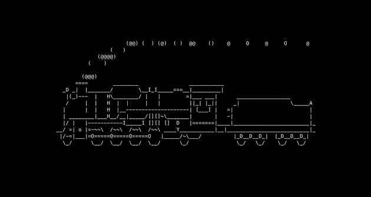
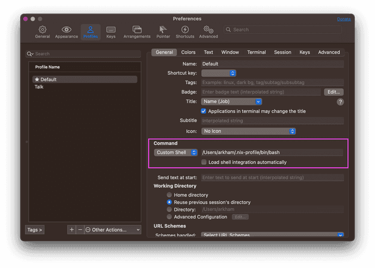

I have four machines I often use:  

我有四台经常使用的机器：

-   a 2022 M1 Macbook, my work laptop  
    
    2022 M1 Macbook，我的工作笔记本电脑
-   a 2017 Intel Macbook, my personal laptop  
    
    2017 年英特尔 Macbook，我的个人笔记本电脑
-   a 2011 iMac, my… music player
-   a Raspberry Pi 3, my [ad blocker](https://pi-hole.net/)  
    
    树莓派 3、我的广告拦截器

I’d like to have the same development environment on all of these machines, mostly for my bash, git, vim, and tmux configs. I’d also like to be able to use all the nice little utilities I’m used to, such as:  

我希望在所有这些机器上都有相同的开发环境，主要用于我的 bash、git、vim 和 tmux 配置。我还希望能使用我习惯的所有实用工具，例如

-   [fzf](https://github.com/junegunn/fzf) to fuzzy search _everything_  
    
    fzf 对所有内容进行模糊搜索
-   [exa](https://github.com/ogham/exa) as a replacement for `ls`  
    
    exa 代替 `ls`
-   [ripgrep](https://github.com/BurntSushi/ripgrep) to search for stuff  
    
    ripgrep 用于搜索
-   [zoxide](https://github.com/ajeetdsouza/zoxide) as a smarter `cd`  
    
    更聪明的氧化亚氮 `cd`
-   [delta](https://github.com/dandavison/delta) for viewing diffs  
    
    用于查看差异的 delta

As many of us do, I used to have a repo with a scrappy script that would symlink all my configuration files and install a list of packages via homebrew or apt.  

和我们很多人一样，我以前也有一个装有杂乱无章脚本的软件仓库，该脚本会将我的所有配置文件进行符号链接，并通过 homebrew 或 apt 安装一系列软件包。

Except that it would often break. For example, I would install a vim plugin that depends on Ruby: at install time, the plugin would be dynamically linked against the existing version of Ruby. Whenever I updated Ruby, the vim plugin would then start crashing. The fix? Reinstall the vim plugin so it would be dynamically linked against the correct version of Ruby. I had to do this every time I updated Ruby. [Ugh](https://github.com/wincent/command-t/issues/350)!  

只是这样做经常会出错。例如，我会安装一个依赖于 Ruby 的 vim 插件：安装时，插件会与现有版本的 Ruby 进行动态链接。每当我更新 Ruby 时，vim 插件就会开始崩溃。解决方法是什么？重新安装 vim 插件，使其与正确版本的 Ruby 进行动态链接。每次更新 Ruby 时，我都得这么做。唉！

Oh, remember my old iMac from 2011? Apparently, it’s so old that homebrew stopped supporting it. Many times you won’t be able to find bottled versions of programs and you’ll have to compile them from source, which takes _ages_. And sometimes the compilation crashes with random errors. It seems I’m out of luck and I should give up, even though it’s a perfectly functioning machine. Should I try to install Linux on it?  

还记得我那台 2011 年的旧 iMac 吗？显然，它已经太老了，以至于自制软件不再支持它。很多时候，你找不到瓶装版本的程序，只能从源代码开始编译，这需要很长时间。有时编译过程中还会随机出错，导致程序崩溃。看来我运气不好，应该放弃了，尽管它是一台完全正常的机器。我应该尝试在上面安装 Linux 吗？

It would be great if there was a way to provision a development environment that worked on all of my machines, even the ones which are a bit obsolete.  

如果有一种方法可以在我所有的机器（即使是有点过时的机器）上提供一个开发环境，那就太好了。

## [](https://juliu.is/tidying-your-home-with-nix/#oh-but-there-is)Oh, but there is  

哦，但有

I’ve already written about [Nix](https://juliu.is/ditch-your-version-manager), so feel free to go and read that one first. Don’t feel like it? _Fine_.  

我已经写过关于尼克斯的文章，你可以先去读读那篇。不想看？好吧。

Let’s install it: 安装吧

```
$ sh <(curl -L https://nixos.org/nix/install)
```

This should work now:  

现在应该可以了：

```
$ nix-env --version
nix-env (Nix) 2.13.2
```

I’m going to make you enable a feature called [Nix flakes](https://www.tweag.io/blog/2020-05-25-flakes/), which we’ll use to lock the versions of our dependencies.  

我将让你启用一个名为 "Nix flakes "的功能，我们将用它来锁定依赖项的版本。

```
$ mkdir -p ~/.config/nix

$ cat <<EOF >> ~/.config/nix/nix.conf
experimental-features = nix-command flakes
EOF
```

In order to get Nix to pick this up we need to restart the Nix daemon:  

为了让 Nix 接收到这些信息，我们需要重启 Nix 守护进程：

```
$ sudo launchctl kickstart -k system/org.nixos.nix-daemon
```

Great! Now we can create the folder to store all our configs:  

太好了！现在我们可以创建一个文件夹来存储所有配置：

```
$ mkdir -p ~/.config/nixpkgs && cd ~/.config/nixpkgs
```

We are going to create a file called `flake.nix`, where we’ll define some inputs and some outputs. The inputs are going to be:  

我们将创建一个名为 `flake.nix` 的文件，并在其中定义一些输入和输出。输入将是

-   [nixpkgs](https://github.com/NixOS/nixpkgs), the repository of all nix packages  
    
    nixpkgs，所有 nix 软件包的存储库
-   [home-manager](https://github.com/nix-community/home-manager), the tool to manage your env  
    
    家庭管理器，管理您的环境的工具

What is going to be the output? Our dev environment :)  

输出结果是什么？我们的开发环境）

```
{
  description = "Home Manager configuration";

  inputs = {
    nixpkgs.url = "github:nixos/nixpkgs/nixpkgs-unstable";
    home-manager = {
      url = "github:nix-community/home-manager";
      inputs.nixpkgs.follows = "nixpkgs";
    };
  };

  outputs = { nixpkgs, home-manager, ... }: let
    arch = "x86_64-darwin"; # or aarch64-darwin  in {
    defaultPackage.${arch} =
      home-manager.defaultPackage.${arch};

    homeConfigurations.YOUR_USER = # REPLACE ME      home-manager.lib.homeManagerConfiguration {
        pkgs = nixpkgs.legacyPackages.${arch};
        modules = [ ./home.nix ];
      };
    };
}
```

Just be sure to choose the right architecture for your system, `x86_64-darwin` for Intel Macs and `aarch64-darwin` for ARM Macs. Later I’m going to explain how to support multiple architectures. Oh, and also make sure to put your username instead of `YOUR_USER` 🙏  

只需确保为系统选择正确的架构， `x86_64-darwin` 适用于 Intel Mac， `aarch64-darwin` 适用于 ARM Mac。稍后我会介绍如何支持多种架构。对了，还要确保输入的是你的用户名，而不是 `YOUR_USER` 🙏

You can see that we include a file called `home.nix`, which doesn’t exist yet. Let’s create it:  

您可以看到，我们包含了一个名为 `home.nix` 的文件，但它还不存在。让我们创建它：

```
{ pkgs, ... }: {
  home.username = "YOUR_USER"; # REPLACE ME  home.homeDirectory = "/Users/YOUR_USER"; # REPLACE ME  home.stateVersion = "22.11";
  programs.home-manager.enable = true;
}
```

Before we can try it out, flakes require all config files to be in a Git repository:  

在试用之前，薄片要求所有配置文件都在 Git 仓库中：

Perfect, now we’re ready to go:  

很好，现在我们可以出发了：

This command will install `nixpkgs-unstable` and `home-manager`, lock their versions in a `flake.lock` file, and enable the first generation of our dev environment. When it completes, we can check that it has been installed correctly:  

该命令将安装 `nixpkgs-unstable` 和 `home-manager` ，并将它们的版本锁定在 `flake.lock` 文件中，然后启用第一代开发环境。完成后，我们可以检查安装是否正确：

```
$ home-manager --version
22.11
```

Hurray! 🎆 万岁🎆

## [](https://juliu.is/tidying-your-home-with-nix/#adding-packages)Adding packages 添加软件包

Let’s modify our `home.nix` so that it looks like this:  

让我们修改 `home.nix` ，使其看起来像这样：

```
{ pkgs, ... }: {
  home.username = "arkham";
  home.homeDirectory = "/Users/arkham";
  home.stateVersion = "22.11";
  programs.home-manager.enable = true;

  home.packages = [    pkgs.sl  ];}
```

If we run `home-manager switch`, we’ll be greeted with an output like this one:  

如果我们运行 `home-manager switch` ，输出结果如下：

```
$ home-manager switch
Starting Home Manager activation
Activating checkFilesChanged
Activating checkLaunchAgents
Activating checkLinkTargets
Activating writeBoundary
Activating copyFonts
Activating installPackages
replacing old 'home-manager-path'
installing 'home-manager-path'
building '/nix/store/vj49hfv01fdgwd3igl9pi1kz4rlmj6x5-user-environment.drv'...
Activating linkGeneration
Cleaning up orphan links from /Users/arkham
Creating profile generation 2
Creating home file links in /Users/arkham
Activating onFilesChange
Activating setupLaunchAgents
```

Now we can run:  

现在我们可以跑了

And we’ll see something like this chugging along:  

我们会看到类似这样的东西在前进：

[](https://juliu.is/static/4c07efc881dff41517cc0fcbf551963d/71dc1/sl.png)

CHOO CHOO! 🚂 Notice that we downloaded a precompiled version of `sl`, which is very similar to the bottled programs that homebrew provides. No compilation needed! You can search [here](https://search.nixos.org/packages?channel=unstable) for any package you’d like to install.  

CHOO CHOO！注意，我们下载的是 `sl` 的预编译版本，它与自制软件提供的瓶装程序非常相似。无需编译！你可以在这里搜索任何你想安装的软件包。

If you’re like me and love trains, you might already be satisfied. If you want to see how `home-manager` manages both programs and configuration files, keep on reading.  

如果您和我一样喜欢火车，可能已经心满意足了。如果您想了解 `home-manager` 是如何管理程序和配置文件的，请继续阅读。

Let’s go back inside `~/.config/nixpkgs` and copy our git config:  

让我们回到 `~/.config/nixpkgs` ，复制我们的 git 配置：

```
$ cd ~/.config/nixpkgs

$ cp -L ~/.gitconfig gitconfig
```

And change `home.nix` to look like this:  

然后把 `home.nix` 改成这样：

```
{ pkgs, ... }: {
  home.username = "arkham";
  home.homeDirectory = "/Users/arkham";
  home.stateVersion = "22.11";
  programs.home-manager.enable = true;

  home.packages = [
    pkgs.sl
  ];

  programs.git = {    enable = true;    includes = [{ path = "~/.config/nixpkgs/gitconfig"; }];  };}
```

You’ll see that we specified that we want `programs.git` to be enabled. In this way home-manager can install the program and manage its configuration at the same time. As a rule of thumb, if it’s supported by home-manager I’ll install the program using `programs.<program>`. If not, I’ll add it to `home.packages`.  

你会看到，我们指定要启用 `programs.git` 。这样，home-manager 就可以在安装程序的同时管理其配置。根据经验，如果 home-manager 支持，我会使用 `programs.<program>` 安装程序。如果不支持，我会将其添加到 `home.packages` 中。

If we run `home-manager switch -b bak`, we’ll notice some things:  

如果我们运行 `home-manager switch -b bak` ，就会发现一些问题：

-   the old config has been backed up as `~/.gitconfig.bak`  
    
    旧配置已备份为 `~/.gitconfig.bak`
-   but now `~/.gitconfig` doesn’t exist anymore  
    
    但现在 `~/.gitconfig` 已不复存在
-   yet somehow, still, our git settings are working  
    
    但不知何故，我们的 git 设置仍然有效

This is because home-manager stores the git configuration inside `~/.config/git/config`. If we look at that path we’ll be surprised:  

这是因为 home-manager 将 git 配置保存在 `~/.config/git/config` 中。如果我们查看该路径，就会大吃一惊：

```
$ ls -al ~/.config/git/config
lrwxr-xr-x 1 arkham staff 81 Feb 12 00:01 /Users/arkham/.config
/git/config -> /nix/store/mcnp2v50ndgxvkis1labl6784r8qwbj8-home
-manager-files/.config/git/config
```

Our config file is _read-only_ and is a link to an obscure path in the `/nix/store`. Home-manager does this to ensure that you don’t accidentally edit your generated config files, since your changes would be overridden next time you run `home-manager switch`.  

我们的配置文件是只读的，并且是指向 `/nix/store` 中一个不起眼路径的链接。Home-manager 这样做是为了确保您不会意外编辑生成的配置文件，因为您的更改会在下次运行 `home-manager switch` 时被覆盖。

Ready to try something else? Let’s remove the homebrew copy of git:  

准备好试试别的了吗？让我们移除自制的 git 拷贝：

You’ll notice that `git` is still working:  

您会发现 `git` 仍在工作：

```
$ which git
/Users/arkham/.nix-profile/bin/git

$ ls -al $(which git)
lrwxr-xr-x 69 root  1 Jan  1970 /Users/arkham/.nix-profile/bin/
git -> /nix/store/ampvjly5y69drxcxyipjfzk2xghwn94i-home-manager
-path/bin/git
```

Oh god, these symlinks are EVERYWHERE.  

天哪，这些符号链接到处都是。

## [](https://juliu.is/tidying-your-home-with-nix/#bring-on-the-heat)Bring on the heat  

热力四射

Now we’re going to do the unthinkable. We’re going to move our precious shell configuration inside `home-manager`. _Yes_.  

现在，我们要做一件不可思议的事情。我们要把宝贵的外壳配置移到 `home-manager` 内。没错，就是这样。

First let’s make sure we are in the right directory:  

首先，让我们确保我们在正确的目录中：

I’m going to show you how to do it for Bash and Zsh. You can choose one:  

下面我将向您演示如何在 Bash 和 Zsh 中执行此操作。你可以选择其中一种：

```
$ cp -L ~/.bashrc bashrc
$ cp -L ~/.bash_profile bash_profile

$ cp -L ~/.zshrc zshrc
```

Now we can change our `home.nix`:  

现在，我们可以更改 `home.nix` ：

```
{ pkgs, ... }: {
  home.username = "arkham";
  home.homeDirectory = "/Users/arkham";
  home.stateVersion = "22.11";
  programs.home-manager.enable = true;

  home.packages = [
    pkgs.sl
    pkgs.bashInteractive # don't ask me why  ];

  programs.git = {
    enable = true;
    includes = [{ path = "~/.config/nixpkgs/gitconfig"; }];
  };

  programs.bash = {    enable = true;    profileExtra = builtins.readFile ./bash_profile;    initExtra = builtins.readFile ./bashrc;  };  programs.zsh = {    enable = true;    initExtra = builtins.readFile ./zshrc;  };}
```

Ready? Go! `home-manager switch -b bak` 😱  

准备好了吗？开始！ `home-manager switch -b bak` 😱

If you open a new shell, you’ll see (_surprise!_) that everything is still working, and all your customizations are still there. The only difference is that those configuration files are now symlinks to the Nix store.  

如果你打开一个新的 shell，你会发现（惊喜！）一切都还在运行，你的所有自定义配置也都还在。唯一不同的是，这些配置文件现在是指向 Nix 存储的符号链接。

Note that by default your terminal will still run the shell provided by the OS. In my terminal, I customized the starting shell to be the one provided by Nix:  

请注意，默认情况下，你的终端仍将运行操作系统提供的 shell。在我的终端中，我将启动 shell 自定义为 Nix 提供的 shell：

[](https://juliu.is/static/9a3cb76f66a4d754b654a8ef6eafd63a/50517/iterm2-settings.png)

But what is the advantage of letting home-manager take care of those files? Aren’t those glorified symlinks after all? Isn’t it all pointless?  

但是，让 home-manager 来处理这些文件有什么好处呢？这些不就是美化了的符号链接吗？这不是毫无意义吗？

Let me show you _why_ this is VERY NICE.  

让我告诉你为什么这非常好。

Let’s change our `home.nix` again:  

让我们再次更改 `home.nix` ：

```
{ pkgs, ... }: {
  home.username = "arkham";
  home.homeDirectory = "/Users/arkham";
  home.stateVersion = "22.11";
  programs.home-manager.enable = true;

  home.packages = [
    pkgs.sl
    pkgs.bashInteractive
  ];

  programs.git = {
    enable = true;
    includes = [{ path = "~/.config/nixpkgs/gitconfig"; }];
  };

  programs.bash = {
    enable = true;
    profileExtra = builtins.readFile ./bash_profile;
    initExtra = builtins.readFile ./bashrc;
  };

  programs.zsh = {
    enable = true;
    initExtra = builtins.readFile ./zshrc;
  };

  programs.fzf = {    enable = true;  };  programs.zoxide = {    enable = true;  };  programs.direnv = {    enable = true;    nix-direnv.enable = true;  };}
```

`fzf`, `zoxide`, and `direnv` are programs that need to be hooked in your shell. So normally you’d have to install the program and then edit your shell config to load them up. Instead, home-manager will do that for you now. Neat, right?  

`fzf` 、 `zoxide` 和 `direnv` 都是需要在 shell 中挂钩的程序。因此，通常你需要先安装程序，然后编辑 shell 配置来加载它们。而现在，home-manager 可以帮你做到这一点。不错吧？

Have you noticed that last line that says `nix-direnv.enable = true`? That single line will cache your direnv activated nix shells and make them super fast. That’s the advantage of using home-manager, you get all this stuff for free, with only one line of code. Do you want a nicer diffing experience in git? Enable [this option](https://nix-community.github.io/home-manager/options.html#opt-programs.git.delta.enable) in your `programs.git` block and you’re done. Do you want fzf and tmux to work nicer together? Enable this [other option](https://nix-community.github.io/home-manager/options.html#opt-programs.fzf.tmux.enableShellIntegration) and you’re set.  

你注意到最后一行写着 `nix-direnv.enable = true` 吗？这一行将缓存你的 direnv 激活的 nix shell，并使它们超快运行。这就是使用 home-manager 的好处，只需一行代码，就能免费获得这些东西。想在 git 中获得更好的差异化体验吗？在 `programs.git` 代码块中启用这个选项就可以了。想让 fzf 和 tmux 协作得更好吗？启用其他选项即可。

[This page](https://mipmip.github.io/home-manager-option-search/) is very useful to look at which programs are included in home-manager and which options are supported. You can view the same information locally by running:  

该页面非常有用，可以查看 home-manager 中包含哪些程序以及支持哪些选项。您也可以在本地运行以下程序查看同样的信息：

```
$ man home-configuration.nix
```

You can also check my Nix configuration on [Github](https://github.com/Arkham/dotfiles.nix) for inspiration.  

您也可以在 Github 上查看我的 Nix 配置，从中获得灵感。

### [](https://juliu.is/tidying-your-home-with-nix/#i-like-this-what-do-i-do-next)I like this. What do I do next?  

我喜欢这样。接下来我该怎么做？

You can start by moving more and more packages from homebrew to home-manager. Take it easy, as they can coexist peacefully. For example, you could check out:  

首先，你可以将越来越多的软件包从自制软件转移到家庭管理器中。慢慢来，因为它们可以和平共处。例如，你可以查看

-   how to port your [git](https://github.com/Arkham/dotfiles.nix/blob/ba85362abf3a442b327d0b8fbb4691de5649cf40/git.nix) configuration  
    
    如何移植您的 Git 配置
-   how to port your [vim](https://github.com/Arkham/dotfiles.nix/blob/ba85362abf3a442b327d0b8fbb4691de5649cf40/vim.nix) configuration  
    
    如何移植 vim 配置
-   how to port your [bash](https://github.com/Arkham/dotfiles.nix/blob/ba85362abf3a442b327d0b8fbb4691de5649cf40/rest.nix#L9-L40) configuration  
    
    如何移植您的 bash 配置

### [](https://juliu.is/tidying-your-home-with-nix/#how-do-i-update-all-my-packages)How do I update all my packages?  

如何更新所有软件包？

Go inside `~/.config/nixpkgs` and run  

进入 `~/.config/nixpkgs` 并运行

```
$ nix flake update

$ home-manager switch
```

### [](https://juliu.is/tidying-your-home-with-nix/#how-do-i-manage-multiple-machines-with-different-architectures)How do I manage multiple machines with different architectures?  

如何管理不同架构的多台计算机？

Check out [this section](https://github.com/Arkham/dotfiles.nix/blob/ba85362abf3a442b327d0b8fbb4691de5649cf40/flake.nix#L18-L38) of my `flake.nix`. You can create multiple blocks where `homeConfigurations` is followed by `YOUR_USER@YOUR_HOSTNAME`. Remember you can always find your user with `whoami` and your hostname with `hostname`. As you can see, I’ve extracted the shared configuration inside a `withArch` helper function.  

请查看我的 `flake.nix` 。您可以创建多个区块，其中 `homeConfigurations` 后跟 `YOUR_USER@YOUR_HOSTNAME` 。请记住，您可以通过 `whoami` 找到您的用户，通过 `hostname` 找到您的主机名。如您所见，我在 `withArch` 辅助函数中提取了共享配置。

### [](https://juliu.is/tidying-your-home-with-nix/#how-do-i-manage-multiple-machines-with-different-setups)How do I manage multiple machines with different setups?  

如何管理具有不同设置的多台计算机？

The easiest way is to have multiple `home.nix` files, one for each machine:  

最简单的方法是建立多个 `home.nix` 文件，每台机器一个：

```
{
  description = "Home Manager configuration";

  inputs = {
    nixpkgs.url = "github:nixos/nixpkgs/nixpkgs-unstable";
    home-manager = {
      url = "github:nix-community/home-manager";
      inputs.nixpkgs.follows = "nixpkgs";
    };
  };

  outputs = { nixpkgs, home-manager, ... }: {
    defaultPackage = {
      "x86_64-darwin": home-manager.defaultPackage.x86_64-darwin;
      "aarch64-darwin": home-manager.defaultPackage.aarch64-darwin;
    };

    homeConfigurations."alice@wonderland" =      home-manager.lib.homeManagerConfiguration {
        pkgs = nixpkgs.legacyPackages.x86_64-darwin;
        modules = [ ./home-alice.nix ];
      };
    };

    homeConfigurations."bob@bikinibottom" =      home-manager.lib.homeManagerConfiguration {
        pkgs = nixpkgs.legacyPackages.aarch64-darwin;
        modules = [ ./home-bob.nix ];
      };
    };
}
```

Then in each file you can share modules, helper functions, or whatever your heart desires.  

然后，你可以在每个文件中共享模块、辅助函数或任何你想要的东西。

### [](https://juliu.is/tidying-your-home-with-nix/#i-dont-want-to-use-unstable-software-how-do-i-use-the-stable-version)I don’t want to use unstable software. How do I use the stable version?  

我不想使用不稳定的软件。如何使用稳定版本？

In your `flake.nix` do this in your `inputs` block:  

在 `flake.nix` 中的 `inputs` 块中这样做：

```
{
  description = "Home Manager configuration";

  inputs = {    nixpkgs.url = "github:nixos/nixpkgs/nixpkgs-22.11-darwin";    home-manager = {      url = "github:nix-community/home-manager/release-22.11";      inputs.nixpkgs.follows = "nixpkgs";    };  };
  outputs = { nixpkgs, home-manager, ... }: let
    arch = "x86_64-darwin"; # or aarch64-darwin
  in {
    defaultPackage.${arch} =
      home-manager.defaultPackage.${arch};

    homeConfigurations.YOUR_USER = # REPLACE ME
      home-manager.lib.homeManagerConfiguration {
        pkgs = nixpkgs.legacyPackages.${arch};
        modules = [ ./home.nix ];
      };
    };
}
```

### [](https://juliu.is/tidying-your-home-with-nix/#ive-changed-my-mind-how-do-i-get-both-stable-and-unstable)I’ve changed my mind. How do I get both stable and unstable?  

我改变主意了。如何同时获得稳定和不稳定？

In your `flake.nix` do this:  

在 `flake.nix` 中这样做：

```
{
  description = "Home Manager configuration";

  inputs = {    nixpkgs.url = "github:nixos/nixpkgs/nixpkgs-22.11-darwin";    home-manager = {      url = "github:nix-community/home-manager/release-22.11";      inputs.nixpkgs.follows = "nixpkgs";    };    nixpkgs-unstable = {      url = "github:nixos/nixpkgs/nixpkgs-unstable";    };  };
  outputs = { nixpkgs, nixpkgs-unstable, home-manager, ... }:    let
      arch = "x86_64-darwin"; # or aarch64-darwin
    in {
      defaultPackage.${arch} =
        home-manager.defaultPackage.${arch};

      homeConfigurations.YOUR_USER = # REPLACE ME
        home-manager.lib.homeManagerConfiguration {
          pkgs = nixpkgs.legacyPackages.${arch};
          modules = [ ./home.nix ];
          extraSpecialArgs = {            pkgs-unstable = nixpkgs-unstable.legacyPackages.${arch};          };        };
    };
}
```

Then in your `home.nix` you can do:  

然后，在您的 `home.nix` 中，您可以这样做：

```
{ pkgs, pkgs-unstable, ... }: {  home.username = "arkham";
  home.homeDirectory = "/Users/arkham";
  home.stateVersion = "22.11";
  programs.home-manager.enable = true;

  home.packages = [
    pkgs.sl
    pkgs-unstable.cowsay  ];
}
```

Now you can run:  

现在你可以跑了：

```
$ cowthink "Nix is pretty neat."
 _____________________
( Nix is pretty neat. )
 ---------------------
        o   ^__^
         o  (oo)\_______
            (__)\       )\/\
                ||----w |
                ||     ||
```

### [](https://juliu.is/tidying-your-home-with-nix/#i-need-a-config-file-which-is-unsupported-how-do-i-symlink-it-into-my-home)I need a config file which is unsupported. How do I symlink it into my home?  

我需要一个不支持的配置文件。如何将其用符号链接到我的主页？

Move the file inside `~/.config/nixpkgs`:  

将文件移至 `~/.config/nixpkgs` 内：

```
$ mv .inputrc ~/.config/nixpkgs/inputrc
```

Then add a section like this to your `home.nix`:  

然后在 `home.nix` 中添加这样一个部分：

```
home.file.".inputrc".source = ./inputrc;
```

If the config is very short you can also pass it inline:  

如果配置文件很短，也可以内联传递：

```
home.file.".gemrc".text = "gem: --no-ri --no-rdoc";
```

### [](https://juliu.is/tidying-your-home-with-nix/#ive-made-a-terrible-mistake-and-screwed-up-my-configs-halp)I’ve made a terrible mistake and screwed up my configs. Halp!  

我犯了一个可怕的错误，搞砸了我的配置。晕！

No big deal. Run:  

没什么大不了的。快跑

```
$ home-manager generations
2023-02-14 20:59 : id 11 -> /nix/store/d8xwz7hik6i2iji4wl9py7p6rxn2vn56-home-manager-generation
2023-02-13 22:07 : id 10 -> /nix/store/sxgdyj9lbx496rczgn7rig2vkjly6nwj-home-manager-generation
2023-02-13 01:13 : id 9 -> /nix/store/wdllhq7pf0sghn3kb0w1hjqc9962i02j-home-manager-generation
2023-02-12 00:01 : id 8 -> /nix/store/fm9bg8phff5zm0hp3mp5safk9v6dgdrc-home-manager-generation
2023-02-11 19:28 : id 7 -> /nix/store/wdllhq7pf0sghn3kb0w1hjqc9962i02j-home-manager-generation
2023-02-11 18:59 : id 6 -> /nix/store/i6979nf0135r6qid4dpq2m3vmy177k1w-home-manager-generation
2023-02-11 18:01 : id 5 -> /nix/store/6iybn1scyl9yh0xb2scp4hfza65xnnfa-home-manager-generation
```

Each symlink points to an immutable copy of a previous home configuration. Look at the timestamp, grab the Nix store path, append `/activate`, and run it:  

每个符号链接都指向先前主页配置的不可更改副本。查看时间戳，获取 Nix 存储路径，添加 `/activate` ，然后运行：

```
$ /nix/store/fm9bg8phff5zm0hp3mp5safk9v6dgdrc-home-manager-
generation/activate
Starting Home Manager activation
Activating checkFilesChanged
Activating checkLaunchAgents
Activating checkLinkTargets
Activating writeBoundary
Activating copyFonts
Activating installPackages
replacing old 'home-manager-path'
installing 'home-manager-path'
Activating linkGeneration
Cleaning up orphan links from /Users/arkham
Creating profile generation 12
Creating home file links in /Users/arkham
Activating onFilesChange
Activating setupLaunchAgents
```

🎉 🎉 🎉 🎉 🎉 🎉

### [](https://juliu.is/tidying-your-home-with-nix/#nix-is-taking-a-lot-of-space-on-my-machine)Nix is taking a lot of space on my machine.  

Nix 占用了我机器上的大量空间。

Unfortunately that is a side effect of the Nix philosophy of tracking **every** dependencies’ dependencies. You can remove programs that you installed in the past by running:  

不幸的是，这也是 Nix 跟踪每个依赖关系的理念所产生的副作用。你可以通过运行

### [](https://juliu.is/tidying-your-home-with-nix/#this-is-bad-how-do-i-uninstall-it)This is bad. How do I uninstall it?  

这很糟糕。如何卸载？

Uninstall home-manager: 卸载家庭管理器：

Restore your backups in your home directory:  

在主目录中恢复备份：

```
$ cd ~

$ mv .gitconfig.bak .gitconfig

$ mv .bashrc.bak .bashrc
$ mv .bash_profile.bak .bash_profile

$ mv .zshrc.bak .zshrc
```

Then follow [this guide](https://nixos.org/manual/nix/stable/installation/installing-binary.html#macos) to uninstall Nix.  

然后按照本指南卸载 Nix。

### [](https://juliu.is/tidying-your-home-with-nix/#is-homebrew-completely-useless-now)Is homebrew completely useless now?  

自制软件现在完全没用了吗？

No, I still use it to install casks. ⚰️  

不，我仍然用它来安装木桶。⚰️

### [](https://juliu.is/tidying-your-home-with-nix/#still-reading)Still reading? 还在读？

Fun fact: this blog uses [Nix flakes](https://github.com/Arkham/juliu.is/blob/main/flake.nix).  

有趣的事实：本博客使用尼克斯薄片。

_Many thanks to the wonderful human beings that have read earlier versions of this post: Pedro Piñera Buendía, Isaac Roldán, Fabrizio Monti, Andrew MacMurray, Austin Erlandson, and Georges Boris.  

非常感谢阅读过本帖早期版本的优秀人士：Pedro Piñera Buendía、Isaac Roldán、Fabrizio Monti、Andrew MacMurray、Austin Erlandson 和 Georges Boris。_
