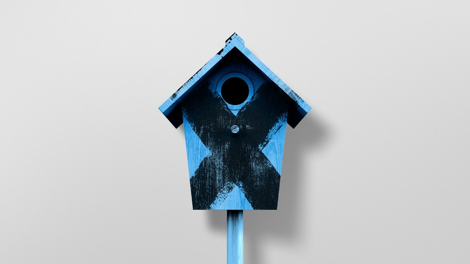

The platform’s new logo seems a little juvenile. So does the internet.  

该平台的新标识似乎有些稚嫩。互联网也是如此。

Photo-illustration by Ben Kothe / The Atlantic. Source: Getty.  

图片说明：Ben Kothe / 《大西洋月刊》。资料来源：Getty：来源：Getty.

July 31, 2023, 5:15 PM ET  

美国东部时间 2023 年 7 月 31 日下午 5:15

I woke up Sunday to find I had begun using the social network formerly known as Twitter. The app had updated to show the new name chosen by its owner: X. Now, underneath the friendly and familiar blue icon with a white bird, that letter alone was displayed—_X_—as if my iPhone was affirming that Elon Musk’s Twitter had become an error. Soon after, the bird icon disappeared, too, in favor of a [white-on-black 𝕏](https://www.fastcompany.com/90927535/elon-musk-twitter-logo).  

周日一觉醒来，我发现自己已经开始使用以前被称为 "推特 "的社交网络了。现在，在友好而熟悉的带白色小鸟的蓝色图标下面，只显示了这个字母--X--就好像我的 iPhone 在确认埃隆-马斯克的 Twitter 已经变成了一个错误。不久之后，小鸟图标也消失了，取而代之的是一个黑底白字的𝕏。

The change has rolled out slowly. First the website rebranded, and then, by the end of last week, Musk had dismantled the Twitter signage on the company’s San Francisco headquarters and [erected a huge, glowing _X_](https://apnews.com/article/twitter-san-francisco-building-x-elon-musk-4e0ae2a3b1b838b744bb2dc494f5b23c) on its rooftop. (It has since been [taken down](https://abc7news.com/twitter-x-sign-taken-down-bright-light-sf/13578182/).) Reprising the creeper thinking that inspired Musk to name Tesla’s models the “S,” “3,” “X,” and “Y,” such that they would combine to spell “[S3XY](https://electrek.co/2016/07/30/tesla-vehicle-naming-convention-sexy-model-y-elon-musk/),” Twitter also reportedly gave several conference rooms new, _X_\-oriented names, including “eXposure” and, once again, “[s3Xy](https://www.nytimes.com/2023/07/24/technology/twitter-x-elon-musk.html).”  

这一变化是缓慢进行的。先是网站重新命名，然后到上周末，马斯克拆除了公司旧金山总部的 Twitter 标志牌，并在屋顶上竖起了一个巨大的、发光的 "X"。(据报道，Twitter 还为几个会议室起了以 X 为主题的新名字，包括 "eXposure "和 "s3Xy"。

As my colleague Charlie Warzel [explained last week](https://www.theatlantic.com/technology/archive/2023/07/twitter-musk-x-rebrand/674818/), Musk has been trying to make X happen for decades now; PayPal arose from a merger with his X.com website. Now he’d like for X to be a superapp, a platform for chat, banking, news, shopping—everything. Musk’s insistence on packaging that idea, already megalomaniacal, with a logo that resembles a nerdy middle-school boy’s notebook doodle underscores a difficult truth: Nerdy middle-school boyhood, once a phase to be outgrown, has become a philosophy of life. “Anyone else look at the 𝕏 icon and not even want to open this app?” the Chicago-based product designer Chad Ashley tweeted—err, [posted on X](https://twitter.com/cgpov/status/1685616291703410688). He’s right. It’s embarrassing.  

正如我的同事查理-沃泽尔（Charlie Warzel）上周解释的那样，马斯克几十年来一直在努力实现 X；PayPal 就是与他的 X.com 网站合并后产生的。现在，他希望 X 成为一个超级应用，一个集聊天、银行、新闻、购物于一身的平台。马斯克坚持用一个类似于书呆子中学生的笔记本涂鸦的标志来包装这个已经自大到极点的想法，这凸显了一个困难的事实：书呆子中学生时代曾经是一个需要摆脱的阶段，但现在已经成为了一种生活哲学。芝加哥产品设计师查德-阿什利（Chad Ashley）在 "X "上发布了一条推文。太尴尬了。

Maybe that’s for the best. As a cultural practice, social media is bad—[people aren’t meant to talk to one another this much](https://www.theatlantic.com/technology/archive/2021/10/fix-facebook-making-it-more-like-google/620456/)—and anything that might erode the practice is worthwhile. But also, Twitter, like other social platforms and the very internet itself, is already redolent of the seventh grader’s mindset that Musk’s behavior betrays. Maybe we should be grateful that his X fetish forces us to admit that truth, so we can someday move beyond it.  

也许这样最好。作为一种文化习俗，社交媒体是不好的--人们本不该如此频繁地相互交谈，任何可能削弱这种习俗的东西都是值得的。但同时，Twitter 和其他社交平台以及互联网本身一样，已经充满了七年级学生的思维模式，而马斯克的行为恰恰暴露了这一点。也许我们应该感谢他的 "X癖 "迫使我们承认了这一事实，这样我们才有可能超越它。

In its un-rebranded form, Twitter helped make the lifestyle of posting seem benign. Before it was a company (and then an online addiction), _twitter_ was just a word: a reference to the sound of birds or certain kinds of human prattle. What harm could come of that?  

在没有品牌的情况下，Twitter 让发帖子这种生活方式看起来很温和。在成为一家公司（然后成为一种网络瘾）之前，twitter 只是一个词：指鸟叫声或人类的某些唠叨。这有什么坏处呢？

Lots. For starters, it normalized the very notion of a platform where everyone can speak to everyone, all at once. This feels natural today, but it wasn’t when the service launched in 2006. Back then, some might have had a blog, but people ordinarily posted only to small, closed online networks. That’s how Facebook still worked, and LinkedIn too, and Orkut, may it rest in peace. Social networks were initially designed around communities of trust. Twitter and then Instagram are to blame for expanding the act of posting to the world.  

很多。首先，它使每个人都能同时与每个人对话的平台这一概念正常化。这在今天看来很自然，但在 2006 年该服务推出时却并非如此。那时，有些人可能有博客，但人们通常只在小型、封闭的在线网络上发布信息。Facebook 依然如此，LinkedIn 也是如此，还有 Orkut，愿它安息。社交网络最初是围绕信任社区设计的。Twitter和Instagram将发布信息的行为扩大到全世界，功不可没。

The shift from social networks to social media was [culturally destructive](https://www.theatlantic.com/technology/archive/2022/11/twitter-facebook-social-media-decline/672074/). It set the expectation that everyone deserves—is owed, even—an audience for their every notion, quip, photo, or activity. This is a selfish child’s idea of living in the world, now so commonplace that opposing it seems controversial.  

从社交网络到社交媒体的转变具有文化破坏性。它设定了一种期望，即每个人都应该--甚至应该--为自己的每一个想法、调侃、照片或活动获得受众。这是一个自私的孩子对生活在这个世界上的想法，现在已经司空见惯，反对它似乎是有争议的。

That ethos has consequences. The rise of public shaming online, whether [in response to jokes](http://www.nytimes.com/2015/02/15/magazine/how-one-stupid-tweet-ruined-justine-saccos-life.html?_r=0), to [affirm personal virtue](https://www.theatlantic.com/science/archive/2016/02/the-evolution-of-shaming/470544/), or to [deepen group membership](https://www.theatlantic.com/ideas/archive/2020/05/best-shaming-happens-private/612082/), was dependent on an infrastructure of public data from which shameworthiness could be assessed, and also on the viral spread that Twitter both invented and perfected. So was the spread of QAnon, and the planning for the January 6 insurgency. The ability to repost something instantly and without comment to one’s own network, first invented as the “retweet button” in 2009, became a [vector for harassment and misinformation](https://www.buzzfeednews.com/article/alexkantrowitz/how-the-retweet-ruined-the-internet), allowing messages true or false, virtuous or vicious, to reach far beyond their original environments. Every other platform adopted a version of this feature because of its ability to produce engagement, and now imagining social media without it is almost impossible.  

这种风气产生了后果。网上公开羞辱的兴起，无论是为了回应笑话、肯定个人美德，还是为了加深群体成员关系，都有赖于可以评估可耻程度的公共数据基础设施，也有赖于推特发明并完善的病毒式传播。QAnon的传播和1月6日叛乱的策划也是如此。2009 年，推特首次发明了 "转发按钮"，用户可以不加评论地在自己的网络上即时转发信息，这一功能成为骚扰和误导的载体，使真实或虚假、善意或恶意的信息远远超出了最初的传播环境。由于该功能能够产生参与感，其他所有平台都采用了该功能的一个版本，现在几乎不可能想象没有该功能的社交媒体了。

[Read: The age of social media is ending  

阅读：社交媒体时代即将终结](https://www.theatlantic.com/technology/archive/2022/11/twitter-facebook-social-media-decline/672074/)

Those are influences of function—many frequently acknowledged. Less discussed: Twitter and the services it influenced also changed aesthetic life. They brought a new style to the fore: juvenile narcissism. X is its purest, dumbest distillation, a seemingly edgy but ultimately corny name that evokes mathematics and nightclubs, pornography and tabletop games.  

这些都是功能的影响因素，其中许多已被广泛认可。但讨论较少：推特和受其影响的服务也改变了审美生活。它们带来了一种新的风格：稚嫩的自恋。X 是其最纯粹、最愚蠢的提炼，这个看似前卫但最终陈腐的名字让人联想到数学和夜总会、色情和桌面游戏。

Like many styles, Musk’s (and Twitter’s) came out of a subculture, and one that thrives online. The infinity of social media creates communities at the fringe. In the best cases, these improve the lives of people who might otherwise struggle for connection, but they can also serve as bubbles that amplify and normalize perversion. When everyone can find a group of like-minded individuals, all flavors of mindedness can end up seeming justified—including, most of all, the weird-schoolboy-mindedness of the people who happen to have invented the internet as we know it.  

与许多风格一样，马斯克的风格（和推特的风格）来自亚文化，而且是一种在网络上蓬勃发展的亚文化。社交媒体的无限性创造了边缘社区。在最好的情况下，这些社区能改善人们的生活，否则他们可能会为建立联系而苦苦挣扎，但它们也可能成为放大变态行为并使之正常化的泡沫。当每个人都能找到一群志同道合的人时，各种思想最终都会显得合情合理--其中最重要的是，包括那些碰巧发明了我们所熟知的互联网的人的怪异学童思想。

Online culture began in corners where weirdos could connect. Dialed into local [BBSes](https://www.theatlantic.com/technology/archive/2016/11/the-lost-civilization-of-dial-up-bulletin-board-systems/506465/), or logged on to Usenet threads and text-based virtual worlds called MUDs, nerds and outcasts were the first to find their tribes online. Some shared recipes or crochet patterns; others expressed their board-game, anime, or furry fandoms; while still others passed around conspiracy theories. And there were always piles and piles of naked pictures.  

网络文化起源于怪人可以联系的角落。通过拨号进入本地 BBS，或登录 Usenet 线程和基于文本的虚拟世界 MUD，书呆子和被遗弃者最先在网上找到了自己的部落。一些人分享食谱或钩针编织图案；另一些人表达他们对棋盘游戏、动漫或毛茸茸的狂热；还有一些人在网上传播阴谋论。此外，还有成堆的裸体照片。

Across many of these communities, no matter their host, content, or members, an ethos of dorky behavior was ascendant—and it persists today. You can’t browse a subreddit for plumbing or coffee-brewing tips without running the risk of wading through a hundred nested replies containing dumb jokes, sneers, and sexual innuendo. Bizarre beliefs that once would have been confined to email forwards became widespread on Facebook. Every tweet becomes an opportunity for some miscreant, mansplainer, or literalist to pick your words apart. The [Comic Book Guys](https://simpsons.fandom.com/wiki/Comic_Book_Guy) took over.  

在许多这样的社区中，无论其主办方、内容或成员如何，一种 "呆萌 "行为的风气正在兴起，而且一直持续到今天。你在浏览水管或咖啡冲泡技巧的子论坛时，有可能会浏览到上百条嵌套回复，其中包含无聊的笑话、讥讽和性暗示。曾经仅限于电子邮件转发的奇谈怪论在 Facebook 上变得十分普遍。每一条推文都会成为一些不法分子、人云亦云者或文盲挑刺的机会。漫画家们接管了一切。

Sexual desire and frustration, familiar feelings for the outcast teenage nerd, pervade the social internet. S3xy-ness is everywhere. Posts by women are dismayingly likely to produce advances, or threats, from creepers on all platforms; at the same time, sex appeal is a pillar for the influencer economy, or else a [viable](https://www.nytimes.com/2019/02/09/style/onlyfans-porn-stars.html) and even noble way to win financial independence. [The internet is for porn](https://knowyourmeme.com/memes/the-internet-is-for-porn), as the song goes.  

性欲和挫败感，这些被抛弃的青少年书呆子熟悉的感觉，充斥着社交网络。性欲无处不在。令人沮丧的是，在所有平台上，女性发布的帖子都有可能引起爬虫的搭讪或威胁；与此同时，性吸引力也成为影响者经济的支柱，或者说是赢得经济独立的一种可行甚至高尚的方式。就像那首歌里唱的那样，网络是用来拍色情片的。

In all these ways, online life today descends from where it started, as a safe harbor for the computer nerds who made it. They were socially awkward, concerned with machines instead of people, and devoted to the fantasy of converting their impotence into power. When that conversion was achieved, and the nerds took over the world, they adopted the bravado of the jocks they once despised. ([Zuck-Musk cage match](https://www.theatlantic.com/technology/archive/2023/06/musk-zuckerberg-cage-fight-social-media-supremacy/674503/), anyone?) But they didn’t stop being nerds. We, the public, never agreed to adopt their worldview as the basis for political, social, or aesthetic life. We got it nevertheless.  

在所有这些方面，今天的网络生活都是从它的起点开始的，它是计算机书呆子们创造的安全港湾。他们不善社交，只关心机器而非人类，一心幻想将自己的无能转化为力量。当书呆子们实现了这一转变，接管了世界之后，他们又像曾经被他们鄙视的运动员一样张扬起来。(但他们并没有停止书呆子的本性。我们，公众，从未同意将他们的世界观作为政治、社会或审美生活的基础。尽管如此，我们还是得到了。

[Read: The nerds are bullies now  

阅读：书呆子现在成了恶霸](https://www.theatlantic.com/technology/archive/2023/06/musk-zuckerberg-cage-fight-social-media-supremacy/674503/)

Musk’s obsession with X as a brand, and his childish desire to broadcast that obsession from the rooftops in hoggish, [bright pulsations](https://abc7news.com/twitter-x-sign-bright-light-sf-hq/13575800/), calls attention to this baggage. It reminds us that the world’s richest man is a computer geek, but one with enormous power instead of none. It calls attention to the putrid smell that suffuses the history of the internet. I’m kind of tired of pretending that the stench does not exist, as if doing otherwise would be tantamount to expressing prejudice against neurodivergence. This is a bad culture, and it always has been.  

马斯克对 "X "这一品牌的痴迷，以及他想在屋顶上以猪一样的明亮脉动广播这种痴迷的幼稚愿望，让人们注意到了这一包袱。它提醒我们，世界首富是一个电脑怪胎，但他拥有巨大的权力，而不是一无所有。它唤起了人们对互联网历史中弥漫的腐臭味的关注。我已经厌倦了假装这种恶臭并不存在，似乎不这样做就等同于对神经分裂的偏见。这是一种糟糕的文化，一直都是如此。

Foul nerddom is part of what invented, popularized, and profited from the internet’s commercial rise. Twitter did its part to hide all that, with its unoffending avian verbs, its adorable birds, even its charming [fail whale](https://www.theatlantic.com/technology/archive/2015/01/the-story-behind-twitters-fail-whale/384313/). Better we should understand that no global attention network is ever really cute or charming, for they all are on the internet, a cesspool.  

污秽的书呆子形象是互联网商业崛起的发明、普及和获利的一部分。推特为掩盖这一切尽了自己的一份力，它的禽类动词、可爱的小鸟，甚至是迷人的失败鲸鱼，都让人不忍直视。我们更应该明白，没有一个全球关注网络是真正可爱或迷人的，因为它们都在互联网这个污水池里。

If the X rebrand disgusts you—if, like me, you’ve been made a little queasy by having the new logo thrust upon your phone via automatic update—that feeling is about more than Musk alone. He has merely surfaced what has been there all along. The internet is magical and empowering. The internet is childish and disgusting.  

如果你对 X 的品牌重塑感到反感，如果你和我一样，被自动更新的新标识弄得有点不舒服，那么这种感觉不仅仅是马斯克一个人的问题。他只是把一直存在的东西浮出了水面。互联网是神奇的，是有力量的。互联网是幼稚而令人厌恶的。
