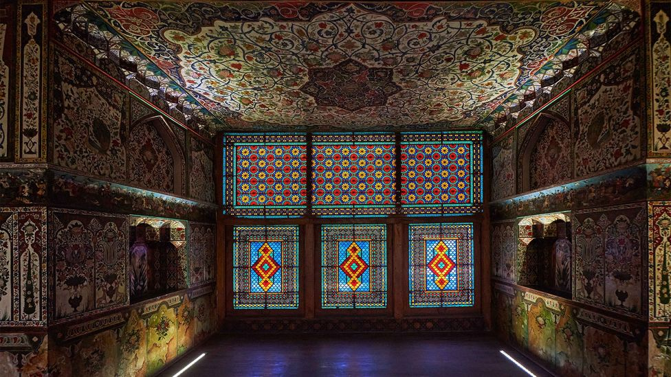

(Image credit:

Wmaster890/Getty Images

)  

(图片来源：Wmaster890/盖蒂图片社）

")

In Finland, people are assumed to be honest all the time, and trust is implicit unless proven otherwise.  

在芬兰，人们总是被认为是诚实的，除非事实证明并非如此，否则信任是隐性的。

I

It was December, and I’d just arrived in Helsinki. Fresh snow lined the roads and I frantically covered myself up against the cold; gloves, hat, scarf. I headed to the train station, looking for a Finnish SIM card, and popped into several shops and kiosks to find the best one. At some point, I realised I’d left my hat somewhere and retraced my route in frustration. I peeked inside the stores, mimicking wearing a hat, asking if anybody saw it. I finally spotted it, sitting atop a small Christmas tree on one of the kiosk counters, and picked it up with a smile.  

那是十二月，我刚刚抵达赫尔辛基。路面上铺满了新雪，我慌忙把自己盖得严严实实，手套、帽子、围巾一应俱全。我前往火车站，寻找芬兰的 SIM 卡，并走进几家商店和小卖部，寻找最好的 SIM 卡。不知什么时候，我发现自己把帽子忘在了什么地方，于是沮丧地重回原路。我在商店里探头探脑，模仿戴帽子的样子，问有没有人看到我的帽子。我终于发现了它，它就放在一个小卖部柜台上的一棵小圣诞树上，我笑着把它捡了起来。

That led to one of my first observations about Finland: that the Finns are a very honest bunch. During my visit, I would slowly go on to discover that honesty is highly valued in society here and is the bedrock of all interaction: people are assumed to be honest all the time, and trust is implicit unless proven otherwise.  

这让我对芬兰有了一个初步的认识：芬兰人是非常诚实的一群人。在访问期间，我慢慢发现这里的社会高度重视诚信，诚信是一切交往的基石：人们总是被认为是诚实的，除非另有证明，否则信任是隐含的。

")

In Reader’s Digest’s “Lost Wallet Test”, Helsinki was the most honest city of those tested (Credit: Scanrail/Getty Images)  

在《读者文摘》的 "丢失钱包测试 "中，赫尔辛基是被测试城市中最诚实的城市（图片来源：Scanrail/Getty Images）

“Being honest is a characteristic of Finnish culture – at least if we compare to other cultures,” said Johannes Kananen, a lecturer at the Swedish School of Science at the University of Helsinki. “In English there is a saying that the truth is so valuable, it should be used sparingly. But in Finland, people speak the truth all the time.”  

"赫尔辛基大学瑞典科学学院讲师约翰内斯-卡纳宁（Johannes Kananen）说："诚实是芬兰文化的一个特点--至少与其他文化相比是如此。在英语中，有这样一句话："真理是如此宝贵，应该慎用。但在芬兰，人们总是说真话。

My hat situation was by no means unique, as in Finland lost possessions seem to always make their way back to the owner. “It’s a very quirky habit around here, leaving lost mittens on trees,” said Natalie Gaudet, who works at Aalto University, explaining that this makes them easy to spot from a distance. “Kids are always losing mittens, and people tend to hang these up on a nearby tree so that the loser may find them on their way back.” In a society where honesty is implied, it’s understood that only the owner will claim the lost article.  

我的帽子绝非独一无二，在芬兰，丢失的物品似乎总能物归原主。"在阿尔托大学工作的娜塔莉-高德特（Natalie Gaudet）说："在这里，把丢失的手套挂在树上是一种非常古怪的习惯。"孩子们总是丢手套，人们往往会把它们挂在附近的树上，这样失主在回来的路上就能找到它们。在一个讲究诚信的社会里，人们都知道只有失主才会认领丢失的物品。

A few years ago, Reader’s Digest did a [“Lost Wallet Test”](https://www.rd.com/culture/most-honest-cities-lost-wallet-test/), where their reporters “lost” 192 wallets in cities across the world. Each wallet had $50 with contact information, family photos and business cards. Eleven out of every 12 wallets dropped in the Finnish capital were returned to their owners, making Helsinki the most “honest” city of those tested.  

几年前，《读者文摘》曾做过一次 "丢失钱包测试"，他们的记者在全球各个城市 "丢失 "了 192 个钱包。每个钱包里都有 50 美元，里面有联系方式、家庭照片和名片。在芬兰首都赫尔辛基，每 12 个丢失的钱包中就有 11 个物归原主，因此赫尔辛基成为受测城市中最 "诚实 "的城市。

")

Finland has been voted the happiest country in the world for three years in a row (Credit: Shalamov/Getty Images)  

芬兰连续三年被评为世界上最幸福的国家（图片来源：Shalamov/Getty Images）

But what makes Finland such an honest country?  

是什么让芬兰成为一个如此诚实的国家？

The state of Finland is not a very old construction; for centuries, what is now Finland was under the Swedish kingdom. While Swedish was the language of the upper class, Finnish came to be associated with the lower classes, the peasantry and the clergy. It was only in 1809 that Finland got autonomous status from Alexander I of Russia in the Finnish War and became the Grand Duchy of Finland, the modern predecessor to what is now Finland. This was when a strong Finnish identity began to be built, and Finnish language began to flourish.  

芬兰的建国历史并不悠久；几个世纪以来，现在的芬兰一直处于瑞典王国的统治之下。瑞典语是上层社会的语言，而芬兰语则与下层社会、农民和神职人员联系在一起。直到 1809 年，芬兰才在芬兰战争中从俄国亚历山大一世手中获得自治地位，成为芬兰大公国，也就是现在芬兰的现代前身。从那时起，芬兰人开始建立起强烈的芬兰认同感，芬兰语也开始蓬勃发展。

> ## Being honest is a characteristic of Finnish culture – at least if we compare to other cultures  
> 
> 诚实是芬兰文化的特点--至少与其他文化相比是这样的

Says Urpu Strellman, a literary agent from Helsinki, “An image was created, a stereotype of the Finns as stern, modest, hard-working, God-obeying people who get through difficult times, taking upon them whatever \[fate\] throws their way. These are features that relate to honesty very closely.”  

来自赫尔辛基的文学经纪人 Urpu Strellman 说："芬兰人的形象已经形成，他们是严厉、谦虚、勤劳、服从上帝的人，他们能够度过难关，接受任何\[命运\]的安排。这些特征与诚实密切相关"。

The vastly rural landscape, combined with the dark Arctic winters, necessitated an adoption of these attitudes if Finland were to build itself up. The [Finnish word “_sisu”_](https://www.bbc.com/worklife/article/20180502-sisu-the-finnish-art-of-inner-strength) describes this concept of grit, resilience and hardiness that was built into the national identity and cultural characteristics.  

辽阔的乡村地貌，加上北极地区阴沉的冬天，芬兰要想自强，就必须采取这些态度。芬兰语中的 "sisu "一词描述了这种坚韧不拔、顽强不屈的观念，这种观念已融入芬兰的民族特征和文化特色之中。

")

The harsh winters are partly responsible for the national characteristics of grit, resilience and hardiness (Credit: Sitikka/Getty Images)  

严酷的冬季是形成坚韧不拔、顽强不屈等民族特色的部分原因（图片来源：Sitikka/盖蒂图片社）

Additionally, once Finland broke away from the Swedish kingdom, it was able to establish an Evangelical Lutheran Church and a Protestant ethic. In the book On the Legacy of Lutheranism in Finland_,_ Klaus Helkama and Anneli Portman examine the Protestant roots of the Finnish value of honesty, which they argue are brought about by Protestant missionary activities that focused on mass education and mass printing, which in turn brought about self-reflection and led to activation of honesty. The Lutheran church in Finland is one of the largest in the world.  

此外，芬兰脱离瑞典王国后，建立了福音路德教会和新教伦理。在《路德教在芬兰的遗产》一书中，克劳斯-赫尔卡马（Klaus Helkama）和安利-波特曼（Anneli Portman）研究了芬兰人诚实价值观的新教根源，他们认为，新教传教活动的重点是大众教育和大量印刷，这反过来又带来了自我反省，从而激活了诚实。芬兰的路德教会是世界上最大的教会之一。

**You may also be interested in:  

您可能还对以下内容感兴趣**  

• [The secret to Danish happiness?](http://www.bbc.com/travel/story/20190217-what-to-do-when-hygge-no-longer-works)  

\- 丹麦人幸福的秘诀是什么？  

• [Why is New Zealand so progressive?](http://www.bbc.com/travel/story/20200518-why-is-new-zealand-so-progressive)  

\- 新西兰为何如此进步？  

• [Why Finnish people don't like to chat](http://www.bbc.com/travel/story/20181016-how-the-finnish-survive-without-small-talk)  

\- 芬兰人为什么不喜欢聊天

Those qualities are now deeply rooted in Finnish culture, Kananen said. “Truthfulness and honesty are greatly valued and respected.”  

卡纳宁说，这些品质如今已深深扎根于芬兰文化之中。"真实和诚实受到了极大的重视和尊重"。

He cites the example of the scandal that hit Finnish skiers when Finland hosted the FIS Nordic Ski Championship in 2001. Six top Finnish athletes got caught doping and were disqualified. The scandal was covered in the national press as a matter of public shame, and there was a sense of collective embarrassment in the country.  

他举例说，2001 年芬兰主办国际滑雪联合会北欧滑雪锦标赛时，芬兰滑雪运动员遭遇丑闻。六名芬兰顶尖运动员被查出服用兴奋剂，并被取消了参赛资格。这一丑闻被全国性媒体报道，成为公众的耻辱，芬兰人集体感到难堪。

“For the Finns, the worst thing about the doping scandal was not, however, the scandal itself,” reports an [article](https://www.tandfonline.com/doi/full/10.1080/09523360500386450) published in The International Journal of the History of Sport_._ “The worst thing was that, along with the facade of honesty in sports in general, the myth of the honest, hardworking Finn came crashing down.”  

"国际体育史杂志》上发表的一篇文章指出："对芬兰人来说，兴奋剂丑闻最糟糕的地方并不在于丑闻本身。

")

Helsinki’s Lutheran Cathedral is an enduring symbol of the country’s Protestant roots (Credit: Larisa Shpineva/Getty Images)  

赫尔辛基的路德教大教堂是该国新教根源的永恒象征（图片来源：Larisa Shpineva/Getty Images）

“The whole thing was about national pride,” Kananen said. “As a contrast, in Norway when one of their women skiers [got caught for doping](https://www.nytimes.com/2001/03/13/sports/olympics-finland-reels-over-skiers-drug-scandal.html), the whole country defended her and wanted her punishment to be as mild as possible.”  

"卡纳宁说："整件事与民族自豪感有关。"与此形成鲜明对比的是，在挪威，当一名女滑雪运动员因服用兴奋剂而被抓时，整个国家都在为她辩护，并希望对她的处罚越轻越好。

> ## Truthfulness and honesty are greatly valued and respected  
> 
> 真实和诚实受到高度重视和尊重

Indeed, Finns derive a great deal of pride from the high level of social trust present in the society, which in turn is an indication of the perception that people are believed to be acting honestly. “In Finland the state is a friend, not an enemy,” Kananen said. “The state is perceived as acting for the collective good – so public officials act in everybody’s shared interest. There is a great deal of trust – towards fellow citizens and public office holders, including the police. Finnish people are also happy taxpayers. They know the tax money is used for the common good and they know no-one will cheat when collecting the taxes.”  

事实上，芬兰人因社会信任度高而深感自豪，这反过来又表明，人们认为自己的行为是诚实的。"在芬兰，国家是朋友，而不是敌人。"人们认为国家是为了集体利益而行动--因此政府官员的行为符合每个人的共同利益。人们对公民和公职人员（包括警察）都非常信任。芬兰人也是快乐的纳税人。他们知道税款是用来为大家谋福利的，也知道没有人会在收税时作弊。

Often, though, it comes down to simple matters of size. Gokul Srinivasan, a robotics engineer and entrepreneur living in Helsinki, explained that in a small community if someone is caught lying once, they won’t be considered trustworthy again. Though Finland is nearly three times bigger than England, it has just one-tenth its population – with most of the country’s 5.5 million residents concentrated in the urban centres in the south. As a result, there is a good chance people in a specific field already know of each other.  

不过，这往往只是简单的规模问题。居住在赫尔辛基的机器人工程师兼企业家戈库尔-斯里尼瓦桑（Gokul Srinivasan）解释说，在一个小社会里，如果有人被发现撒过一次谎，那么他就不会再被认为是值得信赖的人。虽然芬兰的面积几乎是英国的三倍，但人口却只有英国的十分之一，全国 550 万居民大部分集中在南部的城市中心。因此，在特定领域工作的人很有可能已经相互认识。

")

Studies have established connections between improvement in mental and physical health and telling the truth (Credit: Wmaster890/Getty Images)  

研究表明，身心健康的改善与说出真相之间存在联系（图片来源：Wmaster890/Getty Images）

“If a Finn considers you untrustworthy, you should consider that bridge burned, and it would lead to other bridges being burned as well,” Srinivasan said. “They are not in the habit of talking behind your back, but if someone were to ask for a reference, it will be a problem.”  

"斯里尼瓦桑说："如果芬兰人认为你不值得信任，你就应该认为这座桥梁已经烧毁，而且还会导致其他桥梁也被烧毁。"他们没有在你背后说三道四的习惯，但如果有人向你要推荐信，那就麻烦了"。

These seem very heavy ideas for a country that was recently [voted](https://worldhappiness.report/news/its-a-three-peat-finland-keeps-top-spot-as-happiest-country-in-world/) the “Happiest Country in the World” for the third year in a row, I thought. When I arrived in Finland, I was eager to see how this level of “happiness” would manifest itself. Happiness is, after all, connected to honesty: in a [report](https://www.apa.org/news/press/releases/2012/08/lying-less) published by the American Psychological Association_,_ a study established connections between improvement in mental and physical health and telling the truth.  

我想，对于一个最近连续第三年被评为 "世界上最幸福的国家 "的国家来说，这些想法似乎非常沉重。当我抵达芬兰时，我迫不及待地想知道这种 "幸福 "水平会如何体现。毕竟，幸福与诚实有关：在美国心理学协会发表的一份报告中，一项研究确定了身心健康的改善与说实话之间的联系。

Honesty aside, the nation’s alleged happiness certainly wasn’t obvious. To my eyes, Finns were helpful but not interfering, warm yet stoic, and clear but not extremely expressive. What was apparent, though, was their direct communication style, something Strellman attributes to their core values of honesty and straightforwardness.  

撇开诚实不谈，这个国家所谓的幸福当然并不明显。在我看来，芬兰人乐于助人但不干涉他人，热情但不拘小节，清晰但不善于表达。不过，最明显的是他们直接的交流方式，Strellman 将其归因于他们诚实和直率的核心价值观。

")

Honesty is highly valued in Finnish society and is the bedrock of all interaction (Credit: Ville Heikkinen/Getty Images)  

芬兰社会高度重视诚信，诚信是一切交往的基石（图片来源：Ville Heikkinen/Getty Images）

“We are bad in [small talk](http://www.bbc.com/travel/story/20181016-how-the-finnish-survive-without-small-talk) – always better to be silent than talk about something with no point,” she said. “There is a strong idea that you have to speak things as they are, not making empty promises, and not trying to polish up things. Finns appreciate bluntness over eloquence.”  

"她说："我们不善于闲聊--沉默总比说一些毫无意义的话要好。"我们有一种强烈的观念，那就是必须就事论事，不做空头支票，也不刻意修饰。芬兰人欣赏直率而非雄辩。

> ## If a Finn considers you untrustworthy, you should consider that bridge burned  
> 
> 如果芬兰人认为你不值得信任，你就应该认为这座桥已经烧毁了

Finns take the words they say seriously, so every word actually means what it says. In a [study](https://www.academia.edu/641339/Finnish_and_American_linguistic_patterns_a_cultural_comparison?auto=download) by ethnographer Donal Carbaugh, he explains how superlative statements sound presumptuous to Finnish people. The one rule of Finnish communication, he writes, is to be invested in what you say.  

芬兰人认真对待他们所说的话，因此每个词都是言之有物。在人种学家多纳尔-卡保（Donal Carbaugh）的一项研究中，他解释了在芬兰人听来夸夸其谈是如何显得自以为是的。他写道，芬兰人交流的一条规则就是对自己所说的话投入感情。

Kananen agrees: “Finns tend to take expressions quite literally. So, if you say you had the best burger ever, that could lead to a conversation where you talk about all the burgers you have ever had and the exact criteria for judging which one was the best. Unless you can prove it was objectively the best burger ever, you are a bit suspicious, and, yes, presumptuous for sure.”  

卡纳宁对此表示赞同："芬兰人倾向于从字面上理解表达。因此，如果你说你吃到了有史以来最好吃的汉堡，这可能会引发一场谈话，让你谈论你吃过的所有汉堡，以及判断哪个汉堡最好吃的确切标准。除非你能证明它客观上是有史以来最好吃的汉堡，否则你就有点可疑，是的，肯定是自以为是"。

")

While most of the nation’s population is mostly based in the south, Lapland, Finland’s northernmost region, remains sparsely populated (Credit: RomanBabakin/Getty Images)  

芬兰大部分人口居住在南部，而芬兰最北端的拉普兰地区却仍然人烟稀少（图片来源：RomanBabakin/Getty Images）

Of course, there are pitfalls to this, too. “The flipside of this culture is a tendency to allow only one ‘truth’ to exist at a time about many things, the economy, health, technology,” he said.  

当然，这样做也有隐患。"他说："这种文化的另一面是，人们倾向于在经济、健康、技术等许多方面同时只存在一种'真相'。

“This is the truth we can read from newspapers and, what the experts tell us. We are not very good at tolerating diversity of opinion as there is a deep-seated belief that there is only one truth.”  

"这就是我们从报纸上读到的真相，也是专家告诉我们的真相。我们不善于容忍不同的意见，因为我们根深蒂固地认为真相只有一个"。

Mostly though, honesty does turn out to be the best policy, as Finns might tell you – although it takes a bit of time to get used to it. Later that week, a Finnish friend and I headed to Turku, a city in the south of Finland, where we roamed around the centre, looking for good beer. We went to different bars, leaving our coats on hangers by each entrance. As we drank and chatted, I couldn’t help but cast furtive glances at my jacket. There were no security locks, and no-one to watch them.  

不过，正如芬兰人可能会告诉你的那样，大多数情况下，诚实确实是最好的政策--尽管这需要一点时间来适应。那周晚些时候，我和一位芬兰朋友前往芬兰南部城市图尔库，我们在市中心四处游荡，寻找好啤酒。我们去了不同的酒吧，把外套挂在每个入口处的衣架上。我们边喝边聊，我忍不住偷偷瞄了一眼我的外套。没有安全锁，也没有人看管。

“Don’t worry,” my friend reminded me, for what might have been the 100th time. “No one will take it.”  

"别担心，"我的朋友提醒我，这可能已经是第100次了。"没人会拿走的"

I was finally starting to believe that.  

我终于开始相信这一点了。

[Why We Are What We Are](http://www.bbc.com/travel/columns/why-we-are-what-we-are) _is a BBC Travel series examining the characteristics of a country and investigating whether they are true._  

我们为何如此》是 BBC 旅游系列节目，探讨一个国家的特点，并研究这些特点是否真实。

_Join more than three million BBC Travel fans by liking us on_ [Facebook](https://www.facebook.com/BBCTravel/)_, or follow us on_ [Twitter](https://twitter.com/BBC_Travel) _and_ [Instagram](https://www.instagram.com/bbc_travel/)  

在 Facebook 上喜欢我们，或在 Twitter 和 Instagram 上关注我们，加入三百多万 BBC Travel 粉丝的行列_._

_If you liked this story,_ [sign up for the weekly bbc.com features newsletter](http://pages.emails.bbc.com/subscribe/?ocid=ear.bbc.email.we.email-signup) _called "The Essential List". A handpicked selection of stories from BBC Future, Culture, Worklife and Travel, delivered to your inbox every Friday._  

如果您喜欢这个故事，请注册订阅 bbc.com 的每周专题通讯 "The Essential List"。精选 BBC Future、Culture、Worklife 和 Travel 的报道，每周五发送到您的收件箱。

;

## Sheki: The Caucasus' unsung culture capital  

谢基高加索默默无闻的文化之都

(Image credit: Simon Urwin)  

(图片来源：Simon Urwin）

This under-the-radar city once produced some of the finest silks in the world. Now, it's considered Azerbaijan's cultural and culinary capital.  

这座名不见经传的城市曾经出产世界上最精美的丝绸。现在，它被视为阿塞拜疆的文化和美食之都。

"For many, the Silk Road is synonymous with the cities of Samarkand, Bukhara and Khiva in Uzbekistan," said my guide, [Habil Gudratli](http://instagram.com/caucasianguide). "But Azerbaijan was also home to key hubs on the trade routes linking Asia with Europe; one of these was the city of Sheki, which grew from a trading post to become a leading international centre for the silk trade."   

"我的导游哈比尔-古德拉特里说："对许多人来说，丝绸之路就是乌兹别克斯坦撒马尔罕、布哈拉和希瓦等城市的代名词。"但阿塞拜疆也是连接亚洲和欧洲的贸易路线上的重要枢纽，其中之一就是舍基城，它从一个贸易站发展成为一个主要的国际丝绸贸易中心。

Some 300km north-west of Azerbaijan's glittering capital, Baku, the small city of Sheki lies near the border with Russia and Georgia in the foothills of the Greater Caucasus mountains. Here, forests of oak, walnut and beech flourish, as does the white mulberry tree, whose leaves are fed to silkworms to produce the highly coveted fabric.   

谢基（Sheki）小城位于阿塞拜疆闪耀的首都巴库西北约 300 公里处，靠近俄罗斯和格鲁吉亚边境，地处大高加索山脉山麓。在这里，橡树、核桃树和山毛榉林以及白桑树茂盛生长，白桑树的叶子被用来喂养蚕，以生产令人垂涎的织物。

Sheki came to prominence in the mid-1700s when rulers (khans) made it the capital of their khanate. There is evidence of sericulture (silkworm breeding and silk production) in the region dating back to the 6th Century, but it was the Sheki khans who turned it into a thriving business. "By the 18th and 19th Centuries, Sheki silk was considered amongst the finest in the world," said Gudratli. "The wealthy elite as far away as China and Japan purchased it not only for its quality and beauty but for the hygiene and comfort, because lice don't live in silk like they do in other materials."  

17 世纪中期，当统治者（汗）将石溪作为其汗国的首都时，石溪开始崭露头角。该地区养蚕（养蚕和生产丝绸）的历史可追溯到公元 6 世纪，但正是谢基汗将养蚕业发展成了一个繁荣的行业。"古德拉特里说："到 18 世纪和 19 世纪，Sheki 丝绸被认为是世界上最好的丝绸之一。"远在中国和日本的富裕精英们购买这种丝绸不仅是为了它的质量和美观，更是为了它的卫生和舒适，因为虱子不会像其他材料那样寄生在丝绸上。

")

Sheki is surrounded by forests in the foothills of the Greater Caucasus mountains (Credit: Simon Urwin)  

谢基（Sheki）被大高加索山脉山麓的森林所环绕（图片来源：Simon Urwin

The Sheki khans ruled this region of the Caucasus until 1819, and their flourishing political and trading empire was headquartered in a fortress complex embellished with gardens, fountains and marble water pools, said to resemble a kind of Caucasian [Alhambra](https://www.bbc.com/travel/article/20170817-the-secret-world-of-granadas-alhambra-palace). The citadel's walls are still standing, but only one of the original 30 or so buildings inside remains: the Unesco-inscribed [Sheki Khan's Palace](https://azerbaijan.travel/take-tour-khans-palace-sheki), a former summer residence and administrative building.   

1819 年之前，谢基汗一直统治着高加索地区，他们繁荣的政治和贸易帝国的总部就设在一座要塞建筑群内，该建筑群内有花园、喷泉和大理石水池，据说类似于高加索的阿尔罕布拉宫。城堡的城墙依然屹立，但城堡内原有的 30 多座建筑只剩下一座：被列入联合国教科文组织名录的谢基汗宫，它曾是一座避暑山庄和行政大楼。

Designed to impress visiting dignitaries, the magnificent two-storey palace, with its vivid paintings of strutting peacocks and flower-breathing dragons, took two years to construct (the stonework originally held together with egg white) and a further eight to decorate. In the palace's rose garden, Gudratli introduced me to researcher Zamina Rasulava, who has spent more than 20 years studying its lavish ornamentation.   

这座宏伟的两层宫殿是为了给来访的贵宾留下深刻印象而设计的，上面绘有栩栩如生的孔雀和龙的图案，建造这座宫殿花费了两年时间（最初是用蛋清将石块粘合在一起），又花了八年时间进行装饰。在宫殿的玫瑰园里，古德拉特里向我介绍了研究员扎米娜-拉苏拉娃（Zamina Rasulava）。

Leading me through one extravagant room after another, she highlighted the pomegranate as one of the most important recurring motifs. "In Islam, which arrived \[in Sheki\] in the 8th Century, the pomegranate is the king of all paradise fruits because its calyx resembles a crown," she said. She went on to explain that for the Sheki khans, it also symbolised government. "The ruby-red seeds represent the people; the pith separates them into their different regions, cultures and ethnic groups. If they are brought together by good governance, then there is unity, which in turn bears rich fruit."   

在带领我参观一个又一个奢华的房间时，她强调石榴是最重要的重复出现的图案之一。"她说："伊斯兰教于 8 世纪传入（谢基），在伊斯兰教中，石榴是天堂水果之王，因为它的花萼像一顶皇冠。她接着解释说，对于谢基汗人来说，石榴还象征着政府。"红宝石色的种子代表着人民；果核将他们分为不同的地区、文化和民族。如果通过善治将他们团结在一起，那么就能实现团结，进而结出丰硕的果实"。

The palace's most distinctive feature is its vast _shebeke_ (decorative windows made without glue or nails). Rasulava told me that each square metre consists of more than 5,000 pieces of wood and coloured glass, the latter brought along trade routes from [Murano](https://www.bbc.com/travel/article/20220317-venices-unbreakable-women-of-glass), near Venice, and exchanged for silkworms and cocoons. "Sheki silkworms were in demand globally," Rasulava explained. "Not only in Italy, but [Lyon](https://www.bbc.com/travel/article/20180906-lyons-secret-labyrinth-an-ingenious-escape-route) (France's greatest silk centre), and even in silk's motherland, China, because they were more resilient in cold weather than any other."  

宫殿最大的特色是其巨大的 Shebeke（不用胶水或钉子制作的装饰窗）。拉苏拉瓦告诉我，每平方米由 5000 多块木头和彩色玻璃组成，后者是从威尼斯附近的穆拉诺沿贸易路线运来的，用来交换蚕和蚕茧。"拉苏拉瓦解释说："Sheki 蚕在全球都很抢手。"不仅在意大利，在里昂（法国最大的丝绸中心），甚至在丝绸的祖国--中国，因为它们在寒冷的天气里比其他任何蚕都更有韧性"。

")

The gardens, pools and engravings of the Unesco-inscribed Khan's Palace are said to resemble a Caucasian Alhambra (Credit: Simon Urwin)  

被列入联合国教科文组织名录的可汗宫的花园、水池和雕刻据说很像高加索的阿尔罕布拉宫（图片来源：Simon Urwin）

As Sheki prospered, artisans from the region came to trade with the silk merchants, including carpet weavers, _tekeldus_ ([chain stitch](https://azerbaijan.az/en/related-information/50)) embroiderers, coppersmiths, potters, milliners and shoemakers. Sheki became renowned as a leading centre for the arts and crafts, a reputation it still holds to this day. Meanwhile, the boom in caravan traffic led to the building of five caravanserais, two of which have survived. Public squares were constructed, along with [hammams](https://sheki-heritage-org-az.translate.goog/heritage/16?_x_tr_sl=az&_x_tr_tl=en&_x_tr_hl=en&_x_tr_pto=sc), major roads and the [Khan Mosque](https://azerbaijan.travel/khan-mosque-exhibits-shekis-regal-roots), the city's first Friday mosque, known as a Juma. (Friday is the holiest day of the week for Muslims when they are obliged to attend a special noon service.)   

随着石基的繁荣，该地区的工匠们纷纷前来与丝绸商人进行贸易，其中包括地毯编织工、tekeldus（链缝）刺绣工、铜匠、陶匠、磨坊主和鞋匠。石基成为著名的艺术和手工艺品中心，至今仍享有盛誉。与此同时，大篷车交通的蓬勃发展导致建造了五座大篷车庄园，其中两座幸存了下来。公共广场、土耳其浴室、主干道和汗清真寺相继建成，汗清真寺是这座城市的第一座星期五清真寺，被称为 "朱玛"（Juma）。(星期五是穆斯林一周中最神圣的一天，他们必须参加中午的特别礼拜）。

The Khan Mosque is open to the public, and Gudratli had arranged for an audience with the current imam, Habil Khalilov, who greeted me by anointing me with _gulab_, a purifying rosewater. "Gulab represents the Prophet Muhammed," said Khalilov, while he dabbed my eyebrows with the heavily scented liquid. "The Prophet believed the eyebrows to be special because they are among the first hairs to appear on a baby and are therefore symbolic of new life."   

汗清真寺对公众开放，古德拉特里安排我去见了现任伊玛目哈比尔-哈利洛夫，他用一种净化玫瑰水--古拉布膏来迎接我。哈比勒-哈利洛夫说："古拉布代表先知穆罕默德，"他一边说，一边用香味浓郁的液体涂抹我的眉毛。"先知认为眉毛很特别，因为眉毛是婴儿身上最先长出的毛发之一，因此象征着新生命"。

Khalilov invited me to sit with him in the prayer hall, where he said non-believers were most welcome. "Even though more than 96% of the population of Azerbaijan is Muslim, it remains a secular country," he said. "You'll find [many religions here](https://www.bbc.com/travel/article/20230712-azerbaijan-the-caucasus-land-of-fire); it's a uniquely tolerant and multicultural place."   

哈利洛夫邀请我和他一起坐在祈祷大厅里，他说这里非常欢迎不信教的人。"他说："尽管阿塞拜疆 96% 以上的人口是穆斯林，但它仍然是一个世俗国家。"你会发现这里有很多宗教；这是一个独特的宽容和多元文化的地方。

He told me how the building was constructed between 1769-1770 from river stones, baked bricks, and pistachio, walnut and plane wood. It once featured its own ornate shebeke windows and was the main mosque in a city where each of the 32 historical neighbourhoods had its own dedicated place of worship.  

他告诉我这座建筑是如何在 1769-1770 年间用河石、烤砖、开心果木、胡桃木和梧桐木建成的。这座清真寺曾是这座城市的主清真寺，在这座城市的 32 个历史街区中，每个街区都有自己专门的礼拜场所。

")

The Khan Mosque is open to the public and visitors may see Khalilov, the current imam, inside (Credit: Simon Urwin)  

汗清真寺对公众开放，游客可以在清真寺内见到现任伊玛目哈利洛夫（图片来源：Simon Urwin）

"In ancient times, Sheki was known as 'Bala Istanbul', or Little Istanbul, because there were so many mosques," he said. "Just seven now remain; some were lost to earthquakes and mudslides, but the majority were destroyed when Russian Bolsheviks invaded and occupied Azerbaijan." Azerbaijan was a constituent republic of the USSR between 1922-1991, and atheism was the official doctrine.   

"他说："在古代，舍基被称为'巴拉伊斯坦布尔'或小伊斯坦布尔，因为这里有很多清真寺。"他说，"现在只剩下七座清真寺；其中一些因地震和泥石流而消失，但大部分清真寺在俄罗斯布尔什维克入侵并占领阿塞拜疆时被摧毁。阿塞拜疆在 1922-1991 年间曾是苏联的加盟共和国，无神论是官方教义。

As Khalilov excused himself to prepare for the lunchtime prayer, he touched his heart and lowered his head as a farewell, telling me that I should take time to explore Sheki's culinary traditions, many of which are intertwined with the ancient silk trade routes.   

当哈利洛夫借口准备午餐祈祷时，他抚摸着自己的心脏，低下头向我告别，告诉我应该花时间探索谢基的烹饪传统，其中许多都与古老的丝绸贸易路线息息相关。

To sample some local dishes, Gudratli took me to Ilhama Tea House, where Shukufa Hamidova was making fresh compote (a drink traditionally served with every meal) in the kitchen from blackberries, geranium leaf and lots of sugar.   

为了品尝一些当地菜肴，古德拉特里带我来到伊尔哈马茶馆，舒库法-哈米多娃正在厨房里用黑莓、天竺葵叶和大量的糖制作新鲜的馅饼（一种传统上每餐都要喝的饮料）。

"Sheki people are known for their sweet tooth," she said. "We once used honey until sugarcane arrived from Persia. Nowadays it's something of an addiction; we love to eat _bamya_ (fluted doughnut fingers), _mindal_ (caramel-coated nuts) and _halva_ (a spiced, hazelnut baklava). All that sugar is said to sweeten our mood too; we are famous for our good sense of humour."  

"她说："Sheki 人以爱吃甜食而闻名。"在甘蔗从波斯运来之前，我们一直使用蜂蜜。如今，我们喜欢吃 Bamya（带凹槽的甜甜圈）、mindal（涂有焦糖的坚果）和 halva（一种香料榛子面包）。据说所有的糖分也会让我们的心情变得甜美；我们的幽默感是出了名的。

")

Hamidova welcomes visitors with fresh compote, a drink made from blackberries, geranium leaf and sugar (Credit: Simon Urwin)  

哈米多娃（Hamidova）用黑莓、天竺葵叶和糖制成的新鲜果馅饮料欢迎游客（图片来源：Simon Urwin

Another delicacy to arrive from Persia along the Silk Road was saffron, a key ingredient in _piti_, a local speciality and one of the nation's most popular dishes. Fellow cook Shahla Bashirova arrived at our table next with two _dopu_ (clay pots) filled with the slow-cooked stew of lamb, chickpeas, saffron and lamb-tail fat. Unctuous and hearty, the name piti is said to be derived from an old Turkic word which means "the end of need to eat any more food".   

藏红花是沿丝绸之路从波斯运来的另一种美食，也是当地特色菜和全国最受欢迎的菜肴之一 "Piti "的主要原料。厨师沙拉-巴希洛娃（Shahla Bashirova）拿着两个陶罐来到我们桌前，里面装满了用羊肉、鹰嘴豆、藏红花和羊尾脂肪慢火炖制的菜肴。据说，Piti 这个名字源于一个古老的突厥语单词，意思是 "不再需要吃任何食物"。

"It was perfect to serve to the manual labourers who worked for the silk merchants and the khans," said Bashirova. "The combination of meat and carbohydrates gave them energy to work all day long on just one meal."   

"巴希罗娃说："这道菜非常适合为丝绸商人和汗国的体力劳动者食用。"肉类和碳水化合物的结合为他们提供了能量，只需一顿饭就能工作一整天。

We finished lunch with black tea served in _armudu_ (pear-shaped glasses). Gudratli showed me how to drink it local style by first dunking a sugar cube and sucking it before sipping the brew – a tradition thought to have been initiated by the khans. Sweet tea also plays an important role in Azerbaijani wedding negotiations. Gudratli told me that in rural areas, if a girl's family serve tea without sugar to her potential parents-in-law, it's a sign that they do not want the marriage to proceed.  

午餐结束时，我们喝了用梨形玻璃杯盛装的红茶。古德拉特里向我展示了当地的饮茶方式，即先蘸一块方糖吮吸，然后再喝茶。甜茶在阿塞拜疆的婚礼谈判中也扮演着重要角色。古德拉特里告诉我，在农村地区，如果一个女孩的家人给她潜在的岳父母端上不加糖的茶，就表示他们不希望这门亲事继续下去。

")

Piti is one of Azerbaijan's most popular dishes: a slow-cooked stew of lamb, chickpeas, saffron and lamb-tail fat served in clay pots (Credit: Simon Urwin)  

Piti 是阿塞拜疆最受欢迎的菜肴之一：用陶罐慢炖羊肉、鹰嘴豆、藏红花和羊尾脂肪（图片来源：Simon Urwin）

Keen to see what remained of the silk trade, we set off, driving past the last-remaining silk factory (which dates back to the Soviet era) to the workshop of [Amiraslan Shamilov](https://www.instagram.com/kalagayici_Ziya/), an eighth-generation _[kelaghayi](https://ich.unesco.org/en/RL/traditional-art-and-symbolism-of-kelaghayi-making-and-wearing-women-s-silk-headscarves-00669)_ (decorated silk headscarf) maker, a handicraft inscribed on Unesco's Intangible Cultural Heritage of Humanity list.   

为了一睹丝绸贸易的遗迹，我们驱车经过最后一家丝绸厂（可追溯到前苏联时期），来到阿米拉斯兰-沙米洛夫（Amiraslan Shamilov）的作坊，他是第八代凯拉盖伊（装饰丝绸头巾）制作者，这种手工艺品已被列入联合国教科文组织人类非物质文化遗产名录。

"It's a centuries-old artform that deserves recognition," said Shamilov, who was heating up _pasab_ (an oily paste) in a cauldron when we arrived. "Kelaghayi are much more than a fashion item or a reflection of faith," he said. "They are part of our national identity."   

沙米洛夫说："这是一种有几百年历史的艺术形式，值得肯定，"我们到达时，他正在大锅里加热帕萨布（一种油性糊状物）。"他说："Kelaghayi 不仅仅是一种时尚或信仰的体现。他说，"它们是我们民族身份的一部分"。

Shamilov explained that they were once so important a woman could break up a street fight simply by taking off her headscarf and throwing it among the aggrieved parties, and that kelaghayi were also used as a kind of coded language. "Widows wore black; pregnant women wore green to let others know to take care around them, and single ladies wore rose-pink to let gentlemen know they were open to marriage."   

沙米洛夫解释说，头巾曾一度非常重要，妇女只需摘下头巾，扔给受害方，就能制止街头斗殴。"寡妇戴黑色的；孕妇戴绿色的，让别人知道在她们身边要小心；单身女士戴玫瑰粉色的，让绅士们知道她们愿意结婚"。

As Shamilov began wood-stamping patterns on a rectangle of fabric, I asked him how he felt about running the last independent kelaghayi workshop in a city where there were once dozens.  

当沙米洛夫开始在一块长方形布料上印制木印图案时，我问他，在这个曾经有数十家凯拉盖伊作坊的城市里，经营最后一家独立的凯拉盖伊作坊有何感想。

")

Today, Shamilov runs the last remaining independent kelaghayi shop in Sheki (Credit: Simon Urwin)  

如今，沙米洛夫在舍基经营着最后一家独立的凯拉盖伊商店（图片来源：Simon Urwin）

"The silk trade has dwindled, but Unesco's recognition of our handicrafts and buildings helps preserve them for the future," he said. "Besides, Sheki's reputation as Azerbaijan's cultural and culinary capital has brought an influx of travellers and different kinds of trades to the city. The old Silk Road has been replaced by a new one: global tourism."  

"他说："丝绸贸易已经式微，但联合国教科文组织对我们的手工艺品和建筑的认可有助于为未来保护它们。"此外，谢基作为阿塞拜疆文化和美食之都的声誉为这座城市带来了大量游客和各种贸易。旧丝绸之路已被新丝绸之路所取代：全球旅游业。

\--

_Join more than three million BBC Travel fans by liking us on_ [_Facebook_](https://www.facebook.com/BBCTravel/)_, or follow us on_ [_Twitter_](https://twitter.com/BBC_Travel) _and_ [_Instagram_](https://www.instagram.com/bbc_travel/)  

在 Facebook 上喜欢我们，或在 Twitter 和 Instagram 上关注我们，加入三百多万 BBC Travel 粉丝的行列_._

_If you liked this story,_ [_sign up for the weekly bbc.com features newsletter_](https://cloud.email.bbc.com/SignUp10_08) _called "The Essential List". A handpicked selection of stories from BBC Future, Culture, Worklife and Travel, delivered to your inbox every Friday._  

如果您喜欢这个故事，请注册订阅 bbc.com 的每周专题通讯 "The Essential List"。精选 BBC Future、Culture、Worklife 和 Travel 的报道，每周五发送到您的收件箱。

;
