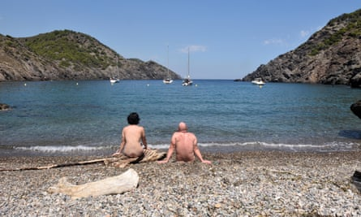
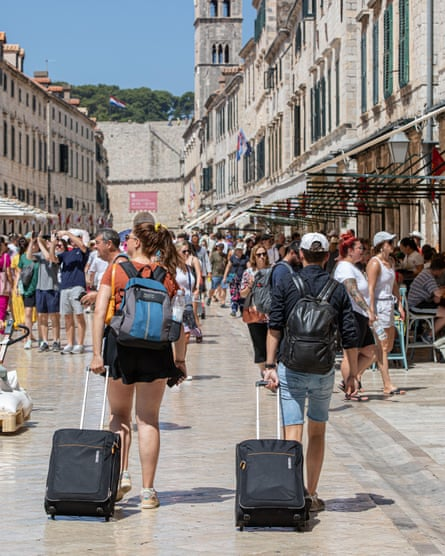
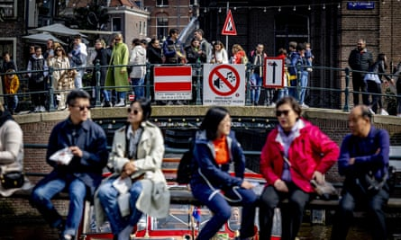

Ivan Vera, 24, has always loved the feeling of being naked. He says that when he was about 17, he “ decided to try it in public”, with his then girlfriend. Since then, “I have been very busy with the associations in Catalonia,” he tells me. The Catalan naturist-nudist scene is rich, decades-old and organised. Vera is a member of Joves Naturistes, which is for 18- to 35-year-olds; last week the all-ages Naturist-Nudist Federation of Catalonia made a [public appeal](https://www.theguardian.com/lifeandstyle/2023/aug/11/catalonian-nudists-campaign-against-clothed-tourists) for tourists wearing swimsuits to stay away from their beaches.  

24 岁的凡-维拉一直喜欢赤身裸体的感觉。他说，大约 17 岁时，他 "决定在公共场合尝试一下"，当时是和他的女朋友一起。他告诉我："从那时起，我就一直忙于加泰罗尼亚的协会活动。加泰罗尼亚的裸体主义者活动丰富多彩，有几十年的历史，而且组织严密。维拉是 Joves Naturistes 的成员，该组织面向 18 至 35 岁的年轻人；上周，加泰罗尼亚裸体自然主义者联合会公开呼吁穿着泳装的游客远离他们的海滩。

“Legally, we can practise it everywhere: there is no law against nudism in Spain,” Vera says. “But most naturists prefer to practise it in secluded areas with a tradition of it. Those areas are being invaded, mostly in the summer months, by tourists who not only wear swimsuits, but also have a very disrespectful manner to nudists. We feel displaced in our own spaces and we fear losing them.”  

"维拉说："从法律上讲，我们可以在任何地方进行裸体活动：西班牙没有禁止裸体活动的法律。"但大多数裸体主义者更喜欢在有裸体传统的僻静地区进行裸体活动。这些地区正在被游客入侵，主要是在夏季，他们不仅穿着泳装，而且对裸体主义者非常不尊重。我们在自己的空间里感到流离失所，我们害怕失去它们"。

For many naturists, the presence of people wearing bikinis is enough to alter the beach for the worse, although Vera says he doesn’t mind having clothed people around. But the behaviour isn’t great – “there are some people who harass nudists, and there are voyeuristic activities and suchlike” – and the insensitivity extends to the natural environment. “In general terms, people who are disrespectful to nudism are disrespectful to nature, and they pollute the area in all kinds of ways.”  

对于许多裸体主义者来说，穿着比基尼的人的出现足以让海滩变得更糟，尽管维拉说他并不介意周围有穿着衣服的人。但人们的行为并不高尚--"有些人骚扰裸体主义者，还有偷窥之类的活动"--而且这种麻木不仁的态度还延伸到了自然环境中。"一般来说，不尊重裸体主义的人就是不尊重自然，他们会以各种方式污染这个地区"。

Nudists in Cap de Creus on the Costa Brava in Spain. Photograph: Josep Curto/Alamy  

西班牙布拉瓦海岸克鲁斯角的裸体主义者。照片：Josep Curto/AlamyJosep Curto/Alamy

It is especially galling because the traditionally nudist beaches are chosen for their seclusion, which often coincides with picture-postcard beauty. So visitors come for the postcard (for younger readers: the Instagram backdrop), and in so doing, turn the beach from three dimensions – a place with history, community and a counter-culture – to two.  

尤其令人痛心的是，传统的裸体海滩因其隐蔽性而被选中，而隐蔽性往往与明信片上的美景相吻合。因此，游客们都是冲着明信片（对于年轻读者来说：Instagram 背景）来的，这样一来，海滩就从三维空间--一个有历史、社区和反主流文化的地方--变成了二维空间。

The public appeal for tourists in swimsuits to stay away caught the world’s attention. It animated a question playing out in beauty spots and heritage sites all over the world: when tourists flock to a place, do they change its character, wipe out its idiosyncrasies, without even noticing what those idiosyncrasies are? Is there an impact on the residents more important than a boost to ice-cream sales? Can you commodify beauty without tainting it? When does tourism become overtourism?  

公众呼吁穿着泳装的游客远离这里，引起了全世界的关注。这个问题在世界各地的名胜古迹中得到了生动的诠释：当游客蜂拥而至时，他们是否改变了一个地方的特色，抹杀了它的特质，甚至没有注意到这些特质是什么？对居民的影响是否比促进冰淇淋销售更重要？能否在不玷污美的前提下将美商品化？旅游业何时会变成过度旅游？

In the 20 years running up to Covid, international tourism doubled, to 2.4 billion arrivals in 2019. Overall, tourism last year was [at 63](https://www.unwto.org/impact-assessment-of-the-covid-19-outbreak-on-international-tourism)% of its pre-Covid levels. Every place has its own post-Covid recovery story: Thailand has taken a while and is, at a state level at least, very welcoming to visitors; France has yet to see the same numbers of Chinese and Japanese visitors as before; in Paris – the most popular destination in the world – numbers this year are expected to be almost exactly as they were four years ago, 38.5 million. But people increasingly don’t want a bounce back. Tourist transport accounts for 5% of global emissions, and people are flying into the heatwaves those create. It is all a bit on the nose.  

在科维德会议之前的 20 年里，国际旅游业翻了一番，到 2019 年抵达游客人数达到 24 亿人次。总体而言，去年的旅游人数是科维德会议前水平的 63%。每个地方都有自己在科维德事件后的复苏故事：泰国花了一段时间，至少在国家层面上对游客非常欢迎；法国的中国和日本游客数量尚未恢复到以前的水平；在巴黎--世界上最受欢迎的旅游目的地--今年的游客数量预计几乎与四年前一样，为 3850 万人次。但人们越来越不希望出现反弹。旅游交通排放的废气占全球总排放量的 5%，而人们正飞往热浪滚滚的地方。这一切都让人感到匪夷所思。

Despite the crowds that descend on Rome, the city, unlike Venice, has managed to maintain some sense of normality for residents. Photograph: Anadolu Agency/Getty Images  

尽管罗马人潮涌动，但与威尼斯不同的是，这座城市的居民仍能保持一定程度的正常生活。照片：Anadolu Agency/Getty Images阿纳多卢通讯社/盖蒂图片社

“I think it really helps to think of travelling as a kind of consumption,” says Frederik Fischer, CEO and founder of the social enterprise Neulandia, which connects creative digital workers to rural communities in Germany. “If you only consume another country, or you only consume a city, I’m not sure you’re really doing a benefit to the people and the place.”  

"社会企业Neulandia的创始人兼首席执行官弗雷德里克-菲舍尔（Frederik Fischer）说："我认为，将旅行视为一种消费确实很有帮助。"如果你只是消费另一个国家，或者只是消费一座城市，我不确定你是否真正造福了当地的人民和地方"。

Every location has a different challenge with tourists. On Catalan beaches, it may be that they are wearing too many clothes; in Barcelona, there are simply too many people. Whether that turns the entire place into a giant hotel (9.5 million people stayed in Barcelona’s hotels in 2019, a fivefold increase on 1990) or a human traffic-jam (one-way walking systems have been introduced in Barcelona’s city centre), it is impossible to imagine that being a pleasant, livable experience for the host citizens.  

每个地方都有不同的游客难题。在加泰罗尼亚海滩，可能是因为游客穿的衣服太多；而在巴塞罗那，则是人太多了。无论是把整个地方变成一个巨大的酒店（2019 年有 950 万人入住巴塞罗那的酒店，比 1990 年增加了五倍），还是人流拥堵（巴塞罗那市中心已经引入了单向步行系统），都无法想象这对当地市民来说会是一种愉快、宜居的体验。

In Dubrovnik, tourists are just too annoying. The story went around this summer that wheelie suitcases had been banned from the cobbled old town, an interdiction with quite a substantial fine (€265). In fact, it was just a video suggesting that if people would only pick up their bags, that would be a lot less grating. All the pleas in Croatia’s Respect the City campaign are modest – please don’t fool around on our statuary, or walk around shirtless – but you can hear the quiet desperation you might predict, when a city of 41,000 people greets 1.5 million tourists a year.  

在杜布罗夫尼克，游客实在太讨厌了。今年夏天，鹅卵石铺就的老城区里传出了轮式行李箱被禁的消息，罚款金额相当可观（265 欧元）。事实上，这只是一段视频，建议人们如果只捡起自己的行李，那就不会那么烦人了。克罗地亚 "尊重城市 "活动的所有呼吁都很温和--请不要在我们的雕像上胡闹，也不要光着膀子走来走去--但你可以听出，当一个只有 4.1 万人口的城市每年迎接 150 万游客时，你可能会预感到一种无声的绝望。

Tourists pull suitcases through Dubrovnik’s old town in July 2023. Photograph: Dpa Picture Alliance/Alamy  

2023 年 7 月，游客拉着行李箱穿过杜布罗夫尼克老城。照片：Dpa Picture Alliance/Alamy德新社图片联盟/阿美利加

Jon Henley, the Guardian’s Europe correspondent, based in Paris, says there is a similar story to Dubrovnik in places such as Prague and Budapest: “Wherever you’ve got a medieval city centre, those become unbearable.” Paris, with its wide boulevards and relatively large city centre, suffers less; when the French tourism minister, Olivia Grégoire, announced a strategy to prevent overtourism earlier this year, her focus was on sites such as Mont-Saint-Michel abbey in Normandy and the Channel beach Étretat, which aren’t large enough for everyone who wants to see them. In the capital, at peak tourist season, all the Parisians, including many in hospitality and retail, are away. “I quite like it in August in Paris for precisely that reason,” Henley says. “Confused-looking tourists wondering why everything’s shut.” If Paris is very tolerant of tourists, Saint-Tropez is getting close to its hard limit on the ones who [don’t tip properly](https://www.telegraph.co.uk/food-and-drink/news/french-restaurants-banning-bad-tippers-st-tropez/).  

英国《卫报》驻巴黎的欧洲记者乔恩-亨利（Jon Henley）说，布拉格和布达佩斯等地的情况与杜布罗夫尼克类似："只要有中世纪的市中心，就会变得难以忍受"。法国旅游部长奥利维亚-格雷瓜尔（Olivia Grégoire）今年早些时候宣布了一项防止过度旅游的战略，她将重点放在了诺曼底圣米歇尔山修道院（Mont-Saint-Michel abbey）和英吉利海峡海滩埃特雷塔特（Étretat）等景点上，因为这些景点的面积并不足以满足每个人的观赏需求。在首都，每到旅游旺季，所有巴黎人，包括许多酒店和零售业的人，都会外出旅游。"亨利说："正因为如此，我很喜欢八月的巴黎。"游客们一脸困惑，不知道为什么一切都关闭了。如果说巴黎对游客非常宽容的话，那么圣特罗佩对那些不给小费的游客的容忍度就快到极限了。

Amsterdam is at the vanguard of the stay-away movement. The city council decided this summer to close the cruise ship terminal in the city centre, specifically citing its sustainability goals. But there is always a subtext, which is often the text, with Dutch imprecations about tourism, which is that people (especially British people) go there specifically to behave like animals. There possibly isn’t a city in the world, medieval or not, that could cope with a visit from a group of Britons who had gone there specifically to get off their heads for 72 hours without stopping. An online campaign launched in the spring, with ads triggered whenever anyone in the UK entered “stag party Amsterdam” or “pub crawl Amsterdam” into a search engine, warned people of the possible consequences – fines, arrests, hospitalisation, making life completely miserable for residents – of hedonistic frenzy. The deputy mayor for economic affairs, Sofyan Mbarki, released a statement at the time: “Visitors are still welcome, but not if they misbehave and cause nuisance. As a city, we are saying: we’d rather not have this, so stay away.”  

阿姆斯特丹是远离游轮运动的先锋。今年夏天，市议会决定关闭市中心的游轮码头，并特别提出了可持续发展的目标。但是，荷兰人对旅游业的咒骂总是有一个潜台词，那就是人们（尤其是英国人）去那里就是为了表现得像动物一样。世界上可能没有哪座城市，无论是否是中世纪城市，能够应对一群英国人的造访，他们专门去那里不停歇地玩上 72 小时。今年春天，阿姆斯特丹发起了一场在线宣传活动，只要英国人在搜索引擎上输入 "阿姆斯特丹雄鹿派对 "或 "阿姆斯特丹酒馆爬行"，就会触发广告，警告人们享乐主义狂热可能带来的后果--罚款、逮捕、住院，让居民的生活彻底陷入悲惨境地。负责经济事务的副市长索菲安-姆巴基（Sofyan Mbarki）当时发表了一份声明："我们仍然欢迎游客，但如果他们行为不端，造成滋扰，我们就不欢迎了。作为一个城市，我们要说：我们不希望有这样的事情发生，所以请远离"。

Tourists in Amsterdam in spring this year. The city has started online campaigns against people travelling there to misbehave. Photograph: ANP/Alamy  

今年春季阿姆斯特丹的游客。阿姆斯特丹市已开始在网上宣传，反对人们到阿姆斯特丹旅游时行为不端。照片：ANP/AlamyANP/Alamy

Other cities can increasingly relate to this. A video did the rounds this week in which a woman [walks across the Trevi fountain](https://www.dailymail.co.uk/news/article-12406815/Trevi-Fountain-tourist-Rome-Italy-water-video.html) in Rome to fill her water bottle. In June, a guy was filmed carving his and his girlfriend’s names [into the Colosseum](https://edition.cnn.com/travel/rome-colosseum-ivan-hayley-graffiti-identified/index.html). Before you even consider the destinations that people go to specifically to behave badly – Aiya Napa, Amsterdam, Edinburgh, Ghent (the Belgian city is [considering banning](https://www.thetimes.co.uk/article/ghent-may-call-last-round-on-rowdy-beer-bikes-5nq52bnmx) stag party-friendly beer bikes) – there is always this problem that, as Cornish business owner Mati Ringrose says: “When you go on holiday, it’s not your place, it’s not your community, so you act completely differently, and out of character.” It cannot go unremarked that British tourists are notorious for this. The streets of “Europe’s latest booze hotspot”, Split, in Croatia, are festooned with signs in English warning of fines for public drinking, vomiting and urinating. One girl [complained](https://www.thesun.co.uk/news/23505468/split-croatia-battle-drunken-brit-tourists-businesses/) to a reporter this week that the fines were unfair, as she was quite likely to vomit, having had too many “anus burners” (shots of tequila, orange juice and tabasco).  

其他城市也越来越能体会到这一点。本周流传的一段视频中，一名女子走过罗马的许愿池，为自己的水瓶注水。今年 6 月，一名男子被拍到在罗马斗兽场上刻下自己和女友的名字。在你还没有考虑人们专门去那些行为不端的目的地之前--艾亚-纳帕、阿姆斯特丹、爱丁堡、根特（比利时城市正在考虑禁止雄鹿派对专用的啤酒自行车）--总是存在这样一个问题，正如康沃尔企业主马蒂-林罗斯所说："当你去度假时，那里不是你的地方，不是你的社区，所以你的行为完全不同，而且出格。"英国游客在这方面可谓臭名昭著。在 "欧洲最新的酗酒热点 "克罗地亚的斯普利特，街道上随处可见用英语写的警告牌，警告游客在公共场合酗酒、呕吐和小便将被罚款。本周，一名女孩向记者抱怨说，罚款是不公平的，因为她喝了太多的 "肛门燃烧弹"（龙舌兰酒、橙汁和塔巴斯科酒），很可能会呕吐。

Then there are digital nomads, itinerant workers who, every month or two, move between beauty spots in locations such as Bali, Mexico City, Lisbon, Chiang Mai in Thailand and Medellín in Colombia. These people would style themselves as the opposite of tourists, although as Dave Cook, an anthropologist at University College London, says: “I’d speak to the Chiang Mai coffee shop owner, and they’d say: ‘they’re in a coffee shop and they’re speaking English, so as far as we’re concerned, they’re just tourists.’” Before the pandemic, Cook says, lifestyle migration was a very niche phenomenon, which would include expats but was more of a counter-cultural movement, people specifically rejecting the worker-bee ethic of life in an office. Since Covid, there have been more strands: the freelance knowledge worker, the digital nomad business owner and the salaried digital nomad, which was more or less unheard of pre-pandemic. “Digital nomads talk about ‘dating’ locations: they’re geographically polyamorous,” Cook says. “Resentment can creep in, but what happens in reality is digital nomads might fall in love, but the locals have an intuitive understanding that they’re going to be left.”  

还有一些 "数字游牧民族"，他们是流动工作者，每隔一两个月就会在巴厘岛、墨西哥城、里斯本、泰国清迈和哥伦比亚麦德林等地的美景之间穿梭。这些人会把自己打扮成游客的反面，不过正如伦敦大学学院人类学家戴夫-库克（Dave Cook）所说："我跟清迈咖啡店的老板说，他们会说：'他们在咖啡店里说英语，所以就我们而言，他们只是游客'。库克说，在大流行病发生之前，生活方式移民是一种非常小众的现象，其中包括外籍人士，但更多的是一种反文化运动，人们特别拒绝办公室里的工蜂式生活。自科维德运动以来，出现了更多的分支：自由职业知识工作者、数字游牧企业主和受薪数字游牧者，这在大流行之前几乎闻所未闻。"库克说："数字游民谈论的是'约会'地点：他们在地理上是多配偶的。"怨恨可能会悄然而至，但现实情况是，数字游牧者可能会坠入爱河，但当地人会直观地认识到他们将被抛弃。

Digital nomads have altered rental prices in many cities, such as Lisbon, beyond recognition. Photograph: mgstudyo/Getty Images  

数字游民让里斯本等许多城市的房租价格发生了翻天覆地的变化。照片：mgstudyo/盖蒂图片社

What people often object to about visitors, whether they are tourists, expats, retirees or digital nomads, is what they do to property prices. Lisbon is the prime example of a city altered beyond recognition, to many people’s eyes denatured by an influx of people who could just afford higher rents. Michael Oliveira Salac, who is half-British, half-Portuguese and splits his time between London and the Algarve, says it was a combination of tourists and nomadic financial technology workers, who, between creating Airbnb demand and being able to afford much higher long-term rents, forced Lisbon residents out of the city. The minimum wage in Portugal is €760 (£650) a month. It is not possible to compete with an influx of people paying €1,000 a month for a two-bed and laughing about how cheap that is. That creates a cascade effect, Oliveira Salac says. “The main avenue, where there used to be old multibrand boutiques, now Gucci has come in, Prada has come in, so that’s shot the rents up.” The newcomers “want sushi, they want Thai food, they want vegan. The old lot can’t cater to that, so they’ve shut down. Lisbon has lost its soul.” And that picture has played out in Porto, even in some towns in the Algarve: Portugal sits on this axis, where it is comparatively cheap, very beautiful and in the right time zone for a lot of nomads, which from a resident’s perspective is a curse, like sitting on a fault line.  

无论是游客、外籍人士、退休人员还是 "数字游民"，人们通常反对的是游客对房价造成的影响。里斯本就是一个典型的例子，在许多人眼里，这座城市已经面目全非，因为大量涌入的人只需付得起更高的房租，就能让这座城市变质。迈克尔-奥利维拉-萨拉克（Michael Oliveira Salac）有一半英国血统，一半葡萄牙血统，常年往返于伦敦和阿尔加维之间。葡萄牙的最低工资为每月 760 欧元（650 英镑）。这就无法与大量涌入的人竞争，这些人每月支付 1000 欧元购买两居室，并嘲笑这是多么便宜的价格。奥利维拉-萨拉克说，这会产生连带效应。奥利维拉-萨拉克说："主干道上以前都是老牌的多品牌精品店，现在古驰（Gucci）、普拉达（Prada）都来了，所以租金也随之上涨"。新来者 "想要寿司、泰国菜、素食。老店无法满足他们的需求，所以就关门了。里斯本失去了灵魂。"这种情况在波尔图，甚至在阿尔加维的一些城镇也在上演：葡萄牙位于这条轴线上，这里相对便宜，非常美丽，对很多游牧民族来说又处于合适的时区，从居民的角度来看，这就是一种诅咒，就像坐在断层线上一样。

A woman holds a poster calling for lower rents at a large protest against the housing crisis in Lisbon, in April 2023. Photograph: Gonçalo Fonseca/The Observer  

2023 年 4 月，在里斯本举行的一场针对住房危机的大型抗议活动中，一名妇女手持海报，呼吁降低房租。照片：Gonçalo Fonseca/《观察家报Gonçalo Fonseca/《观察家报

Venice is probably ground zero of the overtoured effect; tourists and residents have hit bed-for-bed parity, which makes normal life in the service of anything other than a tourist unviable. It creates a theme-park effect, to which even Rome – home to the most melodramatic monuments – hasn’t succumbed. In Rome, you can still at least glimpse the life underneath the day trip; in Venice, despite a recent [clampdown](https://www.theguardian.com/world/2021/jul/13/italy-bans-cruise-ships-from-venice-lagoon-after-unesco-threat) on city-dwarfing cruise ships, Unesco recently [threatened to “blacklist”](https://www.euronews.com/travel/2023/08/01/unesco-threatens-to-blacklist-venice-if-italy-doesnt-start-to-look-after-historical-sites/) the city as a world heritage site, citing Italy’s failure to protect it from mass tourism and the climate crisis.  

威尼斯可能是 "过度旅游效应 "的发源地；游客和居民的床位已经达到了对等，这使得为游客以外的任何其他事物服务的正常生活难以为继。这造成了一种主题公园效应，即使是罗马--最富戏剧性的古迹所在地--也没有屈服于这种效应。在罗马，你至少还能瞥见一日游之下的生活；在威尼斯，尽管最近取缔了与城市相形见绌的游轮，但联合国教科文组织最近威胁要把这座城市列入世界遗产 "黑名单"，理由是意大利未能保护它免受大规模旅游和气候危机的影响。

You have to wonder whether it is worth it. Ringrose, who runs a shop in Redruth in Cornwall, isn’t technically homeless because she lives in a van with her seven-month-old child, but she says even parking charges have skyrocketed. “I have so many friends in emergency housing, it’s insane,” she says. In the summer, Cornish resort towns such as St Ives are so crowded that Ringrose has a disabled friend who has to move out because she can’t get down the street. Then, in the winter, she says: “There are whole towns that you go in and there’s no lights on half the year. There’s nothing open. There are no pubs there. Whole swathes of what used to be communities are shut down. It massively affects the mentality of the county.”  

你不得不怀疑这样做是否值得。林罗斯（Ringrose）在康沃尔郡的雷德鲁思（Redruth）经营一家商店，严格来说，她并不是无家可归者，因为她带着七个月大的孩子住在一辆面包车里，但她说，连停车费都飞涨了。"她说："我有很多朋友都住在紧急住房里，这太疯狂了。夏天，圣艾夫斯等康沃尔度假小镇非常拥挤，林罗斯有一位残疾朋友不得不搬走，因为她无法在街上行走。而到了冬天，她说："你走进整个小镇，一年中有一半的时间都没有亮灯。什么都不开。那里没有酒吧。整个社区都关闭了。这极大地影响了人们的心态"。

Redruth is relatively untouched by tourism because it is not coastal, and “it’s a really deprived area,” Ringrose says, “but it’s not deprived of community. Redruth is ridiculously rich in nice people, because it’s not a tourist town.” Ringrose tells me about a beach in Polzeath with a fence in the middle that someone built to stop people walking along the bottom of their garden. She tells me about the woman at a car boot sale who bought a jumper off her for a tenner, and asked her to split a £50 note. “I have never been given a 50 in a car boot, ever.” At the planning level, at the level of society, every desirable place on earth will have a variant of the Cornish question: if tourism brings in 12% of its income, yet takes up almost all of its housing, so that the lives of the residents don’t function any more, how can that be OK. At the level of the tourist or the nomad, the proposition is as simple, but an easier fix: look around – if everyone else is naked, either get naked or go away.  

雷德鲁思因为不是沿海地区，所以相对来说没有受到旅游业的影响。"这里是一个非常贫困的地区，"Ringrose 说，"但这里并不缺乏社区。雷德鲁思有很多好人，因为它不是一个旅游城市。林格罗斯告诉我，波尔泽斯的一个海滩中间有一道栅栏，有人为了阻止人们沿着自家花园的底部行走而修建了这道栅栏。她还告诉我，在汽车后备箱拍卖会上，有位女士花 10 英镑从她手里买了一件毛衣，并要求她分一张 50 英镑的纸币。"我从来没有在汽车后备箱里得到过50英镑，从来没有"。在规划层面，在社会层面，地球上每一个令人向往的地方都会有一个康沃尔问题的变种：如果旅游业带来了12%的收入，却占用了几乎所有的住房，以至于居民的生活无法继续，这怎么能行呢？对于游客或游牧民族来说，这个问题同样简单，但却更容易解决：环顾四周--如果其他人都赤身裸体，要么赤身裸体，要么离开。
