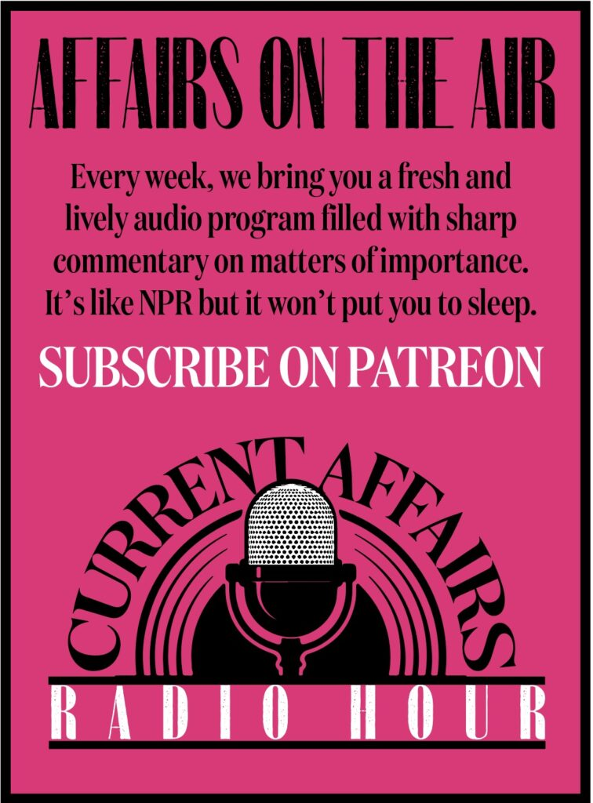
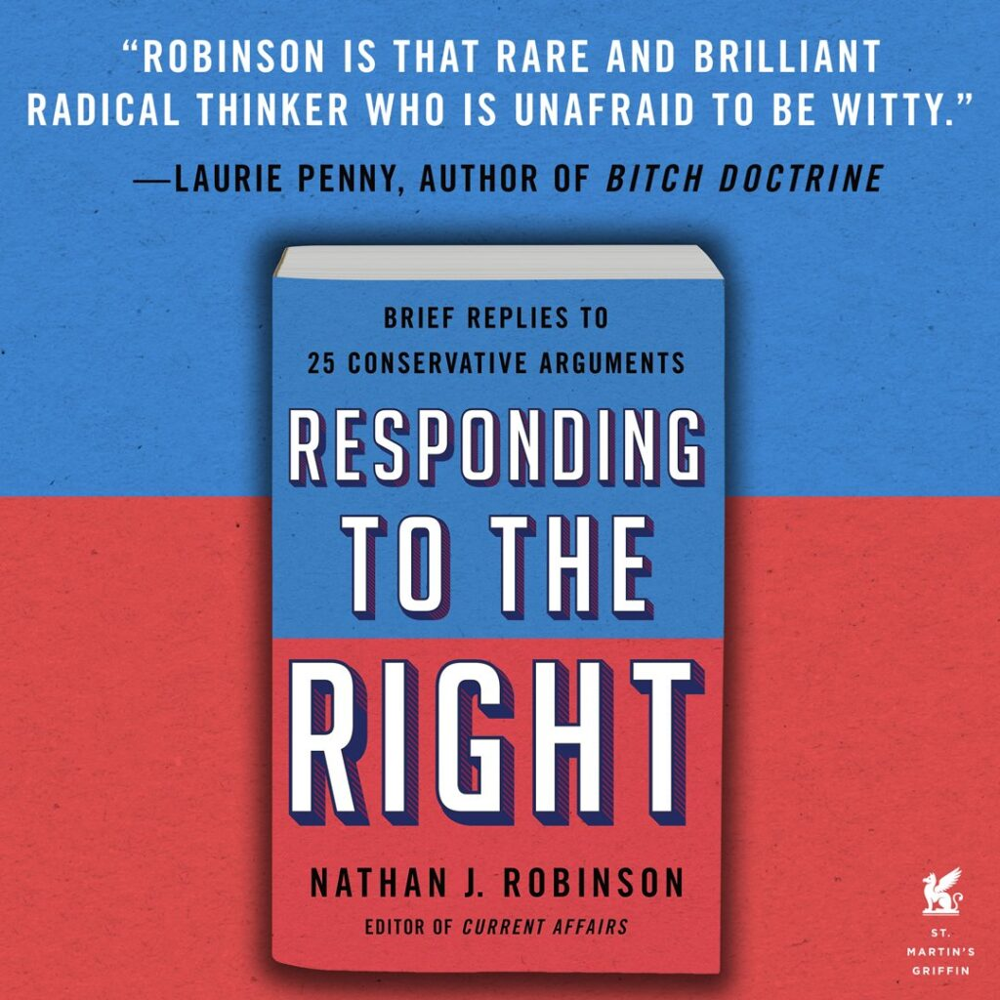
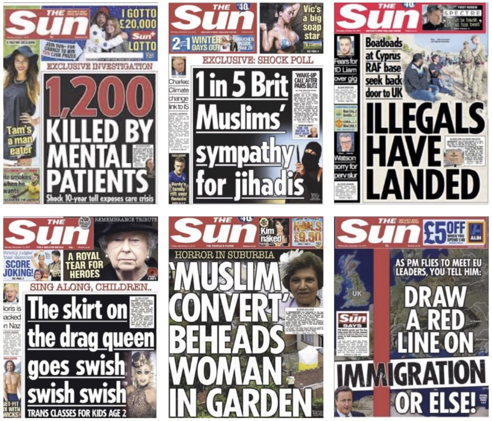
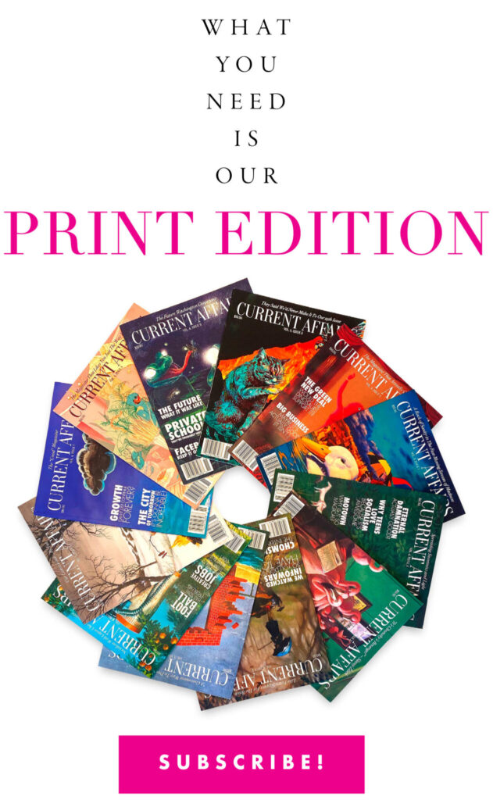
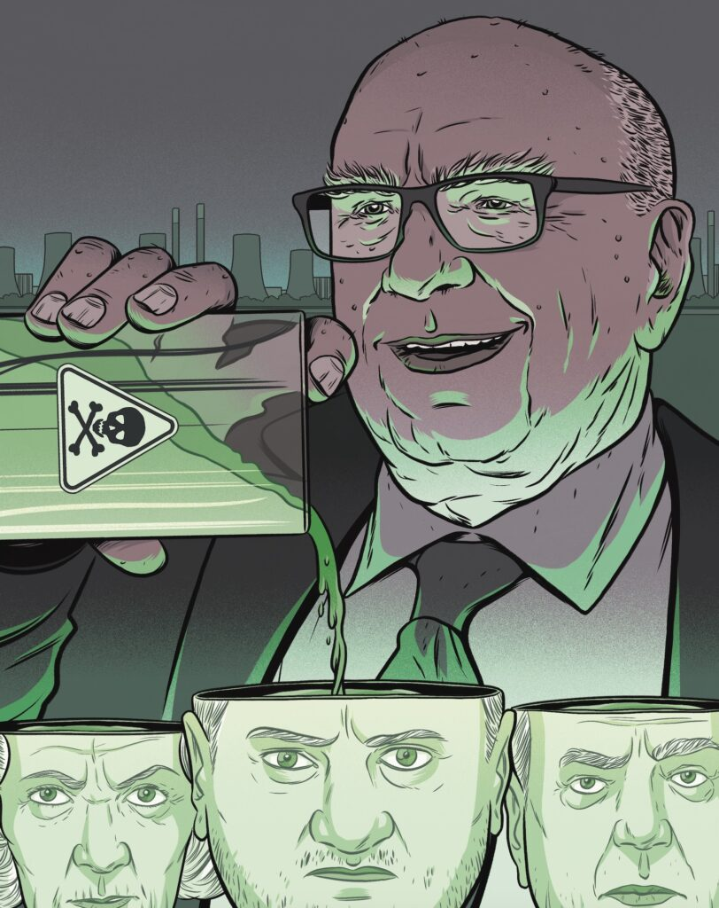
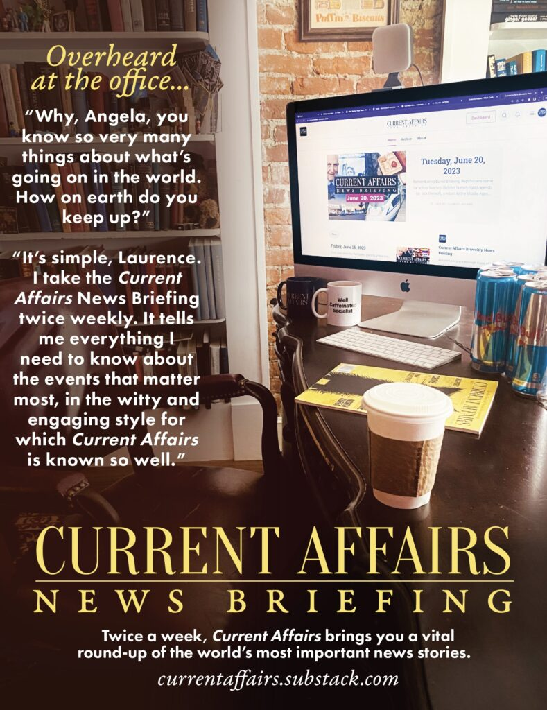

Apparently, when Tucker Carlson was fired from his job as a host on Fox News in April of this year, he was [“stunned” and “blindsided.”](https://www.vanityfair.com/news/2023/04/tucker-carlson-fox-news-fired) After all, he was the No. 1 rated host in all of cable news. He was talked about constantly, both by those who hated him and those who loved him. He seemed untouchable. He was clearly a major asset to the network; as soon as he left, [ratings plummeted](https://www.newsweek.com/tucker-carlson-departure-fox-news-ratings-msnbc-1799153).   

显然，当塔克-卡尔森今年 4 月被福克斯新闻解雇时，他 "惊呆了"、"懵了"。毕竟，他曾是有线电视新闻中收视率第一的主持人。无论是讨厌他的人还是喜欢他的人，都对他津津乐道。他似乎是不可触碰的。他显然是电视台的重要资产；他一离开，收视率就直线下降。

But Tucker Carlson had clearly forgotten who he worked for. He had assumed, like many others before him, that his job was to make money for the network, and if he was making money for the network, his position was secure.   

但塔克-卡尔森显然忘了自己是为谁工作的。他和之前的许多人一样，以为自己的工作就是为电视台赚钱，如果能为电视台赚钱，他的地位就稳固了。

This is not how it works. This might have been a rational assumption in an “Econ 101” world, where the capitalist looks only to maximize profits, and if you are a useful cog in the profit-machine, you can expect not to be replaced. But in the real world, corporations can operate a lot more like feudal estates than money machines. Whether your position is secure depends on whether you please the emperor who sits atop the organizational hierarchy. At Fox News, the emperor is Rupert Murdoch. And if you displease Rupert Murdoch, you’re toast.   

事情并非如此。在 "经济学 101 "的世界里，这可能是一个合理的假设，在那里，资本家只追求利润最大化，如果你是利润机器上一个有用的齿轮，你就可以期望不会被取代。但在现实世界中，公司的运作更像是封建庄园，而不是赚钱机器。你的地位是否稳固，取决于你是否能取悦坐在组织层级顶端的皇帝。在福克斯新闻，皇帝就是鲁伯特-默多克。如果你让鲁伯特-默多克不高兴，你就完蛋了。

As conservative commentator Andrew Neil explained in [a 1996 book](https://www.amazon.com/Full-Disclosure-Andrew-Neil/dp/0333693736), recalling his time in Murdoch’s employ:   

保守派评论员安德鲁-尼尔（Andrew Neil）在 1996 年出版的一本书中回忆了他受雇于默多克的时光：

> __When you work for Rupert Murdoch you do not work for a company chairman or chief executive: you work for a Sun King. You are not a director or a manager or an editor: you are a courtier at the court of the Sun King—rewarded with money and status by a grateful King as long as you serve his purpose, dismissed outright or demoted to a remote corner of the empire when you have ceased to please him or outlived your usefulness.  
> 
> 当你为鲁珀特-默多克工作时，你不是为公司董事长或首席执行官工作，而是为太阳王工作。你不是一名董事、经理或编辑：你是太阳王宫廷里的一名臣子，只要你能达到太阳王的目的，他就会赏赐你金钱和地位；当你不再讨太阳王的欢心或失去利用价值时，他就会直接将你解雇，或将你贬到帝国的一个偏僻角落。__

Carlson wasn’t the first network star to be unceremoniously ditched upon displeasing the Sun King. Years before, Glenn Beck had been a ratings powerhouse on Fox News. But Murdoch [came to dislike](https://slate.com/news-and-politics/2011/07/glenn-beck-s-departure-murdoch-and-company-mark-the-depths-to-which-even-they-will-no-longer-descend.html) Beck, whether because of his independence from the network or his controversy-courting clownishness ([standing on his desk wearing lederhosen](https://www.thedailybeast.com/glenn-beck-in-lederhosen), [drawing conspiracy diagrams on a blackboard](https://media.vanityfair.com/photos/582247b7af70ea5e7082bca6/master/w_1400,h_933,c_limit/t-glenn-beck-on-barack-obama-fox-news.jpg)), and so Beck was exiled. His national profile has not been the same since.  

卡尔森并不是第一个因 "太阳王 "不高兴而被无情抛弃的网络明星。多年前，格伦-贝克（Glenn Beck）曾是福克斯新闻的收视明星。但默多克开始不喜欢贝克，不管是因为他独立于电视网，还是因为他的争议性小丑行为（站在他的办公桌上，穿着莱德霍森服装，在黑板上画阴谋图），贝克因此被放逐。自那以后，他在全国的知名度一落千丈。

When Tucker Carlson pushed “white genocide” theory, or Glenn Beck argued that Barack Obama was a secret Marxist radical, or Bill O’Reilly [viciously smeared a 9/11 victim’s son](https://www.nydailynews.com/news/national/small-sampling-worst-moments-o-reilly-factor-article-1.3079560), the ensuing controversies surrounded the pundits themselves. What kind of influence is _Beck_ on the country? Is _Tucker_ whipping up fascistic hatreds? But these are the wrong people to analyze, because everything these men said was in fact the ultimate responsibility of one man, Keith Rupert Murdoch. It was Murdoch who built the network, Murdoch who put these men on the air, and Murdoch who decided whether they should stay or go. Whether Tucker Carlson would continue poisoning minds with tales of [defecating “gypsies”](https://twitter.com/TuckerCarlson/status/887115275249885184?lang=en) and criminal immigrants depended entirely on whether Rupert Murdoch _wanted_ Carlson to go on doing this. Every single horrific thing said on Fox News is ultimately not coming from the performing puppets whose mouths it comes out of, but from Murdoch, who built the theater and pulls the strings.   

当塔克-卡尔森推崇 "白人种族灭绝 "理论时，当格伦-贝克认为巴拉克-奥巴马是秘密的马克思主义激进分子时，当比尔-奥莱利恶毒地抹黑 9/11 事件受害者的儿子时，随之而来的争议都围绕着这些专家本身。贝克对这个国家有什么样的影响？塔克是否在煽动法西斯仇恨？但这些都是不该分析的人，因为这些人所说的一切其实都是一个人--基思-鲁珀特-默多克--的最终责任。是默多克建立了这个网络，是默多克让这些人上了节目，是默多克决定了他们的去留。塔克-卡尔森是否会继续用排泄物 "吉普赛人 "和犯罪移民的故事毒害人们的思想，完全取决于鲁珀特-默多克是否希望卡尔森继续这样做。福克斯新闻上的每一句骇人听闻的话，最终都不是出自表演木偶之口，而是出自默多克之口，是他建造了这个剧院，并牵动了这根线。

This isn’t conspiracy; it’s simple fact. Rupert Murdoch built the company. Rupert Murdoch is the [one who hired Roger Ailes](https://www.nytimes.com/2016/07/22/business/media/how-fox-newss-influence-grew-under-roger-ailes.html), the [paranoid](https://www.theatlantic.com/national/archive/2014/01/inside-paranoid-world-fox-newss-roger-ailes/356819/), psychotic [sexual predator who turned](https://www.nytimes.com/2017/05/18/business/media/roger-ailes-dead.html) Fox News into a mouthpiece for delusional right-wing conspiracies and culture war nonsense (and in the process, made it the highest-rated cable news channel in the country). Rupert Murdoch played a key role in establishing the rancid “gutter journalism” that dominates U.K. print newspapers. He owns the _Wall Street Journal_, which uses its widely-read editorial pages to push outright [climate change denial](https://www.currentaffairs.org/2019/01/if-you-cant-deny-it-downplay-it) and rabid opposition to every [redistributive social program](https://www.google.com/search?q=wall+street+journal+welfare+op+ed&rlz=1C5CHFA_enUS903US903&oq=wall+street+journal+welfare+op+ed&aqs=chrome..69i57j33i160l2j33i22i29i30l4.4876j1j7&sourceid=chrome&ie=UTF-8#ip=1). Murdoch has probably been, over the last half century, the single most important figure in U.S. and U.K. media. No other person has had as much reach. Without Fox News, the Trump presidency would have been inconceivable. Two of Murdoch’s U.S. papers (the _WSJ_, the _New York Post_) are among the [top five](https://www.infoplease.com/culture-entertainment/journalism-literature/top-100-newspapers-united-states) most read in the country, and [in the U.K.](https://en.wikipedia.org/wiki/List_of_newspapers_in_the_United_Kingdom_by_circulation) _The Sun_ and _The Times_ are among the leading papers. News Corp’s HarperCollins is one of the “Big 5” U.S. publishers.   

这不是阴谋，而是简单的事实。鲁珀特-默多克创建了这家公司。鲁珀特-默多克雇佣了罗杰-艾尔斯（Roger Ailes），这位偏执狂、精神病性掠夺者将福克斯新闻变成了妄想右翼阴谋和文化战争胡言乱语的喉舌（在此过程中，福克斯新闻成为了全美收视率最高的有线新闻频道）。鲁珀特-默多克（Rupert Murdoch）在英国纸质报纸 "阴沟新闻 "的形成过程中起到了关键作用。他拥有《华尔街日报》，该报利用其广为阅读的社论版，公然否认气候变化，狂热反对每一个再分配的社会计划。在过去的半个世纪里，默多克可能是美国和英国媒体界最重要的人物。默多克的影响力无人能及。如果没有福克斯新闻，特朗普当选总统将是不可想象的。默多克的两份美国报纸（《华尔街日报》和《纽约邮报》）跻身全美阅读量最高的前五名，在英国，《太阳报》和《泰晤士报》也是领先的报纸之一。新闻集团旗下的哈珀柯林斯是美国 "五大 "出版商之一。

Yet perhaps the greatest trick Rupert Murdoch has pulled is to keep people from noticing just how powerful and influential he is. Murdoch keeps a low profile. He’s not the one people get outraged at. To the extent that Murdoch himself makes the news, it is usually over the family drama about his marriages and his children. The question of which Murdoch child will inherit what, and how they handle their different pieces of the empire, has proved so fascinating to people that it has [inspired](https://nymag.com/intelligencer/article/succession-based-on-rupert-murdoch-drama.html) the popular HBO series _Succession_. (Personally, I cannot get into the show, despite its quality writing and acting, because I cannot bring myself to care in the slightest about the drama of what these rich sociopaths will be bequeathed.) It’s understandable why the family stuff fascinates, especially the juicy tidbits about sociopathic personal behavior. (Murdoch told one of his wives he was divorcing her by sending an tersely-worded [email that said](https://www.ndtv.com/world-news/rupert-murdoch-sent-11-word-email-to-end-marriage-with-jerry-hall-3947968#:~:text=Mr%20Murdoch%20got%20married%20to,a%20report%20in%20The%20Guardian.), “We certainly had some good times, but I have much to do.”) But we should step back and look at Murdoch’s kingdom as a whole, and appreciate the sheer scale of his power. When we do, it becomes clear that many of the worst features of American political life today (climate denial, anti-trans panic, suspicion and fear of various Others) are being made much worse by a vast institution, News Corp, that is ultimately accountable to a single man. It is not accurate to say that Rupert Murdoch is mostly responsible for everything that is wrong. But I think it is right to say that he is _more_ responsible than any other living person. I don’t think anyone else has personally done more harm or contributed more social toxicity. I won’t go so far as ex-_New York Times_ editor Bill Keller, who called Murdoch “[the Antichrist](https://slate.com/news-and-politics/2008/04/rupert-murdoch-proves-that-he-s-not-the-antichrist-at-georgetown-university.html).” But if there is one person truly doing the Devil’s bidding on Earth today, it is Murdoch.   

然而，鲁珀特-默多克最大的诀窍也许就是不让人们注意到他有多么强大和有影响力。默多克行事低调。人们不会对他感到愤怒。即使默多克本人成为新闻人物，也通常是因为他的婚姻和孩子们的家庭闹剧。默多克的哪个孩子将继承什么，以及他们如何处理各自不同的帝国份额，这些问题对人们来说是如此的引人入胜，以至于 HBO 的热门剧集《接班人》（Succession）也受此启发。(就我个人而言，尽管该剧的编剧和演技都很出色，但我还是无法入戏，因为我根本无法让自己关心这些反社会的富豪们会继承什么遗产）。这也就不难理解为什么家族的事情会让人着迷，尤其是那些关于反社会者个人行为的花边新闻。(默多克告诉他的一位妻子，他要和她离婚，并发送了一封措辞简洁的电子邮件，其中写道："我们当然有过一些美好的时光，但我还有很多事情要做！"）。但是，我们应该退一步，将默多克的王国作为一个整体来看待，欣赏他的权力规模。当我们这样做的时候，就会清楚地看到，当今美国政治生活中许多最糟糕的现象（否认气候、反变性恐慌、对各种 "他人 "的怀疑和恐惧）都被一个庞大的机构--新闻集团--变得更加糟糕，而这个机构最终只对一个人负责。说鲁珀特-默多克要对一切错误负主要责任并不准确。但我认为，说他比其他任何在世的人都要负更大的责任是正确的。我不认为还有其他人造成了更大的个人伤害或更多的社会毒害。前《纽约时报》编辑比尔-凯勒（Bill Keller）曾称默多克为 "反基督者"，我不会像他说得那么过分。"但是，如果说当今地球上有一个人真正在为魔鬼卖命，那就是默多克。

___

Keith Rupert Murdoch is not exactly a self-made man. He was born into one of the most influential families in Australia. His granduncle, Sir Walter Murdoch, was a prominent academic for whom [Murdoch University](https://www.murdoch.edu.au/news/articles/how-did-murdoch-university-get-its-name) (and the suburb, Murdoch, in which it is located) was named. His father, Sir Keith Murdoch, was a wealthy newspaper proprietor, and upon the senior Keith’s death in 1952, Rupert inherited the family business. Rupert Murdoch had only just graduated from Oxford when he took over _The News_, an Adelaide newspaper that he used to begin the construction of a globe-spanning media empire.   

基思-鲁珀特-默多克并非白手起家。他出生在澳大利亚最有影响力的家族之一。他的叔祖父沃尔特-默多克爵士是一位著名学者，默多克大学（以及默多克大学所在的郊区）就是以他的名字命名的。他的父亲基思-默多克爵士是一位富有的报业经营者，1952 年，老基思去世后，鲁珀特继承了家族企业。鲁珀特-默多克刚从牛津大学毕业，就接手了阿德莱德的《新闻报》，并借此开始建立一个横跨全球的媒体帝国。

The story of Rupert Murdoch’s rise has been told in at least half a dozen books, and it’s pretty easy to tell: in Australia, he bought newspapers, then used the money he made from those newspapers to buy more newspapers (he would eventually own [70 percent](https://www.npr.org/2011/07/22/138596187/murdochs-mom-foreshadowed-tabloid-troubles) of Australian newspapers). Then he went to the U.K. and bought still more newspapers. (Murdoch would go on to [destroy the power of the U.K. print workers unions](https://en.wikipedia.org/wiki/Wapping_dispute).) Then he came to the United States and bought more newspapers before expanding into film and television through 20th Century Fox and Fox Broadcasting. Books about Murdoch are filled with the intricacies of his dealmaking, and a common picture emerges: Murdoch is ruthless and predatory, making promises and then breaking them, and has taken on infamously vicious fellow moguls and won. A lot of people who have worked with Murdoch bear lasting grudges, because he disposes of them as soon as they cease to be useful to him and is far more committed to his own power and his bottom-line than his word. Journalists with integrity can be horrified to find Murdoch has taken over their company. When Murdoch bought the _Chicago Sun-Times_, its star columnist Mike Royko immediately quit, [quipping](https://www.nytimes.com/1984/01/15/us/columnist-s-defection-sets-stage-for-chicago-newspaper-war.html) that “no self-respecting fish would be wrapped in a Murdoch newspaper.”  

关于鲁珀特-默多克的崛起故事，至少有六七本书已经讲过，而且很容易讲：在澳大利亚，他买下报纸，然后用从这些报纸上赚到的钱买下更多的报纸（他最终拥有澳大利亚报纸 70% 的股份）。然后，他去了英国，买下了更多的报纸。(默多克后来摧毁了英国印刷工人工会的力量。）然后，他来到美国，在通过 20 世纪福克斯公司和福克斯广播公司进军电影和电视业之前，又收购了更多的报纸。关于默多克的书籍充斥着他错综复杂的交易过程，从中可以看出一个共同点：默多克冷酷无情、掠夺性强，许下诺言后就会食言，他曾与恶名昭彰的大亨们交手并获胜。许多与默多克共事过的人都怀恨在心，因为一旦这些人对他不再有用，他就会立即将其除掉，而且他对自己的权力和底线的承诺远远超过了他的诺言。正直的新闻记者如果发现默多克接管了他们的公司，会感到非常震惊。当默多克收购《芝加哥太阳时报》时，该报的明星专栏作家迈克-罗伊科立即辞职，并声称 "没有一条有自尊的鱼会被默多克的报纸包养"。

Indeed, Murdoch’s newspapers are infamous for the depths of their sleaze. Shortly after Murdoch took over the U.K.’s _The Sun_ in 1969, the paper introduced the “Page 3 girl” feature, which was literally just a picture of a topless model on the third page of the paper. Some of the models were [as young as 16](https://nymag.com/intelligencer/2015/01/history-of-the-suns-controversial-page-3.html). Despite the consistent opposition of feminists, _The Sun_’s circulation doubled within a year.   

事实上，默多克的报纸因其淫秽程度之深而臭名昭著。1969 年，默多克接手英国《太阳报》后不久，该报就推出了 "第三版女郎 "专题，即在报纸第三版刊登赤裸上身的模特照片。有些模特只有 16 岁。尽管女权主义者一直反对，《太阳报》的发行量还是在一年内翻了一番。

For Murdoch newspapers, ordinary notions of journalistic ethics simply went out the window. As Ryan Chittum [wrote](https://archives.cjr.org/the_audit/rupert_murdoch_and_the_corpora.php?page=all) in the _Columbia Journalism Review_, “Murdoch just never bought into—indeed, he sneers at it—the ethical edifice that journalism as an institution built up over the last half a century or so,” and “few so aggressively laid bare their disregard for standards, both journalistic and societal.” They [openly practiced](https://archives.cjr.org/the_audit/checkbook_journalisms_slippery.php) checkbook journalism, [illegally bribing British police officers](https://www.upi.com/Top_News/World-News/2012/02/28/Murdoch-Illegal-payoffs-are-of-the-past/UPI-17561330416000/) and other officials for sensational stories and gossip. Their paparazzi terrorized celebrities, making their lives a misery. Hugh Grant, in his ongoing lawsuit against _The Sun_, [alleges](https://www.reuters.com/world/uk/actor-hugh-grants-can-pursue-some-claims-murdoch-paper-others-too-late-london-2023-05-26/) that its reporters “used private investigators to tap his landline phone, place listening and tracking devices on his house and car, burgle his property and obtain his private information by deception.”   

对于默多克的报纸来说，普通的新闻道德观念根本不值一提。正如瑞安-奇图姆在《哥伦比亚新闻评论》中写道："默多克从不相信--事实上，他对此嗤之以鼻--新闻业作为一个机构在过去半个多世纪里建立起来的道德大厦"，"很少有人如此咄咄逼人地暴露出他们对新闻和社会标准的漠视"。他们公开实行支票簿新闻，非法贿赂英国警察和其他官员，以获取轰动性报道和八卦新闻。他们的狗仔队恐吓名人，让他们的生活苦不堪言。休-格兰特在目前对《太阳报》提起的诉讼中称，该报记者 "使用私家侦探窃听他的座机电话，在他的住宅和汽车上安装窃听和跟踪装置，盗窃他的财产，并通过欺骗手段获取他的私人信息"。

Murdoch papers used blatantly criminal methods to get stories. For years, they hacked into celebrities’ phones and listened to their voicemail messages. The illegal invasions of privacy were totally shameless; they even hacked into the phones of murder victims and the families of dead soldiers, all in the search for juicy tidbits to print in the tabloid papers. As evidence of the extent of Murdoch’s papers’ criminal activity mounted, there was outrage in the U.K. A number of Murdoch underlings were dismissed, a few editors were charged with crimes, the _News of the World_ was forced to close, some big legal settlements were made, and News Corp issued some public apologies promising to Do Better. But the Godfather himself, Murdoch, escaped pretty much unscathed. He didn’t go to prison, he didn’t lose his empire, and he was able to successfully shift most of the blame onto others. A parliamentary select committee report [found that](https://www.politico.com/story/2012/05/report-murdoch-not-a-fit-person-075778) Murdoch “exhibited wilful blindness to what was going on in his companies and publications” and said he was “not a fit person to exercise the stewardship of a major international company.” But while this sounds damning, it is actually unduly generous to Murdoch because it allowed him to get away with pleas of supposed blindness rather than outright complicity. (In private, Murdoch dismissed the scandal as being over “[next to nothing](https://www.channel4.com/news/murdoch-rupert-tape-police-the-sun-journalists)” and claimed the criminal acts were standard tabloid practices.)    

默多克的报纸公然使用犯罪手段来获取新闻。多年来，他们侵入名人的电话，窃听他们的语音邮件。这些非法侵犯隐私的行为完全是无耻的；他们甚至侵入了谋杀案受害者和阵亡士兵家属的电话，所有这些都是为了在小报上寻找有价值的花边新闻。一些默多克的下属被解雇，一些编辑被指控犯罪，《世界新闻报》被迫关闭，一些大的法律赔偿被达成，新闻集团也公开道歉，承诺会做得更好。但 "教父 "默多克本人几乎毫发无损。他没有入狱，没有失去他的帝国，还成功地将大部分责任推卸给了他人。议会特别委员会的一份报告认为，默多克 "对其公司和出版物中发生的事情故意视而不见"，并称他 "不适合管理一家大型国际公司"。虽然这听起来令人震惊，但实际上对默多克过于宽容，因为这让他可以以所谓的 "视而不见 "而不是彻底的共谋来脱罪。(私下里，默多克将这起丑闻斥之为 "几乎没有什么"，并声称这些犯罪行为是小报的标准做法）。

It’s very unlikely that Murdoch would be blind to _anything_ going on in his companies. One thing made clear in various Murdoch biographies is that, unlike at many other giant corporations, where power is distributed across many executives, at News Corp Murdoch really does rule like a king. His aides call themselves “henchmen,” his board exercises little oversight, and, as Andrew Neil [put it](https://www.theguardian.com/business/2002/jan/06/pressandpublishing.media), “outside of Rupert, there is no real management.”   

默多克不可能对自己公司发生的任何事情视而不见。在默多克的各种传记中，有一点非常明确，那就是与许多其他巨头公司的权力分散在众多高管手中不同，默多克在新闻集团的统治确实像国王一样。他的助手自称为 "随从"，他的董事会几乎不进行监督，正如安德鲁-尼尔所说，"在鲁珀特之外，没有真正的管理层"。

And of course, none of the ruthless methods are in the service of producing public interest journalism. Murdoch is known to love “gossip,” and papers like the _Sun, News of the World_, and _New York Post_ are stuffed with “who’s sleeping with who” news about famous people. “If you think we’re going to have any of that upmarket shit in our paper, you’re very much mistaken,” Murdoch told a _Sunday Times_ journalist who had praised the journalism of rival paper _The Mirror_. Some of the stuff in Murdoch tabloids was fairly innocuous sensationalist fluff. (_The Sun_’s most [famous](https://pressgazette.co.uk/publishers/nationals/sun-readers-pick-freddie-starr-ate-my-hamster-as-tabloids-best-splash-as-charity-giveaway-marks-50-years/) front-page [headline](https://www.theguardian.com/uk/2001/jun/19/3) was “[FREDDIE STARR](https://en.wikipedia.org/wiki/Freddie_Starr) ATE MY HAMSTER,” while the _New York Post_ is known for “[HEADLESS BODY IN TOPLESS BAR](https://www.politico.com/media/story/2012/01/the-real-story-of-headless-body-in-topless-bar-as-argued-by-veterans-of-the-post-000201/).”) But a lot of it is poisonous and hateful, appealing to readers’ prejudices about trans people, immigrants, Muslims, leftists, and whatever other minority groups the editors can make money from demonizing.   

当然，这些残忍的手段都不是为了制作公益新闻。众所周知，默多克喜欢 "八卦"，《太阳报》、《世界新闻报》和《纽约邮报》等报纸充斥着名人 "谁和谁上床 "的新闻。默多克对《星期日泰晤士报》的一名记者说："如果你认为我们的报纸上会有那些高档的东西，那你就大错特错了。"这名记者曾赞扬过竞争对手《镜报》的新闻报道。默多克小报上的一些内容是相当无害的哗众取宠的花边新闻。(太阳报》最著名的头版头条是 "弗雷迪-斯塔尔吃了我的火腿"，而《纽约邮报》则以 "无头尸体在无上装酒吧 "而闻名）。但很多标题都是毒辣和充满仇恨的，迎合了读者对变性人、移民、穆斯林、左派以及编辑们可以通过妖魔化来赚钱的其他少数群体的偏见。

some typical murdoch tabloid headlines  

一些典型的默多克小报标题

Fox News, of course, has been the worst of the worst. One could [compile](https://www.huffpost.com/entry/fox-news-most-ridiculous-moments_n_5613f517e4b022a4ce5f9310%20c) a whole encyclopedia of its outrageous lies and distortions, from the “[War on Christmas](https://www.foxnews.com/us/war-christmas-thrown-tree-split-parade-battles-public-private-raged-2022)” hysteria to calling Barack Obama’s fist bump a “[terrorist fist jab](https://www.theguardian.com/media/2008/jun/13/television.barackobama)” to Geraldo [claiming on the air](https://www.nbcnews.com/news/world/geraldo-rivera-blames-hoodie-trayvons-death-critics-tell-him-zip-flna537949) that “the hoodie is as much responsible for Trayvon Martin’s death as George Zimmerman” was. Every week there is a new manufactured panic, from the New Black Panther Party supposedly intimidating voters to the “climate lockdowns” that environmentalists are plotting to use to keep people imprisoned in their homes. (The latest thing to be scared about is the rise of “[trantifa](https://www.dailydot.com/debug/trantifa-fox-news-andy-ngo/),” violent transgender activists who will groom your daughter then burn down your city.)   

福克斯新闻当然是最恶劣中的恶劣。从 "圣诞战争 "的歇斯底里，到称奥巴马的击拳为 "恐怖分子的击拳"，再到杰拉尔多在节目中声称 "连帽衫和乔治-齐默尔曼一样，都对特雷冯-马丁的死负有责任"，人们可以编纂出一部关于其无耻谎言和歪曲事实的百科全书。每周都有新的人造恐慌，从所谓的 "新黑豹党 "恐吓选民，到环保主义者阴谋利用 "气候封锁 "将人们囚禁在家中。(最新的恐慌是 "变性人"（trantifa）的崛起，他们是暴力的变性人激进分子，会诱拐你的女儿，然后烧毁你的城市）。

The idiocies spoken on Fox News can make the mind reel. A _Fox and Friends_ host once called Mr. Rogers an “evil, evil man” for [telling children they are special](https://www.snopes.com/fact-check/fox-fred-rogers-evil/). Leading host Greg Gutfeld has [asked](https://www.huffpost.com/entry/greg-gutfeld-dinosaur_n_5870896): “Isn’t fossil fuels the ultimate renewable energy? It’s renewed once. It used to be a dinosaur. Now it’s fuel. How is that not renewable?” When New York City recently became enveloped in wildfire smoke, a Fox [pseudo-expert](https://www.newsweek.com/no-health-risks-smoke-new-york-city-fox-news-expert-1805413) promised people that breathing smoke was fine, because “we have this kind of air in India and China all the time.”  

福克斯新闻》上的蠢话让人瞠目结舌。福克斯之友》的一位主持人曾称罗杰斯先生是一个 "邪恶、邪恶的人"，因为他告诉孩子们他们很特别。著名主持人格雷格-古特菲尔德曾问："化石燃料不是最终的可再生能源吗？它已经更新过一次了。它曾经是恐龙。现在它是燃料。这怎么就不是可再生能源了？"当纽约市最近被野火烟雾笼罩时，一位福克斯公司的伪专家向人们承诺，吸入烟雾并无大碍，因为 "印度和中国一直都有这样的空气"。

Brian Stelter, in [his book](https://www.amazon.com/Hoax-Donald-Trump-Dangerous-Distortion-ebook/dp/B07Z41TM54?ref_=ast_author_dp) on the relationship between Fox News and the Trump presidency, says that producers make it clear they prefer “stories about undocumented immigrants killing Americans, stories about citizens standing up to the government bureaucracy, stories about college students disrespecting the flag, stories about hate crime hoaxes, stories about literal media outlets suppressing the truth, and, whenever possible, stories involving attractive women.” Stelter reports that one staffer who had written a news story about White Castle introducing a vegan option was dressed down, because the story took a neutral stance on the change. “We hate this,” said her superior. It’s part of the “war on meat.” “You need to say this is ridiculous.”    

布莱恩-斯特尔特（Brian Stelter）在《福克斯新闻与特朗普总统任期的关系》一书中说，制片人明确表示，他们更喜欢 "关于无证移民杀害美国人的故事、关于公民反抗政府官僚机构的故事、关于大学生不尊重国旗的故事、关于仇恨犯罪骗局的故事、关于文字媒体压制真相的故事，以及只要有可能，涉及迷人女性的故事"。据 Stelter 报道，一名员工写了一篇关于白色城堡推出素食选择的新闻报道，却被穿小鞋，因为这篇报道对这一变化持中立立场。"她的上司说："我们讨厌这样。这是 "肉食战争 "的一部分。"你得说这太荒谬了"

It’s not clear how sincere anyone at Fox News is about all of this. Stelter quotes a producer saying that “We don’t really believe all this stuff… we just tell other people to believe it.” But many of those other people clearly _do_ believe it. There are [plenty of harrowing stories](https://nymag.com/intelligencer/2019/04/i-gathered-stories-of-people-transformed-by-fox-news.html) of people whose loved ones have been transformed by watching Fox News. They claim that their relatives have gone from normal, fun-loving, tolerant people to paranoid, terrified, angry bigots. (The Kansas City man who shot a Black teenager on his porch earlier this year reportedly [watched Fox News all day](https://www.vice.com/en/article/5d9b45/ralph-yarl-shot-andrew-lester-foxnews).) A 2017 study found that the presence of Fox News in a TV market causes “a substantial rightward shift in viewers’ attitudes, which translates into a significantly greater willingness to vote for Republican candidates.” Dylan Matthews of _Vox_ [concludes from](https://www.vox.com/policy-and-politics/2017/9/8/16263710/fox-news-presidential-vote-study) the data that Fox is “more powerful than we ever imagined,” and is “actively reshaping American public opinion” to the point of possibly flipping election results.   

目前还不清楚福克斯新闻的人对这一切有多少诚意。斯泰尔特援引一位制片人的话说："我们并不真的相信这些东西......我们只是告诉其他人去相信它。但这些人中有很多显然是相信的。有很多人因为收看福克斯新闻而痛改前非。他们声称，自己的亲人从正常、爱玩、宽容的人变成了偏执、恐惧、愤怒的偏执狂。(今年早些时候，堪萨斯城一名男子在自家门廊上枪杀了一名黑人少年，据说他整天都在看福克斯新闻）。2017 年的一项研究发现，福克斯新闻在电视市场的存在会导致 "观众的态度大幅右倾，从而转化为投票给共和党候选人的意愿明显增强"。Vox 的迪伦-马修斯（Dylan Matthews）从数据中得出结论，福克斯 "比我们想象的还要强大"，正在 "积极重塑美国舆论"，甚至有可能扭转选举结果。

illustration by [Tom Humberstone](https://www.tomhumberstone.com/)  

插图：TOM HUMBERSTONE

The content of Fox News broadcasts is bad enough, but the internal company culture has also been accused of embodying the same sexist attitudes that gave us “Page 3 girls.” Bill O’Reilly, the network’s biggest star for many years, was a serial sexual harasser, and the network eventually had to [pay $13 million to settle five different](https://www.reuters.com/article/us-twenty-firstfox-oreilly/fox-bill-oreilly-settle-claims-with-five-women-new-york-times-idUSKBN1733W8) sexual harassment lawsuits over O’Reilly’s conduct. Roger Ailes, Murdoch’s faithful deputy, was brazen in trying to get women to trade sex for career opportunities, and was only forced out of the network after the number of lawsuits and public scandals made him an embarrassment. (After Ailes’ death, Murdoch released a statement [calling him](https://www.nytimes.com/2017/05/18/business/media/roger-ailes-dead.html) “a great patriot who never ceased fighting for his beliefs.”) [There is](https://www.thenation.com/article/society/fox-news-lawsuit-sexism/) a “well-documented pattern of discriminatory—and, indeed, predatory—treatment of women employees” at the network that has led to over $200 million in lawsuit settlements.   

福克斯新闻广播的内容已经够糟糕了，但公司内部文化也被指责体现了与 "第三版女郎 "相同的性别歧视态度。比尔-奥莱利（Bill O'Reilly）是福克斯新闻网多年来最红的明星，但他是一个连环性骚扰者，福克斯新闻网最终不得不支付 1300 万美元来解决因奥莱利的行为而引起的五起不同的性骚扰诉讼。罗杰-艾尔斯（Roger Ailes）是默多克的忠实副手，他肆无忌惮地试图让女性用性来换取职业机会，直到大量诉讼和公开丑闻让他难堪之后，他才被迫离开电视网。(艾尔斯去世后，默多克发表声明称他是 "一位伟大的爱国者，从未停止过为自己的信仰而战"）。该电视网存在 "有据可查的歧视--甚至是掠夺性地对待女性员工的模式"，已导致超过 2 亿美元的诉讼赔偿。

Then there’s the role of Fox in giving us Trump. Stelter’s book also shows convincingly that, while the relationship between Donald Trump and Fox News [has had ups and downs](https://www.theguardian.com/us-news/2022/aug/08/trump-fox-news-presidential-run-2024), the Trump presidency and Fox were inextricably tied together. Fox helped build up Trump’s profile, star commentator Sean Hannity was working as an [unofficial adviser to the Trump campaign](https://nymag.com/intelligencer/2019/04/9-juicy-details-from-the-times-murdoch-family-epic.html), and when Trump became president the two talked on the phone [virtually every day](https://www.vox.com/2019/3/22/18275835/fox-news-trump-propaganda-tom-rosenstiel). In the White House, Trump would watch up to [eight hours](https://www.nytimes.com/2017/12/09/us/politics/donald-trump-president.html) of Fox News a day. This meant that Fox News often set the agenda for the president, acting as a kind of “[cable cabinet](https://www.washingtonpost.com/politics/trump-cable-cabinet/2022/01/09/96fac488-6fe6-11ec-b9fc-b394d592a7a6_story.html).” Trump’s former press secretary said that “There were times the president would come down the next morning and say, ‘Well, Sean thinks we should do this,’ or, ‘Judge Jeanine thinks we should do this,’” referring to Fox hosts Hannity and Jeanine Pirro. Staffers “scrambled to respond to the influence of the network’s hosts, who weighed in on everything from personnel to messaging strategy.” Stelter explains:  

然后是福克斯在特朗普上台过程中所扮演的角色。斯泰尔特的书还令人信服地表明，虽然唐纳德-特朗普和福克斯新闻之间的关系时好时坏，但特朗普的总统任期和福克斯密不可分。福克斯帮助特朗普树立了形象，明星评论员肖恩-汉尼蒂（Sean Hannity）曾担任特朗普竞选团队的非正式顾问，当特朗普成为总统后，两人几乎每天都通电话。在白宫，特朗普每天会收看长达八个小时的福克斯新闻。这意味着福克斯新闻经常为总统制定议程，充当了一种 "有线内阁 "的角色。特朗普的前新闻秘书说，"有的时候，总统会在第二天早上下来说，'嗯，肖恩认为我们应该这样做'，或者'珍妮法官认为我们应该这样做'，"他指的是福克斯的主持人汉尼提和珍妮-皮罗。工作人员 "争先恐后地应对网络主持人的影响，他们对从人事到信息策略的方方面面都发表了意见"。Stelter 解释说：

> __Fox’s influence was constant. When he threatened North Korea and said he had a bigger “button” than Kim Jong Un, it was because of a Fox segment about Kim’s “nuclear button.” When he told Iran to “never threaten the United States again!” it was because of a Fox segment about Iran’s saber-rattling. Trump granted pardons because of Fox. He attacked Google because of Fox. He raged against migrant “caravans” because of Fox. He accused public servants of treason because of Fox. And he got the facts wrong again and again because of mistakes and misreporting by the network.   
> 
> 福克斯的影响始终如一。当他威胁朝鲜并说他有一个比金正恩更大的 "按钮 "时，那是因为福克斯有一段关于金正恩 "核按钮 "的报道。当他对伊朗说 "永远不要再威胁美国！"时，是因为福克斯的一个关于伊朗剑拔弩张的段子。特朗普批准赦免是因为福克斯。他攻击谷歌，是因为福克斯。他怒斥移民 "大篷车"，是因为福克斯。因为福克斯，他指责公务员叛国。因为福克斯的错误和误报，他一次又一次地弄错了事实。__

Fox’s influence is, of course, ultimately _Murdoch_’s influence. But one of the reasons that Rupert Murdoch’s hand in global affairs is hidden is that Murdoch himself keeps his distance. He isn’t making day-to-day decisions about what to air. But this is because he doesn’t have to. Instead, he handpicks underlings who he knows will do precisely what he wants, without being given direction. “What would Rupert want?” is reportedly a question constantly on the minds of those working in various parts of the Murdoch empire.   

当然，福克斯的影响力归根结底是默多克的影响力。但鲁珀特-默多克在全球事务中的手被隐藏起来的原因之一，是默多克本人保持着距离。他并不决定每天播出什么节目。但这是因为他没有必要这样做。相反，他亲自挑选下属，因为他知道这些下属会按照他的意愿行事，而不需要他的指示。据报道，"鲁珀特想要什么？"是默多克帝国各部门员工经常思考的问题。

At the end of the day, all of it is Murdoch’s responsibility: the false claims of election fraud Fox repeatedly aired, the [pushing of quack C](https://www.mediamatters.org/fox-news/fox-mentioned-ivermectin-nearly-300-times-then-ignored-new-study-finding-drug-ineffective)[O](https://www.mediamatters.org/fox-news/fox-mentioned-ivermectin-nearly-300-times-then-ignored-new-study-finding-drug-ineffective)[V](https://www.mediamatters.org/fox-news/fox-mentioned-ivermectin-nearly-300-times-then-ignored-new-study-finding-drug-ineffective)[I](https://www.mediamatters.org/fox-news/fox-mentioned-ivermectin-nearly-300-times-then-ignored-new-study-finding-drug-ineffective)[D](https://www.mediamatters.org/fox-news/fox-mentioned-ivermectin-nearly-300-times-then-ignored-new-study-finding-drug-ineffective) [cures](https://www.mediamatters.org/fox-news/fox-mentioned-ivermectin-nearly-300-times-then-ignored-new-study-finding-drug-ineffective), the moral panics over immigrant caravans and drag queens. Fox News is the originator of so much of the American right’s insanity, and while Murdoch keeps a careful distance from it, it’s ultimately all his baby. Hannity, Ingraham, Carlson, O’Reilly, Beck: the talking heads come and go, but they all push the same delusional, hateful worldview. You can tell it all ultimately comes from Murdoch, because it’s exactly the same across the pond in the pages of _The Sun_, and it’s exactly the same (albeit with a few refinements of vocabulary and style) on the _Wall Street Journal_ op-ed page.   

归根结底，所有这些都是默多克的责任：福克斯一再播出的选举舞弊的虚假指控，对庸医C O V I D疗法的推崇，对移民大篷车和变装皇后的道德恐慌。福克斯新闻是美国右派疯狂行为的始作俑者，虽然默多克与之保持着谨慎的距离，但归根结底都是他的孩子。汉尼提、英格拉哈姆、卡尔森、奥莱利、贝克：这些话题人物来来去去，但他们都推崇同样的妄想、仇恨的世界观。你可以知道，这一切最终都来自默多克，因为在池塘对岸的《太阳报》和《华尔街日报》专栏版上的内容如出一辙（尽管在词汇和风格上做了一些改进）。

Rupert Murdoch is probably the most important media figure of the last century. But I don’t think the scale of his influence on our lives has yet been appreciated. He helped to give Britain [Margaret Thatcher](https://www.thedailybeast.com/the-margaret-thatcher-rupert-murdoch-connection), and he helped give America Donald Trump. Having owned over 100 newspapers at various points, plus major book publishers and television stations, he is the William Randolph Hearst (or, if you like, Charles Foster Kane) of our time. But what’s strange to me is that one man could be so influential and yet so little noticed. We notice Carlson. We notice Trump. But we wouldn’t be noticing either of them if it wasn’t for the wizened Australian man behind the curtain.   

鲁珀特-默多克可能是上个世纪最重要的媒体人物。但我不认为他对我们生活的影响有多大。他帮助英国诞生了撒切尔夫人，也帮助美国诞生了唐纳德-特朗普。他在不同时期拥有 100 多家报纸，还有大型图书出版商和电视台，他是我们这个时代的威廉-伦道夫-赫斯特（或者，如果你喜欢的话，查尔斯-福斯特-凯恩）。但让我感到奇怪的是，一个人的影响力如此之大，却很少有人注意到他。我们注意到卡尔森。我们注意到特朗普。但如果不是因为幕后的这位澳大利亚智者，我们不会注意到他们中的任何一个。
