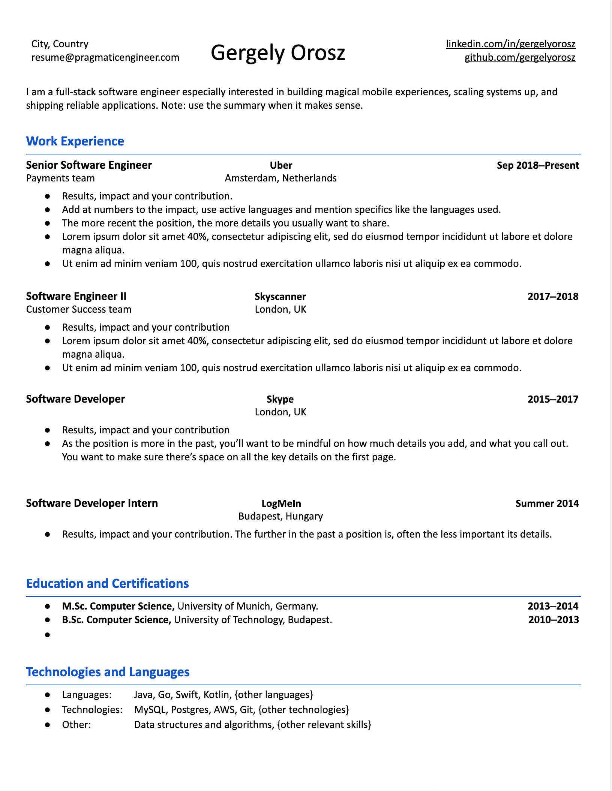
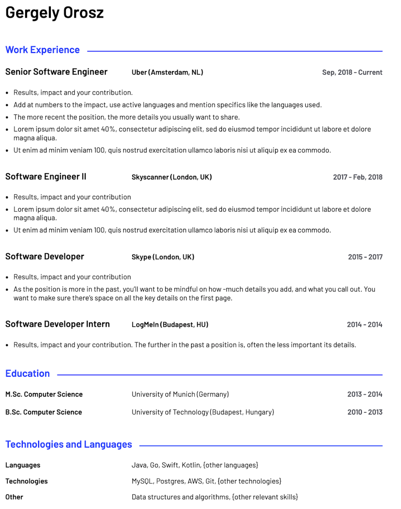

A clean template I created while writing [The Tech Resume Inside Out](https://thetechresume.com/?ref=blog.pragmaticengineer.com). This template is a good choice to use for developers applying for tech positions. This CV / resume template is featured - and analyzed - in my book, [The Tech Resume Inside Out: What a Good Software Engineer Resume Looks Like](https://thetechresume.com/?ref=blog.pragmaticengineer.com).  

我在撰写《技术简历内幕》时创建的简洁模板。对于申请技术职位的开发人员来说，这个模板是个不错的选择。我在《The Tech Resume Inside Out》一书中介绍并分析了这一简历模板：一份优秀的软件工程师简历应该是什么样的。

This template is a proven one with more than **6,500** downloads. People messaged me to share they got recruiter calls at Facebook, Google, Microsoft, Amazon, Robinhood, Stripe, Uber and other companies using this template. Of course, the template is a small part in this: [the contents of your resume](https://thetechresume.com/?ref=blog.pragmaticengineer.com) are more important.  

这个模板是一个经过验证的模板，下载次数超过 6500 次。有人给我发信息，分享他们用这个模板接到了 Facebook、谷歌、微软、亚马逊、Robinhood、Stripe、Uber 和其他公司招聘人员的电话。当然，模板只是其中的一小部分：简历的内容更为重要。

**Download the resume template** in two formats:  

下载两种格式的简历模板：

-   **Google Doc**: [Pragmatic Engineer's Resume Template](https://docs.google.com/document/d/1UBMuHp6cDVfdP508xP7H9wgLc4VMj6KfyjhAWB9k4OY/edit?usp=sharing&ref=blog.pragmaticengineer.com) \- make your copy and edit.  
    
    谷歌文档：务实工程师简历模板--复制并编辑。
-   **Word**: [Pragmatic Engineer's Resume Template.docx](https://thetechresume.com/downloads/The_Pragmatic_Engineers_Resume_Template.docx?ref=blog.pragmaticengineer.com)  
    
    Word：务实工程师简历模板.docx
-   **Don't forget to replace with your own email** address and data! Some people [have forgotten this step](https://twitter.com/GergelyOrosz/status/1400774183609634822?ref=blog.pragmaticengineer.com) and I end up getting interview invitations.  
    
    不要忘记用自己的电子邮件地址和数据进行替换！有些人忘记了这一步，结果我收到了面试邀请。

Here's how this template looks like:  

下面就是这个模板的样子：

### The template ported to Standard Resume  

移植到标准简历的模板

I have partnered with [Standard Resume](https://standardresume.co/?ref=blog.pragmaticengineer.com) and ported an improved version of this template to [Standard Resume Pro](https://standardresume.co/?ref=blog.pragmaticengineer.com) - one of the very few resume builders that I actually recommend, as it gives added value with a web-based resume, URL tracking, and templates optimized for hiring managers. Here's how the "ported" version of this template looks like on Standard Resume:  

我与 Standard Resume 合作，将此模板的改进版移植到 Standard Resume Pro 上，这是我为数不多推荐的简历制作工具之一，因为它提供了基于网络的简历、URL 跟踪和针对招聘经理优化的模板等附加价值。下面是该模板的 "移植 "版在 Standard Resume 上的样子：

The "Parker" resume template: a port of The Pragmatic Engineer's Resume Template  

帕克 "简历模板：《实用工程师简历模板》的移植版

To use this template, head over to Standard Resume [here](https://standardresume.co/?ref=blog.pragmaticengineer.com) and choose the "Parker" template.  

要使用此模板，请访问 "标准简历"，然后选择 "帕克 "模板。
