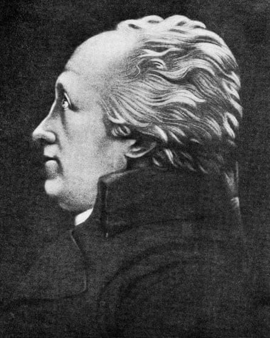

> Catch-up service: _[The Social Media Cage Fight](https://www.ian-leslie.com/p/the-social-media-cage-fight)_  
> 
> 追赶服务：社交媒体笼斗  
> 
> _[Barbearheimer 巴尔贝海默尔](https://www.ian-leslie.com/p/barbearheimer)_

  

This is Henry Cort. You probably haven’t heard of him unless you’re an Industrial Revolution nerd (I hadn’t until this week). He isn’t as well known as James Watt or Joseph Priestley - he wasn’t one of [the Lunar Men](https://www.faber.co.uk/product/9780571216109-the-lunar-men/) - but Cort played a critical part in the creation of the modern world. He invented a method of production which made it much easier and cheaper to turn scrap iron into high-quality iron, ready to build railways, warships, bridges and balconies.  

这位是亨利-科特。除非你是工业革命的书呆子，否则你可能没听说过他（我直到本周才知道）。他不像詹姆斯-瓦特（James Watt）或约瑟夫-普里斯特利（Joseph Priestley）那么出名，他也不是 "月球人"（Lunar Men）之一，但科特在现代世界的创造中发挥了至关重要的作用。他发明了一种生产方法，可以更容易、更便宜地将废铁变成优质铁，用于建造铁路、军舰、桥梁和阳台。

Cort pioneered and combined two innovations. One was an improvement on Peter Onions’s puddling process, which we needn’t dwell on here - really, I just wanted to write out, “Peter Onions’s puddling process”. The other was the use of grooved rollers. Traditional rolling mills used flat rollers to roll hot metal into simple, flat shapes. Cort’s rollers had grooved edges which made for perfectly smooth, welded bars.  

科特开创并结合了两项创新。一项是对彼得-奥尼恩的水坑工艺的改进，我们不必在此赘述--说真的，我只想写出 "彼得-奥尼恩的水坑工艺"。另一种是使用槽辊。传统的轧机使用平辊将热金属轧成简单的平面形状。科特的轧辊边缘有沟槽，这样就能轧制出完美光滑的焊接棒材。

The “Cort process”, introduced in the 1780s, led to a quadrupling of Britain’s iron production over the following twenty years, making Britain one of the world’s leading iron producers. Fifty years after his death, the _Times_ called Cort “the father of the iron trade” and today he’s regarded as one of the twenty or so most important innovators of the era.  

1780 年代引入的 "科尔特工艺 "使英国的铁产量在随后的二十年里翻了两番，使英国成为世界领先的铁生产国之一。科尔特去世 50 年后，《泰晤士报》称他为 "钢铁贸易之父"，如今他已被视为那个时代最重要的 20 多位创新者之一。

Now comes a twist in the tale. A lecturer in science and technology at UCL called Jenny Bulstrode has [published a paper](https://www.tandfonline.com/doi/full/10.1080/07341512.2023.2220991) which argues that [what she calls](https://www.ucl.ac.uk/news/2023/jul/black-metal-workers-jamaica-pioneered-key-industrial-revolution-innovation) “the myth of Henry Cort” is based on a lie.  

现在，这个故事出现了转折。伦敦大学洛杉矶分校一位名叫珍妮-布尔斯特罗德的科技讲师发表了一篇论文，认为她所谓的 "亨利-科特神话 "是建立在谎言之上的。

In the prestigious journal, _History and Technology_, Dr Bulstrode argues that Cort stole his innovations from black slaves who had developed them independently in an iron works in Jamaica. Bulstrode traces a complex chain of events by which Cort, who as far as we know never visited Jamaica, ended up claiming credit for a process which was collectively invented by 76 enslaved factory workers (Bulstrode refers to them as “Black metallurgists”).  

布尔斯特罗德博士在著名期刊《历史与技术》上指出，科特的创新是从牙买加一家炼铁厂的黑人奴隶那里偷来的，而这些黑人奴隶是独立开发这些创新的。Bulstrode 追溯了一连串复杂的事件，据我们所知，科特从未到过牙买加，但他最终为 76 名被奴役的工厂工人（Bulstrode 称他们为 "黑人冶金学家"）集体发明的工艺邀功。

Bulstrode’s paper centres on a Jamaican ironworks run by an English industrialist called John Reeder. Within a few years of setting up, his foundry became successful and profitable. Reeder’s workforce included slaves trafficked from West Africa and trained by English experts he shipped over. Bulstrode argues that the black workers, drawing on ancient African traditions of ironwork, and from their experience of sugar production (where a kind of grooved roller is used) developed these new methods of their own volition, and that it was this which accounted for the factory’s impressive profits.  

布尔斯特罗德的论文以一位名叫约翰-里德的英国实业家经营的牙买加炼铁厂为中心。他的铸造厂在成立后的几年内就取得了成功，并开始盈利。里德的劳动力包括从西非贩运来的奴隶，以及由他运来的英国专家培训的奴隶。布尔斯特罗德认为，黑人工人借鉴了非洲古老的打铁传统，并根据他们的制糖经验（在制糖过程中会使用一种带槽的辊子），自主开发出了这些新方法，这也是工厂获得可观利润的原因。

So how did Cort find out about it? Well, he ran an ironworks in Portsmouth, which he took over in 1775. Bulstrode notes that in 1781 a man with the surname of Cort arrived in Portsmouth from Jamaica. She describes him as a ‘cousin’ of Henry Cort, although as she notes, that term was often used to mean a distant relative. This second Cort had no connection to Reeder’s mill either, but Bulstrode argues that he must have heard all about the foundry and its innovative process when he was in Jamaica. She says he then met Henry Cort in Portsmouth, and passed on this valuable information.  

那么，科特是如何发现它的呢？他在朴茨茅斯经营着一家铁厂，1775 年接管了这家铁厂。布尔斯特罗德指出，1781 年，一个姓科特的人从牙买加来到朴茨茅斯。她称此人是亨利-科特的 "表亲"，但正如她所指出的，这个词通常指的是远房亲戚。第二位 Cort 与里德工厂也没有任何关系，但 Bulstrode 认为，他在牙买加时一定听说过铸造厂及其创新工艺的一切。她说他后来在朴茨茅斯遇到了亨利-科特，并将这一宝贵的信息传递给了他。

A few months later, in 1782, Reeder’s factory was razed to the ground under orders from the British government. This was previously thought to have been because the colony was under threat from rival European powers and the British wanted to prevent the foundry from falling into French or Spanish hands. Bulstrode says that the military governor disclosed an ulterior motive: the British wanted to stop the factory from being taken over by black Jamaicans, who might then be empowered to overthrow their colonial rulers (in [an interview](https://www.deezer.com/us/episode/533278215?utm_campaign=clipboard-generic&utm_source=user_sharing&utm_content=talk_episode-533278215&deferredFl=1) with a podcast called _The Context of White Supremacy_, Bulstrode even suggests that Henry Cort instigated the destruction via contacts in the British government). Bulstrode says that components from the destroyed factory were then shipped to Portsmouth, with the implication being that Cort then reverse-engineered the process, and patented the secrets under his own name.  

几个月后，即 1782 年，里德的工厂在英国政府的命令下被夷为平地。以前人们认为这是因为殖民地受到了欧洲敌对势力的威胁，英国人希望防止铸造厂落入法国或西班牙人手中。布尔斯特罗德说，军事总督透露了一个不可告人的动机：英国人希望阻止工厂被牙买加黑人接管，因为他们可能会被赋予推翻殖民统治者的权力（布尔斯特罗德在接受名为《白人至上的内涵》（The Context of White Supremacy）的播客采访时甚至暗示，亨利-科特通过英国政府的关系煽动了这次破坏行动）。布尔斯特罗德说，被毁工厂的部件随后被运往朴茨茅斯，言下之意是科特随后对工艺进行了逆向工程，并以自己的名义为这些秘密申请了专利。

Bulstrode’s paper has made a big splash. It’s been hailed by her academic peers as a major breakthrough, and picked up by big media outlets including the [Guardian](https://www.theguardian.com/science/2023/jul/05/industrial-revolution-iron-method-taken-from-jamaica-briton), the [New Scientist](https://www.newscientist.com/article/2380941-english-industrialist-stole-iron-technique-from-black-metallurgists/), and [NPR](https://www.npr.org/transcripts/1191989712). If you Google “Henry Cort”, it’s these reports which come up. Wikipedia has already [incorporated it into Cort’s biography](https://en.wikipedia.org/wiki/Henry_Cort). Bulstrode’s paper fits the zeitgeist in historical studies - that the economic success of Britain and the West owes much more to the exploitation of black ingenuity and ideas than mainstream historians have hitherto allowed for.  

布尔斯特罗德的论文引起了巨大轰动。她的学术同行将其誉为一项重大突破，《卫报》、《新科学家》和美国国家公共广播电台等大型媒体也对其进行了报道。如果你在谷歌上搜索 "亨利-科特"，就会出现这些报道。维基百科已经将其纳入了科特的传记。布尔斯特罗德的论文符合历史研究的潮流--英国和西方的经济成就要归功于对黑人聪明才智和思想的利用，这一点迄今为止主流历史学家还没有意识到。

If the story Bulstrode tells sounds incredible, that’s because it is. Right after Bulstrode’s paper made the headlines, Anton Howes, the proprietor of an excellent Substack on the history of innovation, [noted the almost total lack of evidence](https://www.ageofinvention.xyz/p/age-of-invention-cort-case?publication_id=18480&isFreemail=true) for the paper’s central claims. Last week, [he returned to it](https://www.ageofinvention.xyz/p/age-of-invention-does-history-have) in a piece sparked by a [new paper from Oliver Jelf](https://osf.io/preprints/socarxiv/rp5ae/) which examines Bulstrode’s paper in detail and provides the most thorough debunking of it imaginable.  

如果布尔斯特罗德讲述的故事听起来令人难以置信，那是因为事实的确如此。就在布尔斯特罗德的论文成为头条新闻之后，安东-豪斯（Anton Howes），一位出色的创新史子集的作者，注意到该论文的核心主张几乎完全缺乏证据。上周，奥利弗-杰尔夫（Oliver Jelf）发表了一篇新论文，详细研究了布尔斯特罗德的论文，并对其进行了最彻底的驳斥。

Jelf’s paper is a crisply argued, ruthless demolition job which makes for a gruesomely compelling read (I suggest reading [Bulstrode’s paper](https://www.tandfonline.com/doi/full/10.1080/07341512.2023.2220991) first). Jelf takes each of Bulstrode’s central claims and finds them to be, not just dubious, but demonstrably false. He draws on his own expertise on the period but often, all he has to do is point us to the very sources Bulstrode cites in order to show that her conclusions are unsupported.  

杰尔夫的论文论证清晰，拆解严谨，读来令人毛骨悚然（我建议先读布尔斯特罗德的论文）。杰尔夫对布尔斯特罗德的核心主张逐一进行了分析，发现这些主张不仅可疑，而且明显是错误的。他利用自己在这一时期的专业知识，但往往只需指出布尔斯特罗德引用的资料来源，就能证明她的结论毫无根据。

In reality, John Reeder’s foundry used very ordinary (run-of-the-mill?) production processes. No innovations were introduced there, by the workers or anyone else. Its profitability needs no extraordinary explanation; Reeder had the only foundry on the island and supplied the Royal Navy. The elaborate chain of events by which Cort is supposed to have found out about these non-existent innovations simply didn’t happen. Cort’s cousin did not go to Portsmouth, but to Lancaster. Henry Cort lived in complete and blissful ignorance of John Reeder’s factory. The factory was destroyed because of the foreign invasion threat and only because of that; at no point did the military governor or anyone else suggest otherwise. No components from the foundry, which was thoroughly destroyed, were shipped to Portsmouth or anywhere else. I could go on but, simply put, none of the assertions Bulstrode makes in her paper stand up to even cursory scrutiny.  

实际上，约翰-里德的铸造厂使用的是非常普通的生产工艺。无论是工人还是其他人都没有进行过任何创新。里德拥有岛上唯一的铸造厂，并为英国皇家海军供货。科特发现这些并不存在的创新的那一连串精心策划的事件根本就没有发生。科特的表弟没有去朴茨茅斯，而是去了兰开斯特。亨利-科特完全不知道约翰-里德的工厂。工厂被毁是因为外国入侵的威胁，而且仅仅是因为这个原因；军事长官或其他任何人都没有提出过其他建议。铸造厂被彻底摧毁后，没有任何部件被运往朴茨茅斯或其他地方。我还可以继续说下去，但简单地说，布尔斯特罗德在她的论文中所做的任何断言都经不起哪怕是粗略的推敲。

Bulstrode hasn’t yet responded to Jelf or Howes in public, but it’s hard to see how her paper can be creditably defended. I’m left wondering two things: one, how she arrived at her narrative at all, and two, how on earth it survived the review process.  

布尔斯特罗德还没有公开回应杰尔夫或豪斯，但很难看出她的论文如何能得到可信的辩护。我对两件事感到疑惑：第一，她是如何得出她的叙述的；第二，她的叙述究竟是如何通过审查的。

On the first, I suspect Bulstrode fell under the spell of story. Her paper has the feel of a messy and flawed first draft of a historical novel. It begins in Lisbon in the fifteenth century (even here, her assertions [seem to be mistaken](https://twitter.com/EyesOfFawns/status/1677103933959938049)) before skipping to eighteenth century Jamaica, West Africa, and Portsmouth, weaving a web of vague and tenuous connections as it goes. It is clogged with deadening and risibly anachronistic jargon (“sugar and iron shared much overlapping conceptual space”). Most uncomfortably, there is a strain of quasi-Orientalism to its depiction of the black metalworkers, who are presented as magical figures: exceptionally skilled “metallurgists”, conceptual innovators, custodians of ancient and mystical wisdom, noble freedom-fighters. But it is full of nuggets which fire the imagination; names of forgotten people; dim outlines of dramatic events.  

关于第一点，我怀疑布尔斯特罗德被故事的魅力所迷惑。她的论文给人一种历史小说初稿杂乱无章、漏洞百出的感觉。它从十五世纪的里斯本开始（即使在这里，她的论断似乎也是错误的），然后跳到十八世纪的牙买加、西非和朴茨茅斯，一边走一边编织着模糊而脆弱的关系网。书中充斥着令人生厌的不合时宜的行话（"糖和铁共享着许多重叠的概念空间"）。最令人不舒服的是，书中对黑人金属工人的描写带有一种准东方主义的色彩，他们被描绘成神奇的人物：技艺超群的 "冶金学家"、概念创新者、古老神秘智慧的守护者、崇高的自由斗士。但其中也不乏激发人们想象力的片段、被遗忘的人物的名字、戏剧性事件的模糊轮廓。

I doubt that Bulstrode set out to deceive. My guess is that she came across a few suggestive fragments in her reading (the ‘cousin’ of Cort travelling from Jamaica to England) and wanted so badly to make them into a story which fitted her ideologically determined prior - that the British stole ideas from those they enslaved - that she got carried away, fabricating causes and effects where none existed.  

我怀疑布尔斯特罗德是否有意欺骗。我的猜测是，她在阅读中看到了一些暗示性的片段（科尔特的 "表亲 "从牙买加来到英国），她非常想把这些片段编成一个符合她的意识形态的故事--英国人从被他们奴役的人那里窃取了思想--于是她就忘乎所以，编造了不存在的原因和结果。

It’s one thing for a young and passionate academic to make mistakes; it’s quite another for a series of experienced academics to let her make them. The paper had two anonymous peer-reviewers (Bulstrode thanks other historians in an endnote, though they may not have read the paper). Even to an ignorant reader like me, the paper just smells funny - it has the aroma of the fantastical. How on earth did these experts read it without becoming suspicious? Why didn’t they double-check its remarkable claims?  

一个年轻而充满激情的学者犯错误是一回事，而一系列经验丰富的学者让她犯错误则是另一回事。这篇论文有两位匿名同行评审人（布尔斯特罗德在尾注中感谢了其他历史学家，尽管他们可能没有读过这篇论文）。即使对我这样无知的读者来说，这篇论文也有一股滑稽的味道--充满了幻想的气息。这些专家究竟是怎么读到这篇论文而不起疑心的呢？他们为什么不仔细核实一下其中的惊人说法？

My guess is that they were also seduced by story. It’s not just that Bulstrode’s storytelling mind went into overdrive, it’s that the master-narrative into which her paper fits now exerts such a grip over some historians that they will blind themselves to anything which undermines it. According to this narrative, Britain’s Industrial Revolution was not the product of ingenuity or the free exchange of ideas, but of thievery and exploitation. The British stole, not just the labour and materials of black countries, but their ideas too. If your paper fits that narrative, it’s more likely to get published, even if it has holes in it; even if it is nothing but holes. The discipline, or a sub-set of it, has become helplessly in thrall to one of the archetypal narrative forms: Good vs Evil. Naturally, the academics are on the side of the Good.  

我的猜测是，他们也受到了故事的诱惑。这不仅仅是因为布尔斯特罗德讲故事的能力超强，还因为她的论文所契合的主叙事现在对一些历史学家产生了如此大的控制力，以至于他们会对任何有损于主叙事的东西视而不见。根据这种说法，英国的工业革命不是聪明才智或自由交流思想的产物，而是偷窃和剥削的产物。英国人不仅偷走了黑人国家的劳动力和材料，还偷走了他们的思想。如果你的论文符合这种说法，那么它就更有可能被发表，即使它有漏洞，即使它除了漏洞还是漏洞。这门学科，或者说这门学科的一个分支，已经无奈地陷入了一种典型的叙事形式之中：善与恶。学术界自然是站在善的一方。

[Share 分享](https://www.ian-leslie.com/p/stories-are-bad-for-your-intelligence?utm_source=substack&utm_medium=email&utm_content=share&action=share)

Anton Howes argues that, like the field of psychology has done in recent years, history must confront its own “replication crisis”. Errors are allowed to survive and spread throughout the corpus for decades. His solution is widen access to archival sources to make it easier for peer-reviewers to check claims. But if peer-reviewers aren’t motivated to be sceptical, this may not help much. I draw a different moral, which is that historians need to train, or retrain, themselves, to be suspicious of story and narrative.  

安东-豪斯（Anton Howes）认为，就像心理学领域近年来所做的那样，历史学必须面对自己的 "复制危机"。错误被允许存活下来，并在整个语料库中传播数十年。他的解决方案是扩大档案资料的使用范围，使同行评审员更容易检查索赔。但如果同行评审者没有怀疑的动力，这可能帮不上什么忙。我得出了不同的寓意，那就是历史学家需要训练或再训练自己，对故事和叙事持怀疑态度。

Historians have an increasingly strong incentive to tell dramatic stories which gain attention and make ‘impact’. But anyone in the business of reporting on reality - scholars, scientists, journalists - ought to be suspicious of narrative, even if they use it. So should those of us who consume these reports. Just because information is conveyed in narrative form doesn’t make it false, but it does mean that it’s going to seem more true than it is.  

历史学家有越来越强烈的动机去讲述戏剧性的故事，以赢得关注并产生 "影响"。但是，任何从事现实报道的人--学者、科学家、记者--都应该怀疑叙事，即使他们使用了叙事。我们这些阅读这些报告的人也应该如此。以叙事的形式传递信息并不意味着它是虚假的，但确实意味着它看起来比实际情况更真实。

Stories are reality filters. By definition, they leave out information - all the messy stuff that doesn’t fit - and draw attention to what the storyteller wants us to notice. In that sense they are like ideologies: both are methods of rolling and shaping the hot metal of reality into smooth ready-made shapes. Stories don’t accommodate randomness or structural forces very well; they rely on chains of causation and on individual motive. Covid-19 can’t be an accident and we needn’t bother ourselves too much with biology; it is a plot perpetrated by evil people. Bulstrode’s paper has the flavour of a conspiracy theory. Conspiracy theories aren’t theories; they’re stories.  

故事是现实的过滤器。顾名思义，它们剔除了信息--所有不合时宜的杂乱无章的东西--把注意力吸引到讲故事的人想让我们注意到的东西上。从这个意义上说，故事就像意识形态：两者都是将炙热的现实金属轧制和塑造成光滑的现成形状的方法。故事不能很好地适应随机性或结构性力量；它们依赖于因果链和个人动机。科维德-19》不可能是一个意外，我们也不需要过多地纠结于生物学问题；这是一个由邪恶的人策划的阴谋。布尔斯特罗德的论文带有阴谋论的色彩。阴谋论不是理论，而是故事。

Stories act like an anaesthetic on our sceptical, questioning faculties. It can be valuable and pleasurable to subdue that part of our brain, and immerse ourselves in an imaginary world; I love reading stories, including non-fictional ones. But if you come across a history book, or a scientific study, or a news report, which tells a great story, or which slots neatly into a master-narrative in which you already believe, you should be _more_ sceptical of its truth-value, not less. Narrative can give an illusion of solidity. When the expert narrative about the world changes, as with China (see below), we shouldn’t just conclude that the old narrative was false, but that all such narratives are unreliable.  

故事就像一剂麻醉剂，麻醉我们怀疑和质疑的能力。我喜欢读故事，包括非虚构的故事。但是，如果你遇到一本历史书、一项科学研究或一篇新闻报道，它讲述了一个伟大的故事，或者与你已经相信的主叙事完全吻合，那么你应该对它的真实价值更加怀疑，而不是减少怀疑。叙事会给人一种稳固的错觉。当专家对世界的叙述发生变化时，比如对中国的叙述（见下文），我们不应该仅仅得出旧的叙述是错误的结论，而应该得出所有这样的叙述都是不可靠的结论。

In _[Metahistory](https://en.wikipedia.org/wiki/Metahistory:_The_Historical_Imagination_in_Nineteenth-century_Europe)_, his classic work of historiography, Hayden White argued that historians are always drawing on literary forms, like tragedy or comedy, whether they realise it or not. That isn’t necessarily a bad thing, but if you’re a historian you have to be aware of it; otherwise the story writes you rather than the other way around. Moralising narratives are particularly potent. Historians of the British empire are currently substituting [one simplistic narrative for another](https://twitter.com/mrianleslie/status/1695040814013919553) in popular books.  

海登-怀特在其史学经典著作《元史》中指出，无论历史学家是否意识到，他们总是在借鉴悲剧或喜剧等文学形式。这不一定是坏事，但如果你是历史学家，你就必须意识到这一点；否则，故事就会写你，而不是反过来。道德化叙事尤其有效。目前，大英帝国的历史学家们正在通俗读物中用一种简单化的叙事取代另一种简单化的叙事。

In a sense, Cort was an easy target for Bulstrode because he didn’t have a story of his own; he was narratively undefended. If Cort is less well known than Watt or Priestley that’s because neither his life or work have been moulded into a story; other than his innovations, Cort left barely a trace behind. He wasn’t a flamboyant character, but one of those diligent, determined, curious tinkerers on whom the Industrial Revolution was built (in my book [CURIOUS](https://ian-leslie.com/curious/) I call them “thinkerers”). His innovations probably emerged from years of slow, sooty experimentation, without any eureka moments or dramatic breakthroughs.  

从某种意义上说，科特很容易成为布尔斯特罗德的目标，因为他没有自己的故事；他在叙事上是不设防的。如果说科特不如瓦特或普利斯特里出名，那是因为他的生平和作品都没有被塑造成一个故事；除了他的创新，科特几乎没有留下任何痕迹。他并不是一个张扬的人物，而是那些勤奋、坚定、好奇的工匠之一，工业革命正是建立在他的基础之上（在我的《好奇》一书中，我称他们为 "思考者"）。他的创新可能来自于多年缓慢的煤烟实验，没有任何灵光一现或戏剧性的突破。

Stories are indispensable, nourishing and delightful. They are also attacks on the rational immune system. TED Talks are, famously, all about stories, but when the economist [Tyler Cowen did one](https://www.youtube.com/watch?v=RoEEDKwzNBw&t=707s) he used it, rather subversively, to warn against “story bias”. Cowen argues that any time someone believes in a story they are effectively subtracting ten points from their IQ (by which he means, broadly speaking, their analytical intelligence). That’s a deal we will often take willingly, since stories can bring pleasure and meaning to our lives and deepen our understanding of the world. But let’s be clear about what the deal is.  

故事是不可或缺的，是滋养和愉悦的。它们也是对理性免疫系统的攻击。众所周知，TED演讲都是关于故事的，但当经济学家泰勒-考恩（Tyler Cowen）做演讲时，他却颇具颠覆性地用它来警告人们不要有 "故事偏见"。考恩认为，只要有人相信故事，他们的智商（广义上指分析能力）就会被减去10分。我们往往会心甘情愿地接受这种说法，因为故事能给我们的生活带来乐趣和意义，加深我们对世界的理解。但是，让我们明确一下这笔交易是什么。

[Share 分享](https://www.ian-leslie.com/p/stories-are-bad-for-your-intelligence?utm_source=substack&utm_medium=email&utm_content=share&action=share)

_After the jump, what I’ve been reading; some extremely juicy links and stories: a new take on_ Barbie _(inexhaustible subject), a defence of_ Oppenheimer_, my favourite Wikipedia page, Jimmy Stewart’s theory of film, an investigation of Napoleon’s luck, and more…_  

跳转之后，是我一直在阅读的内容；一些非常有价值的链接和故事：对芭比娃娃的新看法（取之不尽的主题）、为奥本海默辩护、我最喜欢的维基百科页面、吉米-斯图尔特的电影理论、对拿破仑运气的调查等等

> Catch-up service: _[The Social Media Cage Fight](https://www.ian-leslie.com/p/the-social-media-cage-fight)_  
> 
> 追赶服务：社交媒体笼斗  
> 
> _[Barbearheimer 巴尔贝海默尔](https://www.ian-leslie.com/p/barbearheimer)_
