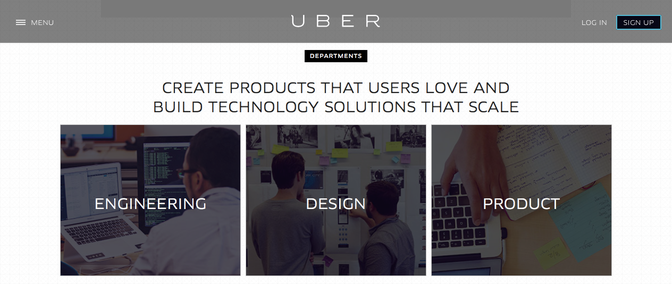

It undermines a long tradition of designing and building infrastructure in the public interest.  

它破坏了为公众利益设计和建设基础设施的悠久传统。

Andrew Brookes / Corbis

I’m commiserating with a friend who recently left the technology industry to return to entertainment. “I’m not a programmer,” he begins, explaining some of the frustrations of his former workplace, before correcting himself, “—oh, engineer, in tech-bro speak. Though to me, engineers are people who build bridges and follow pretty rigid processes for a reason.”  

我正在与一位最近离开技术行业重返娱乐圈的朋友惺惺相惜。"我不是程序员，"他开始解释他以前工作场所的一些挫折，然后纠正自己说，"哦，工程师，用技术人员的话说。虽然对我来说，工程师是架设桥梁的人，遵循相当严格的流程是有原因的"。

His indictment touches a nerve. In the Silicon Valley technology scene, it’s common to use the bare term “engineer” to describe technical workers. Somehow, everybody who isn’t in sales, marketing, or design became an engineer. “We’re hiring engineers,” read startup websites, which could mean [anything](http://angel.co/jobs) from Javascript programmers to roboticists.  

他的起诉触动了人们的神经。在硅谷的科技界，人们常用 "工程师 "来形容技术人员。不知何故，所有不从事销售、营销或设计的人都成了工程师。创业公司网站上写着 "我们正在招聘工程师"，这可能意味着从 Javascript 程序员到机器人专家的任何职位。

The term is probably a shortening of “software engineer,” but its use betrays a secret: “Engineer” is an aspirational title in software development. Traditional engineers are regulated, certified, and subject to apprenticeship and continuing education. Engineering claims an explicit responsibility to public safety and reliability, even if it doesn’t always deliver.  

这个词可能是 "软件工程师 "的简称，但它的使用暴露了一个秘密：在软件开发领域，"工程师 "是一个令人向往的头衔。传统意义上的工程师是受管制的、经过认证的，并且要接受学徒培训和继续教育。工程学对公共安全和可靠性负有明确的责任，尽管它并不总是能够实现。

The title “engineer” is cheapened by the tech industry.  

"工程师 "这个头衔已经被科技行业贬低了。

Recent years have seen prominent failures in software. Massive [data breaches](https://www.theatlantic.com/search/?q=breach) at Target, Home Depot, BlueCross BlueShield, Anthem, Harvard University, LastPass, and Ashley Madison only scratch the surface of the cybersecurity issues posed by today’s computer systems. The Volkswagen [diesel-emissions exploit](https://www.theatlantic.com/business/archive/2015/09/volkswagen-scandal-grows/406639/) was caused by a software failing, even if it seems to have been engineered, as it were, deliberately.  

近年来，软件故障频发。塔吉特（Target）、家得宝（Home Depot）、蓝十字蓝盾（BlueCross BlueShield）、安泰（Anthem）、哈佛大学（Harvard University）、LastPass 和 Ashley Madison 的大规模数据泄露事件只是当今计算机系统所带来的网络安全问题的表面现象。大众柴油机排放漏洞是由软件故障引起的，尽管它似乎是被蓄意设计的。

## Recommended Reading

But these problems are just the most urgent and most memorable. Today’s computer systems pose individual and communal dangers that we’d never accept in more concrete structures like bridges, skyscrapers, power plants, and missile-defense systems. Apple’s iOS 9 update reportedly “bricked” certain phones, making them unusable. Services like Google Docs go down for mysterious reasons, leaving those whose work depends on them in a lurch. “Your password contains invalid characters,” a [popular tweet](https://twitter.com/qwzybug/status/544568638443757568) quotes from an anonymous website, before twisting the dagger, “No, your startup contains incompetent engineers.”  

但这些问题只是最紧迫和最令人难忘的。今天的计算机系统给个人和集体带来的危险，是我们在桥梁、摩天大楼、发电厂和导弹防御系统等更具体的结构中永远无法接受的。据报道，苹果公司的 iOS 9 更新导致某些手机 "变砖"，无法使用。谷歌文档等服务因神秘原因瘫痪，让那些工作依赖它们的人束手无策。"你的密码包含无效字符，"一条流行的推特引用了一个匿名网站的这句话，然后匕首一转，"不，你的初创公司包含不称职的工程师"。

These might seem like minor matters compared to the structural integrity of your office building or the security of our nation’s nuclear-weapons arsenal. But then consider how often your late-model car fails to start inexplicably or your office elevator traps you inside its shaft. Computing has become infrastructure, but it doesn’t work like infrastructure.  

与办公楼的结构完整性或国家核武库的安全相比，这些似乎都是小事。但仔细想想，你的晚期汽车经常莫名其妙地无法启动，或者你的办公室电梯经常把你困在井道里。计算机已经成为基础设施，但它的工作方式却不像基础设施。

When it comes to skyscrapers and bridges and power plants and elevators and the like, engineering has been, and will continue to be, managed partly by professional standards, and partly by regulation around the expertise and duties of engineers. But fifty years’ worth of attempts to turn software development into a legitimate engineering practice have failed.  

在摩天大楼、桥梁、发电厂、电梯等工程领域，工程管理一直并将继续部分依靠专业标准，部分依靠对工程师专业知识和职责的监管。但五十年来，试图将软件开发变成合法工程实践的努力都失败了。

Just as the heavy industry can [greenwash](https://en.wikipedia.org/wiki/Greenwashing) to produce the appearance of environmental responsibility and the consumer industry can [pinkwash](https://en.wikipedia.org/wiki/Pinkwashing) to connect themselves to cause marketing, so the technology industry can “engineerwash”—leveraging the legacy of engineering in order to make their products and services appear to engender trust, competence, and service in the public interest.  

正如重工业可以通过 "洗绿 "来制造环保责任的假象，消费行业可以通过 "洗粉 "来将自己与事业营销联系起来，科技行业也可以通过 "洗工程"--利用工程学的遗产，使自己的产品和服务看起来能够产生信任、能力和为公众利益服务。

\* \* \*

By the 1960s, large national-defense systems were largely managed by computers. But the creation of such systems was a disaster—almost everything was delivered late, over budget, and with unnecessary complexity. Late in the decade, the NATO Science Committee sponsored two conferences dedicated to establishing an engineering approach to software creation. The 1968 conference report shows that the notion was still aspirational:  

到 20 世纪 60 年代，大型国防系统在很大程度上由计算机管理。但是，这些系统的创建却是一场灾难--几乎所有东西都交付得太晚，超出预算，而且具有不必要的复杂性。在这十年的后期，北约科学委员会主办了两次会议，致力于建立一种工程方法来创建软件。1968 年的会议报告显示，这一概念仍是一个理想：

> The phrase “software engineering” was deliberately chosen as being provocative, in implying the need for software manufacture to be based on the types of theoretical foundations and practical disciplines, that are traditional in the established branches of engineering.  
> 
> 特意选择 "软件工程 "这一短语，是因为它具有挑衅性，暗示软件制造需要建立在传统工程分支的理论基础和实践学科之上。

Commercial applications meant to service ordinary people, from inventory control to airline reservations to banking, needed to be reliable. Programming merely involved implementation.  

为普通人服务的商业应用程序，从库存控制到机票预订再到银行业务，都需要可靠。编程仅仅涉及执行。

Software-engineering trends came and went during the ensuing decades. Structured programming paradigms of the 1960s, meant to make software development more predictable and less risky, gave way to the object-oriented paradigm of the ‘80s and ‘90s, meant to make programming better mirror the business processes it facilitates.  

在随后的几十年里，软件工程的趋势来来去去。20 世纪 60 年代的结构化编程范式旨在提高软件开发的可预测性并降低风险，而 80 和 90 年代的面向对象范式则旨在使编程更好地反映其所促进的业务流程。

Meanwhile, the overall challenges of software engineering became more familiar and more entrenched. A decade after his 1975 intervention _The Mythical Man-Month: Essays on Software Engineering_, Fred Brooks lamented that little had changed. In response, he proposed incremental development, or prototyping. Today’s software development is iterative, and for good reason: Software wasn’t ever really akin to manufacturing and construction, where changes were difficult or impossible after initial implementation.  

与此同时，软件工程所面临的整体挑战也变得更加熟悉和根深蒂固。在 1975 年发表《神话般的人工月》（The Mythical Man-Month：软件工程论文集》发表十年后，弗雷德-布鲁克斯（Fred Brooks）感叹说，软件工程几乎没有什么变化。为此，他提出了增量开发或原型开发。今天的软件开发是迭代式的，这是有道理的：软件并不真正类似于制造和建筑，在初始实施后很难或不可能进行更改。

But, software was never not akin to manufacturing and construction, either. Almost 50 years after the NATO Science Committee conferences, some of its participants’ warnings still hold. “In the competitive rush to make available the latest techniques,” the ’68 report opines, “we strive to take great forward leaps across gulfs of unknown width and depth.” The same sentiment still holds today.  

但是，软件与制造业和建筑业也从来没有什么不同。在北约科学委员会会议召开近 50 年后的今天，一些与会者的警告依然有效。"68 年的报告认为，"在竞相提供最新技术的过程中，我们努力跨越未知宽度和深度的鸿沟"。今天，同样的观点依然适用。

So, what happened? The personal-computer revolution, for one. In the 1960s and ’70s, computers were expensive and scarce. They were confined to research, in governmental, corporate, and industrial contexts. But with the rise of the microcomputer in the late 1970s, anyone could own, use, and program one.  

那么，发生了什么呢？首先是个人电脑革命。上世纪六七十年代，计算机既昂贵又稀缺。它们仅限于政府、企业和工业领域的研究。但随着 20 世纪 70 年代末微型计算机的兴起，任何人都可以拥有、使用和编程微型计算机。

This democratization of software development ignited the consumer and business-software revolution. But it also changed the stakes of software engineering. Developing Microsoft Excel or the back-office systems at American Airlines was hardly glamorous or fast-paced. A giant product like a spreadsheet or a reservation system was still something like a bridge or a building: It had to work right, especially since patches and revisions were expensive and required physical intervention. Such cases require an engineering approach, while trying one’s hand at a program for upload to the local BBS (or the modern app store) does not.  

软件开发的民主化引发了消费和商业软件革命。但它也改变了软件工程的利害关系。开发 Microsoft Excel 或美国航空公司的后台系统并不光彩，节奏也不快。像电子表格或预订系统这样的巨型产品仍然像桥梁或建筑一样：它必须能正常工作，尤其是因为修补和修改成本高昂，而且需要实际干预。在这种情况下，需要采用工程方法，而在本地 BBS（或现代应用程序商店）上上传一个程序则不需要。

The informality of software development accelerated even more with the rise of the web, starting in the mid ‘90s and continuing through today. As software services moved to websites, smartphones, and the Cloud, two things happened.  

随着网络的兴起，软件开发的信息化进程进一步加快，从 90 年代中期开始一直持续到今天。随着软件服务向网站、智能手机和云计算转移，发生了两件事。

First, the pressure to get things right the first time around was relieved, because updates and changes could be applied centrally, as in the mainframe era. Over time, the ease of rapid repair became an excuse for rapid development, and Brooks-style prototyping mutated into the constant software updates we experience today. Facebook has [wisely retired](http://www.cnet.com/news/zuckerberg-move-fast-and-break-things-isnt-how-we-operate-anymore/) its one-time internal-development philosophy, “move fast and break things,” but no business reliant on civil or structural engineering would ever have adopted such a motto in the first place.  

首先，第一次就把事情做对的压力减轻了，因为更新和更改可以像大型机时代那样集中进行。随着时间的推移，快速修复的便利性成了快速开发的借口，布鲁克斯式的原型开发演变成了我们今天所经历的软件不断更新。Facebook 已经明智地放弃了曾经的内部开发理念--"快速行动，打破常规"，但任何依赖土木或结构工程的企业都不会一开始就采用这样的座右铭。

And second, software became more isolated from the world, even as it became more predominant. Earlier computing systems were imbricated with other aspects of business, industry, government, and society. An automobile customer-management system has to integrate with dealers, suppliers, shippers, banks and lenders, regulators, legacy systems, and customers. But today’s software mostly stands alone. Instagram, a photo-sharing service [valued at](http://dealbook.nytimes.com/2014/12/19/citigroup-says-instagram-is-worth-35-billion/?_r=0) $35 billion last year, just uploads and downloads images between its servers and its app.  

其次，软件变得更加与世隔绝，尽管它变得更加重要。早期的计算系统与商业、工业、政府和社会的其他方面紧密相连。汽车客户管理系统必须与经销商、供应商、托运人、银行和贷款机构、监管机构、传统系统和客户集成。但如今的软件大多是独立存在的。去年估值达 350 亿美元的照片分享服务 Instagram 只是在服务器和应用程序之间上传和下载图片。

To be sure, today’s Cloud-connected tools still rely on infrastructures, especially the physical servers and networks that handle millions of users accessing billions of files. But those activities have largely been [outsourced](https://aws.amazon.com/solutions/case-studies/) to infrastructure giants.  

可以肯定的是，今天的云连接工具仍然依赖于基础设施，特别是处理数百万用户访问数十亿文件的物理服务器和网络。但这些活动在很大程度上已经外包给了基础设施巨头。

Likewise, integrations with messaging, financials, and storage have been abstracted such that individual software developers can treat them as black boxes. That sometimes allows software to run better and more reliably, but it also allows developers to avoid interfacing with the messy world outside their co-working spaces.  

同样，与消息传递、财务和存储的集成也被抽象化，软件开发人员可以将其视为黑盒子。这有时会让软件运行得更好、更可靠，但同时也让开发人员避免了与联合办公空间之外的混乱世界打交道。

As a result, software development has become institutionally hermetic. And that’s the opposite of what “engineering” ought to mean: a collaboration with the world, rather than a separate domain bent on overtaking it.  

结果，软件开发在体制上变得密不透风。这与 "工程学 "的本意恰恰相反：它是与世界的合作，而不是一心想超越世界的独立领域。

\* \* \*

The traditional disciplines of engineering—civil, mechanical, aerospace, chemical, electrical, environmental—are civic professions as much as technical ones. Engineers orchestrate the erection of bridges and buildings; they design vehicles and heavy machinery; they invent and realize the energy systems that drive this equipment; and they contrive methods for connecting all of these systems together.  

工程学的传统学科--土木工程、机械工程、航空航天工程、化学工程、电气工程、环境工程--既是公民职业，也是技术职业。工程师们负责架设桥梁和建筑；设计车辆和重型机械；发明并实现驱动这些设备的能源系统；以及设计将所有这些系统连接在一起的方法。

It’s no accident that the most truly engineered of software-engineering projects extend well beyond the computer. Autonomous-vehicle design offers the most obvious contemporary example. When Google designs self-driving cars, it musters its own computational systems, like mapping and navigation. But it also integrates those into a world much larger than browsers and smartphones and data centers. Autonomous vehicles share the roads with human-driven cars, pedestrians, and bicyclists. Those roads are managed, maintained, and regulated. Self-driving cars also interface with federal motor-vehicle standards and regulations, along with all the other material demands and foibles of a machine made of metal and plastic and rubber rather than bits. Engineering addresses complex, large-scale systems.  

最真正的软件工程项目远远超出了计算机的范围，这绝非偶然。自动驾驶汽车设计就是一个最明显的当代例子。当谷歌设计自动驾驶汽车时，它必须拥有自己的计算系统，如地图和导航系统。但它也将这些系统整合到一个比浏览器、智能手机和数据中心大得多的世界中。自动驾驶汽车与人类驾驶的汽车、行人和骑自行车的人共享道路。这些道路受到管理、维护和监管。自动驾驶汽车还需要遵守联邦机动车辆标准和法规，以及由金属、塑料和橡胶而非比特制成的机器的所有其他物质要求和缺陷。工程学涉及复杂的大型系统。

This is why it is so infuriating when Uber insists that it is [just a technology platform](http://blogs.wsj.com/digits/2015/11/04/uber-as-employer-the-boss-is-an-algorithm/), and thus not subject to the oversight of transportation-services regulation. Love or hate it, Uber is not just an app developer—it’s a car-service network activated by software, and thus subject to public interest and oversight. And no matter what Uber says, the company still [advertises careers](https://www.uber.com/jobs) in “engineering, design, and product” categories on its website. Engineering roles are illustrated by a bearded guy staring at source code on two monitors.  

正因如此，当 Uber 坚称自己只是一个技术平台，因此不受交通服务法规的监督时，才会如此令人愤怒。无论你喜欢还是讨厌，Uber 都不仅仅是一家应用程序开发商，它还是一个由软件激活的汽车服务网络，因此必须受到公众的关注和监督。无论 Uber 说什么，该公司仍在其网站上刊登 "工程、设计和产品 "类职位的招聘广告。工程类职位的图示是一个大胡子盯着两台显示器上的源代码。

Uber Screenshot

Other engineering disciplines are subject to certification and licensure. If you’ve ever hired a civil, structural, or hydraulic engineer for a construction or repair project, that individual probably had to be certified as a Professional Engineer (PE). Licensing processes [vary by state](http://www.nspe.org/resources/licensure/licensing-boards), but Professional Engineers generally need to hold a 4-year degree from an accredited program in their discipline, pass one or more exams, and possess 4 or more years of professional experience under the supervision of a licensed engineer. Not all working engineers are or need to be Professional Engineers, but to open an engineering consulting practice or to claim that one is an “engineer” in a formal context, licensure is usually required. It’s in the state’s interest to ensure that someone claiming to be an engineer (or an architect a surveyor or a cosmetologist or a massage therapist) isn’t just making up his or her qualifications.  

其他工程学科需要获得认证和执照。如果您曾为建筑或维修项目聘用过土木、结构或水利工程师，那么此人很可能必须获得专业工程师 (PE) 资格认证。各州的许可程序各不相同，但专业工程师一般需要持有本学科认可课程颁发的 4 年制学位，通过一项或多项考试，并在持证工程师的指导下拥有 4 年或 4 年以上的专业经验。并非所有在职工程师都是或需要成为专业工程师，但要开设工程咨询业务或正式宣称自己是 "工程师"，通常都需要获得执照。确保声称自己是工程师（或建筑师、测量师、美容师或按摩师）的人不是凭空捏造，符合州政府的利益。

Professional Engineering certification is usually offered only in fields where something could go terribly, horribly wrong with unqualified actors at the helm. California, for example, [issues](http://www.bpelsg.ca.gov/applicants/apps.shtml) Professional licenses for agricultural, chemical, civil, control system, electrical, fire protection, industrial, mechanical, metallurgical, nuclear, petroleum engineering, and traffic engineers.  

专业工程认证通常只在不合格人员掌舵可能会出大问题的领域提供。例如，加利福尼亚州为农业工程师、化学工程师、土木工程师、控制系统工程师、电气工程师、消防工程师、工业工程师、机械工程师、冶金工程师、核工程师、石油工程工程师和交通工程师颁发专业执照。

In 2013, the National Council of Examiners of Engineers and Surveyors (NCEES), which all 50 states use for licensure examination, began [offering](http://ncees.org/about-ncees/news/ncees-introduces-pe-exam-for-software-engineering/) testing for software engineers. The exams were produced in collaboration with the IEEE, who maintains a [Software Engineering Body of Knowledge](http://www.computer.org/web/swebok/index) (SWEBOK).  

2013 年，美国全国工程师和测量师考试委员会（NCEES）开始提供软件工程师考试。该考试是与电气和电子工程师学会（IEEE）合作推出的，后者拥有一套软件工程知识体系（SWEBOK）。

But it’s unlikely that Silicon Valley workers would pursue such a license. For one, software engineers are unlikely to open a private office like a structural engineer might do. Even if all engineers are supposed to work under a licensed engineer to use the name, at big companies, many do so under layers of management.  

但是，硅谷的员工不太可能申请这样的执照。首先，软件工程师不太可能像结构工程师那样开设私人办公室。即使所有工程师都应该在有执照的工程师领导下工作，才能使用这个名称，但在大公司里，许多工程师都是在层层管理下工作的。

The information-technology industry simply doesn’t value certification as much as engineering does, or even as much as IT once did. Silicon Valley bigwigs like Peter Thiel have been [flouting](http://thielfellowship.org/) formal degrees for years, and even big companies like Google have indicated that [they don’t value](http://venturebeat.com/2014/04/25/why-google-doesnt-care-about-college-degrees-in-5-quotes/) a college degree over and above the ability to do whatever work Google decides is important.  

信息技术行业根本不像工程行业那样重视证书，甚至不像信息技术行业曾经那样重视证书。彼得-蒂尔（Peter Thiel）等硅谷大佬多年来一直蔑视正规学位，就连谷歌这样的大公司也表示，他们并不看重大学学位，而更看重做谷歌认为重要的工作的能力。

But by definition, “engineering” has traditionally entailed the completion of an [Accreditation Board for Engineering and Technology (ABET)](http://www.abet.org/)\-approved 4-year degree. ABET’s accreditation requirements for computer science are vague, but they do expect “an ability to apply design and development principles in the construction of software systems of varying complexity.”  

但根据定义，"工程学 "传统上需要完成工程与技术认证委员会（ABET）认可的四年制学位。ABET 对计算机科学的认证要求含糊不清，但确实要求 "能够在构建不同复杂程度的软件系统时应用设计和开发原则"。

Accredited computer-science programs might be moving further away from software engineering anyway. [Agile software development](https://en.wikipedia.org/wiki/Agile_software_development) has become predominant, focused on rapid iteration rather than long-term planning and intricate documentation. One popular agile method is [Scrum](http://scrummethodology.com/), which is focused on short “sprints” toward a series of changing goals.  

无论如何，认可的计算机科学课程可能会进一步远离软件工程。敏捷软件开发已成为主流，其重点是快速迭代，而不是长期规划和复杂的文档。一种流行的敏捷方法是 Scrum，这种方法注重短期 "冲刺"，以实现一系列不断变化的目标。

Lightweight approaches like Scrum are more compatible with the fast-moving marketplace of computer technology. An app or a web service isn’t a bridge or a building. Software is temporary, and provisionalism is considered a feature, not a bug. But at the same time, the stakes of software development are becoming akin to that of bridges and buildings. Not only do computers run our cars and airplanes and medical devices, but also our banking systems, health-care organizations, insurance-underwriting practices, telephony and communication networks—even our social and entertainment activities. And even if successful, methodologies like Scrum never allow that infrastructure to stabilize. Some new tweak can be made, some new feature can always be added.  

像 Scrum 这样的轻量级方法更适合快速发展的计算机技术市场。应用程序或网络服务不是桥梁或建筑。软件是临时性的，临时性被认为是一种特性，而非缺陷。但与此同时，软件开发的利害关系正变得与桥梁和建筑类似。计算机不仅运行着我们的汽车、飞机和医疗设备，还运行着我们的银行系统、医疗机构、保险承保业务、电话和通信网络，甚至我们的社交和娱乐活动。即使取得了成功，像 Scrum 这样的方法论也不会让基础设施稳定下来。一些新的调整可能会出现，一些新的功能可能会添加。

Meanwhile, start-up culture is changing engineering education anyway. Entrepreneurship is exalted. Accelerators and incubators abound. Not all students in computer-science programs think they’ll become startup billionaires… But not all of them don’t think so, either. Would-be “engineers” are encouraged to think of every project as a potential business ready to scale and sell, rather than as a process of long-term training in disciplines where concerns for social welfare become paramount. Engineering has always been a well-paid profession, but computing is turning it into a type of speculative finance rather than a calling.  

与此同时，创业文化正在改变工程教育。创业精神受到推崇。加速器和孵化器比比皆是。并非所有计算机科学专业的学生都认为自己会成为创业公司的亿万富翁......但也并非所有学生都这么想。未来的 "工程师 "被鼓励把每个项目都看作是一个潜在的企业，随时可以扩大规模并出售，而不是一个长期的学科培训过程，在这个过程中，对社会福利的关注变得至关重要。工程学一直是一个高薪职业，但计算机正在把它变成一种投机性金融，而不是一种职业。

\* \* \*

The U.S. Bureau of Labor and Statistics (BLS) [calls](http://www.bls.gov/ooh/computer-and-information-technology/home.htm) the “engineers” who work at Google and Uber and Facebook and its ilk “Computer Programmers” or “Software Developers.” The former write code, the latter design systems. Nobody has to follow the BLS’s definitions, and you can understand why more grandiose titles would be appealing to Silicon Valley disruptors. “Engineer” conjures the image of the hard-hat-topped designer-builder, carefully crafting tomorrow. But such an aspiration is rarely realized by computing. The respectability of engineering, a feature built over many decades of closely controlled, education- and apprenticeship-oriented certification, becomes reinterpreted as a fast-and-loose commitment to craftwork as business.  

美国劳工和统计局（BLS）将在谷歌、Uber、Facebook 等公司工作的 "工程师 "称为 "计算机程序员 "或 "软件开发人员"。前者编写代码，后者设计系统。没有人必须遵循 BLS 的定义，你也可以理解为什么更冠冕堂皇的头衔会吸引硅谷的颠覆者。"工程师 "让人联想到头戴硬帽、精心打造明天的设计建造者。但这样的愿望很少能在计算领域实现。工程学的可敬之处在于，它是经过数十年严格控制、以教育和学徒制为导向的认证而建立起来的，如今却被重新诠释为一种快速而松散的承诺，即把手工艺品当作生意来做。

Engineerwashing entails a shift from the noun to the verbal sense of “engineer.” An engineer is a professional who designs, builds, and maintains systems. But to engineer means skillfully, artfully, or even deviously contriving an outcome. To engineer is to jury-rig, to get something working more or less, for a time. Sufficiently enough that it serves an immediately obvious purpose, but without concern or perhaps even awareness of its longevity. Engineering in this sense embodies MacGyver scrappiness, a doggedness compatible with today’s values of innovative disruption. But then, no reasonable person would want MacGyver building their bridges or buildings. Or software!  

工程师清洗 "是 "工程师 "从名词到动词意义的转变。工程师是设计、建造和维护系统的专业人员。但是，"工程师 "意味着巧妙地、艺术地、甚至狡猾地创造出一种结果。工程师的意思是 "傀儡"，让某样东西或多或少地工作一段时间。它足以达到一个显而易见的目的，但并不关心甚至可能没有意识到它的寿命。从这个意义上说，工程学体现了马盖先的拼搏精神，这种坚韧不拔的精神与当今创新颠覆的价值观不谋而合。但是，任何一个有理智的人都不会希望马盖先为他们建造桥梁或楼房。或者软件！

Perhaps software calamities like data breaches and dieselgate will raise the hackles of the public, such that the standards for software development will be revealed and, in time, reformed. But given the difficulty of renewing, creating, or enforcing more urgent regulatory oversight over the technology industry, the job titles of technology workers probably seems like a minor matter.  

也许像数据泄露和柴油门这样的软件灾难会引起公众的关注，从而揭示软件开发的标准，并及时进行改革。不过，考虑到对技术行业进行更新、创建或实施更紧迫的监管的难度，技术人员的职称可能只是小事一桩。

Just as Silicon Valley has deftly reframed its business interests as a process of “[changing the world](https://www.youtube.com/watch?v=J-GVd_HLlps),” so it has also reframed engineering as a process of building something temporary. After all, professionals like graphic designers and hedge-fund managers also build things, but we don’t normally call them engineers (brand engineering? speculation engineering?). They do work that might or might not be infrastructural, and that might or might not be conducted in the public interest. And those latter matters are what separate engineering from mere business or craft.  

正如硅谷巧妙地将其商业利益重塑为 "改变世界 "的过程一样，它也将工程学重塑为建造临时事物的过程。毕竟，平面设计师和对冲基金经理等专业人士也会建造东西，但我们通常不称他们为工程师（品牌工程？）他们所做的工作可能是也可能不是基础设施，可能是也可能不是为了公共利益。而后者正是工程与单纯的商业或手工艺的区别所在。

All of which leads us back to the bridges to which my friend negatively compared his “engineer” colleagues. In Canada, many civil engineers wear an [iron ring](https://en.wikipedia.org/wiki/Iron_Ring) symbolizing the ethical commitment their profession undertakes. The ring is proffered in a ceremony called the [Ritual of the Calling of an Engineer](https://en.wikipedia.org/wiki/Ritual_of_the_Calling_of_an_Engineer), in which an oath penned by Rudyard Kipling is recited. It reads, in part, “My Time I will not refuse; my Thought I will not grudge; my Care I will not deny toward the honour, use, stability and perfection of any works to which I may be called to set my hand.” (The U.S. Order of the Engineer offers a similar but [less poetic rendition](https://en.wikipedia.org/wiki/Order_of_the_Engineer) of the oath and the ring.)  

所有这一切又让我们回到了我的朋友将他的 "工程师 "同事与桥梁进行负面比较的话题上。在加拿大，许多土木工程师都会佩戴一枚象征其职业道德承诺的铁环。在一个名为 "工程师召唤仪式 "的仪式上，人们会诵读鲁德亚德-吉卜林（Rudyard Kipling）所写的誓言，并赠送这枚戒指。誓词的部分内容是："我不会拒绝我的时间；我不会吝惜我的思想；我不会拒绝我的关怀，为了任何工程的荣誉、使用、稳定和完美，我都会尽我所能。(美国工程师勋章对誓言和戒指作了类似但不那么诗意的诠释）。

A persistent legend holds that the rings are forged from steel reclaimed from the Quebec Bridge, which collapsed catastrophically upon construction in 1907, killing dozens of workers. Though false, the myth still holds up allegorically. Even if it doesn’t embody it, the Iron Ring’s steel represents the Quebec Bridge, and every other. Engineers bear a burden to the public, and their specific expertise as designers and builders of bridges or buildings—or software—emanates from that responsibility. Only after answering this calling does an engineer build anything, whether bridges or buildings or software.  

1907 年，魁北克大桥在建设过程中发生坍塌，造成数十名工人丧生。虽然传说是假的，但仍具有寓意意义。铁环的钢材即使不能体现魁北克大桥，也代表着其他每一座大桥。工程师肩负着公众的重托，他们作为桥梁或建筑--或软件--的设计者和建造者所拥有的特殊专长正是源于这一责任。只有在响应这一号召之后，工程师才能建造任何东西，无论是桥梁、建筑还是软件。
