Imagine waking up and suddenly finding yourself at the controls of the International Space Station. You have no idea what any of the blinking lights mean, or what any of the buttons and switches are for—and you have no idea what you’re expected to do.  

想象一下，醒来后突然发现自己处于国际空间站的控制之下。你不知道任何闪烁的灯是什么意思，或者任何按钮和开关的用途——你也不知道你应该做什么。

This is how new product users feel when they open your app for the first time. Okay, maybe that’s an exaggeration, but releasing a new tool, app, or website to users without guidance can leave them feeling stranded—lost in space.  

这就是新产品用户首次打开您的应用时的感受。好吧，也许这有点夸张，但是在没有指导的情况下向用户发布新工具、应用程序或网站会让他们感到陷入困境——迷失在空间中。

All too often, [designers](https://www.toptal.com/designers) forget that although they have been conducting research, mapping flows, and testing interfaces, users haven’t. A newcomer to your website or app might not know how everything works or where to find what they need, even if it seems obvious to the designer or product team.  

很多时候，设计师忘记了，尽管他们一直在进行研究、映射流程和测试界面，但用户却没有。您的网站或应用程序的新手可能不知道一切是如何工作的，或者在哪里可以找到他们需要的东西，即使这对设计师或产品团队来说似乎很明显。

By giving your users some hand-holding and scaffolding, you are helping to save your user from that hopeless feeling of confusion and frustration—and saving your app from the discard bin.  

通过为用户提供一些手把手和脚手架，你正在帮助将用户从绝望的困惑和沮丧感中拯救出来，并将你的应用从丢弃垃圾箱中拯救出来。

## What Is User Onboarding?  

什么是用户入职？

User onboarding is a designed series of interactions and/instructions that help the user ease into the product’s experience. It can be as simple as a greeting and an explanation or as complex as a series of guided tasks for users to complete. So long as you’re providing your users with an on-ramp to the benefits of your product, you’re setting them up for success.  

用户引导是一系列设计的交互和/说明，可帮助用户轻松进入产品的体验。它可以像问候语和解释一样简单，也可以像一系列引导式任务一样复杂，供用户完成。只要您为用户提供了产品优势的入口，您就为他们的成功做好了准备。

If you’ve ever opened up a new app for the first time and seen 2-3 series of screens with short, friendly phrases explaining what the app is for, it’s more than likely you will feel a bit familiar with what to expect before you even begin to use it. Or, if a brand new social media app guides you through creating an account, setting up preferences, and adding a few interests to start, you will be starting your experience from a few steps beyond zero.  

如果您曾经第一次打开一个新应用程序，并且看到 2-3 个系列的屏幕，其中包含简短、友好的短语来解释该应用程序的用途，那么您很可能会在开始使用它之前就对会发生什么感到有点熟悉。或者，如果一个全新的社交媒体应用程序指导您创建帐户、设置首选项并添加一些兴趣开始，您将从零以外的几个步骤开始您的体验。

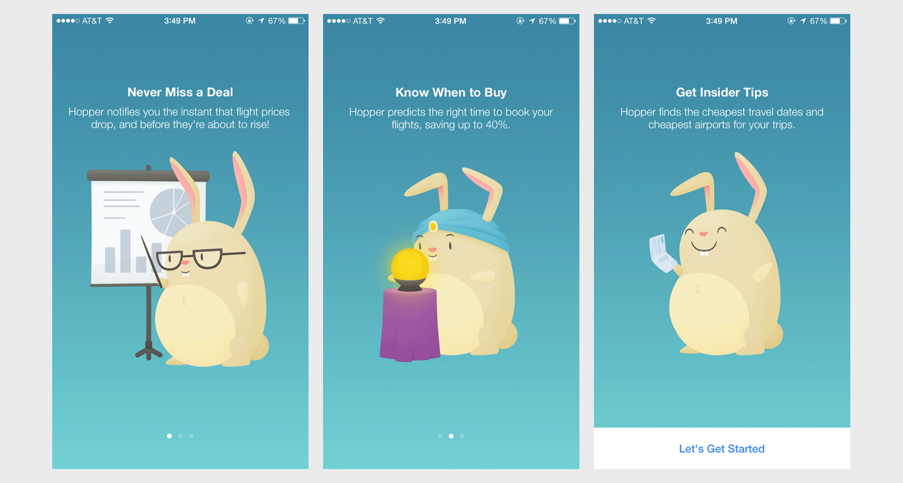

Onboarding design helps give users a sense of what they’ll need to do in order to get what they need from an app or product. It’s a way of building confidence and trust with your user, which not only helps them but is key to [better conversion and retention](https://www.appcues.com/blog/why-user-onboarding-is-the-most-important-part-of-the-customer-journey-by-2-6x) for your business.  

入门设计有助于让用户了解他们需要做什么才能从应用或产品中获得他们需要的东西。这是一种与用户建立信心和信任的方式，不仅可以帮助他们，而且是提高业务转化率和留存率的关键。

## Why Is Onboarding so Important?  

为什么入职如此重要？

First impressions are _rough_. On average, nearly one in [four users will abandon](https://info.localytics.com/blog/21-percent-of-users-abandon-apps-after-one-use) a mobile app after using it _just once_. Ouch. And once they’ve tried your app and left—they’re gone. That’s why it’s absolutely essential to give your users the right-sized app onboarding experience for your product.  

第一印象是粗糙的。平均而言，近四分之一的用户在使用一次移动应用程序后会放弃它。哎哟。一旦他们试用了你的应用并离开了，他们就离开了。这就是为什么为您的用户提供适合您的产品大小的应用入门体验是绝对必要的。

While there can be any number of explanations that illustrate each individual case, it is highly likely that the users that ditched thought they would get something valuable from the app and weren’t immediately convinced.  

虽然可以有很多解释来说明每个案例，但很可能放弃的用户认为他们会从应用程序中得到有价值的东西，并没有立即被说服。

When a user takes the time and effort to download a new app, it is highly probable that they expect the product will enhance their life in some way. Once they open the app, it’s crucial they feel rewarded for their faith in the product right away, otherwise, they are quite justified in abandoning it to try something else.  

当用户花时间和精力下载新应用程序时，他们很可能期望该产品会以某种方式改善他们的生活。一旦他们打开应用程序，至关重要的是，他们立即因对产品的信心而感到奖励，否则，他们完全有理由放弃它来尝试其他东西。

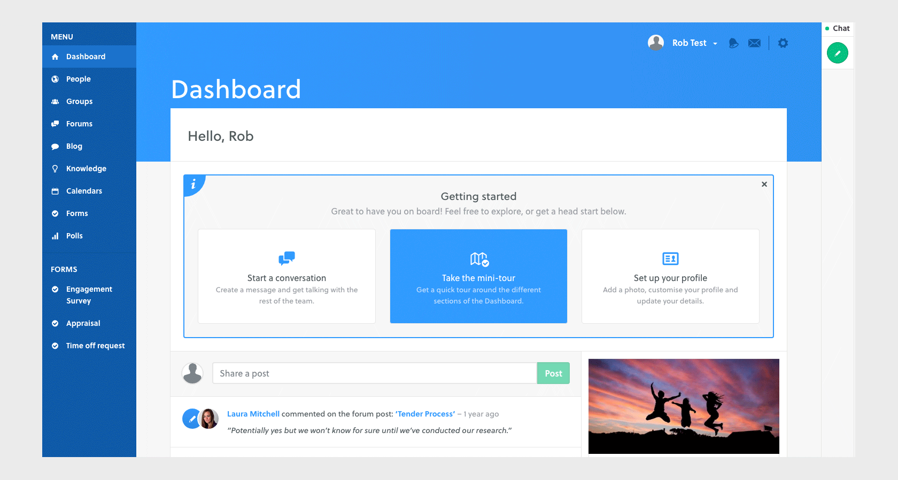

Intranet software platform Twine [cut their drop-off rate of 65% by more than half](https://blog.prototypr.io/ux-writing-how-better-onboarding-cut-our-drop-off-rate-by-45-44e1da0e4d9) by incorporating meaningful onboarding into their experience. They leveraged a multi-pronged approach to creating a richer first impression for visitors, as well as tutorials and progressive onboarding.  

内联网软件平台 Twine 通过将有意义的入职融入到他们的体验中，将 65% 的下降率降低了一半以上。他们利用多管齐下的方法为访客创造更丰富的第一印象，以及教程和渐进式入职培训。

Onboarding also boosts long-term retention. Adding new and exciting features and tools to your product or service is great, but if people don’t know about them or how to use them, they’re of no use to anyone.  

入职还可以提高长期保留率。为您的产品或服务添加新的和令人兴奋的功能和工具固然很好，但如果人们不知道它们或如何使用它们，它们对任何人都没有用。

For example, the popular video sharing platform, [Wistia](https://wistia.com/), had some very cool customization features that were going largely underutilized by their users. After conducting careful user research, they introduced a how-to video to familiarise users with these extra features and saw [a whopping 30% increase in use](https://wistia.com/learn/marketing/testing-onboarding-videos).  

例如，流行的视频共享平台Wistia有一些非常酷的自定义功能，这些功能在很大程度上未被用户利用。在进行了仔细的用户研究后，他们推出了一个操作视频，让用户熟悉这些额外的功能，并看到了高达30%的使用量。

User retention and customer loyalty are major factors in the success of most apps and services. Onboarding should not be an afterthought. Instead, product teams should consider onboarding process UX at each stage of product development. Consider hiring a [user onboarding UX specialist](https://www.toptal.com/designers/onboarding-ux "Hire a user onboarding UX specialist") if no one on the team has that specific expertise.  

用户留存率和客户忠诚度是大多数应用和服务成功的主要因素。入职不应该是事后的想法。相反，产品团队应该在产品开发的每个阶段考虑入职流程 UX。如果团队中没有人具备该特定专业知识，请考虑雇用用户入职 UX 专家。

## Onboarding UX Design Patterns and Methodologies  

入职 UX 设计模式和方法

### Types of Onboarding 入职类型

There are many ways to approach user onboarding within an app or digital product. Most products employ a combination of a few onboarding patterns in order to meet the needs of new users and retain them in the future.  

在应用或数字产品中，有许多方法可以实现用户引导。大多数产品采用一些入职模式的组合，以满足新用户的需求并在未来留住他们。

**The Nickel Tour 镍之旅**

This is a common pattern that is very [popular with mobile applications](https://uxplanet.org/design-of-onboarding-tutorial-greet-inform-engage-55c36c9b4999). Once the user has launched an app for the first time, they are presented with a few quick screens outlining the value of the app and/or some basics on how to get around.  

这是在移动应用程序中非常流行的常见模式。用户首次启动应用后，会看到一些快速屏幕，概述应用的价值和/或有关如何绕过的一些基础知识。

This simple, static introduction serves as a welcome mat for out-of-box users. It should never be more than a few short phrases accompanied by simple graphics—no one wants to read a lengthy instruction manual.  

这个简单、静态的介绍可作为开箱即用用户的欢迎垫。它不应该超过几个简短的短语，伴随着简单的图形——没有人愿意阅读冗长的说明书。

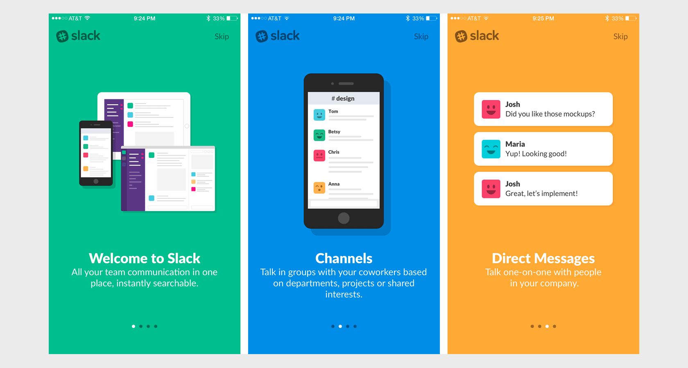

It’s a best practice to provide an indication of progress as well as an exit or skip option for your users. That way, they will understand how much of your introduction they have left to read and don’t feel trapped.  

最佳做法是为用户提供进度指示以及退出或跳过选项。这样，他们就会明白你还剩下多少介绍要读，不会觉得被困住了。

**Coach Marks, Tooltips, and Guidestones  

指导标记、工具提示和指南石**

This is another very common and relatively low-effort method for onboarding users from the beginning and throughout the product experience.  

这是另一种非常常见且相对省力的方法，用于从一开始就和整个产品体验中的用户入职。

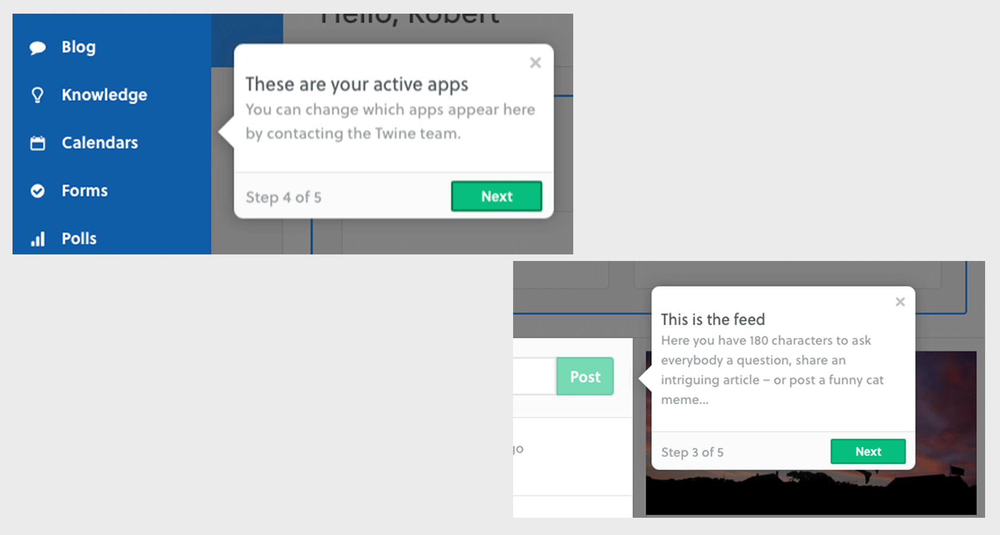

Simple UI devices that draw attention to areas of interaction, buttons, or the location of menus help alert the user to useful elements in an app or site. These are especially helpful in more complex interfaces where these items might not be immediately apparent or easy to understand.  

将注意力吸引到交互区域、按钮或菜单位置的简单 UI 设备有助于提醒用户应用或网站中的有用元素。这些在更复杂的界面中特别有用，在这些界面中，这些项目可能不会立即显现或易于理解。

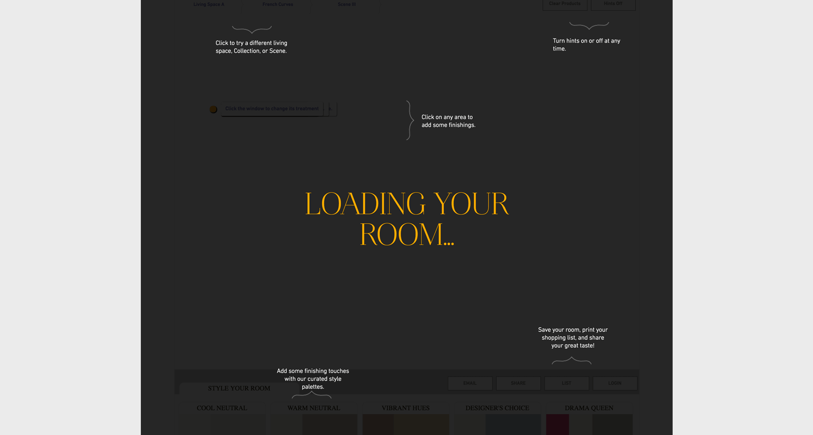

While this kind of annotated onboarding pattern is useful, be careful not to overdo it and bombard your user with tiny windows all at once. Figure out when and where tooltips or coach marks would be most useful. Guide users to one element or action at a time, and avoid explaining too much of the obvious.  

虽然这种带注释的载入模式很有用，但请注意不要过度使用它，并同时用小窗口轰炸您的用户。确定工具提示或指导标记在何时何地最有用。一次引导用户使用一个元素或操作，并避免解释太多显而易见的内容。

**Guided Task Completion 引导式任务完成**

“What we have to learn to do, we learn by doing.”—Aristotle. Often, the best way for something to stick in a user’s mind is for them to actually do it.  

“我们必须学会做的事情，我们边做边学。”——亚里士多德。通常，让某些东西留在用户脑海中的最佳方式是让他们实际去做。

Guided task completion is a method for prompting users to interact with the product in a series of steps. This is very common when the product wants users to create an account and/or set some personalization parameters early on.  

引导式任务完成是一种通过一系列步骤提示用户与产品交互的方法。当产品希望用户尽早创建帐户和/或设置一些个性化参数时，这很常见。

It’s also a great opportunity to help users familiarize themselves with the menus, controls, and other aspects of your product straight away. Also, by helping the user achieve an early “win,” you’re also significantly improving the chances they’ll want to use the product again.  

这也是帮助用户立即熟悉菜单、控件和产品其他方面的好机会。此外，通过帮助用户实现早期“胜利”，您还可以显着提高他们想要再次使用该产品的机会。

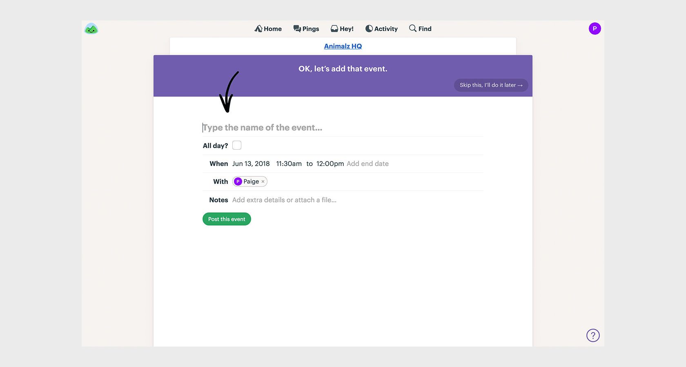

Again, it’s a good idea to give users the ability to skip this kind of onboarding when possible. For account-creation tasks, see if you can design a skippable experience to test for completion rates against a non-skippable flow to see which works best for your users.  

同样，最好让用户能够在可能的情况下跳过这种载入。对于帐户创建任务，请查看是否可以设计可跳过体验来针对不可跳过的流测试完成率，以查看哪种体验最适合您的用户。

### When to Onboard Users  

何时加入用户

Deciding which UX onboarding patterns to use at which part of your product experience is crucial to “right-sizing” your onboarding [user experience design](https://www.toptal.com/designers/ux). Look for opportunities throughout your user journey—from initial launch to continued usage—to give your users a helping hand.  

确定在产品体验的哪个部分使用哪种 UX 载入模式对于“正确调整”入职用户体验设计至关重要。在整个用户旅程（从初始启动到持续使用）中寻找机会，为用户提供帮助。

**Out of the Box Onboarding  

开箱即用的入职培训**

First impressions really matter and this is the most critical moment to get right—you might not get a second chance. As was highlighted before, many users abandon an app or product after the first time they open it.  

第一印象真的很重要，这是最关键的时刻——你可能没有第二次机会。如前所述，许多用户在首次打开应用程序或产品后就放弃了它。

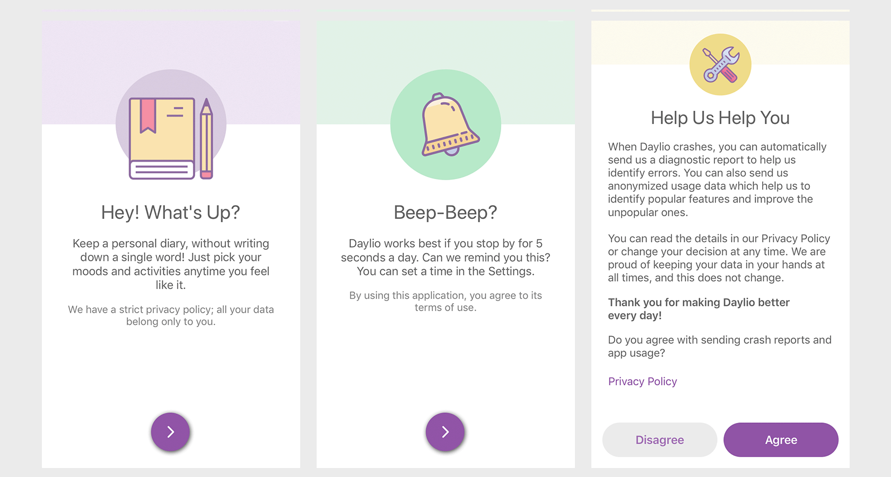

Apply user research and rigorous user testing to figure out whether the right approach for your context is a quick introduction tutorial or a deeper guided experience for first-time users.  

应用用户研究和严格的用户测试来确定适合您的上下文的正确方法是快速介绍教程还是针对首次用户的更深入的引导体验。

**Progressive Onboarding 渐进式入职**

This technique is designed not to leave users out to dry once they’ve completed the out-of-box onboarding flow. There are many opportunities for you to continue to help, illuminate, and delight your users. Think of it like [leveling up your users in game design](https://www.toptal.com/designers/ux/game-ux-product-design).  

此技术旨在让用户在完成开箱即用的载入流程后不会让他们晾干。您有很多机会可以继续帮助、启发和取悦您的用户。把它想象成在游戏设计中提升你的用户。

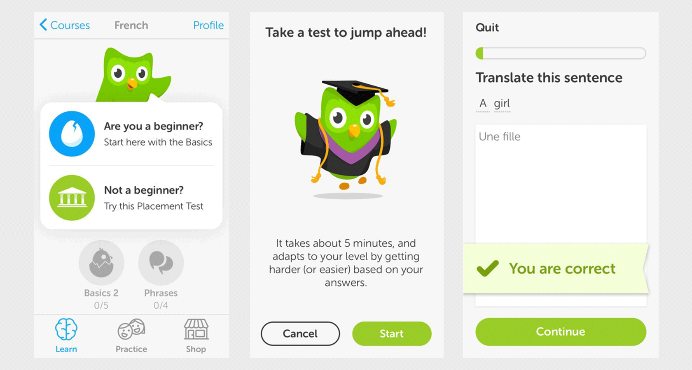

Be sure to incorporate onboarding UI patterns at intervals throughout the relationship. Remind a week-long user to complete a more advanced task that they may not have noticed. Celebrate milestones with lightweight notifications. Survey users about their experience a few weeks out to signal that you care.  

请务必在整个关系中每隔一段时间合并载入 UI 模式。提醒为期一周的用户完成他们可能没有注意到的更高级的任务。通过轻量级通知庆祝里程碑。几周后调查用户的体验，以表明您关心。

**New Feature Onboarding 新功能载入**

This is a bit of a mix of new user and progressive onboarding. When you launch a new feature or make any major changes to the experience, let your users know what’s great about it and how to utilize it.  

这有点像新用户和渐进式入职的混合体。当您启动新功能或对体验进行任何重大更改时，请让用户知道它的优点以及如何使用它。

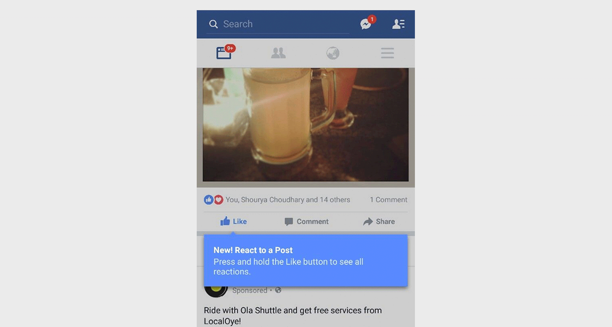

A great way to point out new features is through the use of tooltips and coach marks, which help guide the user’s attention to the location of their new app superpowers.  

指出新功能的一个好方法是使用工具提示和教练标记，这有助于引导用户的注意力到他们的新应用程序超能力的位置。

## Onboarding UX Best Practices and Tips  

载入 UX 最佳实践和提示

### Understand Your User 了解您的用户

The onboarding style for a brand new product on the cutting edge of technology will likely be different than something familiar like a calendar or note-taking app. Look at the personas the team has developed and decide what makes sense to them. Right-size the onboarding experience by understanding the user, and tailor the user onboarding experience to the target personas.  

处于技术前沿的全新产品的入职风格可能与日历或笔记应用程序等熟悉的东西不同。看看团队开发的角色，并决定什么对他们有意义。通过了解用户来调整载入体验的大小，并根据目标角色定制用户载入体验。

Discover and leverage your users’ existing [mental models](https://www.toptal.com/designers/user-experience/mental-models-ux-design) in order to help bridge any gaps in what they expect from your app or website. Know what signifiers your design can rely on vs innovations that may be confusing at first blush.  

发现并利用用户现有的心智模型，以帮助弥合他们对您的应用或网站的期望中的任何差距。了解您的设计可以依赖哪些能指，而不是乍一看可能令人困惑的创新。

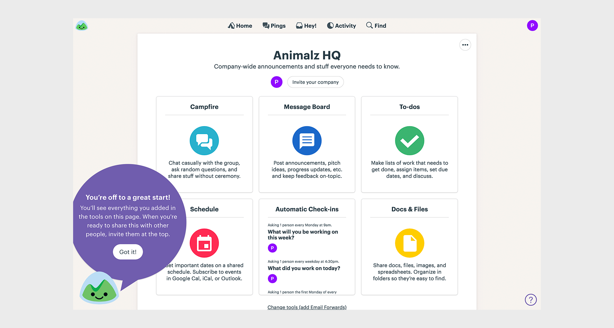

[User research](https://www.toptal.com/designers/user-research) will help your team build empathy with your core audience. As you build your product, frequent user testing and [usability analysis](https://www.toptal.com/designers/ux/guide-to-ux-analysis) will help your team not only make improvements to the overall design but will inform which areas to focus on with user onboarding.  

用户研究将帮助您的团队与核心受众建立同理心。在构建产品时，频繁的用户测试和可用性分析不仅可以帮助您的团队改进整体设计，还可以告知用户入职应关注哪些领域。

Balance qualitative user research with metrics that will help illuminate issues in your onboarding experience. For example, if you notice a significant abandonment during a preferences-setting onboarding experience, check in with your users. Maybe the experience is too heavy or too personal; maybe they want to get to the good stuff sooner and you can make adjustments to the flow.  

平衡定性用户研究与有助于阐明入职体验中问题的指标。例如，如果在首选项设置载入体验期间发现明显放弃，请与用户联系。也许体验太沉重或太个人化;也许他们想更快地得到好东西，你可以对流程进行调整。

### Tie Onboarding to Value for the User  

将入职与用户的价值联系起来

Your out-of-box onboarding UX should be focused on getting the user to a wow moment of satisfaction as seamlessly as possible. Single out the core value proposition for your user, and find a way to communicate that first.  

开箱即用的入职用户体验应专注于让用户尽可能无缝地获得令人惊叹的满意时刻。为您的用户挑选出核心价值主张，并首先找到一种传达它的方法。

Use the benefits introduction onboarding to remind users why your app or service is the best to meet a specific need. If your onboarding flow involves personalization, explain to users why you’re asking them questions about their personal preferences or situation, and how it will enhance their experience.  

使用权益介绍入门提醒用户为什么你的应用或服务最适合满足特定需求。如果您的入职流程涉及个性化，请向用户解释您向他们询问有关其个人偏好或情况的问题的原因，以及这将如何增强他们的体验。

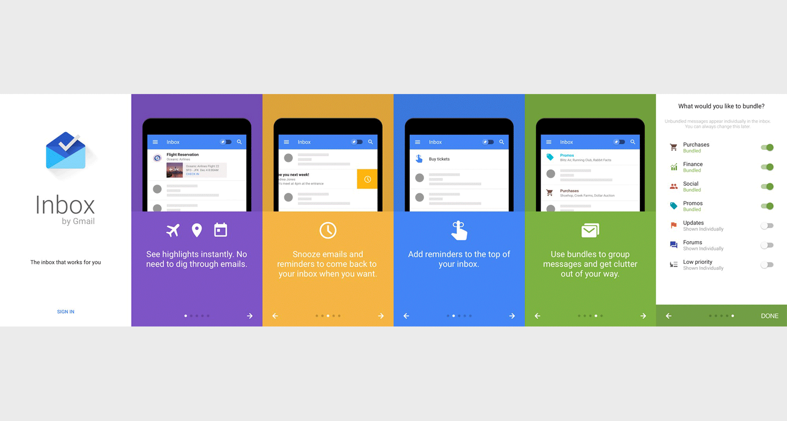

Onboarding or instruction that is not immediately tied to value for the user, such as a neat-but-not-critical feature can be introduced later in the app or through lighter-touch onboarding. It’s good to let users know about extras, but if it’s not essential to the core experience, it’s not as important to the introduction.  

可以稍后在应用中或通过轻触式载入引入，但不会立即与用户的价值相关联的载入或说明，例如整洁但不重要的功能。让用户了解附加功能是件好事，但如果它对核心体验不是必需的，那么对介绍就不那么重要了。

### Make It Quick and Painless  

让它快速无痛

“The main thing you need to know about instructions is that no one is going to read them—at least not until after repeated attempts at ‘muddling through’ have failed.”  

“关于说明，你需要知道的主要事情是，没有人会阅读它们——至少在反复尝试'蒙混过关'失败之前不会。

― Steve Krug, [Don’t Make Me Think](https://www.goodreads.com/book/show/18197267-don-t-make-me-think-revisited).  

―史蒂夫克鲁格，不要让我思考。

While you don’t want to strand your user in an unexplained field of confusing buttons and toggles, you also don’t want to force them to sit through multi-step instructions that feel like work. Does anyone even open instruction manuals anymore?  

虽然您不想将用户束缚在令人困惑的按钮和切换的无法解释的领域中，但您也不想强迫他们坐下来阅读感觉像工作的多步骤说明。还有人打开说明书了吗？

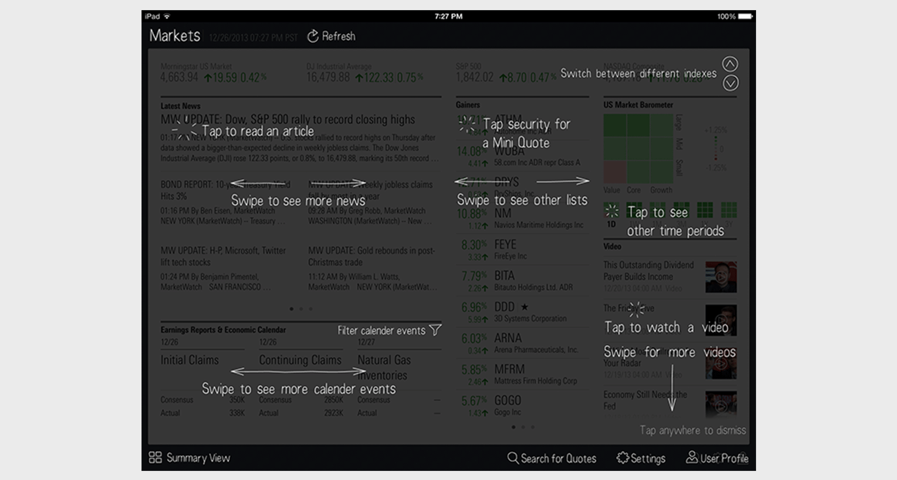

Again, the heft of your onboarding experience should correlate to insights from user research and the complexity of your product. But even for brand new, innovative technology, you don’t want your users to become bored or intimidated with a lengthy preamble.  

同样，您的入职体验的分量应该与用户研究的见解和产品的复杂性相关。但即使是全新的创新技术，您也不希望用户对冗长的序言感到无聊或害怕。

If the app or product is simple, a quick introduction and handshake is likely enough. When more depth is needed, consider adopting progressive onboarding that spreads the onboarding across the app experience, dipping in and out as needed to provide guidance and scaffolding.  

如果应用程序或产品很简单，快速介绍和握手可能就足够了。当需要更深入时，请考虑采用渐进式载入，将载入分散到整个应用体验中，根据需要深入和退出以提供指导和基架。

Also, allow users to skip or delay onboarding if they want. If your app introduction is 4 or more screens that the user has to swipe or click through, the skip button can make a world of difference.  

此外，允许用户根据需要跳过或延迟载入。如果你的应用简介是用户必须轻扫或单击的 4 个或更多屏幕，则跳过按钮可能会带来天壤之别。

### Make It Repeatable 使其可重复

Don’t forget to give users a way back into any guides or walkthroughs you’ve shown them—especially if you’ve followed UX onboarding best practices by making your introduction tutorial, or other onboarding patterns, skippable.  

不要忘记让用户回到你向他们展示的任何指南或演练，特别是如果你通过使简介教程或其他入门模式可跳过来遵循 UX 载入最佳做法。

You cannot assume that your users won’t ever want access to your instructional videos or interface tour again. They may have forgotten one or two clever tips mentioned in the first-time onboarding—or find themselves lost after impulsively skipping the whole thing.  

您不能假设您的用户再也不想访问您的教学视频或界面导览。他们可能忘记了第一次入职时提到的一两个聪明的技巧，或者在冲动地跳过整个过程后发现自己迷失了方向。

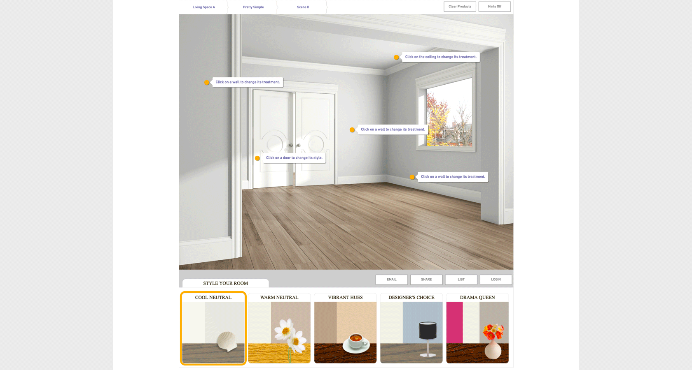

Include a “help” section in your navigation that includes a pathway to repeat any onboarding that may have slipped your user’s mind.  

在导航中包含“帮助”部分，其中包括重复任何可能误会用户想法的载入的路径。

### Don’t Get Too Personal  

不要太个人化

Long forms that ask too many questions are user bounce machines. It’s nice to encourage a brand new user to provide some information that will help personalize their experience, but it’s important to [not get creepy](https://www.toptal.com/designers/web/optimize-your-site-for-conversions-7-strategies-that-work) by asking for too many details.  

提出太多问题的长表单是用户跳票机。鼓励全新的用户提供一些有助于个性化他们体验的信息是件好事，但重要的是不要因为询问太多细节而变得令人毛骨悚然。

In a time when privacy is becoming more scarce and personally valuable, you should not be asking a ton of unnecessary questions, especially at the beginning. Some apps require users to set preferences or make decisions before being allowed to use an app, which is a terrible idea.  

在隐私变得越来越稀缺和个人价值的时代，你不应该问很多不必要的问题，尤其是在开始时。某些应用程序要求用户在被允许使用应用程序之前设置首选项或做出决定，这是一个糟糕的主意。

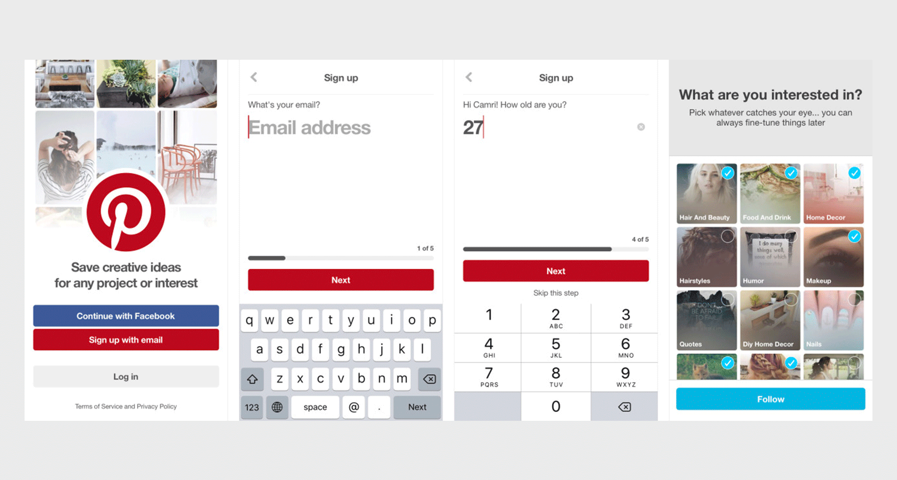

Remember, you can always fold this kind of information-gathering into the experience at later stages. Build trust with your user by inviting them in and allowing them to look around before trying to find out more information—you won’t get much data from a user that abandons immediately.  

请记住，您始终可以将这种信息收集纳入后期阶段的体验中。通过邀请用户加入并允许他们在尝试查找更多信息之前四处查看来建立与用户的信任 - 您不会从立即放弃的用户那里获得太多数据。

I was once hired by a [shopping platform](http://breechapin.com/ideel-responsive-web-and-mobile) to help them reconfigure their onboarding experience in order to improve conversions. By comparing the first time user experience flow with the data from analytics, it became obvious that the drop-off was happening during screens that were asking the user to provide a ton of personal information, as well as make some seemingly final preference choices up front.  

我曾经被一家购物平台聘用，帮助他们重新配置入职体验，以提高转化率。通过将第一次用户体验流与来自分析的数据进行比较，很明显，下降发生在要求用户提供大量个人信息的屏幕期间，并预先做出一些看似最终的偏好选择。

While this information was valuable to the business and would help personalize the experience for users, they were abandoning the signup process. We decided to cut information requests down to just an email. We also reduced the shopping preference questions from 8 to 3 and allowed users multiple choices and the option to skip. This resulted in an over 30% reduction in the bounce rate almost immediately.  

虽然这些信息对业务很有价值，并且有助于为用户提供个性化的体验，但他们放弃了注册过程。我们决定将信息请求减少到只有一封电子邮件。我们还将购物偏好问题从 8 个减少到 3 个，并允许用户进行多种选择和跳过的选项。这导致跳出率几乎立即降低了 30% 以上。

### Don’t Rely on Tutorials to Cover for Bad UX  

不要依赖教程来掩盖糟糕的用户体验

Remember: even with onboarding, your app or website should still make sense and be as clear as possible. Onboarding is scaffolding, not a crutch for bad design.  

请记住：即使有新手引导，您的应用或网站仍应有意义且尽可能清晰。入职是脚手架，而不是糟糕设计的拐杖。

Too many confusing—frankly, just bad—products and apps have tried to cover up poor design decisions by bombarding their user with lengthy instructions or a barrage of tooltips. This is not good design practice and will not keep your users coming back.  

太多令人困惑（坦率地说，只是糟糕）的产品和应用程序试图通过冗长的说明或一连串的工具提示轰炸用户来掩盖糟糕的设计决策。这不是好的设计实践，不会让你的用户回来。

If you’re finding your app or product continues to be unusable as you layer on heavier and heavier onboarding patterns, it’s time to take a cold, objective look at your core design and start making improvements there.  

如果你发现你的应用或产品仍然无法使用，因为你的入门模式越来越重，那么是时候冷静、客观地审视你的核心设计并开始在那里进行改进了。

## Onboarding Services 入职服务

If you approach your engineering team with a stack of ideas on adding guided task completion to your project, you might come up against a good deal of resistance. Complex onboarding patterns require a lot of dev effort and can present their own minefield of technical concerns.  

如果你带着一堆关于向项目添加引导式任务完成的想法来接近你的工程团队，你可能会遇到很多阻力。复杂的入职模式需要大量的开发工作，并且可能会带来自己的技术问题雷区。

Luckily, there are a growing number of services and platforms that provide painless UX onboarding. Here are a few to check out:  

幸运的是，有越来越多的服务和平台提供无痛的用户体验入职。以下是一些需要查看的内容：

-   [Walkme](https://www.walkme.com/) is a popular service that provides a wealth of tools to build walkthroughs and tutorials as well as track onboarding performance.  
    
    Walkme 是一项流行的服务，它提供了丰富的工具来构建演练和教程以及跟踪载入性能。
-   [Appcues](https://www.appcues.com/) gives app teams tools to layer on an onboarding experience for their product with a lot of customization and tracking.  
    
    Appcues 为应用团队提供了工具，通过大量自定义和跟踪为其产品提供入门体验。
-   [Nickelled](https://www.nickelled.com/) helps you create guided tours and overviews of your website or service will tooltips, coach marks, modals and more.  
    
    Nickelled可帮助您创建网站或服务的工具提示，教练标记，模态等的导览和概述。

It’s a good idea to invest some time and research into crafting the appropriate onboarding UX patterns for your users. Incorporating the right onboarding UX for new and existing users alike is essential if apps and other digital products are to retain and fulfill their user’s needs.  

最好花一些时间和研究来为您的用户制作适当的入职 UX 模式。如果应用程序和其他数字产品要保留并满足用户的需求，那么为新用户和现有用户整合正确的入门用户体验至关重要。

Onboarding is not about just one moment, it’s a journey that establishes and maintains trust with your audience. A great onboarding experience will help your users use your product to build habits that rely on its features as an important part of their lives.  

入职不仅仅是一个时刻，而是一个与观众建立并保持信任的旅程。出色的入门体验将帮助您的用户使用您的产品来养成习惯，这些习惯依赖于其功能作为他们生活的重要组成部分。

## Understanding the basics 了解基础知识

-   ### What is an onboarding experience?  
    
    什么是入职体验？
    
    An onboarding experience is a way to introduce users to a new product, app, or feature. Onboarding UX is the design of a flow or series of flows that give the user a guided introduction to the product, set up some initial preferences, or point out critical UI elements in an interface.  
    
    载入体验是一种向用户介绍新产品、应用或功能的方式。载入 UX 是一个或一系列流的设计，为用户提供产品的指导性介绍、设置一些初始首选项或指出界面中的关键 UI 元素。
    
-   ### What is an onboarding flow?  
    
    什么是入职流程？
    
    A first-time user onboarding UX flow is one that introduces the product, app, or feature to a user. The onboarding flow may also involve guiding the user through completing a few tasks, such as setting up an account or setting preferences.  
    
    首次用户载入 UX 流程是向用户介绍产品、应用或功能的流程。载入流程还可能涉及指导用户完成一些任务，例如设置帐户或设置首选项。
    
-   ### What does user onboarding mean?  
    
    用户引导是什么意思？
    
    User onboarding is a process of using onboarding UX patterns to introduce users to new apps, products, or features. By providing a good first-time user experience, designers can hope for better usability and user retention.  
    
    用户引导是使用载入 UX 模式向用户介绍新应用、产品或功能的过程。通过提供良好的首次用户体验，设计人员可以希望获得更好的可用性和用户保留率。
