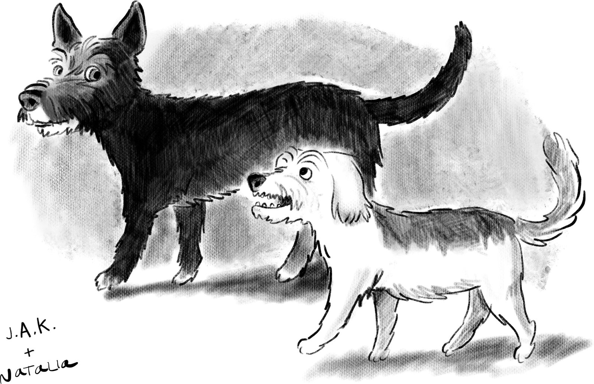

In 2021, Elon Musk became the world’s richest man (no woman came close), and _Time_ named him Person of the Year: “This is the man who aspires to save our planet and get us a new one to inhabit: clown, genius, edgelord, visionary, industrialist, showman, cad; a madcap hybrid of Thomas Edison, P. T. Barnum, Andrew Carnegie and _Watchmen_’s Doctor Manhattan, the brooding, blue-skinned man-god who invents electric cars and moves to Mars.” Right about when _Time_ was preparing that giddy announcement, three women whose ovaries and uteruses were involved in passing down the madcap man-god’s genes were in the maternity ward of a hospital in Austin. Musk believes a declining birth rate is a threat to civilization and, with his trademark tirelessness, is doing his visionary edgelord best to ward off that threat. Shivon Zilis, a thirty-five-year-old venture capitalist and executive at Musk’s company Neuralink, was pregnant with twins, conceived with Musk by in-vitro fertilization, and was experiencing complications. “He really wants smart people to have kids, so he encouraged me to,” Zilis said. In a nearby room, a woman serving as a surrogate for Musk and his thirty-three-year-old ex-wife, Claire Boucher, a musician better known as Grimes, was suffering from pregnancy complications, too, and Grimes was staying with her.  

2021 年，埃隆·马斯克成为世界上最富有的人（没有女人能与之相提并论），《时代》杂志将他评为年度人物：“这个人渴望拯救我们的星球，让我们有一个新的居住地：小丑、天才、边缘领主、有远见的人、实业家、表演者、干部;托马斯·爱迪生、P·T·巴纳姆、安德鲁·卡内基和守望者的曼哈顿博士的疯狂混合体，这位沉思的蓝皮肤人神发明了电动汽车并搬到了火星。就在《时代》杂志准备这个令人眼花缭乱的公告时，三名卵巢和子宫参与传递疯子男神基因的女性在奥斯汀一家医院的产科病房里。马斯克认为，出生率下降是对文明的威胁，并且凭借他标志性的不知疲倦，正在尽他富有远见的边缘领主尽最大努力抵御这种威胁。希文·齐利斯（Shivon Zilis）是一位三十五岁的风险投资家，也是马斯克公司Neuralink的高管，他怀了双胞胎，通过体外受精与马斯克一起怀孕，并且正在经历并发症。“他真的希望聪明的人有孩子，所以他鼓励我这样做，”齐利斯说。在附近的一个房间里，一名为马斯克和他三十三岁的前妻克莱尔·鲍彻（Claire Boucher）代理的女性也患有妊娠并发症，格莱姆斯和她住在一起。

“I really wanted him to have a daughter so bad,” Grimes said. At the time, Musk had had seven sons, including, with Grimes, a child named X. Grimes did not know that Zilis, a friend of hers, was down the hall, or that Zilis was pregnant by Musk. Zilis’s twins were born seven weeks premature; the surrogate delivered safely a few weeks later. In mid-December, Grimes’s new baby came home and met her brother X. An hour later, Musk took X to New York and dandled him on his knee while being photographed for _Time_.  

“我真的希望他有一个如此糟糕的女儿，”格莱姆斯说。当时，马斯克有七个儿子，包括一个名叫X.格莱姆斯的孩子，他不知道她的朋友齐利斯在大厅里，也不知道齐利斯被马斯克怀孕了。齐利斯的双胞胎早产七周;几周后，代理人安全分娩。12月中旬，格莱姆斯的新生儿回家，遇到了她的哥哥X。一个小时后，马斯克带着X去了纽约，在为《时代周刊》拍照时，他跪在地上。

“He dreams of Mars as he bestrides Earth, square-jawed and indomitable,” the magazine’s Person of the Year announcement read. Musk and Grimes called the baby, Musk’s tenth, Y, or sometimes “Why?,” or just “?”—a reference to Musk’s favorite book, Douglas Adams’s “The Hitchhiker’s Guide to the Galaxy,” because, Grimes explained, it’s a book about how knowing the question is more important than knowing the answer.  

“他梦想着火星，因为他最擅长地球，方下巴和不屈不挠，”该杂志的年度人物公告中写道。马斯克和格莱姆斯称婴儿为马斯克的第十个Y，有时是“为什么？”，或者只是“？”——参考了马斯克最喜欢的书，道格拉斯·亚当斯（Douglas Adams）的《银河系漫游指南》（The Hitchhiker's Guide to the Galaxy），因为格莱姆斯解释说，这是一本关于知道问题比知道答案更重要的书。

Elon Musk is currently at or near the helm of six companies: Tesla, SpaceX (which includes Starlink), the Boring Company, Neuralink, X (formerly known as Twitter), and X.AI, an artificial-intelligence company that he founded, earlier this year, because he believes that human intelligence isn’t reproducing fast enough, while artificial intelligence is getting more artificially intelligent exponentially. Call it Musk’s Law: the answer to killer robots is more Musk babies. Plus, more Musk companies. “I can’t just sit around and do nothing,” Musk says, fretting about A.I., in Walter Isaacson’s new biography, “Elon Musk” (Simon & Schuster), a book that can scarcely contain its subject, in that it raises infinitely more questions than it answers.  

埃隆·马斯克（Elon Musk）目前掌舵或接近掌舵六家公司：特斯拉，SpaceX（包括Starlink），Boring Company，Neuralink，X（前身为Twitter）和他今年早些时候创立的人工智能公司 X.AI，因为他认为人类智能的繁殖速度不够快，而人工智能正在以指数方式变得更加人工智能。称之为马斯克定律：杀手机器人的答案是更多的马斯克婴儿。此外，更多的马斯克公司。“我不能坐在那里什么都不做，”马斯克在沃尔特·艾萨克森（Walter Isaacson）的新传记《埃隆·马斯克》（Elon Musk）中对人工智能感到担忧，这本书几乎无法包含其主题，因为它提出的问题比回答的问题要多得多。

“Are you sincerely trying to save the world?” Stephen Colbert once asked Musk on “The Late Show.” “Well, I’m trying to do good things, yeah, saving the world is not, I mean . . . ,” Musk said, mumbling. “But you’re trying to do good things, and you’re a billionaire,” Colbert interrupted. “Yeah,” Musk said, nodding. Colbert said, “That seems a little like superhero or supervillain. You have to choose one.” Musk paused, his face blank. That was eight years, several companies, and as many children ago. Things have got a lot weirder since. More Lex Luthor, less Tony Stark.  

“你是真心想拯救世界吗？”斯蒂芬·科尔伯特（Stephen Colbert）曾在《深夜秀》（The Late Show）中问过马斯克。“嗯，我正在努力做好事，是的，拯救世界不是，我的意思是......”马斯克喃喃自语。“但你正在努力做好事，而且你是亿万富翁，”科尔伯特打断道。“是的，”马斯克说，点点头。科尔伯特说：“这似乎有点像超级英雄或超级反派。你必须选择一个。马斯克停顿了一下，脸上一片空白。那是八年，几家公司，以及许多孩子之前。从那以后，事情变得更加奇怪。多莱克斯·卢瑟，少一些托尼·斯塔克。

Musk controls the very tiniest things, and the very biggest. He oversees companies, valued at more than a trillion dollars, whose engineers have built or are building, among other things, reusable rocket ships, a humanoid robot, hyperloops for rapid transit, and a man-machine interface to be implanted in human brains. He is an entrepreneur, a media mogul, a political provocateur, and, not least, a defense contractor: SpaceX has received not only billions of dollars in government contracts for space missions but also more than a hundred million dollars in military contracts for missile-tracking satellites, and Starlink’s network of four thousand satellites—which provides Pentagon-funded services to Ukraine—now offers a military service called Starshield. Day by day, Musk’s companies control more of the Internet, the power grid, the transportation system, objects in orbit, the nation’s security infrastructure, and its energy supply.  

马斯克控制着最微小的东西，也是最大的事情。他监督着价值超过一万亿美元的公司，这些公司的工程师已经建造或正在建造可重复使用的火箭飞船、人形机器人、用于快速运输的超级高铁以及植入人脑的人机界面。他是一位企业家、媒体大亨、政治挑衅者，尤其是国防承包商：SpaceX 不仅获得了数十亿美元的太空任务政府合同，而且还获得了超过 1 亿美元的导弹跟踪卫星军事合同，而 Starlink 的四千颗卫星网络——为乌克兰提供五角大楼资助的服务——现在提供名为 Starshield 的军事服务。日复一日，马斯克的公司控制着更多的互联网、电网、交通系统、轨道上的物体、国家安全基础设施和能源供应。

And yet. At a jury trial earlier this year, Musk’s lawyer repeatedly referred to his client, a middle-aged man, as a “kid.” The _Wall Street Journal_ has described him as suffering from “tantrums.” The _Independent_ has alleged that selling Twitter to Musk was “like handing a toddler a loaded gun.”  

而。在今年早些时候的陪审团审判中，马斯克的律师多次称他的当事人，一名中年男子，是一个“孩子”。《华尔街日报》称他患有“发脾气”。《独立报》称，向马斯克出售Twitter“就像递给一个蹒跚学步的孩子一把上膛的枪”。

“I’m not evil,” Musk said on “Saturday Night Live” a couple of years ago, playing the dastardly Nintendo villain Wario, on trial for murdering Mario. “I’m just misunderstood.” How does a biographer begin to write about such a man? Some years back, after Isaacson had published a biography of Benjamin Franklin and was known to be writing one of Albert Einstein, the Apple co-founder Steve Jobs called him up and asked him to write his biography; Isaacson says he wondered, half jokingly, whether Jobs “saw himself as the natural successor in that sequence.” I don’t think Musk sees himself as a natural successor to anyone. As I read it, Isaacson found much to like and admire in Jobs but is decidedly uncomfortable with Musk. (He calls him, at one point, “an asshole.”) Still, Isaacson’s descriptions of Jobs and Musk are often interchangeable. “His passions, perfectionism, demons, desires, artistry, devilry, and obsession for control were integrally connected to his approach to business and the products that resulted.” (That’s Jobs.) “It was in his nature to want total control.” (Musk.) “He didn’t have the emotional receptors that produce everyday kindness and warmth and a desire to be liked.” (Musk.) “He was not a model boss or human being.” (Jobs.) “This is a book about the roller-coaster life and searingly intense personality of a creative entrepreneur whose passion for perfection and ferocious drive revolutionized six industries.” I ask you: Which?  

“我不是邪恶的，”马斯克几年前在“周六夜现场”上说，扮演卑鄙的任天堂反派瓦里奥，因谋杀马里奥而受审。“我只是误会了。”传记作者如何开始写这样一个人？几年前，在艾萨克森出版了本杰明·富兰克林的传记并众所周知正在写阿尔伯特·爱因斯坦的传记之后，苹果联合创始人史蒂夫·乔布斯打电话给他，请他写传记;艾萨克森说，他半开玩笑地想知道乔布斯是否“认为自己是那个序列的自然继承者”。我不认为马斯克认为自己是任何人的天然接班人。当我读到它时，艾萨克森在乔布斯身上发现了很多喜欢和钦佩的东西，但显然对马斯克感到不舒服。（他一度称他为“混蛋”。尽管如此，艾萨克森对乔布斯和马斯克的描述往往是可以互换的。“他的激情、完美主义、恶魔、欲望、艺术性、魔鬼和对控制的痴迷与他的商业方法和由此产生的产品密不可分。（那是工作。“想要完全控制是他的天性。（马斯克。“他没有产生日常善良和温暖的情感受体，也没有被喜欢的欲望。（马斯克。“他不是模范老板或人类。（工作。“这是一本关于过山车生活的书，一位富有创造力的企业家的强烈个性，他对完美的热情和凶猛的驱动力彻底改变了六个行业。我问你：哪个？

“Sometimes great innovators are risk-seeking man-children who resist potty training,” Isaacson concludes in the last lines of his life of Musk. “They can be reckless, cringeworthy, sometimes even toxic. They can also be crazy. Crazy enough to think they can change the world.” It’s a disconcerting thing to read on page 615 of a biography of a fifty-two-year-old man about whom a case could be made that he wields more power than any other person on the planet who isn’t in charge of a nuclear arsenal. Not potty-trained? Boys will be . . . toddlers?  

“有时伟大的创新者是寻求冒险的男人孩子，他们抵制如厕训练，”艾萨克森在他马斯克生命的最后一行中总结道。“他们可能是鲁莽的，令人畏缩的，有时甚至是有毒的。他们也可能很疯狂。疯狂到认为他们可以改变世界。在第615页读到一个五十二岁的男人的传记是一件令人不安的事情，可以证明他比地球上任何其他不负责核武库的人都拥有更大的权力。没有受过如厕训练？男孩会 . . .幼儿？

Elon Musk was born in Pretoria, South Africa, in 1971. His grandfather J. N. Haldeman was a staunch anti-Communist from Canada who in the nineteen-thirties and forties had been a leader of the anti-democratic and quasi-fascist Technocracy movement. (Technocrats believed that scientists and engineers should rule.) “In 1950, he decided to move to South Africa,” Isaacson writes, “which was still ruled by a white apartheid regime.” In fact, apartheid had been declared only in 1948, and the regime was soon recruiting white settlers from North America, promising restless men such as Haldeman that they could live like princes. Isaacson calls Haldeman’s politics “quirky.” In 1960, Haldeman self-published a tract, “The International Conspiracy to Establish a World Dictatorship & the Menace to South Africa,” that blamed the two World Wars on the machinations of Jewish financiers.  

埃隆·马斯克于1971年出生于南非比勒陀利亚。他的祖父J.N.霍尔德曼（J. N. Haldeman）是来自加拿大的坚定反共分子，在十九世纪三十年代和四十年代一直是反民主和准法西斯技术官僚运动的领导人。（技术官僚认为科学家和工程师应该统治。“1950年，他决定搬到南非，”艾萨克森写道，“那里仍然由白人种族隔离政权统治。事实上，种族隔离直到1948年才宣布，该政权很快就从北美招募白人定居者，向霍尔德曼等不安分的人承诺他们可以像王子一样生活。艾萨克森称霍尔德曼的政治“古怪”。1960年，霍尔德曼自行出版了一本名为《建立世界独裁的国际阴谋和对南非的威胁》的小册子，将两次世界大战归咎于犹太金融家的阴谋诡计。

Musk’s mother, Maye Haldeman, was a finalist for Miss South Africa during her tumultuous courtship with his father, Errol Musk, an engineer and an aviator. In 2019, she published a memoir titled “A Woman Makes a Plan: Advice for a Lifetime of Adventure, Beauty, and Success.” For all that she writes about growing up in South Africa in the nineteen-fifties and sixties, she never once mentions apartheid.  

马斯克的母亲梅耶·霍尔德曼（Maye Haldeman）在与工程师兼飞行员埃罗尔·马斯克（Errol Musk）的动荡求爱中入围了南非小姐的决赛。2019年，她出版了一本名为《女人制定计划：一生冒险、美丽和成功的建议》的回忆录。尽管她写了所有关于十九世纪五十年代和六十年代在南非长大的文章，但她从未提及过种族隔离。

Isaacson, in his account of Elon Musk’s childhood, barely mentions apartheid himself. He writes at length and with compassion about the indignities heaped upon young Elon by schoolmates. Elon, an awkward, lonely boy, was bored in school and had a tendency to call other kids “stupid”; he was also very often beaten up, and his father frequently berated him, but when he was ten, a few years after his parents divorced, he chose to live with him. (Musk is now estranged from his father, a conspiracist who has called Joe Biden a “pedophile President,” and who has two children by his own stepdaughter; he has said that “the only thing we are here for is to reproduce.” Recently, he warned Elon, in an e-mail, that “with no Whites here, the Blacks will go back to the trees.”)  

艾萨克森在描述埃隆·马斯克的童年时，几乎没有提到种族隔离本身。他长篇大论，充满同情心地写下了同学们对年轻埃隆的侮辱。埃隆，一个笨拙、孤独的男孩，在学校很无聊，有称其他孩子“愚蠢”的倾向;他也经常被殴打，父亲也经常斥责他，但在他十岁的时候，也就是父母离婚几年后，他选择和他一起生活。（马斯克现在与他的父亲疏远了，他的父亲是一个阴谋论者，他称乔·拜登为“恋童癖总统”，他有两个孩子;他说“我们来这里的唯一目的就是繁衍后代。最近，他在一封电子邮件中警告埃隆，“这里没有白人，黑人会回到树上。

“I’m trying to get better at barking for what I want.”  

“我正在努力更好地吠叫我想要的东西。”

Cartoon by Jason Adam Katzenstein and Natalia Winkelman  

杰森·亚当·卡岑斯坦和纳塔利娅·温克尔曼的卡通片

Musk’s childhood sounds bad, but Isaacson’s telling leaves out rather a lot about the world in which Musk grew up. In the South Africa of “Elon Musk,” there are Musks and Haldemans—Elon and his younger brother and sister and his many cousins—and there are animals, including the elephants and monkeys who prove to be a nuisance at a construction project of Errol’s. There are no other people, and there are certainly no Black people, the nannies, cooks, gardeners, cleaners, and construction workers who built, for white South Africans, a fantasy world. And so, for instance, we don’t learn that in 1976, when Elon was four, some twenty thousand Black schoolchildren in Soweto staged a protest and heavily armed police killed as many as seven hundred. Instead, we’re told, “As a kid growing up in South Africa, Elon Musk knew pain and learned how to survive it.”  

马斯克的童年听起来很糟糕，但艾萨克森的讲述遗漏了很多关于马斯克成长的世界。在“埃隆·马斯克”的南非，有马斯克和霍尔德曼——埃隆和他的弟弟妹妹以及他的许多堂兄弟——还有动物，包括大象和猴子，它们被证明是埃罗尔建筑项目的麻烦。没有其他人，当然也没有黑人，保姆，厨师，园丁，清洁工和建筑工人，他们为南非白人建造了一个幻想世界。因此，例如，我们不知道在1976年，当埃隆四岁时，索韦托约有两万名黑人学童举行了抗议活动，全副武装的警察杀死了多达七百人。相反，我们被告知，“作为一个在南非长大的孩子，埃隆马斯克知道痛苦并学会了如何生存。

Musk, the boy, loved video games and computers and Dungeons & Dragons and “The Hitchhiker’s Guide to the Galaxy,” and he still does. “I took from the book that we need to extend the scope of consciousness so that we are better able to ask the questions about the answer, which is the universe,” Musk tells Isaacson. Isaacson doesn’t raise an eyebrow, and you can wonder whether he has read “Hitchhiker’s Guide,” or listened to the BBC 4 radio play on which it is based, first broadcast in 1978. It sounds like this:  

马斯克这个男孩喜欢电子游戏、电脑、龙与地下城和《银河系漫游指南》，他现在仍然喜欢。“我从书中了解到，我们需要扩大意识的范围，以便我们能够更好地提出关于答案的问题，即宇宙，”马斯克告诉艾萨克森。艾萨克森没有挑眉，你可以怀疑他是否读过《搭便车指南》，或者听过它所依据的BBC 4广播剧，该剧于1978年首次播出。听起来是这样的：

> Far back in the mists of ancient time, in the great and glorious days of the former galactic empire, life was wild, rich, and, on the whole, tax free. . . . Many men of course became extremely rich, but this was perfectly natural because no one was really poor, at least, no one worth speaking of.  
> 
> 早在远古时代的迷雾中，在前银河帝国伟大而辉煌的日子里，生活是狂野的，丰富的，总的来说，免税......当然，许多人变得非常富有，但这是完全自然的，因为没有人是真正的穷人，至少，没有人值得一提。

“The Hitchhiker’s Guide” is not a book about how “we need to extend the scope of consciousness so that we are better able to ask the questions about the answer, which is the universe.” It is, among other things, a razor-sharp satiric indictment of imperialism:  

《搭便车指南》不是一本关于“我们需要如何扩大意识范围，以便我们能够更好地提出关于答案的问题，即宇宙”的书。除其他外，这是对帝国主义的尖锐讽刺控诉：

> And for these extremely rich merchants life eventually became rather dull, and it seemed that none of the worlds they settled on was entirely satisfactory. Either the climate wasn’t quite right in the later part of the afternoon or the day was half an hour too long or the sea was just the wrong shade of pink. And thus were created the conditions for a staggering new form of industry: custom-made, luxury planet-building.  
> 
> 对于这些极其富有的商人来说，生活最终变得相当沉闷，似乎他们所定居的世界没有一个是完全令人满意的。要么是下午晚些时候气候不太合适，要么是白天太长了半个小时，要么是海水只是粉红色的色调。因此，为一种惊人的新工业形式创造了条件：定制的豪华行星建筑。
