Most people would be reluctant to explore a new city or country without some sort of guide. If you’ve traveled to a place like New York or Rome, you know tourists fall into 2 groups: big, double-decker-tour-bus people, or Google/Apple Maps, find-my-own-way types. Regardless of your preference, we can all agree traveling is a far less pleasant experience without a handy frame of reference.  

如果没有某种指导，大多数人都不愿意探索一个新的城市或国家。如果你去过纽约或罗马这样的地方，你知道游客分为两类：大型双层旅游巴士人，或谷歌/苹果地图，找到我自己的方式类型。无论您的偏好如何，我们都同意，如果没有方便的参考框架，旅行是一种不那么愉快的体验。

New users signing up for your product are the same. They also need help navigating your website or app through in-app tutorials or guide posts. The absence of such guidance can be the difference between users continuing their journey or quitting before arriving at their destination. So, offer these tips the right way during user onboarding—or risk derailing your users’ journey before it even gets started.  

注册您的产品的新用户是相同的。他们还需要帮助通过应用内教程或指南帖子浏览您的网站或应用。缺乏此类指导可能是用户在到达目的地之前继续旅程或退出之间的区别。因此，在用户引导期间以正确的方式提供这些提示，否则可能会在用户旅程开始之前就破坏用户旅程。

## **What is user onboarding? 什么是用户入职？**

[User onboarding](https://www.appcues.com/user-onboarding) is the process of helping new users learn and understand your product or service with the hopes of turning them into long-term customers and advocates. It will convince new users that your product is easy to use and can help them achieve their goals. When [done well](https://blog.appcues.com/blog/user-onboarding-best-practices/), it shortens a user’s time to value. We refer to this moment of value as a user’s [wow or aha moment](https://www.appcues.com/user-onboarding-academy/finding-your-products-first-wow-moment/)—like, “_Wow, this is awesome!”_ Or “_Aha! Now I get it!_”  

用户引导是帮助新用户学习和理解您的产品或服务的过程，希望将他们转变为长期客户和拥护者。它将让新用户相信您的产品易于使用，并可以帮助他们实现目标。如果做得好，它可以缩短用户的价值实现时间。我们将这一有价值的时刻称为用户的惊艳时刻或啊哈时刻——比如，“哇，这太棒了！或者“啊哈！现在我明白了！

[Onboarding tools](https://www.appcues.com/blog/user-onboarding-tools) will help you build [user onboarding UI/UX experiences](https://www.appcues.com/blog/onboarding-ux) into your product or incorporate common UI patterns that overlay or augment your app’s true UI with annotations. These annotations guide users to their aha moment faster than if they were simply dropped into your app after signing up. And by getting your new users to that aha moment faster, you are [more likely to retain](http://appcues.com/blog/6-growth-experiments-sidekick-ran-to-improve-retention/) these new users beyond their first session.  

入门工具将帮助您将用户入门 UI/UX 体验构建到产品中，或合并常见的 UI 模式，这些模式使用注释覆盖或增强应用的真实 UI。这些注释引导用户比在注册后简单地放入您的应用程序更快地进入他们的 aha 时刻。通过让您的新用户更快地到达那个时刻，您更有可能在他们的第一次会话之后留住这些新用户。

[Good user onboarding experiences](https://www.appcues.com/blog/the-5-best-user-onboarding-experiences) boost user retention rates, minimize early churn, reduce support tickets, and lead to higher free-trial-to-paid conversion rates.  

良好的用户引导体验可提高用户保留率，最大限度地减少早期流失，减少支持票证，并提高免费试用到付费的转化率。

Tl;dr: User onboarding is essential (yes, [even for products with otherwise great UX](https://www.appcues.com/blog/your-best-ux-still-needs-user-onboarding)).  

Tl;dr：用户入门是必不可少的（是的，即使对于具有出色用户体验的产品也是如此）。

<iframe allowfullscreen="true" frameborder="0" scrolling="no" src="https://www.youtube.com/embed/PatIqbGEQe4" title="What is user onboarding?"></iframe>

## What is user onboarding UX?  

什么是用户入职用户体验？

User onboarding UX is the in-app experience of new users when they sign up to test or use your product. It’s the way the product setup instructions and UI element signals make users feel when they begin using your product.  

用户引导 UX 是新用户在注册测试或使用您的产品时的应用内体验。这是产品设置说明和 UI 元素信号让用户在开始使用您的产品时感受到的方式。

Many users will come to your app with little knowledge of your app and how to use it. It’s your responsibility to ensure that they can easily discover the features they need to justify using your app and that they enjoy the in-app learning process.  

许多用户在访问你的应用时对你的应用及其使用方法知之甚少。您有责任确保他们能够轻松发现证明使用您的应用所需的功能，并确保他们享受应用内学习过程。

## User onboarding UX methodologies  

用户入职 UX 方法

We’re big fans of user onboarding UX—so much so that we analyze every onboarding experience we come across. Over the last few years, we’ve analyzed over 500 onboarding UX methodologies and categorized them into 8 onboarding UX patterns to use as inspiration.  

我们是用户入职 UX 的忠实粉丝，以至于我们分析了遇到的每一次入职体验。在过去的几年中，我们分析了 500 多种入职 UX 方法，并将它们分为 8 种入职 UX 模式，以用作灵感。

### 1\. Welcome messages 1\. 欢迎辞

[Welcome messages](https://blog.appcues.com/blog/best-practices-for-an-effective-product-welcome-page/) are any greeting that first-time users see when they log into an app for the first time, and these messages usually contain words like “Hello” or “Welcome.” The message often includes an opportunity for action—like a CTA to begin a brief [product tour](https://www.appcues.com/blog/product-tours-walkthroughs-ultimate-guide) or walkthrough. Welcome messages help users feel more, well, _welcome_ to your app and can help set expectations and tone.  

欢迎消息是首次使用应用程序的用户在首次登录应用程序时看到的任何问候语，这些消息通常包含“您好”或“欢迎”等字眼。该消息通常包括采取行动的机会，例如开始简短产品导览或演练的 CTA。欢迎消息可帮助用户感受到更多、欢迎使用你的应用，并有助于设定期望和基调。

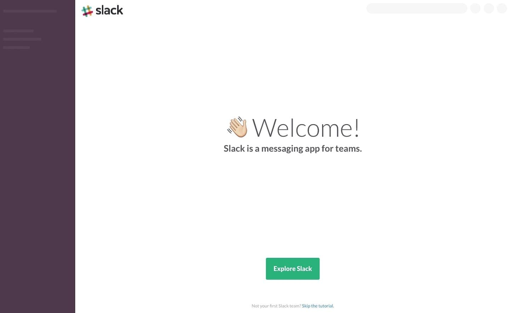

[_Slack_](https://www.appcues.com/blog/slack-user-onboarding-experience) _greets new users with a simple, no-nonsense welcome message and a single CTA._  

Slack 通过简单、严肃的欢迎消息和单个 CTA 迎接新用户。

#### When to use welcome messages  

何时使用欢迎消息

About 9 in 10 new user onboarding sequences begin with a welcome message. Welcome new users when they first log in to your app and give them direction on the next steps to take in their product journey.  

大约十分之九的新用户加入序列以欢迎消息开头。欢迎新用户首次登录您的应用，并指导他们在产品旅程中采取的后续步骤。

#### Tips for welcome message design  

欢迎消息设计提示

Welcome messages are often contained within [a modal window](https://www.appcues.com/ui-patterns/modals)—a large UI element that visually separates the user onboarding experience from the application’s interface itself. These messages often have a layer of transparency behind them to give users a peek into the main app. This design helps users keep an eye on their end goal and may motivate them to complete your user onboarding experience to start using your app.  

欢迎消息通常包含在模式窗口中，模式窗口是一个大型 UI 元素，可在视觉上将用户载入体验与应用程序界面本身分开。这些消息背后通常有一层透明度，让用户可以窥视主应用。此设计可帮助用户密切关注其最终目标，并可能激励他们完成用户引导体验以开始使用您的应用。

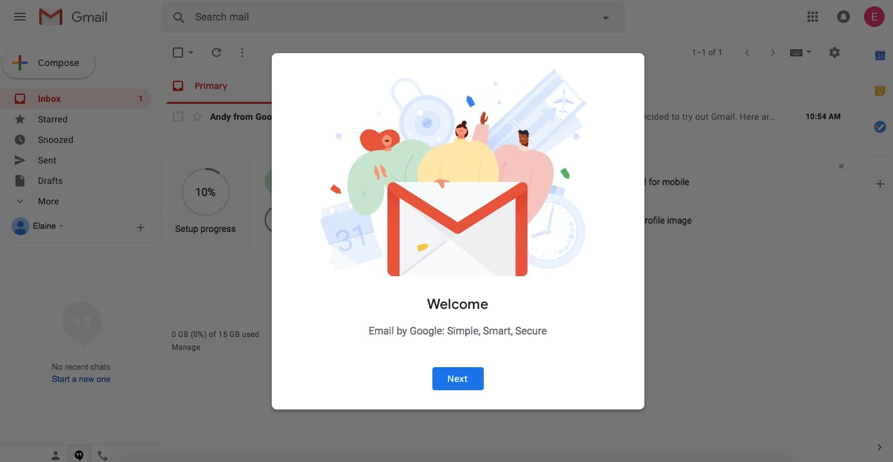

[_Gmail_](https://gmail.com/) _uses a modal window with minimal text to welcome new users to their inboxes._  

Gmail 使用文本最少的模式窗口来欢迎新用户访问他们的收件箱。

Alternatively, some welcome message modals take over a user’s entire screen, blocking visibility into your app and focusing a user entirely on the message and user onboarding experience in front of them. We refer to this pattern as a full-screen takeover. This pattern is highly disruptive and is best used sparingly or saved for when there are required inputs that a user _must_ fulfill before using your product.  

或者，某些欢迎消息模式会占据用户的整个屏幕，从而阻止对应用的可见性，并将用户完全集中在他们面前的消息和用户入门体验上。我们将此模式称为全屏接管。此模式具有很强的破坏性，最好谨慎使用或保存，以便在用户在使用产品之前必须满足所需的输入时使用。

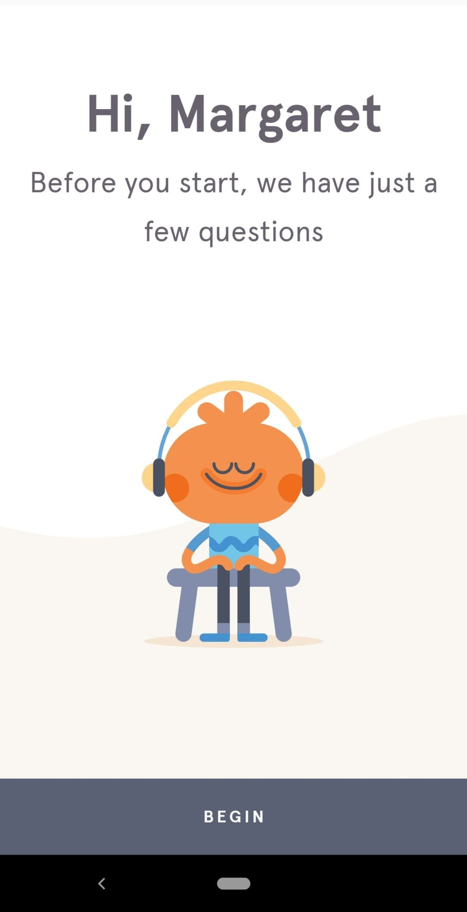

[_Headspace_](https://www.reallygoodux.io/blog/headspaces-mindful-onboarding-sequence?__hstc=213401291.6b8bae765a54c2acbd7a0451a4cd0037.1535485465251.1554839452423.1554905143153.275&__hssc=213401291.14.1554905143153&__hsfp=3695762961)_’s charming mobile app welcomes users with a personalized greeting before asking them a handful of persona-establishing questions._  

Headspace迷人的移动应用程序以个性化的问候欢迎用户，然后向他们提出一些建立角色的问题。

Here’s a good [deep dive into in-app welcome messages](https://instapage.com/blog/how-to-setup-welcome-pages).  

以下是对应用内欢迎消息的深入探讨。

#### User onboarding toolkit: Welcome messages  

用户入门工具包：欢迎消息

You can build welcome messages with [Appcues’ modal windows](https://www.appcues.com/ui-patterns/modal-windows) or with one of these open-source alternatives:  

您可以使用 App 的模式窗口或以下开源替代方案之一构建欢迎消息：

-   [Tingle 刺痛](http://robinparisi.github.io/tingle/)
-   [Sweet Alert 甜蜜警报](https://sweetalert.js.org/)
-   [animatedModal.js 动画模态.js](https://joaopereirawd.github.io/animatedModal.js/)
-   [This list of open-source modal plugins  
    
    此开源模态插件列表](https://www.appcues.com/blog/67-open-source-modal-window-plugins-made-with-jquery-javascript-css-and-more)

##### ALWAYS BE ONBOARDING  始终入职

#### Create an amazing first impression in minutes, not sprints!  

在几分钟内创造惊人的第一印象，而不是冲刺！

-   Use Appcues no-code builder to change text, images, buttons—it's \*all\* in your control  
    
    使用 Appcues 无代码构建器更改文本、图像、按钮 - 一切尽在您的掌控之中
-   Pick your pattern, we've got tooltips, modals, and more!  
    
    选择您的模式，我们有工具提示、模式等！
-   Create seamless in-app experiences  
    
    打造无缝的应用内体验

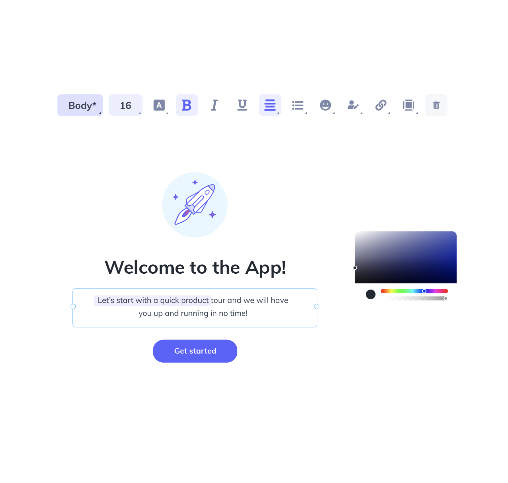

### 2\. Product tours 2\. 产品导览

[Product tours](https://www.appcues.com/blog/product-tours-ui-patterns) are in-app guides that walk new users through your app to familiarize them with your UI. These guides show new users key workflows or processes that make your product valuable and are useful for driving full product adoption. Product tours can take the form of various UI patterns and often include videos to show users your product in action.  

产品导览是应用内指南，可引导新用户浏览您的应用，让他们熟悉您的 UI。这些指南向新用户展示了使您的产品有价值的关键工作流程或流程，并有助于推动产品的全面采用。产品导览可以采用各种 UI 模式的形式，并且通常包括向用户展示您的产品运行情况的视频。

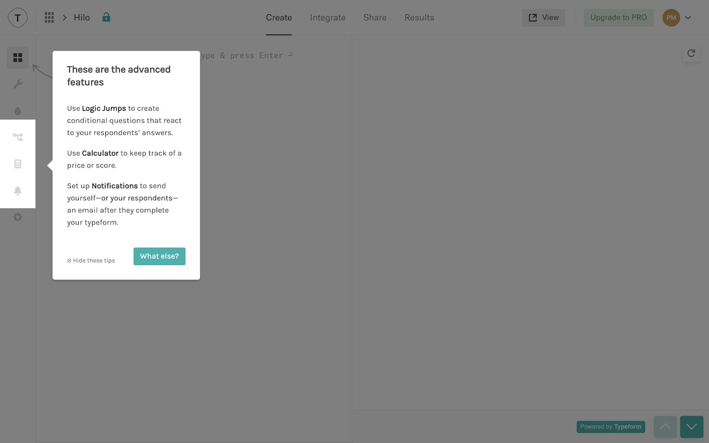

[_Typeform_](https://typeform.com/) _uses tooltips to_ [_walk new users_](https://www.reallygoodux.io/blog/typeforms-creator-tooltip-walkthrough) _through its product._  

Typeform使用工具提示引导新用户完成其产品。

#### When to use product tours  

何时使用产品导览

Use product tours when you want users to take specific action or complete certain processes in your app. The process can be simple or complicated—what’s difficult to the user might be simple for you, so always err on the side of creating a product walkthrough.  

如果您希望用户在您的应用中执行特定操作或完成某些流程，请使用产品导览。这个过程可以简单，也可以复杂 - 用户难以理解的内容对您来说可能很简单，因此请始终在创建产品演练方面犯错。

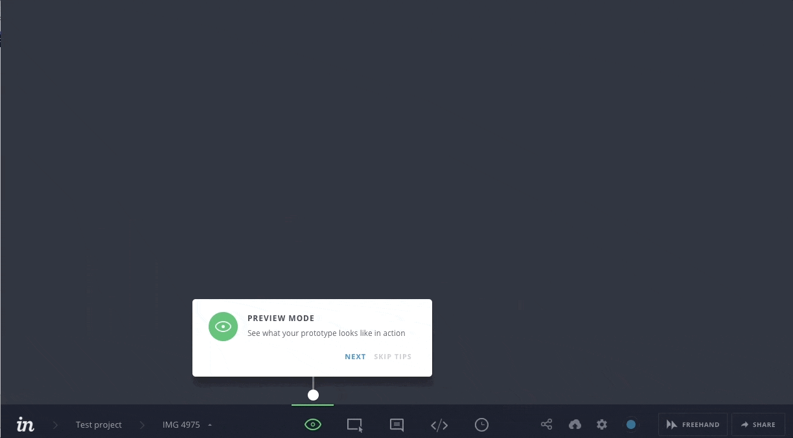

[_InVision_](https://www.reallygoodux.io/blog/invision-product-tour) _uses succinct tooltips to give new users an overview of important features._  

InVision 使用简洁的工具提示为新用户提供重要功能的概述。

#### Tips for product tour design  

产品导览设计技巧

Product tours often come in the form of [tooltips](https://www.appcues.com/ui-patterns/tooltips). Tooltips are boxes with pointers that call out and contextualize certain elements within a product. A few tips to optimize your product tour’s user onboarding UX:  

产品导览通常以工具提示的形式出现。工具提示是带有指针的框，用于调用产品中的某些元素并将其上下文化。优化产品导览的用户引导用户体验的一些提示：

-   Be selective. The best product tours typically consist of 3–5 tooltips. Any more steps than that can start to feel like a hassle for new users.  
    
    要有选择性。最好的产品导览通常由 3-5 个工具提示组成。对于新用户来说，任何比这更多的步骤都会开始感觉很麻烦。
-   Make your first tooltip open on page load.  
    
    在页面加载时打开第一个工具提示。
-   Keep the copy short. Think 140 characters or less—like Twitter back in the day.  
    
    保持副本简短。想想 140 个字符或更少——就像当年的 Twitter 一样。
-   Focus your copy on _value_ rather than how-to. This will keep users motivated.  
    
    将您的副本重点放在价值上，而不是如何操作。这将保持用户的积极性。
-   Design your tooltips to look native to your product’s brand, but make sure they have enough contrast with the main interface to get noticed.  
    
    将工具提示设计为看起来与产品品牌原生，但请确保它们与主界面具有足够的对比度以引起注意。
-   Make sure you have access to easy-to-read analytics on your product tour. You should be able to ascertain how far users make it in the tour and how this affects their ultimate success with your product.  
    
    确保您可以访问产品导览中易于阅读的分析。您应该能够确定用户在导览中走了多远，以及这如何影响他们对您的产品的最终成功。

#### User onboarding toolkit: Product tours  

用户入门工具包：产品导览

You can build product tours with [Appcues’ tooltips](https://www.appcues.com/ui-patterns/tooltips) or with one of these open-source alternatives:  

您可以使用 App 的工具提示或以下开源替代方案之一构建产品导览：

-   [Intro.js 简介.js](https://introjs.com/)
-   [Hopscotch 跳房子](https://github.com/LinkedInAttic/hopscotch)
-   [This list of open-source tooltip plugins  
    
    此开源工具提示插件列表](https://www.appcues.com/blog/73-tooltip-plugins-made-with-jquery-css-javascript-or-more/)

### 3\. Progress bars 3\. 进度条

Progress bars are visual representations of a new user’s progress toward completing tasks in your app. They’re common with processes like downloads, installations, and file transfers. Progress bars say, “_Hey, you’re on your way! Just a little more effort, and you’ll get there.”_  

进度条是新用户在应用中完成任务的进度的直观表示形式。它们在下载、安装和文件传输等过程中很常见。进度条显示：“嘿，你在路上！只要再努力一点，你就会到达那里。

#### When to use progress bars  

何时使用进度条

Use progress bars (or similar progress indicators, like dots, dashes, and fractions) to motivate new users to complete their onboarding. You should also use progress bars to show how long a task featured in a product walkthrough will take to encourage completion.  

使用进度条（或类似的进度指示器，如点、破折号和分数）来激励新用户完成他们的引导。您还应该使用进度条来显示产品演练中介绍的任务需要多长时间才能鼓励完成。

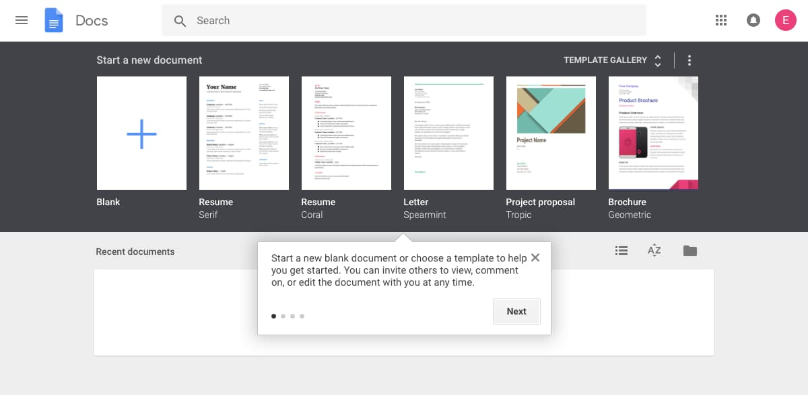

_Google introduces new users to Google Sheets with a series of instructive tooltips. The progress indicator in the corner of the tooltip lets users know that the tour will be brief.  

谷歌通过一系列指导性工具提示向新用户介绍谷歌表格。工具提示一角的进度指示器让用户知道演示将是简短的。_

#### Tips for progress bar design  

进度条设计提示

Progress bars are most effective at motivating users when they show a substantial percentage of the bar filled out. Starting with a partially completed progress bar helps a user feel like they’ve already accomplished something instead of starting from scratch. This sense of progress increases a person’s desire to complete the task at hand.  

进度条在激励用户方面最有效，因为它们显示已填写的栏的很大一部分。从部分完成的进度条开始有助于用户感觉他们已经完成了某事，而不是从头开始。这种进步感增加了一个人完成手头任务的愿望。

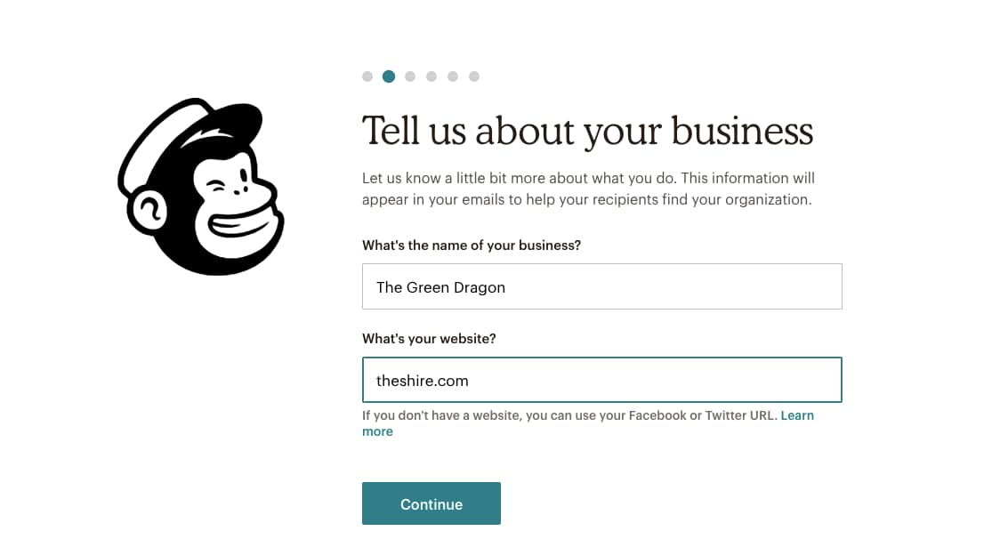

[_Mailchimp_](https://www.reallygoodux.io/blog/mailchimps-endearing-rebrand-and-onboarding-sequence?__hstc=213401291.6b8bae765a54c2acbd7a0451a4cd0037.1535485465251.1547431092140.1547435724338.136&__hssc=213401291.13.1547435724338&__hsfp=1962002899) _uses a progress bar (well, progress dots) to let new users know how far along they are in the onboarding process._  

Mailchimp使用进度条（嗯，进度点）让新用户知道他们在入职过程中走了多远。

#### User onboarding toolkit: Progress bars  

用户入门工具包：进度条

You can add progress bars to your app onboarding with [Appcues’ modal windows](https://www.appcues.com/ui-patterns/modal-windows) or build your own with one of these open-source alternatives:  

您可以使用 App 的模式窗口将进度条添加到应用入门中，也可以使用以下开源替代方案之一构建自己的进度条：

-   [Nanobar 纳巴](http://nanobar.jacoborus.codes/)
-   [Animated progress bar 动画进度条](http://codepen.io/whqet/pen/hfDzp)
-   [Progressbar.js 进度条.js](https://kimmobrunfeldt.github.io/progressbar.js/)

### 4\. Checklists 4\. 清单

A [checklist](https://www.appcues.com/ui-patterns/checklists) is a visual depiction of tasks that informs people how many tasks they have and haven’t completed. Like progress bars, they play into [powerful psychological principles,](https://www.appcues.com/blog/brains-love-checklists) motivating new users to finish—and even _enjoy—_the crucial setup tasks required to get up and running within your product. Users will see a checkmark next to completed tasks while uncompleted ones are left unticked.  

清单是对任务的直观描述，告知人们他们有多少任务完成和未完成。就像进度条一样，它们发挥了强大的心理学原理，激励新用户完成甚至享受在产品中启动和运行所需的关键设置任务。用户将在已完成的任务旁边看到一个复选标记，而未完成的任务则未选中。

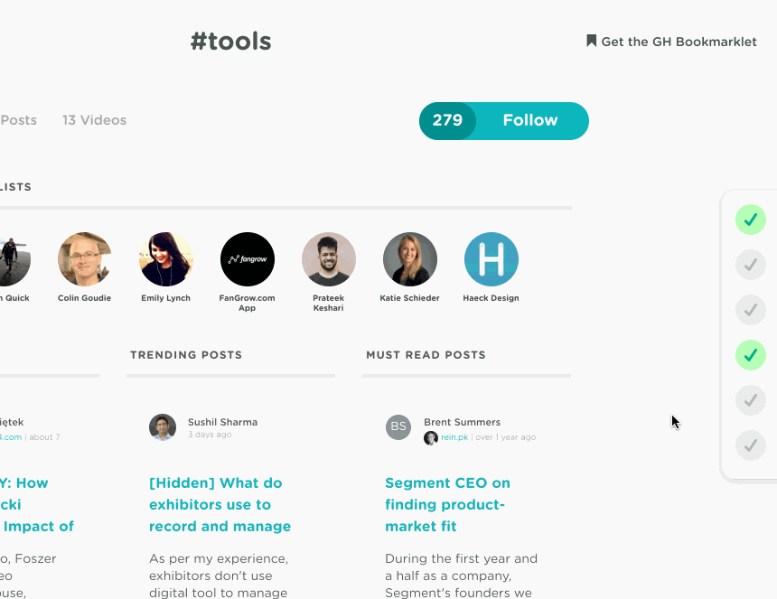

[_GrowthHackers_](https://www.reallygoodux.io/blog/growthhackers-onboarding-checklist?__hstc=213401291.6b8bae765a54c2acbd7a0451a4cd0037.1535485465251.1554839452423.1554905143153.275&__hssc=213401291.14.1554905143153&__hsfp=3695762961)_’ checklist slides in from the right of the UI._  

GrowthHackers的清单从UI的右侧滑入。

#### When to use checklists 何时使用核对清单

Checklists are used for complex tasks and multi-step processes during user onboarding. They also combine well with a progress bar to _turbocharge_ motivation.  

清单用于用户入职期间的复杂任务和多步骤流程。它们还与进度条很好地结合在一起，以增强动力。

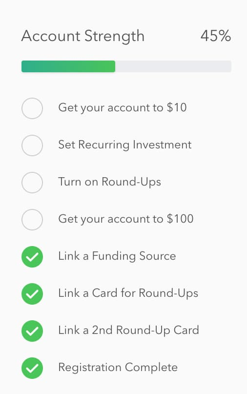

[_Acorns_](https://www.reallygoodux.io/blog/acorns-seamless-account-setup?__hstc=213401291.6b8bae765a54c2acbd7a0451a4cd0037.1535485465251.1554839452423.1554905143153.275&__hssc=213401291.14.1554905143153&__hsfp=3695762961)_’ mobile app breaks down a complex onboarding process into 8 steps with its onboarding checklist. (Note the progress bar and percentage at the top of the screen, which lets users know how far they are in the process.)_  

Acorns 的移动应用程序通过其入职清单将复杂的入职流程分解为 8 个步骤。（请注意屏幕顶部的进度条和百分比，这让用户知道他们在过程中走了多远。

#### Tips for checklist design  

清单设计提示

Checklists work best when they live alongside your product as a present reminder of the tasks that still need to be completed.  

当清单与您的产品一起作为对仍需要完成的任务的当前提醒时，它们效果最好。

For more checklist design inspiration, check out [5 other examples of best-in-class checklists](https://www.appcues.com/blog/best-checklist-examples).  

有关更多清单设计灵感，请查看其他 5 个同类最佳清单示例。

#### User onboarding toolkit: Checklists  

用户入门工具包：清单

Yup, we offer checklists too! You can add progress bars to your user onboarding with [Appcues’ Checklists](https://www.appcues.com/ui-patterns/checklists) or build your own with one of these open-source alternatives:  

是的，我们也提供清单！您可以使用 App 的清单将进度条添加到用户入门中，也可以使用以下开源替代方案之一构建自己的进度条：

-   [Create a to-do list with CSS & JavaScript  
    
    使用 CSS 和 JavaScript 创建待办事项列表](https://www.w3schools.com/howto/howto_js_todolist.asp)
-   [Checklist with JS 使用 JS 的清单](https://codepen.io/Rafiozoo/pen/VeGZeq)
-   [CSS & jQuery To-Do Checklist  
    
    CSS & jQuery To-Do Checklist](https://codepen.io/designcouch/pen/rIEHk)

### 5\. Hotspots 5\. 热点

[Hotspots](https://www.appcues.com/ui-patterns/hotspots) are small dots that prompt people to focus on specific elements or features of your app’s UI. A cross between notification badges and tooltips, hotspots are a great alternative to tooltips since they can appear passively without a user’s active interaction with your product.  

热点是提示用户关注应用界面的特定元素或功能的小点。热点介于通知徽章和工具提示之间，是工具提示的绝佳替代方法，因为它们可以被动显示，而无需用户与您的产品进行主动交互。

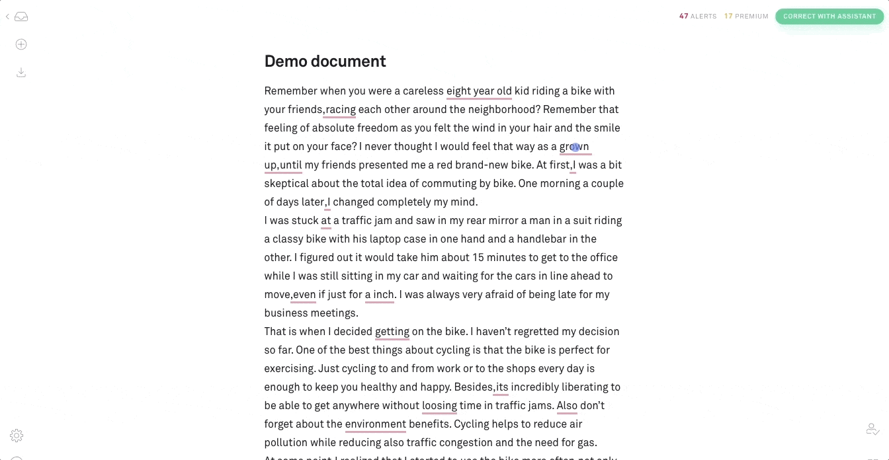

[_Grammarly_](https://www.grammarly.com/) _uses hotspots to guide new users through a learn-by-doing demo document._  

Grammarly 使用热点来指导新用户完成边做边学演示文档。

#### When to use hotspots 何时使用热点

Hotspots are subtle and discreet. They’re best for calling out non-essential features without interrupting user workflow. They’re also useful for giving some contextual help to entice new users to activate certain elements or features in your app.  

热点是微妙而谨慎的。它们最适合在不中断用户工作流程的情况下调用非必要功能。它们还可用于提供一些上下文帮助，以吸引新用户激活应用中的某些元素或功能。

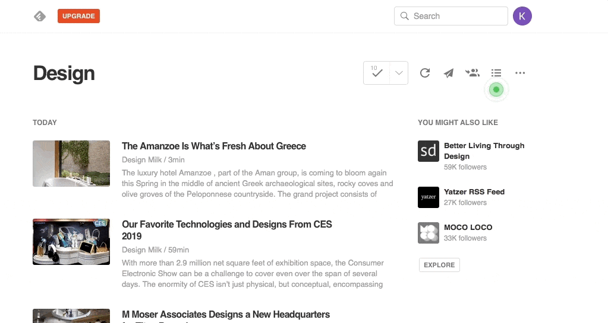

[_Feedly_](https://www.reallygoodux.io/blog/feedlys-feature-guiding-tooltips) _uses hotspots to draw users’ attention to useful features._  

Feedly使用热点来吸引用户对有用功能的注意。

#### Tips for hotspot design 热点设计提示

Beautify your hotspots with unique pulsating animations to catch the user’s eye. Adjust the intensity of your animation so that users can easily digest relevant information. You don’t want users to miss the point of the hotspot.  

使用独特的脉动动画美化您的热点，以吸引用户的眼球。调整动画的强度，以便用户可以轻松消化相关信息。您不希望用户错过热点点。

#### User onboarding toolkit: Hotspots  

用户入门工具包：热点

You can [build hotspots with Appcues](https://www.appcues.com/ui-patterns/hotspots) or create your own with one of these open-source alternatives:  

您可以使用 Appcues 构建热点，也可以使用以下开源替代方案之一创建自己的热点：

-   [Pulsating Dot 脉动点](https://codepen.io/vram1980/pen/Kyaie)
-   [Pulsating Hotspot UI element  
    
    脉动热点 UI 元素](https://codepen.io/matthiasott/pen/qEEwXp)
-   [CSS3 Pulsating Dot CSS3 脉动点](http://cssdeck.com/labs/css3-pulsating-dot)

### 6\. Tooltips 6\. 工具提示

[Tooltips](https://www.appcues.com/ui-patterns/tooltips) are in-app messages that pop up when someone hovers over, stops at, or clicks a specific element on your website or mobile app. Tooltips work best on elements like text links, buttons, and icons. They disappear when the user leaves the element.  

工具提示是当有人将鼠标悬停在您的网站或移动应用程序上的特定元素上、停在某个元素上或单击某个元素时弹出的应用内消息。工具提示最适合文本链接、按钮和图标等元素。当用户离开元素时，它们会消失。

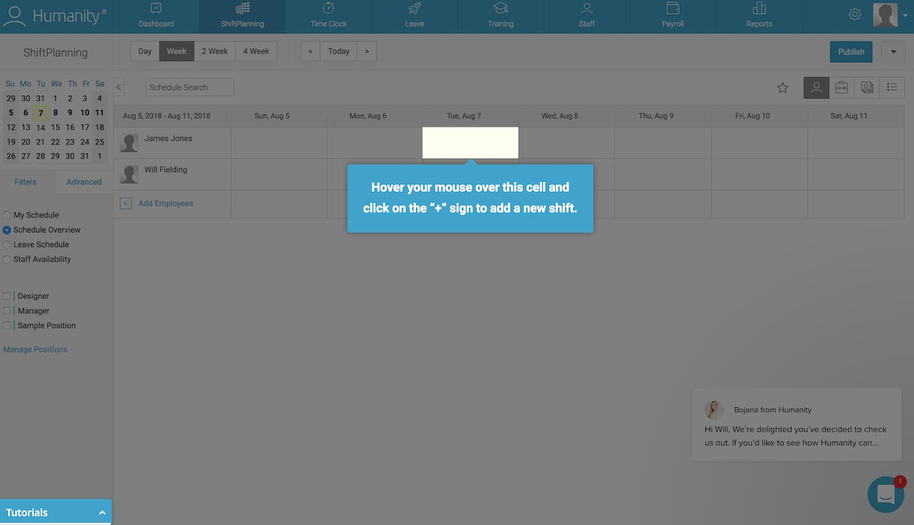

_Employee scheduling tool_ [_Humanity_](https://www.reallygoodux.io/blog/humanitys-detailed-induction) _walks new users through the platform step by step. Here, action is required to close the tooltip and move on to the next onboarding step._  

员工调度工具 Humanity一步一步地引导新用户通过平台。在这里，需要操作才能关闭工具提示并继续执行下一个载入步骤。

#### __When to use tooltips 何时使用工具提示

Use tooltips when you want to isolate elements like form fields or buttons to guide a user through account setup. Once a user completes a step, they’re referred to the next one, and so on.  

如果要隔离表单域或按钮等元素以指导用户完成帐户设置，请使用工具提示。用户完成一个步骤后，他们将被引用到下一个步骤，依此类推。

#### Tips for tooltip design  

工具提示设计提示

Highlight a given element in your app and darken the space around it to help users to follow a particular set of instructions and path through your product. However, you should be careful not to overdo tooltips—they can come off the wrong way to more independent-minded users.  

突出显示应用中的给定元素，并使其周围的空间变暗，以帮助用户遵循一组特定的说明和产品路径。但是，您应该注意不要过度使用工具提示 - 它们可能会以错误的方式出现在思想更独立的用户身上。

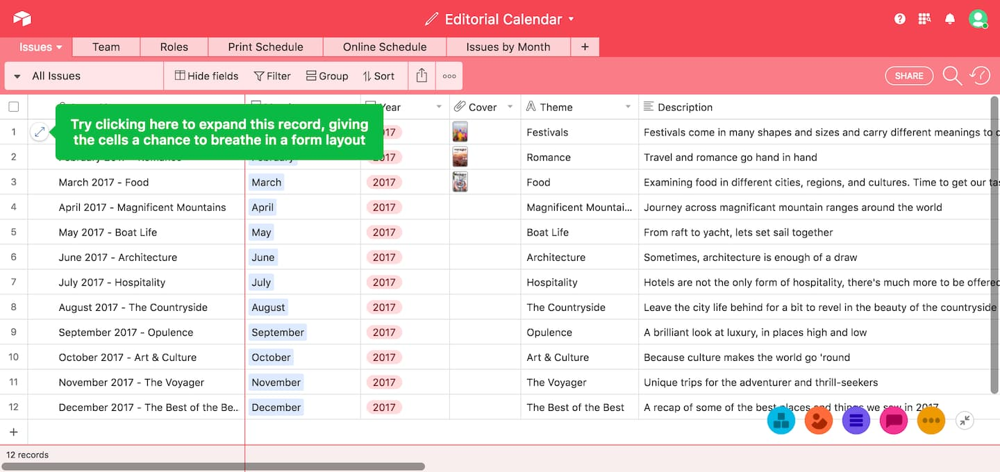

[_Airtable_](https://www.reallygoodux.io/blog/airtables-context-specific-tool-tips) _uses contextual, action-driven tooltips to prompt users to perform actions that are intended to familiarize users with specific features._  

Airtable 使用上下文、操作驱动的工具提示来提示用户执行旨在让用户熟悉特定功能的操作。

Don’t place tooltips on information that is essential to the success of a new user’s task. Tooltips disappear, and users would need to memorize the information to complete the task.  

不要将工具提示放在对新用户任务成功至关重要的信息上。工具提示消失，用户需要记住信息才能完成任务。

#### User onboarding toolkit: Tooltips  

用户入门工具包：工具提示

You can build action-driven tooltips with [Appcues’ tooltips](https://www.appcues.com/ui-patterns/tooltip) or with one of these open-source alternatives:  

您可以使用 App 的工具提示或以下开源替代方案之一构建操作驱动的工具提示：

-   [Intro.js 简介.js](https://introjs.com/)
-   [Hopscotch 跳房子](https://github.com/LinkedInAttic/hopscotch)
-   [This list of open-source tooltip plugins  
    
    此开源工具提示插件列表](https://www.appcues.com/blog/73-tooltip-plugins-made-with-jquery-css-javascript-or-more/)

### 7\. Deferred account creation  

7\. 延期账户创建

Deferred account creation allows new users to experience the value of your product before asking them to sign up. New users can see the value of your product without the commitment of adding their email, creating a password, or inputting other details. Delaying account creation will help you avoid signups from users who aren’t a good match with your product.  

延迟帐户创建允许新用户在要求他们注册之前体验您的产品的价值。新用户可以看到您的产品的价值，而无需承诺添加电子邮件、创建密码或输入其他详细信息。延迟帐户创建将帮助您避免与您的产品不匹配的用户注册。

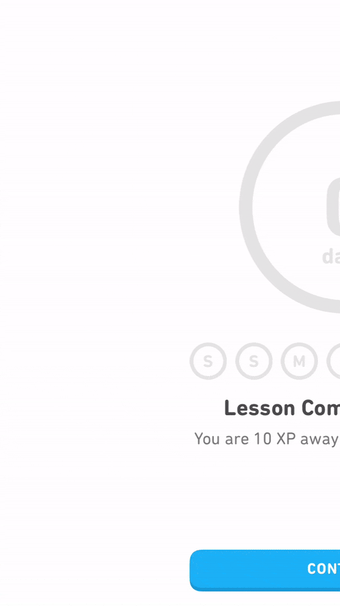

[_Duolingo_](https://www.reallygoodux.io/blog/duolingos-account-creation-prompts?__hstc=213401291.6b8bae765a54c2acbd7a0451a4cd0037.1535485465251.1554839452423.1554905143153.275&__hssc=213401291.14.1554905143153&__hsfp=3695762961)_’s signup prompts occur at logical moments in the user journey—after users complete a language lesson, for example—reducing the friction typically associated with registration._  

Duolingo 的注册提示发生在用户旅程中的逻辑时刻（例如，在用户完成语言课程之后），从而减少了通常与注册相关的摩擦。

#### When to use deferred account creation  

何时使用延期帐户创建

Defer account creation when you want to ensure that new users have a certain level of commitment to your product before signing up. Some products delay account creation until after the initial landing page, while others go as far as delaying account creation _entirely_ until after a user has reached their aha moment. This process is called [gradual engagement](https://www.appcues.com/blog/gradual-engagement-mobile-app-first-screen).  

如果您希望确保新用户在注册之前对您的产品有一定程度的承诺，请推迟帐户创建。有些产品将帐户创建延迟到初始登录页面之后，而其他产品甚至将帐户创建完全延迟到用户到达他们的 aha 时刻之后。这个过程称为渐进式参与。

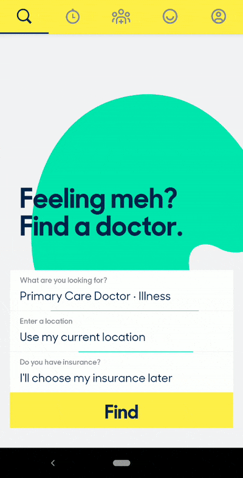

[_Zocdoc_](https://www.reallygoodux.io/blog/zocdocs-pain-free-healthcare-onboarding) _lets users browse for a doctor in their area and view appointment availability before prompting them to sign up for an account._  

Zocdoc允许用户浏览他们所在地区的医生并查看预约可用性，然后再提示他们注册帐户。

#### Tips for deferred account creation design  

延期帐户创建设计的提示

Move new users through your app slowly, helping them experience the value firsthand before requiring that they sign up for an account. You can also defer account creation by decreasing the number of form fields to fill out and the amount of personal information you require of users. This can be as simple as asking users to sign up with only their email address at first—it increases conversion rates on your signup page by lowering the barrier of entry.  

让新用户慢慢浏览您的应用，帮助他们在要求他们注册帐户之前亲身体验价值。您还可以通过减少要填写的表单字段数量和要求用户提供的个人信息量来延迟帐户创建。这可以像要求用户一开始仅使用他们的电子邮件地址注册一样简单——它通过降低进入门槛来提高注册页面上的转化率。

The UI for delayed account creation needs to be hyper-focused once you actually get to the registration step. If a user doesn’t realize they need to save their account, you may lose them if they bounce—or perhaps even worse, they may lose their progress and feel so frustrated that they churn.  

延迟帐户创建的 UI 需要高度集中，一旦您实际进入注册步骤。如果用户没有意识到他们需要保存他们的帐户，那么如果他们退回，您可能会失去他们，或者更糟糕的是，他们可能会失去进度并感到非常沮丧以至于他们流失。

#### User onboarding toolkit: Deferred account creation  

用户入门工具包：延迟帐户创建

There isn’t any single UI pattern for deferred account creation. Depending on how you plan to communicate the need for registration, you may want to use [tooltips](https://www.appcues.com/ui-patterns/tooltip) to draw attention to a signup CTA or a [modal window](https://www.appcues.com/ui-patterns/modal-windows) at an appropriate moment in the user journey. You can build either pattern with [Appcues](https://www.appcues.com/) or the following open-source alternatives:  

没有任何用于延迟帐户创建的单一 UI 模式。根据您计划如何传达注册需求，您可能希望在用户旅程中的适当时刻使用工具提示来引起对注册 CTA 或模式窗口的注意。您可以使用 Appcues 或以下开源替代方法构建任一模式：

-   [Open-source tooltip plugins  
    
    开源工具提示插件](https://www.appcues.com/blog/73-tooltip-plugins-made-with-jquery-css-javascript-or-more/)
-   [Open-source modal plugins  
    
    开源模态插件](https://www.appcues.com/blog/67-open-source-modal-window-plugins-made-with-jquery-javascript-css-and-more)

### 8\. Persona-based user onboarding  

8\. 基于角色的用户引导

[Persona-based user onboarding](https://www.appcues.com/blog/persona-based-user-onboarding) means designing new users’ onboarding experience based on their role or desired outcome while using your app. This user onboarding UX design prompts users to self-segment by selecting their own course of action, with each option leading to different first experiences. Segmenting can happen without the user knowing it—by using data collected on signup—or through a choose-your-own-adventure option.  

基于角色的用户引导意味着在使用应用时根据新用户的角色或期望的结果设计新用户的引导体验。此用户入职 UX 设计提示用户通过选择自己的操作过程进行自我细分，每个选项都会导致不同的首次体验。细分可能会在用户不知情的情况下发生 - 通过使用注册时收集的数据 - 或通过选择自己的冒险选项。

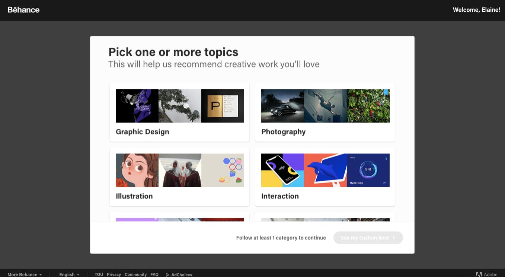

[_Behance_](https://www.behance.net/) _asks new users to select their interests in order to provide them with a personalized feed and a better first experience._  

Behance 要求新用户选择他们的兴趣，以便为他们提供个性化的 Feed 和更好的首次体验。

#### When to use persona-based user onboarding  

何时使用基于角色的用户载入

Use persona-based user onboarding during or after the signup process if your app has multiple products or offers serving different target audiences. It gives users personalized and relevant first experiences with higher engagement and lower time-to-value rates.  

如果您的应用有多个产品或优惠服务于不同的目标受众，请在注册过程中或之后使用基于角色的用户引导。它为用户提供个性化且相关的首次体验，具有更高的参与度和更低的价值实现时间。

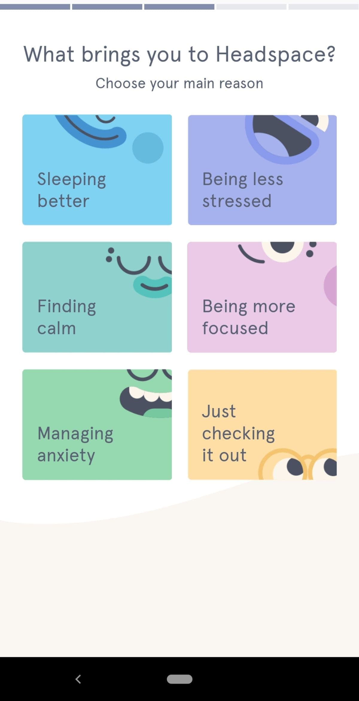

[_Headspace_](https://www.reallygoodux.io/blog/headspaces-mindful-onboarding-sequence?__hstc=213401291.6b8bae765a54c2acbd7a0451a4cd0037.1535485465251.1554839452423.1554905143153.275&__hssc=213401291.14.1554905143153&__hsfp=3695762961) _asks new users to self-segment by selecting their experience level and use case. (Note the progress indicator at the top of the screen.)_  

Headspace 要求新用户通过选择他们的体验水平和用例进行自我细分。（请注意屏幕顶部的进度指示器。

#### Tips for persona-based user onboarding design  

基于角色的用户引导设计的提示

Personalized user onboarding often starts with an option after a user has filled out a signup form. The option may be a clear choice for the user based on their desired outcome, or it may be to select their job role.  

个性化用户引导通常在用户填写注册表单后从一个选项开始。该选项可能是用户根据其所需结果的明确选择，也可能是选择其工作角色。

It’s important not to overwhelm the user with too many choices. From what we’ve seen, 2–5 options seem to be the magic number.  

重要的是不要用太多的选择让用户不知所措。从我们所看到的情况来看，2-5个选项似乎是神奇的数字。

#### User onboarding toolkit: Persona-based user onboarding  

用户载入工具包：基于角色的用户载入

You can create [persona-based user onboarding with Appcues](https://www.appcues.com/user-onboarding/) or by hard-coding the logic and data loops with an open-source alternative.  

您可以使用 Appcues 创建基于角色的用户加入，也可以使用开源替代方案对逻辑和数据循环进行硬编码。

There are hundreds of fantastic user [onboarding examples](https://www.appcues.com/blog/the-10-best-user-onboarding-experiences) for every UX/UI pattern we’ve listed. Head over to [ReallyGoodUX](https://www.reallygoodux.io/) for some of the best examples for mobile and web—whether you’re actively building your user onboarding flow and need inspiration, or you’re just trying to stay on top of the trends.  

对于我们列出的每种UX / UI模式，都有数百个出色的用户入门示例。前往 ReallyGoodUX 获取一些移动和网络的最佳示例 - 无论您是在积极构建用户引导流程并需要灵感，还是只是想掌握趋势。

## Best practices when creating onboarding experiences  

创建入职体验时的最佳做法

Thoughtful onboarding experiences are the difference between converting free users to paying customers and experiencing drop-offs after signup. To help you avoid or combat these, here are the [best tips for creating onboarding experiences](https://www.appcues.com/blog/user-onboarding-best-practices).  

周到的入职体验是将免费用户转化为付费客户与体验注册后流失之间的区别。为了帮助您避免或解决这些问题，以下是创建入职体验的最佳提示。

### Know your customers 了解您的客户

Each customer is different, but they signed up for your product because they believed it could benefit them. Use your user onboarding experience to validate their belief about your product.  

每个客户都是不同的，但他们注册了您的产品，因为他们相信它可以使他们受益。使用用户入门体验来验证他们对您产品的信心。

Look at your existing customers who have been around for more than 90 days. Find behavioral patterns and compare them with customers who didn’t stick around. Tools like [Amplitude](https://amplitude.com/) or [Mixpanel](https://mixpanel.com/) allow you to segment customers into behavioral cohorts where you can analyze what’s driving user retention or possibly causing churn. A cohort like “users who bought a product add-on” can help you understand where your users need more guidance. Giving these users the necessary instructions can convince them that paying for your product or buying a higher plan is worthwhile.  

查看已经存在超过 90 天的现有客户。找到行为模式，并将其与没有留下来的客户进行比较。Amplitude 或 Mixpanel 等工具允许您将客户细分为行为群组，您可以在其中分析推动用户保留或可能导致客户流失的因素。像“购买了产品加载项的用户”这样的群组可以帮助您了解用户在哪些方面需要更多指导。向这些用户提供必要的说明可以说服他们为您的产品付费或购买更高的计划是值得的。

Collect direct user feedback through conversations, emails, and in-app surveys if you don’t have enough data to use a product analytic tool. Look for patterns in their responses and apply anything you learn to improve your onboarding experience. Your product and customer behavior will change over time, so stay on top of any changes by actively collecting user feedback.  

如果您没有足够的数据来使用产品分析工具，请通过对话、电子邮件和应用内调查收集直接的用户反馈。在他们的回复中寻找模式，并应用您学到的任何内容来改善您的入职体验。您的产品和客户行为会随着时间的推移而变化，因此请通过积极收集用户反馈来掌握任何变化。

### Write helpful UX copy  编写有用的用户体验副本

UX copy will be your users’ guide throughout their interactions with your product. Use these tips to help you write effective UX copy:  

UX 副本将成为用户与您的产品交互过程中的指南。使用以下提示来帮助您编写有效的 UX 副本：

-   Use clear verbs. Don’t tell users “_Reserve your file_” when you mean “_Save your file_” or just “_Save_.” The latter is clearer.  
    
    使用明确的动词。当您的意思是“保存文件”或只是“保存”时，不要告诉用户“保留您的文件”。后者更清楚。
-   Use consistent terms. Don’t say “_Meeting ID_” in one part of your UI and “_Meeting Code_” in another—it’s confusing.  
    
    使用一致的术语。不要在 UI 的某一部分说“会议 ID”，而在另一部分说“会议代码”，这会让人感到困惑。
-   Use active voice. Choose “_Your file is ready_” over “_Your file has been downloaded_” every time. Passive voice is wordy and creates complex sentence structures.  
    
    使用主动语态。每次都选择“您的文件已准备就绪”而不是“您的文件已下载”。被动语态很冗长，会产生复杂的句子结构。
-   Avoid technical jargon. Say “_Your account is locked_” instead of “_Error code 584_.” It’s frustrating when customers have to perform a Google search to figure out the meaning of your error codes.  
    
    避免使用技术术语。说“您的帐户已锁定”而不是“错误代码 584”。当客户必须执行Google搜索以找出错误代码的含义时，这令人沮丧。
-   Use platform-consistent language. Ensure your copy makes sense on all the platforms users can access your product. It wouldn’t make sense to tell a desktop user to “_Swipe up_” to find the right menu. Most desktops do not have touch functionality.  
    
    使用平台一致的语言。确保您的副本在用户可以访问您的产品的所有平台上都有意义。告诉桌面用户“向上滑动”以找到正确的菜单是没有意义的。大多数台式机没有触摸功能。

Check out this article for a more in-depth look at [how to write exceptional UX copy](https://www.appcues.com/blog/ux-writing).  

查看这篇文章，更深入地了解如何编写出色的 UX 副本。

### Perform tests and run experiments  

执行测试和运行实验

Tests and experiments will give you data to make better decisions instead of relying on gut feelings. Sometimes your instincts are based on conscious or unconscious biases that blur the line between a good idea and a terrible one. Testing will help you ensure you’re making changes the user actually needs—not what _you think_ they need.  

测试和实验将为您提供数据以做出更好的决策，而不是依靠直觉。有时，你的直觉是基于有意识或无意识的偏见，这些偏见模糊了好主意和坏主意之间的界限。测试将帮助您确保所做的更改是用户实际需要的，而不是您认为他们需要的更改。

Run tests and experiments to confirm or disprove any assumptions you have about creating onboarding experiences for your customers. If you think your free trial users are not converting to paid users because of a certain feature, test it. Withhold the feature from some users and leave it for others. Analyze your results and apply the insights you gain by removing or adding new features and running more tests.  

运行测试和实验，以确认或反驳有关为客户创建入职体验的任何假设。如果您认为免费试用用户没有因为某项功能而转换为付费用户，请对其进行测试。对某些用户保留该功能，并将其留给其他用户。分析结果，并通过删除或添加新功能并运行更多测试来应用获得的见解。

A product analytic tool like Amplitude allows you to perform A/B tests that will enable you to improve your onboarding UI and onboarding patterns. Don’t stop at testing sticky app features that improve the user onboarding experience. Test your user onboarding UI and UX copy too. You’ll get a lot of data points to help you further optimize your user onboarding.  

像 Amplitude 这样的产品分析工具允许您执行 A/B 测试，使您能够改进入职 UI 和入职模式。不要止步于测试可改善用户入门体验的粘性应用功能。同时测试用户载入 UI 和 UX 副本。您将获得大量数据点，以帮助您进一步优化用户引导。

## Building user onboarding UX/UI experiences  

构建用户入门 UX/UI 体验

Each common UI pattern can be built with either open-source or SaaS solutions, and both have their advantages.Here’s how they compare:  

每种常见的 UI 模式都可以使用开源或 SaaS 解决方案构建，并且两者都有其优势。以下是它们的比较方式：

### Open-source tools 开源工具

-   Free 自由
-   Built and maintained by developers  
    
    由开发人员构建和维护
-   Style is customizable with hard-coded CSS  
    
    样式可通过硬编码的 CSS 进行自定义
-   Content is hard-coded into the product  
    
    内容被硬编码到产品中
-   Require deploy 需要部署
-   No analytics attached 未附加分析
-   One UI pattern per plugin  
    
    每个插件一个 UI 模式

### SaaS solutions SaaS 解决方案

-   Paid 支付
-   Installed by the developer; maintained by anyone  
    
    由开发人员安装;由任何人维护
-   Content and style are created through “what you see is what you get” (WYSIWYG) editor  
    
    内容和风格是通过“所见即所得”（WYSIWYG）编辑器创建的
-   No deploy necessary 无需部署
-   Come with analytics 附带分析
-   Multiple UI patterns per solution  
    
    每个解决方案的多个 UI 模式

Give your non-technical team the keys to engaging new users with a SaaS solution. Think about it: Who’s more familiar with the user journey and writing compelling copy—your marketers and CSMs or your engineers? However, if you’re bootstrapping and have an abundance of dev time, open-source solutions may make sense.  

为您的非技术团队提供使用 SaaS 解决方案吸引新用户的关键。想一想：谁更熟悉用户旅程并撰写引人注目的文案——您的营销人员和 CSM 还是您的工程师？但是，如果您正在引导并且有大量的开发时间，那么开源解决方案可能是有意义的。

[_Read: 8 examples of effective SaaS onboarding experiences (plus tips)_](https://www.appcues.com/blog/saas-user-onboarding)  

阅读：8 个有效的 SaaS 入职体验示例（以及提示）

## FAQs 常见问题

### What is user onboarding on a website?  

什么是网站上的用户入职？

User onboarding on a website is how the website helps you understand its product: what you can do with it, how to use it, and how using certain features benefits you. It involves product tours, flows to explain certain features, and in-app messages to encourage learning and app usage progress.  

网站上的用户引导是网站帮助您了解其产品的方式：您可以使用它做什么，如何使用它以及使用某些功能如何使您受益。它涉及产品导览、解释某些功能的流程以及鼓励学习和应用使用进度的应用内消息。

### How do you improve the onboarding process with UX?  

您如何通过 UX 改进入职流程？

You can improve an onboarding process with UX in the following ways:  

您可以通过以下方式改进 UX 的入职流程：

1.  Understand your customers: Users have a pleasant onboarding experience when you understand their needs and implement them in your onboarding process.  
    
    了解您的客户：当您了解他们的需求并在入职流程中实施他们时，用户将获得愉快的入职体验。
2.  Use a product like Appcues to experiment with several onboarding UI patterns: Experiments will help you nail your customers’ preferred patterns and improve their engagement during onboarding.  
    
    使用 Appcues 等产品来试验多种入职 UI 模式：实验将帮助您确定客户的首选模式，并提高他们在入职期间的参与度。
3.  Write effective UX/UI copy: Clear copy enables users to understand what they need to do to get the best out of your product.  
    
    编写有效的 UX/UI 副本：清晰的副本使用户能够了解他们需要做什么才能充分利用您的产品。
4.  Test and run experiments: A/B testing helps you figure out what’s wrong or right with your onboarding experience and how you can improve it.  
    
    测试和运行实验：A/B 测试可帮助您找出入职体验的错误或正确之处以及如何改进它。

### How do you design an onboarding experience?  

如何设计入职体验？

Design an onboarding experience in the following steps:  

通过以下步骤设计载入体验：

1.  Write your welcome message: This is your chance to make a good first impression on new users. A compelling welcome message will boost user excitement about using your product.  
    
    写下您的欢迎信息：这是您给新用户留下良好第一印象的机会。一条引人注目的欢迎消息将提高用户对使用您的产品的兴奋。
2.  Decide on an activation event: Choose the first aha moment you want new users to experience when they begin using your product. A well-chosen one will increase your chances of turning them into loyal, paying customers.  
    
    确定激活事件：选择您希望新用户在开始使用您的产品时体验的第一个 AHA 时刻。精心挑选的将增加您将他们转变为忠诚的付费客户的机会。
3.  Build backward from activation: Understand what education users need to activate and then include only that in your onboarding flow to keep it lean and mean.  
    
    从激活向后构建：了解教育用户需要激活的内容，然后仅将其包含在入职流程中，以保持精简和平均。
4.  Use effective UX/UI patterns: Don’t be overwhelmed by the variety of choices at your disposal. Think of what you want your users to accomplish with your product and [choose an appropriate pattern](https://www.appcues.com/blog/choosing-the-right-onboarding-ux-pattern).  
    
    使用有效的 UX/UI 模式：不要被各种选择所淹没。想想你希望你的用户用你的产品完成什么，并选择一个合适的模式。
5.  Personalize and optimize: Users will use your products in different ways and for different purposes. Allow users to choose their preferred use case and serve them onboarding experiences consistent with their needs.  
    
    个性化和优化：用户将以不同的方式和不同的目的使用您的产品。允许用户选择他们喜欢的用例，并根据他们的需求为他们提供入职体验。

### What are some good user onboarding examples?  

有哪些好的用户入门示例？

[A couple of user onboarding examples](https://www.appcues.com/blog/the-5-best-user-onboarding-experiences) for inspiration:  

几个用户入门示例以获得灵感：

1.  [Asana](https://app.asana.com/): Uses simple prompts and practical guides to boost team adoption  
    
    体式：使用简单的提示和实用指南来提高团队采用率
2.  [Loom](https://www.loom.com/): Creates a specific flow for commercial users  
    
    织机：为商业用户创建特定流
3.  [Speeko](https://www.speeko.co/): Personalizes user experience with needs-based onboarding  
    
    Speeko：通过基于需求的入职培训个性化用户体验
4.  [Webflow](https://webflow.com/): Uses a familiar UI pattern to guide users  
    
    Webflow：使用熟悉的 UI 模式来指导用户
5.  [Deputy](https://www.deputy.com/): Gives users different ways to access onboarding materials  
    
    代理：为用户提供访问入职材料的不同方式

You can find other onboarding examples on [ReallyGoodUX](https://www.reallygoodux.io/categories/user-onboarding).  

您可以在ReallyGoodUX上找到其他入职示例。

## Always be onboarding 始终入职

Companies are constantly launching multiple feature updates, and existing users need updated training to keep up. So, don’t stop onboarding after new users are acquainted with your product—make it a vital part of their ongoing product experience.  

公司不断推出多项功能更新，现有用户需要更新培训才能跟上。因此，不要在新用户熟悉您的产品后停止入职 - 使其成为他们持续产品体验的重要组成部分。

If you focus on giving users the best experience possible on your app, you’re already halfway to making excellent first impressions with your onboarding flow. The other part would involve creating onboarding patterns that fit with your users, their journey, and their desired outcome with your product. That’s how you’ll retain users, grow revenue, and, who knows, probably create an [app people can’t live without](https://www.statista.com/chart/23230/apps-people-cant-do-without-united-states/).  

如果您专注于在应用上为用户提供最佳体验，那么您已经通过引导流程给人留下了良好的第一印象的一半。另一部分将涉及创建适合您的用户、他们的旅程以及他们对您的产品的期望结果的入职模式。这就是你留住用户、增加收入的方式，谁知道呢，你可能会创建一个人们离不开的应用程序。

[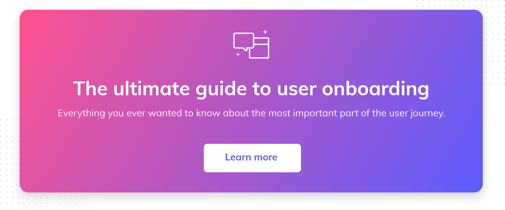](https://www.appcues.com/user-onboarding)
