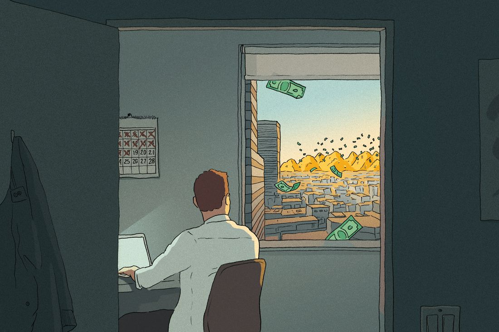

[the money game](https://nymag.com/intelligencer/tags/the-money-game/) Oct. 25, 2023  

金钱游戏 2023年10月25日

## During the boom times, I launched a start-up so I could become rich. Years later, I’m still looking for my exit.

  

一个中产阶级创业者的自白 在繁荣时期，我创办了一家初创企业，希望能变得富有。多年过去了，我仍在寻找退出的机会。

     

Illustration: Tim Bouckley  

插图：Tim Bouckley

Sometime in the second half of the past decade, I decided to found a start-up. I was in my 20s and working at a mid-size tech company, and I didn’t yet have an idea, or even a general sense of where I wanted to focus. But I was convinced becoming a founder was the right thing to do next.  

在过去的十年的下半段的某个时候，我决定创办一家初创公司。当时我二十多岁，在一家中型科技公司工作，我还没有一个创业点子，甚至没有一个大致的方向。但我坚信成为一名创始人是我接下来应该做的正确事情。

In college, I had majored in a discipline within the liberal arts. I would have liked to become a philosopher or a writer but lacked the intestinal fortitude to risk being poor, a perpetual worry in spite of — or because of — having enjoyed a solid upper-middle-class upbringing. My desire to be a capitalist may have crystallized a few years after graduation, when I attended a reading by a former professor, a lecturer from my alma mater, on tour for his new book. Seeing me in the audience, he invited me to a sumptuous dinner with several eminent literary types: an award-winning author, the proprietor of a cherished bookstore, a leading critic. We spent a great evening gossiping about famous writers, but when the check arrived, no one moved. Instead, we all made a furtive scan of the table — me, young with a tech job; them, decades older but sheltered from being first to reach for the bill by their commitment to art — realizing after an extended pause that no obviously rich person was around to pick up the tab. (We split it.)  

在大学里，我主修了一个自由艺术学科。我本想成为一名哲学家或作家，但缺乏冒险成为穷人的勇气，尽管我享受过稳定的中上层阶级的成长。也许在毕业几年后，我渴望成为一个资本家的愿望变得更加明确，当时我参加了一位前教授的读书会，他是我母校的讲师，正在为他的新书进行巡回宣传。他在观众席上看到了我，邀请我与几位杰出的文学界人士共进一顿豪华晚餐：一位屡获殊荣的作家，一家备受珍爱的书店的老板，一位知名评论家。我们度过了一个愉快的晚上，闲谈着著名作家的八卦，但当账单到来时，没有人动弹。相反，我们都偷偷地扫视了一下桌子——我是年轻的技术工作人员，他们则是年过几十但因为致力于艺术而不愿意主动买单——在经过一段时间的沉默后，意识到没有明显富有的人在场来买单。（我们平分了账单。）

I had always envied the gentry of the Enlightenment, who produced intellectual and artistic breakthroughs because they were smart but also because few others had the leisure to think. I also envied their modern equivalents, people with family money. What if I could make my own family money? That way, I could consummate my intellectual ambitions without sacrificing a reasonably bougie standard of living.  

我一直羡慕启蒙时代的贵族，他们因为聪明才智而能够产生知识和艺术上的突破，也因为很少有其他人有闲暇去思考。我也羡慕现代的富有家庭背景的人。如果我能够创造自己的家族财富呢？这样，我就能够实现我的知识抱负，同时不牺牲一个相对奢华的生活水平。

I began lurking in Reddit forums with names like “[FATFire](http://reddit.com/r/fatfire),” filled with people who obsessed over their “number”: the amount of money they wanted to sock away before they could pursue their whims forever. I remember hunching over a spreadsheet in a coffee shop one sunny weekend while my friends were at the beach, adding up the present value of my projected lifetime expenditures to estimate my own number. Of course, I had to factor in a safe withdrawal rate from my nest egg, private school for my hypothetical kids, and allowances like the occasional Michelin dinner. _Around $6 million,_ I thought, _ought to do it._   

我开始在Reddit论坛上潜水，这些论坛的名字像是“FATFire”，里面充斥着那些痴迷于他们的“数字”的人：他们想要在追求自己的兴趣之前存下的钱数。我记得有一个阳光明媚的周末，当我的朋友们都在海滩上的时候，我在一家咖啡店里弯腰在一张电子表格上计算着我预计一生的支出的现值，以估算出我自己的“数字”。当然，我还得考虑从我的巢蛋中安全提取的比率，为我假想的孩子们上私立学校的费用，以及偶尔的米其林晚餐等津贴。我想，大约600万美元应该够了。

A strategy consists of matching means to an end; if my end was rapid financial independence, my means were youth, pedigree, lack of student debt, a prodigious capacity for work, and a lack of a faculty for combinatorics, which rendered me unsuitable for quantitative finance. It helped that I genuinely liked technology, had devoured science fiction and messed around with computers since I was little. The smart move was probably working for one of the FAANGs, which grew so reliably that you could chill and make a few hundred thousand dollars a year. But I didn’t want to do that. This was the mid-2010s. Though peak mania had yet to arrive, venture capitalists were showering people the same age as me with capital. Someone in my graduating class had just flipped a two year old start-up for a life-changing sum.  

一项策略包括将手段与目标相匹配；如果我的目标是迅速实现财务独立，那么我的手段就是年轻、血统、没有学生债务、极高的工作能力，以及对组合数学没有天赋，这使我不适合从事量化金融。幸运的是，我真的喜欢技术，从小就痴迷于科幻小说并且对电脑进行摸索。聪明的做法可能是为FAANG之一工作，它们的增长如此可靠，以至于你可以轻松地每年赚几十万美元。但我不想这样做。这是2010年代中期。尽管狂热的巅峰尚未到来，但风险投资家们正向和我同龄的人们撒钱。我所在的毕业班上有人刚刚以巨额资金翻转了一家两年的初创公司，改变了他的一生。

After several false starts, I was introduced to my co-founder by a mutual friend. He was affably bright in a way that balanced my neurotic tendencies, and I liked him right away. We had been exploring similar markets and started tinkering together on a promising idea: an outwardly boring but vast corner of a broader sector that was hot at the time. We fleshed out the idea over a series of whiteboard sessions at a WeWork, each followed by a trip to a dive bar where we’d get drunk and talk about our goals, speedrunning the process of becoming friends. We both agreed that we wanted money but not a lot. “What’s your number?” I asked.  

经过几次失败的尝试，我通过一个共同的朋友认识了我的联合创始人。他以友善而聪明的方式平衡了我的神经质倾向，我立刻就喜欢上了他。我们一直在探索相似的市场，并开始一起琢磨一个有前景的想法：一个外表乏味但在当时非常热门的更广泛领域的一角。我们在一个WeWork的白板会议上详细讨论了这个想法，每次会议后我们都会去一家小酒吧喝醉并谈论我们的目标，加速成为朋友的过程。我们都同意我们想要钱，但不多。“你的目标是多少？”我问道。

“If we each made a few million,” he said, “that would be enough.”  

“如果我们每个人都赚了几百万，那就足够了。”他说道。

Every founder tells themselves a story about why they’re heading to the gold rush, but the executive coach I would eventually hire says there are really only two. Do you want to be rich, generating wealth in service of some further end? Or do you want to be king, with money a mere byproduct of trying to make the world the way you feel it should be?  

每个创始人都给自己编织一个关于为何要加入淘金热潮的故事，但我最终雇佣的高管教练说其实只有两种。你想要变得富有，通过创造财富为某种更深层次的目标服务吗？还是你想要成为王者，让金钱成为试图让世界变成你认为应该的样子的副产品？

At the time, I told myself I wanted the freedom of being rich. I thought I’d be able to recognize a winning hand fast or fold. Now, several years later, I’m still waiting for the river card that determines my fate. You could call me a middle-class founder: proprietor of a business you may or may not have heard of, tenuously wealthy on paper, by no means a failure but not yet a success, chugging along in the twilight of an era that minted more giants and more waste than any other in history with no exit in sight.  

当时，我告诉自己我想要富有的自由。我以为我能够迅速辨认出一个赢家或者放弃。现在，几年过去了，我仍在等待决定我的命运的河牌。你可以称我为中产阶级的创业者：一个你可能听说过也可能没有听说过的企业的所有者，在纸上算是富有，但并不是失败者，也还不是成功者，在一个创造了比历史上任何时代都更多的巨人和浪费的黄昏时代中艰难前行，看不到出口。

Fans of [Paul Graham](http://www.paulgraham.com/articles.html) — founder of Y Combinator, the leading start-up incubator in the land and one of the patron saints of the modern start-up era — would probably say my original sin was being a mercenary. For about a decade, starting when the first tech bubble popped in the early 2000s and ending with Facebook’s IPO in 2012, founding a start-up just to make money was both crass and unwise. If a founder wanted to raise money or hire the best people, the dogma went, it was important they lay claim to changing the world. Organize the world’s information (Google), bring the world closer together (Facebook), belong anywhere (Airbnb): The ideal founder was the protagonist of a Zen koan, or Harry Potter facing the desire mirror in _The Sorcerer’s Stone._ Seek money, find nothing — but _seek the_ _voice of the customer,_ and find the riches you never wanted but are darn glad to have.  

保罗·格雷厄姆的粉丝——Y Combinator的创始人，这是领先的初创企业孵化器之一，也是现代初创企业时代的守护神之一——可能会说，我最初的罪过就是贪图金钱。大约在2000年代初科技泡沫破裂时开始，直到2012年Facebook的首次公开募股结束，创办一家初创企业只为了赚钱既粗俗又不明智。如果创始人想要筹集资金或者雇佣最优秀的人才，教条主义认为，他们必须宣称要改变世界。整理世界的信息（Google），让世界更加紧密（Facebook），无处不在（Airbnb）：理想的创始人就像一个禅宗公案的主角，或者《哈利·波特与魔法石》中面对欲望之镜的哈利·波特。追求金钱，一无所获——但追求顾客的声音，却找到了你从未想要但却非常高兴拥有的财富。

The extent to which founders really followed this precept is debatable. But in the early 2010s, three things happened to make start-ups more attractive to mercenaries looking for a lucrative exit. Finance became less cool and generally less profitable after 2008. Several start-ups of the past decade, led by Facebook, grew into robust and outrageously profitable behemoths. And interest rates came down to zero, creating a glut of money seeking returns and increasing the spreadsheet value of profits generated far in the future (which happen to be the only profits most start-ups generate). This potent combination spawned an avalanche of capital earmarked for start-ups and doled out by venture capitalists. Over the coming years, a portion of these venture dollars wound their way to genuinely innovative companies. Some of it landed in money pits like WeWork. Far too much was airdropped into the Ponzi-ridden wasteland of crypto. And a tiny sliver landed with me.  

创始人真正遵循这一原则的程度是有争议的。但在2010年代初，有三件事情发生，使得初创公司对寻求丰厚回报的雇佣兵更具吸引力。2008年后，金融行业变得不那么酷，也不那么有利可图。过去十年的几家初创公司，尤其是Facebook，发展成为强大且极其赚钱的巨头。利率降至零，导致大量资金寻求回报，并增加了未来利润的电子表格价值（这恰好是大多数初创公司所产生的唯一利润）。这种强大的组合催生了大量投资初创公司的资本，并由风险投资家分发。在接下来的几年里，其中一部分风险投资流向了真正创新的公司。其中一些投资流向了像WeWork这样的钱坑。太多的资金则被投入到了充满庞氏骗局的加密货币荒地。只有一小部分资金流向了我这里。

Before I met my co-founder, I spent a year trying to identify business opportunities that were both personally compelling and commercially viable. When I pitched my VC friends these ideas — for example, a niche media company — they were kind but unimpressed.  

在我遇到我的联合创始人之前，我花了一年的时间试图找到既对我个人有吸引力又商业可行的商机。当我向我的风险投资朋友们推销这些想法时，比如一个利基媒体公司，他们对此表示友善但并不印象深刻。

“What about addressable market?” my friend T asked over dinner. _Translation: If you succeed, how much money could this make us?_ He was delighted I was pitching him so we could charge our meal to his firm, a prominent bank that had entered the VC game but retained its relatively stingy expense policy. “This could be a big business!” I said.  

“关于可寻址市场呢？”我的朋友T在晚餐时问道。如果你成功了，这能给我们带来多少钱？他很高兴我向他推销，这样我们就可以把晚餐费用记在他所在的公司账上，那是一家进入风险投资领域但依然保持着相对吝啬的费用政策的知名银行。“这可能是一个大生意！”我说道。

“My guy, I think we have different definitions of _big,_” he responded. Venture capitalists, I’d soon learn, don’t get out of bed unless a start-up has the potential to generate roughly a hundred million dollars of revenue per year. This implies the company is worth some multiple of that number, which in turn enables the average investor to “return the fund,” or generate a sum of returns equivalent to the whole pot of money they have to invest, if the company is bought or goes public. I had been introduced to the tyranny of the power law: the need for winners to win big because most start-ups fail.  

“兄弟，我觉得我们对“大”的定义不一样。”他回答道。我很快就会了解到，风险投资家只有在一个初创公司有潜力每年创造大约一亿美元的收入时才会出手。这意味着公司的价值是这个数字的几倍，进而使得普通投资者能够“回本”，或者说获得与他们投资的整个资金池相当的回报，如果公司被收购或上市的话。我已经领教了权力法则的暴虐：因为大多数初创公司都会失败，所以赢家必须赢得大。

I could have tried roughing it without venture funding, what the industry calls “bootstrapping.” The venture world has a condescending label for bootstrapped companies without scale potential: a “lifestyle” business, which roughly translates to: _Good for you, now back to the sandbox until you’re ready to play with the big boys_. Given my professed aim, this could have made sense. But there was so much funding for the taking, and part of me figured that if I was swinging, I may as well swing big. Why not make more than $6 million? So I narrowed my focus to the beam of a management consultant, scanning for hallmarks of a “venture-scale” business: addressable market, gross margins, incumbent NPS, lifetime value. You can Google these terms if you’d like, but taken in aggregate, all they mean is dollar signs.  

我本可以尝试在没有风险投资的情况下艰难前行，这就是行业所称的“自力更生”。风险投资界对于没有规模潜力的自力更生公司有一个居高临下的标签：一家“生活方式”企业，大致意思是：你做得很好，现在回到沙盒里，等你准备好和大佬们一起玩吧。考虑到我的宣称目标，这样做也许有道理。但是有那么多资金可以拿，我觉得如果我要挥舞，就应该挥舞得更大。为什么不赚超过600万美元呢？所以，我将注意力集中在管理咨询师的焦点上，寻找“风险规模”企业的特征：可寻址市场、毛利率、现有NPS、终身价值。如果你愿意，你可以在谷歌上搜索这些术语，但总的来说，它们只意味着金钱符号。

As I talked through our idea with my co-founder, I ran through the VC-ratified checklist in my head: _Large market — check. Fragmented landscape with dissatisfied customers — check._ Most businesses are interesting if you look at them closely enough, but the perception of boringness — workflow automation, human-resource information systems — is good because competition is death; the cooler you sound at parties, the harder it is to succeed. The idea was far from perfect, but I was impatient, and after a rapid courtship, we decided to try raising a round of funding. If we could pull together enough to get started — a sum I estimated in the mid-six figures — we’d quit our jobs and found the company. I made a PowerPoint, following a handy [template](https://www.ycombinator.com/library/2u-how-to-build-your-seed-round-pitch-deck) produced by Y Combinator: problem, solution, how you find customers, all vagaries eliminated.  

当我与我的联合创始人讨论我们的想法时，我在脑海中进行了一次VC认可的清单检查：市场规模大 - 检查。碎片化的市场，不满意的客户 - 检查。如果你仔细观察，大多数企业都很有趣，但被认为是无聊的感觉 - 工作流自动化，人力资源信息系统 - 是好事，因为竞争就是死亡；你在派对上听起来越酷，成功就越难。这个想法远非完美，但我很不耐烦，经过一段快速的追求，我们决定尝试筹集一轮资金。如果我们能凑足足够的资金开始 - 我估计在六位数中间 - 我们将辞去工作并创办公司。我制作了一份PowerPoint，按照Y Combinator提供的方便模板：问题，解决方案，如何找到客户，所有的模糊不清都被消除了。

We received plenty of rejections. These surprised us, though a state of the world enabling two people who barely know each other to obtain hundreds of thousands of dollars with nothing but a few dozen prettily formatted words should have been far more astonishing. Some part of me was relieved by the rejections, which might have built slowly toward permission to throw in the towel, until we got our first yes — on the basis of a single phone call with an investor about the same age as me. 

“What could go wrong?” he asked.  

他问：“会有什么问题呢？”

“Well, a lot,” I said, and I laid out the ways our thesis might be flawed, along with a theoretical solution to each snag. I treated this as a game, like switching to the affirmative after arguing the negative in a high-school debate, but he seemed convinced of something.  

“嗯，很多，”我说道，并且列举了我们论文可能存在的缺陷，以及针对每个问题的理论解决方案。我把这当作一种游戏，就像在高中辩论中从反方转向正方一样，但他似乎对某件事情深信不疑。

“Have you incorporated?” he asked.  

"你注册了吗？" 他问道。

When he emailed to say he was inclined to invest, I wondered what he had learned over the course of a half-hour to make him write this check. It was an astounding hourly rate. Later, I learned that he was rich and wrote many checks and that this check, in the grand scheme of this world, was small. After the first year, I never heard from him again. He’s still on our cap table today, making money while he sleeps.  

当他发邮件说他倾向于投资时，我想知道他在半个小时内学到了什么，让他写这张支票。这是一个惊人的小时费率。后来，我得知他很有钱，经常写支票，而这张支票在这个世界的大局中微不足道。第一年过后，我再也没有收到他的消息。如今，他仍然在我们的股权表上，一边睡觉一边赚钱。

We used the momentum from his “yes” to secure others, then incorporated our business using a tool created by a company called Stripe to make it easier for entrepreneurs to form corporations. As I typed our company name into the web form, I recalled that when my father started a small company decades ago, he had to write a physical letter to a legal agent in Delaware. I wondered briefly if there should be more friction in making a decision to start a company. To some extent, reducing friction is what the whole start-up game is about: Calling a cab when you want it, summoning food when you want it, an infinite radio that plays whatever you want on command. I clicked the button, submitted the form, and incorporated.  

我们利用他的“同意”来获得其他人的支持，然后使用一家名为Stripe的公司创建的工具来简化创业者成立公司的过程。当我在网页表单中输入我们的公司名称时，我想起几十年前我父亲创办一家小公司时，他不得不给特拉华州的一家法律代理人写一封实体信件。我短暂地想知道是否在决定创办一家公司时应该有更多的阻力。在某种程度上，减少阻力正是整个创业游戏的目标：想打车时就打车，想叫餐时就叫餐，想听什么就点播的无限电台。我点击了按钮，提交了表单，并完成了公司注册。

We hired a small team. Because we couldn’t afford to pay top dollar, we looked beyond the world of Ivy League, Big Tech, and management-consulting alumni to find moneyball hires mispriced by the market. The best of them were searching for a chance to prove their worth, and we gave it to them. The first year or so was a constant swing between the radiant high of making customers happy and the comedown of watching our jerry-rigged product disappoint them. I learned most customers are indifferent as long as the job gets done, about 20 percent are discerning but reasonable, and 3 percent will drive you nuts (no amount of support will satisfy them because the product they really need is therapy).  

我们雇了一个小团队。因为我们支付不起高薪，所以我们超越了常规的常春藤、大型科技和管理咨询公司的校友圈，寻找市场低估的“moneyball hires”。其中最优秀的人正在寻找机会证明自己的价值，而我们给了他们这个机会。最初的一年左右，我们经历了不断的起伏，一方面是让客户满意的兴奋，另一方面是看着我们拼凑起来的产品让他们失望。我发现大多数客户只关心工作是否完成，大约20%的客户有眼光但是还算理性，而3%的客户会让你发疯（因为无论你提供多少支持，都无法满足他们的需求，因为他们真正需要的是心理治疗）。

Buried in my master plan was an assumption that I could stay above the emotional fray of building a company. In hindsight, this was dumb. Start-ups are like sharks: They need movement to survive. But movement implies change, change implies volatility, and volatility implies fluctuations between good and bad. To succeed, you need to average more good days than bad, but bad days are impossible to avoid. And more than any other trait, good founders are defined by an obsession with doing things right; it was inevitable that my self-worth would become entangled with the performance of the business.  

埋藏在我的总体计划中的一个假设是我能够保持在建立公司的情感纷争之上。事后看来，这是愚蠢的。创业公司就像鲨鱼：它们需要运动才能生存。但运动意味着变化，变化意味着波动，波动意味着好与坏之间的波动。要成功，你需要比坏日子多一些好日子，但是避免不了坏日子。而且，与其他任何特质相比，优秀的创始人以对事情做到完美的执着而被定义；我的自我价值与业务表现纠缠在一起是不可避免的。

This felt great during the good times. Over the coming years, the company grew. At parties, where I had assiduously avoided the “What do you do?” question for years and responded when asked with a self-effacing bit on the mundanity of our market, people I didn’t know started to recognize our start-up. Some even used and liked the product.  

在好时光里，这感觉很棒。在接下来的几年里，公司不断壮大。在派对上，我多年来一直刻意回避“你做什么工作？”这个问题，当被问到时，我会谦虚地说一些关于我们市场平凡性的话，但是有些我不认识的人开始认出我们的创业公司了。甚至有些人开始使用并喜欢我们的产品。

But it didn’t feel as good when I looked around. In 2021, COVID and its aftermath marked [peak froth](https://nymag.com/intelligencer/2021/04/nft-future-of-money.html) for tech. The phenomenon of [SPACs](https://nymag.com/intelligencer/2021/09/the-big-spac-crackdown.html) gave questionable but sexy companies a shortcut to going public. Crypto had reached full sail. Other founders I knew were raising absurd amounts of money for concepts that made a napkin business plan look fleshed out, spurred by a new class of leviathan VCs that had raised mind-bogglingly large funds. Founders could sell their own stock to these investors, sometimes pocketing more millions personally than their companies had earned in lifetime revenue. I still hadn’t made a cent beyond the salary I paid myself.  

但当我四处看时，感觉并不好。在2021年，COVID及其后果成为科技行业的巅峰。SPACs现象为可疑但性感的公司提供了一条捷径，使其能够快速上市。加密货币已经全面发展起来。我认识的其他创始人为一些概念筹集了荒谬的资金，这些概念连餐巾纸上的商业计划都不如，这是由一批筹集了令人难以置信的巨额资金的新一代巨头风投推动的。创始人可以将自己的股票卖给这些投资者，有时个人获得的利润比他们的公司终身收入还要多。而我除了支付给自己的薪水外，还没有赚到一分钱。

I’d like to say we never considered taking this money, but we did try pitching a megafund partner during our last round of fundraising in the latter days of this madness. We told the story of our business, and he cut us off after 20 minutes with a curt, “You can clearly execute, but this won’t get big enough for us.” Market sentiment had turned against our particular vertical; it felt like we were sprinting to stay in place**.** Meanwhile**,** start-ups that had staked a claim on vast frontiers of innovation — _immutable money, infinite frontier, and eternal life_, as the Twitter bio of a prominent crypto evangelist proclaimed — were speeding on a moving walkway toward giant valuations and general adulation.  

我想说我们从未考虑过拿这笔钱，但在我们最后一轮筹款的时候，我们确实试图向一个巨型基金合作伙伴推销。我们讲述了我们的业务故事，但在20分钟后，他断然地打断了我们，说：“你们显然能够执行，但这对我们来说不够大。”市场情绪已经转向了我们特定的垂直领域；感觉就像我们在奔跑却原地踏步。与此同时，那些在创新的广阔领域上立下了权威的初创公司——不可变的货币、无限的前沿和永恒的生命，正如一位知名加密货币传道者的Twitter简介所宣称的——正以巨大的估值和普遍的赞美之势快速前进。

The mood inside our company all-hands during this time was confusing. We were growing sustainably, making even our pickiest customers happy, but it was a euphoric time in the world outside our Zoom screens; you might be having fun sober at the party, but it’s hard not to watch your friends on drugs and wonder what it’s like. The irony that selling fiction to investors was making these founders richer than selling a bona fide product to paying customers wasn’t lost on me. But it wasn’t just the money: After years of work, I had the temerity to be proud of the culture and product we had built. I had started to believe we could actually make a difference. In the market of 2021, our mission felt quaint; we may as well have been a lifestyle business. 

At the tippy-top of the market, a party. I met another founder, a few years older than me, who had unequivocally made it, with a liquid net worth of multiples of my number. I was tipsy enough to ask all kinds of direct questions about what it was like. He was tipsy enough to answer unequivocally: Yes, having a fuck ton of money is great.  

在市场的巅峰，有一个派对。我遇到了另一个创始人，比我大几岁，毫无疑问地取得了成功，拥有的流动净资产是我的数倍。我喝得有点醉，开始直接问他有关这种生活是什么感觉。他也喝得有点醉，毫不犹豫地回答：是的，拥有大把的钱真的很棒。

This is the difference between equity and cash: Partying in prime time in Aspen and Cannes; a gorgeous apartment in one of the best neighborhoods in our city, which I saw when he brought the after-party there; other apartments around the country and in a premier European capital where he lived a month or two out of the year. Meetings with anyone you want, whenever you want. Respect among both the tech cognoscenti and normal people who figured out what he had made. I knew this because of the deferential way I behaved around him.  

这就是权益和现金之间的区别：在阿斯彭和戛纳的黄金时段参加派对；在我们城市最好的社区之一有一套漂亮的公寓，我在他把派对带到那里时看到过；在全国各地和一个欧洲首都有其他公寓，他每年住上一两个月。与任何你想见的人会面，无论何时何地。在科技界和普通人中都受到尊重，他们都知道他创造了什么。我知道这一点是因为我在他面前表现得恭敬。

“What gets worse?” I asked.  

“变得更糟了吗？”我问道。

“You can probably guess,” he said. It was what you expect: People treat you less like a human and more like a mythical being or a human bank.  

“你可能能猜到，”他说。这就是你所期望的：人们对待你更像是一个神秘的存在或者一个人类银行，而不是一个人类。

“Do you want more?” I asked.  

"你还要吗？" 我问道。

I don’t remember his answer; things were hazy by this point. I staggered out of the fifth bar we visited that night, more intoxicated by the conversation than the drinks, just sober enough to be perturbed by my own fascination. Financially, my best-case outcome was a fraction of what this guy had already. No one needed the amount of money he had: an amount of wealth impossible to justify by any rational calculation of needs I could run on a spreadsheet (which explains why he was spending it on frivolous things). But now my number seemed too low. That night, I dreamt about market size, which in my subconscious manifested as a visual resembling the spirals of light that appear when you press directly on your eyeballs, rippling wider and wider. I woke up stressed.  

我不记得他的回答了；到了那个时候，一切都变得模糊不清。那晚我们去的第五家酒吧，我摇摇晃晃地走出去，对那次谈话比对饮品更为陶醉，只是清醒到足以对自己的着迷感到不安。从财务角度来看，我最好的结果只是他已经拥有的一小部分。没有人需要他拥有的那么多钱：这是一笔无法通过任何合理的需求计算来证明的财富（这也解释了为什么他把它花在了无谓的事情上）。但现在，我的数字似乎太低了。那个晚上，我梦到了市场规模，它在我的潜意识中呈现为当你直接按压眼球时出现的光线螺旋，不断扩大。我醒来时感到压力倍增。

Today, the market has turned for everyone. We’re growing slower than I want, but other start-ups, even the hot companies that dominated fundraising in past years, are showing far more signs of strain. Some have already flamed out spectacularly, and for those that survive, the gobs of money raised from megafunds come with a catch: It needs to be paid back first, which means that employees and early investors who expected millions won’t make any money unless they deliver on their tall tales.  

今天，市场对每个人来说都发生了变化。我们的增长速度比我想象的要慢，但其他初创公司，甚至是过去凭借筹款主导市场的热门公司，都显示出更多的压力迹象。有些公司已经惨败，对于那些幸存下来的公司来说，从巨型基金筹集的大量资金也有一个条件：首先需要偿还，这意味着员工和早期投资者原本期望的百万美元可能无法实现，除非他们能够兑现他们夸大其词的承诺。

The culprit is technically rising interest rates, but you could argue it began when founders and investors started to see the downside of swinging for the power law. The first venture funds formed as a way for savvy investors to help innovators create fundamental technologies like transistors, which required huge outlays of time and treasure before they could produce value. But in the past few years, causality inverted: Start-ups and entire markets were manufactured from whole cloth to meet the demand of overcapitalized venture funds searching for a home run.  

罪魁祸首其实是不断上升的利率，但你可以说，这一切始于创始人和投资者开始看到追求权力法则的负面影响。最早的风险投资基金是为了帮助精明的投资者支持创新者开发基础技术，比如需要大量时间和财力投入才能产生价值的晶体管技术。但在过去几年里，因果关系发生了逆转：初创企业和整个市场被人为地创造出来，以满足过度资本化的风险投资基金寻找大成功的需求。

Exit markets have dried up. I have yet to hit my number, though I’d guess my odds of getting there in the next couple years are decent. I would be disappointed if it didn’t happen, but I’m not sure it would change what I do next. At work, there’s some sense that we’ve missed the windfall, the easy IPO, the fairy godmother of acquisition that taps some lucky people and makes them rich. You’d think that would suck for morale. But from what I can tell, our team seems happy. What venture capitalists are now telling startups to do — _forget “growth at all costs”, be profitable_ — is what we, partly by accident, have been doing all along. With the exception of the new wave of AI companies, the skies are full of Icaruses crashing to earth, but we’ve been here the whole time.  

退出市场已经干涸。虽然我猜在接下来的几年里达到目标的几率还不错，但我还没有达到我的目标。如果没有实现，我会感到失望，但我不确定这会改变我接下来的做法。在工作中，有一种感觉，我们错过了意外之财、轻松的首次公开募股、令人羡慕的收购机会。你会认为这对士气来说是个打击。但据我所知，我们的团队似乎很开心。现在风险投资家告诉初创公司要做的事情——忘记“不惜一切代价增长”，要盈利——这正是我们一直在做的事情，部分是偶然的。除了新一波的人工智能公司，天空中充满了坠毁的伊卡洛斯，但我们一直在这里。
