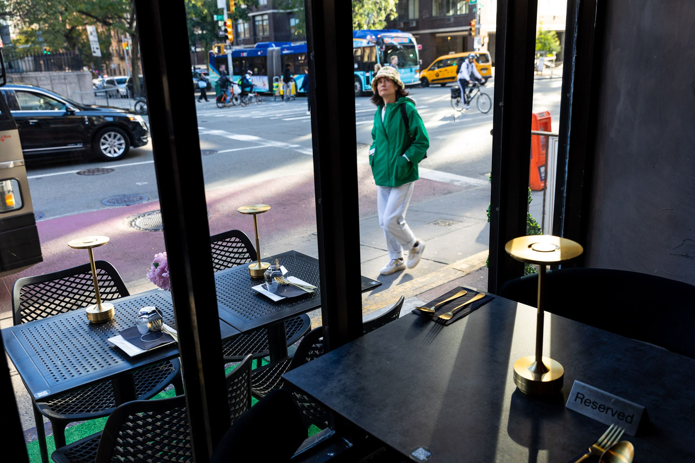
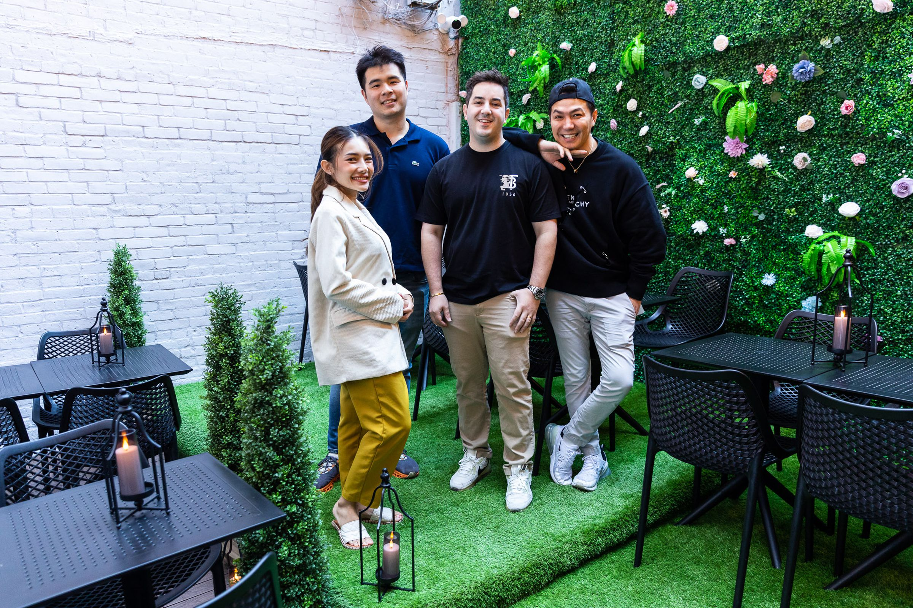
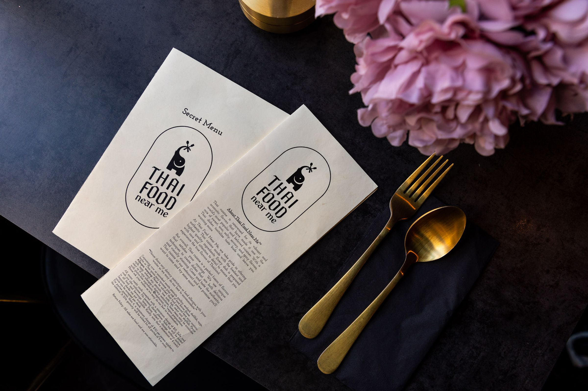
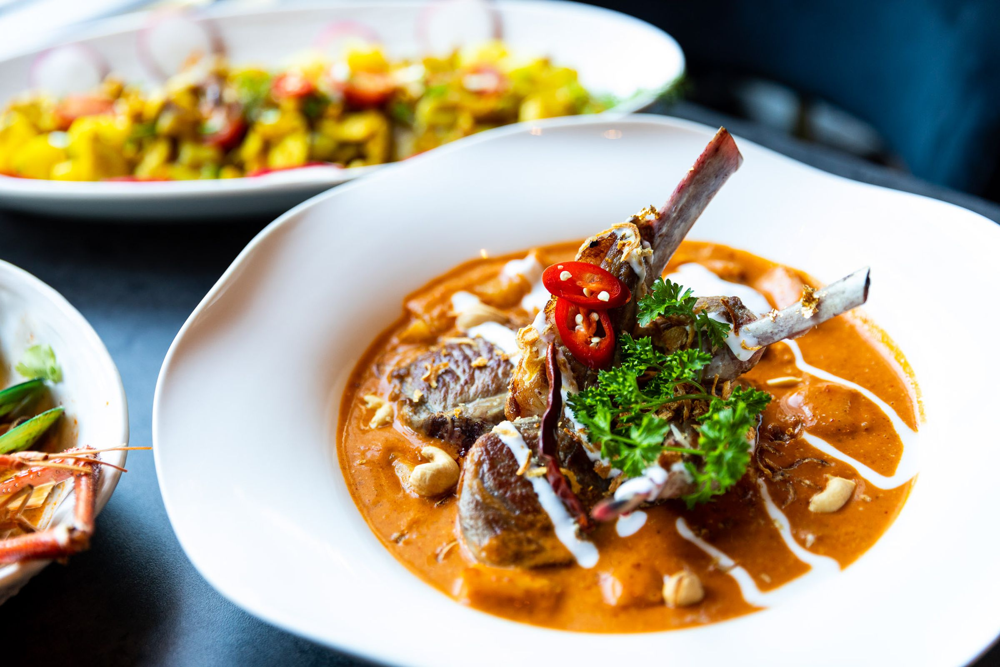
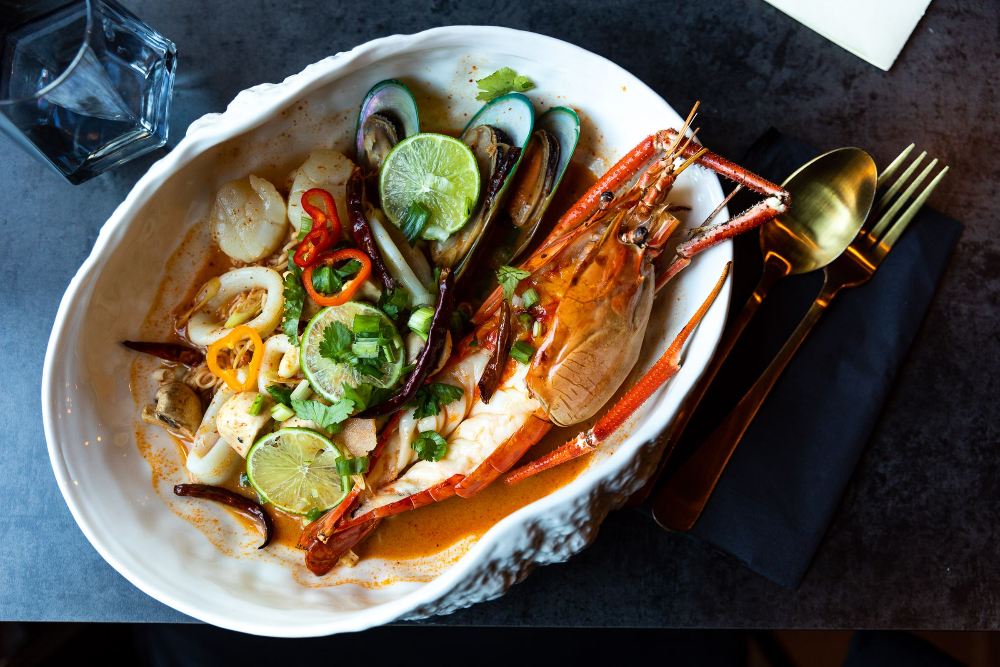

Even to its owners, the name for their new Thai restaurant seemed silly and unserious. Some of them were embarrassed to tell friends about it at all, for fear of it sounding too ridiculous.  

即使对于餐馆的业主们来说，他们新开的泰国餐厅的名字似乎有些愚蠢和不认真。其中一些人甚至因为担心听起来太荒谬而不好意思向朋友们提起。

But Teddy Jirapraphanan, one of the four owners, thought back to his own experience using Google to find restaurants.  

但泰迪·吉拉普拉法南（Teddy Jirapraphanan）是四位业主之一，他回想起自己使用谷歌搜索餐馆的经历。

“Everywhere I go, I’m craving Thai food,” he says. “I have to search ‘Thai food near me’ all the time.”  

他说：“无论我去哪里，我都渴望吃泰国菜。我一直在搜索‘附近的泰国菜’。”

Jirapraphanan is exactly the kind of customer Thai Food Near Me hopes to scoop up. The New York-based restaurant is named after a literal Google search, betting it can bring in customers with the power of SEO — the practice of making a business, website, or content more findable in search engine results. The restaurant is optimized for the digital platforms diners use to find places nearby, not for the person walking past on the street or getting a recommendation from a friend.  

吉拉普拉法南正是泰国美食附近希望吸引的顾客类型。这家位于纽约的餐厅以字面上的谷歌搜索命名，押注自己可以通过搜索引擎优化（SEO）的力量吸引顾客，这是一种使企业、网站或内容在搜索引擎结果中更易被发现的实践。该餐厅针对用于寻找附近地点的数字平台进行了优化，而不是针对路过的行人或从朋友那里获得推荐的人。

[Thai Food Near Me](https://www.thaifoodnearmenyc.com/) is a small but powerful symbol of Google’s far-reaching impact on businesses over the past two decades and the lengths their owners will go to try to optimize their operations for the company’s platforms. The name is both notable and obvious — if you’ve spent any amount of time searching for things online, you will understand the reference immediately. The turn is that 25 years after Google Search first arrived, the name says the quiet part out loud.  

泰国美食附近是谷歌在过去二十年对企业产生深远影响的一个小而有力的象征，以及业主们为了尝试优化他们的运营而采取的措施。这个名字既引人注目又显而易见——如果你在网上搜索过任何东西，你会立即理解这个参考。转折在于，谷歌搜索首次问世25年后，这个名字公开说出了其中的隐秘部分。

This year, _The Verge_ is exploring how Google Search has reshaped the web into a place for robots — and how the emergence of AI threatens Google itself.  

今年，《The Verge》正在探索谷歌搜索如何将网络塑造成机器人的场所，以及人工智能的出现如何威胁到谷歌本身。

“When you have a million restaurants close by, you will be in the bottom \[of rankings\] if it’s a random name,” Jirapraphanan says. “But \[when\] we used Thai Food Near Me, people started knowing us.” Customers, like Jirapraphanan, were searching for the exact phrase and stumbling upon the restaurant, they told him.  

“当你周围有一百万家餐馆时，如果是一个随机的名字，你会排在最后。”Jirapraphanan说。“但是当我们使用‘附近的泰餐馆’这个词组时，人们开始认识我们。”顾客们告诉他，他们是在搜索这个确切的词组时偶然发现了这家餐馆。

In March, a photo of the restaurant [went viral on Twitter](https://twitter.com/AliciaTatone/status/1640809733136306176) ahead of its opening, brown butcher paper still covering the windows. The restaurant’s goofy name was enough to garner [coverage](https://nextshark.com/nyc-restaurant-named-thai-food-near-me) [on news sites](https://news.yahoo.com/nyc-restaurant-named-thai-food-202711340.html), along with an influx of customers in the first crucial months of being open.  

三月份，餐馆的一张照片在开业前在Twitter上迅速传播开来，窗户上还贴着棕色的屠夫纸。餐馆滑稽的名字足以引起新闻网站的关注，同时也吸引了大量顾客在开业的关键几个月里光顾。

The viral tweet invariably summoned a chorus of overly friendly, all-lowercase-text replies from brands looking for attention. The official account of Google Maps — the very entity the meme-y restaurant name is designed to outsmart — couldn’t resist.  

这条病毒式的推文不可避免地引来了一大堆品牌过于友好的、全小写的回复，它们都在寻求关注。而谷歌地图的官方账号——这个模因式的餐馆名字的设计目的就是要智取它——也忍不住加入了其中。

“Very relatable,” the company replied, with a crown emoji. But response to its presence in the thread was mixed.  

“非常有共鸣，”公司回复道，附上了一个皇冠表情。但是对于它在帖子中的存在，回应却褒贬不一。

One person replied, “This is about how your products don’t even work anymore.”  

有人回复说：“这是关于你们的产品已经不再起作用了。”

_Thai Food Near Me is located on a busy street in the Murray Hill neighborhood of Manhattan.  

Thai Food Near Me位于曼哈顿的Murray Hill社区繁忙的街道上。_

Thai Food Near Me isn’t the first business to think of the Google-first naming convention. There are reminders of Google’s kingmaker status in online discoverability everywhere in cities across the country.  

Thai Food Near Me并不是第一个想到以谷歌为首的命名规则的企业。在全国各地的城市中，到处都能看到谷歌在在线可发现性方面的王者地位的提醒。

Among the businesses I was able to find: a chain of half a dozen Affordable Dentist Near Me’s in Texas; an Antiques Near Me two hours outside of New York City; seven Plumber Near Me businesses; a Phone Repair Near Me in Cape Cod, Massachusetts; a Psychic Near Me in Chicago; and more than 20 iterations of “Notary Near Me” across the US.  

在我找到的企业中：德克萨斯州有六家“附近实惠牙医连锁店”；纽约市外两小时有一家“附近古董店”；有七家“附近水管工”企业；马萨诸塞州科德角有一家“附近手机维修店”；芝加哥有一家“附近占卜师”；美国各地有20多家“附近公证员”的不同版本。

Felix Silva decided on the name [Barber Shop Near Me](https://www.instagram.com/barbershop.nearme.coralsprings/) after considering more than 20 other options for his Coral Springs, Florida, store in 2019. The name is meant to be neutral and memorable — another one in contention was “The Barber Shop” — but Silva fully leaned into the Google joke: the logo is a red location pin resembling Google’s own, with a blue, white, and red barber pole pattern in the middle.  

2019年，费利克斯·席尔瓦在佛罗里达州科勒尔斯普林斯的店铺考虑了其他20多个选项后，决定将其命名为“附近理发店”。这个名字旨在中性且易记——还有一个备选名字是“理发店”——但席尔瓦完全借用了谷歌的笑话：标志是一个红色的定位图钉，类似于谷歌的标志，中间有蓝、白、红相间的理发杆图案。

Silva had seen firsthand how a business’s Google presence could help or hurt its chances of success  

席尔瓦亲眼见证了企业在谷歌上的存在对其成功机会的帮助或伤害

“Before we opened, we just had a logo \[on an Instagram account\]. And we had some clients then tell us, ‘Oh, man, before you guys opened we thought Google was coming to town,” Silva says.   

“在我们开业之前，我们只有一个标志（在Instagram上）。然后我们有一些客户告诉我们，‘哦，伙计，在你们开业之前，我们以为谷歌要来镇上了，”席尔瓦说。

Like Jirapraphanan, Silva had seen firsthand how a business’s Google presence could help or hurt its chances of success — Silva frequently searches for keywords like “vegan” to find restaurants. One time, Google returned results for a restaurant that wasn’t vegan but had a customer review that contained the keyword that was highlighted.  

像吉拉普拉那南一样，席尔瓦亲眼见证了企业在谷歌上的存在对其成功机会的帮助或伤害——席尔瓦经常搜索关键词“素食主义”来找餐馆。有一次，谷歌返回了一个不是素食主义的餐馆的结果，但其中有一个包含关键词的顾客评论被突出显示。

“It was a light bulb moment… like, ‘Okay, this is the path I need to take. I really need to dial in and focus on the online presence, specifically Google, because that is going to be the foundation of the business,” Silva says.  

“这真是一个灵光乍现的时刻……就像是‘好吧，这就是我需要走的道路。我真的需要专注于在线存在，特别是谷歌，因为这将是业务的基础，”Silva说。

As with Thai Food Near Me, the most powerful thing an SEO-driven name might be able to do is get customers in the door. From there, it’s up to a business to give them a good experience, whether that’s a great plate of pad see ew or the perfect haircut. Then, the cycle continues — happy customers leave good reviews. Good reviews help the business’s Google Maps profile rank higher. Silva uploads high-quality photos and videos to the page and shares updates, too. That’s another SEO move; some experts say active profiles [can improve a business’s rankings](https://www.searchenginejournal.com/google-my-business-posts-get-results/388298/).  

就像“附近的泰餐厅”一样，一个以SEO为驱动的名称可能能够做的最有力的事情就是吸引顾客进门。从那里开始，就取决于企业给他们一个良好的体验，无论是一盘美味的炒粿条还是一次完美的理发。然后，循环继续进行——满意的顾客留下好评。好评有助于企业的谷歌地图概况排名更高。Silva还上传高质量的照片和视频到页面，并分享更新。这是另一个SEO的举措；一些专家称，活跃的概况可以提高企业的排名。

Still, the naming scheme has caught on: one acquaintance selling Christmas trees, for example, rebranded his business to be called Christmas Trees Near Me, Silva says. (Silva’s is not the only Barber Shop Near Me, either — there are also shops with the same name in Oak Park, Illinois; Queens, New York; and Muskogee, Oklahoma, according to Google Maps.)  

然而，这种命名方案已经流行起来：例如，一个卖圣诞树的熟人将他的企业重新命名为“附近的圣诞树”，Silva说。（Silva的理发店附近也不只有一家，根据谷歌地图，在伊利诺伊州奥克帕克、纽约州皇后区和俄克拉荷马州马斯科吉也有同名的店铺。）

“It was a compliment. It was nice to see that in some way this inspires some people,” Silva says of the Christmas tree company rebrand. But he’s always thinking about what’s next, what could give his business the edge to keep growing. Sometimes he wonders if an influx of “near me” businesses could water down the impact.  

“这是一种赞美。很高兴看到这在某种程度上激励了一些人，”Silva谈到圣诞树公司的重新品牌。但他总是在思考接下来的事情，什么能够给他的企业带来优势，使其继续增长。有时他会想，是否会有大量的“附近的”企业削弱影响力。

But Google is Google, Silva says, and “near me” is wherever a customer is.  

但是Silva说，Google就是Google，“附近”就是顾客所在的地方。

Thai Food Near Me owners Jirapraphanan, Sampson, Natkitta Kornwaewwongcharoen, and Nat P Akethamwong.  

泰国菜附近的店主Jirapraphanan、Sampson、Natkitta Kornwaewwongcharoen和Nat P Akethamwong。

Whether this attempt at SEO is actually a boon to these businesses is a separate question — a Google Maps search for “Thai food near me” from my home in Brooklyn yielded plenty of options literally near me but not Jirapraphanan’s business just a few miles away.  

至于这种尝试的SEO是否真的对这些企业有好处，这是一个单独的问题——在布鲁克林的家中，我在Google地图上搜索“附近的泰国菜”确实找到了很多离我很近的选择，但离Jirapraphanan的企业只有几英里远。

Robert Sampson, a co-owner of Thai Food Near Me who handles much of the back-end tasks including working on SEO, says he followed the discussion online about the utility of the name.   

泰国菜附近的店的合作业主之一Robert Sampson负责大部分后台任务，包括SEO工作，他说他在网上关注了关于这个名字的实用性的讨论。

“The people who said that \[the name is\] not such a good idea… I think they’re responding more from a national brand campaign. It is true that if you’re in California, and you type ‘Thai food near me,’ you’re going to have a little bit of a hard time finding us,” Sampson says. “But for local search, I think the name works really well.”  

“那些说这个名字不是一个好主意的人...我认为他们更多是从一个全国品牌活动的角度来回应。的确，如果你在加利福尼亚州，然后输入‘附近的泰国菜’，你会有点难找到我们，”Sampson说。“但对于本地搜索来说，我认为这个名字非常好用。”

The term “Thai food near me” is searched, on average, nearly a million times a month in the US, according to Semrush, a company that provides keyword research and other popular SEO tools. Semrush notes you’ll need referring domains and optimized content to try to compete for the term and grades it as “difficult” to rank for — competitive, but not even the hardest category.  

根据提供关键词研究和其他热门SEO工具的公司Semrush的数据，美国每月平均有近一百万次搜索“附近的泰国菜”。Semrush指出，你需要有参考域和优化内容来竞争这个关键词，并将其评为“困难”级别的排名——具有竞争力，但并不是最困难的类别。

_Before serving a single person, the restaurant had gone viral online for its name.  

在为任何人提供服务之前，这家餐厅因其名字在网上迅速传播而走红。_

Adding “near me” to a search term is both a learned behavior and encouraged by Google. “\_\_\_ near me” is a top autofilled search suggestion on both Search and Maps and has become synonymous with Google — that’s why the joke works.  

将“附近”添加到搜索词中既是一种学习行为，也是Google鼓励的。在搜索和地图上，“\_\_\_附近”是一个自动填充的热门搜索建议，已经成为了与Google同义词——这就是为什么这个笑话起作用的原因。

For a group I spoke with at Thai Food Near Me on an evening in August, the SEO plan — at least practically — had the intended effect. One of the diners, Travis, found Thai Food Near Me on Yelp when searching for nearby dining options after missing an earlier reservation elsewhere. Several people in the group had heard about the restaurant when it went viral this spring but didn’t realize it was in New York.  

对我在八月的一个晚上在“附近的泰餐馆”与一群人交谈的时候，SEO计划——至少在实际上——产生了预期的效果。其中一位用餐者Travis在错过了其他地方的早期预订后，在Yelp上找到了“附近的泰餐馆”作为附近就餐选择。群体中的几个人在这个春天它走红时听说过这家餐馆，但他们不知道它在纽约。

The group agreed the food was good, even though they didn’t know what to expect. They’d definitely consider coming back if they were in the area, they told me.  

尽管他们不知道会有什么样的期望，但这个群体一致认为食物很好。他们告诉我，如果他们在这个地区，他们肯定会考虑再次光顾。

So did the clever SEO hack of a name actually help bump Thai Food Near Me above its nearby competitors in search results?  

那么，这个聪明的SEO技巧是否真的帮助“附近的泰餐馆”在搜索结果中超过了附近的竞争对手呢？

“I doubt it,” Danny Sullivan, Google’s public liaison for Search, says. Owners doing this might find success, but Google pulls in other data to serve results to users, like location, reviews, or ratings — a “hodgepodge of different things that we have that are out there.”  

“我怀疑这一点，”Google搜索的公共联络人Danny Sullivan说。做这样的事情的店主可能会取得成功，但Google会引入其他数据来为用户提供结果，比如位置、评论或评级——一些“我们拥有的各种各样的东西”。

[Google’s public documentation says it uses three categories](https://support.google.com/business/answer/7091?hl=en) to rank results that are local to a searcher: relevance, distance, and prominence. To improve local ranking, Google encourages businesses to provide a trove of information on their profile. Owners should have basics like updated hours of operation and accurate location details, but they should also respond to reviews, add photos, and even [post individual items in stock](https://support.google.com/business/answer/9934993) to their Google page.  

谷歌的公开文档称，它使用三个类别来对与搜索者相关的本地结果进行排名：相关性、距离和知名度。为了提高本地排名，谷歌鼓励企业在其个人资料上提供大量信息。业主应该提供基本信息，如更新的营业时间和准确的位置详情，但他们还应该回复评论、添加照片，甚至在谷歌页面上发布库存中的单个物品。

“I don’t think they’re really great marketing campaigns”  

“我不认为它们是真正伟大的营销活动”

The prominence measure in Maps includes data from the web — links to the business, how the business ranks in traditional search, and press coverage, for example. In this way, SEO impacts how a business appears in local search results, and news articles and links are one way [Google tries to determine the relevance of a page](https://developers.google.com/search/docs/essentials/spam-policies#hidden-text-and-links). (It’s why reporters’ inboxes are overrun with spammy requests to buy “guest posts” on our sites from marketers.)    

地图中的知名度指标包括来自网络的数据，例如与该企业的链接、企业在传统搜索中的排名和新闻报道。通过这种方式，搜索引擎优化（SEO）会影响企业在本地搜索结果中的显示方式，新闻文章和链接是谷歌试图确定页面相关性的一种方式。（这就是为什么记者的收件箱总是被来自营销人员的垃圾邮件请求购买我们网站上的“客座文章”的原因。）

Ironically, a search I did in Google Maps for “Thai food near me” from Wisconsin surfaced the Manhattan restaurant as a suggestion, above any local businesses — it was easier to find it from the Midwest than it was from Brooklyn. Sullivan says this could be due to Google recognizing there’s a business with an exact match name that has some degree of notoriety that people are searching for in different areas. It could encourage other people to name their businesses in this style, but Sullivan says he doesn’t see it as an issue that needs addressing.   

具有讽刺意味的是，我在威斯康星州使用谷歌地图搜索“附近的泰餐厅”时，竟然出现了曼哈顿餐厅的建议，超过了任何本地企业——从中西部地区找到它比从布鲁克林找到它更容易。沙利文表示，这可能是因为谷歌意识到有一家名字完全匹配且在不同地区受到一定关注的企业，人们在不同地方都在搜索这个名字。这可能会鼓励其他人以这种方式命名他们的企业，但沙利文表示，他并不认为这是一个需要解决的问题。

“I’ve seen these kinds of things over the years, and they kind of make me laugh and have a bit of a chuckle. But I don’t think they’re really great marketing campaigns,” Sullivan told _The Verge._ Google’s advice has always been that businesses should make decisions that serve their customers, not the platform, he says.   

“多年来，我见过这些事情，它们让我发笑。但我不认为它们是真正伟大的营销活动，”沙利文告诉The Verge。他说，谷歌一直建议企业应该做出符合顾客需求而不是平台的决策。

_The restaurant’s “secret menu” has speciality dishes.  

该餐厅的“秘密菜单”有特色菜品。_

Sullivan might say that a “near me” name isn’t a silver bullet to gaming the search engine algorithm — but in a roundabout way, the name really did help Thai Food Near Me.   

沙利文可能会说，“附近的”这个名字并不是欺骗搜索引擎算法的万能方法，但从某种意义上说，这个名字确实帮助了“附近的泰餐厅”。

Its initial SEO “hack” was likely technically ineffective, but it _was_ memorable and funny. The joke led to [many](https://economictimes.indiatimes.com/news/new-updates/thai-food-near-me-restaurant-in-new-york-goes-viral-on-twitter/articleshow/99511427.cms?from=mdr), [many](https://www.indiatimes.com/trending/human-interest/thai-food-near-me-genius-restaurant-name-in-new-york-599382.html), [many](https://www.inc.com/nick-hawkins/how-to-name-your-business-to-make-a-good-first-impression.html) articles and forum posts about the restaurant’s name, which tipped the SEO scales in its favor. All of this content, including the story you’re reading now, will help Thai Food Near Me’s prominence on Google platforms. One SEO trick has eaten another.  

它最初的SEO“黑客”可能在技术上并不有效，但它是令人难忘和有趣的。这个笑话引发了许多文章和论坛帖子，都在谈论这家餐厅的名字，这使得“附近的泰餐厅”在谷歌平台上更加突出。一个SEO技巧吃掉了另一个。

Even if the name doesn’t work on Google exactly how Sampson and Jirapraphanan expected, it clearly has pulled in customers — Sampson says that for the first several months of being open, most people were coming in after seeing Twitter and Reddit posts, not Google results. Others would walk by outside, do a double take at the sign, and come inside.  

即使Sampson和Jirapraphanan的名字在Google上并没有像他们预期的那样起作用，但很明显它确实吸引了顾客。Sampson说，在开业的最初几个月里，大多数人是在看到Twitter和Reddit的帖子后才进来的，而不是通过Google的搜索结果。其他人会在外面经过时，看到招牌后会停下来，然后走进来。

“After you get that initial bunch, you’ve got people who enjoyed their dining experience here,” he says. “They’ll tell all their friends and family if they liked it, and then those people come from word of mouth.”  

“在你吸引到最初的一批顾客之后，你就会有那些在这里享受用餐体验的人，”他说。“如果他们喜欢的话，他们会告诉所有的朋友和家人，然后这些人会通过口碑传播而来。”

_Co-owner Jirapraphanan designed the restaurant’s menu.  

合伙人Jirapraphanan设计了餐厅的菜单。_

Despite the admittedly silly name, it’s clear that Thai Food Near Me’s Jirapraphanan and Sampson care about what they’re serving: the restaurant is clean and stylish, and the menu, carefully designed by Jirapraphanan, features original dishes I haven’t seen at other places. My food is tasty, comes out promptly, and I, too, will note the spot if I’m ever in the area again and craving Thai food.  

尽管名字有点傻，但很明显，Thai Food Near Me的Jirapraphanan和Sampson关心他们所提供的食物：餐厅干净而时尚，菜单由Jirapraphanan精心设计，上面有一些我在其他地方没有见过的原创菜品。我的食物很美味，上菜也很及时，如果我再次来到这个地区并且想吃泰国菜，我也会记住这个地方。

Jirapraphanan wants people to come back because they actually like the food. The name is part — but not all — of the branding. “I want to be different from other Thai restaurants,” he tells me.   

Jirapraphanan希望人们因为真的喜欢这里的食物而再次光顾。名字只是品牌的一部分，但并不是全部。“我希望与其他泰国餐厅不同，”他告诉我。

But we’re in an era of dining where one viral video online could [make or break](https://www.theverge.com/22618363/tiktok-tour-guides-city-restaurant-previews-influencers) a restaurant, and business owners must be strategic about getting their operation in front of potential customers. (Thai Food Near Me is at least the fourth Thai restaurant to occupy the same location, according to defunct delivery and review websites I was able to dig up; Jirapraphanan was told they’re the fifth.) As _New York_ Magazine [reported](https://www.grubstreet.com/article/tiktok-took-over-the-menu.html), the allure of a social media hit is shaping the very food being served — gooier eggs, more obscene cheese, sauces exploding and gushing across a plate. If the algorithm and diner-slash-viewers want messier, spectacle-driven dishes, many restaurants are complying.  

但是我们正处在一个餐饮业的时代，网络上的一个病毒视频可以决定一个餐厅的成败，业主们必须在让潜在顾客看到他们的经营方式上做出战略性的决策。（根据我能找到的已关闭的外卖和评论网站，"附近的泰餐"至少是在同一位置上经营的第四家泰餐厅，Jirapraphanan被告知他们是第五家。）正如《纽约杂志》报道的那样，社交媒体的吸引力正在塑造所提供的食物——更加浓稠的鸡蛋，更加淫秽的奶酪，酱汁在盘子上爆炸和涌出。如果算法和用餐者兼观众想要更加凌乱、以壮观为导向的菜肴，许多餐厅都会遵循。

In some ways, Thai Food Near Me has optimized its food, too. The owners have tweaked their menu and modification options on delivery apps like Uber Eats or DoorDash, according to common written requests they get on online orders. It’s a savvy business decision, Sampson says, and a way to get — and keep — loyal customers. It’s what’s required for a business to survive when diners have endless options at their fingertips.  

在某种程度上，"附近的泰餐"也优化了他们的食物。根据他们在在线订单中常见的书面要求，业主们对Uber Eats或DoorDash等外卖应用的菜单和修改选项进行了调整。这是一个精明的商业决策，Sampson说，也是一种吸引和保留忠实顾客的方式。当用餐者在指尖上有无尽的选择时，这是一个企业生存所必需的。

“At first we were a little too proud of our Thai food. We wanted to make it how we think you should have it. Well, that’s not actually a smart idea. It’s the other way around,” Sampson says. “We now want to make it however you most want it.”  

"起初，我们对我们的泰餐有点太自豪了。我们想要按照我们认为你应该享用的方式来制作它。嗯，这实际上不是一个明智的想法。应该是相反的，" Sampson说。"现在我们想要按照你最想要的方式来制作它。"

The restaurant is still in its early days; good restaurants shutter for reasons that are no fault of their own. But Sampson and Jirapraphanan are content with their choice of name.  

这家餐厅还处于初创阶段；好的餐厅因为各种原因而倒闭，这并不是他们的错。但是Sampson和Jirapraphanan对他们选择的名字感到满意。

“I think it did more than we could have ever imagined it would do,” Sampson says.  

“我觉得它做得比我们想象的要多”，Sampson说。

Perhaps just not in the way they thought it would.  

也许只是以他们意想不到的方式。
