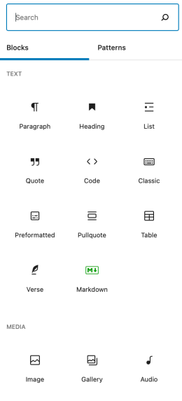
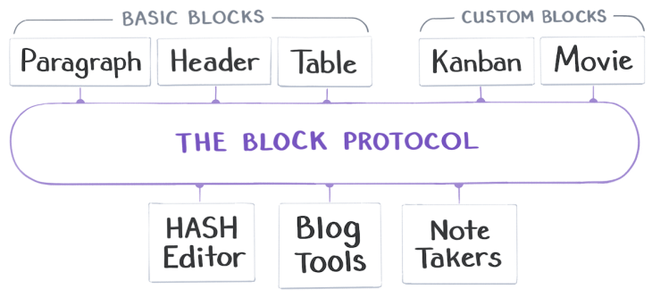

You’ve probably seen web editors based on the idea of _blocks_. I’m typing this in WordPress, which has a little + button that brings up a long list of potential blocks that you can insert into this page:  

你可能已经见过基于块概念的网络编辑器。我正在WordPress中输入这段文字，它有一个小加号按钮，点击后会弹出一个长列表，你可以将其中的块插入到这个页面中：

This kind of “insert block” user interface concept is showing up in almost every blogging tool, web editor, note-taking app, and content management system. People like it and it makes sense.  

这种“插入块”用户界面概念几乎出现在每个博客工具、网络编辑器、笔记应用和内容管理系统中。人们喜欢它，而且它很有道理。

We have seem to have standardized on one thing: the **/** key to insert a new block. Everything else, though, is completely proprietary and non-standard.  

我们似乎已经统一了一件事：用斜杠键（/）插入新块。不过，其他的一切都是完全专有和非标准的。

I thought, wouldn’t it be cool if blocks were interchangeable and reusable across the web?  

我想，如果块可以在网络上互换和重复使用，那不是很酷吗？

Until now, every app that wants blocks has to implement them from scratch. Want a calendar block? Some kind of fancy Kanban board? Something to embed image galleries? Code it up yourself, buddy.  

到目前为止，每个想要使用块的应用都必须从头开始实现它们。想要一个日历块？一种花哨的看板？还是嵌入图库的东西？自己编码吧，伙计。

As a result of the non-standardization of blocks, our end-users suffer. If someone is using my blog engine, they can only use those blocks that I had time to implement. Those blocks may be pretty basic or incomplete. Users might want to use a fancier block that they saw in WordPress or Medium or Notion, but my editor doesn’t have it. Blocks can’t be shared or moved around very easily, and our users are limited to the features and capabilities that we had time to re-implement.  

由于块的非标准化，我们的最终用户受到了影响。如果有人使用我的博客引擎，他们只能使用我有时间实现的那些块。这些块可能相当基础或不完整。用户可能想要使用在WordPress、Medium或Notion中看到的更高级的块，但我的编辑器没有。块不能很容易地共享或移动，我们的用户受限于我们有时间重新实现的功能和能力。

To fix this, we’re going to create a protocol called the [Block Protocol](https://blockprotocol.org/).  

为了解决这个问题，我们将创建一个名为块协议的协议。

It’s open, free, non-proprietary, we want it to be everywhere on the web.  

它是开放的、免费的、非专有的，我们希望它能在网络上无处不在。

It’s just a protocol that embedding applications can use to embed blocks. Any block can be used in any embedding application if they all follow the protocol.  

这只是一个嵌入应用程序可以使用的协议，用于嵌入块。只要它们都遵循这个协议，任何块都可以在任何嵌入应用程序中使用。

Our hope is that this will make life much easier for app developers to support a huge variety of block types. At the same time, anyone can develop a block once and have it work in any blog platform, note-taking app, or content management system. It is all 100% free, open, and any sample code we develop showing how to use the protocol will be open-source.  

我们希望这将使应用程序开发人员更容易支持各种类型的块。同时，任何人都可以开发一个块，并使其在任何博客平台、笔记应用程序或内容管理系统中工作。这一切都是100%免费、开放的，我们开发的演示如何使用该协议的示例代码也将是开源的。

We’ve released a very early draft of the Block Protocol, and we’ve started building some very simple blocks and a simple editor that can host them.  

我们已经发布了一个非常早期的块协议草案，并开始构建一些非常简单的块和一个可以托管它们的简单编辑器。

We’re hoping to foster an open source community that creates a huge open source library of amazing blocks:  

我们希望培养一个开源社区，创建一个巨大的开源块库：

What can be a block?  

什么可以成为一个块？

-   Anything that makes sense in a document: a paragraph, list, table, diagram, or a kanban board.  
    
    任何在文档中有意义的东西：段落、列表、表格、图表或看板。
-   Anything that makes sense on the web: an order form, a calendar, a video.  
    
    任何在网络上有意义的东西：订单表格、日历、视频。
-   Anything that lets you interact with structured or typed data: I’ll get to that in a minute.  
    
    任何让您与结构化或类型化数据进行交互的东西：我马上会讲到这个。

If you work on any kind of editor—be it a blogging tool, a note-taking app, a content management system, or anything like that—you should allow your users to embed blocks that conform to the Block Protocol. This way you can write the embedding code once and immediately make your editor able to embed a rich variety of block types with no extra work on your part.  

如果您从事任何类型的编辑器工作——无论是博客工具、笔记应用程序、内容管理系统还是类似的工具——您应该允许用户嵌入符合块协议的块。这样，您只需编写一次嵌入代码，即可使您的编辑器能够立即嵌入各种丰富的块类型，而无需额外的工作。

If you work on any kind of custom data type that might make sense to embed in web pages, you should support the Block Protocol. That way anybody with a hosting application that supports the protocol can embed your custom data type.  

如果你正在处理任何可能嵌入网页的自定义数据类型，那么你应该支持块协议。这样，任何支持该协议的托管应用程序都可以嵌入你的自定义数据类型。

Because it’s all 100% open, we hope that the Block Protocol will become a web standard and commonly used across the Internet.  

由于它完全开放，我们希望块协议能成为Web标准，并在互联网上得到广泛应用。

That will mean that common block types, from paragraphs and lists to images and videos, will get better and better. But it will also mean that some esoteric block types will be embeddable anywhere. Want to create a block that shows the Great Circle routing for a flight between two airports? Write the code for the block once and it can be embedded anywhere.  

这意味着常见的块类型，从段落和列表到图片和视频，将变得越来越好。但这也意味着一些奇特的块类型可以在任何地方嵌入。想要创建一个显示两个机场之间航班的大圆航线的块吗？只需编写一次块的代码，它就可以在任何地方嵌入。

Oh, and **one more thing**. Blocks can be highly structured, that is, they can have types. That means that they magically become machine-readable without screen scraping. For example, if you want to create an event block to represent an event on a calendar, you will be able to specify a _schema_ that describes the event data type in a standard way. That way tools like calendars can instantly parse and understand web pages that contain your event block, reliably.  

哦，还有一件事。块可以高度结构化，也就是说，它们可以有类型。这意味着它们可以通过机器读取而无需屏幕抓取。例如，如果你想创建一个事件块来表示日历上的事件，你可以以标准方式指定描述事件数据类型的模式。这样，像日历这样的工具就可以立即解析和理解包含你的事件块的网页，而且是可靠的。

Over time, it will mean that anyone can easy publish complex, typed data sets on the web that are automatically machine-readable without extra work. (Have you ever seen one of those websites where there’s a link to “download the data set in .XLS format”? Yeah, say goodbye to that.)  

随着时间的推移，这将意味着任何人都可以轻松在Web上发布复杂的、有类型的数据集，而无需额外的工作即可自动进行机器读取。（你是否见过那种网站，上面有一个“以.XLS格式下载数据集”的链接？是的，和那个说再见吧。）

**We’re going public with this very early in the development process** because we need a lot of help!  

我们在开发过程的早期就公开了这个项目，因为我们需要很多帮助！

Everything we have so far is version 0.1. It’s simple and not very good yet and going to need some iteration before it has the hope of truly being a useful web protocol.  

到目前为止，我们的一切都是0.1版本。它很简单，还不够好，需要经过一些迭代才能真正成为一个有用的网络协议。

This is an open protocol, free and non-proprietary, and it’s going to make the open web much better if widely adopted, so we need to start getting people involved early, giving us feedback, and building new things!  

这是一个开放的协议，免费且非专有的。如果被广泛采用，它将使开放网络变得更好，因此我们需要尽早让人们参与进来，给我们反馈，并构建新的东西！

[Go read more about the Block Protocol now!  

现在去阅读更多关于Block Protocol的内容吧！](https://blockprotocol.org/)
