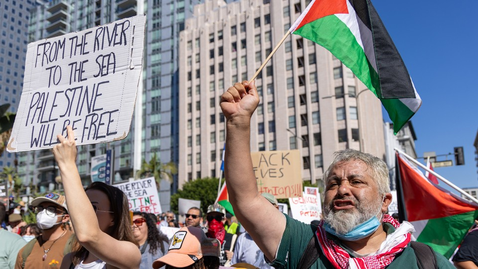

It does not accurately describe either the foundation of Israel or the tragedy of the Palestinians.  

它既没有准确描述以色列的基础，也没有描述巴勒斯坦人的悲剧。

Irfan Khan / Los Angeles Times / Getty

October 27, 2023 2023 年 10 月 27 日

Peace in the Israel-Palestine conflict had already been difficult to achieve before Hamas’s barbarous October 7 attack and Israel’s military response. Now it seems almost impossible, but its essence is clearer than ever: Ultimately, a negotiation to establish a safe Israel beside a safe Palestinian state.  

在哈马斯 10 月 7 日的野蛮袭击和以色列的军事回应之前，以巴冲突的和平就已经很难实现。现在看来，和平几乎不可能实现，但其本质却比以往任何时候都更加清晰：最终，通过谈判在安全的巴勒斯坦国旁边建立一个安全的以色列。

Whatever the enormous complexities and challenges of bringing about this future, one truth should be obvious among decent people: killing 1,400 people and kidnapping more than 200, including scores of civilians, was deeply wrong. The Hamas attack resembled a medieval Mongol raid for slaughter and human trophies—except it was recorded in real time and published to social media. Yet since October 7, Western academics, students, artists, and activists have denied, excused, or even celebrated the murders by a terrorist sect that proclaims an anti-Jewish genocidal program. Some of this is happening out in the open, some behind the masks of humanitarianism and justice, and some in code, most famously “[from the river to the sea](https://www.adl.org/resources/backgrounder/allegation-river-sea-palestine-will-be-free),” a chilling phrase that implicitly endorses the killing or deportation of the 9 million Israelis. It seems odd that one has to say: Killing civilians, old people, even babies, is always wrong. But today say it one must.  

无论实现这一未来有多么巨大的复杂性和挑战，有一个真理在正直的人们中间应该是显而易见的：杀害 1400 人并绑架 200 多人，其中包括数十名平民，是极其错误的。哈马斯的袭击就像中世纪蒙古人为屠杀和人类战利品而发动的突袭--只不过它被实时记录并发布到了社交媒体上。然而，自 10 月 7 日以来，西方的学者、学生、艺术家和活动家都否认、原谅甚至庆祝这个宣称反犹太人种族灭绝计划的恐怖教派的谋杀行为。这其中有些是公开的，有些是在人道主义和正义的面具下进行的，有些则是暗地里进行的，其中最著名的是 "从河到海"，这句令人不寒而栗的话暗含着对杀害或驱逐 900 万以色列人的赞同。不得不说，这似乎很奇怪：杀害平民、老人甚至婴儿总是错误的。但今天我们必须这样说。

[Franklin Foer: Tell me how this ends  

告诉我结局如何](https://www.theatlantic.com/ideas/archive/2023/10/israel-hamas-war-end-objective/675787/)

How can educated people justify such callousness and embrace such inhumanity? All sorts of things are at play here, but much of the justification for killing civilians is based on a fashionable ideology, “decolonization,” which, taken at face value, rules out the negotiation of two states—the only real solution to this century of conflict—and is as dangerous as it is false.  

受过教育的人怎么能为这种冷酷无情和毫无人性的行为辩护呢？这里有各种各样的问题，但屠杀平民的大部分理由是基于一种时髦的意识形态--"非殖民化"，从表面上看，它排除了两个国家的谈判--这是解决本世纪冲突的唯一真正办法--它既危险又虚假。

I always wondered about the leftist intellectuals who supported Stalin, and those aristocratic sympathizers and peace activists who excused Hitler. Today’s Hamas apologists and atrocity-deniers, with their robotic denunciations of “settler-colonialism,” belong to the same tradition but worse: They have abundant evidence of the slaughter of old people, teenagers, and children, but unlike those fools of the 1930s, who slowly came around to the truth, they have not changed their views an iota. The lack of decency and respect for human life is astonishing: Almost instantly after the Hamas attack, a legion of people emerged who downplayed the slaughter, or denied actual atrocities had even happened, as if Hamas had just carried out a traditional military operation against soldiers. October 7 deniers, like Holocaust deniers, exist in an especially dark place.  

我一直很好奇那些支持斯大林的左派知识分子，以及那些为希特勒开脱的贵族同情者与和平活动家。今天的哈马斯辩护者和暴行否认者，他们机械地谴责 "定居者-殖民主义"，属于同样的传统，但更糟糕的是：他们有大量证据证明老人、青少年和儿童遭到屠杀，但与 20 世纪 30 年代那些慢慢明白真相的傻瓜不同，他们丝毫没有改变自己的观点。他们对人的生命缺乏礼貌和尊重，这一点令人震惊：几乎就在哈马斯发动袭击后的一瞬间，就出现了一大批对屠杀轻描淡写的人，他们甚至否认确实发生过暴行，就好像哈马斯只是对士兵进行了一次传统的军事行动。否认 "十月七日 "事件的人，就像否认大屠杀的人一样，存在于一个特别黑暗的地方。

The decolonization narrative has dehumanized Israelis to the extent that otherwise rational people excuse, deny, or support barbarity. It holds that Israel is an “imperialist-colonialist” force, that Israelis are “settler-colonialists,” and that Palestinians have a right to eliminate their oppressors. (On October 7, we all learned what that meant.) It casts Israelis as “white” or “white-adjacent” and Palestinians as “people of color.”  

非殖民化叙事将以色列人非人化，以至于原本理性的人们原谅、否认或支持野蛮行径。它认为以色列是 "帝国主义-殖民主义 "势力，以色列人是 "定居者-殖民主义者"，巴勒斯坦人有权消灭压迫他们的人。(10 月 7 日，我们都知道了这意味着什么。）它将以色列人视为 "白人 "或 "白人附属"，将巴勒斯坦人视为 "有色人种"。

This ideology, powerful in the academy but long overdue for serious challenge, is a toxic, historically nonsensical mix of Marxist theory, Soviet propaganda, and traditional anti-Semitism from the Middle Ages and the 19th century. But its current engine is the new identity analysis, which sees history through a concept of race that derives from the American experience. The argument is that it is almost impossible for the “oppressed” to be themselves racist, just as it is impossible for an “oppressor” to be the subject of racism. Jews therefore cannot suffer racism, because they are regarded as “white” and “privileged”; although they cannot be victims, they can and do exploit other, less privileged people, in the West through the sins of “exploitative capitalism” and in the Middle East through “colonialism.”  

这种意识形态在学术界声势浩大，但早该受到严肃的挑战，它是马克思主义理论、苏联宣传以及中世纪和 19 世纪传统反犹太主义的有毒、无历史意义的混合体。但它目前的引擎是新的身份分析，即通过源自美国经验的种族概念来看待历史。其论点是，"被压迫者 "本身几乎不可能是种族主义者，正如 "压迫者 "不可能是种族主义的主体一样。因此，犹太人不可能遭受种族主义，因为他们被视为 "白人 "和 "特权者"；尽管他们不可能成为受害者，但他们可以而且确实剥削了其他特权较少的人，在西方是通过 "剥削资本主义 "的罪恶，在中东是通过 "殖民主义"。

This leftist analysis, with its hierarchy of oppressed identities—and intimidating jargon, a clue to its lack of factual rigor—has in many parts of the academy and media replaced traditional universalist leftist values, including internationalist standards of decency and respect for human life and the safety of innocent civilians. When this clumsy analysis collides with the realities of the Middle East, it loses all touch with historical facts.  

这种左派分析对被压迫者的身份进行了等级划分，并使用了令人生畏的专业术语，表明其缺乏严谨的事实依据，在学术界和媒体的许多地方取代了传统的普世左派价值观，包括国际主义的正派标准、对人类生命和无辜平民安全的尊重。当这种拙劣的分析与中东的现实相碰撞时，就完全失去了与历史事实的联系。

Indeed, it requires an astonishing leap of ahistorical delusion to disregard the record of anti-Jewish racism over the two millennia since the fall of the Judean Temple in 70 C.E. After all, the October 7 massacre ranks with the medieval mass killings of Jews in Christian and Islamic societies, the Khmelnytsky massacres of 1640s Ukraine, Russian pogroms from 1881 to 1920—and the Holocaust. Even the Holocaust is now sometimes misconstrued—as the actor Whoopi Goldberg notoriously did—as being “not about race,” an approach as ignorant as it is repulsive.  

事实上，要想无视自公元 70 年犹太圣殿陷落以来两千年反犹种族主义的记录，就需要有惊人的非历史妄想症。毕竟，10 月 7 日大屠杀与中世纪基督教和伊斯兰社会对犹太人的大规模屠杀、16 世纪 40 年代乌克兰的赫梅利尼茨基大屠杀、1881 年至 1920 年的俄罗斯大屠杀以及大屠杀齐名。即使是大屠杀，现在有时也被误解为 "与种族无关"--演员乌比-戈德堡（Whoopi Goldberg）就曾臭名昭著地误解为 "与种族无关"，这种做法既无知又令人厌恶。

Contrary to the decolonizing narrative, Gaza is not technically occupied by Israel—not in the usual sense of soldiers on the ground. Israel evacuated the Strip in 2005, removing its settlements. In 2007, Hamas seized power, killing its Fatah rivals in a short civil war. Hamas set up a one-party state that crushes Palestinian opposition within its territory, bans same-sex relationships, represses women, and openly espouses the killing of all Jews.  

与非殖民化的说法相反，加沙在技术上并没有被以色列占领--不是通常意义上的驻扎士兵。以色列于 2005 年撤离加沙地带，拆除了定居点。2007 年，哈马斯夺取政权，在一场短暂的内战中杀死了法塔赫的对手。哈马斯建立了一党制国家，镇压境内的巴勒斯坦反对派，禁止同性关系，压制妇女，并公开主张杀死所有犹太人。

Very strange company for leftists.  

对于左派来说，这是一个非常奇怪的公司。

Of course, some protesters chanting “from the river to the sea” may have no idea what they’re calling for; they are ignorant and believe that they are simply endorsing “freedom.” Others deny that they are pro-Hamas, insisting that they are simply pro-Palestinian—but feel the need to cast Hamas’s massacre as an understandable response to Israeli-Jewish “colonial” oppression. Yet others are malign deniers who seek the death of Israeli civilians.  

当然，一些高呼 "从河到海 "的抗议者可能根本不知道他们在呼吁什么；他们是无知的，认为他们只是在支持 "自由"。还有一些人否认他们支持哈马斯，坚称他们只是支持巴勒斯坦--但他们认为有必要将哈马斯的屠杀说成是对以色列-犹太人 "殖民 "压迫的一种可以理解的回应。还有一些人则是恶意否认者，他们想置以色列平民于死地。

The toxicity of this ideology is now clear. Once-respectable intellectuals have shamelessly debated whether 40 babies were dismembered or some smaller number merely had their throats cut or were burned alive. Students now regularly tear down posters of children held as Hamas hostages. It is hard to understand such heartless inhumanity. Our definition of a hate crime is constantly expanding, but if this is not a hate crime, what is? What is happening in our societies? Something has gone wrong.  

现在，这种意识形态的毒性已昭然若揭。曾经受人尊敬的知识分子恬不知耻地争论 40 名婴儿是被肢解，还是更少的人只是被割喉或活活烧死。现在，学生们经常撕毁哈马斯扣为人质的儿童海报。很难理解这种无情的不人道行为。我们对仇恨犯罪的定义在不断扩大，但如果这不是仇恨犯罪，那什么才是呢？我们的社会到底发生了什么？出问题了。

In a further racist twist, Jews are now accused of the very crimes they themselves have suffered. Hence the constant claim of a “genocide” when no genocide has taken place or been intended. Israel, with Egypt, has imposed a blockade on Gaza since Hamas took over, and has periodically bombarded the Strip in retaliation for regular rocket attacks. After more than 4,000 rockets were fired by Hamas and its allies into Israel, the 2014 Gaza War resulted in more than 2,000 Palestinian deaths. More than 7,000 Palestinians, including many children, have died so far in this war, according to Hamas. This is a tragedy—but this is not a _genocide_, a word that has now been so devalued by its metaphorical abuse that it has become meaningless.  

在进一步的种族主义扭曲中，犹太人现在被指控的罪行正是他们自己所遭受的。因此，有人不断声称发生了 "种族灭绝"，但实际上并没有发生或打算发生种族灭绝。自哈马斯接管加沙以来，以色列与埃及一起对加沙实施了封锁，并定期轰炸加沙地带，以报复经常性的火箭弹袭击。在哈马斯及其盟友向以色列发射了 4000 多枚火箭弹之后，2014 年的加沙战争导致 2000 多名巴勒斯坦人死亡。据哈马斯称，迄今已有7000多名巴勒斯坦人在这场战争中丧生，其中包括许多儿童。这是一场悲剧，但这不是种族灭绝。"种族灭绝 "这个词因其隐喻性的滥用而贬值，以至于变得毫无意义。

I should also say that Israeli rule of the Occupied Territories of the West Bank is different and, to my mind, unacceptable, unsustainable, and unjust. The Palestinians in the West Bank have endured a harsh, unjust, and oppressive occupation since 1967. Settlers under the disgraceful Netanyahu government have harassed and persecuted Palestinians in the West Bank: 146 Palestinians in the West Bank and East Jerusalem were killed in 2022 and at least 153 in 2023 before the Hamas attack, and more than 90 since. Again: This is appalling and unacceptable, but not genocide.  

我还应该说，以色列对西岸被占领土的统治是不同的，而且在我看来是不可接受、不可持续和不公正的。自 1967 年以来，西岸的巴勒斯坦人一直忍受着严酷、不公正和压迫性的占领。在可耻的内塔尼亚胡政府领导下的定居者骚扰和迫害西岸的巴勒斯坦人：在哈马斯袭击之前，2022 年西岸和东耶路撒冷有 146 名巴勒斯坦人被杀害，2023 年至少有 153 人被杀害，此后又有 90 多人被杀害。再次强调这一点：这是令人震惊和不可接受的，但不是种族灭绝。

Although there is a strong instinct to make this a Holocaust-mirroring “genocide,” it is not: The Palestinians suffer from many things, including military occupation; settler intimidation and violence; corrupt Palestinian political leadership; callous neglect by their brethren in more than 20 Arab states; the rejection by Yasser Arafat, the late Palestinian leader, of compromise plans that would have seen the creation of an independent Palestinian state; and so on. None of this constitutes genocide, or anything like genocide. The Israeli goal in Gaza—for practical reasons, among others—is to minimize the number of Palestinian civilians killed. Hamas and like-minded organizations have made it abundantly clear over the years that maximizing the number of Palestinian casualties is in their strategic interest. (Put aside all of this and consider: The world Jewish population is still smaller than it was in 1939, because of the damage done by the Nazis. The Palestinian population has grown, and continues to grow. Demographic shrinkage is one obvious marker of genocide. In total, roughly 120,000 Arabs and Jews have been killed in the conflict over Palestine and Israel since 1860. By contrast, at least 500,000 people, mainly civilians, have been killed in the Syrian civil war since it began in 2011.)  

尽管有一种强烈的本能，要把这说成是大屠杀式的 "种族灭绝"，但事实并非如此：巴勒斯坦人遭受了许多苦难，其中包括军事占领；定居者的恐吓和暴力；腐败的巴勒斯坦政治领导层；20 多个阿拉伯国家的兄弟们对他们的冷漠忽视；已故巴勒斯坦领导人亚西尔-阿拉法特拒绝接受本可以建立一个独立的巴勒斯坦国的妥协计划；等等。所有这些都不构成种族灭绝或类似种族灭绝的行为。以色列在加沙的目标是尽量减少巴勒斯坦平民的死亡人数，这也是出于实际考虑。哈马斯和志同道合的组织多年来已经非常清楚地表明，最大限度地增加巴勒斯坦人的伤亡人数符合他们的战略利益。(抛开这一切不谈，想想看：由于纳粹的破坏，世界犹太人口仍然少于 1939 年。巴勒斯坦人口已经增长，而且还在继续增长。人口减少是种族灭绝的一个明显标志。自 1860 年以来，总共约有 12 万阿拉伯人和犹太人在巴勒斯坦和以色列的冲突中丧生。相比之下，自 2011 年叙利亚内战开始以来，至少有 50 万人（主要是平民）在这场战争中丧生。

If the ideology of decolonization, taught in our universities as a theory of history and shouted in our streets as self-evidently righteous, badly misconstrues the present reality, does it reflect the history of Israel as it claims to do? It does not. Indeed, it does not accurately describe either the foundation of Israel or the tragedy of the Palestinians.  

如果非殖民化意识形态在我们的大学里被当作历史理论来教授，在我们的街头被当作不言而喻的正义来高喊，但却严重曲解了当前的现实，那么它是否如其所声称的那样反映了以色列的历史呢？事实并非如此。事实上，它既没有准确描述以色列的基础，也没有准确描述巴勒斯坦人的悲剧。

According to the decolonizers, Israel is and always has been an illegitimate freak-state because it was fostered by the British empire and because some of its founders were European-born Jews.  

根据非殖民化者的说法，以色列现在是而且一直是一个非法的畸形国家，因为它是由大英帝国扶植起来的，而且它的一些创始人是在欧洲出生的犹太人。

In this narrative, Israel is tainted by imperial Britain’s broken promise to deliver Arab independence, and its kept promise to support a “national home for the Jewish people,” in the language of the 1917 Balfour Declaration. But the supposed promise to Arabs was in fact an ambiguous 1915 agreement with Sharif Hussein of Mecca, who wanted his Hashemite family to rule the entire region. In part, he did not receive this new empire because his family had much less regional support than he claimed. Nonetheless, ultimately Britain delivered three kingdoms—Iraq, Jordan, and Hejaz—to the family.  

在这种说法中，以色列因帝国英国违背了实现阿拉伯独立的承诺，以及其遵守了 1917 年《贝尔福宣言》中支持 "犹太人民民族家园 "的承诺而受到玷污。但是，所谓对阿拉伯人的承诺实际上是 1915 年与麦加的谢里夫-侯赛因达成的一项模棱两可的协议，后者希望他的哈希姆家族统治整个地区。在某种程度上，他没有得到这个新帝国，因为他的家族得到的地区支持比他声称的要少得多。尽管如此，英国最终还是将三个王国--伊拉克、约旦和希贾兹--交给了这个家族。

The imperial powers—Britain and France—made all sorts of promises to different peoples, and then put their own interests first. Those promises to the Jews and the Arabs during World War I were typical. Afterward, similar promises were made to the Kurds, the Armenians, and others, none of which came to fruition. But the central narrative that Britain betrayed the Arab promise and backed the Jewish one is incomplete. In the 1930s, Britain turned against Zionism, and from 1937 to 1939 moved toward an Arab state with no Jewish one at all. It was an armed Jewish revolt, from 1945 to 1948 against imperial Britain, that delivered the state.  

帝国主义列强--英国和法国--向不同的民族许下各种承诺，然后把自己的利益放在首位。第一次世界大战期间对犹太人和阿拉伯人的承诺就是典型的例子。之后，对库尔德人、亚美尼亚人和其他人也做出了类似的承诺，但都没有实现。但是，英国背叛阿拉伯人的承诺、支持犹太人的承诺这一中心论点并不完整。20 世纪 30 年代，英国转而反对犹太复国主义，从 1937 年到 1939 年，英国致力于建立一个没有犹太人的阿拉伯国家。1945 年至 1948 年，犹太人发动武装起义，反抗帝国主义英国，最终建立了犹太国。

Israel exists thanks to this revolt, and to international law and cooperation, something leftists once believed in. The idea of a Jewish “homeland” was proposed in three declarations by Britain (signed by Balfour), France, and the United States, then promulgated in a July 1922 resolution by the League of Nations that created the British “mandates” over Palestine and Iraq that matched French “mandates” over Syria and Lebanon. In 1947, the United Nations devised the partition of the British mandate of Palestine into two states, Arab and Jewish.  

以色列的存在要归功于这场起义，也要归功于左派曾经坚信的国际法和国际合作。犹太人 "家园 "的想法是在英国（贝尔福签署）、法国和美国的三份宣言中提出的，然后在国际联盟 1922 年 7 月的一项决议中颁布，该决议建立了英国对巴勒斯坦和伊拉克的 "委任统治"，与法国对叙利亚和黎巴嫩的 "委任统治 "相呼应。1947 年，联合国将英国委任统治的巴勒斯坦分治为阿拉伯和犹太两个国家。

The carving of such states out of these mandates was not exceptional, either. At the end of World War II, France granted independence to Syria and Lebanon, newly conceived nation-states. Britain created Iraq and Jordan in a similar way. Imperial powers designed most of the countries in the region, except Egypt.  

从这些委任统治地中划分出这样的国家也并非特例。二战结束时，法国给予叙利亚和黎巴嫩独立，这两个国家是新成立的民族国家。英国以类似的方式建立了伊拉克和约旦。除埃及外，帝国列强设计了该地区的大多数国家。

Nor was the imperial promise of separate homelands for different ethnicities or sects unique. The French had promised independent states for the Druze, Alawites, Sunnis, and Maronites but in the end combined them into Syria and Lebanon. All of these states had been “vilayets” and “sanjaks” (provinces) of the Turkish Ottoman empire, ruled from Constantinople, from 1517 until 1918.  

帝国承诺为不同种族或教派建立独立的家园也并非独一无二。法国人曾承诺为德鲁兹人、阿拉维派、逊尼派和马龙派建立独立国家，但最终却将他们合并到叙利亚和黎巴嫩。从 1517 年到 1918 年，所有这些国家都曾是土耳其奥斯曼帝国的 "vilayets "和 "sanjaks"（省），由君士坦丁堡统治。

The concept of “partition” is, in the decolonization narrative, regarded as a wicked imperial trick. But it was entirely normal in the creation of 20th-century nation-states, which were typically fashioned out of fallen empires. And sadly, the creation of nation-states was frequently marked by population swaps, huge refugee migrations, ethnic violence, and full-scale wars. Think of the Greco-Turkish war of 1921–22 or the partition of India in 1947. In this sense, Israel-Palestine was typical.  

在非殖民化叙事中，"分治 "概念被视为帝国的邪恶伎俩。但在 20 世纪民族国家的创建过程中，"分治 "却是完全正常的，因为民族国家通常是由衰落的帝国改造而成的。可悲的是，民族国家的建立往往伴随着人口交换、大规模难民迁徙、种族暴力和全面战争。想想 1921-22 年的希腊-土耳其战争或 1947 年的印度分治吧。从这个意义上说，以色列-巴勒斯坦就是典型的例子。

At the heart of decolonization ideology is the categorization of all Israelis, historic and present, as “colonists.” This is simply wrong. Most Israelis are descended from people who migrated to the Holy Land from 1881 to 1949. They were not completely new to the region. The Jewish people ruled Judean kingdoms and prayed in the Jerusalem Temple for a thousand years, then were ever present there in smaller numbers for the next 2,000 years. In other words, Jews are indigenous in the Holy Land, and if one believes in the return of exiled people to their homeland, then the return of the Jews is exactly that. Even those who deny this history or regard it as irrelevant to modern times must acknowledge that Israel is now the home and only home of 9 million Israelis who have lived there for four, five, six generations.  

非殖民化意识形态的核心是将历史上和现在的所有以色列人都归类为 "殖民者"。这是完全错误的。大多数以色列人都是 1881 年至 1949 年期间迁徙到圣地的人的后裔。他们对该地区并非完全陌生。犹太民族统治犹大王国并在耶路撒冷圣殿祈祷达千年之久，之后的 2000 年里，他们一直在那里，但人数较少。换句话说，犹太人是圣地的原住民，如果人们相信被流放的人重返家园，那么犹太人的回归正是如此。即使那些否认这段历史或认为这段历史与现代无关的人也必须承认，以色列现在是 900 万以色列人的家园，也是他们唯一的家园，他们已经在那里生活了四、五、六代人。

Most migrants to, say, the United Kingdom or the United States are regarded as British or American within a lifetime. Politics in both countries is filled with prominent leaders—Suella Braverman and David Lammy, Kamala Harris and Nikki Haley—whose parents or grandparents migrated from India, West Africa, or South America. No one would describe them as “settlers.” Yet Israeli families resident in Israel for a century are designated as “settler-colonists” ripe for murder and mutilation. And contrary to Hamas apologists, the ethnicity of perpetrators or victims never justifies atrocities. They would be atrocious anywhere, committed by anyone with any history. It is dismaying that it is often self-declared “anti-racists” who are now advocating exactly this murder by ethnicity.  

大多数移居英国或美国的人在一生中都会被视为英国人或美国人。这两个国家的政界都有许多杰出的领导人--苏埃拉-布拉沃曼（Suella Braverman）和大卫-拉米（David Lammy）、卡马拉-哈里斯（Kamala Harris）和尼基-黑利（Nikki Haley）--他们的父母或祖父母都是从印度、西非或南美移民过来的。没有人会把他们称为 "定居者"。然而，在以色列居住了一个世纪的以色列家庭却被认定为 "定居殖民者"，随时可能遭到谋杀和残害。与哈马斯的辩护者相反，犯罪者或受害者的种族从来都不能为暴行开脱。这些暴行在任何地方、由任何有历史的人犯下都是残暴的。令人沮丧的是，现在鼓吹这种种族谋杀的往往是自称为 "反种族主义者 "的人。

Those on the left believe migrants who escape from persecution should be welcomed and allowed to build their lives elsewhere. Almost all of the ancestors of today’s Israelis escaped persecution.  

左翼人士认为，应该欢迎逃离迫害的移民，并允许他们在其他地方建立自己的生活。今天以色列人的祖先几乎都逃离了迫害。

If the “settler-colonist” narrative is not true, it _is_ true that the conflict is the result of the brutal rivalry and battle for land between two ethnic groups, both with rightful claims to live there. As more Jews moved to the region, the Palestinian Arabs, who had lived there for centuries and were the clear majority, felt threatened by these immigrants. The Palestinian claim to the land is not in doubt, nor is the authenticity of their history, nor their legitimate claim to their own state. But initially the Jewish migrants did not aspire to a state, merely to live and farm in the vague “homeland.” In 1918, the Zionist leader Chaim Weizmann met the Hashemite Prince Faisal Bin Hussein to discuss the Jews living under his rule as king of greater Syria. The conflict today was not inevitable. It became so as the communities refused to share and coexist, and then resorted to arms.  

如果说 "定居者-殖民者 "的说法是不正确的，那么冲突确实是两个民族残酷竞争和争夺土地的结果，而这两个民族都有权利要求在那里生活。随着越来越多的犹太人迁入该地区，在那里生活了几个世纪且明显占多数的巴勒斯坦阿拉伯人感到了这些移民的威胁。巴勒斯坦人对这块土地的所有权是毋庸置疑的，他们历史的真实性也是毋庸置疑的，他们对自己国家的合法要求也是毋庸置疑的。但是，犹太移民最初并没有建立国家的愿望，他们只是想在模糊的 "家园 "中生活和耕作。1918 年，犹太复国主义领导人查伊姆-魏兹曼会见了哈希姆王子费萨尔-本-侯赛因，讨论在他作为大叙利亚国王统治下的犹太人问题。今天的冲突并非不可避免。由于各族群拒绝分享和共存，进而诉诸武力，冲突才变得不可避免。

Even more preposterous than the “colonizer” label is the “whiteness” trope that is key to the decolonization ideology. Again: simply wrong. Israel has a large community of Ethiopian Jews, and about half of all Israelis—that is, about 5 million people—are Mizrahi, the [descendants](https://www.haaretz.com/jewish/2014-11-30/ty-article/.premium/first-jewish-refugees-remembrance-day/0000017f-e7bb-dea7-adff-f7fb56ee0000) of Jews from Arab and Persian lands, people of the Middle East. They are neither “settlers” nor “colonialists” nor “white” Europeans at all but inhabitants of Baghdad and Cairo and Beirut for many centuries, even millennia, who were driven out after 1948.  

比 "殖民者 "标签更荒谬的是 "白人 "的说法，这是非殖民化意识形态的关键。还是那句话：大错特错。以色列有一个庞大的埃塞俄比亚犹太人社区，所有以色列人中约有一半--即约 500 万人--是米兹拉希人，他们是来自阿拉伯和波斯土地的犹太人的后裔，是中东人。他们既不是 "定居者"，也不是 "殖民者"，更不是 "白种 "欧洲人，而是巴格达、开罗和贝鲁特几个世纪甚至上千年的居民，1948 年后被赶走。

A word about that year, 1948, the year of Israel’s War of Independence and the Palestinian Nakba (“Catastrophe”), which in decolonization discourse amounted to ethnic cleansing. There was indeed intense ethnic violence on both sides when Arab states invaded the territory and, together with Palestinian militias, tried to stop the creation of a Jewish state. They failed; what they ultimately stopped was the creation of a Palestinian state, as intended by the United Nations. The Arab side sought the killing or expulsion of the entire Jewish community—in precisely the murderous ways we saw on October 7. And in the areas the Arab side did capture, such as East Jerusalem, every Jew was [expelled](https://blogs.timesofisrael.com/the-dispossessed-jews-you-will-never-hear-about/).  

关于那一年，即 1948 年，以色列独立战争和巴勒斯坦大灾难（"灾难"）发生的那一年，在非殖民化论述中，这相当于种族清洗。当阿拉伯国家入侵以色列领土，并与巴勒斯坦民兵一起试图阻止建立一个犹太国家时，双方确实都发生了激烈的种族暴力。他们失败了；他们最终阻止的是按照联合国的意图建立一个巴勒斯坦国。阿拉伯方面试图杀害或驱逐整个犹太社区--这正是我们在 10 月 7 日所看到的谋杀方式。在阿拉伯方面确实占领的地区，如东耶路撒冷，所有犹太人都被驱逐。

In this brutal war, Israelis did indeed drive some Palestinians from their homes; others fled the fighting; yet others stayed and are now Israeli Arabs who have the vote in the Israeli democracy. (Some 25 percent of today’s Israelis are Arabs and Druze.) About [700,000](https://news.un.org/en/story/2023/05/1136662#:~:text=The%20UN%20on%20Monday%20commemorated,Palestinians%20into%20refugees%2C%20almost%20overnight.) Palestinians lost their homes. That is an enormous figure and a historic tragedy. Starting in 1948, [some 900,000](https://www.jewishvirtuallibrary.org/jewish-refugees-from-arab-countries) Jews lost their homes in Islamic countries and most of them moved to Israel. These events are not directly comparable, and I don’t mean to propose a competition in tragedy or hierarchy of victimhood. But the past is a lot more complicated than the decolonizers would have you believe.  

在这场残酷的战争中，以色列人确实把一些巴勒斯坦人赶出了家园；另一些人逃离了战火；还有一些人留了下来，现在他们是以色列的阿拉伯人，在以色列的民主制度中拥有投票权。(约有 70 万巴勒斯坦人失去了家园。这是一个巨大的数字，也是一个历史性的悲剧。从 1948 年开始，大约 90 万犹太人在伊斯兰国家失去了家园，其中大部分人迁往以色列。这些事件并不能直接相提并论，我也无意提出悲剧竞争或受害者等级制度。但过去的情况要比非殖民化者所认为的复杂得多。

Out of this imbroglio, one state emerged, Israel, and one did not, Palestine. Its formation is long overdue.  

在这场混战中，一个国家诞生了，那就是以色列，一个国家没有诞生，那就是巴勒斯坦。这个国家早就该成立了。

It is bizarre that a small state in the Middle East attracts so much passionate attention in the West that students run through California schools shouting “Free Palestine.” But the Holy Land has an exceptional place in Western history. It is embedded in our cultural consciousness, thanks to the Hebrew and Christian Bibles, the story of Judaism, the foundation of Christianity, the Quran and the creation of Islam, and the Crusades that together have made Westerners feel involved in its destiny. The British Prime Minister David Lloyd George, the real architect of the Balfour Declaration, used to say that the names of places in Palestine “were more familiar to me than those on the Western Front.” This special affinity with the Holy Land initially worked in favor of the Jewish return, but lately it has worked against Israel. Westerners eager to expose the crimes of Euro-American imperialism but unable to offer a remedy have, often without real knowledge of the actual history, coalesced around Israel and Palestine as the world’s most vivid example of imperialist injustice.  

中东的一个小国在西方吸引了如此多的热情关注，以至于学生们在加利福尼亚的学校里跑来跑去，高喊 "解放巴勒斯坦"，这实在是太奇怪了。但圣地在西方历史上有着特殊的地位。由于《希伯来圣经》和《基督教圣经》、犹太教的故事、基督教的基础、《古兰经》和伊斯兰教的创立以及十字军东征，圣地已深深扎根于我们的文化意识之中，这一切让西方人感到自己与圣地的命运息息相关。贝尔福宣言》的真正缔造者、英国首相大卫-劳合-乔治曾说，巴勒斯坦的地名 "对我来说比西线的地名还熟悉"。这种与圣地的特殊亲近感最初对犹太人重返家园有利，但最近却对以色列不利。西方人渴望揭露欧美帝国主义的罪行，但又无法提供补救措施，他们往往在对真实历史缺乏真正了解的情况下，将以色列和巴勒斯坦作为帝国主义不公正在世界上最生动的例证。

The open world of liberal democracies—or the West, as it used to be called—is today polarized by paralyzed politics, petty but vicious cultural feuds about identity and gender, and guilt about historical successes and sins, a guilt that is bizarrely atoned for by showing sympathy for, even attraction to, enemies of our democratic values. In this scenario, Western democracies are always bad actors, hypocritical and neo-imperialist, while foreign autocracies or terror sects such as Hamas are enemies of imperialism and therefore sincere forces for good. In this topsy-turvy scenario, Israel is a living metaphor and penance for the sins of the West. The result is the intense scrutiny of Israel and the way it is judged, using standards rarely attained by any nation at war, including the United States.  

今天，自由民主国家--或西方国家--的开放世界被瘫痪的政治、关于身份和性别的琐碎而恶毒的文化争斗以及对历史功过的愧疚所分化，而这种愧疚又被奇怪地通过同情甚至吸引我们民主价值观的敌人来弥补。在这种情况下，西方民主国家总是坏人、虚伪和新帝国主义，而外国专制国家或恐怖教派（如哈马斯）则是帝国主义的敌人，因此是真诚的正义力量。在这种颠倒黑白的情况下，以色列就是一个活生生的隐喻，是对西方罪恶的忏悔。其结果是对以色列的严格审查和评判方式，包括美国在内的任何战争中的国家都很少能达到这样的标准。

But the decolonizing narrative is much worse than a study in double standards; it dehumanizes an entire nation and excuses, even celebrates, the murder of innocent civilians. As these past two weeks have shown, decolonization is now the authorized version of history in many of our schools and supposedly humanitarian institutions, and among artists and intellectuals. It is presented as history, but it is actually a caricature, zombie history with its arsenal of jargon—the sign of a coercive ideology, as Foucault argued—and its authoritarian narrative of villains and victims. And it only stands up in a landscape in which much of the real history is suppressed and in which all Western democracies are bad-faith actors. Although it lacks the sophistication of Marxist dialectic, its self-righteous moral certainty imposes a moral framework on a complex, intractable situation, which some may find consoling. Whenever you read a book or an article and it uses the phrase “settler-colonialist,” you are dealing with ideological polemic, not history.  

但是，非殖民化叙事比双重标准研究更糟糕；它将整个民族非人化，并为谋杀无辜平民提供借口，甚至为之喝彩。正如过去两周所显示的那样，在我们的许多学校和所谓的人道主义机构中，以及在艺术家和知识分子中间，非殖民化现在成了历史的权威版本。它以历史的面目出现，但实际上是一种漫画，是僵尸历史，带有大量的术语--正如福柯所言，这是一种强制性意识形态的标志--及其关于恶棍和受害者的专制叙事。只有在真实历史被压制、所有西方民主国家都是不怀好意的行为者的情况下，它才会站得住脚。虽然它缺乏马克思主义辩证法的复杂性，但其自以为是的道德确定性为复杂棘手的局势强加了一个道德框架，有些人可能会觉得这很令人欣慰。每当你读到一本书或一篇文章使用 "定居者-殖民主义者 "一词时，你面对的是意识形态论战，而不是历史。

Ultimately, this zombie narrative is a moral and political cul-de-sac that leads to slaughter and stalemate. That is no surprise, because it is based on sham history: “An invented past can never be used,” wrote James Baldwin. “It cracks and crumbles under the pressures of life like clay.”  

归根结底，这种僵尸叙事是道德和政治的死胡同，导致屠杀和僵局。这并不奇怪，因为它建立在虚假的历史之上："詹姆斯-鲍德温（James Baldwin）写道："编造的过去永远不会被利用。"它就像粘土一样，在生活的压力下龟裂、破碎"。

Even when the word _decolonization_ does not appear, this ideology is embedded in partisan media coverage of the conflict and suffuses recent condemnations of Israel. The student glee in response to the slaughter at Harvard, the University of Virginia, and other universities; the support for Hamas amongst artists and actors, along with the weaselly equivocations by leaders at some of America’s most famous research institutions, have displayed a shocking lack of morality, humanity, and basic decency.  

即使没有出现 "非殖民化 "一词，这种意识形态也根植于党派媒体对冲突的报道中，并充斥着最近对以色列的谴责。哈佛大学、弗吉尼亚大学和其他大学的学生对屠杀的欢呼雀跃，艺术家和演员对哈马斯的支持，以及美国一些最著名研究机构领导人的狡辩，都显示出令人震惊的道德、人性和基本礼仪的缺失。

One repellent example was an [open letter](https://artistsforpalestine.org.uk/2023/10/17/tilda-swinton-among-2000-artists-calling-for-gaza-ceasefire/) signed by thousands of artists, including famous British actors such as Tilda Swinton and Steve Coogan. It warned against imminent Israel war crimes and totally ignored the casus belli: the slaughter of 1,400 people.  

一个令人厌恶的例子是一封由数千名艺术家签署的公开信，其中包括蒂尔达-斯文顿和史蒂夫-库根等英国著名演员。这封信对以色列即将犯下的战争罪行提出警告，却完全无视其犯罪事实：屠杀 1400 人。

The journalist Deborah Ross wrote in a powerful _Times_ of London [article](https://www.thetimes.co.uk/article/as-a-secular-jew-i-didnt-feel-i-could-comment-on-the-war-till-now-zh5k7n8h8) that she was “utterly, utterly floored” that the letter contained “no mention of Hamas” and no mention of the “kidnapping and murder of babies, children, grandparents, young people dancing peacefully at a peace festival. The lack of basic compassion and humanity, that’s what was so unbelievably flooring. Is it so difficult? To support and feel for Palestinian citizens … while also acknowledging the indisputable horror of the Hamas attacks?” Then she asked this thespian parade of moral nullities: “What does it solve, a letter like that? And why would anyone sign it?”  

记者德博拉-罗斯（Deborah Ross）在伦敦《泰晤士报》的一篇震撼人心的文章中写道，她 "完全、彻底地震惊了"，因为信中 "只字未提哈马斯"，也没有提到 "绑架和杀害婴儿、儿童、祖父母和在和平节上跳和平舞的年轻人"。缺乏基本的同情心和人性，这才是令人难以置信的地板。有这么难吗？既要支持和同情巴勒斯坦公民......又要承认哈马斯袭击的无可争辩的恐怖？"然后，她又问这个道德沦丧的演员："这样一封信能解决什么问题？为什么会有人在上面签字？

The Israel-Palestine conflict is desperately difficult to solve, and decolonization rhetoric makes even less likely the negotiated compromise that is the only way out.  

以色列-巴勒斯坦冲突极难解决，而非殖民化言论使得通过谈判达成妥协成为唯一出路的可能性变得更小。

Since its founding in 1987, Hamas has used the murder of civilians to spoil any chance of a two-state solution. In 1993, its suicide bombings of Israeli civilians were designed to destroy the two-state Olso Accords that recognized Israel and Palestine. This month, the Hamas terrorists unleashed their slaughter in part to undermine a peace with Saudi Arabia that would have improved Palestinian politics and standard of life, and reinvigorated Hamas’s sclerotic rival, the Palestinian Authority. In part, they served Iran to prevent the empowering of Saudi Arabia, and their atrocities were of course a spectacular trap to provoke Israeli overreaction. They are most probably getting their wish, but to do this they are cynically exploiting innocent Palestinian people as a sacrifice to political means, a second crime against civilians. In the same way, the decolonization ideology, with its denial of Israel’s right to exist and its people’s right to live safely, makes a Palestinian state less likely if not impossible.  

自 1987 年成立以来，哈马斯一直利用谋杀平民来破坏两国解决方案的任何机会。1993 年，哈马斯对以色列平民实施自杀式炸弹袭击，旨在破坏承认以色列和巴勒斯坦的《奥尔苏协议》。本月，哈马斯恐怖分子发动屠杀，部分是为了破坏与沙特阿拉伯的和平，而和平本可以改善巴勒斯坦的政治和生活水平，重振哈马斯的死对头巴勒斯坦权力机构。在某种程度上，他们是为伊朗服务，以防止沙特阿拉伯获得权力，他们的暴行当然是一个引人注目的陷阱，以激起以色列的过激反应。他们很有可能如愿以偿，但为此，他们玩世不恭地利用无辜的巴勒斯坦人民作为政治手段的牺牲品，这是对平民犯下的第二桩罪行。同样，非殖民化意识形态否认以色列的生存权及其人民安全生活的权利，使得巴勒斯坦建国的可能性降低，甚至不可能。

The problem in our countries is easier to fix: Civic society and the shocked majority should now assert themselves. The radical follies of students should not alarm us overmuch; students are always thrilled by revolutionary extremes. But the indecent celebrations in London, Paris, and New York City, and the clear reluctance among leaders at major universities to condemn the killings, have exposed the cost of neglecting this issue and letting “decolonization” colonize our academy.  

我们国家的问题更容易解决：公民社会和受到冲击的大多数人现在应该坚持自己的立场。学生们的激进行为不应该让我们过于震惊；革命的极端行为总是让学生们兴奋不已。但是，伦敦、巴黎和纽约的不雅庆祝活动，以及各大高校领导明显不愿谴责屠杀事件，都暴露了忽视这一问题、任由 "非殖民化 "在我们的学术界殖民的代价。

Parents and students can move to universities that are not led by equivocators and patrolled by deniers and ghouls; donors can withdraw their generosity en masse, and that is starting in the United States. Philanthropists can pull the funding of humanitarian foundations led by people who support war crimes against humanity (against victims selected by race). Audiences can easily decide not to watch films starring actors who ignore the killing of children; studios do not have to hire them. And in our academies, this poisonous ideology, followed by the malignant and foolish but also by the fashionable and well intentioned, has become a default position. It must forfeit its respectability, its lack of authenticity as history. Its moral nullity has been exposed for all to see.  

家长和学生可以搬到那些没有含糊其辞者领导、否认者和食尸鬼巡视的大学；捐赠者可以大规模撤回他们的捐赠，这在美国已经开始了。慈善家可以撤消对那些支持反人类战争罪（针对按种族挑选的受害者）的人领导的人道主义基金会的资助。观众可以很容易地决定不看由无视杀害儿童的演员主演的电影；电影公司也不必雇用他们。而在我们的学院里，这种毒害人的意识形态已成为一种默认的立场，不仅被那些恶毒和愚蠢的人所追随，也被那些时髦和善意的人所追随。它必须放弃其受人尊敬的地位，放弃其缺乏真实性的历史。它在道德上的无效性已经暴露无遗。

Again, scholars, teachers, and our civil society, and the institutions that fund and regulate universities and charities, need to challenge a toxic, inhumane ideology that has no basis in the real history or present of the Holy Land, and that justifies otherwise rational people to excuse the dismemberment of babies.  

学者、教师和我们的公民社会，以及资助和监管大学和慈善机构的机构，需要再次向这种有毒的、不人道的意识形态提出挑战，因为这种意识形态在圣地的真实历史和现状中毫无根据，它使原本理性的人们有理由为肢解婴儿的行为开脱。

Israel has done many harsh and bad things. Netanyahu’s government, the worst ever in Israeli history, as inept as it is immoral, promotes a maximalist ultranationalism that is both unacceptable and unwise. Everyone has the right to protest against Israel’s policies and actions but not to promote terror sects, the killing of civilians, and the spreading of menacing anti-Semitism.  

以色列做了许多恶劣的坏事。内塔尼亚胡政府是以色列历史上最糟糕的政府，它既无能又不道德，它宣扬的极权主义极端民族主义是不可接受的，也是不明智的。每个人都有权抗议以色列的政策和行动，但不能鼓吹恐怖教派、屠杀平民和传播来势汹汹的反犹太主义。

The Palestinians have legitimate grievances and have endured much brutal injustice. But both of their political entities are utterly flawed: the Palestinian Authority, which rules 40 percent of the West Bank, is moribund, corrupt, inept, and generally disdained—and its leaders have been just as abysmal as those of Israel.  

巴勒斯坦人有合理的不满，也忍受了许多残酷的不公正。但他们的两个政治实体都存在严重缺陷：统治着约旦河西岸 40% 地区的巴勒斯坦权力机构奄奄一息、腐败无能，普遍受到蔑视，其领导人的表现与以色列领导人一样糟糕。

Hamas is a diabolical killing sect that hides among civilians, whom it sacrifices on the altar of resistance—as moderate Arab voices have openly stated in recent days, and much more harshly than Hamas’s apologists in the West. “I categorically condemn Hamas’s targeting of civilians,” the Saudi veteran statesman Prince Turki bin Faisal movingly declared last week. “I also condemn Hamas for giving the higher moral ground to an Israeli government that is universally shunned even by half of the Israeli public … I condemn Hamas for sabotaging the attempt of Saudi Arabia to reach a peaceful resolution to the plight of the Palestinian people.” In an interview with Khaled Meshaal, a member of the Hamas politburo, the Arab journalist Rasha Nabil highlighted Hamas’s sacrifice of its own people for its political interests. Meshaal argued that this was just the cost of resistance: “Thirty million Russians died to defeat Germany,” he said.  

哈马斯是一个邪恶的杀人教派，它藏身于平民之中，将平民作为抵抗祭坛上的牺牲品--近日来，温和的阿拉伯声音公开指出了这一点，而且比哈马斯在西方的辩护者更加严厉。"沙特资深政治家图尔基-本-费萨尔亲王上周动情地宣布："我断然谴责哈马斯以平民为目标。"我还谴责哈马斯将更高的道德立场让给一个甚至被半数以色列公众普遍唾弃的以色列政府......我谴责哈马斯破坏沙特阿拉伯为和平解决巴勒斯坦人民的困境所做的努力。"阿拉伯记者拉沙-纳比勒在采访哈马斯政治局成员哈立德-梅沙尔时，强调了哈马斯为其政治利益牺牲自己人民的行为。梅沙尔认为，这只是抵抗的代价："他说："三千万俄罗斯人为打败德国而牺牲。

[Read: Understanding Hamas’s genocidal ideology  

阅读：了解哈马斯的种族灭绝意识形态](https://www.theatlantic.com/international/archive/2023/10/hamas-covenant-israel-attack-war-genocide/675602/)

Nabil stands as an example to Western journalists who scarcely dare challenge Hamas and its massacres. Nothing is more patronizing and even Orientalist than the romanticization of Hamas’s butchers, whom many Arabs despise. The denial of their atrocities by so many in the West is an attempt to fashion acceptable heroes out of an organization that dismembers babies and defiles the bodies of murdered girls. This is an attempt to save Hamas from itself. Perhaps the West’s Hamas apologists should listen to moderate Arab voices instead of a fundamentalist terror sect.  

纳比勒是西方记者的榜样，他们几乎不敢质疑哈马斯及其大屠杀。许多阿拉伯人鄙视哈马斯的屠夫，没有什么比将他们浪漫化更让人感到亲切，甚至是东方主义的了。许多西方人否认哈马斯的暴行，是企图把一个肢解婴儿、玷污被害女童尸体的组织塑造成可以接受的英雄。这是试图拯救哈马斯。也许西方的哈马斯辩护者应该倾听温和的阿拉伯声音，而不是一个原教旨主义的恐怖教派。

Hamas’s atrocities place it, like the Islamic State and al-Qaeda, as an abomination beyond tolerance. Israel, like any state, has the right to defend itself, but it must do so with great care and minimal civilian loss, and it will be hard even with a full military incursion to destroy Hamas. Meanwhile, Israel must curb its injustices in the West Bank—or risk destroying itself—because ultimately it must negotiate with moderate Palestinians.  

哈马斯的暴行使其与伊斯兰国和基地组织一样，成为无法容忍的憎恶。以色列和其他国家一样，有权进行自卫，但必须小心谨慎，尽量减少平民损失，即使进行全面军事入侵也很难摧毁哈马斯。与此同时，以色列必须遏制其在约旦河西岸的不公正行为，否则就有可能毁灭自己，因为它最终必须与温和的巴勒斯坦人进行谈判。

So the war unfolds tragically. As I write this, the pounding of Gaza is killing Palestinian children every day, and that is unbearable. As Israel still grieves its losses and buries its children, we deplore the killing of Israeli civilians just as we deplore the killing of Palestinian civilians. We reject Hamas, evil and unfit to govern, but we do not mistake Hamas for the Palestinian people, whose losses we mourn as we mourn the death of all innocents.  

战争就这样悲惨地展开了。在我写这篇文章的时候，对加沙的轰炸每天都在杀害巴勒斯坦儿童，这是无法忍受的。以色列仍在为其损失和埋葬其儿童感到悲痛，我们对以色列平民被杀感到痛惜，正如我们对巴勒斯坦平民被杀感到痛惜一样。我们反对哈马斯，它是邪恶的，不适合治理国家，但我们不会把哈马斯误认为巴勒斯坦人民，我们哀悼巴勒斯坦人民的损失，就像我们哀悼所有无辜者的死亡一样。

In the wider span of history, sometimes terrible events can shake fortified positions: Anwar Sadat and Menachem Begin made peace after the Yom Kippur War; Yitzhak Rabin and Yasser Arafat made peace after the Intifada. The diabolical crimes of October 7 will never be forgotten, but perhaps, in the years to come, after the scattering of Hamas, after Netanyahuism is just a catastrophic memory, Israelis and Palestinians will draw the borders of their states, tempered by 75 years of killing and stunned by one weekend’s Hamas butchery, into mutual recognition. There is no other way.  

在历史的长河中，有时可怕的事件会动摇坚固的阵地：安瓦尔-萨达特和梅纳赫姆-贝京在赎罪日战争后实现了和平；伊扎克-拉宾和亚西尔-阿拉法特在起义后实现了和平。10 月 7 日的邪恶罪行将永远不会被忘记，但也许在未来的岁月里，在哈马斯四散逃亡之后，在内塔尼亚胡主义成为灾难性的记忆之后，以色列人和巴勒斯坦人将划定他们国家的边界，这些边界经过 75 年杀戮的锤炼和一个周末哈马斯的屠戮的震撼，将得到相互承认。别无他法。
