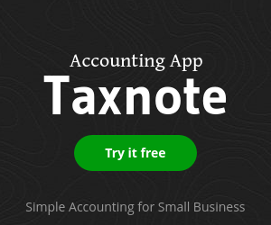

I am an indie iPhone developer, and I’ve been working for 3 hours everyday for almost 2 years now. It may not work for everybody, but I started this habit in early 2014, and I have continued to do it since have I found that this is the most productive way to work for me.  

我是一名独立 iPhone 开发人员，每天工作 3 小时已经坚持了近两年。也许这并不适合所有人，但我从 2014 年初开始养成这个习惯，并一直坚持到现在，因为我发现这是我最有效的工作方式。

## Taleb and DHH advices  

塔勒布和 DHH 的建议

I first got this idea when I watched the talk by DHH (Rails creator) in the startup school.  

我第一次有这样的想法，是在初创企业学校观看 DHH（Rails 的创建者）的演讲时。

He was saying this:  

他是这么说的

> “Working long hours isn’t productive at all, if you work for 8 hours, try for 5 hours, or only for 4 hours. If you only have that time to work, you don’t have time to see Twitter while working.”  
> 
> "长时间工作根本没有生产力，如果你工作 8 小时，那就试着工作 5 小时，或者只工作 4 小时。如果你只有这些时间工作，你就没有时间在工作的同时看微博了"。

<iframe width="420" height="315" src="https://www.youtube.com/embed/0CDXJ6bMkMY" frameborder="0" allowfullscreen=""></iframe>

Also, when I read the book [Antifragile](http://www.amazon.com/Antifragile-Things-That-Disorder-Incerto/dp/0812979680) by Taleb, he mentioned that the trick to working in a productive way over a long period of time is to only work for a short amount of time every day.  

此外，当我读塔勒布的《反脆弱》一书时，他提到长期高效工作的诀窍是每天只工作很短的时间。

Making money on the App Store is really tough, and people don’t care how many hours I spend on my apps. They only care if it is useful or not. This is a completely result oriented world, but personally, I like it.  

在 App Store 上赚钱真的很难，人们并不在乎我花了多少时间在我的应用程序上。他们只关心它是否有用。这是一个完全以结果为导向的世界，但就我个人而言，我喜欢这样。

I have always thought about how I can optimize my time to work effectively, and after I tried a lot of different ways, I found it best to limit my work time each session for the best result in the long run.  

我一直在思考如何优化我的工作时间以提高工作效率，在尝试了很多不同的方法后，我发现最好限制我每次工作的时间，这样从长远来看效果最好。

Spaces are a very important factor in UI design, and that theory holds true for working.  

空间是用户界面设计中一个非常重要的因素，这个理论在工作中也同样适用。

## Why 40 hours a week didn’t work  

每周工作 40 小时为何行不通

I can choose how I spend my time since I am making my own apps, so first I’d been searching for the most effective way to divide my work time weekly and monthly.  

我可以选择如何打发时间，因为我制作的是自己的应用程序，所以首先我一直在寻找最有效的方法来分配每周和每月的工作时间。

There is no one who orders me to work, and I can rest anytime, so I made a quota first. For example, my first quota was 40 hours a week.  

没有人命令我工作，我也可以随时休息，所以我首先制定了一个配额。比如，我的第一个定额是每周 40 小时。

I calculated my work time using a stopwatch, and I checked like “Ah, I worked for hours today”, and “I went out yesterday, so I couldn’t work, so let’s work more today”.  

我用秒表计算自己的工作时间，然后检查 "啊，我今天工作了几个小时"，"我昨天出去了，所以不能工作，今天就多工作几个小时吧"。

However, even if I work for the same amount of hours, the productivity depends on the conditions for each day. When I am tired or in a bad environment, I can’t focus. The work quality was not consistent at all.  

然而，即使工作时间相同，工作效率也取决于每天的情况。当我疲惫不堪或环境恶劣时，我就无法集中精力。工作质量根本不稳定。

Often, even if I could focus for the first few hours, the more time would go on, the less I could focus.  

通常情况下，即使我能在最初的几个小时内集中精力，但时间越长，我就越无法集中精力。

## Work short hours every day  

每天工作时间短

Then, I made a rule to work only 3 hours every day without holidays. This is a bit extreme, but in this short hour limit, you are more motivated to work harder to make your working time meaningful.  

后来，我规定每天只工作 3 小时，没有节假日。这虽然有点极端，但在这短短的一小时限制里，你会更有动力去努力工作，让你的工作时间变得更有意义。

First, the most productive time for me is after I wake up, so I need to sleep well, and start working right after I wake up. I don’t read any news or SNS because even if I only read them a little bit, it could affect my productivity because it distracts my mind.  

首先，对我来说，起床后是工作效率最高的时候，所以我要睡个好觉，起床后马上开始工作。我不看任何新闻或社交网站，因为即使只看一点点，也会影响我的工作效率，因为这会分散我的注意力。

I even disable all notifications on my iPhone before I go to bed, so I don’t see them before I start working next day.  

我甚至会在睡觉前关闭 iPhone 上的所有通知，这样我就不会在第二天开始工作前看到它们。

I prepare for each day seriously like an athlete who prepares for their games in the morning. There was a huge difference of productivity between a 9 hour work day and a 3 hour day.  

我每天都认真准备，就像运动员在早上准备比赛一样。一天工作 9 小时和一天工作 3 小时，工作效率相差悬殊。

## You really think about what to do  

你真的想过该怎么做

This was a good discovery. When you have only a short amount of time, you care about what you do more than ever.  

这是一个很好的发现。当你只有很短的时间时，你会比以往任何时候都更在意你所做的事情。

When I develop features on my apps, I think more seriously if I should do it. Is it really worth my time for today? Is this project worth doing?  

当我为自己的应用程序开发功能时，我会更认真地考虑是否应该这样做。今天的时间真的值得吗？这个项目值得做吗？

I cared about it before, but the seriousness increases when you have only a few hours to work a day.  

以前我很在意，但当你每天只有几个小时的工作时间时，认真程度就会增加。

## Less stuck for coding  

减少编码工作的困扰

When you are coding, you get stuck quite often, and it can take a lot of hours to solve it sometimes. However, with my 3 hour work day, I find that this happens less since you can’t keep digging into the issue when you don’t have enough time anyway.  

在编写代码时，你经常会遇到卡住的问题，有时可能要花费很多时间才能解决。不过，在我每天工作 3 小时的情况下，我发现这种情况发生得比较少，因为在时间不够的情况下，你不可能一直钻研这个问题。

This way, you will be able to find the solution or come up with something the next day with a different viewpoint.  

这样，你就能找到解决办法，或者第二天以不同的观点想出一些办法。

My challenge is that it is sometimes hard to go bed without solving some unknown issues, and you don’t want to stop coding in the middle of it.  

我面临的挑战是，有时不解决一些未知问题就很难上床睡觉，而你又不想中途停止编码。

Nevertheless, when you take a break from the issues, you can think like “Well, it was not worth taking so much my time anyway…” in a calm mind the next day.  

尽管如此，当你从这些问题中抽身出来时，你可以在第二天以平静的心态思考 "嗯，反正也不值得我花这么多时间......"。

## What if when you are in the zone?  

当你进入状态时怎么办？

Another pain for this method is that you should stop working anyway even when you are in the zone.  

这种方法的另一个痛苦是，即使你进入了状态，也应该停止工作。

I often feel like I want to continue working when I am in the zone for some work. But, if you extend your work time rule once, you will do it again, then the more you extend, the more your productivity will drop.  

我经常觉得，当我进入某些工作的状态时，我还想继续工作。但是，如果你延长一次工作时间，你就会再延长一次，那么你延长的越多，你的工作效率就会下降得越多。

It’s a hard trade off.  

这是一个艰难的权衡。

If I work for only a week, working more should produce more results, but when I work for a full month, the results from shorter work days will be more productive than if I was working longer days.  

如果我只工作一周，多工作应该会产生更多的成果，但当我工作一整个月时，缩短工作日所产生的成果会比延长工作日更有成效。

If I work for a year, I can complete my jobs more efficiently with this routine. I am sure I won’t retire after several years anyway.  

如果我工作一年，我可以通过这种工作方式更高效地完成工作。反正我肯定几年后也不会退休。

## Keep working until I die  

工作到死

Previously, I thought I would rather retire early and spend my life by having a fun without working at all.  

以前，我认为我宁愿早点退休，不工作也能享受生活。

With this method, I don’t get stressed so much even if I keep working years, so I thought I could keep working with fun until I die. This is the another surprising discovery I didn’t imagine before.  

有了这个方法，即使我工作几年也不会有太大的压力，所以我想我可以一直工作到死。这是我以前没有想到的另一个惊人发现。

To stop working when I want to work more every day was the best way to keep working over a long period of time. It might fit me to keep running like a marathon runner with a same pace instead of working hard and retire early.  

当我每天想工作得更多时就停止工作，这才是长期工作的最佳方式。这也许适合我像马拉松运动员一样以相同的速度继续奔跑，而不是拼命工作，早早退休。

## FAQ

I got a lot of mails after I posted this post, so I answer some popular questions here.  

在我发布这篇文章后，我收到了很多邮件，因此我在这里回答一些热门问题。

**Q: I was wondering how work other than coding fits that profile. e.g. work with designer to prepare logo or any kind of promoting – that must be a part of your work as well, right?  

例如，与设计师合作设计徽标或进行任何形式的宣传--这肯定也是你工作的一部分，对吗？  

**  

Yes, I have to do everything, including UI&UX design, marketing, supporting and so on, since I’m a solo person. The coding might be around 50% of the work time.  

是的，我必须做所有的事情，包括用户界面和用户体验设计、市场营销、支持等，因为我是一个人。编码可能占工作时间的 50% 左右。

**Q: How do you monetize?  

问：你们如何盈利？  

**  

Free to use and In-App-Purchase for upgrading for [Taxnote](http://plumshell.com/about/ "Taxnote"), [Voicepaper](https://itunes.apple.com/app/id1273954643 "Voicepaper - The Text To Speech Voice Reader"), and [Lisgo](https://apps.apple.com/app/id1273954643 "Lisgo - Web記事を耳で聞けるアプリ"). [ListTimer](https://apps.apple.com/app/id890352174 "ListTimer") and [Zeny](https://apps.apple.com/app/id862914097 "Zeny") are mostly ads based.  

免费使用，Taxnote、Voicepaper 和 Lisgo 可通过应用内购买进行升级。ListTimer 和 Zeny 主要基于广告。

**Q: Do you freelance, or are you available for hiring?  

问：你是自由职业者，还是可以聘用？  

**  

Not at the moment.  

目前没有。

**Q: What do you do with the remaining time?  

问：剩下的时间你会做什么？  

**  

I like reading and walking.  

我喜欢阅读和散步。

**Q: Does it work for a freelancer?  

问：对自由职业者有用吗？  

**  

Honestly, I don’t know, since I don’t have enough experience for that. I believe the best way to work depends on situations and preferences for each person.  

说实话，我也不知道，因为我没有足够的经验。我认为最好的工作方式取决于每个人的情况和喜好。

I might change my habit completely in the future, if I come up with a brilliant startup idea, and want to work very hard on that every day.  

如果我想出了一个绝妙的创业点子，并希望每天都为此而努力工作，那么我将来可能会彻底改变我的习惯。

I believe everyone has the right to choose how you use your time for the rest of your life. I consistently think about it too.  

我相信每个人都有权选择如何利用自己的时间度过余生。我也一直在思考这个问题。

You can check [interesting debates on HackerNews](https://news.ycombinator.com/item?id=11277033) too!  

你也可以在 HackerNews 上查看有趣的辩论！

\*I make an [Text to Speech app](https://apps.apple.com/app/id1273954643), [one-tap timer](http://listtimer.com/) and more. [About Me](http://plumshell.com/about/).  

\*我制作了文字转语音应用程序、一键定时器等。关于我

 
